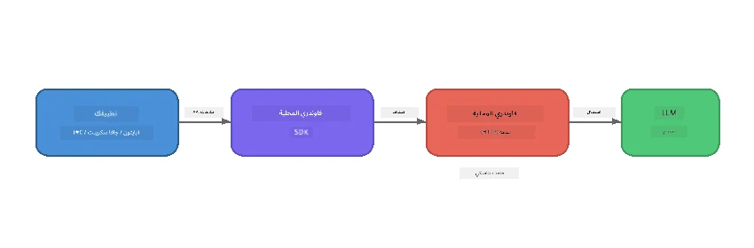

# الجزء 1: البدء مع Foundry Local


## ما هو Foundry Local؟

يتيح لك [Foundry Local](https://foundrylocal.ai) تشغيل نماذج الذكاء الاصطناعي مفتوحة المصدر **مباشرة على جهاز الكمبيوتر الخاص بك** - بدون الحاجة إلى الإنترنت، وبدون تكاليف السحابة، مع خصوصية بيانات كاملة. إنه:

- **يقوم بتنزيل وتشغيل النماذج محليًا** مع تحسين تلقائي للأجهزة (GPU، CPU، أو NPU)
- **يوفر واجهة برمجة تطبيقات متوافقة مع OpenAI** بحيث يمكنك استخدام SDKs والأدوات المألوفة لديك
- **لا يتطلب اشتراك Azure** أو تسجيل - فقط قم بالتثبيت وابدأ في البناء

فكر فيه كأن لديك ذكاء اصطناعي خاص بك يعمل بالكامل على جهازك.

## أهداف التعلم

بحلول نهاية هذا المختبر ستتمكن من:

- تثبيت CLI الخاص بـ Foundry Local على نظام التشغيل الخاص بك
- فهم ما هي الأسماء المستعارة للنماذج وكيفية عملها
- تنزيل وتشغيل أول نموذج ذكاء اصطناعي محلي لديك
- إرسال رسالة دردشة إلى نموذج محلي من سطر الأوامر
- فهم الفرق بين نماذج الذكاء الاصطناعي المحلية والمستضافة على السحابة

---

## المتطلبات الأساسية

### متطلبات النظام

| المتطلب | الحد الأدنى | الموصى به |
|-------------|---------|-------------|
| **الذاكرة العشوائية (RAM)** | 8 جيجابايت | 16 جيجابايت |
| **مساحة التخزين** | 5 جيجابايت (للنماذج) | 10 جيجابايت |
| **المعالج (CPU)** | 4 أنوية | 8+ أنوية |
| **بطاقة الرسومات (GPU)** | اختياري | NVIDIA مع CUDA 11.8+ |
| **نظام التشغيل** | Windows 10/11 (x64/ARM) ، Windows Server 2025 ، macOS 13+ | - |

> **ملاحظة:** يقوم Foundry Local تلقائيًا باختيار أفضل نسخة من النموذج لجهازك. إذا كان لديك بطاقة NVIDIA GPU، فإنه يستخدم تسريع CUDA. إذا كان لديك Qualcomm NPU، فإنه يستخدمها. وإلا فإنه يعود إلى نسخة محسنة لمعالج CPU.

### تثبيت Foundry Local CLI

**ويندوز** (PowerShell):
```powershell
winget install Microsoft.FoundryLocal
```

**ماك أو إس** (Homebrew):
```bash
brew tap microsoft/foundrylocal
brew install foundrylocal
```

> **ملاحظة:** يدعم Foundry Local حاليًا نظامي Windows وmacOS فقط. نظام Linux غير مدعوم في الوقت الحالي.

تحقق من التثبيت:
```bash
foundry --version
```

---

## تمارين المختبر

### التمرين 1: استكشاف النماذج المتاحة

يحتوي Foundry Local على كتالوج للنماذج مفتوحة المصدر المحسنة مسبقًا. قم بسردها:

```bash
foundry model list
```

سترى نماذج مثل:
- `phi-3.5-mini` - نموذج Microsoft بـ 3.8 مليار معامل (سريع، جودة جيدة)
- `phi-4-mini` - نموذج Phi الأحدث والأكثر قدرة
- `phi-4-mini-reasoning` - نموذج Phi مع استدلال تسلسلي (`<think>` tags)
- `phi-4` - أكبر نموذج Phi من Microsoft (10.4 جيجابايت)
- `qwen2.5-0.5b` - صغير جدًا وسريع (مناسب للأجهزة ذات الموارد المحدودة)
- `qwen2.5-7b` - نموذج عام قوي مع دعم لاستدعاء الأدوات
- `qwen2.5-coder-7b` - مُحسّن لتوليد الشفرات البرمجية
- `deepseek-r1-7b` - نموذج قوي للاستدلال
- `gpt-oss-20b` - نموذج مفتوح المصدر كبير (رخصة MIT ، 12.5 جيجابايت)
- `whisper-base` - تحويل الكلام إلى نص (383 ميجابايت)
- `whisper-large-v3-turbo` - نسخ عالي الدقة (9 جيجابايت)

> **ما هو الاسم المستعار للنموذج؟** الأسماء المستعارة مثل `phi-3.5-mini` هي اختصارات. عند استخدام اسم مستعار، يقوم Foundry Local تلقائيًا بتنزيل أفضل نسخة تناسب جهازك (CUDA لـ NVIDIA GPUs، نسخة محسنة للمعالج CPU خلاف ذلك). لست بحاجة للقلق بشأن اختيار النسخة الصحيحة.

### التمرين 2: تشغيل نموذجك الأول

قم بتنزيل وابدأ الدردشة مع نموذج بشكل تفاعلي:

```bash
foundry model run phi-3.5-mini
```

عند تشغيل هذا لأول مرة، سيقوم Foundry Local بـ:
1. الكشف عن أجهزتك
2. تنزيل النسخة المثلى من النموذج (قد يستغرق عدة دقائق)
3. تحميل النموذج في الذاكرة
4. بدء جلسة دردشة تفاعلية

جرب طرح بعض الأسئلة عليه:
```
You: What is the golden ratio?
You: Can you explain it as if I were 10 years old?
You: Write a haiku about mathematics
```

اكتب `exit` أو اضغط `Ctrl+C` للخروج.

### التمرين 3: تنزيل نموذج مسبقًا

إذا أردت تنزيل نموذج بدون بدء الدردشة:

```bash
foundry model download phi-3.5-mini
```

تحقق من النماذج التي تم تنزيلها مسبقًا على جهازك:

```bash
foundry cache list
```

### التمرين 4: فهم البنية المعمارية

يعمل Foundry Local كـ **خدمة HTTP محلية** تعرض واجهة REST API متوافقة مع OpenAI. هذا يعني:

1. تبدأ الخدمة على **منفذ ديناميكي** (منفذ مختلف في كل مرة)
2. تستخدم SDK لاكتشاف عنوان نقطة النهاية الفعلية
3. يمكنك استخدام **أي** مكتبة عميل متوافقة مع OpenAI للتواصل معها



> **مهم:** يقوم Foundry Local بتعيين **منفذ ديناميكي** في كل مرة يبدأ فيها. لا تقم أبدًا بتثبيت رقم منفذ مثل `localhost:5272`. استخدم دائمًا SDK لاكتشاف العنوان الحالي (مثل `manager.endpoint` في بايثون أو `manager.urls[0]` في جافاسكريبت).

---

## النقاط الرئيسية

| المفهوم | ما تعلمته |
|---------|-----------|
| الذكاء الاصطناعي على الجهاز | يدير Foundry Local النماذج كاملة على جهازك بدون سحابة، أو مفاتيح API، أو تكاليف |
| الأسماء المستعارة للنماذج | الأسماء المستعارة مثل `phi-3.5-mini` تختار تلقائيًا أفضل نسخة تناسب جهازك |
| المنافذ الديناميكية | الخدمة تعمل على منفذ ديناميكي؛ استخدم SDK دائمًا لاكتشاف نقطة النهاية |
| CLI و SDK | يمكنك التفاعل مع النماذج عبر CLI (`foundry model run`) أو برمجيًا عبر SDK |

---

## الخطوات التالية

تابع إلى [الجزء 2: الغوص العميق في Foundry Local SDK](part2-foundry-local-sdk.md) لإتقان واجهة برمجة التطبيقات SDK لإدارة النماذج، الخدمات، والتخزين المؤقت برمجيًا.

---

<!-- CO-OP TRANSLATOR DISCLAIMER START -->
**تنويه**:
تمت ترجمة هذا المستند باستخدام خدمة الترجمة الآلية [Co-op Translator](https://github.com/Azure/co-op-translator). بينما نسعى إلى الدقة، يرجى العلم أن الترجمات الآلية قد تحتوي على أخطاء أو عدم دقة. يجب اعتبار المستند الأصلي بلغته الأصلية المصدر الرسمي والموثوق. للمعلومات الحرجة، يُنصح بالترجمة المهنية البشرية. نحن غير مسؤولين عن أي سوء فهم أو تفسير ناتج عن استخدام هذه الترجمة.
<!-- CO-OP TRANSLATOR DISCLAIMER END -->