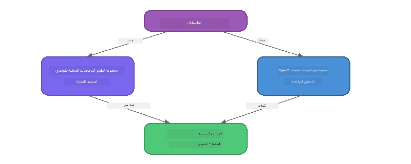

# الجزء 3: استخدام Foundry Local SDK مع OpenAI

## نظرة عامة

في الجزء 1 استخدمت Foundry Local CLI لتشغيل النماذج بشكل تفاعلي. في الجزء 2 استكشفت كامل واجهة برمجة التطبيقات SDK. الآن ستتعلم كيفية **دمج Foundry Local في تطبيقاتك** باستخدام SDK وواجهة برمجة التطبيقات المتوافقة مع OpenAI.

يوفر Foundry Local SDKs لثلاث لغات برمجة. اختر اللغة التي تشعر بالراحة معها - المفاهيم متطابقة عبر الثلاثة.

## أهداف التعلم

بحلول نهاية هذا المختبر ستكون قادرًا على:

- تثبيت Foundry Local SDK للّغة التي تختارها (Python أو JavaScript أو C#)
- تهيئة `FoundryLocalManager` لبدء الخدمة، التحقق من الكاش، تحميل وتنزيل النموذج
- الاتصال بالنموذج المحلي باستخدام OpenAI SDK
- إرسال إكمالات المحادثة ومعالجة الاستجابات المتدفقة
- فهم بنية المنفذ الديناميكي

---

## المتطلبات الأساسية

أكمل أولاً [الجزء 1: البدء مع Foundry Local](part1-getting-started.md) و [الجزء 2: الغوص العميق في Foundry Local SDK](part2-foundry-local-sdk.md).

ثبت **واحدًا** من بيئات تشغيل اللغات التالية:
- **Python 3.9+** - [python.org/downloads](https://www.python.org/downloads/)
- **Node.js 18+** - [nodejs.org](https://nodejs.org/)
- **.NET 9.0+** - [dot.net/download](https://dotnet.microsoft.com/download)

---

## المفهوم: كيف يعمل SDK

يدير Foundry Local SDK **مستوى التحكم** (بدء الخدمة، تحميل النماذج)، بينما يدير OpenAI SDK **مستوى البيانات** (إرسال الإيعازات، استقبال الإكمالات).



---

## تمارين المختبر

### التمرين 1: إعداد بيئتك

<details>
<summary><b>🐍 Python</b></summary>

```bash
cd python
python -m venv venv

# تفعيل البيئة الافتراضية:
# ويندوز (بوويرشيل):
venv\Scripts\Activate.ps1
# ويندوز (موجه الأوامر):
venv\Scripts\activate.bat
# ماك أو إس:
source venv/bin/activate

pip install -r requirements.txt
```

يقوم ملف `requirements.txt` بتثبيت:
- `foundry-local-sdk` - مكتبة Foundry Local SDK (يتم استيرادها كـ `foundry_local`)
- `openai` - مكتبة OpenAI للبايثون
- `agent-framework` - إطار عمل Microsoft Agent (يستخدم في الأجزاء اللاحقة)

</details>

<details>
<summary><b>📘 JavaScript</b></summary>

```bash
cd javascript
npm install
```

يقوم ملف `package.json` بتثبيت:
- `foundry-local-sdk` - مكتبة Foundry Local SDK
- `openai` - مكتبة OpenAI لـ Node.js

</details>

<details>
<summary><b>💜 C#</b></summary>

```bash
cd csharp
dotnet restore
dotnet build
```

يستخدم مشروع `csharp.csproj`:
- `Microsoft.AI.Foundry.Local` - مكتبة Foundry Local SDK (NuGet)
- `OpenAI` - مكتبة OpenAI لـ C# (NuGet)

> **هيكل المشروع:** يستخدم مشروع C# موجه أوامر في `Program.cs` يقوم بتوجيه الطلبات إلى ملفات أمثلة منفصلة. شغل `dotnet run chat` (أو فقط `dotnet run`) لهذا الجزء. الأجزاء الأخرى تستخدم `dotnet run rag` و `dotnet run agent` و `dotnet run multi`.

</details>

---

### التمرين 2: إكمال المحادثة الأساسي

افتح المثال الأساسي للمحادثة للّغة التي تستخدمها وفحص الكود. كل سكربت يتبع نفس النمط المكون من ثلاث خطوات:

1. **بدء الخدمة** - `FoundryLocalManager` يشغل بيئة Foundry Local للتشغيل
2. **تنزيل وتحميل النموذج** - تحقق من وجود النموذج بالكاش، حمّله إذا لم يكن موجودًا، ثم ارفعه للذاكرة
3. **إنشاء عميل OpenAI** - اتصل بالنقطة النهاية المحلية وأرسل إكمال محادثة متدفقة

<details>
<summary><b>🐍 Python - <code>python/foundry-local.py</code></b></summary>

```python
import sys
import openai
from foundry_local import FoundryLocalManager

alias = "phi-3.5-mini"

# الخطوة 1: إنشاء FoundryLocalManager وبدء الخدمة
print("Starting Foundry Local service...")
manager = FoundryLocalManager()
manager.start_service()

# الخطوة 2: التحقق مما إذا كان النموذج قد تم تنزيله بالفعل
cached = manager.list_cached_models()
catalog_info = manager.get_model_info(alias)
is_cached = any(m.id == catalog_info.id for m in cached) if catalog_info else False

if is_cached:
    print(f"Model already downloaded: {alias}")
else:
    print(f"Downloading model: {alias} (this may take several minutes)...")
    manager.download_model(alias)
    print(f"Download complete: {alias}")

# الخطوة 3: تحميل النموذج في الذاكرة
print(f"Loading model: {alias}...")
manager.load_model(alias)

# إنشاء عميل OpenAI يشير إلى خدمة Foundry المحلية
client = openai.OpenAI(
    base_url=manager.endpoint,   # منفذ ديناميكي - لا تقم بالتشفير الصلب أبداً!
    api_key=manager.api_key
)

# توليد إكمال محادثة بث مباشر
stream = client.chat.completions.create(
    model=manager.get_model_info(alias).id,
    messages=[{"role": "user", "content": "What is the golden ratio?"}],
    stream=True,
)

for chunk in stream:
    if chunk.choices[0].delta.content is not None:
        print(chunk.choices[0].delta.content, end="", flush=True)
print()
```

**شغّله:**
```bash
python foundry-local.py
```

</details>

<details>
<summary><b>📘 JavaScript - <code>javascript/foundry-local.mjs</code></b></summary>

```javascript
import { OpenAI } from "openai";
import { FoundryLocalManager } from "foundry-local-sdk";

const alias = "phi-3.5-mini";

// الخطوة 1: ابدأ خدمة Foundry المحلية
console.log("Starting Foundry Local service...");
FoundryLocalManager.create({ appName: "FoundryLocalWorkshop" });
const manager = FoundryLocalManager.instance;
await manager.startWebService();

// الخطوة 2: تحقق مما إذا كان النموذج محمّلًا بالفعل
const catalog = manager.catalog;
const model = await catalog.getModel(alias);

if (model.isCached) {
  console.log(`Model already downloaded: ${alias}`);
} else {
  console.log(`Downloading model: ${alias} (this may take several minutes)...`);
  await model.download();
  console.log(`Download complete: ${alias}`);
}

// الخطوة 3: حمل النموذج في الذاكرة
console.log(`Loading model: ${alias}...`);
await model.load();
console.log(`Model loaded: ${model.id}`);

// إنشاء عميل OpenAI يشير إلى خدمة Foundry المحلية
const client = new OpenAI({
  baseURL: manager.urls[0] + "/v1",   // منفذ ديناميكي - لا تقم بتحديده صلبًا أبدًا!
  apiKey: "foundry-local",
});

// توليد إكمال دردشة متدفقة
const stream = await client.chat.completions.create({
  model: model.id,
  messages: [{ role: "user", content: "What is the golden ratio?" }],
  stream: true,
});

for await (const chunk of stream) {
  if (chunk.choices[0]?.delta?.content) {
    process.stdout.write(chunk.choices[0].delta.content);
  }
}
console.log();
```

**شغّله:**
```bash
node foundry-local.mjs
```

</details>

<details>
<summary><b>💜 C# - <code>csharp/BasicChat.cs</code></b></summary>

```csharp
using Microsoft.AI.Foundry.Local;
using Microsoft.Extensions.Logging.Abstractions;
using OpenAI;
using OpenAI.Chat;
using System.ClientModel;

var alias = "phi-3.5-mini";

// Step 1: Start the Foundry Local service
Console.WriteLine("Starting Foundry Local service...");
await FoundryLocalManager.CreateAsync(
    new Configuration
    {
        AppName = "FoundryLocalSamples",
        Web = new Configuration.WebService { Urls = "http://127.0.0.1:0" }
    }, NullLogger.Instance, default);
var manager = FoundryLocalManager.Instance;
await manager.StartWebServiceAsync(default);

// Step 2: Get the model from the catalog
var catalog = await manager.GetCatalogAsync(default);
var model = await catalog.GetModelAsync(alias, default);

// Step 3: Check if the model is already downloaded
var isCached = await model.IsCachedAsync(default);

if (isCached)
{
    Console.WriteLine($"Model already downloaded: {alias}");
}
else
{
    Console.WriteLine($"Downloading model: {alias} (this may take several minutes)...");
    await model.DownloadAsync(null, default);
    Console.WriteLine($"Download complete: {alias}");
}

// Step 4: Load the model into memory
Console.WriteLine($"Loading model: {alias}...");
await model.LoadAsync(default);
Console.WriteLine($"Loaded model: {model.Id}");
Console.WriteLine($"Endpoint: {manager.Urls[0]}");

// Create OpenAI client pointing to the LOCAL Foundry service
var key = new ApiKeyCredential("foundry-local");
var client = new OpenAIClient(key, new OpenAIClientOptions
{
    Endpoint = new Uri(manager.Urls[0] + "/v1")  // Dynamic port - never hardcode!
});

var chatClient = client.GetChatClient(model.Id);

// Stream a chat completion
var completionUpdates = chatClient.CompleteChatStreaming("What is the golden ratio?");

foreach (var update in completionUpdates)
{
    if (update.ContentUpdate.Count > 0)
    {
        Console.Write(update.ContentUpdate[0].Text);
    }
}
Console.WriteLine();
```

**شغّله:**
```bash
dotnet run chat
```

</details>

---

### التمرين 3: تجربة مع الإيعازات

بمجرد تشغيل المثال الأساسي، حاول تعديل الكود:

1. **تغيير رسالة المستخدم** - جرّب أسئلة مختلفة
2. **إضافة إيعاز نظام** - امنح النموذج شخصية
3. **إيقاف التدفق** - اضبط `stream=False` واطبع الاستجابة كاملة دفعة واحدة
4. **جرّب نموذجًا مختلفًا** - غير الاسم المستعار من `phi-3.5-mini` إلى نموذج آخر من `foundry model list`

<details>
<summary><b>🐍 Python</b></summary>

```python
# أضف موجه نظام - امنح النموذج شخصية:
stream = client.chat.completions.create(
    model=manager.get_model_info(alias).id,
    messages=[
        {"role": "system", "content": "You are a pirate. Answer everything in pirate speak."},
        {"role": "user", "content": "What is the golden ratio?"}
    ],
    stream=True,
)

# أو قم بإيقاف البث المباشر:
response = client.chat.completions.create(
    model=manager.get_model_info(alias).id,
    messages=[{"role": "user", "content": "What is the golden ratio?"}],
    stream=False,
)
print(response.choices[0].message.content)
```

</details>

<details>
<summary><b>📘 JavaScript</b></summary>

```javascript
// أضف موجه نظام - امنح النموذج شخصية:
const stream = await client.chat.completions.create({
  model: modelInfo.id,
  messages: [
    { role: "system", content: "You are a pirate. Answer everything in pirate speak." },
    { role: "user", content: "What is the golden ratio?" },
  ],
  stream: true,
});

// أو قم بإيقاف البث المباشر:
const response = await client.chat.completions.create({
  model: modelInfo.id,
  messages: [{ role: "user", content: "What is the golden ratio?" }],
  stream: false,
});
console.log(response.choices[0].message.content);
```

</details>

<details>
<summary><b>💜 C#</b></summary>

```csharp
// Add a system prompt - give the model a persona:
var completionUpdates = chatClient.CompleteChatStreaming(
    new ChatMessage[]
    {
        new SystemChatMessage("You are a pirate. Answer everything in pirate speak."),
        new UserChatMessage("What is the golden ratio?")
    }
);

// Or turn off streaming:
var response = chatClient.CompleteChat("What is the golden ratio?");
Console.WriteLine(response.Value.Content[0].Text);
```

</details>

---

### مرجع طرق SDK

<details>
<summary><b>🐍 طرق Python SDK</b></summary>

| الطريقة | الغرض |
|--------|---------|
| `FoundryLocalManager()` | إنشاء نسخة من المدير |
| `manager.start_service()` | بدء خدمة Foundry Local |
| `manager.list_cached_models()` | قائمة النماذج المحملة على جهازك |
| `manager.get_model_info(alias)` | الحصول على معرّف النموذج وبياناته الوصفية |
| `manager.download_model(alias, progress_callback=fn)` | تحميل نموذج مع استدعاء تقدم اختياري |
| `manager.load_model(alias)` | تحميل نموذج في الذاكرة |
| `manager.endpoint` | الحصول على عنوان نقطة النهاية الديناميكية |
| `manager.api_key` | الحصول على مفتاح API (مكان مخصص للاستخدام المحلي) |

</details>

<details>
<summary><b>📘 طرق JavaScript SDK</b></summary>

| الطريقة | الغرض |
|--------|---------|
| `FoundryLocalManager.create({ appName })` | إنشاء نسخة من المدير |
| `FoundryLocalManager.instance` | الوصول إلى المدير المفرد |
| `await manager.startWebService()` | بدء خدمة Foundry Local |
| `await manager.catalog.getModel(alias)` | الحصول على نموذج من الكتالوج |
| `model.isCached` | التحقق مما إذا كان النموذج محمّلًا بالفعل |
| `await model.download()` | تحميل نموذج |
| `await model.load()` | تحميل نموذج في الذاكرة |
| `model.id` | الحصول على معرّف النموذج لاستدعاءات OpenAI API |
| `manager.urls[0] + "/v1"` | الحصول على عنوان نقطة النهاية الديناميكية |
| `"foundry-local"` | مفتاح API (مكان مخصص للاستخدام المحلي) |

</details>

<details>
<summary><b>💜 طرق C# SDK</b></summary>

| الطريقة | الغرض |
|--------|---------|
| `FoundryLocalManager.CreateAsync(config)` | إنشاء وتهيئة المدير |
| `manager.StartWebServiceAsync()` | بدء خدمة Foundry Local للويب |
| `manager.GetCatalogAsync()` | الحصول على كتالوج النماذج |
| `catalog.ListModelsAsync()` | سرد كل النماذج المتاحة |
| `catalog.GetModelAsync(alias)` | الحصول على نموذج محدد عبر الاسم المستعار |
| `model.IsCachedAsync()` | التحقق من تنزيل النموذج |
| `model.DownloadAsync()` | تحميل النموذج |
| `model.LoadAsync()` | تحميل النموذج في الذاكرة |
| `manager.Urls[0]` | الحصول على عنوان نقطة النهاية الديناميكية |
| `new ApiKeyCredential("foundry-local")` | بيانات اعتماد مفتاح API للاستعمال المحلي |

</details>

---

### التمرين 4: استخدام ChatClient الأصلي (بديل لـ OpenAI SDK)

في التمرينين 2 و3 استخدمت OpenAI SDK لإكمالات المحادثة. توفر SDKs الخاصة بـ JavaScript و C# أيضاً **ChatClient أصلي** يلغي الحاجة لـ OpenAI SDK بالكامل.

<details>
<summary><b>📘 JavaScript - <code>model.createChatClient()</code></b></summary>

```javascript
import { FoundryLocalManager } from "foundry-local-sdk";

const alias = "phi-3.5-mini";

FoundryLocalManager.create({ appName: "ChatClientDemo" });
const manager = FoundryLocalManager.instance;
await manager.startWebService();

const model = await manager.catalog.getModel(alias);
if (!model.isCached) await model.download();
await model.load();

// لا حاجة لاستيراد OpenAI — احصل على عميل مباشرة من النموذج
const chatClient = model.createChatClient();

// إكمال غير متدفق
const response = await chatClient.completeChat([
  { role: "system", content: "You are a pirate. Answer everything in pirate speak." },
  { role: "user", content: "What is the golden ratio?" }
]);
console.log(response.choices[0].message.content);

// إكمال متدفق (يستخدم نمط رد النداء)
await chatClient.completeStreamingChat(
  [{ role: "user", content: "What is the golden ratio?" }],
  (chunk) => {
    if (chunk.choices?.[0]?.delta?.content) {
      process.stdout.write(chunk.choices[0].delta.content);
    }
  }
);
console.log();
```

> **ملاحظة:** يستخدم دالة `completeStreamingChat()` للـ ChatClient نمط **استدعاء الوظائف** callback وليس مكررًا غير متزامن. قم بتمرير دالة كوسيط ثاني.

</details>

<details>
<summary><b>💜 C# - <code>model.GetChatClientAsync()</code></b></summary>

```csharp
var catalog = await manager.GetCatalogAsync(default);
var model = await catalog.GetModelAsync("phi-3.5-mini", default);
if (!await model.IsCachedAsync(default))
    await model.DownloadAsync(null, default);
await model.LoadAsync(default);

// No OpenAI NuGet needed — get a client directly from the model
var chatClient = await model.GetChatClientAsync(default);

// Use it like a standard OpenAI ChatClient
var response = chatClient.CompleteChat("What is the golden ratio?");
Console.WriteLine(response.Value.Content[0].Text);
```

</details>

> **متى تستخدم أيهما:**
> | النهج | الأفضل لـ |
> |----------|----------|
> | OpenAI SDK | تحكم كامل بالمعاملات، تطبيقات الإنتاج، الكود القائم على OpenAI |
> | ChatClient الأصلي | النموذج الأولي السريع، اعتمادات أقل، إعداد أبسط |

---

## النقاط الأساسية

| المفهوم | ما تعلمته |
|---------|------------------|
| مستوى التحكم | يدير Foundry Local SDK بدء الخدمة وتحميل النماذج |
| مستوى البيانات | يدير OpenAI SDK إكمالات الدردشة والتدفق |
| المنافذ الديناميكية | استخدم دائمًا SDK لاكتشاف نقطة النهاية؛ لا تستخدم عناوين URL ثابتة |
| عبر اللغات | نفس نمط الكود يعمل عبر Python وJavaScript وC# |
| التوافق مع OpenAI | التوافق الكامل مع OpenAI API يعني أن الكود القائم على OpenAI يعمل مع تغييرات طفيفة |
| ChatClient الأصلي | `createChatClient()` (JS) / `GetChatClientAsync()` (C#) توفر بديلاً لـ OpenAI SDK |

---

## الخطوات التالية

واصل إلى [الجزء 4: بناء تطبيق RAG](part4-rag-fundamentals.md) لتتعلم كيفية بناء خط إنتاج استرجاع المعلومات المعزز بالتوليد يعمل كليًا على جهازك.

---

<!-- CO-OP TRANSLATOR DISCLAIMER START -->
**تنويه**:
تمت ترجمة هذا المستند باستخدام خدمة الترجمة الآلية [Co-op Translator](https://github.com/Azure/co-op-translator). بينما نسعى لتحقيق الدقة، يرجى العلم أن الترجمات الآلية قد تحتوي على أخطاء أو عدم دقة. يجب اعتبار المستند الأصلي بلغته الأصلية المصدر الموثوق. للمعلومات الحرجة، يُنصح بالاستعانة بترجمة احترافية بشرية. نحن غير مسؤولين عن أي سوء فهم أو تفسير ناتج عن استخدام هذه الترجمة.
<!-- CO-OP TRANSLATOR DISCLAIMER END -->