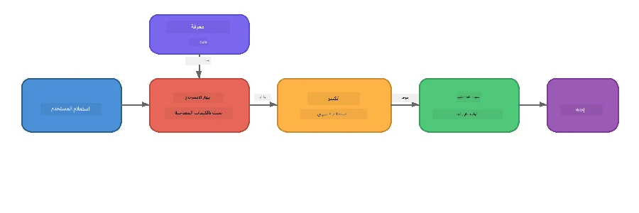

# الجزء 4: بناء تطبيق RAG باستخدام Foundry Local

## نظرة عامة

نماذج اللغة الكبيرة قوية، لكنها تعرف فقط ما كان موجوداً في بيانات تدريبها. حل **توليد معزز بالإسترجاع (RAG)** هذه المشكلة من خلال تقديم سياق ذي صلة للنموذج عند وقت الاستعلام - مأخوذ من مستنداتك الخاصة أو قواعد بياناتك أو قواعد معرفتك.

في هذا المختبر ستقوم ببناء خط أنابيب RAG كامل يعمل **كلياً على جهازك** باستخدام Foundry Local. لا خدمات سحابية، لا قواعد بيانات متجهة، لا API للتضمين - فقط استرجاع محلي ونموذج محلي.

## أهداف التعلم

بنهاية هذا المختبر ستتمكن من:

- شرح ماهية RAG ولماذا هي مهمة لتطبيقات الذكاء الاصطناعي
- بناء قاعدة معرفة محلية من مستندات نصية
- تنفيذ وظيفة استرجاع بسيطة للعثور على السياق المناسب
- تأليف موجه نظام يؤسس النموذج على الحقائق المسترجعة
- تشغيل خط أنابيب الاسترجاع → التعزيز → التوليد الكامل على الجهاز
- فهم المكاسب والتنازلات بين استرجاع الكلمات المفتاحية البسيط والبحث بالمتجهات

---

## المتطلبات الأساسية

- إكمال [الجزء 3: استخدام Foundry Local SDK مع OpenAI](part3-sdk-and-apis.md)
- تثبيت Foundry Local CLI وتنزيل نموذج `phi-3.5-mini`

---

## المفهوم: ما هو RAG؟

بدون RAG، يمكن لنموذج اللغة الكبير الإجابة فقط بناءً على بيانات تدريبه - والتي قد تكون قديمة أو ناقصة أو تفتقر إلى معلوماتك الخاصة:

```
User: "What is Zava's return policy?"
LLM:  "I do not have information about Zava's return policy."  ← No context!
```

مع RAG، تقوم أولاً **باسترجاع** المستندات ذات الصلة، ثم **تعزيز** الموجه بذلك السياق قبل **توليد** الرد:



الفكرة الأساسية: **النموذج لا يحتاج أن "يعرف" الإجابة؛ بل يحتاج فقط إلى قراءة المستندات الصحيحة.**

---

## تمارين المختبر

### التمرين 1: فهم قاعدة المعرفة

افتح مثال RAG للغتك وافحص قاعدة المعرفة:

<details>
<summary><b>🐍 بايثون: <code>python/foundry-local-rag.py</code></b></summary>

قاعدة المعرفة هي قائمة بسيطة من قواميس تحتوي على حقول `title` و `content`:

```python
KNOWLEDGE_BASE = [
    {
        "title": "Foundry Local Overview",
        "content": (
            "Foundry Local brings the power of Azure AI Foundry to your local "
            "device without requiring an Azure subscription..."
        ),
    },
    {
        "title": "Supported Hardware",
        "content": (
            "Foundry Local automatically selects the best model variant for "
            "your hardware. If you have an Nvidia CUDA GPU it downloads the "
            "CUDA-optimized model..."
        ),
    },
    # ... المزيد من الإدخالات
]
```

كل إدخال يمثل "قطعة" من المعرفة - جزء مركز من المعلومات حول موضوع واحد.

</details>

<details>
<summary><b>📘 جافاسكربت: <code>javascript/foundry-local-rag.mjs</code></b></summary>

قاعدة المعرفة تستخدم نفس الهيكل كمصفوفة من الكائنات:

```javascript
const KNOWLEDGE_BASE = [
  {
    title: "Foundry Local Overview",
    content:
      "Foundry Local brings the power of Azure AI Foundry to your local " +
      "device without requiring an Azure subscription...",
  },
  {
    title: "Supported Hardware",
    content:
      "Foundry Local automatically selects the best model variant for " +
      "your hardware...",
  },
  // ... المزيد من الإدخالات
];
```

</details>

<details>
<summary><b>💜 سي#: <code>csharp/RagPipeline.cs</code></b></summary>

قاعدة المعرفة تستخدم قائمة من الصفوف المسماة:

```csharp
private static readonly List<(string Title, string Content)> KnowledgeBase =
[
    ("Foundry Local Overview",
     "Foundry Local brings the power of Azure AI Foundry to your local " +
     "device without requiring an Azure subscription..."),

    ("Supported Hardware",
     "Foundry Local automatically selects the best model variant for " +
     "your hardware..."),

    // ... more entries
];
```

</details>

> **في تطبيق حقيقي**، تأتي قاعدة المعرفة من ملفات على القرص أو قاعدة بيانات أو فهرس بحث أو API. في هذا المختبر، نستخدم قائمة في الذاكرة للحفاظ على البساطة.

---

### التمرين 2: فهم وظيفة الاسترجاع

خطوة الاسترجاع تجد القطع الأكثر صلة لسؤال المستخدم. يستخدم هذا المثال **تداخل الكلمات المفتاحية** - عد عدد الكلمات في الاستعلام التي تظهر أيضاً في كل قطعة:

<details>
<summary><b>🐍 بايثون</b></summary>

```python
def retrieve(query: str, top_k: int = 2) -> list[dict]:
    """Return the top-k knowledge chunks most relevant to the query."""
    query_words = set(query.lower().split())
    scored = []
    for chunk in KNOWLEDGE_BASE:
        chunk_words = set(chunk["content"].lower().split())
        overlap = len(query_words & chunk_words)
        scored.append((overlap, chunk))
    scored.sort(key=lambda x: x[0], reverse=True)
    return [item[1] for item in scored[:top_k]]
```

</details>

<details>
<summary><b>📘 جافاسكربت</b></summary>

```javascript
function retrieve(query, topK = 2) {
  const queryWords = new Set(query.toLowerCase().split(/\s+/));
  const scored = KNOWLEDGE_BASE.map((chunk) => {
    const chunkWords = new Set(chunk.content.toLowerCase().split(/\s+/));
    let overlap = 0;
    for (const w of queryWords) {
      if (chunkWords.has(w)) overlap++;
    }
    return { overlap, chunk };
  });
  scored.sort((a, b) => b.overlap - a.overlap);
  return scored.slice(0, topK).map((s) => s.chunk);
}
```

</details>

<details>
<summary><b>💜 سي#</b></summary>

```csharp
private static List<(string Title, string Content)> Retrieve(string query, int topK = 2)
{
    var queryWords = new HashSet<string>(
        query.ToLowerInvariant().Split(' ', StringSplitOptions.RemoveEmptyEntries));

    return KnowledgeBase
        .Select(chunk =>
        {
            var chunkWords = new HashSet<string>(
                chunk.Content.ToLowerInvariant().Split(' ', StringSplitOptions.RemoveEmptyEntries));
            var overlap = queryWords.Intersect(chunkWords).Count();
            return (Overlap: overlap, Chunk: chunk);
        })
        .OrderByDescending(x => x.Overlap)
        .Take(topK)
        .Select(x => x.Chunk)
        .ToList();
}
```

</details>

**كيفية عملها:**
1. قسّم الاستعلام إلى كلمات فردية
2. لكل قطعة معرفة، عد كم كلمة استعلام تظهر في تلك القطعة
3. رتب حسب درجة التداخل (الأعلى أولاً)
4. أعد أعلى-k قطع ذات الصلة

> **المقايضة:** تداخل الكلمات المفتاحية بسيط لكنه محدود؛ لا يفهم المرادفات أو المعنى. أنظمة RAG الإنتاجية عادةً تستخدم **متجهات التضمين** و **قواعد بيانات متجهة** للبحث الدلالي. مع ذلك، التداخل بالكلمات المفتاحية نقطة انطلاق ممتازة ولا تحتاج تبعيات إضافية.

---

### التمرين 3: فهم الموجه المعزز

يتم حقن السياق المسترجع في **موجه النظام** قبل إرساله للنموذج:

```python
system_prompt = (
    "You are a helpful assistant. Answer the user's question using ONLY "
    "the information provided in the context below. If the context does "
    "not contain enough information, say so.\n\n"
    f"Context:\n{context_text}"
)
```

قرارات التصميم الرئيسية:
- **"فقط المعلومات المقدمة"** - تمنع النموذج من تخيل حقائق غير موجودة في السياق
- **"إذا لم يحتوي السياق على معلومات كافية، فقل ذلك"** - يشجع على إجابات "لا أعرف" صادقة
- يتم وضع السياق في رسالة النظام ليؤثر على كافة الردود

---

### التمرين 4: تشغيل خط أنابيب RAG

شغل المثال الكامل:

**بايثون:**
```bash
cd python
python foundry-local-rag.py
```

**جافاسكربت:**
```bash
cd javascript
node foundry-local-rag.mjs
```

**سي#:**
```bash
cd csharp
dotnet run rag
```

يجب أن ترى ثلاثة أشياء مطبوعة:
1. **السؤال** الذي يُطرح
2. **السياق المسترجع** - القطع المختارة من قاعدة المعرفة
3. **الإجابة** - منتجة بواسطة النموذج باستخدام ذلك السياق فقط

مخرجات مثال:
```
Question: How do I install Foundry Local and what hardware does it support?

--- Retrieved Context ---
### Installation
On Windows install Foundry Local with: winget install Microsoft.FoundryLocal...

### Supported Hardware
Foundry Local automatically selects the best model variant for your hardware...
-------------------------

Answer: To install Foundry Local, you can use the following methods depending
on your operating system: On Windows, run `winget install Microsoft.FoundryLocal`.
On macOS, use `brew install microsoft/foundrylocal/foundrylocal`...
```

لاحظ كيف أن إجابة النموذج **مرتكزة** على السياق المسترجع - يذكر فقط الحقائق من مستندات قاعدة المعرفة.

---

### التمرين 5: التجريب والتوسيع

جرب هذه التعديلات لتعميق فهمك:

1. **غيّر السؤال** - اسأل عن شيء موجود في قاعدة المعرفة مقابل شيء غير موجود:
   ```python
   question = "What programming languages does Foundry Local support?"  # ← في السياق
   question = "How much does Foundry Local cost?"                       # ← ليس في السياق
   ```
   هل يقول النموذج "لا أعرف" عند عدم وجود الإجابة في السياق بشكل صحيح؟

2. **أضف قطعة معرفة جديدة** - أضف إدخالاً جديداً إلى `KNOWLEDGE_BASE`:
   ```python
   {
       "title": "Pricing",
       "content": "Foundry Local is completely free and open source under the MIT license.",
   }
   ```
   ثم اسأل سؤال التسعير مجدداً.

3. **غير قيمة `top_k`** - استرجع أكثر أو أقل من القطع:
   ```python
   context_chunks = retrieve(question, top_k=3)  # المزيد من السياق
   context_chunks = retrieve(question, top_k=1)  # سياق أقل
   ```
   كيف يؤثر مقدار السياق على جودة الإجابة؟

4. **احذف تعليمات التأسيس** - غير موجه النظام إلى "أنت مساعد مفيد." وانظر إذا بدأ النموذج بتخيل الحقائق.

---

## الغوص العميق: تحسين RAG لأداء على الجهاز

تشغيل RAG على الجهاز يفرض قيوداً غير موجودة في السحابة: ذاكرة وصول عشوائي محدودة، لا وحدة معالجة رسومات مخصصة (تنفيذ بواسطة CPU/NPU)، ونافذة سياق نموذج صغيرة. قرارات التصميم أدناه تعالج هذه القيود مباشرة وتستند إلى أنماط من تطبيقات RAG محلية إنتاجية تم بناؤها باستخدام Foundry Local.

### استراتيجية التقسيم: نافذة منزلقة بحجم ثابت

التقسيم - كيف تقسم المستندات إلى قطع - هو واحد من أهم القرارات في أي نظام RAG. للحالات على الجهاز، يُنصح بالبدء بـ **نافذة منزلقة بحجم ثابت مع تداخل**:

| المتغير | القيمة الموصى بها | السبب |
|---------|-------------------|-------|
| **حجم القطعة** | ~200 رمز | يحافظ على السياق المسترجع مضغوطاً، ويفسح مجالاً في نافذة سياق Phi-3.5 Mini لموجه النظام، تاريخ المحادثة، والإخراج المتولد |
| **التداخل** | ~25 رمز (12.5%) | يمنع فقدان المعلومات عند حدود القطع - مهم للإجراءات والتعليمات خطوة بخطوة |
| **التقطيع إلى رموز** | تقسيم عن طريق الفراغ | بدون تبعيات، لا حاجة لمكتبة التقطيع. كل ميزانية الحوسبة تبقى مع نموذج اللغة الكبير |

التداخل يعمل كنافذة منزلقة: كل قطعة جديدة تبدأ قبل انتهاء القطعة السابقة بـ 25 رمزاً، لذا تظهر الجمل التي تمتد بين حدين في كلا القطعتين.

> **لماذا لا استراتيجيات أخرى؟**
> - **التقسيم حسب الجمل** ينتج أحجام قطع غير متوقعة؛ بعض إجراءات السلامة جمل طويلة لا تنقسم جيداً
> - **التقسيم حسب الأقسام** (على عناوين `##`) ينشئ أحجام قطع متفاوتة بشكل كبير - بعضها صغير جداً، وبعضها كبير جداً لنافذة سياق النموذج
> - **التقسيم الدلالي** (باكتشاف الموضوع عبر التضمين) يقدم أفضل جودة استرجاع، لكنه يتطلب نموذج ثانٍ في الذاكرة إلى جانب Phi-3.5 Mini - مخاطرة على أجهزة بذاكرة مشتركة 8-16 جيجابايت

### رفع مستوى الاسترجاع: متجهات TF-IDF

نهج تداخل الكلمات المفتاحية في هذا المختبر يعمل، لكن إذا أردت استرجاعاً أفضل دون إضافة نموذج تضمين، فإن **TF-IDF (تكرار المصطلح-عكس تكرار الوثيقة)** هو خيار ممتاز متوسط:

```
Keyword Overlap  →  TF-IDF Vectors  →  Embedding Models
    (this lab)     (lightweight upgrade)   (production)
  Simple & fast    Better ranking,         Best quality,
  No dependencies  still no ML model       requires embedding model
  ~Basic matching  ~1ms retrieval          ~100-500ms per query
```

تحول TF-IDF كل قطعة إلى متجه عددي بناءً على أهمية كل كلمة ضمن تلك القطعة *نسبياً لجميع القطع*. عند وقت الاستعلام، يتم تمثيل السؤال بنفس الطريقة ويقارن باستخدام تشابه جيب التمام. يمكنك تنفيذ ذلك باستخدام SQLite وجافاسكربت/بايثون فقط - دون قاعدة بيانات متجهية أو API تضمين.

> **الأداء:** تشابه جيب التمام لـ TF-IDF على قطع ثابتة الحجم يحقق عادةً **استهلاك استرجاع بنحو 1 مللي ثانية**، مقابل ~100-500 مللي ثانية عند ترميز كل استعلام بنموذج تضمين. كل 20+ مستند يمكن تقسيمه وفهرسته في أقل من ثانية.

### وضع الحد/المضغوط للأجهزة المقيدة

عند التشغيل على أجهزة محدودة جداً (حواسيب محمولة قديمة، أجهزة لوحية، أجهزة ميدانية)، يمكنك تقليل استهلاك الموارد عن طريق تقليص ثلاثة إعدادات:

| الإعداد | الوضع القياسي | وضع الحد/المضغوط |
|---------|----------------|------------------|
| **موجه النظام** | ~300 رمز | ~80 رمز |
| **أقصى رموز إخراج** | 1024 | 512 |
| **عدد القطع المسترجعة (top-k)** | 5 | 3 |

الأقل من القطع المسترجعة يعني سياقاً أقل يحتاج النموذج لمعالجته، مما يقلل زمن الاستجابة وضغط الذاكرة. موجه نظام أقصر يفسح مجالاً أكبر للإجابة الفعلية. هذه المقايضة تستحق التفضيل على أجهزة حيث كل رمز في نافذة السياق مهم.

### نموذج واحد فقط في الذاكرة

من أهم المبادئ لـ RAG على الجهاز: **احتفظ فقط بنموذج واحد محمل**. إذا استخدمت نموذج تضمين للاسترجاع *ونموذج لغة للتوليد*، فإنك تقسم موارد NPU/RAM محدودة بين نموذجين. الاسترجاع خفيف الوزن (تداخل كلمات مفتاحية، TF-IDF) يتجنب هذا تماماً:

- لا وجود لنموذج تضمين ينافس نموذج اللغة الكبير على الذاكرة
- بدء تشغيل أسرع - نموذج واحد فقط للتحميل
- استخدام ذاكرة متوقع - النموذج اللغوي يحصل على كل الموارد المتاحة
- يعمل على الأجهزة التي بذاكرة 8 جيجابايت فقط

### SQLite كمخزن متجه محلي

لمجموعات المستندات الصغيرة إلى المتوسطة (مئات إلى آلاف قطع منخفضة)، **SQLite سريع بما فيه الكفاية** للبحث بالقوة الغاشمة عن تشابه جيب التمام ولا يتطلب بنية تحتية:

- ملف `.db` واحد على القرص - لا عملية خادم، لا إعداد
- مدمج مع كل بيئة وقت تشغيل رئيسية (Python `sqlite3`، Node.js `better-sqlite3`، .NET `Microsoft.Data.Sqlite`)
- يخزن قطع المستند مع متجهات TF-IDF في جدول واحد
- لا حاجة لـ Pinecone، Qdrant، Chroma، أو FAISS على هذا المستوى

### ملخص الأداء

تجمع هذه الخيارات التصميمية لتقديم RAG سريع الاستجابة على أجهزة المستهلك:

| المؤشر | الأداء على الجهاز |
|--------|------------------|
| **زمن استرجاع** | ~1 مللي ثانية (TF-IDF) إلى ~5 مللي ثواني (تداخل كلمات مفتاحية) |
| **سرعة الإدخال** | 20 مستند مجزأ ومفهرس في أقل من ثانية |
| **النماذج في الذاكرة** | 1 (نموذج لغة فقط - بدون نموذج تضمين) |
| **حجم التخزين الزائد** | أقل من 1 ميجابايت للقطع + المتجهات في SQLite |
| **بدء التشغيل البارد** | تحميل نموذج واحد فقط، لا بدء تشغيل وقت تنفيذ التضمين |
| **أدنى متطلبات الأجهزة** | 8 جيجابايت رام، CPU فقط (لا حاجة GPU) |

> **متى تقوم بالترقية:** إذا توسعت لتجميعات مستندات مئات طويلة، أو محتوى متنوع (جداول، شيفرة، نصوص)، أو تحتاج إلى فهم دلالي للاستعلامات، فكر في إضافة نموذج تضمين والتحويل إلى بحث تشابه المتجهات. لمعظم حالات الاستخدام على الجهاز مع مجموعات مستندات مركزة، TF-IDF + SQLite تقدم نتائج ممتازة مع أقل موارد ممكنة.

---

## المفاهيم الأساسية

| المفهوم | الوصف |
|---------|-------|
| **الاسترجاع** | العثور على مستندات ذات صلة من قاعدة المعرفة بناءً على استعلام المستخدم |
| **التعزيز** | إدخال المستندات المسترجعة في الموجه كسياق |
| **التوليد** | ينتج نموذج اللغة الكبيرة إجابة مرتكزة على السياق المقدم |
| **التقسيم** | تقسيم المستندات الكبيرة إلى قطع أصغر ومركزة |
| **التأسيس** | تقييد النموذج على استخدام السياق المقدم فقط (يقلل الهلوسة) |
| **Top-k** | عدد القطع الأكثر صلة التي يتم استرجاعها |

---

## RAG في الإنتاج مقابل هذا المختبر

| الجانب | هذا المختبر | تحسين على الجهاز | الإنتاج السحابي |
|--------|-------------|------------------|----------------|
| **قاعدة المعرفة** | قائمة في الذاكرة | ملفات على القرص، SQLite | قاعدة بيانات، فهرس بحث |
| **الاسترجاع** | تداخل كلمات مفتاحية | TF-IDF + تشابه جيب التمام | تمثيلات متجهية + بحث بالتشابه |
| **التضمين** | لا حاجة | لا حاجة - متجهات TF-IDF | نموذج تضمين (محلي أو سحابي) |
| **مخزن المتجهات** | لا حاجة | SQLite (ملف `.db` واحد) | FAISS، Chroma، Azure AI Search، إلخ |
| **التقسيم** | يدوي | نافذة منزلقة بحجم ثابت (~200 رمز، تداخل 25 رمز) | تقسيم دلالي أو متكرر |
| **النماذج في الذاكرة** | 1 (LLM) | 1 (LLM) | 2+ (نموذج تضمين + LLM) |
| **زمن الاسترجاع** | ~5 مللي ثانية | ~1 مللي ثانية | ~100-500 مللي ثانية |
| **الحجم** | 5 مستندات | مئات المستندات | ملايين المستندات |

الأنماط التي تتعلمها هنا (الاسترجاع، التعزيز، التوليد) هي نفسها على أي مستوى. تتطور طريقة الاسترجاع، لكن الهيكل العام يبقى متطابقًا. العمود الأوسط يوضح ما يمكن تحقيقه على الجهاز باستخدام تقنيات خفيفة الوزن، وهو غالبًا النقطة المثلى للتطبيقات المحلية حيث تتبادل مقياس السحابة مقابل الخصوصية، والقدرة على العمل دون اتصال، وزمن استجابة صفري للخدمات الخارجية.

---

## النقاط الرئيسية

| المفهوم | ما تعلمته |
|---------|-----------|
| نمط RAG | استرجاع + تعزيز + توليد: أعط النموذج السياق الصحيح ويمكنه الإجابة عن الأسئلة حول بياناتك |
| على الجهاز | كل شيء يعمل محليًا بدون واجهات برمجة تطبيقات سحابية أو اشتراكات في قواعد بيانات متجهات |
| تعليمات التأصيل | قيود موجه النظام مهمة جدًا لمنع الهلوسة |
| تداخل الكلمات المفتاحية | نقطة بداية بسيطة لكنها فعالة للاسترجاع |
| TF-IDF + SQLite | مسار ترقية خفيف الوزن يحافظ على زمن الاسترجاع أقل من 1 مللي ثانية بدون نموذج تضمين |
| نموذج واحد في الذاكرة | تجنب تحميل نموذج تضمين بجانب نموذج اللغة الكبير على الأجهزة ذات الموارد المحدودة |
| حجم القطعات | حوالي 200 رمز مع تداخل يوازن دقة الاسترجاع وكفاءة نافذة السياق |
| وضع الحافة / الوضع المدمج | استخدم قطعًا أقل وموجهات أقصر للأجهزة محدودة الموارد جدًا |
| النمط الشامل | نفس هيكل RAG يعمل لأي مصدر بيانات: مستندات، قواعد بيانات، واجهات برمجة تطبيقات، أو ويكيات |

> **هل تريد رؤية تطبيق RAG كامل يعمل على الجهاز؟** اطلع على [Gas Field Local RAG](https://github.com/leestott/local-rag)، وكيل RAG يعمل دون اتصال بأسلوب الإنتاج مبني باستخدام Foundry Local و Phi-3.5 Mini يُظهر هذه أنماط التحسين مع مجموعة مستندات حقيقية.

---

## الخطوات التالية

تابع إلى [الجزء 5: بناء الوكلاء الذكاء الاصطناعي](part5-single-agents.md) لتتعلم كيفية بناء وكلاء أذكياء بشخصيات، وتعليمات، ومحاورات متعددة الجولات باستخدام إطار عمل Microsoft Agent.

---

<!-- CO-OP TRANSLATOR DISCLAIMER START -->
**إخلاء مسؤولية**:  
تمت ترجمة هذا المستند باستخدام خدمة الترجمة الآلية [Co-op Translator](https://github.com/Azure/co-op-translator). بينما نسعى لتحقيق الدقة، يُرجى العلم أن الترجمات الآلية قد تحتوي على أخطاء أو عدم دقة. يجب اعتبار المستند الأصلي بلغته الأصلية المصدر المعتمد. للمعلومات الحيوية، يُنصح بالاستعانة بترجمة بشرية احترافية. نحن غير مسؤولين عن أي سوء فهم أو تفسير ناتج عن استخدام هذه الترجمة.
<!-- CO-OP TRANSLATOR DISCLAIMER END -->