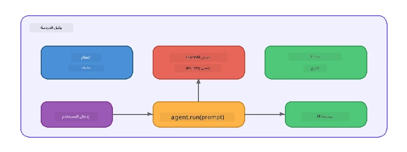

# الجزء 5: بناء وكلاء الذكاء الاصطناعي باستخدام إطار العمل الخاص بالوكلاء

> **الهدف:** بناء وكيل الذكاء الاصطناعي الأول الخاص بك مع تعليمات مستمرة وشخصية محددة، يعمل بنموذج محلي عبر Foundry Local.

## ما هو وكيل الذكاء الاصطناعي؟

وكيل الذكاء الاصطناعي يحيط نموذج اللغة بـ **تعليمات النظام** التي تحدد سلوكه وشخصيته وقيوده. على عكس مكالمة إتمام محادثة واحدة، يوفر الوكيل:

- **الشخصية** - هوية ثابتة ("أنت مراجع شيفرة مفيد")
- **الذاكرة** - تاريخ المحادثة عبر الأدوار
- **التخصص** - سلوك مركز مدفوع بتعليمات مصممة جيدًا



---

## إطار عمل Microsoft Agent

يوفر **إطار عمل Microsoft Agent** (AGF) تجريدًا قياسيًا للوكيل يعمل عبر خلفيات نماذج مختلفة. في هذه الورشة، نزوّجه مع Foundry Local بحيث يعمل كل شيء على جهازك - دون الحاجة للسحابة.

| المفهوم | الوصف |
|---------|-------------|
| `FoundryLocalClient` | بايثون: يدير بدء الخدمة، تحميل/تنزيل النموذج، ويُنشئ الوكلاء |
| `client.as_agent()` | بايثون: ينشئ وكيلًا من عميل Foundry Local |
| `AsAIAgent()` | C#: طريقة امتداد على `ChatClient` - تُنشئ `AIAgent` |
| `instructions` | أمر النظام الذي يشكل سلوك الوكيل |
| `name` | تسمية قابلة للقراءة للبشر، مفيدة في سيناريوهات متعددة وكلاء |
| `agent.run(prompt)` / `RunAsync()` | يرسل رسالة المستخدم ويرجع استجابة الوكيل |

> **ملاحظة:** إطار عمل الوكلاء لديه SDK للبايثون و .NET. بالنسبة لجافا سكريبت، ننفذ فئة `ChatAgent` خفيفة تعكس نفس النموذج باستخدام OpenAI SDK مباشرة.

---

## التمارين

### التمرين 1 - فهم نمط الوكيل

قبل كتابة الكود، راجع المكونات الرئيسية للوكيل:

1. **عميل النموذج** - يتصل بواجهة Foundry Local المتوافقة مع OpenAI
2. **تعليمات النظام** - أمر "الشخصية"
3. **حلقة التشغيل** - إرسال مدخلات المستخدم، استلام المخرجات

> **فكر في الأمر:** كيف تختلف تعليمات النظام عن رسالة المستخدم العادية؟ ماذا يحدث إذا قمت بتغييرها؟

---

### التمرين 2 - تشغيل مثال الوكيل الواحد

<details>
<summary><strong>🐍 بايثون</strong></summary>

**المتطلبات الأساسية:**
```bash
cd python
python -m venv venv

# ويندوز (باورشيل):
venv\Scripts\Activate.ps1
# ماك أو إس:
source venv/bin/activate

pip install -r requirements.txt
```

**تشغيل:**
```bash
python foundry-local-with-agf.py
```

**شرح الكود** (`python/foundry-local-with-agf.py`):

```python
import asyncio
from agent_framework_foundry_local import FoundryLocalClient

async def main():
    alias = "phi-4-mini"

    # يتعامل FoundryLocalClient مع بدء الخدمة وتنزيل النموذج والتحميل
    client = FoundryLocalClient(model_id=alias)
    print(f"Client Model ID: {client.model_id}")

    # إنشاء وكيل مع تعليمات النظام
    agent = client.as_agent(
        name="Joker",
        instructions="You are good at telling jokes.",
    )

    # غير البث: الحصول على الاستجابة الكاملة دفعة واحدة
    result = await agent.run("Tell me a joke about a pirate.")
    print(f"Agent: {result}")

    # البث: الحصول على النتائج أثناء توليدها
    async for chunk in agent.run("Tell me another joke.", stream=True):
        if chunk.text:
            print(chunk.text, end="", flush=True)

asyncio.run(main())
```

**نقاط رئيسية:**
- `FoundryLocalClient(model_id=alias)` يدير بدء الخدمة، التنزيل، وتحميل النموذج في خطوة واحدة
- `client.as_agent()` ينشئ وكيلًا مع تعليمات النظام واسم
- `agent.run()` يدعم وضعي عدم التدفق والتدفق
- التثبيت عبر `pip install agent-framework-foundry-local --pre`

</details>

<details>
<summary><strong>📦 جافا سكريبت</strong></summary>

**المتطلبات الأساسية:**
```bash
cd javascript
npm install
```

**التشغيل:**
```bash
node foundry-local-with-agent.mjs
```

**شرح الكود** (`javascript/foundry-local-with-agent.mjs`):

```javascript
import { OpenAI } from "openai";
import { FoundryLocalManager } from "foundry-local-sdk";

class ChatAgent {
  constructor({ client, modelId, instructions, name }) {
    this.client = client;
    this.modelId = modelId;
    this.instructions = instructions;
    this.name = name;
    this.history = [];
  }

  async run(userMessage) {
    const messages = [
      { role: "system", content: this.instructions },
      ...this.history,
      { role: "user", content: userMessage },
    ];
    const response = await this.client.chat.completions.create({
      model: this.modelId,
      messages,
    });
    const assistantMessage = response.choices[0].message.content;

    // احتفظ بتاريخ المحادثة للتفاعلات متعددة الجولات
    this.history.push({ role: "user", content: userMessage });
    this.history.push({ role: "assistant", content: assistantMessage });
    return { text: assistantMessage };
  }
}

async function main() {
  FoundryLocalManager.create({ appName: "FoundryLocalWorkshop" });
  const manager = FoundryLocalManager.instance;
  await manager.startWebService();

  const catalog = manager.catalog;
  const model = await catalog.getModel("phi-3.5-mini");
  if (!model.isCached) {
    console.log("Downloading model: phi-3.5-mini...");
    await model.download();
  }
  await model.load();

  const client = new OpenAI({
    baseURL: manager.urls[0] + "/v1",
    apiKey: "foundry-local",
  });

  const agent = new ChatAgent({
    client,
    modelId: model.id,
    instructions: "You are good at telling jokes.",
    name: "Joker",
  });

  const result = await agent.run("Tell me a joke about a pirate.");
  console.log(result.text);
}

main();
```

**نقاط رئيسية:**
- جافا سكريبت تبني فئة `ChatAgent` الخاصة بها التي تعكس نمط AGF للبايثون
- `this.history` تخزن أدوار المحادثة لدعم الأدوار المتعددة
- `startWebService()` صريحة → تحقق التخزين المؤقت → `model.download()` → `model.load()` تمنح رؤية كاملة

</details>

<details>
<summary><strong>💜 C#</strong></summary>

**المتطلبات الأساسية:**
```bash
cd csharp
dotnet restore
```

**تشغيل:**
```bash
dotnet run agent
```

**شرح الكود** (`csharp/SingleAgent.cs`):

```csharp
using Microsoft.AI.Foundry.Local;
using Microsoft.Extensions.Logging.Abstractions;
using Microsoft.Agents.AI;
using OpenAI;
using System.ClientModel;

// 1. Start Foundry Local and load a model
var alias = "phi-3.5-mini";
await FoundryLocalManager.CreateAsync(
    new Configuration
    {
        AppName = "FoundryLocalSamples",
        Web = new Configuration.WebService { Urls = "http://127.0.0.1:0" }
    }, NullLogger.Instance, default);
var manager = FoundryLocalManager.Instance;
await manager.StartWebServiceAsync(default);

var catalog = await manager.GetCatalogAsync(default);
var model = await catalog.GetModelAsync(alias, default);

var isCached = await model.IsCachedAsync(default);
if (!isCached)
{
    Console.WriteLine($"Downloading model: {alias}...");
    await model.DownloadAsync(null, default);
}
await model.LoadAsync(default);

var key = new ApiKeyCredential("foundry-local");
var client = new OpenAIClient(key, new OpenAIClientOptions
{
    Endpoint = new Uri(manager.Urls[0] + "/v1")
});

// 2. Create an AIAgent using the Agent Framework extension method
AIAgent joker = client
    .GetChatClient(model.Id)
    .AsAIAgent(
        instructions: "You are good at telling jokes. Keep your jokes short and family-friendly.",
        name: "Joker"
    );

// 3. Run the agent (non-streaming)
var response = await joker.RunAsync("Tell me a joke about a pirate.");
Console.WriteLine($"Joker: {response}");

// 4. Run with streaming
await foreach (var update in joker.RunStreamingAsync("Tell me another joke."))
{
    Console.Write(update);
}
```

**نقاط رئيسية:**
- `AsAIAgent()` طريقة امتداد من `Microsoft.Agents.AI.OpenAI` - لا حاجة لفئة `ChatAgent` مخصصة
- `RunAsync()` يرجع الاستجابة الكاملة؛ `RunStreamingAsync()` يبث الرموز بشكل متتالي
- التثبيت عبر `dotnet add package Microsoft.Agents.AI.OpenAI --version 1.0.0-rc3`

</details>

---

### التمرين 3 - تغيير الشخصية

عدل تعليمات الوكيل `instructions` لإنشاء شخصية مختلفة. جرّب كل واحدة وراقب كيف يتغير المخرج:

| الشخصية | التعليمات |
|---------|-------------|
| مراجع الشيفرة | `"أنت مراجع شيفرة خبير. قدم ملاحظات بناءة تركز على القراءة، الأداء، والصحة."` |
| دليل السفر | `"أنت دليل سفر ودود. قدم توصيات شخصية للوجهات، الأنشطة، والمأكولات المحلية."` |
| المعلم السقراطي | `"أنت معلم سقراطي. لا تعطي إجابات مباشرة - بدلاً من ذلك، وجه الطالب بأسئلة مدروسة."` |
| كاتب تقني | `"أنت كاتب تقني. اشرح المفاهيم بوضوح وإيجاز. استخدم أمثلة. تجنب المصطلحات المعقدة."` |

**جرب ذلك:**
1. اختر شخصية من الجدول أعلاه
2. استبدل سلسلة `instructions` في الكود
3. عدّل موجه المستخدم ليتناسب (مثلاً اطلب من مراجع الشيفرة مراجعة دالة)
4. شغّل المثال مرة أخرى وقارن المخرجات

> **نصيحة:** جودة الوكيل تعتمد بشكل كبير على التعليمات. التعليمات المحددة والمنظمة جيدًا تنتج نتائج أفضل من التعليمات الغامضة.

---

### التمرين 4 - إضافة محادثة متعددة الأدوار

وسع المثال لدعم حلقة محادثة متعددة الأدوار حتى تتمكن من إجراء محادثة تفاعلية مع الوكيل.

<details>
<summary><strong>🐍 بايثون - حلقة متعددة الأدوار</strong></summary>

```python
import asyncio
from agent_framework_foundry_local import FoundryLocalClient

async def main():
    client = FoundryLocalClient(model_id="phi-4-mini")

    agent = client.as_agent(
        name="Assistant",
        instructions="You are a helpful assistant.",
    )

    print("Chat with the agent (type 'quit' to exit):\n")
    while True:
        user_input = input("You: ")
        if user_input.strip().lower() in ("quit", "exit"):
            break
        result = await agent.run(user_input)
        print(f"Agent: {result}\n")

asyncio.run(main())
```

</details>

<details>
<summary><strong>📦 جافا سكريبت - حلقة متعددة الأدوار</strong></summary>

```javascript
import { OpenAI } from "openai";
import { FoundryLocalManager } from "foundry-local-sdk";
import * as readline from "node:readline/promises";

// (إعادة استخدام فئة ChatAgent من التمرين 2)

async function main() {
  FoundryLocalManager.create({ appName: "FoundryLocalWorkshop" });
  const manager = FoundryLocalManager.instance;
  await manager.startWebService();

  const catalog = manager.catalog;
  const model = await catalog.getModel("phi-3.5-mini");
  if (!model.isCached) {
    console.log("Downloading model: phi-3.5-mini...");
    await model.download();
  }
  await model.load();

  const client = new OpenAI({
    baseURL: manager.urls[0] + "/v1",
    apiKey: "foundry-local",
  });

  const agent = new ChatAgent({
    client,
    modelId: model.id,
    instructions: "You are a helpful assistant.",
    name: "Assistant",
  });

  const rl = readline.createInterface({
    input: process.stdin,
    output: process.stdout,
  });

  console.log("Chat with the agent (type 'quit' to exit):\n");
  while (true) {
    const userInput = await rl.question("You: ");
    if (["quit", "exit"].includes(userInput.trim().toLowerCase())) break;
    const result = await agent.run(userInput);
    console.log(`Agent: ${result.text}\n`);
  }
  rl.close();
}

main();
```

</details>

<details>
<summary><strong>💜 C# - حلقة متعددة الأدوار</strong></summary>

```csharp
using Microsoft.AI.Foundry.Local;
using Microsoft.Extensions.Logging.Abstractions;
using Microsoft.Agents.AI;
using OpenAI;
using System.ClientModel;

var alias = "phi-3.5-mini";
var config = new Configuration
{
    AppName = "FoundryLocalSamples",
    Web = new Configuration.WebService { Urls = "http://127.0.0.1:0" }
};
await FoundryLocalManager.CreateAsync(config, NullLogger.Instance, default);
var manager = FoundryLocalManager.Instance;
await manager.StartWebServiceAsync(default);

var catalog = await manager.GetCatalogAsync(default);
var model = await catalog.GetModelAsync(alias, default);

var isCached = await model.IsCachedAsync(default);
if (!isCached)
{
    Console.WriteLine($"Downloading model: {alias}...");
    await model.DownloadAsync(null, default);
}
await model.LoadAsync(default);

var key = new ApiKeyCredential("foundry-local");
var client = new OpenAIClient(key, new OpenAIClientOptions
{
    Endpoint = new Uri(manager.Urls[0] + "/v1")
});

AIAgent agent = client
    .GetChatClient(model.Id)
    .AsAIAgent(
        instructions: "You are a helpful assistant.",
        name: "Assistant"
    );

Console.WriteLine("Chat with the agent (type 'quit' to exit):\n");
while (true)
{
    Console.Write("You: ");
    var userInput = Console.ReadLine();
    if (string.IsNullOrWhiteSpace(userInput) ||
        userInput.Equals("quit", StringComparison.OrdinalIgnoreCase) ||
        userInput.Equals("exit", StringComparison.OrdinalIgnoreCase))
        break;

    var result = await agent.RunAsync(userInput);
    Console.WriteLine($"Agent: {result}\n");
}
```

</details>

لاحظ كيف يتذكر الوكيل الأدوار السابقة - اطرح سؤال متابعة وشاهد كيف يتم حمل السياق.

---

### التمرين 5 - إخراج منظم

وجّه الوكيل للرد دائمًا بصيغة محددة (مثلاً JSON) وحلل النتيجة:

<details>
<summary><strong>🐍 بايثون - إخراج JSON</strong></summary>

```python
import asyncio
import json
from agent_framework_foundry_local import FoundryLocalClient

async def main():
    client = FoundryLocalClient(model_id="phi-4-mini")

    agent = client.as_agent(
        name="SentimentAnalyzer",
        instructions=(
            "You are a sentiment analysis agent. "
            "For every user message, respond ONLY with valid JSON in this format: "
            '{"sentiment": "positive|negative|neutral", "confidence": 0.0-1.0, "summary": "brief reason"}'
        ),
    )

    result = await agent.run("I absolutely loved the new restaurant downtown!")
    print("Raw:", result)

    try:
        parsed = json.loads(str(result))
        print(f"Sentiment: {parsed['sentiment']} (confidence: {parsed['confidence']})")
    except json.JSONDecodeError:
        print("Agent did not return valid JSON - try refining the instructions.")

asyncio.run(main())
```

</details>

<details>
<summary><strong>💜 C# - إخراج JSON</strong></summary>

```csharp
using System.Text.Json;

AIAgent analyzer = chatClient.AsAIAgent(
    name: "SentimentAnalyzer",
    instructions:
        "You are a sentiment analysis agent. " +
        "For every user message, respond ONLY with valid JSON in this format: " +
        "{\"sentiment\": \"positive|negative|neutral\", \"confidence\": 0.0-1.0, \"summary\": \"brief reason\"}"
);

var response = await analyzer.RunAsync("I absolutely loved the new restaurant downtown!");
Console.WriteLine($"Raw: {response}");

try
{
    var parsed = JsonSerializer.Deserialize<JsonElement>(response.ToString());
    Console.WriteLine($"Sentiment: {parsed.GetProperty("sentiment")} " +
                      $"(confidence: {parsed.GetProperty("confidence")})");
}
catch (JsonException)
{
    Console.WriteLine("Agent did not return valid JSON - try refining the instructions.");
}
```

</details>

> **ملاحظة:** قد لا تنتج النماذج المحلية الصغيرة JSON صالحًا تمامًا طوال الوقت. يمكنك تحسين الموثوقية عبر تضمين مثال في التعليمات وأن تكون واضحًا جدًا بشأن التنسيق المتوقع.

---

## النقاط الرئيسية

| المفهوم | ما تعلمته |
|---------|-----------------|
| الوكيل مقابل استدعاء LLM الخام | الوكيل يحيط نموذجًا بالتعليمات والذاكرة |
| تعليمات النظام | الرافعة الأهم في التحكم بسلوك الوكيل |
| المحادثة متعددة الأدوار | يمكن للوكلاء حمل السياق عبر تفاعلات المستخدم المتعددة |
| الإخراج المنظم | يمكن للتعليمات فرض شكل الإخراج (JSON، ماركداون، الخ) |
| التنفيذ المحلي | كل شيء يعمل على الجهاز عبر Foundry Local - دون الحاجة للسحابة |

---

## الخطوات التالية

في **[الجزء 6: تدفقات العمل متعددة الوكلاء](part6-multi-agent-workflows.md)**، ستدمج عدة وكلاء في خط سير منسق حيث يكون لكل وكيل دور متخصص.

---

<!-- CO-OP TRANSLATOR DISCLAIMER START -->
**إخلاء المسؤولية**:  
تمت ترجمة هذا المستند باستخدام خدمة الترجمة الآلية [Co-op Translator](https://github.com/Azure/co-op-translator). بينما نسعى لتحقيق الدقة، يرجى العلم أن الترجمات الآلية قد تحتوي على أخطاء أو عدم دقة. يجب اعتبار المستند الأصلي بلغته الأصلية المصدر المرجعي والموثوق. للمعلومات الهامة، يُنصح بالترجمة البشرية المهنية. نحن غير مسؤولين عن أي سوء فهم أو تفسيرات خاطئة ناتجة عن استخدام هذه الترجمة.
<!-- CO-OP TRANSLATOR DISCLAIMER END -->