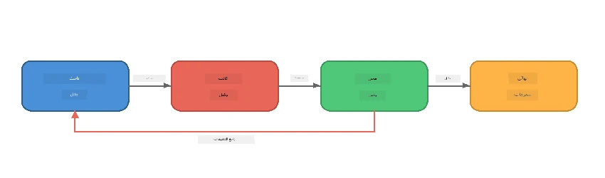
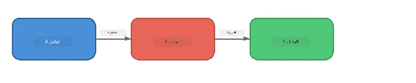
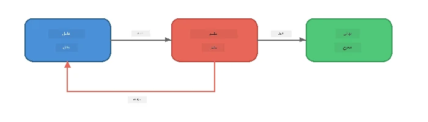
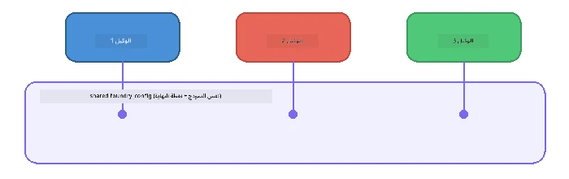

# الجزء 6: تدفقات عمل متعددة الوكلاء

> **الهدف:** دمج عدة وكلاء متخصصين في خطوط أنابيب منسقة تقسم المهام المعقدة بين الوكلاء المتعاونين - وكل ذلك يعمل محليًا باستخدام Foundry Local.

## لماذا تعدد الوكلاء؟

يمكن لوكيل واحد أن يتولى مهام عديدة، لكن تدفقات العمل المعقدة تستفيد من **التخصص**. بدلاً من أن يحاول وكيل واحد البحث والكتابة والتحرير في نفس الوقت، تقوم بتقسيم العمل إلى أدوار مركزة:



| النمط | الوصف |
|---------|-------------|
| **تتابعي** | مخرجات الوكيل A تُدخل إلى الوكيل B → الوكيل C |
| **حلقة تغذية راجعة** | يمكن لوكيل التقييم إرسال العمل مرة أخرى للمراجعة |
| **سياق مشترك** | جميع الوكلاء يستخدمون نفس النموذج/النقطة النهاية، لكن بتعليمات مختلفة |
| **مخرجات مصنفة** | يولد الوكلاء نتائج منظمة (JSON) لتسليم موثوق |

---

## التمارين

### التمرين 1 - تشغيل خط أنابيب متعدد الوكلاء

يتضمن الورشة تدفق عمل كامل: الباحث → الكاتب → المحرر.

<details>
<summary><strong>🐍 بايثون</strong></summary>

**الإعداد:**
```bash
cd python
python -m venv venv

# ويندوز (باورشيل):
venv\Scripts\Activate.ps1
# ماك أو إس:
source venv/bin/activate

pip install -r requirements.txt
```

**التشغيل:**
```bash
python foundry-local-multi-agent.py
```

**ما يحدث:**
1. **الباحث** يستقبل موضوعًا ويرد بنقاط حقائق موجزة
2. **الكاتب** يأخذ البحث ويكتب مسودة تدوينة (3-4 فقرات)
3. **المحرر** يراجع المقال للجودة ويرد بقبول أو تعديل

</details>

<details>
<summary><strong>📦 جافاسكريبت</strong></summary>

**الإعداد:**
```bash
cd javascript
npm install
```

**التشغيل:**
```bash
node foundry-local-multi-agent.mjs
```

**نفس خط الأنابيب ثلاثي المراحل** - الباحث → الكاتب → المحرر.

</details>

<details>
<summary><strong>💜 سي#</strong></summary>

**الإعداد:**
```bash
cd csharp
dotnet restore
```

**التشغيل:**
```bash
dotnet run multi
```

**نفس خط الأنابيب ثلاثي المراحل** - الباحث → الكاتب → المحرر.

</details>

---

### التمرين 2 - تشريح خط الأنابيب

ادرس كيف يتم تعريف الوكلاء وربطهم:

**1. عميل نموذج مشترك**

جميع الوكلاء يشتركون في نفس نموذج Foundry Local:

```python
# بايثون - يتولى FoundryLocalClient كل شيء
from agent_framework_foundry_local import FoundryLocalClient

client = FoundryLocalClient(model_id="phi-3.5-mini")
```

```javascript
// جافا سكريبت - مجموعة تطوير برمجيات OpenAI تشير إلى Foundry Local
const client = new OpenAI({
  baseURL: manager.urls[0] + "/v1",
  apiKey: "foundry-local",
});
```

```csharp
// C# - OpenAIClient pointed at Foundry Local
var key = new ApiKeyCredential("foundry-local");
var client = new OpenAIClient(key, new OpenAIClientOptions
{
    Endpoint = new Uri(manager.Urls[0] + "/v1")
});
var chatClient = client.GetChatClient(model.Id);
```

**2. تعليمات متخصصة**

كل وكيل له شخصية مميزة:

| الوكيل | التعليمات (ملخص) |
|-------|----------------------|
| الباحث | "قدم حقائق رئيسية، إحصائيات، وخلفيات. نظّمها كنقاط بارزة." |
| الكاتب | "اكتب تدوينة جاذبة (3-4 فقرات) استنادًا إلى ملاحظات البحث. لا تخترع حقائق." |
| المحرر | "راجع من حيث الوضوح والقواعد والاتساق الواقعي. الحكم: قبول أو تعديل." |

**3. تدفقات البيانات بين الوكلاء**

```python
# الخطوة 1 - مخرجات الباحث تصبح مدخلات للكاتب
research_result = await researcher.run(f"Research: {topic}")

# الخطوة 2 - مخرجات الكاتب تصبح مدخلات للمحرر
writer_result = await writer.run(f"Write using:\n{research_result}")

# الخطوة 3 - المحرر يراجع كل من البحث والمقالة
editor_result = await editor.run(
    f"Research:\n{research_result}\n\nArticle:\n{writer_result}"
)
```

```csharp
// C# - same pattern, async calls with AIAgent
var researchNotes = await researcher.RunAsync(
    $"Research the following topic and provide key facts:\n{topic}");

var draft = await writer.RunAsync(
    $"Write a blog post based on these research notes:\n\n{researchNotes}");

var verdict = await editor.RunAsync(
    $"Review this article for quality and accuracy.\n\n" +
    $"Research notes:\n{researchNotes}\n\n" +
    $"Article:\n{draft}");
```

> **البصيرة الأساسية:** يستلم كل وكيل السياق التراكمي من الوكلاء السابقين. يرى المحرر كلًا من البحث الأصلي والمسودة - مما يتيح له التحقق من الاتساق الواقعي.

---

### التمرين 3 - إضافة وكيل رابع

قم بتمديد خط الأنابيب بإضافة وكيل جديد. اختر واحدًا:

| الوكيل | الغرض | التعليمات |
|-------|---------|-------------|
| **مدقق الحقائق** | التحقق من صحة الادعاءات في المقال | `"أنت تتحقق من الادعاءات الواقعية. لكل ادعاء، اذكر ما إذا كان مدعومًا بملاحظات البحث. أرجع JSON بالعناصر المحققة وغير المحققة."` |
| **كاتب العناوين** | إنشاء عناوين جذابة | `"أنتج 5 خيارات عناوين للمقال. تنوع الأسلوب: إعلامي، جذب للنقر، سؤال، قائمة، عاطفي."` |
| **وسائل التواصل الاجتماعي** | إنشاء منشورات ترويجية | `"اصنع 3 منشورات على وسائل التواصل الاجتماعي تروّج للمقال: واحد لتويتر (280 حرفًا)، واحد للينكدإن (نبرة محترفة)، واحد لإنستغرام (رسمي مع اقتراحات رموز تعبيرية)."` |

<details>
<summary><strong>🐍 بايثون - إضافة كاتب عناوين</strong></summary>

```python
headline_agent = client.as_agent(
    name="HeadlineWriter",
    instructions=(
        "You are a headline specialist. Given an article, generate exactly "
        "5 headline options. Vary the style: informative, question-based, "
        "listicle, emotional, and provocative. Return them as a numbered list."
    ),
)

# بعد قبول المحرر، قم بإنشاء العناوين الرئيسية
headline_result = await headline_agent.run(
    f"Generate headlines for this article:\n\n{writer_result}"
)
print(f"\n--- Headlines ---\n{headline_result}")
```

</details>

<details>
<summary><strong>📦 جافاسكريبت - إضافة كاتب عناوين</strong></summary>

```javascript
const headlineAgent = new ChatAgent({
  client,
  modelId: modelInfo.id,
  instructions:
    "You are a headline specialist. Given an article, generate exactly " +
    "5 headline options. Vary the style: informative, question-based, " +
    "listicle, emotional, and provocative. Return them as a numbered list.",
  name: "HeadlineWriter",
});

const headlineResult = await headlineAgent.run(
  `Generate headlines for this article:\n\n${writerResult.text}`
);
console.log(`\n--- Headlines ---\n${headlineResult.text}`);
```

</details>

<details>
<summary><strong>💜 سي# - إضافة كاتب عناوين</strong></summary>

```csharp
AIAgent headlineAgent = chatClient.AsAIAgent(
    name: "HeadlineWriter",
    instructions:
        "You are a headline specialist. Given an article, generate exactly " +
        "5 headline options. Vary the style: informative, question-based, " +
        "listicle, emotional, and provocative. Return them as a numbered list."
);

// After the editor accepts, generate headlines
var headlines = await headlineAgent.RunAsync(
    $"Generate headlines for this article:\n\n{draft}");
Console.WriteLine($"\n--- Headlines ---\n{headlines}");
```

</details>

---

### التمرين 4 - صمم تدفق عمل خاص بك

صمم خط أنابيب متعدد الوكلاء لمجال مختلف. إليك بعض الأفكار:

| المجال | الوكلاء | التدفق |
|--------|--------|------|
| **مراجعة الكود** | محلل → مراجع → ملخص | تحليل بنية الكود → مراجعة المشكلات → إنتاج تقرير ملخص |
| **دعم العملاء** | مصنف → مستجيب → ضمان الجودة | تصنيف التذكرة → صياغة الرد → فحص الجودة |
| **التعليم** | صانع اختبار → محاكاة طالب → مقيم | إنشاء اختبار → محاكاة الأجوبة → تقييم وشرح |
| **تحليل البيانات** | مفسر → محلل → مراسل | تفسير طلب البيانات → تحليل الأنماط → كتابة تقرير |

**الخطوات:**
1. حدد 3 وكلاء أو أكثر مع `تعليمات` متميزة
2. قرر تدفق البيانات - ماذا يستلم وينتج كل وكيل؟
3. نفذ خط الأنابيب باستخدام الأنماط من التمارين 1-3
4. أضف حلقة تغذية راجعة إذا كان يجب لأحد الوكلاء تقييم عمل وكيل آخر

---

## أنماط التنسيق (التنسيق الآلي)

هنا أنماط التنسيق التي تنطبق على أي نظام متعدد الوكلاء (تم شرحها بعمق في [الجزء 7](part7-zava-creative-writer.md)):

### خط أنابيب تتابعي



يعالج كل وكيل مخرجات الوكيل السابق. بسيط وقابل للتوقع.

### حلقة تغذية راجعة



يمكن لوكيل التقييم أن يحفز إعادة تنفيذ المراحل السابقة. يستخدم Zava Writer هذا: حيث يمكن للمحرر إرسال ملاحظات للباحث والكاتب.

### سياق مشترك



جميع الوكلاء يشتركون في `foundry_config` واحد لذلك يستخدمون نفس النموذج والنقطة النهاية.

---

## النقاط الرئيسية

| المفهوم | ما تعلمته |
|---------|-----------------|
| تخصص الوكيل | كل وكيل يقوم بشيء واحد جيدًا بتعليمات مركزة |
| تسليم البيانات | مخرجات وكيل تصبح مدخلات للوكيل التالي |
| حلقات التغذية الراجعة | يمكن للمقيم تحفيز المحاولات المتكررة لجودة أعلى |
| مخرجات منظمة | الردود بصيغة JSON تتيح تواصلًا موثوقًا بين الوكلاء |
| التنسيق | منسق يدير تسلسل خط الأنابيب وتعامل الأخطاء |
| أنماط الإنتاج | مطبقة في [الجزء 7: كاتب زافا الإبداعي](part7-zava-creative-writer.md) |

---

## الخطوات التالية

واصل إلى [الجزء 7: كاتب زافا الإبداعي - تطبيق خاتمة](part7-zava-creative-writer.md) لاستكشاف تطبيق متعدد الوكلاء بأسلوب إنتاجي مع 4 وكلاء متخصصين، إخراج متدفق، بحث عن المنتج، وحلقات تغذية راجعة - متاح في بايثون، جافاسكريبت، وسي#.

---

<!-- CO-OP TRANSLATOR DISCLAIMER START -->
**إخلاء المسؤولية**:  
تم ترجمة هذا المستند باستخدام خدمة الترجمة الآلية [Co-op Translator](https://github.com/Azure/co-op-translator). بينما نسعى لتحقيق الدقة، يرجى العلم أن الترجمات الآلية قد تحتوي على أخطاء أو عدم دقة. يجب اعتبار المستند الأصلي بلغته الأصلية المصدر الموثوق به. للمعلومات الحساسة، ينصح باستخدام ترجمة بشرية محترفة. نحن غير مسؤولين عن أي سوء فهم أو تفسيرات خاطئة تنشأ من استخدام هذه الترجمة.
<!-- CO-OP TRANSLATOR DISCLAIMER END -->