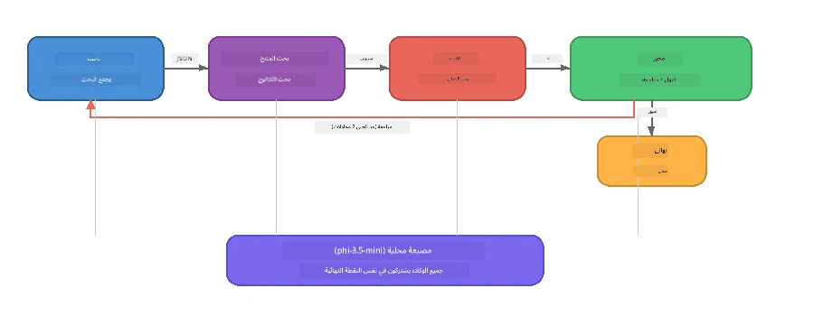

# الجزء 7: كاتب إبداعي زافا - تطبيق ختامي

> **الهدف:** استكشاف تطبيق متعدد الوكلاء بأسلوب الإنتاج حيث يتعاون أربعة وكلاء متخصصين لإنتاج مقالات ذات جودة مجلة لـ Zava Retail DIY - يعمل بالكامل على جهازك مع Foundry Local.

هذا هو **المعمل الختامي** للورشة. يجمع بين كل ما تعلمته - تكامل SDK (الجزء 3)، الاسترجاع من البيانات المحلية (الجزء 4)، شخصيات الوكلاء (الجزء 5)، وتنسيق الوكلاء المتعددين (الجزء 6) - في تطبيق كامل متاح بـ **بايثون**، **جافا سكريبت**، و **C#**.

---

## ما ستستكشفه

| المفهوم | مكانه في كاتب زافا |
|---------|--------------------|
| تحميل النموذج على 4 خطوات | وحدة التكوين المشتركة تبدأ Foundry Local |
| استرجاع بأسلوب RAG | وكيل المنتجات يبحث في كتالوج محلي |
| تخصص الوكلاء | 4 وكلاء مع أوامر نظام مميزة |
| الإخراج المتدفق | الكاتب ينتج رموزًا في الوقت الفعلي |
| نقل منظم للمخرجات | الباحث → JSON، المحرر → قرار JSON |
| حلقات التغذية الراجعة | المحرر يمكنه دفع إعادة التنفيذ (حد أقصى محاولتين) |

---

## البنية

يستخدم كاتب زافا الإبداعي **خط أنابيب متسلسل مع تغذية راجعة مدفوعة بالمقوّم**. تتبع جميع تطبيقات اللغات الثلاث نفس البنية:



### الوكلاء الأربعة

| الوكيل | الإدخال | الإخراج | الغرض |
|-------|---------|---------|-------|
| **الباحث** | الموضوع + ملاحظات اختيارية | `{"web": [{url, name, description}, ...]}` | يجمع أبحاث الخلفية عبر LLM |
| **البحث عن المنتج** | نص سياق المنتج | قائمة المنتجات المطابقة | استعلامات مولدة بواسطة LLM + بحث بالكلمات الرئيسية في الكتالوج المحلي |
| **الكاتب** | البحث + المنتجات + المهمة + التغذية الراجعة | نص المقال المُرسل (مقسم عند `---`) | يصيغ مسودة مقال بجودة مجلة في الوقت الفعلي |
| **المحرر** | المقال + تغذية ذاتية للكاتب | `{"decision": "accept/revise", "editorFeedback": "...", "researchFeedback": "..."}` | يراجع الجودة، ويحفز إعادة المحاولة إذا لزم الأمر |

### تدفق خط الأنابيب

1. يتلقى **الباحث** الموضوع وينتج ملاحظات بحث منظمة (JSON)
2. يستعلم **البحث عن المنتج** في كتالوج المنتجات المحلي باستخدام مصطلحات بحث مولدة بواسطة LLM
3. يجمع **الكاتب** البحث والمنتجات والمهمة في مقال متدفق، مرفقًا تغذية ذاتية بعد فاصل `---`
4. يراجع **المحرر** المقال ويُرجع حكمًا بصيغة JSON:
   - `"accept"` → يكمل خط الأنابيب
   - `"revise"` → تُرسل الملاحظات مرة أخرى إلى الباحث والكاتب (حد أقصى محاولتين)

---

## المتطلبات السابقة

- إكمال [الجزء 6: سير عمل الوكلاء المتعددين](part6-multi-agent-workflows.md)
- تثبيت Foundry Local CLI وتحميل نموذج `phi-3.5-mini`

---

## التمارين

### التمرين 1 - تشغيل كاتب زافا الإبداعي

اختر لغتك وشغّل التطبيق:

<details>
<summary><strong>🐍 بايثون - خدمة ويب FastAPI</strong></summary>

تشغل نسخة بايثون كـ **خدمة ويب** بواجهة برمجة تطبيقات REST، توضح كيفية بناء خلفية إنتاجية.

**الإعداد:**
```bash
cd zava-creative-writer-local/src/api
python -m venv venv

# ويندوز (باورشيل):
venv\Scripts\Activate.ps1
# ماك أو إس:
source venv/bin/activate

pip install -r requirements.txt
```

**تشغيل:**
```bash
uvicorn main:app --reload
```

**اختباره:**
```bash
curl -X POST http://localhost:8000/api/article \
  -H "Content-Type: application/json" \
  -d '{
    "research": "DIY home improvement trends",
    "products": "power tools and paints",
    "assignment": "Write an article about weekend renovation projects for DIY enthusiasts"
  }'
```

يُرجع الرد رسائل JSON مفصولة بأسطر تُظهر تقدم كل وكيل.

</details>

<details>
<summary><strong>📦 جافا سكريبت - CLI بنود.js</strong></summary>

تشغل نسخة جافا سكريبت كتطبيق **CLI**، تطبع تقدم الوكلاء والمقال مباشرة في وحدة التحكم.

**الإعداد:**
```bash
cd zava-creative-writer-local/src/javascript
npm install
```

**تشغيل:**
```bash
node main.mjs
```

سترى:
1. تحميل نموذج Foundry Local (مع شريط تقدم إذا كان جارٍ التنزيل)
2. تنفيذ كل وكيل بالتسلسل مع رسائل الحالة
3. تدفق المقال إلى وحدة التحكم في الوقت الفعلي
4. قرار القبول/المراجعة من المحرر

</details>

<details>
<summary><strong>💜 C# - تطبيق وحدة تحكم .NET</strong></summary>

تشغل نسخة C# كتطبيق **وحدة تحكم .NET** مع نفس خط الأنابيب والإخراج المتدفق.

**الإعداد:**
```bash
cd zava-creative-writer-local/src/csharp
dotnet restore
```

**تشغيل:**
```bash
dotnet run
```

نفس نمط الإخراج كنسخة جافا سكريبت - رسائل حالة الوكلاء، المقال المتدفق، وحكم المحرر.

</details>

---

### التمرين 2 - دراسة هيكل الكود

يحتوي كل تطبيق لغوي على نفس المكونات المنطقية. قارن البنى:

**بايثون** (`src/api/`):
| الملف | الغرض |
|-------|-------|
| `foundry_config.py` | مدير Foundry Local المشترك، النموذج، والعميل (تهيئة 4 خطوات) |
| `orchestrator.py` | تنسيق خط الأنابيب مع حلقة التغذية الراجعة |
| `main.py` | نقاط نهاية FastAPI (`POST /api/article`) |
| `agents/researcher/researcher.py` | بحث قائم على LLM مع إخراج JSON |
| `agents/product/product.py` | استعلامات مولدة بواسطة LLM + بحث بالكلمات الرئيسية |
| `agents/writer/writer.py` | توليد المقالات المتدفقة |
| `agents/editor/editor.py` | قرار قبول/مراجعة بصيغة JSON |

**جافا سكريبت** (`src/javascript/`):
| الملف | الغرض |
|-------|-------|
| `foundryConfig.mjs` | تكوين Foundry Local المشترك (تهيئة 4 خطوات مع شريط تقدم) |
| `main.mjs` | المنسق + نقطة دخول CLI |
| `researcher.mjs` | وكيل بحث قائم على LLM |
| `product.mjs` | توليد استعلامات LLM + بحث بالكلمات الرئيسية |
| `writer.mjs` | توليد مقال متدفق (مولد غير متزامن) |
| `editor.mjs` | قرار قبول/مراجعة بصيغة JSON |
| `products.mjs` | بيانات كتالوج المنتجات |

**C#** (`src/csharp/`):
| الملف | الغرض |
|-------|-------|
| `Program.cs` | خط أنابيب كامل: تحميل النموذج، الوكلاء، المنسق، حلقة التغذية الراجعة |
| `ZavaCreativeWriter.csproj` | مشروع .NET 9 مع Foundry Local + حزم OpenAI |

> **ملاحظة تصميم:** بايثون تفصل كل وكيل في ملف/مجلد خاص (جيد للفرق الكبيرة). جافا سكريبت تستخدم وحدة لكل وكيل (جيد للمشاريع المتوسطة). C# تحافظ على كل شيء في ملف واحد مع دوال محلية (جيد للأمثلة المتكاملة). في الإنتاج، اختر النمط الذي يناسب معايير فريقك.

---

### التمرين 3 - تتبع التكوين المشترك

يشترك كل وكيل في خط الأنابيب بعميل نموذج Foundry Local واحد. ادرس كيفية إعداد ذلك في كل لغة:

<details>
<summary><strong>🐍 بايثون - foundry_config.py</strong></summary>

```python
from foundry_local import FoundryLocalManager

MODEL_ALIAS = "phi-3.5-mini"

# الخطوة 1: إنشاء المدير وبدء خدمة Foundry Local
manager = FoundryLocalManager()
manager.start_service()

# الخطوة 2: التحقق مما إذا كان النموذج محمّلًا بالفعل
cached = manager.list_cached_models()
catalog_info = manager.get_model_info(MODEL_ALIAS)
is_cached = any(m.id == catalog_info.id for m in cached) if catalog_info else False

if not is_cached:
    manager.download_model(MODEL_ALIAS)

# الخطوة 3: تحميل النموذج في الذاكرة
manager.load_model(MODEL_ALIAS)
model_id = manager.get_model_info(MODEL_ALIAS).id

# عميل OpenAI المشترك
client = openai.OpenAI(base_url=manager.endpoint, api_key=manager.api_key)
```

جميع الوكلاء يستوردون `from foundry_config import client, model_id`.

</details>

<details>
<summary><strong>📦 جافا سكريبت - foundryConfig.mjs</strong></summary>

```javascript
import { FoundryLocalManager } from "foundry-local-sdk";
import { OpenAI } from "openai";

FoundryLocalManager.create({ appName: "ZavaCreativeWriter" });
const manager = FoundryLocalManager.instance;
await manager.startWebService();

// تحقق من ذاكرة التخزين المؤقت → التنزيل → التحميل (نمط SDK الجديد)
const catalog = manager.catalog;
const model = await catalog.getModel(MODEL_ALIAS);
if (!model.isCached) {
  console.log(`Downloading model: ${MODEL_ALIAS}...`);
  await model.download();
}
await model.load();

const client = new OpenAI({ baseURL: manager.urls[0] + "/v1", apiKey: "foundry-local" });
const modelId = model.id;
export { client, modelId };
```

جميع الوكلاء يستوردون `{ client, modelId } from "./foundryConfig.mjs"`.

</details>

<details>
<summary><strong>💜 C# - أعلى Program.cs</strong></summary>

```csharp
await FoundryLocalManager.CreateAsync(
    new Configuration
    {
        AppName = "ZavaCreativeWriter",
        Web = new Configuration.WebService { Urls = "http://127.0.0.1:0" }
    }, NullLogger.Instance, default);
var manager = FoundryLocalManager.Instance;
await manager.StartWebServiceAsync(default);

var catalog = await manager.GetCatalogAsync(default);
var catalogModel = await catalog.GetModelAsync(alias, default);
var isCached = await catalogModel.IsCachedAsync(default);
if (!isCached)
    await catalogModel.DownloadAsync(null, default);

await catalogModel.LoadAsync(default);
var key = new ApiKeyCredential("foundry-local");
var chatClient = new OpenAIClient(key, new OpenAIClientOptions
{
    Endpoint = new Uri(manager.Urls[0] + "/v1")
}).GetChatClient(catalogModel.Id);
```

يُمرر `chatClient` بعد ذلك إلى جميع دوال الوكلاء في نفس الملف.

</details>

> **النمط الرئيسي:** نمط تحميل النموذج (بدء الخدمة → فحص المخزن المؤقت → التحميل → الفتح) يضمن رؤية المستخدم لتقدم واضح ويضمن تحميل النموذج مرة واحدة فقط. هذه أفضل ممارسة لأي تطبيق Foundry Local.

---

### التمرين 4 - فهم حلقة التغذية الراجعة

حلقة التغذية الراجعة هي ما يجعل هذا الخط "ذكيًا" - يمكن للمحرر إرسال العمل للمراجعة. تتبع المنطق:

```
Orchestrator:
  1. researcher.research(topic, "No Feedback")    ← first pass
  2. product.findProducts(productContext)
  3. writer.write(research, products, assignment)  ← streams article
  4. Split article at "---" → article + writerFeedback
  5. editor.edit(article, writerFeedback)

  WHILE editor says "revise" AND retryCount < 2:
    6. researcher.research(topic, editor.researchFeedback)  ← refined
    7. writer.write(research, products, editor.editorFeedback)
    8. editor.edit(newArticle, newWriterFeedback)
    9. retryCount++
```

**أسئلة يجب النظر فيها:**
- لماذا تم تحديد حد إعادة المحاولة عند 2؟ ماذا يحدث إذا زدته؟
- لماذا يحصل الباحث على `researchFeedback` بينما يحصل الكاتب على `editorFeedback`؟
- ماذا سيحدث إن كان المحرر دائمًا يقول "راجع"؟

---

### التمرين 5 - تعديل وكيل

جرّب تغيير سلوك وكيل واحد وراقب كيف يؤثر على خط الأنابيب:

| التعديل | ماذا تغير |
|---------|-----------|
| **محرر أكثر صرامة** | تغيير أمر نظام المحرر لطلب مراجعة واحدة على الأقل دائمًا |
| **مقالات أطول** | تغيير أمر الكاتب من "800-1000 كلمة" إلى "1500-2000 كلمة" |
| **منتجات مختلفة** | إضافة أو تعديل منتجات في كتالوج المنتجات |
| **موضوع بحث جديد** | تغيير `researchContext` الافتراضي إلى موضوع مختلف |
| **باحث بإخراج JSON فقط** | جعل الباحث يعيد 10 عناصر بدلًا من 3-5 |

> **نصيحة:** بما أن كل اللغات تطبق نفس البنية، يمكنك إجراء التعديل نفسه في اللغة التي ترتاح للعمل بها.

---

### التمرين 6 - إضافة وكيل خامس

وسع خط الأنابيب بوكيل جديد. بعض الأفكار:

| الوكيل | موقعه في خط الأنابيب | الغرض |
|--------|-----------------------|-------|
| **مدقق الحقائق** | بعد الكاتب، قبل المحرر | التحقق من الادعاءات مقارنة ببيانات البحث |
| **محسن SEO** | بعد قبول المحرر | إضافة وصف ميتا، كلمات مفتاحية، عنوان URL |
| **الرسام** | بعد قبول المحرر | توليد أوامر الصور للمقال |
| **المترجم** | بعد قبول المحرر | ترجمة المقال إلى لغة أخرى |

**الخطوات:**
1. كتابة أمر نظام الوكيل
2. إنشاء دالة الوكيل (مطابقة للنمط الموجود في لغتك)
3. إدخاله في المنسق في النقطة الصحيحة
4. تحديث الإخراج/التسجيل لإظهار مساهمة الوكيل الجديد

---

## كيف يعمل Foundry Local وإطار الوكلاء معًا

يعرض هذا التطبيق النمط الموصى به لبناء أنظمة متعددة الوكلاء باستخدام Foundry Local:

| الطبقة | المكون | الدور |
|--------|---------|-------|
| **وقت التشغيل** | Foundry Local | تحميل وإدارة وتقديم النموذج محليًا |
| **العميل** | OpenAI SDK | إرسال إكمالات الدردشة إلى نقطة النهاية المحلية |
| **الوكيل** | أمر النظام + مكالمة الدردشة | سلوك متخصص عبر تعليمات مركزة |
| **المنسق** | منسق خط الأنابيب | إدارة تدفق البيانات، التتابع، وحلقات التغذية الراجعة |
| **الإطار** | إطار عمل Microsoft Agent Framework | يوفر تجريد `ChatAgent` والأنماط |

الرؤية الرئيسية: **Foundry Local يستبدل السحابة الخلفية، وليس بنية التطبيق.** أنماط الوكلاء نفسها، استراتيجيات التنسيق، ونقل المخرجات المنظم التي تعمل مع النماذج المستضافة في السحابة تعمل بالضبط مع النماذج المحلية — فقط توجه العميل إلى نقطة النهاية المحلية بدلاً من نقطة نهاية Azure.

---

## النقاط الرئيسية المستفادة

| المفهوم | ما تعلمته |
|---------|-----------|
| بنية الإنتاج | كيفية بناء تطبيق متعدد الوكلاء مع تكوين مشترك ووكلاء منفصلين |
| تحميل النموذج على 4 خطوات | أفضل ممارسة لتهيئة Foundry Local مع تقدم مرئي للمستخدم |
| تخصص الوكلاء | لكل من الوكلاء الأربعة تعليمات مركزة وصيغة إخراج محددة |
| التوليد المتدفق | الكاتب ينتج رموزًا في الوقت الفعلي مما يمكّن واجهات مستخدم تفاعلية |
| حلقات التغذية الراجعة | إعادة المحاولة التي يقودها المحرر تحسن جودة الإخراج دون تدخل بشري |
| أنماط عبر اللغات | نفس البنية تعمل في بايثون، جافا سكريبت، وC# |
| المحلي = جاهز للإنتاج | Foundry Local يقدم نفس API المتوافق مع OpenAI المستخدم في السحابات |

---

## الخطوة التالية

تابع إلى [الجزء 8: التطوير المبني على التقييم](part8-evaluation-led-development.md) لبناء إطار تقييم منهجي لوكلائك، باستخدام مجموعات بيانات ذهبية، فحوصات قائمة على القواعد، وتقييم LLM كقاضٍ.

---

<!-- CO-OP TRANSLATOR DISCLAIMER START -->
**إخلاء المسؤولية**:  
تمت ترجمة هذا المستند باستخدام خدمة الترجمة الآلية [Co-op Translator](https://github.com/Azure/co-op-translator). بينما نسعى لتحقيق الدقة، يرجى العلم أن الترجمات الآلية قد تحتوي على أخطاء أو عدم دقة. يجب اعتبار المستند الأصلي بلغته الأصلية المصدر الرسمي والمعتمد. بالنسبة للمعلومات الحساسة، يُنصح بالاستعانة بترجمة بشرية محترفة. لا نتحمل أي مسؤولية عن أي سوء فهم أو تحريف ناتج عن استخدام هذه الترجمة.
<!-- CO-OP TRANSLATOR DISCLAIMER END -->