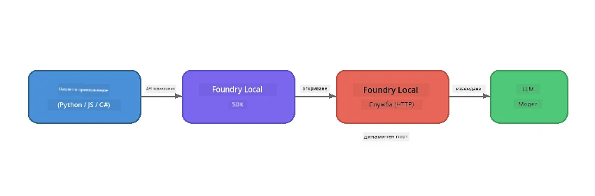

# Част 1: Започване с Foundry Local


## Какво е Foundry Local?

[Foundry Local](https://foundrylocal.ai) ви позволява да стартирате отворени AI езикови модели **директно на вашия компютър** – без нужда от интернет, без разходи за облак и с пълна поверителност на данните. То:

- **Изтегля и стартира модели локално** с автоматична оптимизация за хардуера (GPU, CPU или NPU)
- **Осигурява OpenAI-съвместим API**, за да използвате познати SDK и инструменти
- **Не изисква абонамент за Azure** или регистрация – просто инсталирайте и започнете да създавате

Можете да го разглеждате като ваш собствен частен AI, който работи изцяло на вашия компютър.

## Цели на обучението

Към края на тази лаборатория ще можете да:

- Инсталирате Foundry Local CLI на вашата операционна система
- Разберете какво представляват и как работят псевдонимите на моделите
- Изтеглите и стартирате първия си локален AI модел
- Изпратите чат съобщение до локален модел от командния ред
- Разберете разликата между локални и хоствани в облак AI модели

---

## Предварителни изисквания

### Системни изисквания

| Изискване | Минимално | Препоръчително |
|-----------|-----------|----------------|
| **RAM** | 8 GB | 16 GB |
| **Дисково пространство** | 5 GB (за модели) | 10 GB |
| **CPU** | 4 ядра | 8+ ядра |
| **GPU** | По желание | NVIDIA с CUDA 11.8+ |
| **ОС** | Windows 10/11 (x64/ARM), Windows Server 2025, macOS 13+ | - |

> **Бележка:** Foundry Local автоматично избира най-добрия вариант на модела за вашия хардуер. Ако имате NVIDIA GPU, използва CUDA ускорение. Ако имате Qualcomm NPU, използва него. В противен случай използва оптимизиран CPU вариант.

### Инсталиране на Foundry Local CLI

**Windows** (PowerShell):
```powershell
winget install Microsoft.FoundryLocal
```

**macOS** (Homebrew):
```bash
brew tap microsoft/foundrylocal
brew install foundrylocal
```

> **Бележка:** В момента Foundry Local поддържа само Windows и macOS. Linux не се поддържа към момента.

Проверете инсталацията:
```bash
foundry --version
```

---

## Лабораторни упражнения

### Упражнение 1: Разгледайте наличните модели

Foundry Local включва каталог с предварително оптимизирани отворени модели. Избройте ги:

```bash
foundry model list
```

Ще видите модели като:
- `phi-3.5-mini` - Модел на Microsoft с 3.8 милиарда параметри (бърз, добро качество)
- `phi-4-mini` - По-нов, по-способен Phi модел
- `phi-4-mini-reasoning` - Phi модел с веригово мислене (`<think>` тагове)
- `phi-4` - Най-големият Phi модел на Microsoft (10.4 GB)
- `qwen2.5-0.5b` - Много малък и бърз (подходящ за устройства с ниски ресурси)
- `qwen2.5-7b` - Силен общ модел с поддръжка на извикване на инструменти
- `qwen2.5-coder-7b` - Оптимизиран за генериране на код
- `deepseek-r1-7b` - Силен модел за логическо мислене
- `gpt-oss-20b` - Голям модел с отворен код (лиценз MIT, 12.5 GB)
- `whisper-base` - Транскрипция от реч към текст (383 MB)
- `whisper-large-v3-turbo` - Високоточна транскрипция (9 GB)

> **Какво е псевдоним на модел?** Псевдоними като `phi-3.5-mini` са кратки имена. Когато използвате псевдоним, Foundry Local автоматично изтегля най-добрия вариант спрямо вашия конкретен хардуер (CUDA за NVIDIA GPU, оптимизиран за CPU в противен случай). Никога не трябва да се притеснявате за избора на правилен вариант.

### Упражнение 2: Стартирайте първия си модел

Изтеглете и започнете интерактивен чат с модел:

```bash
foundry model run phi-3.5-mini
```

Първия път, когато го стартирате, Foundry Local ще:
1. Открие хардуера ви
2. Изтегли оптималния вариант на модела (може да отнеме няколко минути)
3. Зареди модела в паметта
4. Стартира интерактивна чат сесия

Опитайте да му зададете няколко въпроса:
```
You: What is the golden ratio?
You: Can you explain it as if I were 10 years old?
You: Write a haiku about mathematics
```

Напишете `exit` или натиснете `Ctrl+C` за изход.

### Упражнение 3: Предварително изтегляне на модел

Ако искате да изтеглите модел, без да започвате чат:

```bash
foundry model download phi-3.5-mini
```

Проверете кои модели вече са изтеглени на вашата машина:

```bash
foundry cache list
```

### Упражнение 4: Разберете архитектурата

Foundry Local работи като **локална HTTP услуга**, която предоставя OpenAI-съвместим REST API. Това означава:

1. Услугата стартира на **динамичен порт** (различен всеки път)
2. Използвате SDK за откриване на текущия адрес
3. Можете да използвате **всяка** OpenAI-съвместима клиентска библиотека за комуникация



> **Важно:** Foundry Local присвоява **динамичен порт** всеки път при стартиране. Никога не използвайте твърдо зададен порт като `localhost:5272`. Винаги използвайте SDK, за да откриете настоящия URL (например `manager.endpoint` в Python или `manager.urls[0]` в JavaScript).

---

## Основни изводи

| Концепция | Какво научихте |
|-----------|----------------|
| AI на устройството | Foundry Local работи изцяло на вашето устройство без облак, API ключове или разходи |
| Псевдоними на модели | Псевдоними като `phi-3.5-mini` автоматично избират най-добрия вариант според вашия хардуер |
| Динамични портове | Услугата работи на динамичен порт; винаги използвайте SDK за откриване на адреса |
| CLI и SDK | Можете да взаимодействате с модели чрез CLI (`foundry model run`) или програмно чрез SDK |

---

## Следващи стъпки

Продължете към [Част 2: Foundry Local SDK задълбочено](part2-foundry-local-sdk.md), за да овладеете SDK API за управление на модели, услуги и кеширане програмно.