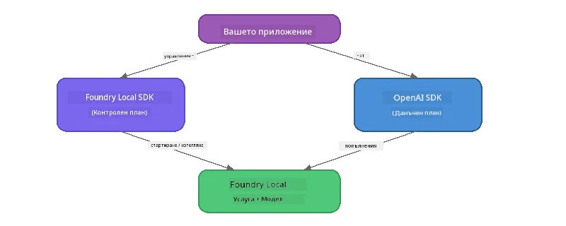

# Част 3: Използване на Foundry Local SDK с OpenAI

## Преглед

В Част 1 използвахте Foundry Local CLI за интерактивно изпълнение на модели. В Част 2 разгледахте пълната API повърхност на SDK. Сега ще научите как да **интегрирате Foundry Local във вашите приложения** с помощта на SDK и OpenAI-съвместимия API.

Foundry Local предоставя SDK за три езика. Изберете този, с който сте най-удобни – концепциите са идентични за всички три.

## Цели на обучението

Към края на тази лаборатория ще можете да:

- Инсталирате Foundry Local SDK за избрания език (Python, JavaScript или C#)
- Инициализирате `FoundryLocalManager` за стартиране на услугата, проверка на кеша, изтегляне и зареждане на модел
- Свържете се с локалния модел чрез OpenAI SDK
- Изпращате чат завършвания и обработвате стрийминг отговори
- Разберете динамичната архитектура на портовете

---

## Предварителни изисквания

Първо завършете [Част 1: Започване с Foundry Local](part1-getting-started.md) и [Част 2: Подробно разглеждане на Foundry Local SDK](part2-foundry-local-sdk.md).

Инсталирайте **един** от следните рантайми за език:
- **Python 3.9+** - [python.org/downloads](https://www.python.org/downloads/)
- **Node.js 18+** - [nodejs.org](https://nodejs.org/)
- **.NET 9.0+** - [dot.net/download](https://dotnet.microsoft.com/download)

---

## Концепция: Как работи SDK

Foundry Local SDK управлява **контролния слой** (стартиране на услугата, изтегляне на модели), докато OpenAI SDK обработва **данни слоя** (изпращане на заявки, получаване на отговори).



---

## Лабораторни упражнения

### Упражнение 1: Настройване на вашата среда

<details>
<summary><b>🐍 Python</b></summary>

```bash
cd python
python -m venv venv

# Активирайте виртуалната среда:
# Windows (PowerShell):
venv\Scripts\Activate.ps1
# Windows (Command Prompt):
venv\Scripts\activate.bat
# macOS:
source venv/bin/activate

pip install -r requirements.txt
```

`requirements.txt` инсталира:
- `foundry-local-sdk` - Foundry Local SDK (импортиран като `foundry_local`)
- `openai` - OpenAI Python SDK
- `agent-framework` - Microsoft Agent Framework (използва се в по-късни части)

</details>

<details>
<summary><b>📘 JavaScript</b></summary>

```bash
cd javascript
npm install
```

`package.json` инсталира:
- `foundry-local-sdk` - Foundry Local SDK
- `openai` - OpenAI Node.js SDK

</details>

<details>
<summary><b>💜 C#</b></summary>

```bash
cd csharp
dotnet restore
dotnet build
```

`csharp.csproj` използва:
- `Microsoft.AI.Foundry.Local` - Foundry Local SDK (NuGet)
- `OpenAI` - OpenAI C# SDK (NuGet)

> **Структура на проекта:** C# проектът използва команден маршрутизатор в `Program.cs`, който препраща към отделни примерни файлове. Стартирайте `dotnet run chat` (или само `dotnet run`) за тази част. Другите части използват `dotnet run rag`, `dotnet run agent` и `dotnet run multi`.

</details>

---

### Упражнение 2: Основно чат завършване

Отворете основния чат пример за вашия език и разгледайте кода. Всеки скрипт следва един и същи тристъпков модел:

1. **Стартиране на услугата** - `FoundryLocalManager` стартира Foundry Local runtime-а
2. **Изтегляне и зареждане на модела** - проверка на кеша, изтегляне при нужда, зареждане в паметта
3. **Създаване на OpenAI клиент** - свържете се с локалната крайна точка и изпратете чат завършване в поток

<details>
<summary><b>🐍 Python - <code>python/foundry-local.py</code></b></summary>

```python
import sys
import openai
from foundry_local import FoundryLocalManager

alias = "phi-3.5-mini"

# Стъпка 1: Създайте FoundryLocalManager и стартирайте услугата
print("Starting Foundry Local service...")
manager = FoundryLocalManager()
manager.start_service()

# Стъпка 2: Проверете дали моделът вече е изтеглен
cached = manager.list_cached_models()
catalog_info = manager.get_model_info(alias)
is_cached = any(m.id == catalog_info.id for m in cached) if catalog_info else False

if is_cached:
    print(f"Model already downloaded: {alias}")
else:
    print(f"Downloading model: {alias} (this may take several minutes)...")
    manager.download_model(alias)
    print(f"Download complete: {alias}")

# Стъпка 3: Заредете модела в паметта
print(f"Loading model: {alias}...")
manager.load_model(alias)

# Създайте OpenAI клиент, насочен към ЛОКАЛНАТА услуга Foundry
client = openai.OpenAI(
    base_url=manager.endpoint,   # Динамичен порт - никога не го кодирайте статично!
    api_key=manager.api_key
)

# Генерирайте чат завършек с поточно предаване
stream = client.chat.completions.create(
    model=manager.get_model_info(alias).id,
    messages=[{"role": "user", "content": "What is the golden ratio?"}],
    stream=True,
)

for chunk in stream:
    if chunk.choices[0].delta.content is not None:
        print(chunk.choices[0].delta.content, end="", flush=True)
print()
```

**Стартиране:**
```bash
python foundry-local.py
```

</details>

<details>
<summary><b>📘 JavaScript - <code>javascript/foundry-local.mjs</code></b></summary>

```javascript
import { OpenAI } from "openai";
import { FoundryLocalManager } from "foundry-local-sdk";

const alias = "phi-3.5-mini";

// Стъпка 1: Стартирайте локалната услуга Foundry
console.log("Starting Foundry Local service...");
FoundryLocalManager.create({ appName: "FoundryLocalWorkshop" });
const manager = FoundryLocalManager.instance;
await manager.startWebService();

// Стъпка 2: Проверете дали моделът вече е изтеглен
const catalog = manager.catalog;
const model = await catalog.getModel(alias);

if (model.isCached) {
  console.log(`Model already downloaded: ${alias}`);
} else {
  console.log(`Downloading model: ${alias} (this may take several minutes)...`);
  await model.download();
  console.log(`Download complete: ${alias}`);
}

// Стъпка 3: Заредете модела в паметта
console.log(`Loading model: ${alias}...`);
await model.load();
console.log(`Model loaded: ${model.id}`);

// Създайте OpenAI клиент, насочен към локалната услуга Foundry
const client = new OpenAI({
  baseURL: manager.urls[0] + "/v1",   // Динамичен порт - никога не го задавайте твърдо!
  apiKey: "foundry-local",
});

// Генерирайте чат завършек с поток
const stream = await client.chat.completions.create({
  model: model.id,
  messages: [{ role: "user", content: "What is the golden ratio?" }],
  stream: true,
});

for await (const chunk of stream) {
  if (chunk.choices[0]?.delta?.content) {
    process.stdout.write(chunk.choices[0].delta.content);
  }
}
console.log();
```

**Стартиране:**
```bash
node foundry-local.mjs
```

</details>

<details>
<summary><b>💜 C# - <code>csharp/BasicChat.cs</code></b></summary>

```csharp
using Microsoft.AI.Foundry.Local;
using Microsoft.Extensions.Logging.Abstractions;
using OpenAI;
using OpenAI.Chat;
using System.ClientModel;

var alias = "phi-3.5-mini";

// Step 1: Start the Foundry Local service
Console.WriteLine("Starting Foundry Local service...");
await FoundryLocalManager.CreateAsync(
    new Configuration
    {
        AppName = "FoundryLocalSamples",
        Web = new Configuration.WebService { Urls = "http://127.0.0.1:0" }
    }, NullLogger.Instance, default);
var manager = FoundryLocalManager.Instance;
await manager.StartWebServiceAsync(default);

// Step 2: Get the model from the catalog
var catalog = await manager.GetCatalogAsync(default);
var model = await catalog.GetModelAsync(alias, default);

// Step 3: Check if the model is already downloaded
var isCached = await model.IsCachedAsync(default);

if (isCached)
{
    Console.WriteLine($"Model already downloaded: {alias}");
}
else
{
    Console.WriteLine($"Downloading model: {alias} (this may take several minutes)...");
    await model.DownloadAsync(null, default);
    Console.WriteLine($"Download complete: {alias}");
}

// Step 4: Load the model into memory
Console.WriteLine($"Loading model: {alias}...");
await model.LoadAsync(default);
Console.WriteLine($"Loaded model: {model.Id}");
Console.WriteLine($"Endpoint: {manager.Urls[0]}");

// Create OpenAI client pointing to the LOCAL Foundry service
var key = new ApiKeyCredential("foundry-local");
var client = new OpenAIClient(key, new OpenAIClientOptions
{
    Endpoint = new Uri(manager.Urls[0] + "/v1")  // Dynamic port - never hardcode!
});

var chatClient = client.GetChatClient(model.Id);

// Stream a chat completion
var completionUpdates = chatClient.CompleteChatStreaming("What is the golden ratio?");

foreach (var update in completionUpdates)
{
    if (update.ContentUpdate.Count > 0)
    {
        Console.Write(update.ContentUpdate[0].Text);
    }
}
Console.WriteLine();
```

**Стартиране:**
```bash
dotnet run chat
```

</details>

---

### Упражнение 3: Експериментиране с подсказки

След като основният пример заработи, опитайте да модифицирате кода:

1. **Променете съобщението на потребителя** - изпробвайте различни въпроси
2. **Добавете системна подсказка** - задайте моделна персона
3. **Изключете стрийминга** - задайте `stream=False` и изведете цялата отговор наведнъж
4. **Опитайте различен модел** - сменете псевдонима от `phi-3.5-mini` с друг от `foundry model list`

<details>
<summary><b>🐍 Python</b></summary>

```python
# Добавете системна подкана - задайте персона на модела:
stream = client.chat.completions.create(
    model=manager.get_model_info(alias).id,
    messages=[
        {"role": "system", "content": "You are a pirate. Answer everything in pirate speak."},
        {"role": "user", "content": "What is the golden ratio?"}
    ],
    stream=True,
)

# Или изключете стрийминг:
response = client.chat.completions.create(
    model=manager.get_model_info(alias).id,
    messages=[{"role": "user", "content": "What is the golden ratio?"}],
    stream=False,
)
print(response.choices[0].message.content)
```

</details>

<details>
<summary><b>📘 JavaScript</b></summary>

```javascript
// Добавете системен подтик - дайте на модела персонаж:
const stream = await client.chat.completions.create({
  model: modelInfo.id,
  messages: [
    { role: "system", content: "You are a pirate. Answer everything in pirate speak." },
    { role: "user", content: "What is the golden ratio?" },
  ],
  stream: true,
});

// Или изключете стрийминг:
const response = await client.chat.completions.create({
  model: modelInfo.id,
  messages: [{ role: "user", content: "What is the golden ratio?" }],
  stream: false,
});
console.log(response.choices[0].message.content);
```

</details>

<details>
<summary><b>💜 C#</b></summary>

```csharp
// Add a system prompt - give the model a persona:
var completionUpdates = chatClient.CompleteChatStreaming(
    new ChatMessage[]
    {
        new SystemChatMessage("You are a pirate. Answer everything in pirate speak."),
        new UserChatMessage("What is the golden ratio?")
    }
);

// Or turn off streaming:
var response = chatClient.CompleteChat("What is the golden ratio?");
Console.WriteLine(response.Value.Content[0].Text);
```

</details>

---

### Препратка на SDK методи

<details>
<summary><b>🐍 Python SDK методи</b></summary>

| Метод | Описание |
|--------|---------|
| `FoundryLocalManager()` | Създаване на мениджър инстанция |
| `manager.start_service()` | Стартиране на Foundry Local услугата |
| `manager.list_cached_models()` | Изброяване на изтеглени модели на устройството |
| `manager.get_model_info(alias)` | Взимане на ID и метаданни за модел |
| `manager.download_model(alias, progress_callback=fn)` | Изтегляне на модел с опционален callback за напредък |
| `manager.load_model(alias)` | Зареждане на модел в паметта |
| `manager.endpoint` | Взимане на URL на динамичната крайна точка |
| `manager.api_key` | Взимане на API ключ (маркер за локално) |

</details>

<details>
<summary><b>📘 JavaScript SDK методи</b></summary>

| Метод | Описание |
|--------|---------|
| `FoundryLocalManager.create({ appName })` | Създаване на мениджър инстанция |
| `FoundryLocalManager.instance` | Достъп до сингълтон мениджъра |
| `await manager.startWebService()` | Стартиране на Foundry Local услугата |
| `await manager.catalog.getModel(alias)` | Вземане на модел от каталога |
| `model.isCached` | Проверка дали моделът е вече изтеглен |
| `await model.download()` | Изтегляне на модел |
| `await model.load()` | Зареждане на модел в паметта |
| `model.id` | Вземане на модел ID за OpenAI API повиквания |
| `manager.urls[0] + "/v1"` | Взимане на URL на динамичната крайна точка |
| `"foundry-local"` | API ключ (маркер за локално) |

</details>

<details>
<summary><b>💜 C# SDK методи</b></summary>

| Метод | Описание |
|--------|---------|
| `FoundryLocalManager.CreateAsync(config)` | Създаване и инициализация на мениджър |
| `manager.StartWebServiceAsync()` | Стартиране на Foundry Local уеб услуга |
| `manager.GetCatalogAsync()` | Вземане на каталог с модели |
| `catalog.ListModelsAsync()` | Изброяване на всичките налични модели |
| `catalog.GetModelAsync(alias)` | Вземане на конкретен модел по псевдоним |
| `model.IsCachedAsync()` | Проверка дали моделът е изтеглен |
| `model.DownloadAsync()` | Изтегляне на модел |
| `model.LoadAsync()` | Зареждане на модел в паметта |
| `manager.Urls[0]` | Вземане на URL на динамичната крайна точка |
| `new ApiKeyCredential("foundry-local")` | Кредитен ключ за локално използване |

</details>

---

### Упражнение 4: Използване на Native ChatClient (Алтернатива на OpenAI SDK)

В Упражнения 2 и 3 използвахте OpenAI SDK за чат завършвания. JavaScript и C# SDK-та също предоставят **native ChatClient**, който премахва нуждата от OpenAI SDK изцяло.

<details>
<summary><b>📘 JavaScript - <code>model.createChatClient()</code></b></summary>

```javascript
import { FoundryLocalManager } from "foundry-local-sdk";

const alias = "phi-3.5-mini";

FoundryLocalManager.create({ appName: "ChatClientDemo" });
const manager = FoundryLocalManager.instance;
await manager.startWebService();

const model = await manager.catalog.getModel(alias);
if (!model.isCached) await model.download();
await model.load();

// Не е необходимо импортиране на OpenAI — вземете клиент директно от модела
const chatClient = model.createChatClient();

// Незавършено изпълнение без поток
const response = await chatClient.completeChat([
  { role: "system", content: "You are a pirate. Answer everything in pirate speak." },
  { role: "user", content: "What is the golden ratio?" }
]);
console.log(response.choices[0].message.content);

// Поточно изпълнение (използва модел с обратни повиквания)
await chatClient.completeStreamingChat(
  [{ role: "user", content: "What is the golden ratio?" }],
  (chunk) => {
    if (chunk.choices?.[0]?.delta?.content) {
      process.stdout.write(chunk.choices[0].delta.content);
    }
  }
);
console.log();
```

> **Забележка:** Методът `completeStreamingChat()` на ChatClient използва **callback** патърн, а не асинхронен итератор. Подайте функция като втори аргумент.

</details>

<details>
<summary><b>💜 C# - <code>model.GetChatClientAsync()</code></b></summary>

```csharp
var catalog = await manager.GetCatalogAsync(default);
var model = await catalog.GetModelAsync("phi-3.5-mini", default);
if (!await model.IsCachedAsync(default))
    await model.DownloadAsync(null, default);
await model.LoadAsync(default);

// No OpenAI NuGet needed — get a client directly from the model
var chatClient = await model.GetChatClientAsync(default);

// Use it like a standard OpenAI ChatClient
var response = chatClient.CompleteChat("What is the golden ratio?");
Console.WriteLine(response.Value.Content[0].Text);
```

</details>

> **Кога да използвате кое:**
> | Подход | Най-подходящ за |
> |----------|----------|
> | OpenAI SDK | Пълен контрол над параметрите, продукционни приложения, съществуващ OpenAI код |
> | Native ChatClient | Бързо прототипиране, по-малко зависимости, по-опростена настройка |

---

## Основни изводи

| Концепция | Какво научихте |
|---------|------------------|
| Контролен слой | Foundry Local SDK управлява стартирането на услугата и зареждането на модели |
| Данни слой | OpenAI SDK обработва чат завършванията и стрийминга |
| Динамични портове | Винаги използвайте SDK за откриване на крайната точка; никога не хардкодвайте URL |
| Многезичност | Същият кодови модел работи с Python, JavaScript и C# |
| Съвместимост с OpenAI | Пълна съвместимост с OpenAI API означава минимални промени за съществуващия код |
| Native ChatClient | `createChatClient()` (JS) / `GetChatClientAsync()` (C#) са алтернатива на OpenAI SDK |

---

## Следващи стъпки

Продължете с [Част 4: Изграждане на RAG приложение](part4-rag-fundamentals.md), за да научите как се създава Retrieval-Augmented Generation pipeline, работещ изцяло на вашето устройство.