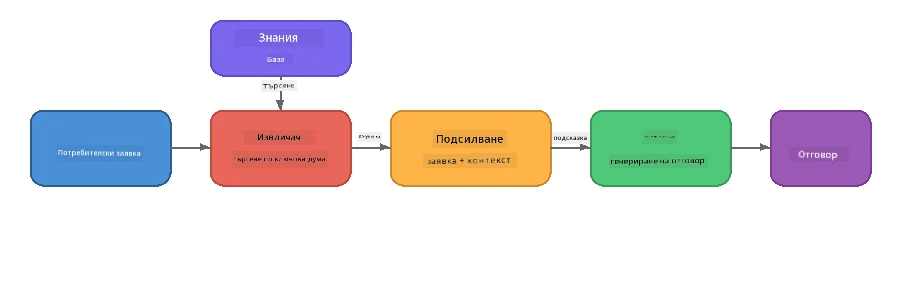

# Част 4: Създаване на RAG приложение с Foundry Local

## Преглед

Големите езикови модели са мощни, но знаят само това, което е било в техните учебни данни. **Retrieval-Augmented Generation (RAG)** решава този проблем, като предоставя на модела релевантен контекст по време на заявка - извлечен от вашите собствени документи, бази данни или бази от знания.

В този урок ще изградите пълен RAG конвейер, който работи **изцяло на вашето устройство** с помощта на Foundry Local. Без облачни услуги, без векторни бази данни, без embeddings API - само локално извличане и локален модел.

## Цели на обучението

Към края на този урок ще можете да:

- Обясните какво е RAG и защо е важно за AI приложения
- Създадете локална база знания от текстови документи
- Реализирате проста функция за извличане на релевантен контекст
- Съставите системен prompt, който основава модела върху извлечените факти
- Стартирате пълния конвейер Retrieve → Augment → Generate на устройството
- Разберете компромисите между просто извличане по ключови думи и векторно търсене

---

## Предварителни изисквания

- Да сте завършили [Част 3: Използване на Foundry Local SDK с OpenAI](part3-sdk-and-apis.md)
- Инсталиран Foundry Local CLI и изтеглен модел `phi-3.5-mini`

---

## Концепция: Какво е RAG?

Без RAG, един LLM може да отговаря само на база своите учебни данни – които могат да са остарели, непълни или да нямат вашата лична информация:

```
User: "What is Zava's return policy?"
LLM:  "I do not have information about Zava's return policy."  ← No context!
```

С RAG, първо **извличате** релевантни документи, след това **допълвате** prompt-а с този контекст преди да **генерирате** отговор:



Ключовото прозрение: **моделът не трябва да "знае" отговора; той просто трябва да прочете правилните документи.**

---

## Лабораторни упражнения

### Упражнение 1: Разберете базата знания

Отворете RAG примера за вашия език и разгледайте базата знания:

<details>
<summary><b>🐍 Python: <code>python/foundry-local-rag.py</code></b></summary>

Базата знания е прост списък с речници, със свойства `title` и `content`:

```python
KNOWLEDGE_BASE = [
    {
        "title": "Foundry Local Overview",
        "content": (
            "Foundry Local brings the power of Azure AI Foundry to your local "
            "device without requiring an Azure subscription..."
        ),
    },
    {
        "title": "Supported Hardware",
        "content": (
            "Foundry Local automatically selects the best model variant for "
            "your hardware. If you have an Nvidia CUDA GPU it downloads the "
            "CUDA-optimized model..."
        ),
    },
    # ... още записи
]
```

Всяка запись представлява "парче" знание - фокусирана информация по една тема.

</details>

<details>
<summary><b>📘 JavaScript: <code>javascript/foundry-local-rag.mjs</code></b></summary>

Базата знания използва същата структура като масив от обекти:

```javascript
const KNOWLEDGE_BASE = [
  {
    title: "Foundry Local Overview",
    content:
      "Foundry Local brings the power of Azure AI Foundry to your local " +
      "device without requiring an Azure subscription...",
  },
  {
    title: "Supported Hardware",
    content:
      "Foundry Local automatically selects the best model variant for " +
      "your hardware...",
  },
  // ... още записи
];
```

</details>

<details>
<summary><b>💜 C#: <code>csharp/RagPipeline.cs</code></b></summary>

Базата знания използва списък от именувани tuples:

```csharp
private static readonly List<(string Title, string Content)> KnowledgeBase =
[
    ("Foundry Local Overview",
     "Foundry Local brings the power of Azure AI Foundry to your local " +
     "device without requiring an Azure subscription..."),

    ("Supported Hardware",
     "Foundry Local automatically selects the best model variant for " +
     "your hardware..."),

    // ... more entries
];
```

</details>

> **В реално приложение**, базата знания идва от файлове на диск, база данни, индекс за търсене или API. За този урок използваме списък в паметта за опростяване.

---

### Упражнение 2: Разберете функцията за извличане

Стъпката за извличане намира най-релевантните парчета информация за въпроса на потребителя. Този пример използва **пресичане на ключови думи** - брои колко думи от заявката се съдържат във всяко парче:

<details>
<summary><b>🐍 Python</b></summary>

```python
def retrieve(query: str, top_k: int = 2) -> list[dict]:
    """Return the top-k knowledge chunks most relevant to the query."""
    query_words = set(query.lower().split())
    scored = []
    for chunk in KNOWLEDGE_BASE:
        chunk_words = set(chunk["content"].lower().split())
        overlap = len(query_words & chunk_words)
        scored.append((overlap, chunk))
    scored.sort(key=lambda x: x[0], reverse=True)
    return [item[1] for item in scored[:top_k]]
```

</details>

<details>
<summary><b>📘 JavaScript</b></summary>

```javascript
function retrieve(query, topK = 2) {
  const queryWords = new Set(query.toLowerCase().split(/\s+/));
  const scored = KNOWLEDGE_BASE.map((chunk) => {
    const chunkWords = new Set(chunk.content.toLowerCase().split(/\s+/));
    let overlap = 0;
    for (const w of queryWords) {
      if (chunkWords.has(w)) overlap++;
    }
    return { overlap, chunk };
  });
  scored.sort((a, b) => b.overlap - a.overlap);
  return scored.slice(0, topK).map((s) => s.chunk);
}
```

</details>

<details>
<summary><b>💜 C#</b></summary>

```csharp
private static List<(string Title, string Content)> Retrieve(string query, int topK = 2)
{
    var queryWords = new HashSet<string>(
        query.ToLowerInvariant().Split(' ', StringSplitOptions.RemoveEmptyEntries));

    return KnowledgeBase
        .Select(chunk =>
        {
            var chunkWords = new HashSet<string>(
                chunk.Content.ToLowerInvariant().Split(' ', StringSplitOptions.RemoveEmptyEntries));
            var overlap = queryWords.Intersect(chunkWords).Count();
            return (Overlap: overlap, Chunk: chunk);
        })
        .OrderByDescending(x => x.Overlap)
        .Take(topK)
        .Select(x => x.Chunk)
        .ToList();
}
```

</details>

**Как работи:**
1. Разделя заявката на отделни думи
2. За всяко парче знание брои колко думи от заявката се съдържат в него
3. Сортира по резултат от припокриване (най-висок първо)
4. Връща top-k най-релевантни парчета

> **Компромис:** Простото припокриване на ключови думи е лесно, но ограничено; не разбира синоними или значение. Производствените RAG системи обикновено използват **embedding вектори** и **векторна база** за семантично търсене. Въпреки това, припокриването на ключови думи е отлична отправна точка и не изисква допълнителни зависимости.

---

### Упражнение 3: Разберете подсиленото подканяне

Извлеченият контекст се инжектира в **системния prompt** преди да бъде изпратен към модела:

```python
system_prompt = (
    "You are a helpful assistant. Answer the user's question using ONLY "
    "the information provided in the context below. If the context does "
    "not contain enough information, say so.\n\n"
    f"Context:\n{context_text}"
)
```

Ключови дизайнерски решения:
- **"САМО предоставената информация"** - предотвратява халюцинация на факти, които не са в контекста
- **"Ако контекстът не съдържа достатъчно информация, кажи го"** - насърчава честни отговори "Не знам"
- Контекстът е поставен в системното съобщение, така че оформя всички отговори

---

### Упражнение 4: Стартиране на RAG конвейера

Стартирайте пълния пример:

**Python:**
```bash
cd python
python foundry-local-rag.py
```

**JavaScript:**
```bash
cd javascript
node foundry-local-rag.mjs
```

**C#:**
```bash
cd csharp
dotnet run rag
```

Трябва да видите три неща отпечатани:
1. **Въпросът**, който се задава
2. **Извлеченият контекст** - парчетата, избрани от базата знания
3. **Отговорът** - генериран от модела само въз основа на този контекст

Примерен изход:
```
Question: How do I install Foundry Local and what hardware does it support?

--- Retrieved Context ---
### Installation
On Windows install Foundry Local with: winget install Microsoft.FoundryLocal...

### Supported Hardware
Foundry Local automatically selects the best model variant for your hardware...
-------------------------

Answer: To install Foundry Local, you can use the following methods depending
on your operating system: On Windows, run `winget install Microsoft.FoundryLocal`.
On macOS, use `brew install microsoft/foundrylocal/foundrylocal`...
```

Забележете как отговорът на модела е **обоснован** в извлечения контекст - той споменава само факти от документите в базата знания.

---

### Упражнение 5: Експериментирайте и разширявайте

Опитайте тези промени, за да задълбочите разбирането си:

1. **Променете въпроса** - задайте нещо, което Е в базата знания vs. което НЕ Е:
   ```python
   question = "What programming languages does Foundry Local support?"  # ← В контекста
   question = "How much does Foundry Local cost?"                       # ← Не е в контекста
   ```
   Моделът правилно ли казва "Не знам" когато отговорът не е в контекста?

2. **Добавете ново парче знание** - добавете нов запис в `KNOWLEDGE_BASE`:
   ```python
   {
       "title": "Pricing",
       "content": "Foundry Local is completely free and open source under the MIT license.",
   }
   ```
   Сега задайте отново въпроса за цената.

3. **Променете `top_k`** - извлечете повече или по-малко парчета:
   ```python
   context_chunks = retrieve(question, top_k=3)  # Повече контекст
   context_chunks = retrieve(question, top_k=1)  # По-малко контекст
   ```
   Как количеството контекст влияе на качеството на отговора?

4. **Премахнете инструкциите за основа** - променете системния prompt на просто "Вие сте полезен асистент." и вижте дали моделът започва да халюцинира факти.

---

## Задълбочен поглед: Оптимизиране на RAG за изпълнение на устройство

Изпълнението на RAG на устройство въвежда ограничения, които не съществуват в облака: ограничена RAM, липса на специализиран GPU (изпълнение на CPU/NPU), и малък прозорец на контекста на модела. По-долу посочените дизайнерски решения директно адресират тези ограничения и са базирани на модели от производствени локални RAG приложения, изградени с Foundry Local.

### Стратегия за парчета: Фиксиран размер със припокриване

Разделянето на документи на парчета е едно от най-важните решения във всяка RAG система. За сценарии на устройство, препоръчителната начална точка е **фиксиран размер на припокриващо се плъзгащо се прозорче**:

| Параметър | Препоръчителна стойност | Защо |
|-----------|-------------------------|------|
| **Размер на парче** | ~200 токена | Поддържа извлечения контекст компактен, като оставя място в контекстния прозорец на Phi-3.5 Mini за системния prompt, история на диалога и генериран изход |
| **Припокриване** | ~25 токена (12.5%) | Предотвратява загуба на информация по граници на парчетата - важно за процедури и стъпкови инструкции |
| **Токенизация** | Разделяне по празно пространство | Нула зависимости, не е нужна библиотека за токенизиране. Всички ресурси остават за LLM |

Припокриването работи като плъзгащо се прозорче: всяко следващо парче започва 25 токена преди края на предишното, така че изречения, които се простират през границите, се появяват в двете парчета.

> **Защо не други стратегии?**
> - **Разделяне на изречения** дава непредсказуем размер на парчетата; някои процедури са единични дълги изречения, които не биха се разделили добре
> - **Разделяне по секции** (по заглавия `##`) създава много различни по размер парчета – някои прекалено малки, други прекалено големи за контекстния прозорец на модела
> - **Семантично парчене** (чрез embedding базирана детекция на теми) дава най-доброто качество на извличане, но изисква допълнителен модел в паметта до Phi-3.5 Mini – рисково на машини с 8-16 GB споделена памет

### Подобряване на извличането: TF-IDF вектори

Подходът с припокриване по ключови думи в този урок работи, но ако искате по-добро извличане без добавяне на embedding модел, **TF-IDF (Term Frequency-Inverse Document Frequency)** е отлична среда:

```
Keyword Overlap  →  TF-IDF Vectors  →  Embedding Models
    (this lab)     (lightweight upgrade)   (production)
  Simple & fast    Better ranking,         Best quality,
  No dependencies  still no ML model       requires embedding model
  ~Basic matching  ~1ms retrieval          ~100-500ms per query
```

TF-IDF преобразува всяко парче в числов вектор базиран на това колко важна е всяка дума в това парче *относително към всички парчета*. При заявка, въпросът се векторизира по същия начин и се сравнява чрез косинусова подобност. Можете да реализирате това с SQLite и чист JavaScript/Python – без векторна база данни, без embedding API.

> **Производителност:** Косинусовата подобност с TF-IDF върху фиксирани парчета обикновено постига **~1ms време за извличане**, спрямо ~100-500ms когато embedding модел кодира всяка заявка. Всички 20+ документа могат да бъдат парчени и индексирани за по-малко от секунда.

### Режим Edge/Compact за устройства с ограничения

При работа на много ограничен хардуер (по-стари лаптопи, таблети, полеви устройства) можете да намалите използването на ресурси чрез намаляване на три параметъра:

| Настройка | Стандартен режим | Edge/Compact режим |
|-----------|------------------|--------------------|
| **Системен prompt** | ~300 токена | ~80 токена |
| **Макс брой токени за изход** | 1024 | 512 |
| **Извлечени парчета (top-k)** | 5 | 3 |

По-малко извлечени парчета означава по-малко контекст за обработка от модела, което намалява латентността и натиска на паметта. По-краткият системен prompt освобождава повече място в контекстния прозорец за реалния отговор. Този компромис е оправдан на устройства, където всеки токен в контекстния прозорец има значение.

### Единствен модел в паметта

Едно от най-важните правила за on-device RAG: **задържайте само един зареден модел**. Ако използвате embedding модел за извличане *и* езиков модел за генериране, вие разделяте ограничени ресурси на NPU/RAM между два модела. Леки методи за извличане (припокриване на ключови думи, TF-IDF) избягват това напълно:

- Няма embedding модел, който да конкурира с LLM за памет
- По-бърз студен старт - зарежда се само един модел
- Предвидима употреба на памет - LLM получава всички ресурси
- Работи на машини с едва 8 GB RAM

### SQLite като локален векторен стор

За малки до средни колекции документи (стотици до няколко хиляди парчета) **SQLite е достатъчно бърз** за брутално търсене по косинусова подобност и не добавя никаква инфраструктура:

- Един `.db` файл на диска - без сървърни процеси, без конфигурация
- Включва се с всеки основен езиков runtime (Python `sqlite3`, Node.js `better-sqlite3`, .NET `Microsoft.Data.Sqlite`)
- Съхранява парчета документи заедно с TF-IDF вектори в една таблица
- Не се нуждае от Pinecone, Qdrant, Chroma или FAISS на този мащаб

### Обобщение на производителността

Тези дизайнерски решения комбинират за постигане на отзивчив RAG върху потребителски хардуер:

| Показател | Изпълнение на устройството |
|-----------|----------------------------|
| **Латентност при извличане** | ~1ms (TF-IDF) до ~5ms (припокриване на ключови думи) |
| **Скорост на индексиране** | 20 документа, парчени и индексирани за < 1 секунда |
| **Модели в паметта** | 1 (само LLM - без embedding модел) |
| **Относителен обем на съхранение** | < 1 MB за парчета + вектори в SQLite |
| **Студен старт** | Зареждане на един модел, без startup за embedding runtime |
| **Минимален хардуер** | 8 GB RAM, само CPU (не е необходим GPU) |

> **Кога да ъпгрейдвате:** Ако стигнете до стотици дълги документи, смесено съдържание (таблици, код, проза) или се нуждаете от семантично разбиране на заявки, обмислете добавяне на embedding модел и превключване към векторно търсене по подобие. За повечето on-device случаи с фокусирани документи TF-IDF + SQLite дава отлични резултати с минимално използване на ресурси.

---

## Ключови концепции

| Концепция | Описание |
|-----------|----------|
| **Извличане** | Намиране на релевантни документи от база знания спрямо заявката на потребителя |
| **Допълване** | Вмъкване на извлечените документи в prompt-а като контекст |
| **Генериране** | LLM произвежда отговор, основан на предоставения контекст |
| **Парчене** | Разбиване на големи документи на по-малки, фокусирани части |
| **Основа** | Ограничаване на модела само до предоставения контекст (намалява халюциниране) |
| **Top-k** | Брой на най-релевантните парчета, които се извличат |

---

## RAG в продукция спрямо този урок

| Аспект | Този урок | Оптимизиран за устройство | Облачна продукция |
|--------|-----------|---------------------------|-------------------|
| **База знания** | Списък в паметта | Файлове на диск, SQLite | База данни, индекс за търсене |
| **Извличане** | Припокриване на ключови думи | TF-IDF + косинусова подобност | Векторни embeddings + търсене по подобие |
| **Embeddings** | Не се изискват | Не - TF-IDF вектори | Embedding модел (локален или облачен) |
| **Векторен стор** | Не се изисква | SQLite (един `.db` файл) | FAISS, Chroma, Azure AI Search и др. |
| **Парчене** | Ръчно | Фиксиран размер, плъзгащо прозорче (~200 токена, 25 токена припокриване) | Семантично или рекурсивно парчене |
| **Модели в паметта** | 1 (LLM) | 1 (LLM) | 2+ (embedding + LLM) |
| **Забавяне при извличане** | ~5ms | ~1ms | ~100-500ms |
| **Мащаб** | 5 документа | Стотици документи | Милиони документи |

Шаблоните, които научавате тук (извличане, допълване, генериране), са същите при всякакъв мащаб. Методът на извличане се подобрява, но цялостната архитектура остава идентична. Средната колона показва какво е постижимо на устройството с леки техники, често идеалното решение за локални приложения, където жертвате мащаба на облака в замяна на поверителност, възможност за работа офлайн и нулево забавяне при външни услуги.

---

## Основни изводи

| Концепция | Какво научихте |
|-----------|----------------|
| RAG шаблон | Извличане + Допълване + Генериране: дава на модела правилния контекст и той може да отговаря на въпроси за вашите данни |
| На устройството | Всичко се изпълнява локално без облачни API или абонаменти за векторна база данни |
| Инструкции за основаване | Системните подсказки са критични за предотвратяване на халюцинации |
| Пресичане на ключови думи | Прост, но ефективен начален подход за извличане |
| TF-IDF + SQLite | Лек път за надграждане, който поддържа извличането под 1ms без модел за вграждане |
| Един модел в паметта | Избягвайте зареждането на модел за вграждане заедно с LLM на ограничен хардуер |
| Размер на частта | Около 200 токена с припокриване балансират прецизността на извличане и ефективността на контекстния прозорец |
| Режим Edge/компактен | Използвайте по-малко части и по-къси подсказки за много ограничени устройства |
| Универсален шаблон | Същата RAG архитектура работи за всеки източник на данни: документи, бази данни, API или уики |

> **Искате ли да видите пълно приложение RAG на устройството?** Вижте [Gas Field Local RAG](https://github.com/leestott/local-rag), офлайн агент в производствен стил, изграден с Foundry Local и Phi-3.5 Mini, който демонстрира тези оптимизационни шаблони с реален набор от документи.

---

## Следващи стъпки

Продължете към [Част 5: Създаване на AI агенти](part5-single-agents.md), за да научите как да създавате интелигентни агенти с персонажи, инструкции и многотурови разговори, използвайки Microsoft Agent Framework.