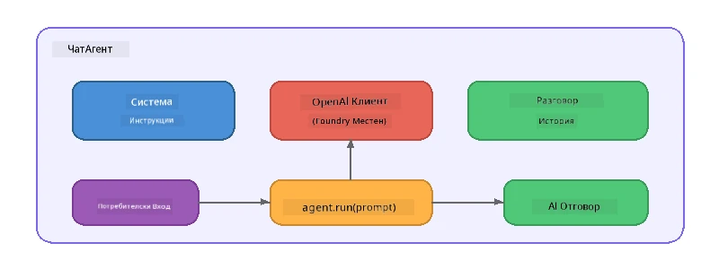

# Част 5: Създаване на AI агенти с Agent Framework

> **Цел:** Създайте своя първи AI агент с постоянни инструкции и дефинирана персона, задвижван от локален модел чрез Foundry Local.

## Какво е AI агент?

AI агент обвива езиков модел със **системни инструкции**, които определят неговото поведение, личност и ограничения. За разлика от отделно повикване на чат завършване, агентът осигурява:

- **Персона** - последователна идентичност („Ти си полезен прегледач на код“)
- **Памет** - история на разговора през различни ходове
- **Специализация** - насочено поведение, управлявано от добре изготвени инструкции



---

## Microsoft Agent Framework

**Microsoft Agent Framework** (AGF) предоставя стандартна абстракция за агент, която работи с различни бекендове на моделите. В този урок го съчетаваме с Foundry Local, така че всичко да работи на вашия компютър – без нужда от облак.

| Концепция | Описание |
|---------|-------------|
| `FoundryLocalClient` | Python: обработва стартирането на услугата, изтеглянето/зареждането на модела и създава агенти |
| `client.as_agent()` | Python: създава агент от клиента Foundry Local |
| `AsAIAgent()` | C#: метод-расширение върху `ChatClient` - създава `AIAgent` |
| `instructions` | Системна подсказка, която формира поведението на агента |
| `name` | Човеко-четливо обозначение, полезно при сценарии с много агенти |
| `agent.run(prompt)` / `RunAsync()` | Изпраща потребителско съобщение и връща отговора на агента |

> **Забележка:** Agent Framework има SDK за Python и .NET. За JavaScript реализираме лек клас `ChatAgent`, който отразява същия модел, използвайки директно OpenAI SDK.

---

## Упражнения

### Упражнение 1 - Разберете агентиалния модел

Преди да пишете код, изучете ключовите компоненти на агент:

1. **Клиент на модела** - свързва се с OpenAI-съвместимото API на Foundry Local
2. **Системни инструкции** - „Личността“ на подсказката
3. **Цикъл на изпълнение** - изпращане на потребителски вход, получаване на изход

> **Помислете:** Как се различават системните инструкции от обикновено потребителско съобщение? Какво се случва, ако ги промените?

---

### Упражнение 2 - Стартирайте примера с един агент

<details>
<summary><strong>🐍 Python</strong></summary>

**Изисквания:**
```bash
cd python
python -m venv venv

# Windows (PowerShell):
venv\Scripts\Activate.ps1
# macOS:
source venv/bin/activate

pip install -r requirements.txt
```

**Стартиране:**
```bash
python foundry-local-with-agf.py
```

**Преглед на кода** (`python/foundry-local-with-agf.py`):

```python
import asyncio
from agent_framework_foundry_local import FoundryLocalClient

async def main():
    alias = "phi-4-mini"

    # FoundryLocalClient обработва стартирането на услугата, изтеглянето на модела и зареждането
    client = FoundryLocalClient(model_id=alias)
    print(f"Client Model ID: {client.model_id}")

    # Създайте агент с инструкции за системата
    agent = client.as_agent(
        name="Joker",
        instructions="You are good at telling jokes.",
    )

    # Без стрийминг: получаване на пълния отговор наведнъж
    result = await agent.run("Tell me a joke about a pirate.")
    print(f"Agent: {result}")

    # Стрийминг: получаване на резултатите, докато се генерират
    async for chunk in agent.run("Tell me another joke.", stream=True):
        if chunk.text:
            print(chunk.text, end="", flush=True)

asyncio.run(main())
```

**Ключови точки:**
- `FoundryLocalClient(model_id=alias)` обработва стартирането на услугата, изтеглянето и зареждането на модела в една стъпка
- `client.as_agent()` създава агент със системни инструкции и име
- `agent.run()` поддържа както без стрийминг, така и стрийминг режим
- Инсталирайте чрез `pip install agent-framework-foundry-local --pre`

</details>

<details>
<summary><strong>📦 JavaScript</strong></summary>

**Изисквания:**
```bash
cd javascript
npm install
```

**Стартиране:**
```bash
node foundry-local-with-agent.mjs
```

**Преглед на кода** (`javascript/foundry-local-with-agent.mjs`):

```javascript
import { OpenAI } from "openai";
import { FoundryLocalManager } from "foundry-local-sdk";

class ChatAgent {
  constructor({ client, modelId, instructions, name }) {
    this.client = client;
    this.modelId = modelId;
    this.instructions = instructions;
    this.name = name;
    this.history = [];
  }

  async run(userMessage) {
    const messages = [
      { role: "system", content: this.instructions },
      ...this.history,
      { role: "user", content: userMessage },
    ];
    const response = await this.client.chat.completions.create({
      model: this.modelId,
      messages,
    });
    const assistantMessage = response.choices[0].message.content;

    // Запазване на историята на разговора за многократни взаимодействия
    this.history.push({ role: "user", content: userMessage });
    this.history.push({ role: "assistant", content: assistantMessage });
    return { text: assistantMessage };
  }
}

async function main() {
  FoundryLocalManager.create({ appName: "FoundryLocalWorkshop" });
  const manager = FoundryLocalManager.instance;
  await manager.startWebService();

  const catalog = manager.catalog;
  const model = await catalog.getModel("phi-3.5-mini");
  if (!model.isCached) {
    console.log("Downloading model: phi-3.5-mini...");
    await model.download();
  }
  await model.load();

  const client = new OpenAI({
    baseURL: manager.urls[0] + "/v1",
    apiKey: "foundry-local",
  });

  const agent = new ChatAgent({
    client,
    modelId: model.id,
    instructions: "You are good at telling jokes.",
    name: "Joker",
  });

  const result = await agent.run("Tell me a joke about a pirate.");
  console.log(result.text);
}

main();
```

**Ключови точки:**
- JavaScript създава свой собствен клас `ChatAgent`, който отразява Python AGF модела
- `this.history` съхранява ходовете на разговора за поддръжка на множество ходове
- Ясни стъпки: `startWebService()` → проверка на кеш → `model.download()` → `model.load()` за пълна видимост

</details>

<details>
<summary><strong>💜 C#</strong></summary>

**Изисквания:**
```bash
cd csharp
dotnet restore
```

**Стартиране:**
```bash
dotnet run agent
```

**Преглед на кода** (`csharp/SingleAgent.cs`):

```csharp
using Microsoft.AI.Foundry.Local;
using Microsoft.Extensions.Logging.Abstractions;
using Microsoft.Agents.AI;
using OpenAI;
using System.ClientModel;

// 1. Start Foundry Local and load a model
var alias = "phi-3.5-mini";
await FoundryLocalManager.CreateAsync(
    new Configuration
    {
        AppName = "FoundryLocalSamples",
        Web = new Configuration.WebService { Urls = "http://127.0.0.1:0" }
    }, NullLogger.Instance, default);
var manager = FoundryLocalManager.Instance;
await manager.StartWebServiceAsync(default);

var catalog = await manager.GetCatalogAsync(default);
var model = await catalog.GetModelAsync(alias, default);

var isCached = await model.IsCachedAsync(default);
if (!isCached)
{
    Console.WriteLine($"Downloading model: {alias}...");
    await model.DownloadAsync(null, default);
}
await model.LoadAsync(default);

var key = new ApiKeyCredential("foundry-local");
var client = new OpenAIClient(key, new OpenAIClientOptions
{
    Endpoint = new Uri(manager.Urls[0] + "/v1")
});

// 2. Create an AIAgent using the Agent Framework extension method
AIAgent joker = client
    .GetChatClient(model.Id)
    .AsAIAgent(
        instructions: "You are good at telling jokes. Keep your jokes short and family-friendly.",
        name: "Joker"
    );

// 3. Run the agent (non-streaming)
var response = await joker.RunAsync("Tell me a joke about a pirate.");
Console.WriteLine($"Joker: {response}");

// 4. Run with streaming
await foreach (var update in joker.RunStreamingAsync("Tell me another joke."))
{
    Console.Write(update);
}
```

**Ключови точки:**
- `AsAIAgent()` е метод-расширение от `Microsoft.Agents.AI.OpenAI` - не е нужна специална `ChatAgent` класа
- `RunAsync()` връща цялостния отговор; `RunStreamingAsync()` стриймва токен по токен
- Инсталирайте чрез `dotnet add package Microsoft.Agents.AI.OpenAI --version 1.0.0-rc3`

</details>

---

### Упражнение 3 - Променете личността

Модифицирайте `instructions` на агента, за да създадете различна персона. Опитайте всяка и наблюдавайте как се променя изходът:

| Личност | Инструкции |
|---------|-------------|
| Прегледач на код | `"Ти си експертен прегледач на код. Давaй конструктивна обратна връзка, фокусирана върху четливост, производителност и коректност."` |
| Туристически гид | `"Ти си приятелски туристически гид. Давай персонализирани препоръки за дестинации, дейности и местна кухня."` |
| Сократичен учител | `"Ти си сократичен учител. Никога не давай директни отговори - вместо това напътствай ученика с обмислени въпроси."` |
| Технически писач | `"Ти си технически писач. Обяснявай концепциите ясно и кратко. Използвай примери. Избягвай жаргон."` |

**Опитайте:**
1. Изберете персона от таблицата по-горе
2. Заменете низa `instructions` в кода
3. Настройте потребителската подсказка да съответства (например, помолете прегледача на код да ревизира функция)
4. Стартирайте примера отново и сравнете изхода

> **Съвет:** Качеството на агента силно зависи от инструкциите. Специфични, добре структурирани инструкции дават по-добри резултати от неясните.

---

### Упражнение 4 - Добавяне на мултиходов разговор

Разширете примера, за да поддържа многоходов разговор, така че да можете да водите диалог с агента.

<details>
<summary><strong>🐍 Python - многоходов цикъл</strong></summary>

```python
import asyncio
from agent_framework_foundry_local import FoundryLocalClient

async def main():
    client = FoundryLocalClient(model_id="phi-4-mini")

    agent = client.as_agent(
        name="Assistant",
        instructions="You are a helpful assistant.",
    )

    print("Chat with the agent (type 'quit' to exit):\n")
    while True:
        user_input = input("You: ")
        if user_input.strip().lower() in ("quit", "exit"):
            break
        result = await agent.run(user_input)
        print(f"Agent: {result}\n")

asyncio.run(main())
```

</details>

<details>
<summary><strong>📦 JavaScript - многоходов цикъл</strong></summary>

```javascript
import { OpenAI } from "openai";
import { FoundryLocalManager } from "foundry-local-sdk";
import * as readline from "node:readline/promises";

// (повторна употреба на класа ChatAgent от Упражнение 2)

async function main() {
  FoundryLocalManager.create({ appName: "FoundryLocalWorkshop" });
  const manager = FoundryLocalManager.instance;
  await manager.startWebService();

  const catalog = manager.catalog;
  const model = await catalog.getModel("phi-3.5-mini");
  if (!model.isCached) {
    console.log("Downloading model: phi-3.5-mini...");
    await model.download();
  }
  await model.load();

  const client = new OpenAI({
    baseURL: manager.urls[0] + "/v1",
    apiKey: "foundry-local",
  });

  const agent = new ChatAgent({
    client,
    modelId: model.id,
    instructions: "You are a helpful assistant.",
    name: "Assistant",
  });

  const rl = readline.createInterface({
    input: process.stdin,
    output: process.stdout,
  });

  console.log("Chat with the agent (type 'quit' to exit):\n");
  while (true) {
    const userInput = await rl.question("You: ");
    if (["quit", "exit"].includes(userInput.trim().toLowerCase())) break;
    const result = await agent.run(userInput);
    console.log(`Agent: ${result.text}\n`);
  }
  rl.close();
}

main();
```

</details>

<details>
<summary><strong>💜 C# - многоходов цикъл</strong></summary>

```csharp
using Microsoft.AI.Foundry.Local;
using Microsoft.Extensions.Logging.Abstractions;
using Microsoft.Agents.AI;
using OpenAI;
using System.ClientModel;

var alias = "phi-3.5-mini";
var config = new Configuration
{
    AppName = "FoundryLocalSamples",
    Web = new Configuration.WebService { Urls = "http://127.0.0.1:0" }
};
await FoundryLocalManager.CreateAsync(config, NullLogger.Instance, default);
var manager = FoundryLocalManager.Instance;
await manager.StartWebServiceAsync(default);

var catalog = await manager.GetCatalogAsync(default);
var model = await catalog.GetModelAsync(alias, default);

var isCached = await model.IsCachedAsync(default);
if (!isCached)
{
    Console.WriteLine($"Downloading model: {alias}...");
    await model.DownloadAsync(null, default);
}
await model.LoadAsync(default);

var key = new ApiKeyCredential("foundry-local");
var client = new OpenAIClient(key, new OpenAIClientOptions
{
    Endpoint = new Uri(manager.Urls[0] + "/v1")
});

AIAgent agent = client
    .GetChatClient(model.Id)
    .AsAIAgent(
        instructions: "You are a helpful assistant.",
        name: "Assistant"
    );

Console.WriteLine("Chat with the agent (type 'quit' to exit):\n");
while (true)
{
    Console.Write("You: ");
    var userInput = Console.ReadLine();
    if (string.IsNullOrWhiteSpace(userInput) ||
        userInput.Equals("quit", StringComparison.OrdinalIgnoreCase) ||
        userInput.Equals("exit", StringComparison.OrdinalIgnoreCase))
        break;

    var result = await agent.RunAsync(userInput);
    Console.WriteLine($"Agent: {result}\n");
}
```

</details>

Забележете как агентът помни предишните ходове - задайте следващ въпрос и вижте контекста да продължава.

---

### Упражнение 5 - Структуриран изход

Инструктурирайте агента винаги да отговаря в определен формат (например JSON) и анализирайте резултата:

<details>
<summary><strong>🐍 Python - JSON изход</strong></summary>

```python
import asyncio
import json
from agent_framework_foundry_local import FoundryLocalClient

async def main():
    client = FoundryLocalClient(model_id="phi-4-mini")

    agent = client.as_agent(
        name="SentimentAnalyzer",
        instructions=(
            "You are a sentiment analysis agent. "
            "For every user message, respond ONLY with valid JSON in this format: "
            '{"sentiment": "positive|negative|neutral", "confidence": 0.0-1.0, "summary": "brief reason"}'
        ),
    )

    result = await agent.run("I absolutely loved the new restaurant downtown!")
    print("Raw:", result)

    try:
        parsed = json.loads(str(result))
        print(f"Sentiment: {parsed['sentiment']} (confidence: {parsed['confidence']})")
    except json.JSONDecodeError:
        print("Agent did not return valid JSON - try refining the instructions.")

asyncio.run(main())
```

</details>

<details>
<summary><strong>💜 C# - JSON изход</strong></summary>

```csharp
using System.Text.Json;

AIAgent analyzer = chatClient.AsAIAgent(
    name: "SentimentAnalyzer",
    instructions:
        "You are a sentiment analysis agent. " +
        "For every user message, respond ONLY with valid JSON in this format: " +
        "{\"sentiment\": \"positive|negative|neutral\", \"confidence\": 0.0-1.0, \"summary\": \"brief reason\"}"
);

var response = await analyzer.RunAsync("I absolutely loved the new restaurant downtown!");
Console.WriteLine($"Raw: {response}");

try
{
    var parsed = JsonSerializer.Deserialize<JsonElement>(response.ToString());
    Console.WriteLine($"Sentiment: {parsed.GetProperty("sentiment")} " +
                      $"(confidence: {parsed.GetProperty("confidence")})");
}
catch (JsonException)
{
    Console.WriteLine("Agent did not return valid JSON - try refining the instructions.");
}
```

</details>

> **Забележка:** Малките локални модели може да не генерират винаги напълно валиден JSON. Можете да подобрите надеждността, като включите пример в инструкциите и сте много изрични относно очаквания формат.

---

## Основни изводи

| Концепция | Какво научихте |
|---------|-----------------|
| Агент срещу директно повикване на LLM | Агентът обвива модел с инструкции и памет |
| Системни инструкции | Най-важният лост за контрол на поведението на агента |
| Многоходов разговор | Агентите могат да пренасят контекст през множество взаимодействия |
| Структуриран изход | Инструкциите могат да налагат формат на изхода (JSON, markdown и др.) |
| Локално изпълнение | Всичко се изпълнява на устройството чрез Foundry Local – без облак |

---

## Следващи стъпки

В **[Част 6: Работни процеси с много агенти](part6-multi-agent-workflows.md)** ще комбинирате множество агенти в координиран конвейер, където всеки агент има специализирана роля.