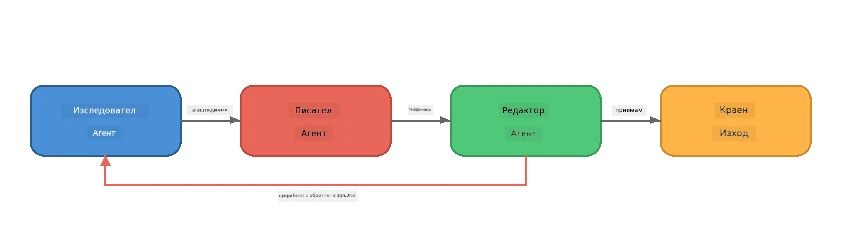
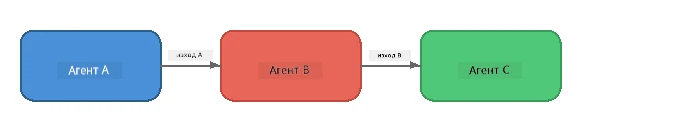
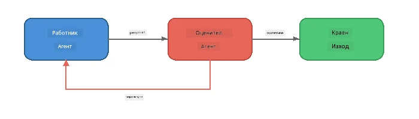
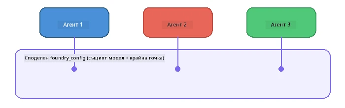

# Част 6: Множество агенти в работни потоци

> **Цел:** Комбиниране на няколко специализирани агенти в координирани потоци от задачи, които разделят сложни задачи между сътрудничещи агенти - всички работещи локално с Foundry Local.

## Защо Множество агенти?

Един агент може да обработва много задачи, но сложните работни потоци се възползват от **Специализация**. Вместо един агент да се опитва да проучва, пише и редактира едновременно, разделяте работата на фокусирани роли:



| Модел | Описание |
|---------|-------------|
| **Последователен** | Изходът на Агент А се подава като вход към Агент Б → Агент В |
| **Обратна връзка** | Оценяващ агент може да върне работа за преработка |
| **Споделен контекст** | Всички агенти използват същия модел/краен адрес, но с различни инструкции |
| **Типизиран изход** | Агентите произвеждат структурирани резултати (JSON) за надеждно предаване |

---

## Упражнения

### Упражнение 1 - Стартиране на Множество-агентския поток

Работилницата включва пълен поток Изследовател → Писател → Редактор.

<details>
<summary><strong>🐍 Python</strong></summary>

**Настройка:**
```bash
cd python
python -m venv venv

# Windows (PowerShell):
venv\Scripts\Activate.ps1
# macOS:
source venv/bin/activate

pip install -r requirements.txt
```

**Стартиране:**
```bash
python foundry-local-multi-agent.py
```

**Какво се случва:**
1. **Изследовател** получава тема и връща факти под формата на точки
2. **Писател** взема изследването и подготвя блог пост (3-4 параграфа)
3. **Редактор** преглежда статията за качество и връща ПРИЕМИ или ПРЕРАБОТИ

</details>

<details>
<summary><strong>📦 JavaScript</strong></summary>

**Настройка:**
```bash
cd javascript
npm install
```

**Стартиране:**
```bash
node foundry-local-multi-agent.mjs
```

**Същият тристепенен поток** - Изследовател → Писател → Редактор.

</details>

<details>
<summary><strong>💜 C#</strong></summary>

**Настройка:**
```bash
cd csharp
dotnet restore
```

**Стартиране:**
```bash
dotnet run multi
```

**Същият тристепенен поток** - Изследовател → Писател → Редактор.

</details>

---

### Упражнение 2 - Анализ на потока

Изучете как агенти са дефинирани и свързани:

**1. Споделен клиент на модела**

Всички агенти използват един и същ модел на Foundry Local:

```python
# Python - FoundryLocalClient обработва всичко
from agent_framework_foundry_local import FoundryLocalClient

client = FoundryLocalClient(model_id="phi-3.5-mini")
```

```javascript
// JavaScript - OpenAI SDK насочен към Foundry Local
const client = new OpenAI({
  baseURL: manager.urls[0] + "/v1",
  apiKey: "foundry-local",
});
```

```csharp
// C# - OpenAIClient pointed at Foundry Local
var key = new ApiKeyCredential("foundry-local");
var client = new OpenAIClient(key, new OpenAIClientOptions
{
    Endpoint = new Uri(manager.Urls[0] + "/v1")
});
var chatClient = client.GetChatClient(model.Id);
```

**2. Специализирани инструкции**

Всеки агент има различна персона:

| Агент | Инструкции (резюме) |
|-------|----------------------|
| Изследовател | "Предостави ключови факти, статистики и фон. Организирай като точки." |
| Писател | "Напиши ангажиращ блог пост (3-4 параграфа) от изследователските бележки. Не измисляй факти." |
| Редактор | "Прегледай за яснота, граматика и фактическа последователност. Решение: ПРИЕМИ или ПРЕРАБОТИ." |

**3. Поток на данни между агенти**

```python
# Стъпка 1 - изходът от изследователя става вход за писателя
research_result = await researcher.run(f"Research: {topic}")

# Стъпка 2 - изходът от писателя става вход за редактора
writer_result = await writer.run(f"Write using:\n{research_result}")

# Стъпка 3 - редакторът преглежда както изследването, така и статията
editor_result = await editor.run(
    f"Research:\n{research_result}\n\nArticle:\n{writer_result}"
)
```

```csharp
// C# - same pattern, async calls with AIAgent
var researchNotes = await researcher.RunAsync(
    $"Research the following topic and provide key facts:\n{topic}");

var draft = await writer.RunAsync(
    $"Write a blog post based on these research notes:\n\n{researchNotes}");

var verdict = await editor.RunAsync(
    $"Review this article for quality and accuracy.\n\n" +
    $"Research notes:\n{researchNotes}\n\n" +
    $"Article:\n{draft}");
```

> **Ключово откритие:** Всеки агент получава кумулативния контекст от предишните агенти. Редакторът вижда както оригиналното изследване, така и черновата - това му позволява да проверява фактическата консистентност.

---

### Упражнение 3 - Добавяне на четвърти агент

Разширете потока като добавите нов агент. Изберете един:

| Агент | Цел | Инструкции |
|-------|---------|-------------|
| **Проверяващ факти** | Проверява твърденията в статията | `"Ти проверяваш фактите. За всяко твърдение посочваш дали е подкрепено от изследователските бележки. Връщаш JSON с проверени/непроверени елементи."` |
| **Създател на заглавия** | Създава закачливи заглавия | `"Генерирай 5 опции за заглавие на статията. Варирай стила: информативен, кликбайт, въпрос, списък, емоционален."` |
| **Социални медии** | Създава промоционални постове | `"Създай 3 социални поста за популяризиране на тази статия: един за Twitter (280 символа), един за LinkedIn (професионален тон), един за Instagram (неформален с предложения за емоджита)."` |

<details>
<summary><strong>🐍 Python - добавяне на Създател на заглавия</strong></summary>

```python
headline_agent = client.as_agent(
    name="HeadlineWriter",
    instructions=(
        "You are a headline specialist. Given an article, generate exactly "
        "5 headline options. Vary the style: informative, question-based, "
        "listicle, emotional, and provocative. Return them as a numbered list."
    ),
)

# След като редакторът приеме, генерирайте заглавия
headline_result = await headline_agent.run(
    f"Generate headlines for this article:\n\n{writer_result}"
)
print(f"\n--- Headlines ---\n{headline_result}")
```

</details>

<details>
<summary><strong>📦 JavaScript - добавяне на Създател на заглавия</strong></summary>

```javascript
const headlineAgent = new ChatAgent({
  client,
  modelId: modelInfo.id,
  instructions:
    "You are a headline specialist. Given an article, generate exactly " +
    "5 headline options. Vary the style: informative, question-based, " +
    "listicle, emotional, and provocative. Return them as a numbered list.",
  name: "HeadlineWriter",
});

const headlineResult = await headlineAgent.run(
  `Generate headlines for this article:\n\n${writerResult.text}`
);
console.log(`\n--- Headlines ---\n${headlineResult.text}`);
```

</details>

<details>
<summary><strong>💜 C# - добавяне на Създател на заглавия</strong></summary>

```csharp
AIAgent headlineAgent = chatClient.AsAIAgent(
    name: "HeadlineWriter",
    instructions:
        "You are a headline specialist. Given an article, generate exactly " +
        "5 headline options. Vary the style: informative, question-based, " +
        "listicle, emotional, and provocative. Return them as a numbered list."
);

// After the editor accepts, generate headlines
var headlines = await headlineAgent.RunAsync(
    $"Generate headlines for this article:\n\n{draft}");
Console.WriteLine($"\n--- Headlines ---\n{headlines}");
```

</details>

---

### Упражнение 4 - Създайте свой собствен поток

Създайте многоагентски поток за различна област. Ето някои идеи:

| Област | Агенти | Поток |
|--------|--------|-------|
| **Преглед на код** | Анализатор → Преглеждач → Обобщител | Анализира структурата на кода → преглежда за проблеми → създава обобщен доклад |
| **Клиентска поддръжка** | Класификатор → Отговорник → Качество | Класифицира билет → създава отговор → проверява качеството |
| **Образование** | Създател на тестове → Симулатор на ученик → Оценител | Генерира тест → симулира отговори → оценява и обяснява |
| **Анализ на данни** | Тълкувател → Аналитик → Докладчик | Тълкува заявка за данни → анализира модели → пише доклад |

**Стъпки:**
1. Дефинирайте 3+ агенти с различни `instructions`
2. Решете как ще тече информацията - какво получава и произвежда всеки агент?
3. Имплементирайте потока с помощта на моделите от Упражнения 1-3
4. Добавете обратна връзка, ако някой агент трябва да оценява работата на друг

---

## Модели на оркестрация

Ето модели на оркестрация, които важат за всяка многоагентска система (разгледани подробно в [Част 7](part7-zava-creative-writer.md)):

### Последователен поток



Всеки агент обработва изхода на предишния. Просто и предсказуемо.

### Обратна връзка



Оценяващ агент може да задейства повторно изпълнение на предишни етапи. Zava Writer използва това: редакторът може да върне обратна връзка към изследователя и писателя.

### Споделен контекст



Всички агенти споделят един `foundry_config`, така че използват един и същ модел и краен адрес.

---

## Основни изводи

| Концепция | Какво научихте |
|---------|-----------------|
| Специализация на агент | Всеки агент върши добре една задача с фокусирани инструкции |
| Предаване на данни | Изходът на един агент става вход за следващия |
| Обратни връзки | Оценяващ може да задейства повторни опити за по-добро качество |
| Структуриран изход | Отговори във формат JSON осигуряват надеждна комуникация между агенти |
| Оркестрация | Координатор управлява поредността и обработката на грешки |
| Производствени модели | Прилагано в [Част 7: Zava Creative Writer](part7-zava-creative-writer.md) |

---

## Следващи стъпки

Продължете към [Част 7: Zava Creative Writer - Крайно приложение](part7-zava-creative-writer.md), за да изследвате многоагентско приложение в производствен стил с 4 специализирани агенти, потоково извеждане, търсене на продукти и обратни връзки - налично на Python, JavaScript и C#.