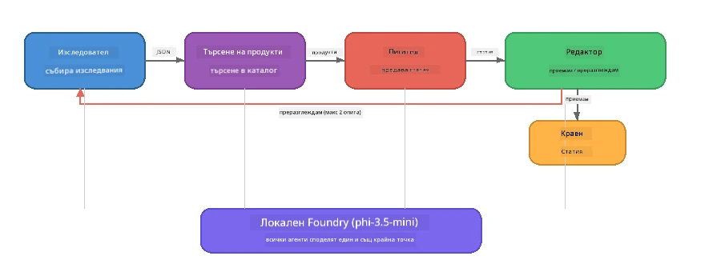

# Част 7: Zava Creative Writer - Кулминационно приложение

> **Цел:** Изследвайте приложение в производствен стил с множество агенти, където четирима специализирани агенти си сътрудничат, за да създадат статии с качество на списание за Zava Retail DIY - работещо изцяло на вашето устройство с Foundry Local.

Това е **кулминационната лаборатория** на работилницата. Тя обединява всичко, което сте научили - интеграция на SDK (част 3), извличане от локални данни (част 4), персонажи на агенти (част 5) и оркестрация на множество агенти (част 6) - в цялостно приложение, достъпно на **Python**, **JavaScript** и **C#**.

---

## Какво ще изследвате

| Концепция | Къде в Zava Writer |
|-----------|--------------------|
| Задействане на модел в 4 стъпки | Споделен конфигурационен модул инициира Foundry Local |
| Извличане в стил RAG | Агент за продукти търси в локален каталог |
| Специализация на агенти | 4 агента с различни системни подканяния |
| Поточно извеждане | Писателят връща токени в реално време |
| Структурирани предавания | Изследовател → JSON, Редактор → JSON решение |
| Обратна връзка | Редакторът може да задейства повторно изпълнение (макс. 2 опита) |

---

## Архитектура

Zava Creative Writer използва **последователен конвейер с обратна връзка, управлявана от оценител**. Всички три езикови реализации следват една и съща архитектура:



### Четирите агента

| Агент | Вход | Изход | Цел |
|-------|-------|--------|---------|
| **Изследовател** | Тема + опционална обратна връзка | `{"web": [{url, name, description}, ...]}` | Събира фонова информация чрез LLM |
| **Продуктово търсене** | Контекстна нишка за продукт | Списък с намерени продукти | LLM-генерирани заявки + търсене по ключови думи в локален каталог |
| **Писател** | Изследвания + продукти + задача + обратна връзка | Поточно изписан текст на статия (разделен с `---`) | Създава чернова на статия с качество за списание в реално време |
| **Редактор** | Статия + самостоятелна обратна връзка от писателя | `{"decision": "accept/revise", "editorFeedback": "...", "researchFeedback": "..."}` | Преглежда качеството, задейства повторен опит при нужда |

### Поток на конвейера

1. **Изследователят** получава темата и генерира структурирани бележки за изследване (JSON)
2. **Продуктовото търсене** прави заявки към локалния продуктов каталог с LLM-генерирани търсения
3. **Писателят** комбинира изследвания, продукти и задача в поток от текст за статия, добавяйки самостоятелна обратна връзка след разделител `---`
4. **Редакторът** преглежда статията и връща JSON решение:
   - `"accept"` → конвейерът завършва
   - `"revise"` → обратната връзка се изпраща обратно към Изследователя и Писателя (макс. 2 опита)

---

## Изисквания

- Да сте завършили [Част 6: Мулти-агентни работни потоци](part6-multi-agent-workflows.md)
- Инсталиран Foundry Local CLI и изтеглен модел `phi-3.5-mini`

---

## Упражнения

### Упражнение 1 - Стартирайте Zava Creative Writer

Изберете предпочитания си език и стартирайте приложението:

<details>
<summary><strong>🐍 Python - FastAPI уеб услуга</strong></summary>

Python версията работи като **уеб услуга** с REST API, демонстрирайки как да изградите продуктова бекенд система.

**Настройка:**
```bash
cd zava-creative-writer-local/src/api
python -m venv venv

# Windows (PowerShell):
venv\Scripts\Activate.ps1
# macOS:
source venv/bin/activate

pip install -r requirements.txt
```

**Стартиране:**
```bash
uvicorn main:app --reload
```

**Тестване:**
```bash
curl -X POST http://localhost:8000/api/article \
  -H "Content-Type: application/json" \
  -d '{
    "research": "DIY home improvement trends",
    "products": "power tools and paints",
    "assignment": "Write an article about weekend renovation projects for DIY enthusiasts"
  }'
```

Отговорът се предава поточно като JSON съобщения, разделени с нов ред, показващи напредъка на всеки агент.

</details>

<details>
<summary><strong>📦 JavaScript - Node.js CLI</strong></summary>

JavaScript версията работи като **CLI приложение**, отпечатващо напредъка на агентите и статията директно в конзолата.

**Настройка:**
```bash
cd zava-creative-writer-local/src/javascript
npm install
```

**Стартиране:**
```bash
node main.mjs
```

Ще видите:
1. Зареждане на модел Foundry Local (с лента за напредък ако се изтегля)
2. Всеки агент се изпълнява последователно със съобщения за статус
3. Статията се предава потоково към конзолата в реално време
4. Решението на редактора за приемане/преразглеждане

</details>

<details>
<summary><strong>💜 C# - .NET конзолно приложение</strong></summary>

C# версията работи като **.NET конзолно приложение** със същия конвейер и потоково извеждане.

**Настройка:**
```bash
cd zava-creative-writer-local/src/csharp
dotnet restore
```

**Стартиране:**
```bash
dotnet run
```

Същият изход като JavaScript версията - съобщения за статус на агентите, потокова статия и решение на редактора.

</details>

---

### Упражнение 2 - Проучете структурата на кода

Всяка езикова реализация разполага със същите логически компоненти. Сравнете структурите:

**Python** (`src/api/`):
| Файл | Цел |
|------|-----|
| `foundry_config.py` | Споделен Foundry Local мениджър, модел и клиент (инициализация в 4 стъпки) |
| `orchestrator.py` | Координация на конвейера с обратна връзка |
| `main.py` | FastAPI крайни точки (`POST /api/article`) |
| `agents/researcher/researcher.py` | Изследване с LLM с JSON изход |
| `agents/product/product.py` | LLM-генерирани заявки + търсене по ключови думи |
| `agents/writer/writer.py` | Генериране на статия в поток |
| `agents/editor/editor.py` | Решение за приемане/преразглеждане с JSON |

**JavaScript** (`src/javascript/`):
| Файл | Цел |
|------|-----|
| `foundryConfig.mjs` | Споделена конфигурация на Foundry Local (инициализация в 4 стъпки с лента за напредък) |
| `main.mjs` | Оркестратор + CLI входна точка |
| `researcher.mjs` | Агент за изследване с LLM |
| `product.mjs` | Генериране на заявки с LLM + търсене по ключови думи |
| `writer.mjs` | Генериране на статия в поток (асинхронен генератор) |
| `editor.mjs` | Решение за приемане/преразглеждане с JSON |
| `products.mjs` | Данни за продуктов каталог |

**C#** (`src/csharp/`):
| Файл | Цел |
|------|-----|
| `Program.cs` | Цял конвейер: зареждане на модел, агенти, оркестратор, обратна връзка |
| `ZavaCreativeWriter.csproj` | .NET 9 проект с пакети Foundry Local + OpenAI |

> **Дизайнерско забележка:** Python разделя всеки агент в отделен файл/директория (подходящо за по-големи екипи). JavaScript използва един модул на агент (подходящ за средни проекти). C# държи всичко в един файл с локални функции (подходящ за самостоятелни примери). В продукция изберете подход зависим от конвенциите на вашия екип.

---

### Упражнение 3 - Проследете споделената конфигурация

Всеки агент в конвейера използва един споделен клиент на Foundry Local модел. Проучете как е настроено това във всеки език:

<details>
<summary><strong>🐍 Python - foundry_config.py</strong></summary>

```python
from foundry_local import FoundryLocalManager

MODEL_ALIAS = "phi-3.5-mini"

# Стъпка 1: Създайте мениджър и стартирайте услугата Foundry Local
manager = FoundryLocalManager()
manager.start_service()

# Стъпка 2: Проверете дали моделът вече е изтеглен
cached = manager.list_cached_models()
catalog_info = manager.get_model_info(MODEL_ALIAS)
is_cached = any(m.id == catalog_info.id for m in cached) if catalog_info else False

if not is_cached:
    manager.download_model(MODEL_ALIAS)

# Стъпка 3: Заредете модела в паметта
manager.load_model(MODEL_ALIAS)
model_id = manager.get_model_info(MODEL_ALIAS).id

# Споделен OpenAI клиент
client = openai.OpenAI(base_url=manager.endpoint, api_key=manager.api_key)
```

Всички агенти импортират `from foundry_config import client, model_id`.

</details>

<details>
<summary><strong>📦 JavaScript - foundryConfig.mjs</strong></summary>

```javascript
import { FoundryLocalManager } from "foundry-local-sdk";
import { OpenAI } from "openai";

FoundryLocalManager.create({ appName: "ZavaCreativeWriter" });
const manager = FoundryLocalManager.instance;
await manager.startWebService();

// Провери кеша → изтегли → зареди (нов модел на SDK)
const catalog = manager.catalog;
const model = await catalog.getModel(MODEL_ALIAS);
if (!model.isCached) {
  console.log(`Downloading model: ${MODEL_ALIAS}...`);
  await model.download();
}
await model.load();

const client = new OpenAI({ baseURL: manager.urls[0] + "/v1", apiKey: "foundry-local" });
const modelId = model.id;
export { client, modelId };
```

Всички агенти импортират `{ client, modelId } from "./foundryConfig.mjs"`.

</details>

<details>
<summary><strong>💜 C# - началото на Program.cs</strong></summary>

```csharp
await FoundryLocalManager.CreateAsync(
    new Configuration
    {
        AppName = "ZavaCreativeWriter",
        Web = new Configuration.WebService { Urls = "http://127.0.0.1:0" }
    }, NullLogger.Instance, default);
var manager = FoundryLocalManager.Instance;
await manager.StartWebServiceAsync(default);

var catalog = await manager.GetCatalogAsync(default);
var catalogModel = await catalog.GetModelAsync(alias, default);
var isCached = await catalogModel.IsCachedAsync(default);
if (!isCached)
    await catalogModel.DownloadAsync(null, default);

await catalogModel.LoadAsync(default);
var key = new ApiKeyCredential("foundry-local");
var chatClient = new OpenAIClient(key, new OpenAIClientOptions
{
    Endpoint = new Uri(manager.Urls[0] + "/v1")
}).GetChatClient(catalogModel.Id);
```

`chatClient` се предава към всички агентски функции в същия файл.

</details>

> **Ключов модел:** Шаблонът за зареждане на модел (стартиране на услуга → проверка на кеш → изтегляне → зареждане) осигурява на потребителя видим напредък и моделът се изтегля само веднъж. Това е най-добра практика за всяко приложение с Foundry Local.

---

### Упражнение 4 - Разберете обратната връзка

Обратната връзка прави този конвейер „умен“ - редакторът може да изпрати работа обратно за преразглеждане. Проследете логиката:

```
Orchestrator:
  1. researcher.research(topic, "No Feedback")    ← first pass
  2. product.findProducts(productContext)
  3. writer.write(research, products, assignment)  ← streams article
  4. Split article at "---" → article + writerFeedback
  5. editor.edit(article, writerFeedback)

  WHILE editor says "revise" AND retryCount < 2:
    6. researcher.research(topic, editor.researchFeedback)  ← refined
    7. writer.write(research, products, editor.editorFeedback)
    8. editor.edit(newArticle, newWriterFeedback)
    9. retryCount++
```

**Въпроси за размисъл:**
- Защо ограничението за повторен опит е 2? Какво става, ако го увеличите?
- Защо изследователят получава `researchFeedback`, а писателят - `editorFeedback`?
- Какво би станало, ако редакторът винаги казва „преразгледай“?

---

### Упражнение 5 - Модифицирайте агент

Опитайте да промените поведението на един агент и наблюдавайте как това влияе на конвейера:

| Промяна | Какво да промените |
|---------|--------------------|
| **По-строг редактор** | Променете системната подканя на редактора да изисква винаги поне една ревизия |
| **По-дълги статии** | Променете подканата на писателя от "800-1000 думи" на "1500-2000 думи" |
| **Различни продукти** | Добавете или променете продукти в продуктовия каталог |
| **Нова изследователска тема** | Променете стойността на `researchContext` на друга тема |
| **Изследовател само с JSON** | Направете изследователя да връща 10 елемента вместо 3-5 |

> **Съвет:** Тъй като всички три езика използват една и съща архитектура, можете да направите същата промяна на езика, с който сте най-удобни.

---

### Упражнение 6 - Добавете пети агент

Разширете конвейера с нов агент. Някои идеи:

| Агент | Къде в конвейера | Цел |
|-------|------------------|-----|
| **Факто-проверител** | След Писателя, преди Редактора | Проверява твърденията спрямо изследователските данни |
| **SEO оптимизатор** | След приемане от Редактора | Добавя мета описание, ключови думи, URL slug |
| **Илюстратор** | След приемане от Редактора | Генерира описания за изображения към статията |
| **Преводач** | След приемане от Редактора | Превежда статията на друг език |

**Стъпки:**
1. Напишете системната подканя за агента
2. Създайте функцията на агента (съгласно съществуващия модел на вашия език)
3. Включете агента в оркестратора на подходящото място
4. Актуализирайте изхода/журналите, за да покажете приноса на новия агент

---

## Как Foundry Local и Agent Framework работят заедно

Това приложение демонстрира препоръчителния модел за изграждане на мулти-агентни системи с Foundry Local:

| Ниво | Компонент | Роля |
|-------|-----------|------|
| **Време на изпълнение** | Foundry Local | Изтегля, управлява и обслужва модела локално |
| **Клиент** | OpenAI SDK | Изпраща завършвания към локалния крайна точка |
| **Агент** | Системна подканя + чат заявка | специализирано поведение чрез фокусирани инструкции |
| **Оркестратор** | Координатор на конвейера | Управлява потока на данни, последователността и обратните връзки |
| **Фреймуърк** | Microsoft Agent Framework | Предоставя абстракцията `ChatAgent` и шаблони |

Ключовото прозрение: **Foundry Local заменя облачния бекенд, а не архитектурата на приложението.** Същите модели на агенти, оркестрационни стратегии и структурирани предавания, които работят с облачно хоствани модели, работят идентично с локални модели — просто насочвате клиента към локалната крайна точка вместо към Azure.

---

## Основни изводи

| Концепция | Какво научихте |
|-----------|----------------|
| Производствена архитектура | Как да структурирате мулти-агентско приложение със споделена конфигурация и отделни агенти |
| Зареждане на модел в 4 стъпки | Най-добра практика за инициализация на Foundry Local с видим напредък за потребителя |
| Специализация на агенти | Всеки от 4-те агента има фокусирани инструкции и специфичен изходен формат |
| Поточно генериране | Писателят доставя токени в реално време, позволявайки реактивни потребителски интерфейси |
| Обратни връзки | Повторен опит, управляван от редактора, подобрява качеството без човешка намеса |
| Междуезикови шаблони | Същата архитектура работи на Python, JavaScript и C# |
| Локално = готово за продукция | Foundry Local обслужва същия OpenAI-съвместим API, използван в облачни среди |

---

## Следваща стъпка

Продължете към [Част 8: Разработка, водена от оценка](part8-evaluation-led-development.md) за изграждане на систематизирана структура за оценка на вашите агенти, използвайки златни набори данни, проверки на базата на правила и резултати от LLM като съдия.