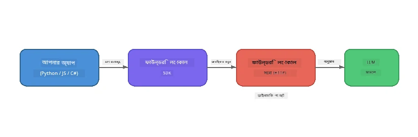

# অংশ ১: Foundry Local দিয়ে শুরু করা


## Foundry Local কী?

[Foundry Local](https://foundrylocal.ai) আপনাকে ওপেন-সোর্স AI ভাষা মডেলগুলি **সরাসরি আপনার কম্পিউটারে চালানোর** সুযোগ দেয় - কোন ইন্টারনেট দরকার নেই, কোন ক্লাউড খরচ নেই, এবং সম্পূর্ণ ডাটা প্রাইভেসি। এটি:

- **মডেলগুলি স্থানীয়ভাবে ডাউনলোড এবং চালায়** স্বয়ংক্রিয় হার্ডওয়্যার অপ্টিমাইজেশনের (GPU, CPU, বা NPU) সাথে
- **একটি OpenAI-সঙ্গত API প্রদান করে** ফলে আপনি পরিচিত SDK এবং টুলস ব্যবহার করতে পারেন
- **কোন Azure সাবস্ক্রিপশন** বা সাইন-আপ প্রয়োজন নেই - শুধু ইনস্টল করুন এবং তৈরি শুরু করুন

এটি আপনার নিজস্ব ব্যক্তিগত AI থাকার মত, যা পুরোপুরি আপনার মেশিনেই চলে।

## শেখার লক্ষ্যসমূহ

এই ল্যাবের শেষে আপনি সক্ষম হবেন:

- আপনার অপারেটিং সিস্টেমে Foundry Local CLI ইনস্টল করতে
- মডেল আলিয়াস কী এবং সেগুলি কীভাবে কাজ করে তা বুঝতে
- আপনার প্রথম স্থানীয় AI মডেল ডাউনলোড এবং চালাতে
- কমান্ড লাইন থেকে স্থানীয় মডেলের সাথে চ্যাট মেসেজ পাঠাতে
- স্থানীয় এবং ক্লাউড-হোস্টেড AI মডেলের পার্থক্য বুঝতে

---

## পূর্বশর্তসমূহ

### সিস্টেমের প্রয়োজনীয়তা

| প্রয়োজনীয়তা | সর্বনিম্ন | সুপারিশকৃত |
|-------------|---------|-------------|
| **র‍্যাম** | ৮ জিবি | ১৬ জিবি |
| **ডিস্ক স্পেস** | ৫ জিবি (মডেলগুলোর জন্য) | ১০ জিবি |
| **সিপিইউ** | ৪ কোর | ৮+ কোর |
| **জিপিইউ** | ঐচ্ছিক | NVIDIA CUDA ১১.৮+ সহ |
| **অপারেটিং সিস্টেম** | Windows 10/11 (x64/ARM), Windows Server 2025, macOS ১৩+ | - |

> **টিপ:** Foundry Local স্বয়ংক্রিয়ভাবে আপনার হার্ডওয়্যারের জন্য সর্বোত্তম মডেল ভেরিয়েন্ট নির্বাচন করে। যদি আপনার NVIDIA GPU থাকে, এটি CUDA অ্যাক্সেলरेशन ব্যবহার করে। যদি Qualcomm NPU থাকে, সেটি ব্যবহার করে। অন্যথায় এটি অপ্টিমাইজড CPU ভেরিয়েন্টে ফিরে যায়।

### Foundry Local CLI ইনস্টল করুন

**Windows** (PowerShell):  
```powershell
winget install Microsoft.FoundryLocal
```
  
**macOS** (Homebrew):  
```bash
brew tap microsoft/foundrylocal
brew install foundrylocal
```
  
> **টিপ:** Foundry Local বর্তমানে শুধুমাত্র Windows এবং macOS সাপোর্ট করে। এই মুহূর্তে Linux সাপোর্ট নেই।

ইনস্টলেশন যাচাই করুন:  
```bash
foundry --version
```
  
---

## ল্যাব অনুশীলনসমূহ

### অনুশীলন ১: উপলব্ধ মডেলগুলি অন্বেষণ করুন

Foundry Local পূর্ব-অপ্টিমাইজড ওপেন-সোর্স মডেলগুলোর একটি ক্যাটালগ অন্তর্ভুক্ত করে। সেগুলো তালিকা করুন:  

```bash
foundry model list
```
  
আপনি নিম্নলিখিত মডেলগুলি দেখতে পাবেন:  
- `phi-3.5-mini` - Microsoft এর ৩.৮ বিলিয়ন প্যারামিটার মডেল (দ্রুত, ভালো গুণাগুণ)  
- `phi-4-mini` - নতুন, আরও সক্ষম Phi মডেল  
- `phi-4-mini-reasoning` - চিন্তার শৃঙ্খল যুক্ত Phi মডেল (`<think>` ট্যাগস)  
- `phi-4` - Microsoft এর বৃহত্তম Phi মডেল (১০.৪ জিবি)  
- `qwen2.5-0.5b` - খুব ছোট এবং দ্রুত (কম রিসোর্স ডিভাইসের জন্য ভালো)  
- `qwen2.5-7b` - টুল-কলিং সমর্থনসহ শক্তিশালী সাধারণ উদ্দেশ্য মডেল  
- `qwen2.5-coder-7b` - কোড জেনারেশন জন্য অপ্টিমাইজড  
- `deepseek-r1-7b` - শক্তিশালী যুক্তি মডেল  
- `gpt-oss-20b` - বড় ওপেন-সোর্স মডেল (MIT লাইসেন্স, ১২.৫ জিবি)  
- `whisper-base` - স্পিচ-টু-টেক্সট ট্রান্সক্রিপশন (৩৮৩ এম বি)  
- `whisper-large-v3-turbo` - উচ্চ নির্ভুলতার ট্রান্সক্রিপশন (৯ জিবি)  

> **মডেল আলিয়াস কী?** `phi-3.5-mini` এর মতো আলিয়াস হল শর্টকাট। যখন আপনি একটি আলিয়াস ব্যবহার করেন, Foundry Local স্বয়ংক্রিয়ভাবে আপনার নির্দিষ্ট হার্ডওয়্যের জন্য সেরা ভেরিয়েন্ট ডাউনলোড করে (NVIDIA GPU জন্য CUDA, নাহলে CPU অপ্টিমাইজড)। আপনাকে কখনো সঠিক ভেরিয়েন্ট বাছাই নিয়ে চিন্তা করতে হয় না।

### অনুশীলন ২: আপনার প্রথম মডেল চালান

একটি মডেল ডাউনলোড করে ইন্টারঅ্যাক্টিভ চ্যাট শুরু করুন:

```bash
foundry model run phi-3.5-mini
```
  
প্রথমবার এটি চালানোর সময়, Foundry Local করবে:  
১. আপনার হার্ডওয়্যার শনাক্ত করবে  
২. সর্বোত্তম মডেল ভেরিয়েন্ট ডাউনলোড করবে (কিছু সময় লাগতে পারে)  
৩. মডেল মেমরিতে লোড করবে  
৪. একটি ইন্টারঅ্যাক্টিভ চ্যাট সেশন শুরু করবে  

কিছু প্রশ্ন করে দেখুন:  
```
You: What is the golden ratio?
You: Can you explain it as if I were 10 years old?
You: Write a haiku about mathematics
```
  
ছাড়তে `exit` টাইপ করুন বা `Ctrl+C` চাপুন।

### অনুশীলন ৩: একটি মডেল প্রি-ডাউনলোড করুন

যদি আপনি চ্যাট শুরু না করে শুধুমাত্র একটি মডেল ডাউনলোড করতে চান:  

```bash
foundry model download phi-3.5-mini
```
  
আপনার মেশিনে ইতিমধ্যেই কোন মডেলগুলো ডাউনলোড করা আছে চেক করুন:  

```bash
foundry cache list
```
  
### অনুশীলন ৪: স্থাপত্য বুঝুন

Foundry Local একটি **স্থানীয় HTTP সার্ভিস** হিসেবে চলে যা একটি OpenAI-সঙ্গত REST API প্রকাশ করে। অর্থাৎ:

১. সার্ভিসটি একটি **ডায়নামিক পোর্টে** শুরু হয় (প্রতিবার ভিন্ন পোর্ট)  
২. আপনি SDK ব্যবহার করে প্রকৃত এন্ডপয়েন্ট URL আবিষ্কার করেন  
৩. আপনি **যেকোন** OpenAI-সঙ্গত ক্লায়েন্ট লাইব্রেরি ব্যবহার করে এতে কথা বলতে পারেন  



> **গুরুত্বপূর্ণ:** Foundry Local প্রতিবার শুরু হলে একটি **ডায়নামিক পোর্ট** বরাদ্দ করে। কখনো `localhost:5272` এর মতো পোর্ট নম্বর হার্ডকোড করবেন না। সর্বদা SDK ব্যবহার করে বর্তমান URL আবিষ্কার করুন (যেমন Python এ `manager.endpoint` বা JavaScript এ `manager.urls[0]`)।

---

## মুখ্য বিষয়সমূহ

| ধারণা | আপনি যা শিখলেন |
|---------|------------------|
| অন-ডিভাইস AI | Foundry Local পুরোপুরি আপনার ডিভাইসে মডেল চালায়, কোন ক্লাউড, কোন API কী, অথবা কোন খরচ ছাড়াই |
| মডেল আলিয়াস | `phi-3.5-mini` এর মতো আলিয়াস স্বয়ংক্রিয়ভাবে আপনার হার্ডওয়ারের জন্য সেরা ভেরিয়েন্ট নির্বাচন করে |
| ডায়নামিক পোর্ট | সার্ভিসটি একটি ডায়নামিক পোর্টে চলে; সর্বদা SDK ব্যবহার করে এন্ডপয়েন্ট আবিষ্কার করুন |
| CLI এবং SDK | আপনি CLI (`foundry model run`) অথবা SDK এর মাধ্যমে প্রোগ্রাম্যাটিক্যালি মডেলের সাথে ইন্টারঅ্যাক্ট করতে পারেন |

---

## পরবর্তী ধাপসমূহ

[অংশ ২: Foundry Local SDK গভীরতায়](part2-foundry-local-sdk.md) এ যান এবং মডেল, সার্ভিস ও ক্যাশ প্রোগ্রাম্যাটিক্যালি ম্যানেজ করার জন্য SDK API-তে পারদর্শী হন।