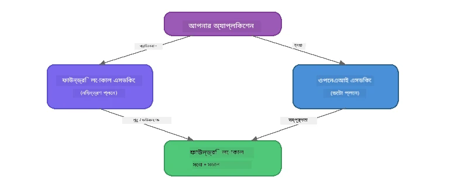

# অংশ ৩: OpenAI-এর সাথে Foundry Local SDK ব্যবহার করা

## ওভারভিউ

অংশ ১-এ আপনি Foundry Local CLI ব্যবহার করে মডেলগুলি ইন্টারেক্টিভভাবে চালিয়েছেন। অংশ ২-এ আপনি সম্পূর্ণ SDK API সারফেস অন্বেষণ করেছেন। এখন আপনি শিখবেন কীভাবে **SDK এবং OpenAI-সঙ্গত API ব্যবহার করে Foundry Local আপনার অ্যাপ্লিকেশনগুলিতে একত্রিত করতে হয়**।

Foundry Local তিনটি ভাষার জন্য SDK প্রদান করে। আপনি যেটিতে সবচেয়ে স্বচ্ছন্দ বোধ করেন সেটি বেছে নিন - ধারণাগুলি সব তিনটি ভাষাতেই অভিন্ন।

## শেখার উদ্দেশ্য

এই ল্যাবের শেষে আপনি সক্ষম হবেন:

- আপনার ভাষার জন্য Foundry Local SDK ইনস্টল করতে (Python, JavaScript, অথবা C#)
- `FoundryLocalManager` ইনিশিয়ালাইজ করতে যাতে সার্ভিস শুরু করা যায়, ক্যাশ পরীক্ষা করা যায়, একটি মডেল ডাউনলোড ও লোড করা যায়
- OpenAI SDK ব্যবহার করে লোকাল মডেলের সাথে সংযোগ স্থাপন করা
- চ্যাট সম্পূর্ণ করা পাঠানো এবং স্ট্রিমিং উত্তর গ্রহণ পরিচালনা করা
- ডাইনামিক পোর্ট আর্কিটেকচার বুঝতে পারা

---

## পূর্বশর্ত

প্রথমে [অংশ ১: Foundry Local দিয়ে শুরু করা](part1-getting-started.md) এবং [অংশ ২: Foundry Local SDK গভীর অন্বেষণ](part2-foundry-local-sdk.md) সম্পন্ন করুন।

নিম্নলিখিত ভাষার রানটাইমের **একটি** ইনস্টল করুন:
- **Python 3.9+** - [python.org/downloads](https://www.python.org/downloads/)
- **Node.js 18+** - [nodejs.org](https://nodejs.org/)
- **.NET 9.0+** - [dot.net/download](https://dotnet.microsoft.com/download)

---

## ধারণা: SDK কিভাবে কাজ করে

Foundry Local SDK **কন্ট্রোল প্লেন** (সার্ভিস শুরু করা, মডেল ডাউনলোড করা) পরিচালনা করে, যেখানে OpenAI SDK **ডেটা প্লেন** (প্রম্পট পাঠানো, সম্পূর্ণতা গ্রহণ) পরিচালনা করে।



---

## ল্যাব অনুশীলন

### অনুশীলন ১: আপনার পরিবেশ সেটআপ করুন

<details>
<summary><b>🐍 পাইথন</b></summary>

```bash
cd python
python -m venv venv

# ভার্চুয়াল পরিবেশ সক্রিয় করুন:
# উইন্ডোজ (পাওয়ারশেল):
venv\Scripts\Activate.ps1
# উইন্ডোজ (কমান্ড প্রম্পট):
venv\Scripts\activate.bat
# ম্যাকওএস:
source venv/bin/activate

pip install -r requirements.txt
```

`requirements.txt` ইনস্টল করে:
- `foundry-local-sdk` - Foundry Local SDK (ইম্পোর্ট করা হয় `foundry_local` নামে)
- `openai` - OpenAI পাইথন SDK
- `agent-framework` - Microsoft Agent Framework (পরবর্তী অংশে ব্যবহৃত)

</details>

<details>
<summary><b>📘 জাভাস্ক্রিপ্ট</b></summary>

```bash
cd javascript
npm install
```

`package.json` ইনস্টল করে:
- `foundry-local-sdk` - Foundry Local SDK
- `openai` - OpenAI Node.js SDK

</details>

<details>
<summary><b>💜 সি#</b></summary>

```bash
cd csharp
dotnet restore
dotnet build
```

`csharp.csproj` ব্যবহৃত:
- `Microsoft.AI.Foundry.Local` - Foundry Local SDK (NuGet)
- `OpenAI` - OpenAI C# SDK (NuGet)

> **প্রজেক্টের কাঠামো:** C# প্রজেক্টটি `Program.cs`-এ একটি কমান্ড-লাইন রাউটার ব্যবহার করে যা পৃথক উদাহরণ ফাইলে ডেলিগেট করে। এই অংশের জন্য `dotnet run chat` (অথবা শুধু `dotnet run`) চালান। অন্যান্য অংশে `dotnet run rag`, `dotnet run agent`, এবং `dotnet run multi` ব্যবহার করা হয়।

</details>

---

### অনুশীলন ২: বেসিক চ্যাট সম্পূর্ণতা

আপনার ভাষার বেসিক চ্যাট উদাহরণ ফাইলটি খুলুন এবং কোডটি পরীক্ষা করুন। প্রতিটি স্ক্রিপ্ট একই তিন ধাপের প্যাটার্ন অনুসরণ করে:

1. **সার্ভিস শুরু করা** - `FoundryLocalManager` Foundry Local রানটাইম শুরু করে
2. **মডেল ডাউনলোড ও লোড করা** - ক্যাশ পরীক্ষা করে, প্রয়োজনে ডাউনলোড করে, তারপর মেমরিতে লোড করে
3. **OpenAI ক্লায়েন্ট তৈরি করা** - লোকাল এন্ডপয়েন্টে সংযোগ করে এবং স্ট্রিমিং চ্যাট সম্পূর্ণতা পাঠায়

<details>
<summary><b>🐍 পাইথন - <code>python/foundry-local.py</code></b></summary>

```python
import sys
import openai
from foundry_local import FoundryLocalManager

alias = "phi-3.5-mini"

# ধাপ ১: একটি FoundryLocalManager তৈরি করুন এবং সার্ভিসটি শুরু করুন
print("Starting Foundry Local service...")
manager = FoundryLocalManager()
manager.start_service()

# ধাপ ২: পরীক্ষা করুন মডেলটি ইতিমধ্যে ডাউনলোড করা হয়েছে কিনা
cached = manager.list_cached_models()
catalog_info = manager.get_model_info(alias)
is_cached = any(m.id == catalog_info.id for m in cached) if catalog_info else False

if is_cached:
    print(f"Model already downloaded: {alias}")
else:
    print(f"Downloading model: {alias} (this may take several minutes)...")
    manager.download_model(alias)
    print(f"Download complete: {alias}")

# ধাপ ৩: মডেলটি মেমরিতে লোড করুন
print(f"Loading model: {alias}...")
manager.load_model(alias)

# LOCAL Foundry সার্ভিসের দিকে নির্দেশকারী একটি OpenAI ক্লায়েন্ট তৈরি করুন
client = openai.OpenAI(
    base_url=manager.endpoint,   # ডাইনামিক পোর্ট - কখনই হার্ডকোড করবেন না!
    api_key=manager.api_key
)

# একটি স্ট্রিমিং চ্যাট কমপ্লিশন তৈরি করুন
stream = client.chat.completions.create(
    model=manager.get_model_info(alias).id,
    messages=[{"role": "user", "content": "What is the golden ratio?"}],
    stream=True,
)

for chunk in stream:
    if chunk.choices[0].delta.content is not None:
        print(chunk.choices[0].delta.content, end="", flush=True)
print()
```

**চালান:**
```bash
python foundry-local.py
```

</details>

<details>
<summary><b>📘 জাভাস্ক্রিপ্ট - <code>javascript/foundry-local.mjs</code></b></summary>

```javascript
import { OpenAI } from "openai";
import { FoundryLocalManager } from "foundry-local-sdk";

const alias = "phi-3.5-mini";

// ধাপ ১: ফাউন্ড্রি লোকাল সার্ভিস শুরু করুন
console.log("Starting Foundry Local service...");
FoundryLocalManager.create({ appName: "FoundryLocalWorkshop" });
const manager = FoundryLocalManager.instance;
await manager.startWebService();

// ধাপ ২: চেক করুন মডেলটি ইতিমধ্যে ডাউনলোড করা হয়েছে কিনা
const catalog = manager.catalog;
const model = await catalog.getModel(alias);

if (model.isCached) {
  console.log(`Model already downloaded: ${alias}`);
} else {
  console.log(`Downloading model: ${alias} (this may take several minutes)...`);
  await model.download();
  console.log(`Download complete: ${alias}`);
}

// ধাপ ৩: মডেলটি মেমরিতে লোড করুন
console.log(`Loading model: ${alias}...`);
await model.load();
console.log(`Model loaded: ${model.id}`);

// লোকাল ফাউন্ড্রি সার্ভিস নির্দেশকারী OpenAI ক্লায়েন্ট তৈরি করুন
const client = new OpenAI({
  baseURL: manager.urls[0] + "/v1",   // ডায়নামিক পোর্ট - কখনো হার্ডকোড করবেন না!
  apiKey: "foundry-local",
});

// একটি স্ট্রিমিং চ্যাট সম্পন্ন তৈরি করুন
const stream = await client.chat.completions.create({
  model: model.id,
  messages: [{ role: "user", content: "What is the golden ratio?" }],
  stream: true,
});

for await (const chunk of stream) {
  if (chunk.choices[0]?.delta?.content) {
    process.stdout.write(chunk.choices[0].delta.content);
  }
}
console.log();
```

**চালান:**
```bash
node foundry-local.mjs
```

</details>

<details>
<summary><b>💜 সি# - <code>csharp/BasicChat.cs</code></b></summary>

```csharp
using Microsoft.AI.Foundry.Local;
using Microsoft.Extensions.Logging.Abstractions;
using OpenAI;
using OpenAI.Chat;
using System.ClientModel;

var alias = "phi-3.5-mini";

// Step 1: Start the Foundry Local service
Console.WriteLine("Starting Foundry Local service...");
await FoundryLocalManager.CreateAsync(
    new Configuration
    {
        AppName = "FoundryLocalSamples",
        Web = new Configuration.WebService { Urls = "http://127.0.0.1:0" }
    }, NullLogger.Instance, default);
var manager = FoundryLocalManager.Instance;
await manager.StartWebServiceAsync(default);

// Step 2: Get the model from the catalog
var catalog = await manager.GetCatalogAsync(default);
var model = await catalog.GetModelAsync(alias, default);

// Step 3: Check if the model is already downloaded
var isCached = await model.IsCachedAsync(default);

if (isCached)
{
    Console.WriteLine($"Model already downloaded: {alias}");
}
else
{
    Console.WriteLine($"Downloading model: {alias} (this may take several minutes)...");
    await model.DownloadAsync(null, default);
    Console.WriteLine($"Download complete: {alias}");
}

// Step 4: Load the model into memory
Console.WriteLine($"Loading model: {alias}...");
await model.LoadAsync(default);
Console.WriteLine($"Loaded model: {model.Id}");
Console.WriteLine($"Endpoint: {manager.Urls[0]}");

// Create OpenAI client pointing to the LOCAL Foundry service
var key = new ApiKeyCredential("foundry-local");
var client = new OpenAIClient(key, new OpenAIClientOptions
{
    Endpoint = new Uri(manager.Urls[0] + "/v1")  // Dynamic port - never hardcode!
});

var chatClient = client.GetChatClient(model.Id);

// Stream a chat completion
var completionUpdates = chatClient.CompleteChatStreaming("What is the golden ratio?");

foreach (var update in completionUpdates)
{
    if (update.ContentUpdate.Count > 0)
    {
        Console.Write(update.ContentUpdate[0].Text);
    }
}
Console.WriteLine();
```

**চালান:**
```bash
dotnet run chat
```

</details>

---

### অনুশীলন ৩: প্রম্পট নিয়ে পরীক্ষা-নিরীক্ষা করুন

আপনার বেসিক উদাহরণ চালানোর পরে, কোড পরিবর্তন করে চেষ্টা করুন:

1. **ইউজার মেসেজ পরিবর্তন করুন** - বিভিন্ন প্রশ্ন করে দেখুন
2. **সিস্টেম প্রম্পট যোগ করুন** - মডেলকে একটি পারসোনা দিন
3. **স্ট্রিমিং বন্ধ করুন** - `stream=False` সেট করুন এবং পুরো প্রতিক্রিয়াটি একবারে প্রিন্ট করুন
4. **অন্য মডেল চেষ্টা করুন** - `phi-3.5-mini` থেকে অন্য কোনো মডেল `foundry model list` থেকে নির্বাচন করুন

<details>
<summary><b>🐍 পাইথন</b></summary>

```python
# একটি সিস্টেম প্রম্পট যোগ করুন - মডেলকে একটি ব্যক্তিত্ব দিন:
stream = client.chat.completions.create(
    model=manager.get_model_info(alias).id,
    messages=[
        {"role": "system", "content": "You are a pirate. Answer everything in pirate speak."},
        {"role": "user", "content": "What is the golden ratio?"}
    ],
    stream=True,
)

# অথবা স্ট্রিমিং বন্ধ করুন:
response = client.chat.completions.create(
    model=manager.get_model_info(alias).id,
    messages=[{"role": "user", "content": "What is the golden ratio?"}],
    stream=False,
)
print(response.choices[0].message.content)
```

</details>

<details>
<summary><b>📘 জাভাস্ক্রিপ্ট</b></summary>

```javascript
// একটি সিস্টেম প্রম্পট যোগ করুন - মডেলটিকে একটি পার্সোনা দিন:
const stream = await client.chat.completions.create({
  model: modelInfo.id,
  messages: [
    { role: "system", content: "You are a pirate. Answer everything in pirate speak." },
    { role: "user", content: "What is the golden ratio?" },
  ],
  stream: true,
});

// অথবা স্ট্রিমিং বন্ধ করুন:
const response = await client.chat.completions.create({
  model: modelInfo.id,
  messages: [{ role: "user", content: "What is the golden ratio?" }],
  stream: false,
});
console.log(response.choices[0].message.content);
```

</details>

<details>
<summary><b>💜 সি#</b></summary>

```csharp
// Add a system prompt - give the model a persona:
var completionUpdates = chatClient.CompleteChatStreaming(
    new ChatMessage[]
    {
        new SystemChatMessage("You are a pirate. Answer everything in pirate speak."),
        new UserChatMessage("What is the golden ratio?")
    }
);

// Or turn off streaming:
var response = chatClient.CompleteChat("What is the golden ratio?");
Console.WriteLine(response.Value.Content[0].Text);
```

</details>

---

### SDK মেথড রেফারেন্স

<details>
<summary><b>🐍 পাইথন SDK মেথড</b></summary>

| মেথড | উদ্দেশ্য |
|--------|---------|
| `FoundryLocalManager()` | ম্যানেজার ইন্সট্যান্স তৈরি করা |
| `manager.start_service()` | Foundry Local সার্ভিস শুরু করা |
| `manager.list_cached_models()` | যেসব মডেল ডাউনলোড হয়েছে সেগুলোর তালিকা দেখা |
| `manager.get_model_info(alias)` | মডেল আইডি এবং মেটাডেটা পাওয়া |
| `manager.download_model(alias, progress_callback=fn)` | বিকল্প প্রগ্রেস কলব্যাক সহ মডেল ডাউনলোড করা |
| `manager.load_model(alias)` | মডেল মেমরিতে লোড করা |
| `manager.endpoint` | ডাইনামিক এন্ডপয়েন্ট URL পাওয়া |
| `manager.api_key` | API কী পাওয়া (লোকালের জন্য প্লেসহোল্ডার) |

</details>

<details>
<summary><b>📘 জাভাস্ক্রিপ্ট SDK মেথড</b></summary>

| মেথড | উদ্দেশ্য |
|--------|---------|
| `FoundryLocalManager.create({ appName })` | ম্যানেজার ইন্সট্যান্স তৈরি করা |
| `FoundryLocalManager.instance` | সিঙ্গেলটন ম্যানেজারে অ্যাক্সেস |
| `await manager.startWebService()` | Foundry Local সার্ভিস শুরু করা |
| `await manager.catalog.getModel(alias)` | ক্যাটালগ থেকে মডেল পাওয়া |
| `model.isCached` | মডেল ডাউনলোড হয়েছে কিনা পরীক্ষা করা |
| `await model.download()` | মডেল ডাউনলোড করা |
| `await model.load()` | মডেল মেমরিতে লোড করা |
| `model.id` | OpenAI API কলের জন্য মডেল আইডি পাওয়া |
| `manager.urls[0] + "/v1"` | ডাইনামিক এন্ডপয়েন্ট URL পাওয়া |
| `"foundry-local"` | API কী (লোকালের জন্য প্লেসহোল্ডার) |

</details>

<details>
<summary><b>💜 সি# SDK মেথড</b></summary>

| মেথড | উদ্দেশ্য |
|--------|---------|
| `FoundryLocalManager.CreateAsync(config)` | ম্যানেজার তৈরি ও ইনিশিয়ালাইজ করা |
| `manager.StartWebServiceAsync()` | Foundry Local ওয়েব সার্ভিস শুরু করা |
| `manager.GetCatalogAsync()` | মডেল ক্যাটালগ পাওয়া |
| `catalog.ListModelsAsync()` | সকল উপলব্ধ মডেলের তালিকা পাওয়া |
| `catalog.GetModelAsync(alias)` | নির্দিষ্ট মডেল পাওয়া |
| `model.IsCachedAsync()` | মডেল ডাউনলোড হয়েছে কিনা পরীক্ষা করা |
| `model.DownloadAsync()` | মডেল ডাউনলোড করা |
| `model.LoadAsync()` | মডেল মেমরিতে লোড করা |
| `manager.Urls[0]` | ডাইনামিক এন্ডপয়েন্ট URL পাওয়া |
| `new ApiKeyCredential("foundry-local")` | লোকালের জন্য API কী ক্রেডেনশিয়াল |

</details>

---

### অনুশীলন ৪: নেটিভ ChatClient ব্যবহার (OpenAI SDK-এর বিকল্প)

অনুশীলন ২ এবং ৩-এ আপনি চ্যাট সম্পূর্ণতা জন্য OpenAI SDK ব্যবহার করেছেন। JavaScript এবং C# SDK গুলো নেটিভ **ChatClient** প্রদান করে যা পুরোপুরি OpenAI SDK-এর প্রয়োজনীয়তাকে দূর করে।

<details>
<summary><b>📘 জাভাস্ক্রিপ্ট - <code>model.createChatClient()</code></b></summary>

```javascript
import { FoundryLocalManager } from "foundry-local-sdk";

const alias = "phi-3.5-mini";

FoundryLocalManager.create({ appName: "ChatClientDemo" });
const manager = FoundryLocalManager.instance;
await manager.startWebService();

const model = await manager.catalog.getModel(alias);
if (!model.isCached) await model.download();
await model.load();

// কোনো OpenAI ইমপোর্টের প্রয়োজন নেই — মডেল থেকে সরাসরি একটি ক্লায়েন্ট পান
const chatClient = model.createChatClient();

// নন-স্ট্রিমিং কমপ্লিশন
const response = await chatClient.completeChat([
  { role: "system", content: "You are a pirate. Answer everything in pirate speak." },
  { role: "user", content: "What is the golden ratio?" }
]);
console.log(response.choices[0].message.content);

// স্ট্রিমিং কমপ্লিশন (কলব্যাক প্যাটার্ন ব্যবহার করে)
await chatClient.completeStreamingChat(
  [{ role: "user", content: "What is the golden ratio?" }],
  (chunk) => {
    if (chunk.choices?.[0]?.delta?.content) {
      process.stdout.write(chunk.choices[0].delta.content);
    }
  }
);
console.log();
```

> **নোট:** ChatClient-এর `completeStreamingChat()` একটি **কলব্যাক** প্যাটার্ন ব্যবহার করে, অ্যাসিঙ্ক ইটারেটর নয়। দ্বিতীয় আর্গুমেন্ট হিসেবে একটি ফাংশন পাস করুন।

</details>

<details>
<summary><b>💜 সি# - <code>model.GetChatClientAsync()</code></b></summary>

```csharp
var catalog = await manager.GetCatalogAsync(default);
var model = await catalog.GetModelAsync("phi-3.5-mini", default);
if (!await model.IsCachedAsync(default))
    await model.DownloadAsync(null, default);
await model.LoadAsync(default);

// No OpenAI NuGet needed — get a client directly from the model
var chatClient = await model.GetChatClientAsync(default);

// Use it like a standard OpenAI ChatClient
var response = chatClient.CompleteChat("What is the golden ratio?");
Console.WriteLine(response.Value.Content[0].Text);
```

</details>

> **কখন কোনটি ব্যবহার করবেন:**
> | পদ্ধতি | উপযুক্ত ক্ষেত্র |
> |----------|----------|
> | OpenAI SDK | পরিপূর্ণ প্যারামিটার নিয়ন্ত্রণ, প্রোডাকশন অ্যাপ, বিদ্যমান OpenAI কোড |
> | নেটিভ ChatClient | দ্রুত প্রোটোটাইপিং, কম নির্ভরতা, সহজ সেটআপ |

---

## মূল ধারণা

| ধারণা | আপনি যা শিখলেন |
|---------|------------------|
| কন্ট্রোল প্লেন | Foundry Local SDK সার্ভিস শুরু এবং মডেল লোড পরিচালনা করে |
| ডেটা প্লেন | OpenAI SDK চ্যাট সম্পূর্ণতা এবং স্ট্রিমিং পরিচালনা করে |
| ডাইনামিক পোর্ট | সব সময় SDK ব্যবহার করে এন্ডপয়েন্ট আবিষ্কার করুন; URL হার্ডকোড করবেন না |
| ক্রস-ল্যাঙ্গুয়েজ | একই কোড প্যাটার্ন Python, JavaScript, ও C# তে কাজ করে |
| OpenAI কমপ্যাটিবিলিটি | পূর্ণ OpenAI API সঙ্গতিযুক্ত অর্থ বিদ্যমান OpenAI কোড সামান্য পরিবর্তনে কার্যকর |
| নেটিভ ChatClient | `createChatClient()` (JS) / `GetChatClientAsync()` (C#) OpenAI SDK’র বিকল্প প্রদান করে |

---

## পরবর্তী ধাপ

[অংশ ৪: RAG অ্যাপ্লিকেশন তৈরি করা](part4-rag-fundamentals.md) এ এগিয়ে যান এবং শিখুন আপনার ডিভাইসে সম্পূর্ণরূপে চালিত একটি Retrieval-Augmented Generation পাইপলাইন কিভাবে তৈরি করতে হয়।