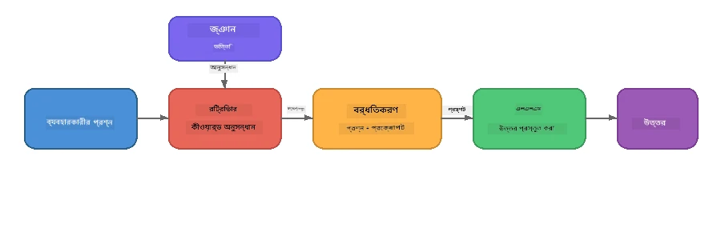

# পার্ট ৪: Foundry Local দিয়ে RAG অ্যাপ্লিকেশন তৈরি

## ওভারভিউ

বড় ভাষার মডেলগুলো শক্তিশালী, তবে তারা কেবল তাদের প্রশিক্ষণ ডেটাতে যা ছিল তা জানে। **রিট্রিভাল-অগমেন্টেড জেনারেশন (RAG)** এই সমস্যা সমাধান করে মডেলটিকে কোয়েরি টাইমে প্রাসঙ্গিক প্রসঙ্গ দিতে - যা আপনার নিজস্ব ডকুমেন্ট, ডাটাবেস বা জ্ঞানভাণ্ডার থেকে আনা হয়।

এই ল্যাবে আপনি একটি সম্পূর্ণ RAG পাইপলাইন তৈরি করবেন যা **সম্পূর্ণরূপে আপনার ডিভাইসে চলে** Foundry Local ব্যবহার করে। কোন ক্লাউড সার্ভিস, কোন ভেক্টর ডাটাবেস, কোন এম্বেডিংস API নেই - কেবল স্থানীয় রিট্রিভাল এবং একটি স্থানীয় মডেল।

## শেখার উদ্দেশ্য

এই ল্যাবের শেষে আপনি সক্ষম হবেন:

- ব্যাখ্যা করতে RAG কী এবং কেন এটি AI অ্যাপ্লিকেশনের জন্য গুরুত্বপূর্ণ
- টেক্সট ডকুমেন্ট থেকে একটি স্থানীয় জ্ঞানভাণ্ডার তৈরি করতে
- প্রাসঙ্গিক প্রসঙ্গ খোঁজার জন্য একটি সহজ রিট্রিভাল ফাংশন বাস্তবায়ন করতে
- সিস্টেম প্রম্পটে এমন একটি কম্পোজ করতে যা মডেলকে রিট্রিভাল করা তথ্যের ওপর ভিত্তি করে
- পুরো Retrieve → Augment → Generate পাইপলাইন ডিভাইসে চালাতে
- সাধারণ কীওয়ার্ড রিট্রিভাল এবং ভেক্টর সার্চের মধ্যে ট্রেড-অফ বোঝতে

---

## পূর্বপ্রয়োজনীয়তা

- সম্পূর্ণ [পার্ট ৩: Foundry Local SDK OpenAI এর সঙ্গে ব্যবহার](part3-sdk-and-apis.md)
- Foundry Local CLI ইনস্টল করা এবং `phi-3.5-mini` মডেল ডাউনলোড করা

---

## ধারণা: RAG কী?

RAG ছাড়া, একটি LLM কেবল তার প্রশিক্ষণ ডেটা থেকে উত্তর দিতে পারে - যা হয়তো পুরানো, অসম্পূর্ণ, বা আপনার ব্যক্তিগত তথ্য অনুপস্থিত:

```
User: "What is Zava's return policy?"
LLM:  "I do not have information about Zava's return policy."  ← No context!
```
  
RAG-এর সঙ্গে, আপনি প্রথমে প্রাসঙ্গিক ডকুমেন্টগুলো **রিট্রিভ** করেন, তারপর সেই প্রসঙ্গ দিয়ে প্রম্পট **অগমেন্ট** করেন এবং শেষে উত্তর **জেনারেট** করেন:



মূল ধারণা: **মডেলকে উত্তর "জানতে" হবে না; শুধুমাত্র সঠিক ডকুমেন্টগুলো পড়তে হবে।**

---

## ল্যাব অনুশীলনসমূহ

### অনুশীলন ১: জ্ঞানভাণ্ডার বোঝা

আপনার ভাষার জন্য RAG উদাহরণ খুলুন এবং জ্ঞানভাণ্ডার পরীক্ষা করুন:

<details>
<summary><b>🐍 পাইথন: <code>python/foundry-local-rag.py</code></b></summary>

জ্ঞানভাণ্ডার হল ডিকশনারির একটি সহজ তালিকা যার মধ্যে `title` এবং `content` ক্ষেত্র থাকে:

```python
KNOWLEDGE_BASE = [
    {
        "title": "Foundry Local Overview",
        "content": (
            "Foundry Local brings the power of Azure AI Foundry to your local "
            "device without requiring an Azure subscription..."
        ),
    },
    {
        "title": "Supported Hardware",
        "content": (
            "Foundry Local automatically selects the best model variant for "
            "your hardware. If you have an Nvidia CUDA GPU it downloads the "
            "CUDA-optimized model..."
        ),
    },
    # ... আরও এন্ট্রি
]
```
  
প্রত্যেক এন্ট্রি একটি "চাঙ্ক" বোঝায় - একটি নির্দিষ্ট বিষয়ের একটি মনোনিবেশিত তথ্যের টুকরা।

</details>

<details>
<summary><b>📘 জাভাস্ক্রিপ্ট: <code>javascript/foundry-local-rag.mjs</code></b></summary>

জ্ঞানভাণ্ডার একই কাঠামো ব্যবহার করে, অবজেক্টের অ্যারে হিসেবে:

```javascript
const KNOWLEDGE_BASE = [
  {
    title: "Foundry Local Overview",
    content:
      "Foundry Local brings the power of Azure AI Foundry to your local " +
      "device without requiring an Azure subscription...",
  },
  {
    title: "Supported Hardware",
    content:
      "Foundry Local automatically selects the best model variant for " +
      "your hardware...",
  },
  // ... আরো এন্ট্রি
];
```

</details>

<details>
<summary><b>💜 সি#: <code>csharp/RagPipeline.cs</code></b></summary>

জ্ঞানভাণ্ডার একটি নামকৃত টিউপলগুলির তালিকা ব্যবহার করে:

```csharp
private static readonly List<(string Title, string Content)> KnowledgeBase =
[
    ("Foundry Local Overview",
     "Foundry Local brings the power of Azure AI Foundry to your local " +
     "device without requiring an Azure subscription..."),

    ("Supported Hardware",
     "Foundry Local automatically selects the best model variant for " +
     "your hardware..."),

    // ... more entries
];
```

</details>

> **বাস্তব অ্যাপ্লিকেশনে**, জ্ঞানভাণ্ডার ডিস্কে ফাইল, ডাটাবেস, সার্চ ইনডেক্স বা API থেকে আসতে পারে। এই ল্যাবে, সরলতার জন্য আমরা ইন-মেমোরি তালিকা ব্যবহার করি।

---

### অনুশীলন ২: রিট্রিভাল ফাংশন বুঝুন

রিট্রিভাল ধাপ ব্যবহারকারীর প্রশ্নের জন্য সবচেয়ে প্রাসঙ্গিক চাঙ্কগুলো খুঁজে বের করে। এই উদাহরণটি **কীওয়ার্ড ওভারল্যাপ** ব্যবহার করে - গণনা করে কতগুলো শব্দ প্রশ্নে এবং প্রতিটি চাঙ্কে উপস্থিত:

<details>
<summary><b>🐍 পাইথন</b></summary>

```python
def retrieve(query: str, top_k: int = 2) -> list[dict]:
    """Return the top-k knowledge chunks most relevant to the query."""
    query_words = set(query.lower().split())
    scored = []
    for chunk in KNOWLEDGE_BASE:
        chunk_words = set(chunk["content"].lower().split())
        overlap = len(query_words & chunk_words)
        scored.append((overlap, chunk))
    scored.sort(key=lambda x: x[0], reverse=True)
    return [item[1] for item in scored[:top_k]]
```

</details>

<details>
<summary><b>📘 জাভাস্ক্রিপ্ট</b></summary>

```javascript
function retrieve(query, topK = 2) {
  const queryWords = new Set(query.toLowerCase().split(/\s+/));
  const scored = KNOWLEDGE_BASE.map((chunk) => {
    const chunkWords = new Set(chunk.content.toLowerCase().split(/\s+/));
    let overlap = 0;
    for (const w of queryWords) {
      if (chunkWords.has(w)) overlap++;
    }
    return { overlap, chunk };
  });
  scored.sort((a, b) => b.overlap - a.overlap);
  return scored.slice(0, topK).map((s) => s.chunk);
}
```

</details>

<details>
<summary><b>💜 সি#</b></summary>

```csharp
private static List<(string Title, string Content)> Retrieve(string query, int topK = 2)
{
    var queryWords = new HashSet<string>(
        query.ToLowerInvariant().Split(' ', StringSplitOptions.RemoveEmptyEntries));

    return KnowledgeBase
        .Select(chunk =>
        {
            var chunkWords = new HashSet<string>(
                chunk.Content.ToLowerInvariant().Split(' ', StringSplitOptions.RemoveEmptyEntries));
            var overlap = queryWords.Intersect(chunkWords).Count();
            return (Overlap: overlap, Chunk: chunk);
        })
        .OrderByDescending(x => x.Overlap)
        .Take(topK)
        .Select(x => x.Chunk)
        .ToList();
}
```

</details>

**কিভাবে কাজ করে:**
1. প্রশ্নটিকে প্রতিটি শব্দে ভাগ করুন  
2. প্রতিটি জ্ঞান চাঙ্কে কতগুলো প্রশ্নের শব্দ উপস্থিত তা গণনা করুন  
3. ওভারল্যাপ স্কোর অনুযায়ী সাজান (সর্বোচ্চ প্রথম)  
4. শীর্ষ-ক প্রাসঙ্গিক চাঙ্ক ফেরত দিন  

> **ট্রেড-অফ:** কীওয়ার্ড ওভারল্যাপ সহজ কিন্তু সীমিত; এটি প্রতিশব্দ বা অর্থ বুঝতে পারে না। প্রোডাকশন RAG সিস্টেম সাধারণত **এম্বেডিং ভেক্টর** এবং **ভেক্টর ডাটাবেস** ব্যবহার করে সেমান্টিক সার্চের জন্য। তবে কীওয়ার্ড ওভারল্যাপ শুরু করার জন্য চমৎকার এবং কোনও অতিরিক্ত ডিপেনডেন্সি প্রয়োজন নেই।

---

### অনুশীলন ৩: অগমেন্টেড প্রম্পট বুঝুন

রিট্রিভ করা প্রাসঙ্গিক তথ্য **সিস্টেম প্রম্পটে** ইনজেক্ট করা হয় মডেলে পাঠানোর আগে:

```python
system_prompt = (
    "You are a helpful assistant. Answer the user's question using ONLY "
    "the information provided in the context below. If the context does "
    "not contain enough information, say so.\n\n"
    f"Context:\n{context_text}"
)
```
  
মূল নকশার সিদ্ধান্তসমূহ:
- **"শুধুমাত্র প্রদত্ত তথ্য"** - মডেলকে প্রসঙ্গে না থাকা তথ্য হ্যালুসিনেট না করতে বাধা দেয়  
- **"যদি প্রসঙ্গে যথেষ্ট তথ্য না থাকে, তা বলুন"** - সৎ "আমি জানি না" উত্তর উৎসাহিত করে  
- প্রসঙ্গ সিস্টেম মেসেজে রাখা হয় যাতে সব উত্তর সেটি দ্বারা প্রভাবিত হয়  

---

### অনুশীলন ৪: RAG পাইপলাইন চালান

সম্পূর্ণ উদাহরণ চালান:

**পাইথন:**  
```bash
cd python
python foundry-local-rag.py
```
  
**জাভাস্ক্রিপ্ট:**  
```bash
cd javascript
node foundry-local-rag.mjs
```
  
**সি#:**  
```bash
cd csharp
dotnet run rag
```
  
আপনি তিনটি জিনিস দেখতে পাবেন:  
1. **প্রশ্ন** যা করা হয়েছে  
2. **রিট্রিভ করা প্রসঙ্গ** - জ্ঞানভাণ্ডার থেকে নির্বাচিত চাঙ্কগুলো  
3. **উত্তর** - মডেল কেবল সেই প্রসঙ্গ ব্যবহার করে তৈরি করেছে  

উদাহরণ আউটপুট:  
```
Question: How do I install Foundry Local and what hardware does it support?

--- Retrieved Context ---
### Installation
On Windows install Foundry Local with: winget install Microsoft.FoundryLocal...

### Supported Hardware
Foundry Local automatically selects the best model variant for your hardware...
-------------------------

Answer: To install Foundry Local, you can use the following methods depending
on your operating system: On Windows, run `winget install Microsoft.FoundryLocal`.
On macOS, use `brew install microsoft/foundrylocal/foundrylocal`...
```
  
দ্রষ্টব্য: মডেলের উত্তর রিট্রিভ করা প্রসঙ্গের ওপর ভিত্তি করে **আধারিত** - কেবল জ্ঞানভাণ্ডার ডকুমেন্ট থেকে তথ্য উল্লেখ করে।

---

### অনুশীলন ৫: পরীক্ষা এবং প্রসারণ

আপনার বোঝাপড়া বাড়াতে এই পরিবর্তনগুলি চেষ্টা করুন:

1. **প্রশ্ন পরিবর্তন করুন** - এমন কিছু জিজ্ঞাসা করুন যা জ্ঞানভাণ্ডারে **আছে** এবং যা **নেই**:  
   ```python
   question = "What programming languages does Foundry Local support?"  # ← প্রসঙ্গের মধ্যে
   question = "How much does Foundry Local cost?"                       # ← প্রসঙ্গের বাইরে
   ```
   মডেল কি সঠিকভাবে বলছে "আমি জানি না" যখন উত্তর প্রসঙ্গে নেই?

2. **নতুন জ্ঞান চাঙ্ক যোগ করুন** - `KNOWLEDGE_BASE`-এ একটি নতুন এন্ট্রি যুক্ত করুন:  
   ```python
   {
       "title": "Pricing",
       "content": "Foundry Local is completely free and open source under the MIT license.",
   }
   ```
   তারপর আবার মূল্য সংক্রান্ত প্রশ্ন জিজ্ঞাসা করুন।

3. **`top_k` পরিবর্তন করুন** - বেশি বা কম চাঙ্ক রিট্রিভ করুন:  
   ```python
   context_chunks = retrieve(question, top_k=3)  # আরও প্রসঙ্গ
   context_chunks = retrieve(question, top_k=1)  # কম প্রসঙ্গ
   ```
   প্রসঙ্গের পরিমাণ কিভাবে উত্তরের গুণগত মান প্রভাবিত করে?

4. **গ্রাউন্ডিং নির্দেশনা মুছে ফেলুন** - সিস্টেম প্রম্পট পরিবর্তন করে কেবল "আপনি একজন সহায়ক সহকারী।" রাখুন এবং দেখুন মডেল তথ্য হ্যালুসিনেশনে শুরু করে কিনা।

---

## গভীর অনুধাবন: ডিভাইস-ভিত্তিক কর্মক্ষমতার জন্য RAG অপটিমাইজ করা

ডিভাইসে RAG চালানো ক্লাউডে করার মতো সীমাবদ্ধতা নিয়ে আসে: সীমিত RAM, আলাদা GPU নেই (CPU/NPU এক্সিকিউশন), এবং ছোট মডেল প্রসঙ্গ উইন্ডো। নিচের নকশার সিদ্ধান্তগুলো এসব সীমাবদ্ধতা সরাসরি মোকাবিলা করে এবং Foundry Local দিয়ে নির্মিত প্রোডাকশন-শৈলীর স্থানীয় RAG অ্যাপ্লিকেশন থেকে নেওয়া প্যাটার্নের ওপর ভিত্তি করে।

### চাঙ্কিং কৌশল: নির্দিষ্ট আকারের স্লাইডিং উইন্ডো

চাঙ্কিং - ডকুমেন্টগুলো যেভাবে টুকরো করে ভাগ করা হয় - যেকোন RAG সিস্টেমে সবচেয়ে প্রভাবশালী সিদ্ধান্তগুলোর একটি। ডিভাইস-ভিত্তিক পরিস্থিতির জন্য, **ওভারল্যাপ সহ নির্দিষ্ট আকারের স্লাইডিং উইন্ডো** শুরু করার সুপারিশকৃত পদ্ধতি:

| প্যারামিটার | সুপারিশকৃত মান | কেন |
|-----------|------------------|-----|
| **চাঙ্ক আকার** | ~২০০ টোকেন | রিট্রিভ করা প্রসঙ্গ সংক্ষিপ্ত রাখে, Phi-3.5 Mini এর প্রসঙ্গ উইন্ডোতে সিস্টেম প্রম্পট, কথোপকথনের ইতিহাস ও জেনারেটেড আউটপুটের জন্য জায়গা রেখে |
| **ওভারল্যাপ** | ~২৫ টোকেন (১২.৫%) | চাঙ্ক সীমানায় তথ্য হারানো আটকায় - প্রক্রিয়া এবং ধাপে ধাপে নির্দেশনার জন্য গুরুত্বপূর্ণ |
| **টোকেনাইজেশন** | স্পেস দ্বারা ভাগ | শূন্য নির্ভরতা, কোনও টোকেনাইজার লাইব্রেরি লাগেনা। সমস্ত কম্পিউট বাজেট LLM এর কাছে থাকে |

ওভারল্যাপ স্লাইডিং উইন্ডোর মতো কাজ করে: প্রতিটি নতুন চাঙ্ক পূর্বের চাঙ্ক শেষ হওয়ার ২৫ টোকেন আগে শুরু হয়, তাই বাক্যগুলি যা চাঙ্ক সীমানা স্প্যান করে তা উভয় চাঙ্কে থাকে।

> **কেন অন্যান্য কৌশল নয়?**  
> - **সেন্টেন্স ভিত্তিক ভাগ** অনিশ্চিত চাঙ্ক আকার দেয়; কিছু সেফটি প্রক্রিয়া দীর্ঘ একক বাক্য যা ভালভাবে বিভক্ত হয় না  
> - **সেকশন-আধারিত ভাগ** (`##` হেডিং উপর) চাঙ্ক আকারে প্রচুর ভিন্নতা সৃষ্টি করে - কিছু খুব ছোট, কিছু মডেলের প্রসঙ্গ উইন্ডোর জন্য অত্যন্ত বড়  
> - **সেমান্টিক চাঙ্কিং** (এম্বেডিং-ভিত্তিক টপিক শনাক্তকরণ) শ্রেষ্ঠ রিট্রিভাল মান দেয়, কিন্তু Phi-3.5 Mini এর পাশাপাশি মেমোরিতে দ্বিতীয় মডেল প্রয়োজন - ৮-১৬ GB শেয়ার্ড মেমোরি সঙ্গে হার্ডওয়্যারের জন্য ঝুঁকিপূর্ণ

### রিট্রিভাল উন্নতকরণ: TF-IDF ভেক্টর

এই ল্যাবে কীওয়ার্ড ওভারল্যাপ কাজ করে, কিন্তু যদি এম্বেডিং মডেল যোগ না করে ভালো রিট্রিভাল চান, **TF-IDF (টার্ম ফ্রিকোয়েন্সি-ইনভার্স ডকুমেন্ট ফ্রিকোয়েন্সি)** দুর্দান্ত একটি মধ্যম পথ:

```
Keyword Overlap  →  TF-IDF Vectors  →  Embedding Models
    (this lab)     (lightweight upgrade)   (production)
  Simple & fast    Better ranking,         Best quality,
  No dependencies  still no ML model       requires embedding model
  ~Basic matching  ~1ms retrieval          ~100-500ms per query
```
  
TF-IDF প্রতিটি চাঙ্ককে সংখ্যাগত ভেক্টরে রূপান্তর করে যা ওই চাঙ্কের মধ্যে প্রতিটি শব্দের গুরুত্ব *সব চাঙ্কের তুলনায়* নির্ধারণ করে। কোয়েরি টাইমে, প্রশ্নটিকেও একইভাবে ভেক্টরাইজ করা হয় এবং কোসাইন সাদৃশ্য ব্যবহার করে মিলানো হয়। এইটি SQLite এবং শুদ্ধ জাভাস্ক্রিপ্ট/পাইথনের সাহায্যে বাস্তবায়ন করা যায় - কোন ভেক্টর ডাটাবেস বা এম্বেডিং API লাগে না।

> **পারফরম্যান্স:** TF-IDF কোসাইন সাদৃশ্য ফিক্সড-সাইজ চাঙ্কগুলোর উপর প্রায় **~১ মিলিসেকেন্ড রিট্রিভাল** করে, যেখানে এম্বেডিং মডেল প্রতি কোয়েরি এনকোডিং এ ~১০০-৫০০ মিলিসেকেন্ড নেয়। ২০+ ডকুমেন্ট এক সেকেন্ডের নিচে চাঙ্ক করা ও ইনডেক্স করা যায়।

### সীমিত ডিভাইসের জন্য এজ/কমপ্যাক্ট মোড

অতি সীমিত হার্ডওয়্যারে (পুরনো ল্যাপটপ, ট্যাবলেট, ফিল্ড ডিভাইস) চালানোর ক্ষেত্রে, আপনি তিনটি সেটিং কমিয়ে রিসোর্স ব্যবহার হ্রাস করতে পারেন:

| সেটিং | স্ট্যান্ডার্ড মোড | এজ/কমপ্যাক্ট মোড |
|---------|--------------|-------------------|
| **সিস্টেম প্রম্পট** | ~৩০০ টোকেন | ~৮০ টোকেন |
| **সর্বোচ্চ আউটপুট টোকেন** | ১০২৪ | ৫১২ |
| **রিট্রিভড চাঙ্ক (top-k)** | ৫ | ৩ |

কম চাঙ্ক রিট্রিভ করলে মডেল কম প্রসঙ্গ প্রক্রিয়াকরণ করে, ফলে ল্যাটেন্সি এবং মেমোরি চাপ কমে। সংক্ষিপ্ত সিস্টেম প্রম্পট আউটপুটের জন্য প্রসঙ্গ উইন্ডো বেশি ফাঁকা রাখে। যেসব ডিভাইসে প্রতিটি প্রসঙ্গে টোকেন গুরুত্বপূর্ণ, সেখানে এই ট্রেড-অফ কার্যকর।

### মেমোরিতে একক মডেল

ডিভাইস-ভিত্তিক RAG এর সবচেয়ে গুরুত্বপূর্ণ নীতিগুলোর একটি: **শুধুমাত্র একটি মডেল লোড রাখুন**। যদি আপনি রিট্রিভালের জন্য এম্বেডিং মডেল *এবং* জেনারেশনের জন্য ভাষা মডেল ব্যবহার করেন, তাহলে সীমিত NPU/RAM সম্পদ দুই মডেলের মধ্যে ভাগ হয়। লাইটওয়েট রিট্রিভাল (কীওয়ার্ড ওভারল্যাপ, TF-IDF) এ থেকে এড়িয়ে যায়:

- কোনো এম্বেডিং মডেল LLM এর সঙ্গে মেমোরি নিয়ে প্রতিযোগিতা করে না  
- দ্রুত ঠান্ডা শুরু - মাত্র একটি মডেল লোড করতে হয়  
- পূর্বানুমানযোগ্য মেমোরি ব্যবহার - LLM সমস্ত উপলব্ধ সম্পদ পায়  
- ৮ GB RAM কম মেমোরির যন্ত্রেও কাজ করে  

### স্থানীয় ভেক্টর স্টোর হিসেবে SQLite

ছোট থেকে মাঝারি ডকুমেন্ট সংগ্রহের জন্য (সেকেন্ড থেকে হাজার চাঙ্ক), **SQLite যথেষ্ট দ্রুত এবং ব্রুট-ফোর্স কোসাইন সাদৃশ্য সার্চ করতে সক্ষম**, সাথে ইনফ্রাস্ট্রাকচারের কোনও বোঝা থাকে না:

- ডিস্কে একক `.db` ফাইল - কোনো সার্ভার প্রক্রিয়া বা কনফিগারেশন লাগে না  
- প্রতিটি প্রধান ভাষার রানটাইমের সঙ্গে আসে (পাইথন `sqlite3`, Node.js `better-sqlite3`, .NET `Microsoft.Data.Sqlite`)  
- ডকুমেন্ট চাঙ্ক ও তাদের TF-IDF ভেক্টরগুলো এক টেবিলে সংরক্ষণ করে  
- Pinecone, Qdrant, Chroma, বা FAISS এর প্রয়োজন হয় না এই স্তরে  

### পারফরম্যান্স সারাংশ

এই ডিজাইন পছন্দগুলো উপভোক্তা হার্ডওয়্যারে প্রতিক্রিয়াশীল RAG প্রদান করে:

| মেট্রিক | ডিভাইস-ভিত্তিক কর্মক্ষমতা |
|--------|---------------------------|
| **রিট্রিভাল ল্যাটেন্সি** | ~১ মি.সেক (TF-IDF) থেকে ~৫ মি.সেক (কীওয়ার্ড ওভারল্যাপ) |
| **ইনজেশন গতি** | ২০ ডকুমেন্ট চাঙ্ক করা ও ইনডেক্স করা ১ সেকেন্ডের কমে |
| **মডেল মেমোরিতে** | ১ (শুধুমাত্র LLM - কোন এম্বেডিং মডেল নেই) |
| **স্টোরেজ ওভারহেড** | SQLite-এ চাঙ্ক + ভেক্টর < ১ এমবি |
| **ঠান্ডা শুরু** | একক মডেল লোড, এম্বেডিং রানটাইম স্টার্টআপ নেই |
| **হার্ডওয়্যার ন্যূনতম** | ৮ GB RAM, CPU-ওয়ালা (GPU প্রয়োজন নেই) |

> **কখন আপগ্রেড করবেন:** যদি শত শত বড় ডকুমেন্ট, মিশ্র বিষয়বস্তু (টেবিল, কোড, প্রোযেস), অথবা কোয়েরির সেমান্টিক বোঝাপড়া দরকার হয়, এম্বেডিং মডেল যোগ করুন এবং ভেক্টর সাদৃশ্য অনুসন্ধানে স্যুইচ করুন। বেশিরভাগ ডিভাইসের জন্য মনোযোগকেন্দ্রিক ডকুমেন্ট সেটে TF-IDF + SQLite অত্যন্ত ভাল ফলাফল দেয় খুব কম সম্পদ ব্যবহার করে।

---

## মূল ধারণাসমূহ

| ধারণা | বিবরণ |
|---------|-------------|
| **রিট্রিভাল** | ব্যবহারকারীর প্রশ্ন অনুসারে জ্ঞানভাণ্ডার থেকে প্রাসঙ্গিক ডকুমেন্ট খোঁজা |
| **অগমেন্টেশন** | রিট্রিভ করা ডকুমেন্ট প্রম্পটে প্রসঙ্গ হিসেবে বসানো |
| **জেনারেশন** | LLM প্রদানকৃত প্রসঙ্গের ওপর ভিত্তি করে উত্তর তৈরি করে |
| **চাঙ্কিং** | বড় ডকুমেন্টগুলোকে ছোট ও নির্দিষ্ট টুকরোতে ভাগ করা |
| **গ্রাউন্ডিং** | মডেলকে শুধুমাত্র প্রাপ্ত প্রসঙ্গ ব্যবহার করতে বাধ্য করা (হ্যালুসিনেশন কমায়) |
| **টপ-ক** | সবচেয়ে প্রাসঙ্গিক কতটি চাঙ্ক রিট্রিভ করা হবে |

---

## প্রোডাকশন RAG বনাম এই ল্যাব

| দিক | এই ল্যাব | ডিভাইস-ভিত্তিক অপ্টিমাইজড | ক্লাউড প্রোডাকশন |
|--------|----------|--------------------|-----------------|
| **জ্ঞানভাণ্ডার** | ইন-মেমোরি তালিকা | ডিস্কে ফাইল, SQLite | ডাটাবেস, সার্চ ইনডেক্স |
| **রিট্রিভাল** | কীওয়ার্ড ওভারল্যাপ | TF-IDF + কোসাইন সাদৃশ্য | ভেক্টর এম্বেডিংস + সাদৃশ্য অনুসন্ধান |
| **এম্বেডিংস** | প্রয়োজন নেই | প্রয়োজন নেই - TF-IDF ভেক্টর | এম্বেডিং মডেল (স্থানীয় বা ক্লাউড) |
| **ভেক্টর স্টোর** | প্রয়োজন নেই | SQLite (একক `.db` ফাইল) | FAISS, Chroma, Azure AI Search ইত্যাদি |
| **চাঙ্কিং** | ম্যানুয়াল | নির্দিষ্ট আকারের স্লাইডিং উইন্ডো (~২০০ টোকেন, ২৫ টোকেন ওভারল্যাপ) | সেমান্টিক বা রিকার্সিভ চাঙ্কিং |
| **মডেল মেমোরিতে** | ১ (LLM) | ১ (LLM) | ২+ (এম্বেডিং + LLM) |
| **রিট্রিভাল ল্যাটেন্সি** | ~5ms | ~1ms | ~100-500ms |
| **স্কেল** | ৫টি ডকুমেন্ট | শত শত ডকুমেন্ট | মিলিয়ন ডকুমেন্ট |

যেসব প্যাটার্ন আপনি এখানে শিখবেন (রিট্রিভ, অগমেন্ট, জেনারেট) তা যেকোনো স্কেলে একই থাকে। রিট্রিভাল পদ্ধতি উন্নত হয়, কিন্তু সামগ্রিক আর্কিটেকচার অপরিবর্তিত থাকে। মাঝের কলামটি দেখায় লাইটওয়েট কৌশল দিয়ে ডিভাইসে কী অর্জনযোগ্য, যা প্রায়শই স্থানীয় অ্যাপ্লিকেশনের জন্য উপযুক্ত যেখানে আপনি ক্লাউড-স্কেলকে বর্জন করে গোপনীয়তা, অফলাইন সক্ষমতা, এবং বাহ্যিক সার্ভিসের প্রতি শূন্য ল্যাটেন্সি পান।

---

## মূল শেখাগুলো

| ধারণা | যা আপনি শিখেছেন |
|---------|------------------|
| RAG প্যাটার্ন | রিট্রিভ + অগমেন্ট + জেনারেট: মডেলকে সঠিক প্রসঙ্গ দিন এবং এটি আপনার ডেটা সম্পর্কে প্রশ্নের উত্তর দিতে পারে |
| অন-ডিভাইস | সবকিছু স্থানীয়ভাবে চলে, কোনো ক্লাউড API বা ভেক্টর ডেটাবেস সাবস্ক্রিপশন লাগে না |
| গ্রাউন্ডিং নির্দেশাবলী | সিস্টেম প্রম্পটের বিধিনিষেধ হ্যালুসিনেশন রোধে গুরুত্বপূর্ণ |
| কীওয়ার্ড ওভারল্যাপ | রিট্রিভালের জন্য একটি সরল কিন্তু কার্যকর সূচনা পদ্ধতি |
| TF-IDF + SQLite | একটি লাইটওয়েট আপগ্রেড পাথ যা এম্বেডিং মডেল ছাড়া রিট্রিভালকে ১ মিলি সেকেন্ডের নিচে রাখে |
| স্মৃতিতে এক মডেল | সীমাবদ্ধ হার্ডওয়্যারে LLM এর পাশে এম্বেডিং মডেল লোড করা এড়িয়ে চলুন |
| চাঙ্ক সাইজ | প্রায় ২০০ টোকেন ওভারল্যাপ সহ রিট্রিভাল নির্ভুলতা এবং প্রসঙ্গ উইন্ডোর দক্ষতার মধ্যে সামঞ্জস্য রাখে |
| এজ/কমপ্যাক্ট মোড | খুব সীমাবদ্ধ ডিভাইসের জন্য কম চাঙ্ক এবং ছোট প্রম্পট ব্যবহার করুন |
| ইউনিভার্সাল প্যাটার্ন | একই RAG আর্কিটেকচার যেকোনো ডেটা সোর্সে কাজ করে: ডকুমেন্ট, ডেটাবেস, API, বা উইকি |

> **সম্পূর্ণ অন-ডিভাইস RAG অ্যাপ্লিকেশন দেখতে চান?** যান [Gas Field Local RAG](https://github.com/leestott/local-rag) তে, একটি প্রোডাকশন-স্টাইল অফলাইন RAG এজেন্ট যা Foundry Local এবং Phi-3.5 Mini দিয়ে তৈরি এবং এই অপ্টিমাইজেশন প্যাটার্নগুলো বাস্তব দস্তাবেজ সেট দিয়ে প্রদর্শন করে।

---

## পরবর্তী ধাপ

[পার্থ ৫: AI এজেন্ট তৈরি করা](part5-single-agents.md) এ যান এবং শিখুন কীভাবে পার্সোনা, নির্দেশাবলী এবং মাল্টি-টার্ন কথোপকথন ব্যবহার করে Microsoft Agent Framework দিয়ে বুদ্ধিমান এজেন্ট তৈরি করবেন।