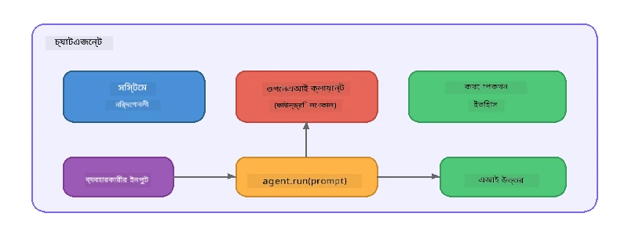

# পার্ট ৫: এজেন্ট ফ্রেমওয়ার্ক দিয়ে AI এজেন্ট নির্মাণ

> **লক্ষ্য:** Foundry Local-এর মাধ্যমে একটি লোকাল মডেলের সাহায্যে ধ্রুবক নির্দেশনা এবং একটি নির্ধারিত পার্সোনা নিয়ে আপনার প্রথম AI এজেন্ট তৈরি করুন।

## AI এজেন্ট কী?

একটি AI এজেন্ট একটি ভাষা মডেলকে মোড়ক দেয় **সিস্টেম নির্দেশাবলীর** সাথে যা তার আচরণ, ব্যক্তিত্ব এবং সীমাবদ্ধতা নির্ধারণ করে। একটি একক চ্যাট সম্পন্ন করার কলের থেকে ভিন্নভাবে, একটি এজেন্ট প্রদান করে:

- **পার্সোনা** - একটি সঙ্গতিপূর্ণ পরিচয় ("আপনি একজন সহায়ক কোড রিভিউয়ার")
- **মেমোরি** - টার্নগুলোর মধ্যে কথোপকথনের ইতিহাস
- **বিশেষায়ন** - সুচারুভাবে গঠিত নির্দেশাবলীর দ্বারা চালিত মনোযোগী আচরণ



---

## মাইক্রোসফট এজেন্ট ফ্রেমওয়ার্ক

**Microsoft Agent Framework** (AGF) একটি স্ট্যান্ডার্ড এজেন্ট বিমূর্ততা প্রদান করে যা বিভিন্ন মডেল ব্যাকএন্ডজের জন্য কাজ করে। এই কর্মশালায় আমরা এটি Foundry Local এর সাথে জোড়া দিচ্ছি যাতে সবকিছু আপনার মেশিনে চলে - কোন ক্লাউডের প্রয়োজন নেই।

| ধারণা | বর্ণনা |
|---------|-------------|
| `FoundryLocalClient` | পাইথন: সার্ভিস শুরু, মডেল ডাউনলোড/লোড পরিচালনা করে এবং এজেন্ট তৈরি করে |
| `client.as_agent()` | পাইথন: Foundry Local ক্লায়েন্ট থেকে একটি এজেন্ট তৈরি করে |
| `AsAIAgent()` | সি#: `ChatClient`-এর উপর এক্সটেনশন মেথড — একটি `AIAgent` তৈরি করে |
| `instructions` | এজেন্টের আচরণ নির্ধারণকারী সিস্টেম প্রম্পট |
| `name` | মানব-পাঠযোগ্য লেবেল, মাল্টি-এজেন্ট পরিস্থিতিতে উপকারী |
| `agent.run(prompt)` / `RunAsync()` | ব্যবহারকারীর মেসেজ পাঠায় এবং এজেন্টের উত্তর ফিরিয়ে দেয় |

> **নোট:** এজেন্ট ফ্রেমওয়ার্ক এর পাইথন এবং .NET SDK রয়েছে। জাভাস্ক্রিপ্টের জন্য, আমরা একটি হালকা `ChatAgent` ক্লাস বাস্তবায়ন করেছি যা সরাসরি OpenAI SDK ব্যবহার করে একই প্যাটার্ন অনুসরণ করে।

---

## অনুশীলনসমূহ

### অনুশীলন ১ - এজেন্ট প্যাটার্ন বুঝুন

কোড লেখার আগে, একটি এজেন্টের প্রধান উপাদানগুলো অধ্যয়ন করুন:

1. **মডেল ক্লায়েন্ট** - Foundry Local-এর OpenAI-সমর্থিত API-তে সংযোগ স্থাপন করে
2. **সিস্টেম নির্দেশাবলী** - "পার্সোনা" প্রম্পট
3. **রান লুপ** - ব্যবহারকারীর ইনপুট পাঠিয়ে আউটপুট গ্রহণ করে

> **ভাবুন:** সিস্টেম নির্দেশাবলী একটি সাধারণ ব্যবহারকারীর মেসেজ থেকে কীভাবে আলাদা? যদি আপনি এগুলো পরিবর্তন করেন তাহলে কী হয়?

---

### অনুশীলন ২ - সিঙ্গল-এজেন্ট উদাহরণ চালান

<details>
<summary><strong>🐍 পাইথন</strong></summary>

**প্রয়োজনীয়তা:**
```bash
cd python
python -m venv venv

# উইন্ডোজ (পাওয়ারশেল):
venv\Scripts\Activate.ps1
# ম্যাকওএস:
source venv/bin/activate

pip install -r requirements.txt
```

**চালান:**
```bash
python foundry-local-with-agf.py
```

**কোড ওয়াকথ্রু** (`python/foundry-local-with-agf.py`):

```python
import asyncio
from agent_framework_foundry_local import FoundryLocalClient

async def main():
    alias = "phi-4-mini"

    # FoundryLocalClient সার্ভিস শুরু, মডেল ডাউনলোড, এবং লোডিং পরিচালনা করে
    client = FoundryLocalClient(model_id=alias)
    print(f"Client Model ID: {client.model_id}")

    # সিস্টেম নির্দেশনার সাথে একটি এজেন্ট তৈরি করুন
    agent = client.as_agent(
        name="Joker",
        instructions="You are good at telling jokes.",
    )

    # নন-স্ট্রিমিং: সম্পূর্ণ উত্তর একবারে পান
    result = await agent.run("Tell me a joke about a pirate.")
    print(f"Agent: {result}")

    # স্ট্রিমিং: ফলাফলগুলো যতটা তৈরি হয় ততটাই পান
    async for chunk in agent.run("Tell me another joke.", stream=True):
        if chunk.text:
            print(chunk.text, end="", flush=True)

asyncio.run(main())
```

**মূল পয়েন্ট:**
- `FoundryLocalClient(model_id=alias)` সার্ভিস শুরু করা, ডাউনলোড এবং মডেল লোড এক ধাপে পরিচালনা করে
- `client.as_agent()` সিস্টেম নির্দেশাবলী এবং নাম সহ একটি এজেন্ট তৈরি করে
- `agent.run()` নন-স্ট্রিমিং এবং স্ট্রিমিং উভয় মোড সাপোর্ট করে
- `pip install agent-framework-foundry-local --pre` দ্বারা ইন্সটল করুন

</details>

<details>
<summary><strong>📦 জাভাস্ক্রিপ্ট</strong></summary>

**প্রয়োজনীয়তা:**
```bash
cd javascript
npm install
```

**চালান:**
```bash
node foundry-local-with-agent.mjs
```

**কোড ওয়াকথ্রু** (`javascript/foundry-local-with-agent.mjs`):

```javascript
import { OpenAI } from "openai";
import { FoundryLocalManager } from "foundry-local-sdk";

class ChatAgent {
  constructor({ client, modelId, instructions, name }) {
    this.client = client;
    this.modelId = modelId;
    this.instructions = instructions;
    this.name = name;
    this.history = [];
  }

  async run(userMessage) {
    const messages = [
      { role: "system", content: this.instructions },
      ...this.history,
      { role: "user", content: userMessage },
    ];
    const response = await this.client.chat.completions.create({
      model: this.modelId,
      messages,
    });
    const assistantMessage = response.choices[0].message.content;

    // মাল্টি-টার্ন ইন্টারঅ্যাকশনগুলির জন্য কথোপকথনের ইতিহাস সংরক্ষণ করুন
    this.history.push({ role: "user", content: userMessage });
    this.history.push({ role: "assistant", content: assistantMessage });
    return { text: assistantMessage };
  }
}

async function main() {
  FoundryLocalManager.create({ appName: "FoundryLocalWorkshop" });
  const manager = FoundryLocalManager.instance;
  await manager.startWebService();

  const catalog = manager.catalog;
  const model = await catalog.getModel("phi-3.5-mini");
  if (!model.isCached) {
    console.log("Downloading model: phi-3.5-mini...");
    await model.download();
  }
  await model.load();

  const client = new OpenAI({
    baseURL: manager.urls[0] + "/v1",
    apiKey: "foundry-local",
  });

  const agent = new ChatAgent({
    client,
    modelId: model.id,
    instructions: "You are good at telling jokes.",
    name: "Joker",
  });

  const result = await agent.run("Tell me a joke about a pirate.");
  console.log(result.text);
}

main();
```

**মূল পয়েন্ট:**
- জাভাস্ক্রিপ্ট তার নিজস্ব `ChatAgent` ক্লাস তৈরি করে যা পাইথন AGF প্যাটার্ন নকল করে
- `this.history` কথোপকথনের টার্নসমূহ সংরক্ষণ করে মাল্টি-টার্ন সাপোর্টের জন্য
- স্পষ্টভাবে `startWebService()` → ক্যাশ চেক → `model.download()` → `model.load()` সম্পূর্ণ দৃশ্যমানতা দেয়

</details>

<details>
<summary><strong>💜 সি#</strong></summary>

**প্রয়োজনীয়তা:**
```bash
cd csharp
dotnet restore
```

**চালান:**
```bash
dotnet run agent
```

**কোড ওয়াকথ্রু** (`csharp/SingleAgent.cs`):

```csharp
using Microsoft.AI.Foundry.Local;
using Microsoft.Extensions.Logging.Abstractions;
using Microsoft.Agents.AI;
using OpenAI;
using System.ClientModel;

// 1. Start Foundry Local and load a model
var alias = "phi-3.5-mini";
await FoundryLocalManager.CreateAsync(
    new Configuration
    {
        AppName = "FoundryLocalSamples",
        Web = new Configuration.WebService { Urls = "http://127.0.0.1:0" }
    }, NullLogger.Instance, default);
var manager = FoundryLocalManager.Instance;
await manager.StartWebServiceAsync(default);

var catalog = await manager.GetCatalogAsync(default);
var model = await catalog.GetModelAsync(alias, default);

var isCached = await model.IsCachedAsync(default);
if (!isCached)
{
    Console.WriteLine($"Downloading model: {alias}...");
    await model.DownloadAsync(null, default);
}
await model.LoadAsync(default);

var key = new ApiKeyCredential("foundry-local");
var client = new OpenAIClient(key, new OpenAIClientOptions
{
    Endpoint = new Uri(manager.Urls[0] + "/v1")
});

// 2. Create an AIAgent using the Agent Framework extension method
AIAgent joker = client
    .GetChatClient(model.Id)
    .AsAIAgent(
        instructions: "You are good at telling jokes. Keep your jokes short and family-friendly.",
        name: "Joker"
    );

// 3. Run the agent (non-streaming)
var response = await joker.RunAsync("Tell me a joke about a pirate.");
Console.WriteLine($"Joker: {response}");

// 4. Run with streaming
await foreach (var update in joker.RunStreamingAsync("Tell me another joke."))
{
    Console.Write(update);
}
```

**মূল পয়েন্ট:**
- `AsAIAgent()` হল `Microsoft.Agents.AI.OpenAI` থেকে এক্সটেনশন মেথড — কোন কাস্টম `ChatAgent` ক্লাস প্রয়োজন নেই
- `RunAsync()` পূর্ণ উত্তর দেয়; `RunStreamingAsync()` টোকেনভিত্তিক স্ট্রিমিং করে
- `dotnet add package Microsoft.Agents.AI.OpenAI --version 1.0.0-rc3` দিয়ে ইন্সটল করুন

</details>

---

### অনুশীলন ৩ - পার্সোনা পরিবর্তন করুন

এজেন্টের `instructions` পরিবর্তন করে একটি ভিন্ন পার্সোনা তৈরি করুন। প্রতিটি পার্সোনা চেষ্টা করুন এবং দেখুন আউটপুট কেমন পরিবর্তিত হয়:

| পার্সোনা | নির্দেশাবলী |
|---------|-------------|
| কোড রিভিউয়ার | `"আপনি একজন দক্ষ কোড রিভিউয়ার। পাঠযোগ্যতা, পারফরম্যান্স এবং সঠিকতার উপর কেন্দ্রীভূত গঠনমূলক প্রতিক্রিয়া প্রদান করুন।"` |
| ট্রাভেল গাইড | `"আপনি একজন বন্ধুত্বপূর্ণ ট্রাভেল গাইড। গন্তব্য, কার্যকলাপ এবং স্থানীয় খাবারের জন্য ব্যক্তিগতকৃত পরামর্শ দিন।"` |
| সক্রেটিক টিউটার | `"আপনি একজন সক্রেটিক টিউটার। সরাসরি উত্তর দেবেন না—বরং শিক্ষার্থীকে চিন্তাশীল প্রশ্ন দিয়ে গাইড করুন।"` |
| টেকনিক্যাল রাইটার | `"আপনি একজন টেকনিক্যাল রাইটার। ধারণাগুলো স্পষ্ট ও সংক্ষিপ্তভাবে ব্যাখ্যা করুন। উদাহরণ ব্যবহার করুন। জর্জর বাড়ানো এড়িয়ে চলুন।"` |

**চেষ্টা করুন:**
1. উপরোক্ত টেবিল থেকে একটি পার্সোনা নির্বাচন করুন
2. কোডে `instructions` স্ট্রিংটি প্রতিস্থাপন করুন
3. ব্যবহারকারীর প্রম্পটকে মানানসই করুন (উদাহরণস্বরূপ কোড রিভিউয়ারকে একটি ফাংশন রিভিউ করতে বলুন)
4. উদাহরণটি আবার চালান এবং আউটপুট তুলনা করুন

> **টিপ:** এজেন্টের গুণমান অনেকটাই নির্দেশনার উপর নির্ভর করে। নির্দিষ্ট, সুচারুভাবে গঠিত নির্দেশাবলী অস্পষ্ট নির্দেশনা থেকে ভালো ফলাফল দেয়।

---

### অনুশীলন ৪ - মাল্টি-টার্ন কথোপকথন যুক্ত করুন

উদাহরণটিকে বাড়িয়ে মাল্টি-টার্ন চ্যাট লুপ সাপোর্ট করুন যাতে আপনি এজেন্টের সাথে পেছনে-সামনে কথোপকথন করতে পারেন।

<details>
<summary><strong>🐍 পাইথন - মাল্টি-টার্ন লুপ</strong></summary>

```python
import asyncio
from agent_framework_foundry_local import FoundryLocalClient

async def main():
    client = FoundryLocalClient(model_id="phi-4-mini")

    agent = client.as_agent(
        name="Assistant",
        instructions="You are a helpful assistant.",
    )

    print("Chat with the agent (type 'quit' to exit):\n")
    while True:
        user_input = input("You: ")
        if user_input.strip().lower() in ("quit", "exit"):
            break
        result = await agent.run(user_input)
        print(f"Agent: {result}\n")

asyncio.run(main())
```

</details>

<details>
<summary><strong>📦 জাভাস্ক্রিপ্ট - মাল্টি-টার্ন লুপ</strong></summary>

```javascript
import { OpenAI } from "openai";
import { FoundryLocalManager } from "foundry-local-sdk";
import * as readline from "node:readline/promises";

// (অনুশীলন ২ থেকে ChatAgent ক্লাস পুনঃব্যবহার করুন)

async function main() {
  FoundryLocalManager.create({ appName: "FoundryLocalWorkshop" });
  const manager = FoundryLocalManager.instance;
  await manager.startWebService();

  const catalog = manager.catalog;
  const model = await catalog.getModel("phi-3.5-mini");
  if (!model.isCached) {
    console.log("Downloading model: phi-3.5-mini...");
    await model.download();
  }
  await model.load();

  const client = new OpenAI({
    baseURL: manager.urls[0] + "/v1",
    apiKey: "foundry-local",
  });

  const agent = new ChatAgent({
    client,
    modelId: model.id,
    instructions: "You are a helpful assistant.",
    name: "Assistant",
  });

  const rl = readline.createInterface({
    input: process.stdin,
    output: process.stdout,
  });

  console.log("Chat with the agent (type 'quit' to exit):\n");
  while (true) {
    const userInput = await rl.question("You: ");
    if (["quit", "exit"].includes(userInput.trim().toLowerCase())) break;
    const result = await agent.run(userInput);
    console.log(`Agent: ${result.text}\n`);
  }
  rl.close();
}

main();
```

</details>

<details>
<summary><strong>💜 সি# - মাল্টি-টার্ন লুপ</strong></summary>

```csharp
using Microsoft.AI.Foundry.Local;
using Microsoft.Extensions.Logging.Abstractions;
using Microsoft.Agents.AI;
using OpenAI;
using System.ClientModel;

var alias = "phi-3.5-mini";
var config = new Configuration
{
    AppName = "FoundryLocalSamples",
    Web = new Configuration.WebService { Urls = "http://127.0.0.1:0" }
};
await FoundryLocalManager.CreateAsync(config, NullLogger.Instance, default);
var manager = FoundryLocalManager.Instance;
await manager.StartWebServiceAsync(default);

var catalog = await manager.GetCatalogAsync(default);
var model = await catalog.GetModelAsync(alias, default);

var isCached = await model.IsCachedAsync(default);
if (!isCached)
{
    Console.WriteLine($"Downloading model: {alias}...");
    await model.DownloadAsync(null, default);
}
await model.LoadAsync(default);

var key = new ApiKeyCredential("foundry-local");
var client = new OpenAIClient(key, new OpenAIClientOptions
{
    Endpoint = new Uri(manager.Urls[0] + "/v1")
});

AIAgent agent = client
    .GetChatClient(model.Id)
    .AsAIAgent(
        instructions: "You are a helpful assistant.",
        name: "Assistant"
    );

Console.WriteLine("Chat with the agent (type 'quit' to exit):\n");
while (true)
{
    Console.Write("You: ");
    var userInput = Console.ReadLine();
    if (string.IsNullOrWhiteSpace(userInput) ||
        userInput.Equals("quit", StringComparison.OrdinalIgnoreCase) ||
        userInput.Equals("exit", StringComparison.OrdinalIgnoreCase))
        break;

    var result = await agent.RunAsync(userInput);
    Console.WriteLine($"Agent: {result}\n");
}
```

</details>

দ্রষ্টব্য করুন কিভাবে এজেন্ট পূর্ববর্তী টার্নগুলো মনে রাখে — একটি ফলো-আপ প্রশ্ন করুন এবং দেখুন প্রসঙ্গটি কতটা ধরে থাকে।

---

### অনুশীলন ৫ - গঠনমূলক আউটপুট

এজেন্টকে সবসময় একটি নির্দিষ্ট ফরম্যাটে (যেমন JSON) উত্তর দিতে নির্দেশ দিন এবং ফলাফল পার্স করুন:

<details>
<summary><strong>🐍 পাইথন - JSON আউটপুট</strong></summary>

```python
import asyncio
import json
from agent_framework_foundry_local import FoundryLocalClient

async def main():
    client = FoundryLocalClient(model_id="phi-4-mini")

    agent = client.as_agent(
        name="SentimentAnalyzer",
        instructions=(
            "You are a sentiment analysis agent. "
            "For every user message, respond ONLY with valid JSON in this format: "
            '{"sentiment": "positive|negative|neutral", "confidence": 0.0-1.0, "summary": "brief reason"}'
        ),
    )

    result = await agent.run("I absolutely loved the new restaurant downtown!")
    print("Raw:", result)

    try:
        parsed = json.loads(str(result))
        print(f"Sentiment: {parsed['sentiment']} (confidence: {parsed['confidence']})")
    except json.JSONDecodeError:
        print("Agent did not return valid JSON - try refining the instructions.")

asyncio.run(main())
```

</details>

<details>
<summary><strong>💜 সি# - JSON আউটপুট</strong></summary>

```csharp
using System.Text.Json;

AIAgent analyzer = chatClient.AsAIAgent(
    name: "SentimentAnalyzer",
    instructions:
        "You are a sentiment analysis agent. " +
        "For every user message, respond ONLY with valid JSON in this format: " +
        "{\"sentiment\": \"positive|negative|neutral\", \"confidence\": 0.0-1.0, \"summary\": \"brief reason\"}"
);

var response = await analyzer.RunAsync("I absolutely loved the new restaurant downtown!");
Console.WriteLine($"Raw: {response}");

try
{
    var parsed = JsonSerializer.Deserialize<JsonElement>(response.ToString());
    Console.WriteLine($"Sentiment: {parsed.GetProperty("sentiment")} " +
                      $"(confidence: {parsed.GetProperty("confidence")})");
}
catch (JsonException)
{
    Console.WriteLine("Agent did not return valid JSON - try refining the instructions.");
}
```

</details>

> **নোট:** ক্ষুদ্র লোকাল মডেলগুলো সবসময় নিখুঁত বৈধ JSON তৈরি নাও করতে পারে। আপনি নির্দেশনায় একটি উদাহরণ যোগ করে এবং প্রত্যাশিত ফরম্যাট সম্পর্কে স্পষ্ট হয়ে নির্ভরযোগ্যতা বাড়াতে পারেন।

---

## প্রধান শিক্ষা

| ধারণা | আপনি কী শিখলেন |
|---------|-----------------|
| এজেন্ট বনাম কাঁচা LLM কল | একটি এজেন্ট মডেলকে নির্দেশনা ও মেমোরি দিয়ে মোড়ক দেয় |
| সিস্টেম নির্দেশাবলী | এজেন্ট আচরণ নিয়ন্ত্রণের সবচেয়ে গুরুত্বপূর্ণ হাতিয়ার |
| মাল্টি-টার্ন কথোপকথন | এজেন্ট একাধিক ব্যবহারকারী কথোপকথনে প্রসঙ্গ বহন করতে পারে |
| গঠনমূলক আউটপুট | নির্দেশাবলী আউটপুট ফরম্যাট (JSON, মার্কডাউন ইত্যাদি) বাধ্যতামূলক করতে পারে |
| লোকাল এক্সিকিউশন | সবকিছু Foundry Local এর মাধ্যমে ডিভাইসে চলে — কোন ক্লাউড প্রয়োজন নেই |

---

## পরবর্তী ধাপ

**[পার্ট ৬: মাল্টি-এজেন্ট ওয়ার্কফ্লো](part6-multi-agent-workflows.md)** এ আপনি একাধিক এজেন্টকে সমন্বিত পাইপলাইনে সংযুক্ত করবেন যেখানে প্রতিটি এজেন্টের একটি বিশেষায়িত ভূমিকা থাকবে।