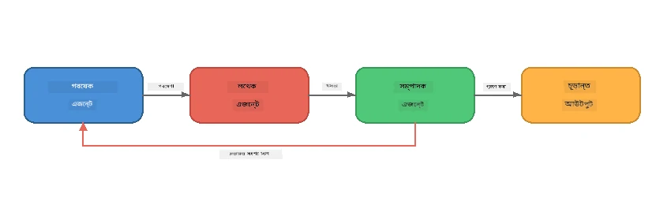
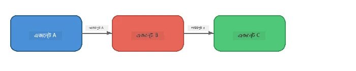
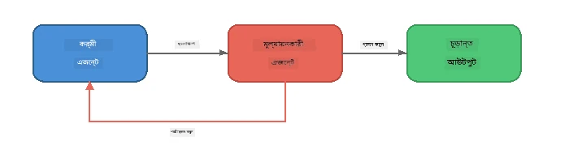
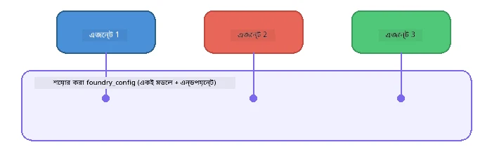

# অংশ ৬: মাল্টি-এজেন্ট ওয়ার্কফ্লো

> **লক্ষ্য:** একাধিক বিশেষায়িত এজেন্টকে সমন্বিত পাইপলাইনে মিলিয়ে জটিল কাজগুলো ভাগ করে দেওয়া - সবগুলোই Foundry Local এ লোকালভাবে চলবে।

## কেন মাল্টি-এজেন্ট?

একজন এজেন্ট অনেক কাজ সামলাতে পারে, কিন্তু জটিল ওয়ার্কফ্লোতে **বিশেষায়ন** সুবিধাজনক। একটির পরিবর্তে একাধিক এজেন্ট একসাথে গবেষণা, লেখা ও সম্পাদনার কাজ ভাগ করে নেয়:



| প্যাটার্ন | বর্ণনা |
|---------|-------------|
| **ক্রমবদ্ধ** | এজেন্ট A এর আউটপুট এজেন্ট B → এজেন্ট C তে যায় |
| **ফিডব্যাক লুপ** | একজন মূল্যায়নকারী এজেন্ট কাজটা সংশোধনের জন্য ফেরত পাঠাতে পারে |
| **শেয়ার করা প্রসঙ্গ** | সব এজেন্ট একই মডেল/এন্ডপয়েন্ট ব্যবহার করে, কিন্তু আলাদা নির্দেশনা নেয় |
| **টাইপড আউটপুট** | এজেন্ট structured ফলাফল (JSON) তৈরি করে নির্ভরযোগ্য হ্যান্ড-অফের জন্য |

---

## অনুশীলন

### অনুশীলন ১ - মাল্টি-এজেন্ট পাইপলাইন চালানো

ওয়ার্কশপে সম্পূর্ণ Researcher → Writer → Editor ওয়ার্কফ্লো অন্তর্ভুক্ত।

<details>
<summary><strong>🐍 পাইথন</strong></summary>

**সেটআপ:**
```bash
cd python
python -m venv venv

# উইন্ডোজ (পাওয়ারশেল):
venv\Scripts\Activate.ps1
# ম্যাকওএস:
source venv/bin/activate

pip install -r requirements.txt
```

**চালান:**
```bash
python foundry-local-multi-agent.py
```

**কি ঘটে:**
1. **Researcher** একটি বিষয় পান এবং বুলেট পয়েন্ট সূত্র হিসেবে ফেরত দেন
2. **Writer** গবেষণার নোট নিয়ে একটি ব্লগ পোস্ট ড্রাফ্ট করেন (৩-৪ প্যারাগ্রাফ)
3. **Editor** নিবন্ধটি গুণগত মান যাচাই করে ACCEPT অথবা REVISE ফেরত দেয়

</details>

<details>
<summary><strong>📦 জাভাস্ক্রিপ্ট</strong></summary>

**সেটআপ:**
```bash
cd javascript
npm install
```

**চালান:**
```bash
node foundry-local-multi-agent.mjs
```

**একই তিন-স্তরীয় পাইপলাইন** - Researcher → Writer → Editor।

</details>

<details>
<summary><strong>💜 সি#</strong></summary>

**সেটআপ:**
```bash
cd csharp
dotnet restore
```

**চালান:**
```bash
dotnet run multi
```

**একই তিন-স্তরীয় পাইপলাইন** - Researcher → Writer → Editor।

</details>

---

### অনুশীলন ২ - পাইপলাইনের গঠন

দেখুন কীভাবে এজেন্টগুলো সংজ্ঞায়িত এবং সংযুক্ত:

**১. শেয়ার করা মডেল ক্লায়েন্ট**

সব এজেন্ট একত্রে একই Foundry Local মডেল ব্যবহার করে:

```python
# Python - FoundryLocalClient সবকিছু পরিচালনা করে
from agent_framework_foundry_local import FoundryLocalClient

client = FoundryLocalClient(model_id="phi-3.5-mini")
```

```javascript
// JavaScript - OpenAI SDK Foundry Local এ নির্দেশিত
const client = new OpenAI({
  baseURL: manager.urls[0] + "/v1",
  apiKey: "foundry-local",
});
```

```csharp
// C# - OpenAIClient pointed at Foundry Local
var key = new ApiKeyCredential("foundry-local");
var client = new OpenAIClient(key, new OpenAIClientOptions
{
    Endpoint = new Uri(manager.Urls[0] + "/v1")
});
var chatClient = client.GetChatClient(model.Id);
```

**২. বিশেষায়িত নির্দেশনা**

প্রতিটি এজেন্টের আলাদা পার্সোনা আছে:

| এজেন্ট | নির্দেশনা (সারাংশ) |
|-------|----------------------|
| Researcher | "মূখ্য তথ্য, পরিসংখ্যান এবং পটভূমি সরবরাহ করুন। বুলেট পয়েন্ট আকারে গুছিয়ে দিন।" |
| Writer | "গবেষণার নোট থেকে আকর্ষণীয় ব্লগ পোস্ট লিখুন (৩-৪ প্যারাগ্রাফ)। তথ্য আবিষ্কার করবেন না।" |
| Editor | "স্পষ্টতা, ব্যাকরণ এবং তথ্যগত সামঞ্জস্য যাচাই করুন। সিদ্ধান্ত: ACCEPT অথবা REVISE।" |

**৩. এজেন্টদের মধ্যে ডেটা প্রবাহ**

```python
# ধাপ ১ - গবেষকের আউটপুট লেখকের ইনপুট হয়
research_result = await researcher.run(f"Research: {topic}")

# ধাপ ২ - লেখকের আউটপুট সম্পাদকর ইনপুট হয়
writer_result = await writer.run(f"Write using:\n{research_result}")

# ধাপ ৩ - সম্পাদক গবেষণা এবং নিবন্ধ উভয় পর্যালোচনা করেন
editor_result = await editor.run(
    f"Research:\n{research_result}\n\nArticle:\n{writer_result}"
)
```

```csharp
// C# - same pattern, async calls with AIAgent
var researchNotes = await researcher.RunAsync(
    $"Research the following topic and provide key facts:\n{topic}");

var draft = await writer.RunAsync(
    $"Write a blog post based on these research notes:\n\n{researchNotes}");

var verdict = await editor.RunAsync(
    $"Review this article for quality and accuracy.\n\n" +
    $"Research notes:\n{researchNotes}\n\n" +
    $"Article:\n{draft}");
```

> **মূল ধারণা:** প্রতিটি এজেন্ট পূর্বের এজেন্টদের সম্মিলিত প্রসঙ্গ পায়। সম্পাদক মূল গবেষণা ও খসড়া উভয়ই দেখে - যা তথ্যগত সামঞ্জস্য যাচাইয়ে সাহায্য করে।

---

### অনুশীলন ৩ - চতুর্থ এজেন্ট যোগ করা

পাইপলাইনে নতুন এজেন্ট যোগ করুন। এইগুলোর মধ্যে একটি বেছে নিন:

| এজেন্ট | উদ্দেশ্য | নির্দেশনা |
|-------|---------|-------------|
| **Fact-Checker** | নিবন্ধের দাবিগুলো যাচাই করা | `"আপনি তথ্যগত দাবিগুলো যাচাই করবেন। প্রতিটি দাবির জন্য গবেষণা নোট দ্বারা সাপোর্টেড কিনা বলুন। যাচাইকৃত/অযাচাইকৃত আইটেম সহ JSON ফিরিয়ে দিন।"` |
| **Headline Writer** | আকর্ষণীয় শিরোনাম তৈরি | `"নিবন্ধের জন্য ৫টি শিরোনামের বিকল্প তৈরি করুন। শৈলী পরিবর্তন করুন: তথ্যপূর্ণ, ক্লিকবেইট, প্রশ্ন, তালিকা, আবেগময়।"` |
| **Social Media** | প্রচারমূলক পোস্ট তৈরি | `"এই নিবন্ধ প্রচারের জন্য ৩টি সোশ্যাল মিডিয়া পোস্ট তৈরি করুন: একটি টুইটারের জন্য (২৮০ অক্ষর), একটি লিঙ্কডইনের জন্য (পেশাদার স্বর), একটি ইনস্টাগ্রামের জন্য (ক্যাজুয়াল ইমোজি সহ)।"` |

<details>
<summary><strong>🐍 পাইথন - Headline Writer যোগ করা</strong></summary>

```python
headline_agent = client.as_agent(
    name="HeadlineWriter",
    instructions=(
        "You are a headline specialist. Given an article, generate exactly "
        "5 headline options. Vary the style: informative, question-based, "
        "listicle, emotional, and provocative. Return them as a numbered list."
    ),
)

# সম্পাদক গৃহীত হওয়ার পর শিরোনাম তৈরি করুন
headline_result = await headline_agent.run(
    f"Generate headlines for this article:\n\n{writer_result}"
)
print(f"\n--- Headlines ---\n{headline_result}")
```

</details>

<details>
<summary><strong>📦 জাভাস্ক্রিপ্ট - Headline Writer যোগ করা</strong></summary>

```javascript
const headlineAgent = new ChatAgent({
  client,
  modelId: modelInfo.id,
  instructions:
    "You are a headline specialist. Given an article, generate exactly " +
    "5 headline options. Vary the style: informative, question-based, " +
    "listicle, emotional, and provocative. Return them as a numbered list.",
  name: "HeadlineWriter",
});

const headlineResult = await headlineAgent.run(
  `Generate headlines for this article:\n\n${writerResult.text}`
);
console.log(`\n--- Headlines ---\n${headlineResult.text}`);
```

</details>

<details>
<summary><strong>💜 সি# - Headline Writer যোগ করা</strong></summary>

```csharp
AIAgent headlineAgent = chatClient.AsAIAgent(
    name: "HeadlineWriter",
    instructions:
        "You are a headline specialist. Given an article, generate exactly " +
        "5 headline options. Vary the style: informative, question-based, " +
        "listicle, emotional, and provocative. Return them as a numbered list."
);

// After the editor accepts, generate headlines
var headlines = await headlineAgent.RunAsync(
    $"Generate headlines for this article:\n\n{draft}");
Console.WriteLine($"\n--- Headlines ---\n{headlines}");
```

</details>

---

### অনুশীলন ৪ - আপনার নিজের ওয়ার্কফ্লো ডিজাইন করুন

একটি আলাদা ক্ষেত্রের জন্য মাল্টি-এজেন্ট পাইপলাইন ডিজাইন করুন। কিছু আইডিয়া:

| ক্ষেত্র | এজেন্ট | প্রবাহ |
|--------|--------|-------|
| **কোড রিভিউ** | বিশ্লেষক → পর্যালোচক → সারাংশ | কোডের গঠন বিশ্লেষণ → সমস্যা পর্যালোচনা → সারাংশ রিপোর্ট তৈরি |
| **গ্রাহক সহায়তা** | শ্রেণীবিভাজক → উত্তরদাতা → গুণমান যাচাইকারী | টিকিট শ্রেণীবিভাজন → উত্তর প্রণয়ন → গুণগত মান পরীক্ষা |
| **শিক্ষা** | প্রশ্নপত্র নির্মাতা → ছাত্র সিমুলেটর → মূল্যায়নকারী | প্রশ্নপত্র তৈরি → উত্তর সিমুলেশন → মূল্যায়ন ও ব্যাখ্যা |
| **তথ্য বিশ্লেষণ** | ব্যাখ্যাকারী → বিশ্লেষক → প্রতিবেদনকারী | তথ্য অনুরোধ বিশ্লেষণ → ধরণ বিশ্লেষণ → প্রতিবেদন লেখা |

**ধাপসমূহ:**
1. তিন বা ততোধিক এজেন্ট সংজ্ঞায়িত করুন আলাদা `instructions` সহ
2. ডেটা প্রবাহ নির্ধারণ করুন - প্রতিটি এজেন্ট কী নেয় এবং কী উৎপন্ন করে?
3. অনুশীলন ১-৩ থেকে প্যাটার্ন ব্যবহার করে পাইপলাইন তৈরি করুন
4. প্রয়োজন হলে একটি ফিডব্যাক লুপ যোগ করুন যাতে একটি এজেন্ট অন্যটির কাজ মূল্যায়ন করতে পারে

---

## অর্কেস্ট্রেশন প্যাটার্নসমূহ

এগুলো যেকোন মাল্টি-এজেন্ট সিস্টেমে প্রযোজ্য অর্কেস্ট্রেশন প্যাটার্ন (বিস্তারিত [অংশ ৭](part7-zava-creative-writer.md) এ আলোচনা):

### ক্রমবদ্ধ পাইপলাইন



প্রতিটি এজেন্ট পূর্ববর্তী এজেন্টের আউটপুট প্রক্রিয়া করে। সহজ এবং পূর্বানুমানযোগ্য।

### ফিডব্যাক লুপ



একজন মূল্যায়নকারী এজেন্ট আগের ধাপগুলো পুনরায় চালানোর ট্রিগার দিতে পারে। Zava Writer এডিটর গবেষক এবং লেখককে ফিডব্যাক পাঠায়।

### শেয়ার করা প্রসঙ্গ



সব এজেন্ট একই `foundry_config` শেয়ার করে যাতে একই মডেল এবং এন্ডপয়েন্ট ব্যবহার হয়।

---

## প্রধান শিক্ষণীয় বিষয়

| ধারণা | আপনি কী শিখলেন |
|---------|-----------------|
| এজেন্টpecialisation | প্রতিটি এজেন্ট একটি কাজ ভালোভাবে করে, নির্দিষ্ট নির্দেশনা নিয়ে |
| ডেটা হ্যান্ড-অফ | এক এজেন্টের আউটপুট পরবর্তী এজেন্টের ইনপুট হয় |
| ফিডব্যাক লুপ | মূল্যায়নকারী পুনরায় চেষ্টা শুরু করতে পারে উন্নত গুণমানের জন্য |
| স্ট্রাকচার্ড আউটপুট | JSON ফরম্যাট উত্তর নিশ্চিত দক্ষ এজেন্ট-টু-এজেন্ট যোগাযোগ |
| অর্কেস্ট্রেশন | একজন সমন্বয়ক পাইপলাইন সিকোয়েন্স এবং ত্রুটি পরিচালনা করে |
| প্রোডাকশন প্যাটার্ন | প্রযোজ্য [অংশ ৭: Zava Creative Writer](part7-zava-creative-writer.md) এ |

---

## পরবর্তী ধাপ

চালিয়ে যান [অংশ ৭: Zava Creative Writer - Capstone Application](part7-zava-creative-writer.md) এ, যেখানে ৪টি বিশেষায়িত এজেন্টের প্রোডাকশন-শৈলীর মাল্টি-এজেন্ট অ্যাপ, স্ট্রিমিং আউটপুট, প্রোডাক্ট সার্চ, এবং ফিডব্যাক লুপ অন্তর্ভুক্ত - পাইথন, জাভাস্ক্রিপ্ট ও সি# এ উপলব্ধ।