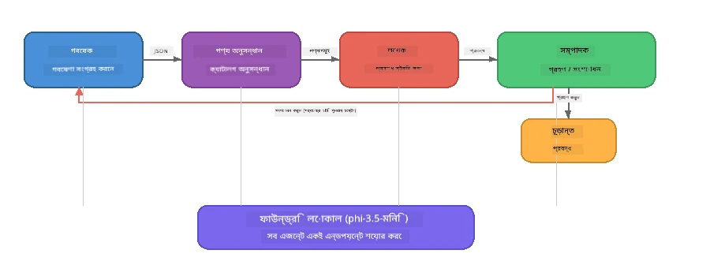

# পার্ট ৭: জাভা ক্রিয়েটিভ রাইটার - ক্যাপস্টোন অ্যাপ্লিকেশন

> **লক্ষ্য:** একটি প্রোডাকশন-স্টাইল মাল্টি-এজেন্ট অ্যাপ্লিকেশন এক্সপ্লোর করুন যেখানে চারটি বিশেষায়িত এজেন্ট জাভা রিটেইল DIY এর জন্য ম্যাগাজিন-গুণমানের নিবন্ধ তৈরি করতে সহযোগিতা করে - যা সম্পূর্ণরূপে আপনার ডিভাইসে Foundry Local এর মাধ্যমে চলে।

এইটি ওয়ার্কশপের **ক্যাপস্টোন ল্যাব**। এটি আপনি যা শিখেছেন তা একত্রিত করে - SDK ইন্টিগ্রেশন (পার্ট ৩), লোকাল ডেটা থেকে রিট্রিভাল (পার্ট ৪), এজেন্ট পারসোনা (পার্ট ৫), এবং মাল্টি-এজেন্ট অর্কেস্ট্রেশন (পার্ট ৬) - একটি সম্পূর্ণ অ্যাপ্লিকেশনে যা উপলব্ধ আছে **Python**, **JavaScript**, এবং **C#** ভাষায়।

---

## আপনি যা এক্সপ্লোর করবেন

| ধারণা | জাভা রাইটারে কোথায় |
|---------|----------------------------|
| ৪-ধাপ মডেল লোডিং | শেয়ার্ড কনফিগ মডিউল Foundry Local বুটস্ট্র্যাপ করে |
| RAG-স্টাইল রিট্রিভাল | প্রোডাক্ট এজেন্ট একটি লোকাল ক্যাটালগ সার্চ করে |
| এজেন্ট বিশেষায়ন | ৪ এজেন্ট স্বতন্ত্র সিস্টেম প্রম্পট নিয়ে |
| স্ট্রিমিং আউটপুট | রাইটার রিয়েল-টাইমে টোকেনস দেয় |
| গঠনমূলক হ্যান্ড-অফ | রিসার্চার → JSON, এডিটর → JSON ডিসিশন |
| ফিডব্যাক লুপ | এডিটর পুনরায় চালানোর ট্রিগার দিতে পারে (সর্বোচ্চ ২বার) |

---

## আর্কিটেকচার

জাভা ক্রিয়েটিভ রাইটার ব্যবহার করে **সিকোয়েনশিয়াল পাইপলাইন যেটি ইভ্যালুয়েটর-চালিত ফিডব্যাকের মাধ্যমে কাজ করে**। তিনটি ভাষার ইমপ্লিমেন্টেশন একই আর্কিটেকচার অনুসরণ করে:



### চারটি এজেন্ট

| এজেন্ট | ইনপুট | আউটপুট | উদ্দেশ্য |
|-------|-------|--------|---------|
| **রিসার্চার** | টপিক + ঐচ্ছিক ফিডব্যাক | `{"web": [{url, name, description}, ...]}` | LLM এর মাধ্যমে ব্যাকগ্রাউন্ড রিসার্চ সংগ্রহ করে |
| **প্রোডাক্ট সার্চ** | প্রোডাক্ট কনটেক্সট স্ট্রিং | মিল থাকা প্রোডাক্টসমূহের তালিকা | LLM-জেনারেটেড কোয়েরি + লোকাল ক্যাটালগে কীবোর্ড সার্চ |
| **রাইটার** | রিসার্চ + প্রোডাক্ট + অ্যাসাইনমেন্ট + ফিডব্যাক | স্ট্রিমিং নিবন্ধ টেক্সট (`---` এ বিভক্ত) | রিয়েল-টাইমে একটি ম্যাগাজিন-গুণমানের আর্টিকেল ড্রাফট করে |
| **এডিটর** | আর্টিকেল + লেখকের স্ব-মূল্যায়ন | `{"decision": "accept/revise", "editorFeedback": "...", "researchFeedback": "..."}` | গুণগত মান পর্যালোচনা করে, প্রয়োজন হলে পুনরায় চেষ্টা ট্রিগার করে |

### পাইপলাইন ফ্লো

1. **রিসার্চার** টপিক পায় এবং গঠনমূলক রিসার্চ নোটস (JSON) তৈরি করে
2. **প্রোডাক্ট সার্চ** LLM-জেনারেটেড সার্চ টার্ম ব্যবহার করে লোকাল প্রোডাক্ট ক্যাটালগে অনুসন্ধান করে
3. **রাইটার** রিসার্চ + প্রোডাক্ট + অ্যাসাইনমেন্টকে একত্রিত করে একটি স্ট্রিমিং আর্টিকেল তৈরি করে, শেষে একটি `---` সেপারেটরের পরে স্ব-মূল্যায়ন যোগ করে
4. **এডিটর** আর্টিকেল পর্যালোচনা করে JSON রূপে রায় দেয়:
   - `"accept"` → পাইপলাইন সম্পন্ন
   - `"revise"` → ফিডব্যাক রিসার্চার ও রাইটারকে ফেরত যায় (সর্বোচ্চ ২ বার চেষ্টা)

---

## প্রয়োজনীয়তা

- [পার্ট ৬: মাল্টি-এজেন্ট ওয়ার্কফ্লো](part6-multi-agent-workflows.md) সম্পন্ন করা
- Foundry Local CLI ইন্সটল করা এবং `phi-3.5-mini` মডেল ডাউনলোড করা

---

## অনুশীলনসমূহ

### অনুশীলন ১ - জাভা ক্রিয়েটিভ রাইটার চালানো

আপনার পছন্দের ভাষা নির্বাচন করুন এবং অ্যাপ চালান:

<details>
<summary><strong>🐍 Python - FastAPI ওয়েব সার্ভিস</strong></summary>

Python ভার্শন একটি **ওয়েব সার্ভিস** হিসেবে চলে REST API ব্যবহার করে, দেখায় কিভাবে একটি প্রোডাকশন ব্যাকএন্ড তৈরি করা হয়।

**সেটআপ:**
```bash
cd zava-creative-writer-local/src/api
python -m venv venv

# উইন্ডোজ (পাওয়ারশেল):
venv\Scripts\Activate.ps1
# ম্যাকওএস:
source venv/bin/activate

pip install -r requirements.txt
```

**চালান:**
```bash
uvicorn main:app --reload
```

**পরীক্ষা করুন:**
```bash
curl -X POST http://localhost:8000/api/article \
  -H "Content-Type: application/json" \
  -d '{
    "research": "DIY home improvement trends",
    "products": "power tools and paints",
    "assignment": "Write an article about weekend renovation projects for DIY enthusiasts"
  }'
```

রেসপন্স স্ট্রিমিং করে নিউলাইন-ডিলিমিটেড JSON মেসেজ হিসেবে আসে, প্রতিটি এজেন্টের অগ্রগতি দেখায়।

</details>

<details>
<summary><strong>📦 JavaScript - Node.js CLI</strong></summary>

JavaScript ভার্শন একটি **CLI অ্যাপ্লিকেশন** হিসেবে চলে, এজেন্টের অগ্রগতি এবং আর্টিকেল সরাসরি কনসোলে প্রিন্ট করে।

**সেটআপ:**
```bash
cd zava-creative-writer-local/src/javascript
npm install
```

**চালান:**
```bash
node main.mjs
```

আপনি দেখতে পাবেন:
1. Foundry Local মডেল লোড হচ্ছে (ডাউনলোডিং হলে প্রগ্রেস বার সহ)
2. এজেন্টগুলি ক্রমান্বয়ে এক্সিকিউট হচ্ছে স্ট্যাটাস মেসেজ দিয়ে
3. আর্টিকেল রিয়েল টাইমে কনসোলে স্ট্রিম হচ্ছে
4. এডিটরের একসেপ্ট/রিভাইজ সিদ্ধান্ত

</details>

<details>
<summary><strong>💜 C# - .NET কনসোল অ্যাপ</strong></summary>

C# ভার্শন একটি **.NET কনসোল অ্যাপ্লিকেশন** হিসেবে চলে একই পাইপলাইন এবং স্ট্রিমিং আউটপুট সহ।

**সেটআপ:**
```bash
cd zava-creative-writer-local/src/csharp
dotnet restore
```

**চালান:**
```bash
dotnet run
```

JavaScript ভার্শনের মতো একই আউটপুট প্যাটার্ন - এজেন্ট স্ট্যাটাস মেসেজ, স্ট্রিমড আর্টিকেল, এবং এডিটরের রায়।

</details>

---

### অনুশীলন ২ - কোডের স্ট্রাকচার অধ্যয়ন

প্রত্যেক ভাষার ইমপ্লিমেন্টেশনে একই যৌক্তিক উপাদান আছে। স্ট্রাকচারগুলোর তুলনা করুন:

**Python** (`src/api/`):
| ফাইল | উদ্দেশ্য |
|------|---------|
| `foundry_config.py` | শেয়ার্ড Foundry Local ম্যানেজার, মডেল, এবং ক্লায়েন্ট (৪-ধাপ ইনিসিয়ালাইজেশন) |
| `orchestrator.py` | পাইপলাইন সমন্বয় এবং ফিডব্যাক লুপ |
| `main.py` | FastAPI এন্ডপয়েন্ট (`POST /api/article`) |
| `agents/researcher/researcher.py` | JSON আউটপুটসহ LLM-ভিত্তিক গবেষণা |
| `agents/product/product.py` | LLM-জেনারেটেড কোয়েরি + কীবোর্ড সার্চ |
| `agents/writer/writer.py` | স্ট্রিমিং আর্টিকেল জেনারেশন |
| `agents/editor/editor.py` | JSON-ভিত্তিক একসেপ্ট/রিভাইজ ডিসিশন |

**JavaScript** (`src/javascript/`):
| ফাইল | উদ্দেশ্য |
|------|---------|
| `foundryConfig.mjs` | শেয়ার্ড Foundry Local কনফিগ (৪-ধাপ ইনিট প্রগ্রেস বার সহ) |
| `main.mjs` | অর্কেস্ট্রেটর + CLI এন্ট্রি পয়েন্ট |
| `researcher.mjs` | LLM-ভিত্তিক রিসার্চ এজেন্ট |
| `product.mjs` | LLM কোয়েরি জেনারেশন + কীবোর্ড সার্চ |
| `writer.mjs` | স্ট্রিমিং আর্টিকেল জেনারেশন (অ্যাসিঙ্ক জেনারেটর) |
| `editor.mjs` | JSON একসেপ্ট/রিভাইজ ডিসিশন |
| `products.mjs` | প্রোডাক্ট ক্যাটালগ ডেটা |

**C#** (`src/csharp/`):
| ফাইল | উদ্দেশ্য |
|------|---------|
| `Program.cs` | পূর্ণ পাইপলাইন: মডেল লোডিং, এজেন্ট, অর্কেস্ট্রেটর, ফিডব্যাক লুপ |
| `ZavaCreativeWriter.csproj` | .NET 9 প্রজেক্ট Foundry Local + OpenAI প্যাকেজসহ |

> **ডিজাইন নোট:** Python এজেন্টকে আলাদা ফাইল/ডিরেক্টরিতে রাখে (বড় টিমের জন্য ভাল)। JavaScript প্রতিটি এজেন্টকে একটি মডিউলে রাখে (মাঝারি প্রোজেক্টের জন্য উপযুক্ত)। C# সবকিছু এক ফাইলে রাখে স্থানীয় ফাংশনসহ (স্বনির্ভর উদাহরণের জন্য ভালো)। প্রোডাকশনে আপনার টিমের ধারাবাহিকতায় যে প্যাটার্ন মেলে তা বাছুন।

---

### অনুশীলন ৩ - শেয়ার্ড কনফিগারেশন ট্রেস করা

পাইপলাইনের প্রতিটি এজেন্ট একটি একক Foundry Local মডেল ক্লায়েন্ট শেয়ার করে। প্রতিটি ভাষায় এটি কিভাবে স্যেটআপ হয় অধ্যয়ন করুন:

<details>
<summary><strong>🐍 Python - foundry_config.py</strong></summary>

```python
from foundry_local import FoundryLocalManager

MODEL_ALIAS = "phi-3.5-mini"

# ধাপ ১: ম্যানেজার তৈরি করুন এবং ফাউন্ড্রি লোকাল সার্ভিস শুরু করুন
manager = FoundryLocalManager()
manager.start_service()

# ধাপ ২: পরীক্ষা করুন মডেলটি ইতিমধ্যেই ডাউনলোড করা আছে কিনা
cached = manager.list_cached_models()
catalog_info = manager.get_model_info(MODEL_ALIAS)
is_cached = any(m.id == catalog_info.id for m in cached) if catalog_info else False

if not is_cached:
    manager.download_model(MODEL_ALIAS)

# ধাপ ৩: মডেলটি মেমোরিতে লোড করুন
manager.load_model(MODEL_ALIAS)
model_id = manager.get_model_info(MODEL_ALIAS).id

# শেয়ারড ওপেনএআই ক্লায়েন্ট
client = openai.OpenAI(base_url=manager.endpoint, api_key=manager.api_key)
```

সকল এজেন্ট `from foundry_config import client, model_id` ইমপোর্ট করে।

</details>

<details>
<summary><strong>📦 JavaScript - foundryConfig.mjs</strong></summary>

```javascript
import { FoundryLocalManager } from "foundry-local-sdk";
import { OpenAI } from "openai";

FoundryLocalManager.create({ appName: "ZavaCreativeWriter" });
const manager = FoundryLocalManager.instance;
await manager.startWebService();

// ক্যাশ চেক করুন → ডাউনলোড করুন → লোড করুন (নতুন SDK প্যাটার্ন)
const catalog = manager.catalog;
const model = await catalog.getModel(MODEL_ALIAS);
if (!model.isCached) {
  console.log(`Downloading model: ${MODEL_ALIAS}...`);
  await model.download();
}
await model.load();

const client = new OpenAI({ baseURL: manager.urls[0] + "/v1", apiKey: "foundry-local" });
const modelId = model.id;
export { client, modelId };
```

সকল এজেন্ট `import { client, modelId } from "./foundryConfig.mjs"` ব্যবহার করে।

</details>

<details>
<summary><strong>💜 C# - Program.cs এর শীর্ষে</strong></summary>

```csharp
await FoundryLocalManager.CreateAsync(
    new Configuration
    {
        AppName = "ZavaCreativeWriter",
        Web = new Configuration.WebService { Urls = "http://127.0.0.1:0" }
    }, NullLogger.Instance, default);
var manager = FoundryLocalManager.Instance;
await manager.StartWebServiceAsync(default);

var catalog = await manager.GetCatalogAsync(default);
var catalogModel = await catalog.GetModelAsync(alias, default);
var isCached = await catalogModel.IsCachedAsync(default);
if (!isCached)
    await catalogModel.DownloadAsync(null, default);

await catalogModel.LoadAsync(default);
var key = new ApiKeyCredential("foundry-local");
var chatClient = new OpenAIClient(key, new OpenAIClientOptions
{
    Endpoint = new Uri(manager.Urls[0] + "/v1")
}).GetChatClient(catalogModel.Id);
```

`chatClient` তারপর একই ফাইলের সব এজেন্ট ফাংশনে পাস করা হয়।

</details>

> **মূল প্যাটার্ন:** মডেল লোডিং প্যাটার্ন (সার্ভিস শুরু করা → ক্যাশ চেক → ডাউনলোড → লোড) ব্যবহারকারীকে স্পষ্ট প্রগ্রেস দেখায় এবং মডেল শুধুমাত্র একবার ডাউনলোড হয়। এটি Foundry Local এর জন্য একটি বেস্ট প্র্যাকটিস।

---

### অনুশীলন ৪ - ফিডব্যাক লুপ বোঝা

ফিডব্যাক লুপটি পাইপলাইনটিকে "স্মার্ট" করে তোলে - এডিটর কাজ পুনর্বিবেচনার জন্য ফেরত পাঠাতে পারে। লজিক ট্রেস করুন:

```
Orchestrator:
  1. researcher.research(topic, "No Feedback")    ← first pass
  2. product.findProducts(productContext)
  3. writer.write(research, products, assignment)  ← streams article
  4. Split article at "---" → article + writerFeedback
  5. editor.edit(article, writerFeedback)

  WHILE editor says "revise" AND retryCount < 2:
    6. researcher.research(topic, editor.researchFeedback)  ← refined
    7. writer.write(research, products, editor.editorFeedback)
    8. editor.edit(newArticle, newWriterFeedback)
    9. retryCount++
```

**বিবেচনার প্রশ্নসমূহ:**
- কেন রিট্রাই লিমিট ২ সেট করা হয়েছে? বাড়ালে কী হয়?
- কেন রিসার্চার পায় `researchFeedback` কিন্তু রাইটার পায় `editorFeedback`?
- যদি এডিটর সবসময় "revise" বলে তাহলে কী হবে?

---

### অনুশীলন ৫ - একটি এজেন্ট পরিবর্তন করা

একটি এজেন্টের আচরণ পরিবর্তন করে দেখুন পাইপলাইনে কেমন প্রভাব পড়ে:

| পরিবর্তন | কী পরিবর্তন করবেন |
|-------------|----------------|
| **কঠোরতর এডিটর** | এডিটরের সিস্টেম প্রম্পট পরিবর্তন করে সবসময় অন্তত একটি সংশোধনের অনুরোধ করবেন |
| **দীর্ঘ তালিকা** | রাইটারের প্রম্পট “৮০০-১০০০ শব্দ” থেকে “১৫০০-২০০০ শব্দ” এ পরিবর্তন করুন |
| **বিভিন্ন প্রোডাক্ট** | প্রোডাক্ট ক্যাটালগে নতুন প্রোডাক্ট যুক্ত বা পরিবর্তন করুন |
| **নতুন রিসার্চ টপিক** | ডিফল্ট `researchContext` অন্য কোনো বিষয়ে পরিবর্তন করুন |
| **শুধুমাত্র JSON রিসার্চার** | রিসার্চারকে ৩-৫ এর পরিবর্তে ১০ আইটেম ফিরিয়ে দিতে বলুন |

> **টিপ:** যেহেতু সব তিনটি ভাষায় একই আর্কিটেকচার আছে, আপনি যেকোনো ভাষায় একই পরিবর্তন করতে পারেন যা আপনার কাছে সহজ।

---

### অনুশীলন ৬ - পঞ্চম এজেন্ট যোগ করুন

পাইপলাইনে নতুন একটি এজেন্ট যুক্ত করুন। কিছু আইডিয়া:

| এজেন্ট | পাইপলাইনে কোথায় | উদ্দেশ্য |
|-------|-------------------|---------|
| **ফ্যাক্ট-চেকার** | রাইটারের পরে, এডিটরের আগে | রিসার্চ ডেটার বিরুদ্ধে দাবিগুলো যাচাই করা |
| **SEO অপ্টিমাইজার** | এডিটর একসেপ্ট করার পরে | মেটা বিবরণ, কীওয়ার্ড, স্লাগ যোগ করা |
| **ইলাস্ট্রেটর** | এডিটর একসেপ্ট করার পরে | আর্টিকেলের জন্য ইমেজ প্রম্পট তৈরি করা |
| **ট্রান্সলেটর** | এডিটর একসেপ্ট করার পরে | আর্টিকেল অন্য ভাষায় অনুবাদ করা |

**ধাপসমূহ:**
1. এজেন্টের সিস্টেম প্রম্পট লিখুন
2. এজেন্ট ফাংশন তৈরি করুন (আপনার ভাষায় বিদ্যমান প্যাটার্ন অনুযায়ী)
3. সঠিক স্থানে অর্কেস্ট্রেটরে সেটি যোগ করুন
4. আউটপুট/লগিং আপডেট করে নতুন এজেন্টের অবদান দেখান

---

## Foundry Local এবং এজেন্ট ফ্রেমওয়ার্ক কিভাবে একসাথে কাজ করে

এই অ্যাপ্লিকেশনটি Foundry Local দিয়ে মাল্টি-এজেন্ট সিস্টেম তৈরির সুপারিশকৃত প্যাটার্ন প্রদর্শন করে:

| স্তর | উপাদান | ভূমিকা |
|-------|-----------|------|
| **রানটাইম** | Foundry Local | মডেল লোকাল ডাউনলোড, ম্যানেজ ও সার্ভ করে |
| **ক্লায়েন্ট** | OpenAI SDK | লোকাল এন্ডপয়েন্টে চ্যাট কমপ্লিশন পাঠায় |
| **এজেন্ট** | সিস্টেম প্রম্পট + চ্যাট কল | ফোকাসড নির্দেশনা দিয়ে বিশেষায়িত আচরণ |
| **অর্কেস্ট্রেটর** | পাইপলাইন সমন্বয়কারী | ডেটা ফ্লো, সিকোয়েন্সিং, এবং ফিডব্যাক লুপ ম্যানেজ করে |
| **ফ্রেমওয়ার্ক** | Microsoft Agent Framework | `ChatAgent` এবস্ট্রাকশন এবং প্যাটার্ন সরবরাহ করে |

মূল উপলব্ধি: **Foundry Local ক্লাউড ব্যাকএন্ডের বিকল্প, অ্যাপ্লিকেশন আর্কিটেকচার নয়।** একই এজেন্ট প্যাটার্ন, অর্কেস্ট্রেশন কৌশল, এবং গঠনমূলক হ্যান্ড-অফ যা ক্লাউড-হোস্টেড মডেলের সঙ্গে কাজ করে, সেগুলো লোকাল মডেলের ক্ষেত্রেও একইভাবে কাজ করে — শুধু ক্লায়েন্টকে লোকাল এন্ডপয়েন্টে নির্দেশ করতে হবে Azure এন্ডপয়েন্টের পরিবর্তে।

---

## মূল বিষয়গুলো

| ধারণা | আপনি যা শিখেছেন |
|---------|-----------------|
| প্রোডাকশন আর্কিটেকচার | কিভাবে মাল্টি-এজেন্ট অ্যাপকে শেয়ার্ড কনফিগ এবং আলাদা এজেন্ট দিয়ে স্ট্রাকচার করতে হয় |
| ৪-ধাপ মডেল লোডিং | ব্যবহারকারী দৃশ্যমান প্রগ্রেস সহ Foundry Local ইনিশিয়ালাইজেশনের বেস্ট প্র্যাকটিস |
| এজেন্ট বিশেষায়ন | ৪টি এজেন্টের প্রত্যেকে ফোকাসড নির্দেশনা এবং নির্দিষ্ট আউটপুট ফরম্যাট নেয় |
| স্ট্রিমিং জেনারেশন | রাইটার রিয়েল টাইমে টোকেন দেয়, প্রতিক্রিয়াশীল UI সক্ষম করে |
| ফিডব্যাক লুপ | এডিটর-চালিত পুনরায় চেষ্টা আউটপুটের গুণমান উন্নত করে মানুষের হস্তক্ষেপ ছাড়াই |
| ক্রস-ভাষা প্যাটার্ন | একই আর্কিটেকচার Python, JavaScript এবং C# তে কাজ করে |
| লোকাল = প্রোডাকশন-রেডি | Foundry Local একই OpenAI-প্রতিসরূপ API সার্ভ করে যা ক্লাউডে ব্যবহৃত হয় |

---

## পরবর্তী ধাপ

[পার্ট ৮: ইভ্যালুয়েশন-লেড ডেভেলপমেন্ট](part8-evaluation-led-development.md) এ যান যেখানে আপনার এজেন্টদের জন্য একটি সিস্টেম্যাটিক ইভ্যালুয়েশন ফ্রেমওয়ার্ক তৈরি করা হবে, গোল্ডেন ডেটাসেট, রুল-বেজড চেক, এবং LLM-জাজ স্কোরিং ব্যবহার করে।