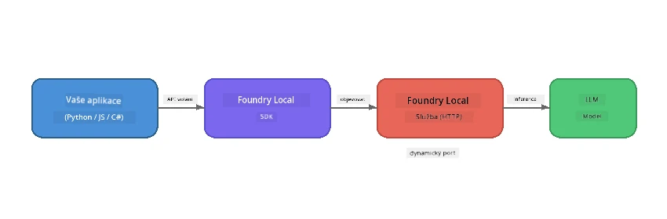

# Část 1: Začínáme s Foundry Local


## Co je Foundry Local?

[Foundry Local](https://foundrylocal.ai) vám umožňuje spouštět open-source AI jazykové modely **přímo na vašem počítači** - není třeba připojení k internetu, žádné náklady za cloud a úplné soukromí dat. Nabízí:

- **Stažení a spuštění modelů lokálně** s automatickou optimalizací hardwaru (GPU, CPU nebo NPU)
- **Poskytuje API kompatibilní s OpenAI**, takže můžete používat známé SDK a nástroje
- **Nevyžaduje žádné předplatné Azure** ani registraci - stačí nainstalovat a začít tvořit

Představte si to jako vlastní soukromou AI, která běží kompletně na vašem zařízení.

## Cíle učení

Na konci tohoto cvičení budete schopni:

- Nainstalovat Foundry Local CLI na váš operační systém
- Porozumět, co jsou aliasy modelů a jak fungují
- Stáhnout a spustit svůj první lokální AI model
- Odeslat chatovou zprávu místnímu modelu z příkazové řádky
- Porozumět rozdílu mezi lokálními a cloud-hostovanými AI modely

---

## Požadavky

### Systémové požadavky

| Požadavek | Minimum | Doporučeno |
|-------------|---------|-------------|
| **RAM** | 8 GB | 16 GB |
| **Místo na disku** | 5 GB (pro modely) | 10 GB |
| **CPU** | 4 jádra | 8+ jader |
| **GPU** | Volitelné | NVIDIA s CUDA 11.8+ |
| **OS** | Windows 10/11 (x64/ARM), Windows Server 2025, macOS 13+ | - |

> **Poznámka:** Foundry Local automaticky vybere nejlepší variantu modelu pro váš hardware. Máte-li NVIDIA GPU, použije akceleraci CUDA. Máte-li Qualcomm NPU, použije ji. Jinak se vrátí k optimalizované variantě pro CPU.

### Instalace Foundry Local CLI

**Windows** (PowerShell):
```powershell
winget install Microsoft.FoundryLocal
```

**macOS** (Homebrew):
```bash
brew tap microsoft/foundrylocal
brew install foundrylocal
```

> **Poznámka:** Foundry Local momentálně podporuje pouze Windows a macOS. Linux v tuto chvíli není podporován.

Ověřte instalaci:
```bash
foundry --version
```

---

## Laboratorní cvičení

### Cvičení 1: Prozkoumejte dostupné modely

Foundry Local obsahuje katalog předoptimalizovaných open-source modelů. Vyjmenujte je:

```bash
foundry model list
```

Uvidíte modely jako:
- `phi-3.5-mini` - Microsoftův model s 3,8 mld. parametrů (rychlý, dobrá kvalita)
- `phi-4-mini` - Novější, schopnější model Phi
- `phi-4-mini-reasoning` - Model Phi s řetězovým uvažováním (`<think>` tagy)
- `phi-4` - Microsoftův největší model Phi (10,4 GB)
- `qwen2.5-0.5b` - Velmi malý a rychlý (dobrý pro zařízení s nízkými zdroji)
- `qwen2.5-7b` - Silný model pro všeobecné použití s podporou volání nástrojů
- `qwen2.5-coder-7b` - Optimalizovaný na generování kódu
- `deepseek-r1-7b` - Silný model pro uvažování
- `gpt-oss-20b` - Velký open-source model (licence MIT, 12,5 GB)
- `whisper-base` - Přepis řeči do textu (383 MB)
- `whisper-large-v3-turbo` - Přepis s vysokou přesností (9 GB)

> **Co je alias modelu?** Alias jako `phi-3.5-mini` jsou zkratky. Když použijete alias, Foundry Local automaticky stáhne nejlepší variantu pro váš konkrétní hardware (CUDA pro NVIDIA GPU, jinak optimalizovanou pro CPU). Nemusíte si lámat hlavu s výběrem správné varianty.

### Cvičení 2: Spusťte svůj první model

Stáhněte a začněte komunikovat s modelem interaktivně:

```bash
foundry model run phi-3.5-mini
```

Při prvním spuštění Foundry Local:
1. Detekuje váš hardware
2. Stáhne optimální variantu modelu (může to chvíli trvat)
3. Načte model do paměti
4. Spustí interaktivní chatovací relaci

Zkuste mu položit několik otázek:
```
You: What is the golden ratio?
You: Can you explain it as if I were 10 years old?
You: Write a haiku about mathematics
```

Pro ukončení napište `exit` nebo stiskněte `Ctrl+C`.

### Cvičení 3: Předběžně stáhněte model

Pokud chcete model stáhnout bez zahájení chatu:

```bash
foundry model download phi-3.5-mini
```

Zkontrolujte, které modely jsou již uloženy na vašem zařízení:

```bash
foundry cache list
```

### Cvičení 4: Porozumění architektuře

Foundry Local běží jako **lokální HTTP služba**, která vystavuje OpenAI-kompatibilní REST API. To znamená:

1. Služba běží na **dynamickém portu** (pokaždé jiný port)
2. Používáte SDK k nalezení skutečné adresy endpointu
3. Můžete použít **jakoukoli** knihovnu kompatibilní s OpenAI k komunikaci



> **Důležité:** Foundry Local při každém spuštění přidělí **dynamický port**. Nikdy nezadávejte pevně port jako `localhost:5272`. Vždy použijte SDK k nalezení aktuální URL (např. `manager.endpoint` v Pythonu nebo `manager.urls[0]` v JavaScriptu).

---

## Klíčové shrnutí

| Koncept | Co jste se naučili |
|---------|------------------|
| AI na zařízení | Foundry Local spouští modely přímo na vašem zařízení bez cloudu, API klíčů a nákladů |
| Alias modelů | Alias jako `phi-3.5-mini` automaticky vybere nejlepší variantu pro váš hardware |
| Dynamické porty | Služba běží na dynamickém portu; vždy používejte SDK k nalezení endpointu |
| CLI a SDK | S modely můžete pracovat přes CLI (`foundry model run`) nebo programově přes SDK |

---

## Další kroky

Pokračujte v [Část 2: Hlubší pohled na Foundry Local SDK](part2-foundry-local-sdk.md) a naučte se mistrovsky ovládat API SDK pro správu modelů, služeb a cache programově.