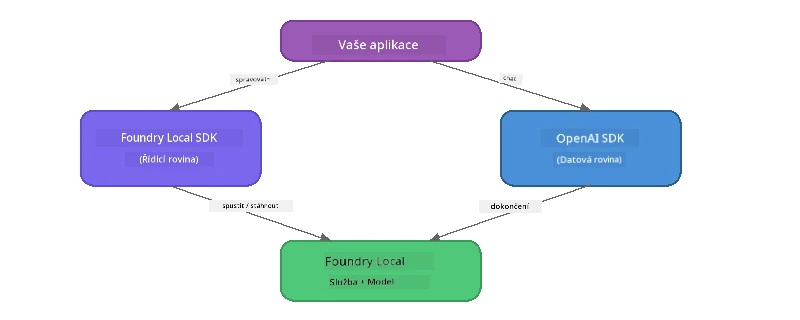

# Část 3: Použití Foundry Local SDK s OpenAI

## Přehled

V části 1 jste používali Foundry Local CLI k interaktivnímu spouštění modelů. V části 2 jste prozkoumali kompletní rozhraní SDK API. Nyní se naučíte **integrovat Foundry Local do svých aplikací** pomocí SDK a OpenAI-kompatibilního API.

Foundry Local poskytuje SDK pro tři jazyky. Vyberte si ten, se kterým vám to nejvíce vyhovuje – koncepty jsou ve všech třech shodné.

## Cíle učení

Na konci tohoto cvičení budete schopni:

- Nainstalovat Foundry Local SDK pro váš jazyk (Python, JavaScript nebo C#)
- Inicializovat `FoundryLocalManager` pro spuštění služby, kontrolu cache, stažení a načtení modelu
- Připojit se k lokálnímu modelu pomocí OpenAI SDK
- Posílat dokončení chatu a zpracovávat streamované odpovědi
- Pochopit architekturu dynamických portů

---

## Požadavky

Nejdříve dokončete [Část 1: Začínáme s Foundry Local](part1-getting-started.md) a [Část 2: Hluboký ponor do Foundry Local SDK](part2-foundry-local-sdk.md).

Nainstalujte **jeden** z následujících jazykových runtime:
- **Python 3.9+** - [python.org/downloads](https://www.python.org/downloads/)
- **Node.js 18+** - [nodejs.org](https://nodejs.org/)
- **.NET 9.0+** - [dot.net/download](https://dotnet.microsoft.com/download)

---

## Koncept: Jak SDK funguje

Foundry Local SDK spravuje **řídicí rovinu** (spouštění služby, stahování modelů), zatímco OpenAI SDK zpracovává **datovou rovinu** (posílání promptů, přijímání dokončení).



---

## Cvičení v laboratoři

### Cvičení 1: Nastavte své prostředí

<details>
<summary><b>🐍 Python</b></summary>

```bash
cd python
python -m venv venv

# Aktivujte virtuální prostředí:
# Windows (PowerShell):
venv\Scripts\Activate.ps1
# Windows (Příkazový řádek):
venv\Scripts\activate.bat
# macOS:
source venv/bin/activate

pip install -r requirements.txt
```

Soubor `requirements.txt` instaluje:
- `foundry-local-sdk` - Foundry Local SDK (importováno jako `foundry_local`)
- `openai` - OpenAI Python SDK
- `agent-framework` - Microsoft Agent Framework (používá se v pozdějších částech)

</details>

<details>
<summary><b>📘 JavaScript</b></summary>

```bash
cd javascript
npm install
```

Soubor `package.json` instaluje:
- `foundry-local-sdk` - Foundry Local SDK
- `openai` - OpenAI Node.js SDK

</details>

<details>
<summary><b>💜 C#</b></summary>

```bash
cd csharp
dotnet restore
dotnet build
```

Soubor `csharp.csproj` používá:
- `Microsoft.AI.Foundry.Local` - Foundry Local SDK (NuGet)
- `OpenAI` - OpenAI C# SDK (NuGet)

> **Struktura projektu:** C# projekt používá směrovač příkazové řádky v `Program.cs`, který přeposílá do samostatných souborů s příklady. Pro tuto část spusťte `dotnet run chat` (nebo jen `dotnet run`). Jiné části používají `dotnet run rag`, `dotnet run agent` a `dotnet run multi`.

</details>

---

### Cvičení 2: Základní dokončení chatu

Otevřete základní příklad chatu pro váš jazyk a prostudujte si kód. Každý skript následuje stejný tříkrokový vzor:

1. **Spuštění služby** – `FoundryLocalManager` spustí runtime Foundry Local
2. **Stažení a načtení modelu** – zkontrolovat cache, případně stáhnout a pak načíst do paměti
3. **Vytvoření OpenAI klienta** – připojit se k lokálnímu endpointu a poslat streamované dokončení chatu

<details>
<summary><b>🐍 Python - <code>python/foundry-local.py</code></b></summary>

```python
import sys
import openai
from foundry_local import FoundryLocalManager

alias = "phi-3.5-mini"

# Krok 1: Vytvořte FoundryLocalManager a spusťte službu
print("Starting Foundry Local service...")
manager = FoundryLocalManager()
manager.start_service()

# Krok 2: Zkontrolujte, zda je model již stažen
cached = manager.list_cached_models()
catalog_info = manager.get_model_info(alias)
is_cached = any(m.id == catalog_info.id for m in cached) if catalog_info else False

if is_cached:
    print(f"Model already downloaded: {alias}")
else:
    print(f"Downloading model: {alias} (this may take several minutes)...")
    manager.download_model(alias)
    print(f"Download complete: {alias}")

# Krok 3: Načtěte model do paměti
print(f"Loading model: {alias}...")
manager.load_model(alias)

# Vytvořte klienta OpenAI směřující na lokální službu Foundry
client = openai.OpenAI(
    base_url=manager.endpoint,   # Dynamický port - nikdy nepoužívejte pevně zakódované hodnoty!
    api_key=manager.api_key
)

# Vygenerujte dokončení chatu s průběžným přenosem dat
stream = client.chat.completions.create(
    model=manager.get_model_info(alias).id,
    messages=[{"role": "user", "content": "What is the golden ratio?"}],
    stream=True,
)

for chunk in stream:
    if chunk.choices[0].delta.content is not None:
        print(chunk.choices[0].delta.content, end="", flush=True)
print()
```

**Spuštění:**
```bash
python foundry-local.py
```

</details>

<details>
<summary><b>📘 JavaScript - <code>javascript/foundry-local.mjs</code></b></summary>

```javascript
import { OpenAI } from "openai";
import { FoundryLocalManager } from "foundry-local-sdk";

const alias = "phi-3.5-mini";

// Krok 1: Spusťte službu Foundry Local
console.log("Starting Foundry Local service...");
FoundryLocalManager.create({ appName: "FoundryLocalWorkshop" });
const manager = FoundryLocalManager.instance;
await manager.startWebService();

// Krok 2: Zkontrolujte, zda je model již stažen
const catalog = manager.catalog;
const model = await catalog.getModel(alias);

if (model.isCached) {
  console.log(`Model already downloaded: ${alias}`);
} else {
  console.log(`Downloading model: ${alias} (this may take several minutes)...`);
  await model.download();
  console.log(`Download complete: ${alias}`);
}

// Krok 3: Načtěte model do paměti
console.log(`Loading model: ${alias}...`);
await model.load();
console.log(`Model loaded: ${model.id}`);

// Vytvořte OpenAI klienta směřujícího na místní službu Foundry
const client = new OpenAI({
  baseURL: manager.urls[0] + "/v1",   // Dynamický port – nikdy nezadávejte napevno!
  apiKey: "foundry-local",
});

// Vygenerujte proudovou konverzační odpověď
const stream = await client.chat.completions.create({
  model: model.id,
  messages: [{ role: "user", content: "What is the golden ratio?" }],
  stream: true,
});

for await (const chunk of stream) {
  if (chunk.choices[0]?.delta?.content) {
    process.stdout.write(chunk.choices[0].delta.content);
  }
}
console.log();
```

**Spuštění:**
```bash
node foundry-local.mjs
```

</details>

<details>
<summary><b>💜 C# - <code>csharp/BasicChat.cs</code></b></summary>

```csharp
using Microsoft.AI.Foundry.Local;
using Microsoft.Extensions.Logging.Abstractions;
using OpenAI;
using OpenAI.Chat;
using System.ClientModel;

var alias = "phi-3.5-mini";

// Step 1: Start the Foundry Local service
Console.WriteLine("Starting Foundry Local service...");
await FoundryLocalManager.CreateAsync(
    new Configuration
    {
        AppName = "FoundryLocalSamples",
        Web = new Configuration.WebService { Urls = "http://127.0.0.1:0" }
    }, NullLogger.Instance, default);
var manager = FoundryLocalManager.Instance;
await manager.StartWebServiceAsync(default);

// Step 2: Get the model from the catalog
var catalog = await manager.GetCatalogAsync(default);
var model = await catalog.GetModelAsync(alias, default);

// Step 3: Check if the model is already downloaded
var isCached = await model.IsCachedAsync(default);

if (isCached)
{
    Console.WriteLine($"Model already downloaded: {alias}");
}
else
{
    Console.WriteLine($"Downloading model: {alias} (this may take several minutes)...");
    await model.DownloadAsync(null, default);
    Console.WriteLine($"Download complete: {alias}");
}

// Step 4: Load the model into memory
Console.WriteLine($"Loading model: {alias}...");
await model.LoadAsync(default);
Console.WriteLine($"Loaded model: {model.Id}");
Console.WriteLine($"Endpoint: {manager.Urls[0]}");

// Create OpenAI client pointing to the LOCAL Foundry service
var key = new ApiKeyCredential("foundry-local");
var client = new OpenAIClient(key, new OpenAIClientOptions
{
    Endpoint = new Uri(manager.Urls[0] + "/v1")  // Dynamic port - never hardcode!
});

var chatClient = client.GetChatClient(model.Id);

// Stream a chat completion
var completionUpdates = chatClient.CompleteChatStreaming("What is the golden ratio?");

foreach (var update in completionUpdates)
{
    if (update.ContentUpdate.Count > 0)
    {
        Console.Write(update.ContentUpdate[0].Text);
    }
}
Console.WriteLine();
```

**Spuštění:**
```bash
dotnet run chat
```

</details>

---

### Cvičení 3: Experimentujte s promptami

Jakmile váš základní příklad poběží, zkuste změnit kód:

1. **Změňte uživatelskou zprávu** – vyzkoušejte různé otázky
2. **Přidejte systémový prompt** – dejte modelu osobnost
3. **Vypněte streamování** – nastavte `stream=False` a vytiskněte celý výsledek najednou
4. **Vyzkoušejte jiný model** – změňte alias z `phi-3.5-mini` na jiný model ze seznamu `foundry model list`

<details>
<summary><b>🐍 Python</b></summary>

```python
# Přidejte systémový výzvu - dejte modelu osobnost:
stream = client.chat.completions.create(
    model=manager.get_model_info(alias).id,
    messages=[
        {"role": "system", "content": "You are a pirate. Answer everything in pirate speak."},
        {"role": "user", "content": "What is the golden ratio?"}
    ],
    stream=True,
)

# Nebo vypněte streamování:
response = client.chat.completions.create(
    model=manager.get_model_info(alias).id,
    messages=[{"role": "user", "content": "What is the golden ratio?"}],
    stream=False,
)
print(response.choices[0].message.content)
```

</details>

<details>
<summary><b>📘 JavaScript</b></summary>

```javascript
// Přidejte systémový prompt - dejte modelu osobnost:
const stream = await client.chat.completions.create({
  model: modelInfo.id,
  messages: [
    { role: "system", content: "You are a pirate. Answer everything in pirate speak." },
    { role: "user", content: "What is the golden ratio?" },
  ],
  stream: true,
});

// Nebo vypněte streamování:
const response = await client.chat.completions.create({
  model: modelInfo.id,
  messages: [{ role: "user", content: "What is the golden ratio?" }],
  stream: false,
});
console.log(response.choices[0].message.content);
```

</details>

<details>
<summary><b>💜 C#</b></summary>

```csharp
// Add a system prompt - give the model a persona:
var completionUpdates = chatClient.CompleteChatStreaming(
    new ChatMessage[]
    {
        new SystemChatMessage("You are a pirate. Answer everything in pirate speak."),
        new UserChatMessage("What is the golden ratio?")
    }
);

// Or turn off streaming:
var response = chatClient.CompleteChat("What is the golden ratio?");
Console.WriteLine(response.Value.Content[0].Text);
```

</details>

---

### Reference metod SDK

<details>
<summary><b>🐍 Python SDK metody</b></summary>

| Metoda | Účel |
|--------|------|
| `FoundryLocalManager()` | Vytvoří instanci správce |
| `manager.start_service()` | Spustí službu Foundry Local |
| `manager.list_cached_models()` | Vyjmenuje modely uložené v zařízení |
| `manager.get_model_info(alias)` | Získá ID modelu a metadata |
| `manager.download_model(alias, progress_callback=fn)` | Stáhne model s volitelným callbackem pro průběh |
| `manager.load_model(alias)` | Načte model do paměti |
| `manager.endpoint` | Získá dynamickou URL endpointu |
| `manager.api_key` | Získá API klíč (placeholder pro lokální provoz) |

</details>

<details>
<summary><b>📘 JavaScript SDK metody</b></summary>

| Metoda | Účel |
|--------|------|
| `FoundryLocalManager.create({ appName })` | Vytvoří instanci správce |
| `FoundryLocalManager.instance` | Přístup k singleton správci |
| `await manager.startWebService()` | Spustí službu Foundry Local |
| `await manager.catalog.getModel(alias)` | Získá model z katalogu |
| `model.isCached` | Zjistí, zda je model již stažený |
| `await model.download()` | Stáhne model |
| `await model.load()` | Načte model do paměti |
| `model.id` | Získá ID modelu pro volání OpenAI API |
| `manager.urls[0] + "/v1"` | Získá dynamickou URL endpointu |
| `"foundry-local"` | API klíč (placeholder pro lokální) |

</details>

<details>
<summary><b>💜 C# SDK metody</b></summary>

| Metoda | Účel |
|--------|------|
| `FoundryLocalManager.CreateAsync(config)` | Vytvoří a inicializuje správce |
| `manager.StartWebServiceAsync()` | Spustí webovou službu Foundry Local |
| `manager.GetCatalogAsync()` | Získá katalog modelů |
| `catalog.ListModelsAsync()` | Vypíše všechny dostupné modely |
| `catalog.GetModelAsync(alias)` | Získá konkrétní model podle aliasu |
| `model.IsCachedAsync()` | Zjistí, zda je model stažený |
| `model.DownloadAsync()` | Stáhne model |
| `model.LoadAsync()` | Načte model do paměti |
| `manager.Urls[0]` | Získá dynamickou URL endpointu |
| `new ApiKeyCredential("foundry-local")` | API klíč pro lokální provoz |

</details>

---

### Cvičení 4: Použití nativního ChatClienta (alternativa k OpenAI SDK)

V cvičeních 2 a 3 jste použili OpenAI SDK pro dokončení chatu. JavaScript a C# SDK také poskytují **nativní ChatClient**, který úplně eliminuje potřebu OpenAI SDK.

<details>
<summary><b>📘 JavaScript - <code>model.createChatClient()</code></b></summary>

```javascript
import { FoundryLocalManager } from "foundry-local-sdk";

const alias = "phi-3.5-mini";

FoundryLocalManager.create({ appName: "ChatClientDemo" });
const manager = FoundryLocalManager.instance;
await manager.startWebService();

const model = await manager.catalog.getModel(alias);
if (!model.isCached) await model.download();
await model.load();

// Není potřeba import OpenAI — získejte klienta přímo z modelu
const chatClient = model.createChatClient();

// Dokončení bez streamování
const response = await chatClient.completeChat([
  { role: "system", content: "You are a pirate. Answer everything in pirate speak." },
  { role: "user", content: "What is the golden ratio?" }
]);
console.log(response.choices[0].message.content);

// Dokončení se streamováním (používá zpětné volání)
await chatClient.completeStreamingChat(
  [{ role: "user", content: "What is the golden ratio?" }],
  (chunk) => {
    if (chunk.choices?.[0]?.delta?.content) {
      process.stdout.write(chunk.choices[0].delta.content);
    }
  }
);
console.log();
```

> **Poznámka:** Metoda `completeStreamingChat()` v ChatClientu používá **callback** vzor, nikoliv async iterátor. Předáte funkci jako druhý argument.

</details>

<details>
<summary><b>💜 C# - <code>model.GetChatClientAsync()</code></b></summary>

```csharp
var catalog = await manager.GetCatalogAsync(default);
var model = await catalog.GetModelAsync("phi-3.5-mini", default);
if (!await model.IsCachedAsync(default))
    await model.DownloadAsync(null, default);
await model.LoadAsync(default);

// No OpenAI NuGet needed — get a client directly from the model
var chatClient = await model.GetChatClientAsync(default);

// Use it like a standard OpenAI ChatClient
var response = chatClient.CompleteChat("What is the golden ratio?");
Console.WriteLine(response.Value.Content[0].Text);
```

</details>

> **Kdy použít který přístup:**
> | Přístup | Nejvhodnější pro |
> |---------|-----------------|
> | OpenAI SDK | Plná kontrola parametrů, produkční aplikace, existující kód OpenAI |
> | Nativní ChatClient | Rychlé prototypování, méně závislostí, jednodušší nastavení |

---

## Hlavní poznatky

| Koncept | Co jste se naučili |
|---------|--------------------|
| Řídicí rovina | Foundry Local SDK zajišťuje spuštění služby a načtení modelů |
| Datová rovina | OpenAI SDK zpracovává dokončení chatu a streamování |
| Dynamické porty | Vždy používejte SDK k získání endpointu; nikdy nehardcodeujte URL |
| Napříč jazyky | Stejný vzor kódu funguje v Pythonu, JavaScriptu i C# |
| Kompatibilita OpenAI | Plná kompatibilita s OpenAI API znamená, že stávající kód funguje s minimálními změnami |
| Nativní ChatClient | `createChatClient()` (JS) / `GetChatClientAsync()` (C#) je alternativa k OpenAI SDK |

---

## Další kroky

Pokračujte v [Část 4: Vytváření RAG aplikace](part4-rag-fundamentals.md) a naučte se, jak postavit pipeline Retrieval-Augmented Generation, která běží kompletně na vašem zařízení.