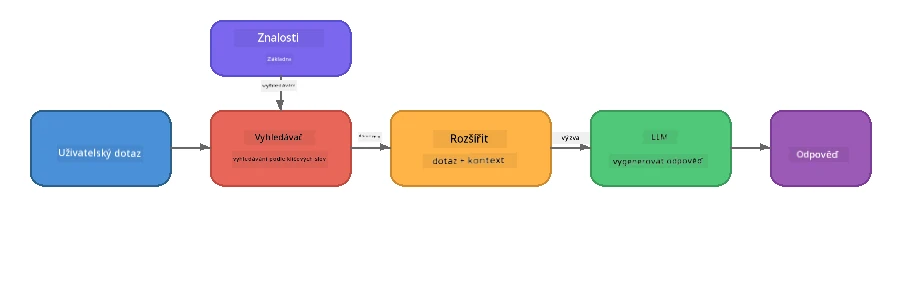

# Část 4: Vytváření RAG aplikace pomocí Foundry Local

## Přehled

Velké jazykové modely jsou výkonné, ale znají pouze to, co bylo v jejich tréninkových datech. **Retrieval-Augmented Generation (RAG)** to řeší tím, že modelu poskytne relevantní kontext v době dotazu - čerpající z vašich vlastních dokumentů, databází nebo znalostních bází.

V tomto labu vytvoříte kompletní RAG pipeline, která běží **zcela na vašem zařízení** pomocí Foundry Local. Žádné cloudové služby, žádné vektorové databáze, žádné embeddings API - jen lokální vyhledávání a lokální model.

## Výukové cíle

Na konci tohoto labu budete schopni:

- Vysvětlit, co je RAG a proč je důležité pro AI aplikace
- Vytvořit lokální znalostní bázi z textových dokumentů
- Implementovat jednoduchou retrieval funkci pro nalezení relevantního kontextu
- Sestavit systémový prompt, který ukotví model na získaných faktech
- Spustit kompletní pipeline Retrieve → Augment → Generate na zařízení
- Porozumět kompromisům mezi jednoduchým vyhledáváním klíčových slov a vektorovým vyhledáváním

---

## Předpoklady

- Dokončit [Část 3: Používání Foundry Local SDK s OpenAI](part3-sdk-and-apis.md)
- Mít nainstalovaný Foundry Local CLI a stažený model `phi-3.5-mini`

---

## Koncept: Co je RAG?

Bez RAG může LLM odpovídat jen z tréninkových dat - která mohou být zastaralá, neúplná nebo postrádat vaše soukromé informace:

```
User: "What is Zava's return policy?"
LLM:  "I do not have information about Zava's return policy."  ← No context!
```

S RAG nejdříve **vyhledáte** relevantní dokumenty, pak **obohatíte** prompt tímto kontextem a teprve potom **generujete** odpověď:



Klíčový poznatek: **model nemusí znát odpověď; musí jen přečíst správné dokumenty.**

---

## Lab cvičení

### Cvičení 1: Porozumění Znalostní bází

Otevřete RAG příklad pro váš jazyk a prohlédněte si znalostní bázi:

<details>
<summary><b>🐍 Python: <code>python/foundry-local-rag.py</code></b></summary>

Znalostní báze je jednoduchý seznam slovníků s poli `title` a `content`:

```python
KNOWLEDGE_BASE = [
    {
        "title": "Foundry Local Overview",
        "content": (
            "Foundry Local brings the power of Azure AI Foundry to your local "
            "device without requiring an Azure subscription..."
        ),
    },
    {
        "title": "Supported Hardware",
        "content": (
            "Foundry Local automatically selects the best model variant for "
            "your hardware. If you have an Nvidia CUDA GPU it downloads the "
            "CUDA-optimized model..."
        ),
    },
    # ... více položek
]
```

Každá položka reprezentuje "kousek" znalostí – zaměřenou informaci na jedno téma.

</details>

<details>
<summary><b>📘 JavaScript: <code>javascript/foundry-local-rag.mjs</code></b></summary>

Znalostní báze používá stejnou strukturu jako pole objektů:

```javascript
const KNOWLEDGE_BASE = [
  {
    title: "Foundry Local Overview",
    content:
      "Foundry Local brings the power of Azure AI Foundry to your local " +
      "device without requiring an Azure subscription...",
  },
  {
    title: "Supported Hardware",
    content:
      "Foundry Local automatically selects the best model variant for " +
      "your hardware...",
  },
  // ... více záznamů
];
```

</details>

<details>
<summary><b>💜 C#: <code>csharp/RagPipeline.cs</code></b></summary>

Znalostní báze používá seznam pojmenovaných n-tic:

```csharp
private static readonly List<(string Title, string Content)> KnowledgeBase =
[
    ("Foundry Local Overview",
     "Foundry Local brings the power of Azure AI Foundry to your local " +
     "device without requiring an Azure subscription..."),

    ("Supported Hardware",
     "Foundry Local automatically selects the best model variant for " +
     "your hardware..."),

    // ... more entries
];
```

</details>

> **V reálné aplikaci** by znalostní báze pocházela ze souborů na disku, databáze, vyhledávacího indexu nebo API. Pro tento lab používáme v paměti uložený seznam pro jednoduchost.

---

### Cvičení 2: Porozumění Retrieval funkci

Retrieval krok najde nejrelevantnější kousky pro otázku uživatele. Tento příklad používá **překryv klíčových slov** – počítá, kolik slov z dotazu se vyskytuje v každém kousku:

<details>
<summary><b>🐍 Python</b></summary>

```python
def retrieve(query: str, top_k: int = 2) -> list[dict]:
    """Return the top-k knowledge chunks most relevant to the query."""
    query_words = set(query.lower().split())
    scored = []
    for chunk in KNOWLEDGE_BASE:
        chunk_words = set(chunk["content"].lower().split())
        overlap = len(query_words & chunk_words)
        scored.append((overlap, chunk))
    scored.sort(key=lambda x: x[0], reverse=True)
    return [item[1] for item in scored[:top_k]]
```

</details>

<details>
<summary><b>📘 JavaScript</b></summary>

```javascript
function retrieve(query, topK = 2) {
  const queryWords = new Set(query.toLowerCase().split(/\s+/));
  const scored = KNOWLEDGE_BASE.map((chunk) => {
    const chunkWords = new Set(chunk.content.toLowerCase().split(/\s+/));
    let overlap = 0;
    for (const w of queryWords) {
      if (chunkWords.has(w)) overlap++;
    }
    return { overlap, chunk };
  });
  scored.sort((a, b) => b.overlap - a.overlap);
  return scored.slice(0, topK).map((s) => s.chunk);
}
```

</details>

<details>
<summary><b>💜 C#</b></summary>

```csharp
private static List<(string Title, string Content)> Retrieve(string query, int topK = 2)
{
    var queryWords = new HashSet<string>(
        query.ToLowerInvariant().Split(' ', StringSplitOptions.RemoveEmptyEntries));

    return KnowledgeBase
        .Select(chunk =>
        {
            var chunkWords = new HashSet<string>(
                chunk.Content.ToLowerInvariant().Split(' ', StringSplitOptions.RemoveEmptyEntries));
            var overlap = queryWords.Intersect(chunkWords).Count();
            return (Overlap: overlap, Chunk: chunk);
        })
        .OrderByDescending(x => x.Overlap)
        .Take(topK)
        .Select(x => x.Chunk)
        .ToList();
}
```

</details>

**Jak to funguje:**
1. Rozdělí dotaz na jednotlivá slova
2. Pro každý znalostní kousek spočítá, kolik slov z dotazu se v něm objeví
3. Seřadí podle skóre překryvu (nejvyšší nahoře)
4. Vrátí top-k nejrelevantnějších kousků

> **Kompromis:** Překryv klíčových slov je jednoduchý, ale omezený; nerozumí synonymům ani významu. Produkční RAG systémy obvykle používají **embedding vektory** a **vektorovou databázi** pro sémantické vyhledávání. Překryv klíčových slov je však skvělý začátek a nevyžaduje další závislosti.

---

### Cvičení 3: Porozumění Obohacenému promptu

Získaný kontext je vložen do **systémového promptu** před odesláním do modelu:

```python
system_prompt = (
    "You are a helpful assistant. Answer the user's question using ONLY "
    "the information provided in the context below. If the context does "
    "not contain enough information, say so.\n\n"
    f"Context:\n{context_text}"
)
```

Klíčová rozhodnutí designu:
- **„POUZE informace poskytnuté“** – zabraňuje, aby model halucinoval fakta mimo kontext
- **„Pokud kontext neobsahuje dostatek informací, přiznej to“** – podporuje upřímné odpovědi „nevím“
- Kontext je umístěn do systémové zprávy, aby ovlivnil všechny odpovědi

---

### Cvičení 4: Spuštění RAG Pipeline

Spusťte kompletní příklad:

**Python:**
```bash
cd python
python foundry-local-rag.py
```

**JavaScript:**
```bash
cd javascript
node foundry-local-rag.mjs
```

**C#:**
```bash
cd csharp
dotnet run rag
```

Měli byste vidět tři věci vytištěné:
1. **Otázku**, na kterou se ptáte
2. **Získaný kontext** – kousky vybrané ze znalostní báze
3. **Odpověď** – generovanou modelem pouze s tímto kontextem

Příklad výstupu:
```
Question: How do I install Foundry Local and what hardware does it support?

--- Retrieved Context ---
### Installation
On Windows install Foundry Local with: winget install Microsoft.FoundryLocal...

### Supported Hardware
Foundry Local automatically selects the best model variant for your hardware...
-------------------------

Answer: To install Foundry Local, you can use the following methods depending
on your operating system: On Windows, run `winget install Microsoft.FoundryLocal`.
On macOS, use `brew install microsoft/foundrylocal/foundrylocal`...
```

Všimněte si, že odpověď modelu je **zakotvena** v získaném kontextu – uvádí jen fakta z dokumentů znalostní báze.

---

### Cvičení 5: Experimentujte a Rozšiřte

Vyzkoušejte tyto úpravy pro hlubší pochopení:

1. **Změňte otázku** – zeptejte se na něco, co JE ve znalostní bázi vs. něco, co NENÍ:
   ```python
   question = "What programming languages does Foundry Local support?"  # ← V kontextu
   question = "How much does Foundry Local cost?"                       # ← Není v kontextu
   ```
   Model správně řekne „Nevím“, když odpověď není v kontextu?

2. **Přidejte nový znalostní kousek** – připojte novou položku do `KNOWLEDGE_BASE`:
   ```python
   {
       "title": "Pricing",
       "content": "Foundry Local is completely free and open source under the MIT license.",
   }
   ```
   Pak znovu položte otázku na cenu.

3. **Změňte `top_k`** – načtěte více nebo méně kousků:
   ```python
   context_chunks = retrieve(question, top_k=3)  # Více kontextu
   context_chunks = retrieve(question, top_k=1)  # Méně kontextu
   ```
   Jak množství kontextu ovlivňuje kvalitu odpovědi?

4. **Odstraňte instrukci zakotvení** – změňte systémový prompt na „Jsi užitečný asistent.“ a sledujte, zda model nezačne halucinovat fakta.

---

## Hloubkový pohled: Optimalizace RAG pro výkon na zařízení

Běh RAG na zařízení přináší omezení, se kterými se v cloudu nesetkáte: omezená RAM, žádné dedikované GPU (CPU/NPU provoz), malá kontextová kapacita modelu. Níže uvedená rozhodnutí přímo řeší tato omezení a vycházejí ze vzorů produkčních lokálních RAG aplikací postavených s Foundry Local.

### Strategie chunkování: Pevná velikost s překryvem

Chunkování – jak rozdělujete dokumenty na části – je jedno z nejvlivnějších rozhodnutí v RAG systému. Pro scénáře na zařízení je doporučený výchozí postup **pevně dané velikosti okna s překryvem**:

| Parametr | Doporučená hodnota | Proč |
|-----------|------------------|-----|
| **Velikost chunku** | ~200 tokenů | Udržuje kontext kompaktní, ponechává prostor v kontextovém okně Phi-3.5 Mini pro systémový prompt, historii konverzace a generovaný výstup |
| **Překryv** | ~25 tokenů (12,5 %) | Zabráňuje ztrátě informací na hranicích chunků – důležité pro postupy a krok za krokem instrukce |
| **Tokenizace** | Rozdělení podle mezer | Žádné závislosti, není potřeba tokenizer knihovna. Veškerý výpočetní rozpočet zůstává u LLM |

Překryv funguje jako posuvné okno: každý nový chunk začíná 25 tokenů před koncem předchozího, takže věty přesahující hranice chunku jsou v obou částech.

> **Proč ne jiné strategie?**
> - **Rozdělení podle vět** dává nepředvídatelné velikosti chunků; některé bezpečnostní postupy jsou dlouhé věty, které by se špatně dělily
> - **Rozdělování podle sekcí** (podle nadpisů `##`) vytváří velmi různorodé velikosti chunků – některé moc malé, jiné příliš velké pro kontextové okno modelu
> - **Sémantické chunkování** (detekce témat pomocí embeddingů) přináší nejlepší kvalitu retrievalu, ale vyžaduje vedle Phi-3.5 Mini další model v paměti – rizikové na hardwaru s 8-16 GB sdílené paměti

### Vylepšení retrievalu: TF-IDF vektory

Přístup překryvu klíčových slov v tomto labu funguje, ale pokud chcete lepší retrieval bez dalšího embedding modelu, **TF-IDF (Term Frequency-Inverse Document Frequency)** je vynikající kompromis:

```
Keyword Overlap  →  TF-IDF Vectors  →  Embedding Models
    (this lab)     (lightweight upgrade)   (production)
  Simple & fast    Better ranking,         Best quality,
  No dependencies  still no ML model       requires embedding model
  ~Basic matching  ~1ms retrieval          ~100-500ms per query
```

TF-IDF převede každý chunk na číselný vektor, který udává důležitost každého slova v chunku *v porovnání se všemi chunky*. Při dotazu je otázka vektorizována stejně a porovnávána pomocí kosinové similarity. Toto lze implementovat s SQLite a čistým JavaScriptem/Pythonem – žádná vektorová databáze, žádné embedding API.

> **Výkon:** Kosinová similarity TF-IDF nad chunky pevné velikosti běžně dosahuje **~1ms retrievalu** oproti ~100-500ms u embedding modelu kódujícího každý dotaz. Všechny 20+ dokumenty lze chunkovat a indexovat za méně než sekundu.

### Edge/Compact režim pro omezená zařízení

Při běhu na velmi omezeném hardwaru (starší notebooky, tablety, zařízení v terénu) můžete snížit nároky úpravou tří nastavení:

| Nastavení | Standardní režim | Edge/Compact režim |
|---------|--------------|-------------------|
| **Systémový prompt** | ~300 tokenů | ~80 tokenů |
| **Maximální výstupní tokeny** | 1024 | 512 |
| **Načtené chunků (top-k)** | 5 | 3 |

Méně načtených chunků znamená méně kontextu pro model zpracovat, což snižuje latenci a paměťové nároky. Kratší systémový prompt uvolní více místa v kontextovém okně pro samotnou odpověď. Tento kompromis se vyplatí na zařízeních, kde každý token v kontextovém okně má význam.

### Jeden model v paměti

Jedno z nejdůležitějších pravidel pro on-device RAG: **mít načtený pouze jeden model**. Pokud používáte embedding model pro retrieval *a* jazykový model pro generování, sdílíte omezené NPU/RAM zdroje mezi dva modely. Lehký retrieval (klíčová slova, TF-IDF) toto úplně eliminuje:

- Žádný embedding model, který by soupeřil o paměť s LLM
- Rychlejší cold start - jen jeden model ke načtení
- Předvídatelná paměťová spotřeba - LLM dostane veškeré dostupné zdroje
- Funguje na strojích s pouhými 8 GB RAM

### SQLite jako lokální vektorové úložiště

Pro malé až střední kolekce dokumentů (stovky až nízké tisíce chunků) je **SQLite dostatečně rychlý** pro bruteforce kosinovou similarity a žádná infrastruktura není potřeba:

- Jediný `.db` soubor na disku – žádný serverový proces, žádná konfigurace
- Součástí každého významného runtime (Python `sqlite3`, Node.js `better-sqlite3`, .NET `Microsoft.Data.Sqlite`)
- Ukládá chunky dokumentů spolu s jejich TF-IDF vektory v jedné tabulce
- Není potřeba Pinecone, Qdrant, Chroma nebo FAISS v tomto rozsahu

### Shrnutí výkonu

Tato návrhová rozhodnutí dohromady zajišťují responzivní RAG na spotřebitelském hardwaru:

| Metrika | Výkon na zařízení |
|--------|----------------------|
| **Retrieval latence** | ~1ms (TF-IDF) až ~5ms (překryv klíčových slov) |
| **Rychlost ingestace** | 20 dokumentů chunkováno a indexováno pod 1 sekundu |
| **Počet modelů v paměti** | 1 (pouze LLM - bez embedding modelu) |
| **Úložný prostor** | < 1 MB pro chunk + vektory v SQLite |
| **Cold start** | Načtení jednoho modelu, žádné startování embedding runtime |
| **Minimální hardware** | 8 GB RAM, CPU-only (GPU není potřeba) |

> **Kdy upgradovat:** Pokud rozšiřujete na stovky dlouhých dokumentů, smíšené typy obsahu (tabulky, kód, text), nebo potřebujete sémantické porozumění dotazů, zvažte přidání embedding modelu a přechod na vektorové vyhledávání. Pro většinu on-device případů s zaměřenými dokumenty TF-IDF + SQLite nabízí vynikající výsledky s minimálními nároky.

---

## Klíčové koncepty

| Koncept | Popis |
|---------|-------------|
| **Retrieval** | Nalezení relevantních dokumentů ze znalostní báze na základě dotazu uživatele |
| **Augmentation** | Vložení získaných dokumentů do promptu jako kontext |
| **Generování** | LLM vytvoří odpověď zakotvenou ve poskytnutém kontextu |
| **Chunkování** | Rozdělení velkých dokumentů na menší, zaměřené části |
| **Zakotvení** | Omezení modelu, aby používal pouze poskytnutý kontext (snižuje halucinace) |
| **Top-k** | Počet nejrelevantnějších chunků, které se načtou |

---

## RAG v produkci vs. tento lab

| Aspekt | Tento lab | Optimalizace na zařízení | Produkce v cloudu |
|--------|----------|--------------------|-----------------|
| **Znalostní báze** | V paměti | Soubory na disku, SQLite | Databáze, vyhledávací index |
| **Retrieval** | Překryv klíčových slov | TF-IDF + kosinová similarity | Vektorové embeddingy + similarity search |
| **Embeddings** | Nepotřebné | Nepotřebné - TF-IDF vektory | Embedding model (lokální nebo cloud) |
| **Vektorové úložiště** | Nepotřebné | SQLite (jeden `.db` soubor) | FAISS, Chroma, Azure AI Search atd. |
| **Chunkování** | Manuální | Posuvné okno pevné velikosti (~200 tokenů, 25 tokenový překryv) | Sémantické nebo rekurzivní chunkování |
| **Modely v paměti** | 1 (LLM) | 1 (LLM) | 2+ (embedding + LLM) |
| **Latence vyhledávání** | ~5ms | ~1ms | ~100-500ms |
| **Měřítko** | 5 dokumentů | Stovky dokumentů | Miliony dokumentů |

Vzor, který se zde naučíte (vyhledávat, doplňovat, generovat), je stejný v jakémkoli měřítku. Metoda vyhledávání se zlepšuje, ale celková architektura zůstává identická. Prostřední sloupec ukazuje, co je dosažitelné přímo na zařízení s lehkými technikami, často ideální řešení pro lokální aplikace, kde vyměníte cloudové měřítko za soukromí, schopnost pracovat offline a nulovou latenci vůči externím službám.

---

## Klíčové poznatky

| Koncept | Co jste se naučili |
|---------|--------------------|
| Vzor RAG | Vyhledávat + Doplňovat + Generovat: poskytněte modelu správný kontext a může odpovídat na otázky týkající se vašich dat |
| Na zařízení | Všechno běží lokálně bez cloudových API nebo předplatného vektorové databáze |
| Instrukce pro zakotvení | Omezení systémových promptů jsou zásadní pro prevenci halucinací |
| Překrytí klíčových slov | Jednoduchý, ale efektivní výchozí bod pro vyhledávání |
| TF-IDF + SQLite | Lehká cesta upgradu, která udržuje vyhledávání pod 1 ms bez použití modelu vektorových reprezentací |
| Jeden model v paměti | Vyhněte se načítání modelu vektorových reprezentací vedle LLM na omezeném hardwaru |
| Velikost bloku | Přibližně 200 tokenů s překrytím vyvažuje přesnost vyhledávání a efektivitu kontextového okna |
| Režim Edge/kompaktní | Používejte méně bloků a kratší prompt pro velmi omezená zařízení |
| Univerzální vzor | Stejná architektura RAG funguje pro jakýkoli zdroj dat: dokumenty, databáze, API nebo wiki |

> **Chcete vidět kompletní RAG aplikaci přímo na zařízení?** Podívejte se na [Gas Field Local RAG](https://github.com/leestott/local-rag), produkčně laděného offline RAG agenta vytvořeného pomocí Foundry Local a Phi-3.5 Mini, který demonstruje tyto optimalizační vzory na reálné sadě dokumentů.

---

## Další kroky

Pokračujte na [Část 5: Budování AI agentů](part5-single-agents.md), kde se naučíte, jak vytvářet inteligentní agenty s osobnostmi, instrukcemi a víceturnými konverzacemi pomocí Microsoft Agent Framework.