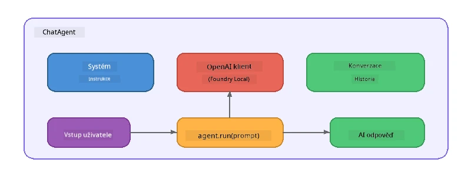

# Část 5: Vytváření AI agentů pomocí Agent Frameworku

> **Cíl:** Vytvořit svého prvního AI agenta s trvalými instrukcemi a definovanou personou, poháněného lokálním modelem přes Foundry Local.

## Co je AI agent?

AI agent obaluje jazykový model s **systémovými instrukcemi**, které definují jeho chování, osobnost a omezení. Na rozdíl od jednoho volání chat completions agent poskytuje:

- **Persona** - konzistentní identitu („Jste užitečný recenzent kódu“)
- **Paměť** - historii konverzace přes jednotlivá kola
- **Specializaci** - zaměřené chování řízené dobře zpracovanými instrukcemi



---

## Microsoft Agent Framework

**Microsoft Agent Framework** (AGF) poskytuje standardní abstrakci agenta, která funguje napříč různými backendy modelů. V tomto workshopu jej kombinujeme s Foundry Local, takže vše běží na vašem počítači – bez potřeby cloudu.

| Koncept | Popis |
|---------|-------------|
| `FoundryLocalClient` | Python: zajišťuje spuštění služby, stažení/nahrání modelu a vytváří agenty |
| `client.as_agent()` | Python: vytváří agenta z Foundry Local klienta |
| `AsAIAgent()` | C#: rozšiřující metoda na `ChatClient` - vytváří `AIAgent` |
| `instructions` | Systémový prompt, který formuje chování agenta |
| `name` | Čitelný název, užitečný v multi-agentních scénářích |
| `agent.run(prompt)` / `RunAsync()` | Posílá uživatelskou zprávu a vrací odpověď agenta |

> **Poznámka:** Agent Framework má SDK pro Python i .NET. Pro JavaScript implementujeme lehkou třídu `ChatAgent`, která zrcadlí stejný vzor přímo přes OpenAI SDK.

---

## Cvičení

### Cvičení 1 - Porozumění vzoru agenta

Před psaním kódu si prostudujte klíčové komponenty agenta:

1. **Klient modelu** - připojuje se k OpenAI-kompatibilnímu API Foundry Local
2. **Systémové instrukce** - prompt „osobnosti“
3. **Spouštěcí smyčka** - zasílání uživatelského vstupu, přijímání výstupu

> **Zamyslete se:** Jak se systémové instrukce liší od běžné uživatelské zprávy? Co se stane, když je změníte?

---

### Cvičení 2 - Spusťte příklad s jedním agentem

<details>
<summary><strong>🐍 Python</strong></summary>

**Požadavky:**
```bash
cd python
python -m venv venv

# Windows (PowerShell):
venv\Scripts\Activate.ps1
# macOS:
source venv/bin/activate

pip install -r requirements.txt
```

**Spuštění:**
```bash
python foundry-local-with-agf.py
```

**Procházení kódu** (`python/foundry-local-with-agf.py`):

```python
import asyncio
from agent_framework_foundry_local import FoundryLocalClient

async def main():
    alias = "phi-4-mini"

    # FoundryLocalClient zajišťuje spuštění služby, stahování modelu a načítání
    client = FoundryLocalClient(model_id=alias)
    print(f"Client Model ID: {client.model_id}")

    # Vytvořit agenta s instrukcemi systému
    agent = client.as_agent(
        name="Joker",
        instructions="You are good at telling jokes.",
    )

    # Neprůběžné: získat kompletní odpověď najednou
    result = await agent.run("Tell me a joke about a pirate.")
    print(f"Agent: {result}")

    # Průběžné: získávat výsledky, jak jsou generovány
    async for chunk in agent.run("Tell me another joke.", stream=True):
        if chunk.text:
            print(chunk.text, end="", flush=True)

asyncio.run(main())
```

**Klíčové body:**
- `FoundryLocalClient(model_id=alias)` zajišťuje spuštění služby, stažení i načtení modelu v jednom kroku
- `client.as_agent()` vytvoří agenta se systémovými instrukcemi a názvem
- `agent.run()` podporuje jak nesmířené, tak i streamovací režimy
- Instalace: `pip install agent-framework-foundry-local --pre`

</details>

<details>
<summary><strong>📦 JavaScript</strong></summary>

**Požadavky:**
```bash
cd javascript
npm install
```

**Spuštění:**
```bash
node foundry-local-with-agent.mjs
```

**Procházení kódu** (`javascript/foundry-local-with-agent.mjs`):

```javascript
import { OpenAI } from "openai";
import { FoundryLocalManager } from "foundry-local-sdk";

class ChatAgent {
  constructor({ client, modelId, instructions, name }) {
    this.client = client;
    this.modelId = modelId;
    this.instructions = instructions;
    this.name = name;
    this.history = [];
  }

  async run(userMessage) {
    const messages = [
      { role: "system", content: this.instructions },
      ...this.history,
      { role: "user", content: userMessage },
    ];
    const response = await this.client.chat.completions.create({
      model: this.modelId,
      messages,
    });
    const assistantMessage = response.choices[0].message.content;

    // Uchovávejte historii konverzace pro vícekolové interakce
    this.history.push({ role: "user", content: userMessage });
    this.history.push({ role: "assistant", content: assistantMessage });
    return { text: assistantMessage };
  }
}

async function main() {
  FoundryLocalManager.create({ appName: "FoundryLocalWorkshop" });
  const manager = FoundryLocalManager.instance;
  await manager.startWebService();

  const catalog = manager.catalog;
  const model = await catalog.getModel("phi-3.5-mini");
  if (!model.isCached) {
    console.log("Downloading model: phi-3.5-mini...");
    await model.download();
  }
  await model.load();

  const client = new OpenAI({
    baseURL: manager.urls[0] + "/v1",
    apiKey: "foundry-local",
  });

  const agent = new ChatAgent({
    client,
    modelId: model.id,
    instructions: "You are good at telling jokes.",
    name: "Joker",
  });

  const result = await agent.run("Tell me a joke about a pirate.");
  console.log(result.text);
}

main();
```

**Klíčové body:**
- JavaScript vytváří vlastní třídu `ChatAgent`, která zrcadlí Python AGF vzor
- `this.history` ukládá kola konverzace pro podporu více kol
- Explicitní `startWebService()` → kontrola cache → `model.download()` → `model.load()` poskytuje plnou kontrolu

</details>

<details>
<summary><strong>💜 C#</strong></summary>

**Požadavky:**
```bash
cd csharp
dotnet restore
```

**Spuštění:**
```bash
dotnet run agent
```

**Procházení kódu** (`csharp/SingleAgent.cs`):

```csharp
using Microsoft.AI.Foundry.Local;
using Microsoft.Extensions.Logging.Abstractions;
using Microsoft.Agents.AI;
using OpenAI;
using System.ClientModel;

// 1. Start Foundry Local and load a model
var alias = "phi-3.5-mini";
await FoundryLocalManager.CreateAsync(
    new Configuration
    {
        AppName = "FoundryLocalSamples",
        Web = new Configuration.WebService { Urls = "http://127.0.0.1:0" }
    }, NullLogger.Instance, default);
var manager = FoundryLocalManager.Instance;
await manager.StartWebServiceAsync(default);

var catalog = await manager.GetCatalogAsync(default);
var model = await catalog.GetModelAsync(alias, default);

var isCached = await model.IsCachedAsync(default);
if (!isCached)
{
    Console.WriteLine($"Downloading model: {alias}...");
    await model.DownloadAsync(null, default);
}
await model.LoadAsync(default);

var key = new ApiKeyCredential("foundry-local");
var client = new OpenAIClient(key, new OpenAIClientOptions
{
    Endpoint = new Uri(manager.Urls[0] + "/v1")
});

// 2. Create an AIAgent using the Agent Framework extension method
AIAgent joker = client
    .GetChatClient(model.Id)
    .AsAIAgent(
        instructions: "You are good at telling jokes. Keep your jokes short and family-friendly.",
        name: "Joker"
    );

// 3. Run the agent (non-streaming)
var response = await joker.RunAsync("Tell me a joke about a pirate.");
Console.WriteLine($"Joker: {response}");

// 4. Run with streaming
await foreach (var update in joker.RunStreamingAsync("Tell me another joke."))
{
    Console.Write(update);
}
```

**Klíčové body:**
- `AsAIAgent()` je rozšiřující metoda z `Microsoft.Agents.AI.OpenAI` – není potřeba vlastní třída `ChatAgent`
- `RunAsync()` vrací celou odpověď; `RunStreamingAsync()` streamuje token po tokenu
- Instalace: `dotnet add package Microsoft.Agents.AI.OpenAI --version 1.0.0-rc3`

</details>

---

### Cvičení 3 - Změňte personu

Upravte agentovy `instructions` a vytvořte jinou personu. Otestujte každou a sledujte změny ve výstupu:

| Persona | Instrukce |
|---------|-----------|
| Recenzent kódu | `"Jste odborný recenzent kódu. Poskytujte konstruktivní zpětnou vazbu zaměřenou na čitelnost, výkon a správnost."` |
| Cestovní průvodce | `"Jste přátelský cestovní průvodce. Nabízíte osobní doporučení ohledně destinací, aktivit a místní kuchyně."` |
| Sokratický tutor | `"Jste sokratický tutor. Nikdy neodpovídáte přímo – místo toho vedete studenta pomocí promyšlených otázek."` |
| Technický spisovatel | `"Jste technický spisovatel. Vysvětlujete pojmy jasně a stručně. Používejte příklady. Vyhýbejte se žargonu."` |

**Postup:**
1. Vyberte personu z tabulky výše
2. Nahraďte řetězec `instructions` v kódu
3. Přizpůsobte uživatelský prompt (např. požádejte recenzenta kódu o revizi funkce)
4. Spusťte příklad znovu a porovnejte výstupy

> **Tip:** Kvalita agenta velmi závisí na instrukcích. Specifické a dobře strukturované instrukce přinášejí lepší výsledky než vágní.

---

### Cvičení 4 - Přidejte vícekrokovou konverzaci

Rozšiřte příklad, aby podporoval smyčku vícekrokového chatu a umožnil tak vícerozměrnou konverzaci s agentem.

<details>
<summary><strong>🐍 Python - vícekroková smyčka</strong></summary>

```python
import asyncio
from agent_framework_foundry_local import FoundryLocalClient

async def main():
    client = FoundryLocalClient(model_id="phi-4-mini")

    agent = client.as_agent(
        name="Assistant",
        instructions="You are a helpful assistant.",
    )

    print("Chat with the agent (type 'quit' to exit):\n")
    while True:
        user_input = input("You: ")
        if user_input.strip().lower() in ("quit", "exit"):
            break
        result = await agent.run(user_input)
        print(f"Agent: {result}\n")

asyncio.run(main())
```

</details>

<details>
<summary><strong>📦 JavaScript - vícekroková smyčka</strong></summary>

```javascript
import { OpenAI } from "openai";
import { FoundryLocalManager } from "foundry-local-sdk";
import * as readline from "node:readline/promises";

// (znovu použijte třídu ChatAgent z Cvičení 2)

async function main() {
  FoundryLocalManager.create({ appName: "FoundryLocalWorkshop" });
  const manager = FoundryLocalManager.instance;
  await manager.startWebService();

  const catalog = manager.catalog;
  const model = await catalog.getModel("phi-3.5-mini");
  if (!model.isCached) {
    console.log("Downloading model: phi-3.5-mini...");
    await model.download();
  }
  await model.load();

  const client = new OpenAI({
    baseURL: manager.urls[0] + "/v1",
    apiKey: "foundry-local",
  });

  const agent = new ChatAgent({
    client,
    modelId: model.id,
    instructions: "You are a helpful assistant.",
    name: "Assistant",
  });

  const rl = readline.createInterface({
    input: process.stdin,
    output: process.stdout,
  });

  console.log("Chat with the agent (type 'quit' to exit):\n");
  while (true) {
    const userInput = await rl.question("You: ");
    if (["quit", "exit"].includes(userInput.trim().toLowerCase())) break;
    const result = await agent.run(userInput);
    console.log(`Agent: ${result.text}\n`);
  }
  rl.close();
}

main();
```

</details>

<details>
<summary><strong>💜 C# - vícekroková smyčka</strong></summary>

```csharp
using Microsoft.AI.Foundry.Local;
using Microsoft.Extensions.Logging.Abstractions;
using Microsoft.Agents.AI;
using OpenAI;
using System.ClientModel;

var alias = "phi-3.5-mini";
var config = new Configuration
{
    AppName = "FoundryLocalSamples",
    Web = new Configuration.WebService { Urls = "http://127.0.0.1:0" }
};
await FoundryLocalManager.CreateAsync(config, NullLogger.Instance, default);
var manager = FoundryLocalManager.Instance;
await manager.StartWebServiceAsync(default);

var catalog = await manager.GetCatalogAsync(default);
var model = await catalog.GetModelAsync(alias, default);

var isCached = await model.IsCachedAsync(default);
if (!isCached)
{
    Console.WriteLine($"Downloading model: {alias}...");
    await model.DownloadAsync(null, default);
}
await model.LoadAsync(default);

var key = new ApiKeyCredential("foundry-local");
var client = new OpenAIClient(key, new OpenAIClientOptions
{
    Endpoint = new Uri(manager.Urls[0] + "/v1")
});

AIAgent agent = client
    .GetChatClient(model.Id)
    .AsAIAgent(
        instructions: "You are a helpful assistant.",
        name: "Assistant"
    );

Console.WriteLine("Chat with the agent (type 'quit' to exit):\n");
while (true)
{
    Console.Write("You: ");
    var userInput = Console.ReadLine();
    if (string.IsNullOrWhiteSpace(userInput) ||
        userInput.Equals("quit", StringComparison.OrdinalIgnoreCase) ||
        userInput.Equals("exit", StringComparison.OrdinalIgnoreCase))
        break;

    var result = await agent.RunAsync(userInput);
    Console.WriteLine($"Agent: {result}\n");
}
```

</details>

Všimněte si, jak si agent pamatuje předchozí kola – zeptejte se na doplňující otázku a sledujte, jak kontext pokračuje.

---

### Cvičení 5 - Strukturovaný výstup

Nařiďte agentovi, aby vždy odpovídal ve specifickém formátu (např. JSON) a analyzujte výsledek:

<details>
<summary><strong>🐍 Python - JSON výstup</strong></summary>

```python
import asyncio
import json
from agent_framework_foundry_local import FoundryLocalClient

async def main():
    client = FoundryLocalClient(model_id="phi-4-mini")

    agent = client.as_agent(
        name="SentimentAnalyzer",
        instructions=(
            "You are a sentiment analysis agent. "
            "For every user message, respond ONLY with valid JSON in this format: "
            '{"sentiment": "positive|negative|neutral", "confidence": 0.0-1.0, "summary": "brief reason"}'
        ),
    )

    result = await agent.run("I absolutely loved the new restaurant downtown!")
    print("Raw:", result)

    try:
        parsed = json.loads(str(result))
        print(f"Sentiment: {parsed['sentiment']} (confidence: {parsed['confidence']})")
    except json.JSONDecodeError:
        print("Agent did not return valid JSON - try refining the instructions.")

asyncio.run(main())
```

</details>

<details>
<summary><strong>💜 C# - JSON výstup</strong></summary>

```csharp
using System.Text.Json;

AIAgent analyzer = chatClient.AsAIAgent(
    name: "SentimentAnalyzer",
    instructions:
        "You are a sentiment analysis agent. " +
        "For every user message, respond ONLY with valid JSON in this format: " +
        "{\"sentiment\": \"positive|negative|neutral\", \"confidence\": 0.0-1.0, \"summary\": \"brief reason\"}"
);

var response = await analyzer.RunAsync("I absolutely loved the new restaurant downtown!");
Console.WriteLine($"Raw: {response}");

try
{
    var parsed = JsonSerializer.Deserialize<JsonElement>(response.ToString());
    Console.WriteLine($"Sentiment: {parsed.GetProperty("sentiment")} " +
                      $"(confidence: {parsed.GetProperty("confidence")})");
}
catch (JsonException)
{
    Console.WriteLine("Agent did not return valid JSON - try refining the instructions.");
}
```

</details>

> **Poznámka:** Malé lokální modely nemusí vždy generovat dokonale validní JSON. Spolehlivost lze zlepšit zahrnutím příkladu do instrukcí a velmi explicitním vymezením požadovaného formátu.

---

## Hlavní poznatky

| Koncept | Co jste se naučili |
|---------|--------------------|
| Agent vs. přímé volání LLM | Agent obaluje model instrukcemi a pamětí |
| Systémové instrukce | Nejvýznamnější páka pro řízení chování agenta |
| Vícekroková konverzace | Agent si může pamatovat kontext přes více uživatelských interakcí |
| Strukturovaný výstup | Instrukce mohou vynucovat formát odpovědi (JSON, markdown apod.) |
| Lokální běh | Všechno běží lokálně přes Foundry Local – bez cloudu |

---

## Další kroky

V **[Části 6: Multi-agentní pracovní postupy](part6-multi-agent-workflows.md)** zkombinujete více agentů do koordinovaného workflow, kde každý agent má specializovanou roli.