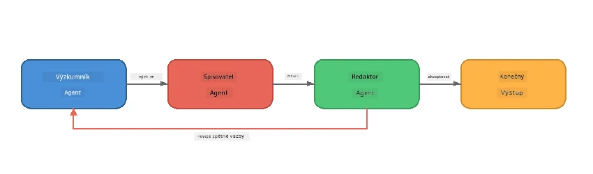
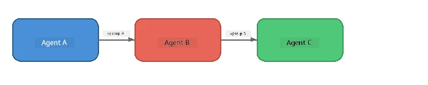
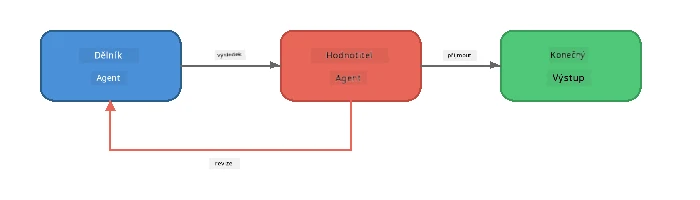
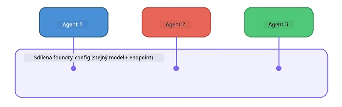

# Část 6: Multiagentní Workflow

> **Cíl:** Kombinovat více specializovaných agentů do koordinovaných linek, které rozdělují složité úkoly mezi spolupracující agenty - vše běží lokálně s Foundry Local.

## Proč Multiagentní?

Jeden agent zvládne mnoho úkolů, ale složité workflow těží ze **specializace**. Místo aby se jeden agent snažil současně zkoumat, psát a upravovat, rozdělíte práci do zaměřených rolí:



| Vzorec | Popis |
|---------|-------------|
| **Sekvenční** | Výstup Agenta A jde do Agenta B → Agenta C |
| **Zpětná smyčka** | Hodnotící agent může poslat práci zpět k revizi |
| **Sdílený kontext** | Všichni agenti používají stejný model/end-point, ale různé instrukce |
| **Typovaný výstup** | Agenti produkují strukturované výsledky (JSON) pro spolehlivé předání |

---

## Cvičení

### Cvičení 1 - Spusťte multiagentní pipeline

Workshop obsahuje kompletní workflow Výzkumník → Píšící → Editor.

<details>
<summary><strong>🐍 Python</strong></summary>

**Nastavení:**
```bash
cd python
python -m venv venv

# Windows (PowerShell):
venv\Scripts\Activate.ps1
# macOS:
source venv/bin/activate

pip install -r requirements.txt
```

**Spuštění:**
```bash
python foundry-local-multi-agent.py
```

**Co se stane:**
1. **Výzkumník** obdrží téma a vrátí body s fakty
2. **Píšící** vezme výzkum a napíše návrh blogového příspěvku (3-4 odstavce)
3. **Editor** zkontroluje článek na kvalitu a vrátí PŘIJATO nebo OPRAVIT

</details>

<details>
<summary><strong>📦 JavaScript</strong></summary>

**Nastavení:**
```bash
cd javascript
npm install
```

**Spuštění:**
```bash
node foundry-local-multi-agent.mjs
```

**Stejná třífázová pipeline** - Výzkumník → Píšící → Editor.

</details>

<details>
<summary><strong>💜 C#</strong></summary>

**Nastavení:**
```bash
cd csharp
dotnet restore
```

**Spuštění:**
```bash
dotnet run multi
```

**Stejná třífázová pipeline** - Výzkumník → Píšící → Editor.

</details>

---

### Cvičení 2 - Stavba pipeline

Prostudujte si, jak jsou agenti definováni a propojeni:

**1. Sdílený klient modelu**

Všichni agenti používají stejný Foundry Local model:

```python
# Python - FoundryLocalClient se postará o všechno
from agent_framework_foundry_local import FoundryLocalClient

client = FoundryLocalClient(model_id="phi-3.5-mini")
```

```javascript
// JavaScript - OpenAI SDK nasměrovaný na Foundry Local
const client = new OpenAI({
  baseURL: manager.urls[0] + "/v1",
  apiKey: "foundry-local",
});
```

```csharp
// C# - OpenAIClient pointed at Foundry Local
var key = new ApiKeyCredential("foundry-local");
var client = new OpenAIClient(key, new OpenAIClientOptions
{
    Endpoint = new Uri(manager.Urls[0] + "/v1")
});
var chatClient = client.GetChatClient(model.Id);
```

**2. specializované instrukce**

Každý agent má jinou osobnost:

| Agent | Instrukce (souhrn) |
|-------|----------------------|
| Výzkumník | "Poskytněte klíčová fakta, statistiky a pozadí. Uspořádejte jako odrážky." |
| Píšící | "Napište zajímavý blogový příspěvek (3-4 odstavce) podle poznámek z výzkumu. Nevymýšlejte fakta." |
| Editor | "Zkontrolujte srozumitelnost, gramatiku a faktickou konzistenci. Rozhodnutí: PŘIJATO nebo OPRAVIT." |

**3. Tok dat mezi agenty**

```python
# Krok 1 - výstup od výzkumníka se stává vstupem pro pisatele
research_result = await researcher.run(f"Research: {topic}")

# Krok 2 - výstup od pisatele se stává vstupem pro redaktora
writer_result = await writer.run(f"Write using:\n{research_result}")

# Krok 3 - redaktor přezkoumá jak výzkum, tak článek
editor_result = await editor.run(
    f"Research:\n{research_result}\n\nArticle:\n{writer_result}"
)
```

```csharp
// C# - same pattern, async calls with AIAgent
var researchNotes = await researcher.RunAsync(
    $"Research the following topic and provide key facts:\n{topic}");

var draft = await writer.RunAsync(
    $"Write a blog post based on these research notes:\n\n{researchNotes}");

var verdict = await editor.RunAsync(
    $"Review this article for quality and accuracy.\n\n" +
    $"Research notes:\n{researchNotes}\n\n" +
    $"Article:\n{draft}");
```

> **Klíčový poznatek:** Každý agent dostává kumulativní kontext od předchozích agentů. Editor vidí jak původní výzkum, tak návrh – díky tomu může ověřit faktickou konzistenci.

---

### Cvičení 3 - Přidejte čtvrtého agenta

Rozšiřte pipeline přidáním nového agenta. Vyberte jeden:

| Agent | Účel | Instrukce |
|-------|---------|-------------|
| **Kontrola faktů** | Ověřuje tvrzení v článku | `"Ověřujete faktická tvrzení. Pro každé tvrzení uveďte, zda je podpořeno výzkumnými poznámkami. Vraťte JSON s ověřenými/neověřenými položkami."` |
| **Tvůrce nadpisů** | Vytváří chytlavé titulky | `"Vygenerujte 5 variant nadpisů pro článek. Měňte styly: informační, clickbait, otázka, seznam, emocionální."` |
| **Sociální média** | Vytváří propagační příspěvky | `"Vytvořte 3 příspěvky na sociální média propagující tento článek: jeden pro Twitter (280 znaků), jeden pro LinkedIn (profesionální tón), jeden pro Instagram (neformální s návrhy emoji)."` |

<details>
<summary><strong>🐍 Python - přidání Tvůrce nadpisů</strong></summary>

```python
headline_agent = client.as_agent(
    name="HeadlineWriter",
    instructions=(
        "You are a headline specialist. Given an article, generate exactly "
        "5 headline options. Vary the style: informative, question-based, "
        "listicle, emotional, and provocative. Return them as a numbered list."
    ),
)

# Po přijetí editorem vytvořte titulky
headline_result = await headline_agent.run(
    f"Generate headlines for this article:\n\n{writer_result}"
)
print(f"\n--- Headlines ---\n{headline_result}")
```

</details>

<details>
<summary><strong>📦 JavaScript - přidání Tvůrce nadpisů</strong></summary>

```javascript
const headlineAgent = new ChatAgent({
  client,
  modelId: modelInfo.id,
  instructions:
    "You are a headline specialist. Given an article, generate exactly " +
    "5 headline options. Vary the style: informative, question-based, " +
    "listicle, emotional, and provocative. Return them as a numbered list.",
  name: "HeadlineWriter",
});

const headlineResult = await headlineAgent.run(
  `Generate headlines for this article:\n\n${writerResult.text}`
);
console.log(`\n--- Headlines ---\n${headlineResult.text}`);
```

</details>

<details>
<summary><strong>💜 C# - přidání Tvůrce nadpisů</strong></summary>

```csharp
AIAgent headlineAgent = chatClient.AsAIAgent(
    name: "HeadlineWriter",
    instructions:
        "You are a headline specialist. Given an article, generate exactly " +
        "5 headline options. Vary the style: informative, question-based, " +
        "listicle, emotional, and provocative. Return them as a numbered list."
);

// After the editor accepts, generate headlines
var headlines = await headlineAgent.RunAsync(
    $"Generate headlines for this article:\n\n{draft}");
Console.WriteLine($"\n--- Headlines ---\n{headlines}");
```

</details>

---

### Cvičení 4 - Navrhněte vlastní workflow

Navrhněte multiagentní pipeline pro jinou oblast. Zde je pár nápadů:

| Oblast | Agenti | Průběh |
|--------|--------|------|
| **Kontrola kódu** | Analyzátor → Recenzent → Shrnutí | Analyzujte strukturu kódu → zkontrolujte chyby → vytvořte souhrnnou zprávu |
| **Zákaznická podpora** | Klasifikátor → Odpovídač → Kontrola kvality | Klasifikujte ticket → napište odpověď → zkontrolujte kvalitu |
| **Vzdělávání** | Tvořič kvízů → Simulátor studenta → Hodnotitel | Generujte kvíz → simulujte odpovědi → hodnotte a vysvětlete |
| **Analýza dat** | Interpret → Analytik → Reportér | Interpretujte požadavek dat → analyzujte vzory → napište zprávu |

**Postup:**
1. Definujte 3+ agentů s rozdílnými `instructions`
2. Určete tok dat - co každý agent přijímá a co vytváří?
3. Implementujte pipeline pomocí vzorců z cvičení 1-3
4. Přidejte zpětnou smyčku, pokud má jeden agent hodnotit práci druhého

---

## Vzorce orchestrací

Zde jsou vzory orchestrací, které platí pro jakýkoliv multiagentní systém (podrobněji v [Část 7](part7-zava-creative-writer.md)):

### Sekvenční pipeline



Každý agent zpracovává výstup předchozího. Jednoduché a predikovatelné.

### Zpětná smyčka



Hodnotící agent může spustit opětovné provedení dřívějších kroků. Zava Writer to používá: editor může poslat zpětnou vazbu výzkumníkovi a píšícímu.

### Sdílený kontext



Všichni agenti sdílí jeden `foundry_config`, takže používají stejný model a end-point.

---

## Klíčové poznatky

| Koncept | Co jste se naučili |
|---------|-----------------|
| Specializace agenta | Každý agent dělá jednu věc dobře s jasnými instrukcemi |
| Předávání dat | Výstup jednoho agenta se stává vstupem dalšího |
| Zpětné smyčky | Hodnotitel může spustit opakování pro vyšší kvalitu |
| Strukturovaný výstup | JSON umožňuje spolehlivou komunikaci mezi agenty |
| Orchestrace | Koordinátor řídí sekvenci pipeline a správu chyb |
| Produkční vzory | Používáno v [Část 7: Zava Creative Writer](part7-zava-creative-writer.md) |

---

## Další kroky

Pokračujte do [Části 7: Zava Creative Writer - Capstone Application](part7-zava-creative-writer.md) a objevte produkční multiagentní aplikaci se 4 specializovanými agenty, streamováním výstupu, vyhledáváním produktů a zpětnými smyčkami - dostupné v Pythonu, JavaScriptu a C#.