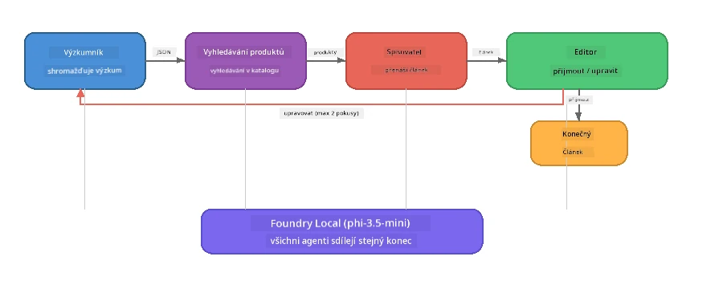

# Část 7: Zava Creative Writer - závěrečná aplikace

> **Cíl:** Prozkoumat výrobní multiagentní aplikaci, kde čtyři specializovaní agenti spolupracují na tvorbě článků kvality časopisu pro Zava Retail DIY - běžící kompletně na vašem zařízení pomocí Foundry Local.

Toto je **závěrečné cvičení** workshopu. Spojuje vše, co jste se naučili – integraci SDK (část 3), získávání dat z místních zdrojů (část 4), persony agentů (část 5) a orchestraci více agentů (část 6) – do kompletní aplikace dostupné v **Pythonu**, **JavaScriptu** a **C#**.

---

## Co budete zkoumat

| Koncept | Kde ve Zava Writeru |
|---------|----------------------|
| 4-krokové načítání modelu | Sdílený konfigurační modul spouští Foundry Local |
| Získávání dat ve stylu RAG | Agent produktů vyhledává v místním katalogu |
| Specializace agentů | 4 agenti s odlišnými systémovými promptami |
| Průběžný výstup | Writer generuje tokeny v reálném čase |
| Strukturované předávání | Výzkumník → JSON, Editor → JSON rozhodnutí |
| Smyčky zpětné vazby | Editor může spustit opětovné provedení (max 2 pokusy) |

---

## Architektura

Zava Creative Writer používá **sekvenční pipeline s evaluátorem řízenou zpětnou vazbou**. Všechny tři jazykové implementace dodržují stejnou architekturu:



### Čtyři agenti

| Agent | Vstup | Výstup | Účel |
|-------|-------|--------|-------|
| **Výzkumník** | Téma + nepovinná zpětná vazba | `{"web": [{url, name, description}, ...]}` | Sbírá podklady výzkumu pomocí LLM |
| **Vyhledávání produktů** | Kontextový řetězec produktu | Seznam vyhovujících produktů | LLM generuje dotazy + klíčové slovo vyhledávání v místním katalogu |
| **Writer** | Výzkum + produkty + zadání + zpětná vazba | Proudící text článku (rozdělený na `---`) | Návrh článku kvalitního jako v časopise v reálném čase |
| **Editor** | Článek + auto-zpětná vazba writeru | `{"decision": "accept/revise", "editorFeedback": "...", "researchFeedback": "..."}` | Hodnotí kvalitu, spouští retry v případě potřeby |

### Tok Pipeline

1. **Výzkumník** přijímá téma a vytváří strukturované výzkumné poznámky (JSON)
2. **Vyhledávání produktů** dotazuje místní katalog produktů pomocí dotazů generovaných LLM
3. **Writer** kombinuje výzkum + produkty + zadání do proudícího článku, přidává auto-zpětnou vazbu po oddělovači `---`
4. **Editor** článek hodnotí a vrací JSON rozhodnutí:
   - `"accept"` → pipeline končí
   - `"revise"` → zpětná vazba je odeslána Výzkumníkovi a Writerovi (max 2 retry)

---

## Požadavky

- Dokončit [Část 6: Multi-Agent Workflows](part6-multi-agent-workflows.md)
- Mít nainstalovaný Foundry Local CLI a stažený model `phi-3.5-mini`

---

## Cvičení

### Cvičení 1 - Spusťte Zava Creative Writer

Vyberte svůj jazyk a spusťte aplikaci:

<details>
<summary><strong>🐍 Python - FastAPI webová služba</strong></summary>

Python verze běží jako **webová služba** s REST API, ukazující tvorbu produkčního backendu.

**Nastavení:**
```bash
cd zava-creative-writer-local/src/api
python -m venv venv

# Windows (PowerShell):
venv\Scripts\Activate.ps1
# macOS:
source venv/bin/activate

pip install -r requirements.txt
```

**Spuštění:**
```bash
uvicorn main:app --reload
```

**Otestujte:**
```bash
curl -X POST http://localhost:8000/api/article \
  -H "Content-Type: application/json" \
  -d '{
    "research": "DIY home improvement trends",
    "products": "power tools and paints",
    "assignment": "Write an article about weekend renovation projects for DIY enthusiasts"
  }'
```

Odpověď se streamuje jako JSON zprávy oddělené novým řádkem, ukazující průběh jednotlivých agentů.

</details>

<details>
<summary><strong>📦 JavaScript - Node.js CLI</strong></summary>

JavaScript verze je **CLI aplikace**, která tiskne průběh agentů a článek přímo do konzole.

**Nastavení:**
```bash
cd zava-creative-writer-local/src/javascript
npm install
```

**Spuštění:**
```bash
node main.mjs
```

Uvidíte:
1. Načítání Foundry Local modelu (s progress barem při stahování)
2. Každý agent postupně provádí úkol s výpisy stavu
3. Článek se streamuje do konzole v reálném čase
4. Rozhodnutí editora o přijetí/revizi

</details>

<details>
<summary><strong>💜 C# - .NET konzolová aplikace</strong></summary>

C# verze běží jako **.NET konzolová aplikace** se stejnou pipeline a průběžným výstupem.

**Nastavení:**
```bash
cd zava-creative-writer-local/src/csharp
dotnet restore
```

**Spuštění:**
```bash
dotnet run
```

Výstup je stejný jako u JavaScript verze – stavové zprávy agentů, streamovaný článek a verdikt editora.

</details>

---

### Cvičení 2 - Prozkoumejte strukturu kódu

Každá jazyková implementace má stejné logické komponenty. Porovnejte struktury:

**Python** (`src/api/`):
| Soubor | Účel |
|--------|-------|
| `foundry_config.py` | Sdílený Foundry Local manažer, model a klient (4-krokové spuštění) |
| `orchestrator.py` | Koordinace pipeline se zpětnou vazbou |
| `main.py` | FastAPI endpointy (`POST /api/article`) |
| `agents/researcher/researcher.py` | Výzkum založený na LLM s JSON výstupem |
| `agents/product/product.py` | LLM generuje dotazy + klíčové slovo vyhledávání |
| `agents/writer/writer.py` | Generování článku v streamu |
| `agents/editor/editor.py` | JSON rozhodnutí o přijetí/revizi |

**JavaScript** (`src/javascript/`):
| Soubor | Účel |
|--------|-------|
| `foundryConfig.mjs` | Sdílená konfigurace Foundry Local (4-krokové spuštění s progressbarem) |
| `main.mjs` | Orchestrátor + vstup CLI |
| `researcher.mjs` | Agent pro výzkum na bázi LLM |
| `product.mjs` | Generování dotazů LLM + vyhledávání |
| `writer.mjs` | Generování článku (asynchronní generátor) |
| `editor.mjs` | JSON rozhodnutí o přijetí/revizi |
| `products.mjs` | Data katalogu produktů |

**C#** (`src/csharp/`):
| Soubor | Účel |
|--------|-------|
| `Program.cs` | Kompletní pipeline: načítání modelu, agenti, orchestrátor, smyčka zpětné vazby |
| `ZavaCreativeWriter.csproj` | .NET 9 projekt s Foundry Local + OpenAI balíčky |

> **Designová poznámka:** Python odděluje každého agenta do samostatného souboru/adresáře (dobré pro větší týmy). JavaScript používá jeden modul na agenta (vhodné pro střední projekty). C# vše drží v jednom souboru s lokálními funkcemi (vhodné pro samostatné příklady). V produkci zvolte vzor podle standardů vašeho týmu.

---

### Cvičení 3 - Sledovat sdílenou konfiguraci

Každý agent v pipeline sdílí jediný Foundry Local model klient. Prostudujte, jak je nastaven v každém jazyce:

<details>
<summary><strong>🐍 Python - foundry_config.py</strong></summary>

```python
from foundry_local import FoundryLocalManager

MODEL_ALIAS = "phi-3.5-mini"

# Krok 1: Vytvořte manažera a spusťte službu Foundry Local
manager = FoundryLocalManager()
manager.start_service()

# Krok 2: Zkontrolujte, zda je model již stažen
cached = manager.list_cached_models()
catalog_info = manager.get_model_info(MODEL_ALIAS)
is_cached = any(m.id == catalog_info.id for m in cached) if catalog_info else False

if not is_cached:
    manager.download_model(MODEL_ALIAS)

# Krok 3: Načtěte model do paměti
manager.load_model(MODEL_ALIAS)
model_id = manager.get_model_info(MODEL_ALIAS).id

# Sdílený klient OpenAI
client = openai.OpenAI(base_url=manager.endpoint, api_key=manager.api_key)
```

Všechny agenti importují `from foundry_config import client, model_id`.

</details>

<details>
<summary><strong>📦 JavaScript - foundryConfig.mjs</strong></summary>

```javascript
import { FoundryLocalManager } from "foundry-local-sdk";
import { OpenAI } from "openai";

FoundryLocalManager.create({ appName: "ZavaCreativeWriter" });
const manager = FoundryLocalManager.instance;
await manager.startWebService();

// Zkontrolovat cache → stáhnout → načíst (nový vzor SDK)
const catalog = manager.catalog;
const model = await catalog.getModel(MODEL_ALIAS);
if (!model.isCached) {
  console.log(`Downloading model: ${MODEL_ALIAS}...`);
  await model.download();
}
await model.load();

const client = new OpenAI({ baseURL: manager.urls[0] + "/v1", apiKey: "foundry-local" });
const modelId = model.id;
export { client, modelId };
```

Všechny agenti importují `{ client, modelId } from "./foundryConfig.mjs"`.

</details>

<details>
<summary><strong>💜 C# - začátek Program.cs</strong></summary>

```csharp
await FoundryLocalManager.CreateAsync(
    new Configuration
    {
        AppName = "ZavaCreativeWriter",
        Web = new Configuration.WebService { Urls = "http://127.0.0.1:0" }
    }, NullLogger.Instance, default);
var manager = FoundryLocalManager.Instance;
await manager.StartWebServiceAsync(default);

var catalog = await manager.GetCatalogAsync(default);
var catalogModel = await catalog.GetModelAsync(alias, default);
var isCached = await catalogModel.IsCachedAsync(default);
if (!isCached)
    await catalogModel.DownloadAsync(null, default);

await catalogModel.LoadAsync(default);
var key = new ApiKeyCredential("foundry-local");
var chatClient = new OpenAIClient(key, new OpenAIClientOptions
{
    Endpoint = new Uri(manager.Urls[0] + "/v1")
}).GetChatClient(catalogModel.Id);
```

`chatClient` je pak předáván všem agentům ve stejném souboru.

</details>

> **Klíčový vzor:** Vzorec načítání modelu (start služba → kontrola cache → stažení → načtení) zajišťuje, že uživatel vidí jasný postup a model se stahuje pouze jednou. To je nejlepší praxe pro jakoukoli Foundry Local aplikaci.

---

### Cvičení 4 - Porozumění smyčce zpětné vazby

Smyčka zpětné vazby dělá pipeline "chytrou" - editor může práci poslat zpět k revizi. Sledujte logiku:

```
Orchestrator:
  1. researcher.research(topic, "No Feedback")    ← first pass
  2. product.findProducts(productContext)
  3. writer.write(research, products, assignment)  ← streams article
  4. Split article at "---" → article + writerFeedback
  5. editor.edit(article, writerFeedback)

  WHILE editor says "revise" AND retryCount < 2:
    6. researcher.research(topic, editor.researchFeedback)  ← refined
    7. writer.write(research, products, editor.editorFeedback)
    8. editor.edit(newArticle, newWriterFeedback)
    9. retryCount++
```

**Otázky k zamyšlení:**
- Proč je limit retry nastaven na 2? Co se stane, když ho zvýšíte?
- Proč Výzkumník dostává `researchFeedback`, ale Writer `editorFeedback`?
- Co by se stalo, kdyby editor vždy říkal "revise"?

---

### Cvičení 5 - Upravte agenta

Zkuste změnit chování jednoho agenta a sledujte, jak to ovlivní pipeline:

| Úprava | Co změnit |
|--------|-----------|
| **Přísnější editor** | Změnit systémový prompt editora tak, aby vždy žádal alespoň jednu revizi |
| **Delší články** | Změnit prompt writera z „800-1000 slov“ na „1500-2000 slov“ |
| **Jiný výběr produktů** | Přidat nebo upravit produkty v katalogu produktů |
| **Nové téma výzkumu** | Změnit výchozí `researchContext` na jiné téma |
| **Výzkumník pouze JSON** | Nechat výzkumníka vracet 10 položek místo 3-5 |

> **Tip:** Jelikož všechny tři jazyky implementují stejnou architekturu, můžete provést stejnou úpravu v tom jazyce, který vám je nejpříjemnější.

---

### Cvičení 6 - Přidejte pátého agenta

Rozšiřte pipeline o nového agenta. Několik nápadů:

| Agent | Kde v pipeline | Účel |
|-------|----------------|-------|
| **Fact-Checker** | Po Writeru, před Editorem | Ověřit tvrzení podle výzkumných dat |
| **SEO Optimalizátor** | Po přijetí Editorem | Přidat meta popis, klíčová slova, slug |
| **Ilustrátor** | Po přijetí Editorem | Generovat obrazové promptky pro článek |
| **Překladatel** | Po přijetí Editorem | Přeložit článek do jiného jazyka |

**Kroky:**
1. Napište systémový prompt agenta
2. Vytvořte funkci agenta (podle stávajícího vzoru ve vašem jazyce)
3. Vložte ji na správné místo v orchestrátoru
4. Aktualizujte výstup/logování, aby bylo vidět příspěvek nového agenta

---

## Jak Foundry Local a Agent Framework spolupracují

Tato aplikace demonstruje doporučený vzor pro tvorbu multiagentních systémů pomocí Foundry Local:

| Vrstva | Komponenta | Role |
|--------|------------|-------|
| **Runtime** | Foundry Local | Stahuje, spravuje a poskytuje model lokálně |
| **Klient** | OpenAI SDK | Posílá chatové dotazy na lokální endpoint |
| **Agent** | Systémový prompt + chat volání | Specializované chování prostřednictvím zaměřených instrukcí |
| **Orchestrátor** | Koordinátor pipeline | Řídí tok dat, sekvencování a smyčky zpětné vazby |
| **Framework** | Microsoft Agent Framework | Poskytuje abstrakci `ChatAgent` a vzory |

Klíčové poznání: **Foundry Local nahrazuje cloud backend, ale ne architekturu aplikace.** Stejné vzory agentů, strategie orchestrací a strukturovaná předávání, které fungují s cloudovými modely, fungují shodně s místními modely — jen klient místo Azure endpointu cílí na lokální endpoint.

---

## Hlavní body

| Koncept | Co jste se naučili |
|---------|--------------------|
| Produkční architektura | Jak strukturovat multiagentní aplikaci se sdílenou konfigurací a samostatnými agenty |
| 4-krokové načítání modelu | Nejlepší praktika pro inicializaci Foundry Local s uživatelsky viditelným pokrokem |
| Specializace agentů | Každý ze 4 agentů má zaměřené instrukce a specifický formát výstupu |
| Generování v proudu | Writer generuje tokeny v reálném čase, což umožňuje responzivní UI |
| Smyčky zpětné vazby | Retry řízený editorem zlepšuje kvalitu výstupu bez lidského zásahu |
| Vzor napříč jazyky | Stejná architektura funguje v Pythonu, JavaScriptu i C# |
| Lokální = připravené do produkce | Foundry Local poskytuje stejná OpenAI-kompatibilní API jako cloudové nasazení |

---

## Další krok

Pokračujte na [Část 8: Vývoj vedený evaluací](part8-evaluation-led-development.md), kde vytvoříte systematický evaluační framework pro vaše agenty, využívající zlaté datové sady, pravidlové kontroly a hodnocení LLM jako rozhodce.