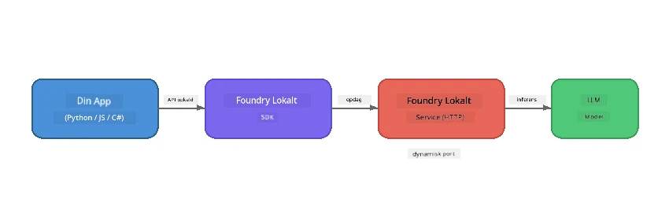

# Del 1: Kom godt i gang med Foundry Local


## Hvad er Foundry Local?

[Foundry Local](https://foundrylocal.ai) lader dig køre open-source AI sprogmodeller **direkte på din computer** - uden internetforbindelse, ingen cloud-omkostninger og fuldstændig dataprivatliv. Det:

- **Downloader og kører modeller lokalt** med automatisk hardwareoptimering (GPU, CPU eller NPU)
- **Tilbyder en OpenAI-kompatibel API**, så du kan bruge velkendte SDK'er og værktøjer
- **Kræver ingen Azure-abonnement** eller tilmelding - bare installer og begynd at bygge

Tænk på det som at have din egen private AI, der kører helt på din maskine.

## Læringsmål

Ved afslutningen af denne øvelse vil du kunne:

- Installere Foundry Local CLI på dit operativsystem
- Forstå hvad modelaliaser er, og hvordan de fungerer
- Downloade og køre din første lokale AI-model
- Sende en chatbesked til en lokal model via kommandolinjen
- Forstå forskellen på lokale og cloud-hostede AI-modeller

---

## Forudsætninger

### Systemkrav

| Krav | Minimum | Anbefalet |
|-------------|---------|-------------|
| **RAM** | 8 GB | 16 GB |
| **Diskplads** | 5 GB (til modeller) | 10 GB |
| **CPU** | 4 kerner | 8+ kerner |
| **GPU** | Valgfrit | NVIDIA med CUDA 11.8+ |
| **OS** | Windows 10/11 (x64/ARM), Windows Server 2025, macOS 13+ | - |

> **Bemærk:** Foundry Local vælger automatisk den bedste modelvariant til din hardware. Hvis du har en NVIDIA GPU, bruger den CUDA-acceleration. Hvis du har en Qualcomm NPU, bruger den den. Ellers falder den tilbage til en optimeret CPU-variant.

### Installer Foundry Local CLI

**Windows** (PowerShell):
```powershell
winget install Microsoft.FoundryLocal
```

**macOS** (Homebrew):
```bash
brew tap microsoft/foundrylocal
brew install foundrylocal
```

> **Bemærk:** Foundry Local understøtter i øjeblikket kun Windows og macOS. Linux understøttes ikke på nuværende tidspunkt.

Verificer installationen:
```bash
foundry --version
```

---

## Øvelser

### Øvelse 1: Udforsk tilgængelige modeller

Foundry Local indeholder et katalog af forudoptimerede open-source modeller. List dem:

```bash
foundry model list
```

Du vil se modeller som:
- `phi-3.5-mini` - Microsofts 3,8 milliarder parameter model (hurtig, god kvalitet)
- `phi-4-mini` - Nyere, mere kapabel Phi-model
- `phi-4-mini-reasoning` - Phi-model med chain-of-thought ræsonnering (`<think>` tags)
- `phi-4` - Microsofts største Phi-model (10,4 GB)
- `qwen2.5-0.5b` - Meget lille og hurtig (god til lav-ressource enheder)
- `qwen2.5-7b` - Stærk almennyttig model med tool-calling support
- `qwen2.5-coder-7b` - Optimeret til kodegenerering
- `deepseek-r1-7b` - Stærk ræsonneringsmodel
- `gpt-oss-20b` - Stor open-source model (MIT-licens, 12,5 GB)
- `whisper-base` - Tale-til-tekst transskription (383 MB)
- `whisper-large-v3-turbo` - Højpræcisions transskription (9 GB)

> **Hvad er et modelalias?** Aliaser som `phi-3.5-mini` er genveje. Når du bruger et alias, downloader Foundry Local automatisk den bedste variant til din specifikke hardware (CUDA for NVIDIA GPU'er, CPU-optimeret ellers). Du behøver aldrig bekymre dig om at vælge den rigtige variant.

### Øvelse 2: Kør din første model

Download og start en interaktiv chat med en model:

```bash
foundry model run phi-3.5-mini
```

Første gang du kører dette, vil Foundry Local:
1. Registrere din hardware
2. Downloade den optimale modelvariant (det kan tage et par minutter)
3. Indlæse modellen i hukommelsen
4. Starte en interaktiv chatsession

Prøv at stille den nogle spørgsmål:
```
You: What is the golden ratio?
You: Can you explain it as if I were 10 years old?
You: Write a haiku about mathematics
```

Skriv `exit` eller tryk på `Ctrl+C` for at afslutte.

### Øvelse 3: Forhåndsdownload en model

Hvis du ønsker at downloade en model uden at starte en chat:

```bash
foundry model download phi-3.5-mini
```

Tjek hvilke modeller der allerede er downloadet på din maskine:

```bash
foundry cache list
```

### Øvelse 4: Forstå arkitekturen

Foundry Local kører som en **lokal HTTP-service**, der udstiller en OpenAI-kompatibel REST API. Det betyder:

1. Servicen starter på en **dynamisk port** (en forskellig port hver gang)
2. Du bruger SDK'en til at finde den faktiske endpoint-URL
3. Du kan bruge **enhver** OpenAI-kompatibel klientbibliotek til at kommunikere med den



> **Vigtigt:** Foundry Local tildeler en **dynamisk port** hver gang det starter. Hardcod aldrig et portnummer som `localhost:5272`. Brug altid SDK'en til at finde den aktuelle URL (f.eks. `manager.endpoint` i Python eller `manager.urls[0]` i JavaScript).

---

## Vigtige pointer

| Begreb | Hvad du lærte |
|---------|------------------|
| On-device AI | Foundry Local kører modeller helt på din enhed uden cloud, API-nøgler eller omkostninger |
| Modelaliaser | Aliaser som `phi-3.5-mini` vælger automatisk den bedste variant til din hardware |
| Dynamiske porte | Servicen kører på en dynamisk port; brug altid SDK'en til at finde endpoint |
| CLI og SDK | Du kan interagere med modeller via CLI (`foundry model run`) eller programmatisk via SDK'en |

---

## Næste skridt

Fortsæt til [Del 2: Foundry Local SDK Deep Dive](part2-foundry-local-sdk.md) for at mestre SDK API'en til håndtering af modeller, services og caching programmatisk.

---

<!-- CO-OP TRANSLATOR DISCLAIMER START -->
**Ansvarsfraskrivelse**:  
Dette dokument er blevet oversat ved hjælp af AI-oversættelsestjenesten [Co-op Translator](https://github.com/Azure/co-op-translator). Selvom vi bestræber os på nøjagtighed, skal du være opmærksom på, at automatiserede oversættelser kan indeholde fejl eller unøjagtigheder. Det originale dokument på dets oprindelige sprog bør betragtes som den autoritative kilde. For kritisk information anbefales professionel menneskelig oversættelse. Vi påtager os intet ansvar for eventuelle misforståelser eller fejltolkninger, der opstår som følge af brugen af denne oversættelse.
<!-- CO-OP TRANSLATOR DISCLAIMER END -->