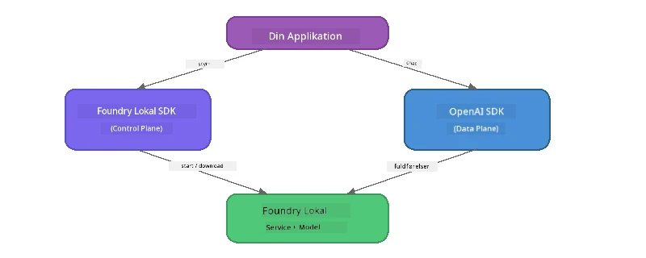

# Del 3: Brug af Foundry Local SDK med OpenAI

## Oversigt

I Del 1 brugte du Foundry Local CLI til at køre modeller interaktivt. I Del 2 udforskede du hele SDK API-området. Nu vil du lære at **integrere Foundry Local i dine applikationer** ved hjælp af SDK'et og den OpenAI-kompatible API.

Foundry Local leverer SDK'er til tre sprog. Vælg det, du er mest fortrolig med – koncepterne er identiske på tværs af alle tre.

## Læringsmål

Ved slutningen af denne øvelse vil du kunne:

- Installere Foundry Local SDK’et til dit sprog (Python, JavaScript eller C#)
- Initialisere `FoundryLocalManager` for at starte servicen, tjekke cachen, downloade og indlæse en model
- Forbinde til den lokale model med OpenAI SDK
- Sende chat-kompletteringer og håndtere streaming-svar
- Forstå den dynamiske porte-arkitektur

---

## Forudsætninger

Fuldfør venligst først [Del 1: Kom godt i gang med Foundry Local](part1-getting-started.md) og [Del 2: Foundry Local SDK Dybtgående Gennemgang](part2-foundry-local-sdk.md).

Installer **én** af følgende sprogkørsler:
- **Python 3.9+** - [python.org/downloads](https://www.python.org/downloads/)
- **Node.js 18+** - [nodejs.org](https://nodejs.org/)
- **.NET 9.0+** - [dot.net/download](https://dotnet.microsoft.com/download)

---

## Koncept: Hvordan SDK’et virker

Foundry Local SDK håndterer **kontrolplanet** (starter servicen, downloader modeller), mens OpenAI SDK håndterer **dataplanet** (sender prompts, modtager komplette svar).



---

## Lab Øvelser

### Øvelse 1: Opsæt dit miljø

<details>
<summary><b>🐍 Python</b></summary>

```bash
cd python
python -m venv venv

# Aktiver det virtuelle miljø:
# Windows (PowerShell):
venv\Scripts\Activate.ps1
# Windows (Kommandoprompt):
venv\Scripts\activate.bat
# macOS:
source venv/bin/activate

pip install -r requirements.txt
```

`requirements.txt` installerer:
- `foundry-local-sdk` - Foundry Local SDK (importeres som `foundry_local`)
- `openai` - OpenAI Python SDK
- `agent-framework` - Microsoft Agent Framework (bruges i senere dele)

</details>

<details>
<summary><b>📘 JavaScript</b></summary>

```bash
cd javascript
npm install
```

`package.json` installerer:
- `foundry-local-sdk` - Foundry Local SDK
- `openai` - OpenAI Node.js SDK

</details>

<details>
<summary><b>💜 C#</b></summary>

```bash
cd csharp
dotnet restore
dotnet build
```

`csharp.csproj` bruger:
- `Microsoft.AI.Foundry.Local` - Foundry Local SDK (NuGet)
- `OpenAI` - OpenAI C# SDK (NuGet)

> **Projektstruktur:** C#-projektet bruger en kommandolinje-router i `Program.cs` som sender videre til separate eksempel-filer. Kør `dotnet run chat` (eller bare `dotnet run`) for denne del. Andre dele bruger `dotnet run rag`, `dotnet run agent` og `dotnet run multi`.

</details>

---

### Øvelse 2: Grundlæggende Chat-Komplettering

Åbn det grundlæggende chat-eksempel for dit sprog og undersøg koden. Hvert script følger det samme tre-trins mønster:

1. **Start servicen** - `FoundryLocalManager` starter Foundry Local runtime
2. **Download og indlæs modellen** - tjek cache, download om nødvendigt, og indlæs i hukommelsen
3. **Opret en OpenAI-klient** - forbind til det lokale endepunkt og send en streaming chat-komplettering

<details>
<summary><b>🐍 Python - <code>python/foundry-local.py</code></b></summary>

```python
import sys
import openai
from foundry_local import FoundryLocalManager

alias = "phi-3.5-mini"

# Trin 1: Opret en FoundryLocalManager og start tjenesten
print("Starting Foundry Local service...")
manager = FoundryLocalManager()
manager.start_service()

# Trin 2: Tjek om modellen allerede er hentet
cached = manager.list_cached_models()
catalog_info = manager.get_model_info(alias)
is_cached = any(m.id == catalog_info.id for m in cached) if catalog_info else False

if is_cached:
    print(f"Model already downloaded: {alias}")
else:
    print(f"Downloading model: {alias} (this may take several minutes)...")
    manager.download_model(alias)
    print(f"Download complete: {alias}")

# Trin 3: Indlæs modellen i hukommelsen
print(f"Loading model: {alias}...")
manager.load_model(alias)

# Opret en OpenAI-klient, der peger på den LOKALE Foundry-tjeneste
client = openai.OpenAI(
    base_url=manager.endpoint,   # Dynamisk port - aldrig hardcoded!
    api_key=manager.api_key
)

# Generer en streaming chat-fuldførelse
stream = client.chat.completions.create(
    model=manager.get_model_info(alias).id,
    messages=[{"role": "user", "content": "What is the golden ratio?"}],
    stream=True,
)

for chunk in stream:
    if chunk.choices[0].delta.content is not None:
        print(chunk.choices[0].delta.content, end="", flush=True)
print()
```

**Kør det:**
```bash
python foundry-local.py
```

</details>

<details>
<summary><b>📘 JavaScript - <code>javascript/foundry-local.mjs</code></b></summary>

```javascript
import { OpenAI } from "openai";
import { FoundryLocalManager } from "foundry-local-sdk";

const alias = "phi-3.5-mini";

// Trin 1: Start Foundry Local-tjenesten
console.log("Starting Foundry Local service...");
FoundryLocalManager.create({ appName: "FoundryLocalWorkshop" });
const manager = FoundryLocalManager.instance;
await manager.startWebService();

// Trin 2: Tjek om modellen allerede er hentet
const catalog = manager.catalog;
const model = await catalog.getModel(alias);

if (model.isCached) {
  console.log(`Model already downloaded: ${alias}`);
} else {
  console.log(`Downloading model: ${alias} (this may take several minutes)...`);
  await model.download();
  console.log(`Download complete: ${alias}`);
}

// Trin 3: Indlæs modellen i hukommelsen
console.log(`Loading model: ${alias}...`);
await model.load();
console.log(`Model loaded: ${model.id}`);

// Opret en OpenAI-klient, der peger på den LOKALE Foundry-tjeneste
const client = new OpenAI({
  baseURL: manager.urls[0] + "/v1",   // Dynamisk port - aldrig hardkodet!
  apiKey: "foundry-local",
});

// Generer en streaming chatfuldførelse
const stream = await client.chat.completions.create({
  model: model.id,
  messages: [{ role: "user", content: "What is the golden ratio?" }],
  stream: true,
});

for await (const chunk of stream) {
  if (chunk.choices[0]?.delta?.content) {
    process.stdout.write(chunk.choices[0].delta.content);
  }
}
console.log();
```

**Kør det:**
```bash
node foundry-local.mjs
```

</details>

<details>
<summary><b>💜 C# - <code>csharp/BasicChat.cs</code></b></summary>

```csharp
using Microsoft.AI.Foundry.Local;
using Microsoft.Extensions.Logging.Abstractions;
using OpenAI;
using OpenAI.Chat;
using System.ClientModel;

var alias = "phi-3.5-mini";

// Step 1: Start the Foundry Local service
Console.WriteLine("Starting Foundry Local service...");
await FoundryLocalManager.CreateAsync(
    new Configuration
    {
        AppName = "FoundryLocalSamples",
        Web = new Configuration.WebService { Urls = "http://127.0.0.1:0" }
    }, NullLogger.Instance, default);
var manager = FoundryLocalManager.Instance;
await manager.StartWebServiceAsync(default);

// Step 2: Get the model from the catalog
var catalog = await manager.GetCatalogAsync(default);
var model = await catalog.GetModelAsync(alias, default);

// Step 3: Check if the model is already downloaded
var isCached = await model.IsCachedAsync(default);

if (isCached)
{
    Console.WriteLine($"Model already downloaded: {alias}");
}
else
{
    Console.WriteLine($"Downloading model: {alias} (this may take several minutes)...");
    await model.DownloadAsync(null, default);
    Console.WriteLine($"Download complete: {alias}");
}

// Step 4: Load the model into memory
Console.WriteLine($"Loading model: {alias}...");
await model.LoadAsync(default);
Console.WriteLine($"Loaded model: {model.Id}");
Console.WriteLine($"Endpoint: {manager.Urls[0]}");

// Create OpenAI client pointing to the LOCAL Foundry service
var key = new ApiKeyCredential("foundry-local");
var client = new OpenAIClient(key, new OpenAIClientOptions
{
    Endpoint = new Uri(manager.Urls[0] + "/v1")  // Dynamic port - never hardcode!
});

var chatClient = client.GetChatClient(model.Id);

// Stream a chat completion
var completionUpdates = chatClient.CompleteChatStreaming("What is the golden ratio?");

foreach (var update in completionUpdates)
{
    if (update.ContentUpdate.Count > 0)
    {
        Console.Write(update.ContentUpdate[0].Text);
    }
}
Console.WriteLine();
```

**Kør det:**
```bash
dotnet run chat
```

</details>

---

### Øvelse 3: Eksperimenter med Prompts

Når dit grundlæggende eksempel kører, så prøv at ændre koden:

1. **Ændr brugermeddelelsen** - prøv forskellige spørgsmål
2. **Tilføj en system-prompt** - giv modellen en persona
3. **Slå streaming fra** - sæt `stream=False` og print hele svaret på én gang
4. **Prøv en anden model** - skift alias fra `phi-3.5-mini` til en anden model fra `foundry model list`

<details>
<summary><b>🐍 Python</b></summary>

```python
# Tilføj et systemprompt - giv modellen en persona:
stream = client.chat.completions.create(
    model=manager.get_model_info(alias).id,
    messages=[
        {"role": "system", "content": "You are a pirate. Answer everything in pirate speak."},
        {"role": "user", "content": "What is the golden ratio?"}
    ],
    stream=True,
)

# Eller slå streaming fra:
response = client.chat.completions.create(
    model=manager.get_model_info(alias).id,
    messages=[{"role": "user", "content": "What is the golden ratio?"}],
    stream=False,
)
print(response.choices[0].message.content)
```

</details>

<details>
<summary><b>📘 JavaScript</b></summary>

```javascript
// Tilføj en systemprompt - giv modellen en persona:
const stream = await client.chat.completions.create({
  model: modelInfo.id,
  messages: [
    { role: "system", content: "You are a pirate. Answer everything in pirate speak." },
    { role: "user", content: "What is the golden ratio?" },
  ],
  stream: true,
});

// Eller slå streaming fra:
const response = await client.chat.completions.create({
  model: modelInfo.id,
  messages: [{ role: "user", content: "What is the golden ratio?" }],
  stream: false,
});
console.log(response.choices[0].message.content);
```

</details>

<details>
<summary><b>💜 C#</b></summary>

```csharp
// Add a system prompt - give the model a persona:
var completionUpdates = chatClient.CompleteChatStreaming(
    new ChatMessage[]
    {
        new SystemChatMessage("You are a pirate. Answer everything in pirate speak."),
        new UserChatMessage("What is the golden ratio?")
    }
);

// Or turn off streaming:
var response = chatClient.CompleteChat("What is the golden ratio?");
Console.WriteLine(response.Value.Content[0].Text);
```

</details>

---

### SDK Metodereference

<details>
<summary><b>🐍 Python SDK Metoder</b></summary>

| Metode | Formål |
|--------|---------|
| `FoundryLocalManager()` | Opret manager-instans |
| `manager.start_service()` | Start Foundry Local servicen |
| `manager.list_cached_models()` | Vis modeller downloadet på din enhed |
| `manager.get_model_info(alias)` | Hent model-ID og metadata |
| `manager.download_model(alias, progress_callback=fn)` | Download en model med valgfri progress callback |
| `manager.load_model(alias)` | Indlæs en model i hukommelsen |
| `manager.endpoint` | Hent den dynamiske endpoint-URL |
| `manager.api_key` | Hent API-nøglen (placeholder for lokal) |

</details>

<details>
<summary><b>📘 JavaScript SDK Metoder</b></summary>

| Metode | Formål |
|--------|---------|
| `FoundryLocalManager.create({ appName })` | Opret manager-instans |
| `FoundryLocalManager.instance` | Adgang til singleton manager |
| `await manager.startWebService()` | Start Foundry Local servicen |
| `await manager.catalog.getModel(alias)` | Hent en model fra kataloget |
| `model.isCached` | Tjek om modellen allerede er downloadet |
| `await model.download()` | Download en model |
| `await model.load()` | Indlæs en model i hukommelsen |
| `model.id` | Hent model-ID til OpenAI API-kald |
| `manager.urls[0] + "/v1"` | Hent den dynamiske endpoint-URL |
| `"foundry-local"` | API-nøgle (placeholder for lokal) |

</details>

<details>
<summary><b>💜 C# SDK Metoder</b></summary>

| Metode | Formål |
|--------|---------|
| `FoundryLocalManager.CreateAsync(config)` | Opret og initialiser manager |
| `manager.StartWebServiceAsync()` | Start Foundry Local webservicen |
| `manager.GetCatalogAsync()` | Hent modelkataloget |
| `catalog.ListModelsAsync()` | List alle tilgængelige modeller |
| `catalog.GetModelAsync(alias)` | Hent en specifik model via alias |
| `model.IsCachedAsync()` | Tjek om en model er downloadet |
| `model.DownloadAsync()` | Download en model |
| `model.LoadAsync()` | Indlæs en model i hukommelsen |
| `manager.Urls[0]` | Hent den dynamiske endpoint-URL |
| `new ApiKeyCredential("foundry-local")` | API-nøgle credential for lokal |

</details>

---

### Øvelse 4: Brug af den native ChatClient (Alternativ til OpenAI SDK)

I Øvelse 2 og 3 brugte du OpenAI SDK til chat-kompletteringer. JavaScript og C# SDK’erne tilbyder også en **native ChatClient** som helt eliminerer behovet for OpenAI SDK.

<details>
<summary><b>📘 JavaScript - <code>model.createChatClient()</code></b></summary>

```javascript
import { FoundryLocalManager } from "foundry-local-sdk";

const alias = "phi-3.5-mini";

FoundryLocalManager.create({ appName: "ChatClientDemo" });
const manager = FoundryLocalManager.instance;
await manager.startWebService();

const model = await manager.catalog.getModel(alias);
if (!model.isCached) await model.download();
await model.load();

// Ingen OpenAI-import nødvendig — få en klient direkte fra modellen
const chatClient = model.createChatClient();

// Ikke-streaming fuldførelse
const response = await chatClient.completeChat([
  { role: "system", content: "You are a pirate. Answer everything in pirate speak." },
  { role: "user", content: "What is the golden ratio?" }
]);
console.log(response.choices[0].message.content);

// Streaming fuldførelse (bruger et callback-mønster)
await chatClient.completeStreamingChat(
  [{ role: "user", content: "What is the golden ratio?" }],
  (chunk) => {
    if (chunk.choices?.[0]?.delta?.content) {
      process.stdout.write(chunk.choices[0].delta.content);
    }
  }
);
console.log();
```

> **Bemærk:** ChatClient’s `completeStreamingChat()` bruger et **callback**-mønster, ikke en async iterator. Send en funktion som andet argument.

</details>

<details>
<summary><b>💜 C# - <code>model.GetChatClientAsync()</code></b></summary>

```csharp
var catalog = await manager.GetCatalogAsync(default);
var model = await catalog.GetModelAsync("phi-3.5-mini", default);
if (!await model.IsCachedAsync(default))
    await model.DownloadAsync(null, default);
await model.LoadAsync(default);

// No OpenAI NuGet needed — get a client directly from the model
var chatClient = await model.GetChatClientAsync(default);

// Use it like a standard OpenAI ChatClient
var response = chatClient.CompleteChat("What is the golden ratio?");
Console.WriteLine(response.Value.Content[0].Text);
```

</details>

> **Hvornår bruger man hvad:**
> | Tilgang | Bedst til |
> |----------|----------|
> | OpenAI SDK | Fuld parameterkontrol, produktionsapps, eksisterende OpenAI-kode |
> | Native ChatClient | Hurtig prototypeudvikling, færre afhængigheder, enklere opsætning |

---

## Vigtige pointer

| Koncept | Hvad du lærte |
|---------|------------------|
| Kontrolplanet | Foundry Local SDK håndterer at starte servicen og indlæse modeller |
| Dataplanet | OpenAI SDK håndterer chat-kompletteringer og streaming |
| Dynamiske porte | Brug altid SDK’et til at finde endepunktet; hårdkod aldrig URLs |
| Kryds-sprog | Den samme kodearkitektur virker på tværs af Python, JavaScript og C# |
| OpenAI kompatibilitet | Fuld OpenAI API kompatibilitet betyder eksisterende OpenAI-kode virker med minimale ændringer |
| Native ChatClient | `createChatClient()` (JS) / `GetChatClientAsync()` (C#) tilbyder et alternativ til OpenAI SDK |

---

## Næste trin

Fortsæt til [Del 4: Byg en RAG-applikation](part4-rag-fundamentals.md) for at lære at bygge en Retrieval-Augmented Generation pipeline, der kører fuldstændigt lokalt på din enhed.

---

<!-- CO-OP TRANSLATOR DISCLAIMER START -->
**Ansvarsfraskrivelse**:  
Dette dokument er blevet oversat ved hjælp af AI-oversættelsestjenesten [Co-op Translator](https://github.com/Azure/co-op-translator). Selvom vi stræber efter nøjagtighed, bedes du være opmærksom på, at automatiserede oversættelser kan indeholde fejl eller unøjagtigheder. Det oprindelige dokument på dets oprindelige sprog bør betragtes som den autoritative kilde. For kritiske oplysninger anbefales professionel menneskelig oversættelse. Vi er ikke ansvarlige for misforståelser eller fejltolkninger, der måtte opstå som følge af brugen af denne oversættelse.
<!-- CO-OP TRANSLATOR DISCLAIMER END -->