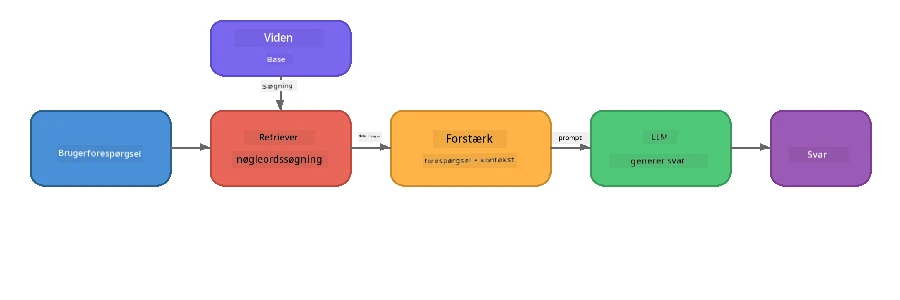

# Del 4: Byg en RAG-applikation med Foundry Local

## Oversigt

Store sprogmodeller er kraftfulde, men de kender kun det, der var i deres træningsdata. **Retrieval-Augmented Generation (RAG)** løser dette ved at give modellen relevant kontekst ved forespørgselstidspunktet - hentet fra dine egne dokumenter, databaser eller vidensbaser.

I dette laboratorium vil du bygge en komplet RAG-pipeline, der kører **helt på din enhed** ved hjælp af Foundry Local. Ingen cloud-tjenester, ingen vektordatabaser, ingen embeddings-API - bare lokal hentning og en lokal model.

## Læringsmål

Når du er færdig med dette laboratorium, vil du kunne:

- Forklare, hvad RAG er, og hvorfor det betyder noget for AI-applikationer
- Bygge en lokal vidensbase fra tekstdokumenter
- Implementere en simpel hentningsfunktion for at finde relevant kontekst
- Sætte en systemprompt sammen, der forankrer modellen i hentede fakta
- Køre hele Retrieve → Augment → Generate-pipelinen på enheden
- Forstå kompromisserne mellem simpel søgeords-hentning og vektorsøgning

---

## Forudsætninger

- Gennemfør [Del 3: Brug af Foundry Local SDK med OpenAI](part3-sdk-and-apis.md)
- Foundry Local CLI installeret og `phi-3.5-mini` modellen downloadet

---

## Koncept: Hvad er RAG?

Uden RAG kan en LLM kun svare ud fra sin træningsdata - som kan være forældet, ufuldstændig eller mangle din private information:

```
User: "What is Zava's return policy?"
LLM:  "I do not have information about Zava's return policy."  ← No context!
```

Med RAG **henter** du relevante dokumenter først, derefter **udvider** du prompten med den kontekst, før du **genererer** et svar:



Den vigtigste indsigt: **modellen behøver ikke at "vide" svaret; den skal bare læse de rigtige dokumenter.**

---

## Laboratorieøvelser

### Øvelse 1: Forstå Vidensbasen

Åbn RAG-eksemplet for dit sprog og undersøg vidensbasen:

<details>
<summary><b>🐍 Python: <code>python/foundry-local-rag.py</code></b></summary>

Vidensbasen er en simpel liste af ordbøger med felterne `title` og `content`:

```python
KNOWLEDGE_BASE = [
    {
        "title": "Foundry Local Overview",
        "content": (
            "Foundry Local brings the power of Azure AI Foundry to your local "
            "device without requiring an Azure subscription..."
        ),
    },
    {
        "title": "Supported Hardware",
        "content": (
            "Foundry Local automatically selects the best model variant for "
            "your hardware. If you have an Nvidia CUDA GPU it downloads the "
            "CUDA-optimized model..."
        ),
    },
    # ... flere poster
]
```

Hver post repræsenterer et "stykke" viden - en fokuseret informationsdel om ét emne.

</details>

<details>
<summary><b>📘 JavaScript: <code>javascript/foundry-local-rag.mjs</code></b></summary>

Vidensbasen bruger samme struktur som et array af objekter:

```javascript
const KNOWLEDGE_BASE = [
  {
    title: "Foundry Local Overview",
    content:
      "Foundry Local brings the power of Azure AI Foundry to your local " +
      "device without requiring an Azure subscription...",
  },
  {
    title: "Supported Hardware",
    content:
      "Foundry Local automatically selects the best model variant for " +
      "your hardware...",
  },
  // ... flere poster
];
```

</details>

<details>
<summary><b>💜 C#: <code>csharp/RagPipeline.cs</code></b></summary>

Vidensbasen bruger en liste af navngivne tuples:

```csharp
private static readonly List<(string Title, string Content)> KnowledgeBase =
[
    ("Foundry Local Overview",
     "Foundry Local brings the power of Azure AI Foundry to your local " +
     "device without requiring an Azure subscription..."),

    ("Supported Hardware",
     "Foundry Local automatically selects the best model variant for " +
     "your hardware..."),

    // ... more entries
];
```

</details>

> **I en rigtig applikation** ville vidensbasen komme fra filer på disken, en database, et søgeindeks eller en API. Til dette laboratorium bruger vi en liste i hukommelsen for at holde det enkelt.

---

### Øvelse 2: Forstå Hentningsfunktionen

Hentningstrinnet finder de mest relevante stykker til brugerens spørgsmål. Dette eksempel bruger **keyword overlap** - tæller hvor mange ord i forespørgslen der også findes i hvert stykke:

<details>
<summary><b>🐍 Python</b></summary>

```python
def retrieve(query: str, top_k: int = 2) -> list[dict]:
    """Return the top-k knowledge chunks most relevant to the query."""
    query_words = set(query.lower().split())
    scored = []
    for chunk in KNOWLEDGE_BASE:
        chunk_words = set(chunk["content"].lower().split())
        overlap = len(query_words & chunk_words)
        scored.append((overlap, chunk))
    scored.sort(key=lambda x: x[0], reverse=True)
    return [item[1] for item in scored[:top_k]]
```

</details>

<details>
<summary><b>📘 JavaScript</b></summary>

```javascript
function retrieve(query, topK = 2) {
  const queryWords = new Set(query.toLowerCase().split(/\s+/));
  const scored = KNOWLEDGE_BASE.map((chunk) => {
    const chunkWords = new Set(chunk.content.toLowerCase().split(/\s+/));
    let overlap = 0;
    for (const w of queryWords) {
      if (chunkWords.has(w)) overlap++;
    }
    return { overlap, chunk };
  });
  scored.sort((a, b) => b.overlap - a.overlap);
  return scored.slice(0, topK).map((s) => s.chunk);
}
```

</details>

<details>
<summary><b>💜 C#</b></summary>

```csharp
private static List<(string Title, string Content)> Retrieve(string query, int topK = 2)
{
    var queryWords = new HashSet<string>(
        query.ToLowerInvariant().Split(' ', StringSplitOptions.RemoveEmptyEntries));

    return KnowledgeBase
        .Select(chunk =>
        {
            var chunkWords = new HashSet<string>(
                chunk.Content.ToLowerInvariant().Split(' ', StringSplitOptions.RemoveEmptyEntries));
            var overlap = queryWords.Intersect(chunkWords).Count();
            return (Overlap: overlap, Chunk: chunk);
        })
        .OrderByDescending(x => x.Overlap)
        .Take(topK)
        .Select(x => x.Chunk)
        .ToList();
}
```

</details>

**Sådan fungerer det:**
1. Opdel forespørgslen i individuelle ord
2. For hvert vidensstykke tælles, hvor mange forespørgselsord optræder i stykket
3. Sorter efter overlap-score (højeste først)
4. Returner de top-k mest relevante stykker

> **Kompromis:** Keyword overlap er simpelt, men begrænset; det forstår ikke synonymer eller betydning. Produktions-RAG-systemer bruger typisk **embedding-vektorer** og en **vektordatabasen** til semantisk søgning. Keyword overlap er dog et godt udgangspunkt og kræver ingen ekstra afhængigheder.

---

### Øvelse 3: Forstå den Udvidede Prompt

Den hentede kontekst indsættes i **systemprompten**, inden den sendes til modellen:

```python
system_prompt = (
    "You are a helpful assistant. Answer the user's question using ONLY "
    "the information provided in the context below. If the context does "
    "not contain enough information, say so.\n\n"
    f"Context:\n{context_text}"
)
```

Vigtige designbeslutninger:
- **"KUN den leverede information"** - forhindrer modellen i at hallucinere fakta, der ikke findes i konteksten
- **"Hvis konteksten ikke indeholder nok information, sig det"** - opmuntrer til ærlige "jeg ved det ikke" svar
- Konteksten placeres i systembeskeden, så den former alle svar

---

### Øvelse 4: Kør RAG Pipelinien

Kør det komplette eksempel:

**Python:**
```bash
cd python
python foundry-local-rag.py
```

**JavaScript:**
```bash
cd javascript
node foundry-local-rag.mjs
```

**C#:**
```bash
cd csharp
dotnet run rag
```

Du skulle gerne se tre ting blive udskrevet:
1. **Spørgsmålet** der stilles
2. **Den hentede kontekst** - de udvalgte stykker fra vidensbasen
3. **Svaret** - genereret af modellen udelukkende med den kontekst

Eksempeloutput:
```
Question: How do I install Foundry Local and what hardware does it support?

--- Retrieved Context ---
### Installation
On Windows install Foundry Local with: winget install Microsoft.FoundryLocal...

### Supported Hardware
Foundry Local automatically selects the best model variant for your hardware...
-------------------------

Answer: To install Foundry Local, you can use the following methods depending
on your operating system: On Windows, run `winget install Microsoft.FoundryLocal`.
On macOS, use `brew install microsoft/foundrylocal/foundrylocal`...
```

Bemærk hvordan modellens svar er **forankret** i den hentede kontekst - den nævner kun fakta fra vidensbasens dokumenter.

---

### Øvelse 5: Eksperimenter og Udvid

Prøv disse ændringer for at fordybe din forståelse:

1. **Skift spørgsmålet** - spørg om noget der ER i vidensbasen kontra noget der IKKE ER:
   ```python
   question = "What programming languages does Foundry Local support?"  # ← I kontekst
   question = "How much does Foundry Local cost?"                       # ← Ikke i kontekst
   ```
   Siger modellen korrekt "jeg ved det ikke", når svaret ikke er i konteksten?

2. **Tilføj et nyt vidensstykke** - tilføj en ny post til `KNOWLEDGE_BASE`:
   ```python
   {
       "title": "Pricing",
       "content": "Foundry Local is completely free and open source under the MIT license.",
   }
   ```
   Stil nu pris-spørgsmålet igen.

3. **Skift `top_k`** - hent flere eller færre stykker:
   ```python
   context_chunks = retrieve(question, top_k=3)  # Mere kontekst
   context_chunks = retrieve(question, top_k=1)  # Mindre kontekst
   ```
   Hvordan påvirker mængden af kontekst svarenes kvalitet?

4. **Fjern forankringsinstruktionen** - ændr systemprompten til blot "Du er en hjælpsom assistent." og se om modellen begynder at hallucinere fakta.

---

## Dybdegående: Optimering af RAG til On-Device Performance

At køre RAG på enheden introducerer begrænsninger, du ikke har i skyen: begrænset RAM, ingen dedikeret GPU (CPU/NPU-udførelse), og et lille kontekstvindue i modellen. Designbeslutningerne nedenfor adresserer disse begrænsninger direkte og er baseret på mønstre fra produktionsstil lokale RAG-applikationer, bygget med Foundry Local.

### Chunking-strategi: Fast størrelse med glidende vindue

Chunking - hvordan du opdele dokumenter i stykker - er en af de mest effektfulde beslutninger i ethvert RAG-system. Til on-device scenarier anbefales en **fast størrelse glidende vindue med overlap** som udgangspunkt:

| Parameter | Anbefalet værdi | Hvorfor |
|-----------|-----------------|---------|
| **Chunk-størrelse** | ~200 tokens | Holder hentet kontekst kompakt og giver plads i Phi-3.5 Minis kontekstvindue til systemprompt, samtalehistorik og genereret output |
| **Overlap** | ~25 tokens (12.5%) | Forhindrer informationstab ved chunk-grænser - vigtigt for procedurer og trin-for-trin instruktioner |
| **Tokenisering** | Opdeling ved mellemrum | Ingen afhængigheder, ingen tokeniseringsbibliotek nødvendigt. Al beregningskraft bruges til LLM |

Overlappet fungerer som et glidende vindue: hvert nyt chunk starter 25 tokens før det forrige sluttede, så sætninger der spænder over chunk-grænser optræder i begge.

> **Hvorfor ikke andre strategier?**
> - **Sætningsbaseret opdeling** giver uforudsigelige chunk-størrelser; nogle sikkerhedsprocedurer er lange enkelt-sætninger, som ikke splitter godt
> - **Sektionokendskab opdeling** (på `##` overskrifter) skaber meget forskellige chunk-størrelser - nogle for små, andre for store for modellens kontekstvindue
> - **Semantisk chunking** (embedding-baseret emne-detektion) giver bedste hentningskvalitet, men kræver en anden model i hukommelsen ved siden af Phi-3.5 Mini - risikabelt på hardware med 8-16 GB delt hukommelse

### Opgradering af hentning: TF-IDF vektorer

Keyword overlap-tilgangen i dette laboratorium virker, men hvis du ønsker bedre hentning uden at tilføje en embedding-model, er **TF-IDF (Term Frequency-Inverse Document Frequency)** et fremragende midtpunkt:

```
Keyword Overlap  →  TF-IDF Vectors  →  Embedding Models
    (this lab)     (lightweight upgrade)   (production)
  Simple & fast    Better ranking,         Best quality,
  No dependencies  still no ML model       requires embedding model
  ~Basic matching  ~1ms retrieval          ~100-500ms per query
```

TF-IDF konverterer hvert chunk til en numerisk vektor baseret på, hvor vigtigt hvert ord er inden for det chunk *relativt til alle chucks*. Ved query tid vektoriseres spørgsmålet på samme måde og sammenlignes med cosinus-lighed. Du kan implementere dette med SQLite og ren JavaScript/Python - ingen vektordatabaser, ingen embedding-API.

> **Ydelse:** TF-IDF cosinus-lighed over faststørrelses-chunks opnår typisk **~1 ms hentning**, sammenlignet med ~100-500 ms når en embeddingmodel koder hver forespørgsel. Alle 20+ dokumenter kan chunkes og indekseres på under et sekund.

### Edge/Compact Mode for begrænsede enheder

Når du kører på meget begrænset hardware (ældre bærbare, tablets, felt-enheder), kan du reducere ressourceforbruget ved at skrue tre knapper ned:

| Indstilling | Standard Mode | Edge/Compact Mode |
|-------------|---------------|-------------------|
| **Systemprompt** | ~300 tokens | ~80 tokens |
| **Maks output tokens** | 1024 | 512 |
| **Hentede chunks (top-k)** | 5 | 3 |

Færre hentede chunks betyder mindre kontekst for modellen at bearbejde, hvilket reducerer latenstid og hukommelsespres. En kortere systemprompt frigør mere af kontekstvinduet til det faktiske svar. Dette kompromis er værdifuldt på enheder, hvor hvert token i kontekstvinduet tæller.

### Enkelt model i hukommelsen

Et af de vigtigste principper for on-device RAG: **hold kun én model indlæst**. Hvis du bruger en embedding-model til hentning *og* en sprogmodel til generering, deler du begrænsede NPU/RAM-ressourcer mellem to modeller. Letvægts-hentning (keyword overlap, TF-IDF) undgår dette fuldstændigt:

- Ingen embedding-model der konkurrerer om hukommelse med LLM
- Hurtigere koldstart - kun én model at indlæse
- Forudsigeligt hukommelsesforbrug - LLM får alle tilgængelige ressourcer
- Virker på maskiner med så lidt som 8 GB RAM

### SQLite som lokal vektorlager

Til små-til-mellemstore dokumentsamlinger (hundrede til lav tusinder af chunks) er **SQLite hurtigt nok** til brute-force cosinus-lighedssøgning og tilføjer ingen infrastruktur:

- En enkelt `.db` fil på disken - ingen serverproces, ingen konfiguration
- Følger med hver større sprog-runtime (Python `sqlite3`, Node.js `better-sqlite3`, .NET `Microsoft.Data.Sqlite`)
- Gemmer dokument-chunks sammen med deres TF-IDF vektorer i én tabel
- Ingen behov for Pinecone, Qdrant, Chroma eller FAISS ved denne skala

### Ydelsessammenfatning

Disse designvalg kombineres for at levere responsiv RAG på forbrugerhardware:

| Metrik | On-Device Performance |
|--------|-----------------------|
| **Hentningslatenstid** | ~1 ms (TF-IDF) til ~5 ms (keyword overlap) |
| **Indlæsninghastighed** | 20 dokumenter chunket og indekseret på under 1 sekund |
| **Modeller i hukommelsen** | 1 (kun LLM - ingen embedding-model) |
| **Lagringsomkostning** | < 1 MB for chunks + vektorer i SQLite |
| **Koldstart** | Single modelload, ingen embedding runtime startup |
| **Hardware minimum** | 8 GB RAM, CPU-only (ingen GPU nødvendig) |

> **Hvornår opgradere:** Hvis du skalerer til hundredevis af lange dokumenter, blandede indholdstyper (tabeller, kode, prosa), eller har brug for semantisk forståelse af forespørgsler, overvej at tilføje en embeddingmodel og skifte til vektorlighedssøgning. For de fleste on-device brugsscenarier med fokuserede dokumentsæt leverer TF-IDF + SQLite fremragende resultater med minimal ressourcebrug.

---

## Nøglebegreber

| Begreb | Beskrivelse |
|---------|------------|
| **Retrieval** | At finde relevante dokumenter fra en vidensbase baseret på brugerens forespørgsel |
| **Augmentation** | At indsætte hentede dokumenter i prompten som kontekst |
| **Generation** | At LLM producerer et svar forankret i den leverede kontekst |
| **Chunking** | At opdele store dokumenter i mindre, fokuserede stykker |
| **Grounding** | At begrænse modellen til kun at bruge leveret kontekst (reducerer hallucinering) |
| **Top-k** | Antallet af mest relevante chunks, der hentes |

---

## RAG i produktion vs. dette laboratorium

| Aspekt | Dette laboratorium | On-Device optimeret | Cloud produktion |
|--------|--------------------|---------------------|------------------|
| **Vidensbase** | Liste i hukommelsen | Filer på disken, SQLite | Database, søgeindeks |
| **Hentning** | Keyword overlap | TF-IDF + cosinus-lighed | Vektor-embeddings + søgning på lighed |
| **Embeddings** | Ingen nødvendige | Ingen - TF-IDF vektorer | Embeddingmodel (lokal eller cloud) |
| **Vektorlager** | Ingen nødvendig | SQLite (enkelt `.db` fil) | FAISS, Chroma, Azure AI Search, m.fl. |
| **Chunking** | Manuel | Fast størrelses glidende vindue (~200 tokens, 25 tokens overlap) | Semantisk eller rekursiv chunking |
| **Modeller i hukommelsen** | 1 (LLM) | 1 (LLM) | 2+ (embedding + LLM) |
| **Genfindingsforsinkelse** | ~5ms | ~1ms | ~100-500ms |
| **Skala** | 5 dokumenter | Hundreder af dokumenter | Millioner af dokumenter |

De mønstre, du lærer her (genfind, forøg, generer), er de samme på enhver skala. Genfindingsmetoden forbedres, men den overordnede arkitektur forbliver identisk. Den midterste kolonne viser, hvad der er opnåeligt på enheden med letvægtsmetoder, ofte det ideelle for lokale applikationer, hvor du bytter skala i skyen for privatliv, offline-funktionalitet og nul forsinkelse til eksterne tjenester.

---

## Vigtige pointer

| Koncept | Hvad du lærte |
|---------|------------------|
| RAG-mønster | Genfind + Forøg + Generer: giv modellen den rette kontekst, og den kan besvare spørgsmål om dine data |
| På enheden | Alt kører lokalt uden cloud-API'er eller abonnementer på vektordatabaser |
| Grundlæggende instruktioner | Systempromptbegrænsninger er kritiske for at forhindre hallucination |
| Nøgleords-overlap | Et simpelt, men effektivt udgangspunkt for genfinding |
| TF-IDF + SQLite | En letvægtsopgraderingsvej, der holder genfinding under 1ms uden indlejringsmodel |
| En model i hukommelsen | Undgå at indlæse en indlejringsmodel sammen med LLM på begrænset hardware |
| Chunk-størrelse | Cirka 200 tokens med overlap balancerer genfindingspræcision og kontekstvindues effektivitet |
| Edge/kompakt tilstand | Brug færre chunks og kortere prompts til meget begrænsede enheder |
| Universelt mønster | Den samme RAG-arkitektur fungerer for enhver datakilde: dokumenter, databaser, API'er eller wikis |

> **Vil du se en fuld RAG-applikation på enheden?** Tjek [Gas Field Local RAG](https://github.com/leestott/local-rag), en produktionslignende offline RAG-agent bygget med Foundry Local og Phi-3.5 Mini, der demonstrerer disse optimeringsmønstre med et reelt dokument sæt.

---

## Næste skridt

Fortsæt til [Del 5: Bygning af AI-agenter](part5-single-agents.md) for at lære, hvordan man bygger intelligente agenter med personligheder, instruktioner og multiturn samtaler ved hjælp af Microsoft Agent Framework.

---

<!-- CO-OP TRANSLATOR DISCLAIMER START -->
**Ansvarsfraskrivelse**:
Dette dokument er blevet oversat ved hjælp af AI-oversættelsestjenesten [Co-op Translator](https://github.com/Azure/co-op-translator). Selvom vi bestræber os på nøjagtighed, skal du være opmærksom på, at automatiske oversættelser kan indeholde fejl eller unøjagtigheder. Det originale dokument på dets modersmål bør betragtes som den autoritative kilde. For kritisk information anbefales professionel menneskelig oversættelse. Vi påtager os intet ansvar for eventuelle misforståelser eller fejltolkninger, der opstår som følge af brugen af denne oversættelse.
<!-- CO-OP TRANSLATOR DISCLAIMER END -->