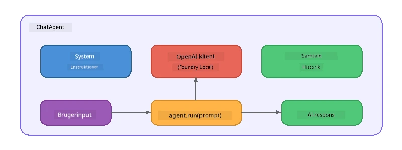

# Del 5: Byg AI-Agenter med Agent Framework

> **Mål:** Byg din første AI-agent med vedvarende instruktioner og en defineret persona, drevet af en lokal model via Foundry Local.

## Hvad er en AI-Agent?

En AI-agent indkapsler en sprogmodel med **systeminstruktioner**, der definerer dens adfærd, personlighed og begrænsninger. I modsætning til et enkelt chat-fuldførelseskald leverer en agent:

- **Persona** – en konsekvent identitet ("Du er en hjælpsom kodeanmelder")
- **Hukommelse** – samtalehistorik på tværs af runder
- **Specialisering** – fokuseret adfærd drevet af veludformede instruktioner



---

## Microsoft Agent Framework

**Microsoft Agent Framework** (AGF) giver en standard agentabstraktion, der fungerer på tværs af forskellige model-backends. I denne workshop kombinerer vi det med Foundry Local, så alt kører på din maskine – ingen sky nødvendig.

| Begreb | Beskrivelse |
|---------|-------------|
| `FoundryLocalClient` | Python: håndterer tjenestestart, model-download/loading og opretter agenter |
| `client.as_agent()` | Python: opretter en agent fra Foundry Local klienten |
| `AsAIAgent()` | C#: extensionsmetode på `ChatClient` – opretter en `AIAgent` |
| `instructions` | Systemprompt, der former agentens adfærd |
| `name` | Menneskelæsbart label, nyttigt i multi-agent scenarier |
| `agent.run(prompt)` / `RunAsync()` | Sender en brugermeddelelse og returnerer agentens svar |

> **Note:** Agent Framework findes som SDK til Python og .NET. For JavaScript implementerer vi en letvægts `ChatAgent` klasse, der følger samme mønster med OpenAI SDK direkte.

---

## Øvelser

### Øvelse 1 – Forstå Agentmønsteret

Før du skriver kode, undersøg nøglekomponenterne i en agent:

1. **Modelklient** – forbinder til Foundry Locals OpenAI-kompatible API
2. **Systeminstruktioner** – "personligheds"-prompten
3. **Kør-løkke** – send brugerinput, modtag output

> **Tænk over det:** Hvordan adskiller systeminstruktioner sig fra en almindelig brugermeddelelse? Hvad sker der, hvis du ændrer dem?

---

### Øvelse 2 – Kør Single-Agent-eksemplet

<details>
<summary><strong>🐍 Python</strong></summary>

**Forudsætninger:**
```bash
cd python
python -m venv venv

# Windows (PowerShell):
venv\Scripts\Activate.ps1
# macOS:
source venv/bin/activate

pip install -r requirements.txt
```

**Kør:**
```bash
python foundry-local-with-agf.py
```

**Kodegennemgang** (`python/foundry-local-with-agf.py`):

```python
import asyncio
from agent_framework_foundry_local import FoundryLocalClient

async def main():
    alias = "phi-4-mini"

    # FoundryLocalClient håndterer service start, model download og indlæsning
    client = FoundryLocalClient(model_id=alias)
    print(f"Client Model ID: {client.model_id}")

    # Opret en agent med systeminstruktioner
    agent = client.as_agent(
        name="Joker",
        instructions="You are good at telling jokes.",
    )

    # Ikke-streaming: få det komplette svar på én gang
    result = await agent.run("Tell me a joke about a pirate.")
    print(f"Agent: {result}")

    # Streaming: få resultater, efterhånden som de genereres
    async for chunk in agent.run("Tell me another joke.", stream=True):
        if chunk.text:
            print(chunk.text, end="", flush=True)

asyncio.run(main())
```

**Vigtige punkter:**
- `FoundryLocalClient(model_id=alias)` håndterer tjenestestart, download og modelloading i ét trin
- `client.as_agent()` opretter en agent med systeminstruktioner og navn
- `agent.run()` understøtter både ikke-streaming og streaming tilstande
- Installer via `pip install agent-framework-foundry-local --pre`

</details>

<details>
<summary><strong>📦 JavaScript</strong></summary>

**Forudsætninger:**
```bash
cd javascript
npm install
```

**Kør:**
```bash
node foundry-local-with-agent.mjs
```

**Kodegennemgang** (`javascript/foundry-local-with-agent.mjs`):

```javascript
import { OpenAI } from "openai";
import { FoundryLocalManager } from "foundry-local-sdk";

class ChatAgent {
  constructor({ client, modelId, instructions, name }) {
    this.client = client;
    this.modelId = modelId;
    this.instructions = instructions;
    this.name = name;
    this.history = [];
  }

  async run(userMessage) {
    const messages = [
      { role: "system", content: this.instructions },
      ...this.history,
      { role: "user", content: userMessage },
    ];
    const response = await this.client.chat.completions.create({
      model: this.modelId,
      messages,
    });
    const assistantMessage = response.choices[0].message.content;

    // Gem samtalehistorik til interaktioner med flere udvekslinger
    this.history.push({ role: "user", content: userMessage });
    this.history.push({ role: "assistant", content: assistantMessage });
    return { text: assistantMessage };
  }
}

async function main() {
  FoundryLocalManager.create({ appName: "FoundryLocalWorkshop" });
  const manager = FoundryLocalManager.instance;
  await manager.startWebService();

  const catalog = manager.catalog;
  const model = await catalog.getModel("phi-3.5-mini");
  if (!model.isCached) {
    console.log("Downloading model: phi-3.5-mini...");
    await model.download();
  }
  await model.load();

  const client = new OpenAI({
    baseURL: manager.urls[0] + "/v1",
    apiKey: "foundry-local",
  });

  const agent = new ChatAgent({
    client,
    modelId: model.id,
    instructions: "You are good at telling jokes.",
    name: "Joker",
  });

  const result = await agent.run("Tell me a joke about a pirate.");
  console.log(result.text);
}

main();
```

**Vigtige punkter:**
- JavaScript bygger sin egen `ChatAgent`-klasse, der spejler Python AGF-mønsteret
- `this.history` gemmer samtalerunder for multi-turn understøttelse
- Eksplicit `startWebService()` → cache-tjek → `model.download()` → `model.load()` giver fuld synlighed

</details>

<details>
<summary><strong>💜 C#</strong></summary>

**Forudsætninger:**
```bash
cd csharp
dotnet restore
```

**Kør:**
```bash
dotnet run agent
```

**Kodegennemgang** (`csharp/SingleAgent.cs`):

```csharp
using Microsoft.AI.Foundry.Local;
using Microsoft.Extensions.Logging.Abstractions;
using Microsoft.Agents.AI;
using OpenAI;
using System.ClientModel;

// 1. Start Foundry Local and load a model
var alias = "phi-3.5-mini";
await FoundryLocalManager.CreateAsync(
    new Configuration
    {
        AppName = "FoundryLocalSamples",
        Web = new Configuration.WebService { Urls = "http://127.0.0.1:0" }
    }, NullLogger.Instance, default);
var manager = FoundryLocalManager.Instance;
await manager.StartWebServiceAsync(default);

var catalog = await manager.GetCatalogAsync(default);
var model = await catalog.GetModelAsync(alias, default);

var isCached = await model.IsCachedAsync(default);
if (!isCached)
{
    Console.WriteLine($"Downloading model: {alias}...");
    await model.DownloadAsync(null, default);
}
await model.LoadAsync(default);

var key = new ApiKeyCredential("foundry-local");
var client = new OpenAIClient(key, new OpenAIClientOptions
{
    Endpoint = new Uri(manager.Urls[0] + "/v1")
});

// 2. Create an AIAgent using the Agent Framework extension method
AIAgent joker = client
    .GetChatClient(model.Id)
    .AsAIAgent(
        instructions: "You are good at telling jokes. Keep your jokes short and family-friendly.",
        name: "Joker"
    );

// 3. Run the agent (non-streaming)
var response = await joker.RunAsync("Tell me a joke about a pirate.");
Console.WriteLine($"Joker: {response}");

// 4. Run with streaming
await foreach (var update in joker.RunStreamingAsync("Tell me another joke."))
{
    Console.Write(update);
}
```

**Vigtige punkter:**
- `AsAIAgent()` er en extensionsmetode fra `Microsoft.Agents.AI.OpenAI` – ingen brugerdefineret `ChatAgent` klasse nødvendig
- `RunAsync()` returnerer det fulde svar; `RunStreamingAsync()` streamer token for token
- Installer via `dotnet add package Microsoft.Agents.AI.OpenAI --version 1.0.0-rc3`

</details>

---

### Øvelse 3 – Skift Persona

Ændr agentens `instructions` for at skabe en anden persona. Prøv hver enkelt og observer, hvordan output ændrer sig:

| Persona | Instruktioner |
|---------|--------------|
| Kodeanmelder | `"Du er en ekspert kodeanmelder. Giv konstruktiv feedback med fokus på læsbarhed, ydeevne og korrekthed."` |
| Rejseguide | `"Du er en venlig rejseguide. Giv personlige anbefalinger til destinationer, aktiviteter og lokal mad."` |
| Sokratisk Tutor | `"Du er en sokratisk tutor. Giv aldrig direkte svar – guid i stedet eleven med velovervejede spørgsmål."` |
| Teknisk Skribent | `"Du er en teknisk skribent. Forklar begreber klart og koncist. Brug eksempler. Undgå jargon."` |

**Prøv det:**
1. Vælg en persona fra tabellen ovenfor
2. Udskift `instructions`-strengen i koden
3. Juster brugerprompten til at matche (f.eks. bed kodeanmelderen om at gennemgå en funktion)
4. Kør eksemplet igen og sammenlign output

> **Tip:** Kvaliteten af en agent afhænger i høj grad af instruktionerne. Specifikke, velstrukturerede instruktioner giver bedre resultater end vage.

---

### Øvelse 4 – Tilføj Multi-Turn Samtale

Udvid eksemplet til at understøtte en multi-turn chat-løkke, så du kan have en frem-og-tilbage samtale med agenten.

<details>
<summary><strong>🐍 Python - multi-turn løkke</strong></summary>

```python
import asyncio
from agent_framework_foundry_local import FoundryLocalClient

async def main():
    client = FoundryLocalClient(model_id="phi-4-mini")

    agent = client.as_agent(
        name="Assistant",
        instructions="You are a helpful assistant.",
    )

    print("Chat with the agent (type 'quit' to exit):\n")
    while True:
        user_input = input("You: ")
        if user_input.strip().lower() in ("quit", "exit"):
            break
        result = await agent.run(user_input)
        print(f"Agent: {result}\n")

asyncio.run(main())
```

</details>

<details>
<summary><strong>📦 JavaScript - multi-turn løkke</strong></summary>

```javascript
import { OpenAI } from "openai";
import { FoundryLocalManager } from "foundry-local-sdk";
import * as readline from "node:readline/promises";

// (genbrug ChatAgent-klassen fra Øvelse 2)

async function main() {
  FoundryLocalManager.create({ appName: "FoundryLocalWorkshop" });
  const manager = FoundryLocalManager.instance;
  await manager.startWebService();

  const catalog = manager.catalog;
  const model = await catalog.getModel("phi-3.5-mini");
  if (!model.isCached) {
    console.log("Downloading model: phi-3.5-mini...");
    await model.download();
  }
  await model.load();

  const client = new OpenAI({
    baseURL: manager.urls[0] + "/v1",
    apiKey: "foundry-local",
  });

  const agent = new ChatAgent({
    client,
    modelId: model.id,
    instructions: "You are a helpful assistant.",
    name: "Assistant",
  });

  const rl = readline.createInterface({
    input: process.stdin,
    output: process.stdout,
  });

  console.log("Chat with the agent (type 'quit' to exit):\n");
  while (true) {
    const userInput = await rl.question("You: ");
    if (["quit", "exit"].includes(userInput.trim().toLowerCase())) break;
    const result = await agent.run(userInput);
    console.log(`Agent: ${result.text}\n`);
  }
  rl.close();
}

main();
```

</details>

<details>
<summary><strong>💜 C# - multi-turn løkke</strong></summary>

```csharp
using Microsoft.AI.Foundry.Local;
using Microsoft.Extensions.Logging.Abstractions;
using Microsoft.Agents.AI;
using OpenAI;
using System.ClientModel;

var alias = "phi-3.5-mini";
var config = new Configuration
{
    AppName = "FoundryLocalSamples",
    Web = new Configuration.WebService { Urls = "http://127.0.0.1:0" }
};
await FoundryLocalManager.CreateAsync(config, NullLogger.Instance, default);
var manager = FoundryLocalManager.Instance;
await manager.StartWebServiceAsync(default);

var catalog = await manager.GetCatalogAsync(default);
var model = await catalog.GetModelAsync(alias, default);

var isCached = await model.IsCachedAsync(default);
if (!isCached)
{
    Console.WriteLine($"Downloading model: {alias}...");
    await model.DownloadAsync(null, default);
}
await model.LoadAsync(default);

var key = new ApiKeyCredential("foundry-local");
var client = new OpenAIClient(key, new OpenAIClientOptions
{
    Endpoint = new Uri(manager.Urls[0] + "/v1")
});

AIAgent agent = client
    .GetChatClient(model.Id)
    .AsAIAgent(
        instructions: "You are a helpful assistant.",
        name: "Assistant"
    );

Console.WriteLine("Chat with the agent (type 'quit' to exit):\n");
while (true)
{
    Console.Write("You: ");
    var userInput = Console.ReadLine();
    if (string.IsNullOrWhiteSpace(userInput) ||
        userInput.Equals("quit", StringComparison.OrdinalIgnoreCase) ||
        userInput.Equals("exit", StringComparison.OrdinalIgnoreCase))
        break;

    var result = await agent.RunAsync(userInput);
    Console.WriteLine($"Agent: {result}\n");
}
```

</details>

Bemærk, hvordan agenten husker tidligere runder – stil et opfølgende spørgsmål og se, hvordan konteksten bevares.

---

### Øvelse 5 – Struktureret Output

Instruer agenten til altid at svare i et specifikt format (f.eks. JSON) og parse resultatet:

<details>
<summary><strong>🐍 Python - JSON output</strong></summary>

```python
import asyncio
import json
from agent_framework_foundry_local import FoundryLocalClient

async def main():
    client = FoundryLocalClient(model_id="phi-4-mini")

    agent = client.as_agent(
        name="SentimentAnalyzer",
        instructions=(
            "You are a sentiment analysis agent. "
            "For every user message, respond ONLY with valid JSON in this format: "
            '{"sentiment": "positive|negative|neutral", "confidence": 0.0-1.0, "summary": "brief reason"}'
        ),
    )

    result = await agent.run("I absolutely loved the new restaurant downtown!")
    print("Raw:", result)

    try:
        parsed = json.loads(str(result))
        print(f"Sentiment: {parsed['sentiment']} (confidence: {parsed['confidence']})")
    except json.JSONDecodeError:
        print("Agent did not return valid JSON - try refining the instructions.")

asyncio.run(main())
```

</details>

<details>
<summary><strong>💜 C# - JSON output</strong></summary>

```csharp
using System.Text.Json;

AIAgent analyzer = chatClient.AsAIAgent(
    name: "SentimentAnalyzer",
    instructions:
        "You are a sentiment analysis agent. " +
        "For every user message, respond ONLY with valid JSON in this format: " +
        "{\"sentiment\": \"positive|negative|neutral\", \"confidence\": 0.0-1.0, \"summary\": \"brief reason\"}"
);

var response = await analyzer.RunAsync("I absolutely loved the new restaurant downtown!");
Console.WriteLine($"Raw: {response}");

try
{
    var parsed = JsonSerializer.Deserialize<JsonElement>(response.ToString());
    Console.WriteLine($"Sentiment: {parsed.GetProperty("sentiment")} " +
                      $"(confidence: {parsed.GetProperty("confidence")})");
}
catch (JsonException)
{
    Console.WriteLine("Agent did not return valid JSON - try refining the instructions.");
}
```

</details>

> **Note:** Små lokale modeller producerer ikke altid perfekt gyldig JSON. Du kan øge pålideligheden ved at inkludere et eksempel i instruktionerne og være meget eksplicit omkring det forventede format.

---

## Vigtigste Erfaringer

| Begreb | Hvad Du Har Lært |
|---------|------------------|
| Agent vs. rå LLM-kald | En agent omslutter en model med instruktioner og hukommelse |
| Systeminstruktioner | Den vigtigste faktor til at kontrollere agentens adfærd |
| Multi-turn samtale | Agenter kan bære kontekst over flere brugerinteraktioner |
| Struktureret output | Instruktioner kan håndhæve outputformat (JSON, markdown osv.) |
| Lokal eksekvering | Alt kører lokalt via Foundry Local – ingen sky nødvendig |

---

## Næste Skridt

I **[Del 6: Multi-Agent Workflows](part6-multi-agent-workflows.md)** vil du kombinere flere agenter i en koordineret pipeline, hvor hver agent har en specialiseret rolle.

---

<!-- CO-OP TRANSLATOR DISCLAIMER START -->
**Ansvarsfraskrivelse**:  
Dette dokument er blevet oversat ved hjælp af AI-oversættelsestjenesten [Co-op Translator](https://github.com/Azure/co-op-translator). Selvom vi bestræber os på nøjagtighed, bedes du være opmærksom på, at automatiserede oversættelser kan indeholde fejl eller unøjagtigheder. Det originale dokument på dets oprindelige sprog bør betragtes som den autoritative kilde. For kritisk information anbefales professionel menneskelig oversættelse. Vi påtager os intet ansvar for misforståelser eller fejltolkninger, der opstår som følge af brugen af denne oversættelse.
<!-- CO-OP TRANSLATOR DISCLAIMER END -->