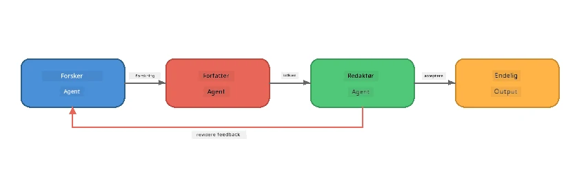
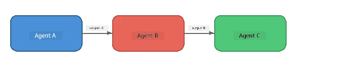
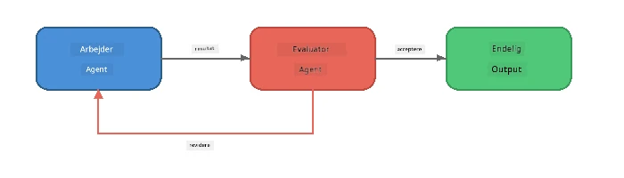
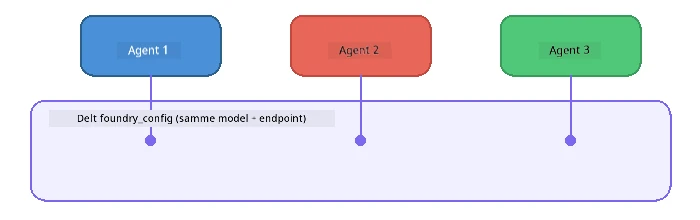

# Del 6: Multi-Agent Arbejdsgange

> **Mål:** Kombiner flere specialiserede agenter i koordinerede pipelines, der deler komplekse opgaver mellem samarbejdende agenter – alt sammen kørende lokalt med Foundry Local.

## Hvorfor Multi-Agent?

En enkelt agent kan håndtere mange opgaver, men komplekse arbejdsgange drager fordel af **Specialisering**. I stedet for at én agent prøver at forske, skrive og redigere samtidig, opdeler du arbejdet i fokuserede roller:



| Mønster | Beskrivelse |
|---------|-------------|
| **Sekventiel** | Output fra Agent A føres videre til Agent B → Agent C |
| **Feedback loop** | En evaluator-agent kan sende arbejde tilbage til revision |
| **Delt kontekst** | Alle agenter bruger samme model/endpoint, men forskellige instruktioner |
| **Typed output** | Agenter producerer strukturerede resultater (JSON) for pålidelig overlevering |

---

## Øvelser

### Øvelse 1 - Kør Multi-Agent Pipeline

Workshoppen indeholder en komplet Researcher → Writer → Editor arbejdsgang.

<details>
<summary><strong>🐍 Python</strong></summary>

**Setup:**
```bash
cd python
python -m venv venv

# Windows (PowerShell):
venv\Scripts\Activate.ps1
# macOS:
source venv/bin/activate

pip install -r requirements.txt
```

**Kør:**
```bash
python foundry-local-multi-agent.py
```

**Hvad sker der:**
1. **Researcher** modtager et emne og returnerer punktformede fakta
2. **Writer** tager forskningen og udarbejder et blogindlæg (3-4 afsnit)
3. **Editor** gennemgår artiklen for kvalitet og returnerer ACCEPT eller REVISE

</details>

<details>
<summary><strong>📦 JavaScript</strong></summary>

**Setup:**
```bash
cd javascript
npm install
```

**Kør:**
```bash
node foundry-local-multi-agent.mjs
```

**Samme tretrins pipeline** - Researcher → Writer → Editor.

</details>

<details>
<summary><strong>💜 C#</strong></summary>

**Setup:**
```bash
cd csharp
dotnet restore
```

**Kør:**
```bash
dotnet run multi
```

**Samme tretrins pipeline** - Researcher → Writer → Editor.

</details>

---

### Øvelse 2 - Pipeline Anatomi

Studér, hvordan agenter defineres og forbindes:

**1. Delt modelklient**

Alle agenter deler den samme Foundry Local model:

```python
# Python - FoundryLocalClient håndterer alt
from agent_framework_foundry_local import FoundryLocalClient

client = FoundryLocalClient(model_id="phi-3.5-mini")
```

```javascript
// JavaScript - OpenAI SDK rettet mod Foundry Local
const client = new OpenAI({
  baseURL: manager.urls[0] + "/v1",
  apiKey: "foundry-local",
});
```

```csharp
// C# - OpenAIClient pointed at Foundry Local
var key = new ApiKeyCredential("foundry-local");
var client = new OpenAIClient(key, new OpenAIClientOptions
{
    Endpoint = new Uri(manager.Urls[0] + "/v1")
});
var chatClient = client.GetChatClient(model.Id);
```

**2. specialiserede instruktioner**

Hver agent har en distinkt persona:

| Agent | Instruktioner (resumé) |
|-------|----------------------|
| Researcher | "Giv nøglefakta, statistikker og baggrund. Organiser som punktformer." |
| Writer | "Skriv et engagerende blogindlæg (3-4 afsnit) baseret på forskningsnoterne. Find ikke på fakta." |
| Editor | "Gennemgå for klarhed, grammatik og faktuel konsistens. Dom: ACCEPT eller REVISE." |

**3. Dataflow mellem agenter**

```python
# Trin 1 - output fra forsker bliver input til forfatter
research_result = await researcher.run(f"Research: {topic}")

# Trin 2 - output fra forfatter bliver input til redaktør
writer_result = await writer.run(f"Write using:\n{research_result}")

# Trin 3 - redaktør gennemgår både forskning og artikel
editor_result = await editor.run(
    f"Research:\n{research_result}\n\nArticle:\n{writer_result}"
)
```

```csharp
// C# - same pattern, async calls with AIAgent
var researchNotes = await researcher.RunAsync(
    $"Research the following topic and provide key facts:\n{topic}");

var draft = await writer.RunAsync(
    $"Write a blog post based on these research notes:\n\n{researchNotes}");

var verdict = await editor.RunAsync(
    $"Review this article for quality and accuracy.\n\n" +
    $"Research notes:\n{researchNotes}\n\n" +
    $"Article:\n{draft}");
```

> **Vigtig indsigt:** Hver agent modtager den akkumulerede kontekst fra tidligere agenter. Editor ser både den oprindelige forskning og udkastet – dette gør det muligt at tjekke faktuel konsistens.

---

### Øvelse 3 - Tilføj en Fjerde Agent

Udvid pipeline ved at tilføje en ny agent. Vælg en:

| Agent | Formål | Instruktioner |
|-------|---------|-------------|
| **Fact-Checker** | Verificer påstande i artiklen | `"Du verificerer faktuelle påstande. For hver påstand angiv om den understøttes af forskningsnoterne. Returner JSON med verificerede/ikke-verificerede elementer."` |
| **Headline Writer** | Skab fangende overskrifter | `"Generer 5 overskriftsmuligheder til artiklen. Varier stil: informativ, clickbait, spørgsmål, liste, følelsesladet."` |
| **Social Media** | Skab promoveringsopslag | `"Lav 3 sociale medie-opslag for at promovere denne artikel: et til Twitter (280 tegn), et til LinkedIn (professionel tone), et til Instagram (uformelt med emoji-forslag)."` |

<details>
<summary><strong>🐍 Python - tilføjelse af Headline Writer</strong></summary>

```python
headline_agent = client.as_agent(
    name="HeadlineWriter",
    instructions=(
        "You are a headline specialist. Given an article, generate exactly "
        "5 headline options. Vary the style: informative, question-based, "
        "listicle, emotional, and provocative. Return them as a numbered list."
    ),
)

# Efter redaktøren accepterer, generer overskrifter
headline_result = await headline_agent.run(
    f"Generate headlines for this article:\n\n{writer_result}"
)
print(f"\n--- Headlines ---\n{headline_result}")
```

</details>

<details>
<summary><strong>📦 JavaScript - tilføjelse af Headline Writer</strong></summary>

```javascript
const headlineAgent = new ChatAgent({
  client,
  modelId: modelInfo.id,
  instructions:
    "You are a headline specialist. Given an article, generate exactly " +
    "5 headline options. Vary the style: informative, question-based, " +
    "listicle, emotional, and provocative. Return them as a numbered list.",
  name: "HeadlineWriter",
});

const headlineResult = await headlineAgent.run(
  `Generate headlines for this article:\n\n${writerResult.text}`
);
console.log(`\n--- Headlines ---\n${headlineResult.text}`);
```

</details>

<details>
<summary><strong>💜 C# - tilføjelse af Headline Writer</strong></summary>

```csharp
AIAgent headlineAgent = chatClient.AsAIAgent(
    name: "HeadlineWriter",
    instructions:
        "You are a headline specialist. Given an article, generate exactly " +
        "5 headline options. Vary the style: informative, question-based, " +
        "listicle, emotional, and provocative. Return them as a numbered list."
);

// After the editor accepts, generate headlines
var headlines = await headlineAgent.RunAsync(
    $"Generate headlines for this article:\n\n{draft}");
Console.WriteLine($"\n--- Headlines ---\n{headlines}");
```

</details>

---

### Øvelse 4 - Design Din Egen Arbejdsgang

Design en multi-agent pipeline til et andet domæne. Her er nogle ideer:

| Domæne | Agenter | Flow |
|--------|--------|------|
| **Kodegennemgang** | Analyser → Reviewer → Opsummerer | Analyser kodestruktur → gennemse for fejl → lav opsummeringsrapport |
| **Kundesupport** | Klassificerer → Svarer → QA | Klassificér ticket → udkast svar → tjek kvalitet |
| **Uddannelse** | Quizskaber → Student Simulator → Bedømmer | Generer quiz → simuler svar → bedøm og forklar |
| **Dataanalyse** | Tolk → Analytiker → Reporter | Tolke dataforespørgsel → analysér mønstre → skriv rapport |

**Trin:**
1. Definér 3+ agenter med distinkte `instructions`
2. Beslut dataflow - hvad modtager og producerer hver agent?
3. Implementér pipelinen med mønstrene fra Øvelser 1-3
4. Tilføj feedback loop, hvis en agent skal evaluere en andens arbejde

---

## Orkestreringsmønstre

Her er orkestreringsmønstre, der gælder for alle multi-agent systemer (udforskes i dybden i [Del 7](part7-zava-creative-writer.md)):

### Sekventiel Pipeline



Hver agent behandler output fra den foregående. Simpelt og forudsigeligt.

### Feedback Loop



En evaluator-agent kan udløse gentagelse af tidligere trin. Zava-skribenten bruger dette: editor kan sende feedback til researcher og writer.

### Delt Kontekst



Alle agenter deler én `foundry_config`, så de bruger samme model og endpoint.

---

## Vigtige Pointer

| Begreb | Hvad Du Lærte |
|---------|-----------------|
| Agent Specialisering | Hver agent gør én ting godt med fokuserede instruktioner |
| Dataoverlevering | Output fra én agent bliver input til den næste |
| Feedback loops | En evaluator kan udløse gentagelser for højere kvalitet |
| Struktureret output | JSON-formaterede svar muliggør pålidelig agent-til-agent kommunikation |
| Orkestrering | En koordinator styrer pipeline-sekvens og fejlhåndtering |
| Produktionsmønstre | Anvendt i [Del 7: Zava Creative Writer](part7-zava-creative-writer.md) |

---

## Næste Skridt

Fortsæt til [Del 7: Zava Creative Writer - Capstone Application](part7-zava-creative-writer.md) for at udforske en produktionsstil multi-agent app med 4 specialiserede agenter, streamingoutput, produktsøgning og feedback loops - tilgængelig i Python, JavaScript og C#.

---

<!-- CO-OP TRANSLATOR DISCLAIMER START -->
**Ansvarsfraskrivelse**:
Dette dokument er blevet oversat ved hjælp af AI-oversættelsestjenesten [Co-op Translator](https://github.com/Azure/co-op-translator). Selvom vi bestræber os på nøjagtighed, skal du være opmærksom på, at automatiserede oversættelser kan indeholde fejl eller unøjagtigheder. Det oprindelige dokument på dets originale sprog betragtes som den autoritative kilde. For kritisk information anbefales professionel menneskelig oversættelse. Vi påtager os intet ansvar for eventuelle misforståelser eller fejltolkninger, der opstår som følge af brugen af denne oversættelse.
<!-- CO-OP TRANSLATOR DISCLAIMER END -->