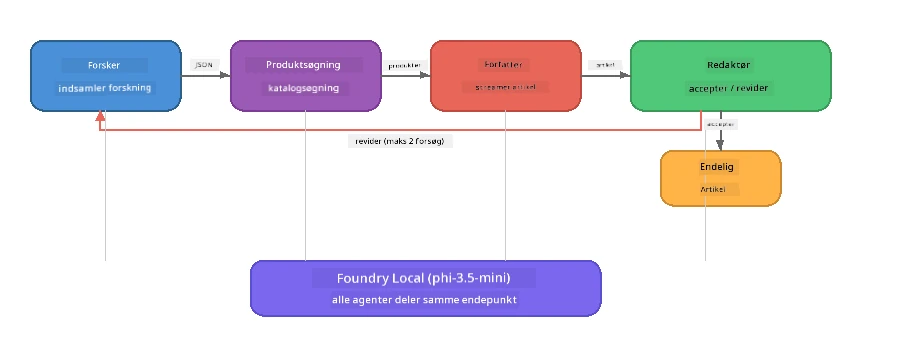

# Del 7: Zava Creative Writer - Capstone-applikation

> **Mål:** Udforsk en produktionsklar multi-agent-applikation, hvor fire specialiserede agenter samarbejder om at producere magasinkvalitetsartikler til Zava Retail DIY - alt kørende direkte på din enhed med Foundry Local.

Dette er **capstone-laboratoriet** i workshoppen. Det samler alt, hvad du har lært - SDK-integration (Del 3), hentning fra lokale data (Del 4), agent-personas (Del 5) og multi-agent orkestrering (Del 6) - i en komplet applikation tilgængelig i **Python**, **JavaScript** og **C#**.

---

## Hvad du vil udforske

| Koncept | Hvor i Zava Writer |
|---------|--------------------|
| 4-trins modelindlæsning | Shared config-modul starter Foundry Local |
| RAG-stil hentning | Produktagent søger i en lokal katalog |
| Agent-specialisering | 4 agenter med forskellige systemprompter |
| Streaming output | Forfatter leverer tokens i realtid |
| Strukturerede overleveringer | Researcher → JSON, Editor → JSON beslutning |
| Feedback loops | Editor kan trigge genkørsel (max 2 forsøg) |

---

## Arkitektur

Zava Creative Writer bruger en **sekventiel pipeline med evaluator-drevet feedback**. Alle tre sprogimplementeringer følger samme arkitektur:



### De fire agenter

| Agent | Input | Output | Formål |
|-------|-------|--------|--------|
| **Researcher** | Emne + valgfri feedback | `{"web": [{url, name, description}, ...]}` | Samler baggrundsforskning via LLM |
| **Product Search** | Produktkontekststreng | Liste af relevante produkter | LLM-genererede forespørgsler + søgning med nøgleord i lokal katalog |
| **Writer** | Research + produkter + opgave + feedback | Streamet artikeltekst (delt ved `---`) | Udkaster en magasinkvalitetsartikel i realtid |
| **Editor** | Artikel + forfatterens selvevaluering | `{"decision": "accept/revise", "editorFeedback": "...", "researchFeedback": "..."}` | Anmelder kvalitet, triggere revidering hvis nødvendigt |

### Pipeline-flow

1. **Researcher** modtager emnet og producerer strukturerede forskningsnotater (JSON)
2. **Product Search** forespørger den lokale produktkatalog ved hjælp af LLM-genererede søgetermer
3. **Writer** kombinerer research + produkter + opgave i en streamet artikel, tilføjer selvevaluering efter en `---` separator
4. **Editor** gennemgår artiklen og returnerer en JSON-dom:
   - `"accept"` → pipeline fuldføres
   - `"revise"` → feedback sendes tilbage til Researcher og Writer (max 2 forsøg)

---

## Forudsætninger

- Færdiggør [Del 6: Multi-Agent Workflows](part6-multi-agent-workflows.md)
- Foundry Local CLI installeret og `phi-3.5-mini` modellen hentet

---

## Øvelser

### Øvelse 1 - Kør Zava Creative Writer

Vælg dit sprog og kør applikationen:

<details>
<summary><strong>🐍 Python - FastAPI Web Service</strong></summary>

Python-versionen kører som en **webservice** med en REST API, der demonstrerer, hvordan man bygger en produktionsbackend.

**Opsætning:**
```bash
cd zava-creative-writer-local/src/api
python -m venv venv

# Windows (PowerShell):
venv\Scripts\Activate.ps1
# macOS:
source venv/bin/activate

pip install -r requirements.txt
```

**Kør:**
```bash
uvicorn main:app --reload
```

**Test:**
```bash
curl -X POST http://localhost:8000/api/article \
  -H "Content-Type: application/json" \
  -d '{
    "research": "DIY home improvement trends",
    "products": "power tools and paints",
    "assignment": "Write an article about weekend renovation projects for DIY enthusiasts"
  }'
```

Responsen streames tilbage som newline-adskilte JSON-meddelelser, der viser hver agents fremdrift.

</details>

<details>
<summary><strong>📦 JavaScript - Node.js CLI</strong></summary>

JavaScript-versionen kører som en **CLI-applikation**, der udskriver agentfremdrift og artiklen direkte i konsollen.

**Opsætning:**
```bash
cd zava-creative-writer-local/src/javascript
npm install
```

**Kør:**
```bash
node main.mjs
```

Du vil se:
1. Foundry Local modelindlæsning (med fremdriftsbjælke hvis den downloader)
2. Hver agent udfører sekventielt med statusbeskeder
3. Artiklen streamet til konsollen i realtid
4. Editorens accept/ændringsbeslutning

</details>

<details>
<summary><strong>💜 C# - .NET Console App</strong></summary>

C#-versionen kører som en **.NET konsolapplikation** med samme pipeline og streamet output.

**Opsætning:**
```bash
cd zava-creative-writer-local/src/csharp
dotnet restore
```

**Kør:**
```bash
dotnet run
```

Samme output-mønster som JavaScript-versionen - agentstatusbeskeder, streamet artikel og editorens afgørelse.

</details>

---

### Øvelse 2 - Studér kode-strukturen

Hver sprogimplementering har de samme logiske komponenter. Sammenlign strukturerne:

**Python** (`src/api/`):
| Fil | Formål |
|------|---------|
| `foundry_config.py` | Shared Foundry Local manager, model og client (4-trins initiering) |
| `orchestrator.py` | Pipeline koordinering med feedback loop |
| `main.py` | FastAPI endepunkter (`POST /api/article`) |
| `agents/researcher/researcher.py` | LLM-baseret research med JSON-output |
| `agents/product/product.py` | LLM-genererede forespørgsler + nøgleordsøgning |
| `agents/writer/writer.py` | Streaming artikel-generering |
| `agents/editor/editor.py` | JSON-baseret accept/ændrings beslutning |

**JavaScript** (`src/javascript/`):
| Fil | Formål |
|------|---------|
| `foundryConfig.mjs` | Shared Foundry Local konfiguration (4-trins init med fremdriftsbjælke) |
| `main.mjs` | Orkestrator + CLI entry point |
| `researcher.mjs` | LLM-baseret research-agent |
| `product.mjs` | LLM forespørgselsgenerering + nøgleordsøgning |
| `writer.mjs` | Streaming artikel-generering (async generator) |
| `editor.mjs` | JSON accept/ændrings beslutning |
| `products.mjs` | Produktkatalog data |

**C#** (`src/csharp/`):
| Fil | Formål |
|------|---------|
| `Program.cs` | Komplet pipeline: modelindlæsning, agenter, orkestrator, feedback loop |
| `ZavaCreativeWriter.csproj` | .NET 9 projekt med Foundry Local + OpenAI pakker |

> **Designnote:** Python adskiller hver agent i egen fil/mappe (godt til større teams). JavaScript bruger én modul per agent (godt til mellemstore projekter). C# holder alt i én fil med lokale funktioner (godt til selvstændige eksempler). I produktion vælg det mønster, der passer til dit teams konventioner.

---

### Øvelse 3 - Spor den delte konfiguration

Hver agent i pipelinen deler én Foundry Local model client. Studér hvordan dette sættes op i hvert sprog:

<details>
<summary><strong>🐍 Python - foundry_config.py</strong></summary>

```python
from foundry_local import FoundryLocalManager

MODEL_ALIAS = "phi-3.5-mini"

# Trin 1: Opret manager og start Foundry Local-tjenesten
manager = FoundryLocalManager()
manager.start_service()

# Trin 2: Tjek om modellen allerede er downloadet
cached = manager.list_cached_models()
catalog_info = manager.get_model_info(MODEL_ALIAS)
is_cached = any(m.id == catalog_info.id for m in cached) if catalog_info else False

if not is_cached:
    manager.download_model(MODEL_ALIAS)

# Trin 3: Indlæs modellen i hukommelsen
manager.load_model(MODEL_ALIAS)
model_id = manager.get_model_info(MODEL_ALIAS).id

# Delt OpenAI-klient
client = openai.OpenAI(base_url=manager.endpoint, api_key=manager.api_key)
```

Alle agenter importerer `from foundry_config import client, model_id`.

</details>

<details>
<summary><strong>📦 JavaScript - foundryConfig.mjs</strong></summary>

```javascript
import { FoundryLocalManager } from "foundry-local-sdk";
import { OpenAI } from "openai";

FoundryLocalManager.create({ appName: "ZavaCreativeWriter" });
const manager = FoundryLocalManager.instance;
await manager.startWebService();

// Tjek cache → download → indlæs (nyt SDK mønster)
const catalog = manager.catalog;
const model = await catalog.getModel(MODEL_ALIAS);
if (!model.isCached) {
  console.log(`Downloading model: ${MODEL_ALIAS}...`);
  await model.download();
}
await model.load();

const client = new OpenAI({ baseURL: manager.urls[0] + "/v1", apiKey: "foundry-local" });
const modelId = model.id;
export { client, modelId };
```

Alle agenter importerer `{ client, modelId } from "./foundryConfig.mjs"`.

</details>

<details>
<summary><strong>💜 C# - toppen af Program.cs</strong></summary>

```csharp
await FoundryLocalManager.CreateAsync(
    new Configuration
    {
        AppName = "ZavaCreativeWriter",
        Web = new Configuration.WebService { Urls = "http://127.0.0.1:0" }
    }, NullLogger.Instance, default);
var manager = FoundryLocalManager.Instance;
await manager.StartWebServiceAsync(default);

var catalog = await manager.GetCatalogAsync(default);
var catalogModel = await catalog.GetModelAsync(alias, default);
var isCached = await catalogModel.IsCachedAsync(default);
if (!isCached)
    await catalogModel.DownloadAsync(null, default);

await catalogModel.LoadAsync(default);
var key = new ApiKeyCredential("foundry-local");
var chatClient = new OpenAIClient(key, new OpenAIClientOptions
{
    Endpoint = new Uri(manager.Urls[0] + "/v1")
}).GetChatClient(catalogModel.Id);
```

`chatClient` videregives derefter til alle agentfunktioner i samme fil.

</details>

> **Nøglemønster:** Modelindlæsningsmønstret (start service → tjek cache → download → indlæs) sikrer, at brugeren ser klar fremdrift, og at modellen kun downloades én gang. Dette er en best practice for enhver Foundry Local applikation.

---

### Øvelse 4 - Forstå feedback-loopet

Feedback-loopet er det, der gør denne pipeline "smart" - Editor kan sende arbejdet tilbage til revision. Spor logikken:

```
Orchestrator:
  1. researcher.research(topic, "No Feedback")    ← first pass
  2. product.findProducts(productContext)
  3. writer.write(research, products, assignment)  ← streams article
  4. Split article at "---" → article + writerFeedback
  5. editor.edit(article, writerFeedback)

  WHILE editor says "revise" AND retryCount < 2:
    6. researcher.research(topic, editor.researchFeedback)  ← refined
    7. writer.write(research, products, editor.editorFeedback)
    8. editor.edit(newArticle, newWriterFeedback)
    9. retryCount++
```

**Spørgsmål til overvejelse:**
- Hvorfor er retry-grænsen sat til 2? Hvad sker der, hvis du øger den?
- Hvorfor får researcher `researchFeedback`, men forfatteren får `editorFeedback`?
- Hvad ville ske, hvis editor altid sagde "revise"?

---

### Øvelse 5 - Ændr en agent

Prøv at ændre en agents adfærd og se, hvordan det påvirker pipelinen:

| Ændring | Hvad skal ændres |
|---------|------------------|
| **Strengere editor** | Ændre editorens systemprompt til altid at kræve mindst én revision |
| **Længere artikler** | Ændre forfatterens prompt fra "800-1000 ord" til "1500-2000 ord" |
| **Andre produkter** | Tilføj eller ændr produkter i produktkataloget |
| **Nyt forskningsemne** | Skift standard `researchContext` til et andet emne |
| **Kun JSON researcher** | Få researcher til at returnere 10 elementer i stedet for 3-5 |

> **Tip:** Da alle tre sprog implementerer samme arkitektur, kan du lave samme ændring i det sprog, du er mest komfortabel med.

---

### Øvelse 6 - Tilføj en femte agent

Udvid pipelinen med en ny agent. Nogle ideer:

| Agent | Hvor i pipeline | Formål |
|-------|-----------------|--------|
| **Fact-Checker** | Efter Writer, før Editor | Verificer påstande mod forskningsdata |
| **SEO Optimerer** | Efter Editor accepterer | Tilføj metabeskrivelse, nøgleord, slug |
| **Illustrator** | Efter Editor accepterer | Generer billedprompter til artiklen |
| **Oversætter** | Efter Editor accepterer | Oversæt artiklen til et andet sprog |

**Trin:**
1. Skriv agentens systemprompt
2. Opret agentfunktionen (passende den eksisterende struktur i dit sprog)
3. Indsæt den i orkestratoren det rigtige sted
4. Opdater output/log for at vise den nye agents bidrag

---

## Hvordan Foundry Local og Agent Framework arbejder sammen

Denne applikation demonstrerer den anbefalede fremgangsmåde til at bygge multi-agent systemer med Foundry Local:

| Lag | Komponent | Rolle |
|-------|---------|-------|
| **Runtime** | Foundry Local | Downloader, håndterer og serverer modellen lokalt |
| **Client** | OpenAI SDK | Sender chat-fuldførelser til det lokale endepunkt |
| **Agent** | Systemprompt + chatkald | specialiseret adfærd via fokuserede instruktioner |
| **Orkestrator** | Pipeline-koordinator | Styrer dataflow, rækkefølge og feedback loops |
| **Framework** | Microsoft Agent Framework | Tilbyder `ChatAgent` abstraktion og mønstre |

Hovedindsigten: **Foundry Local erstatter cloud backend, ikke applikationsarkitekturen.** De samme agentmønstre, orkestreringsstrategier og strukturerede overleveringer, der fungerer med cloud-hostede modeller, fungerer identisk med lokale modeller — du peger bare klienten mod det lokale endepunkt i stedet for et Azure-endepunkt.

---

## Vigtigste pointer

| Koncept | Hvad du lærte |
|---------|---------------|
| Produktionsarkitektur | Hvordan man strukturerer en multi-agent app med delt konfiguration og separate agenter |
| 4-trins modelindlæsning | Best practice for initiering af Foundry Local med bruger-synlig fremdrift |
| Agent-specialisering | Hver af 4 agenter har fokuserede instruktioner og specifikt outputformat |
| Streaming generation | Forfatter leverer tokens i realtid, hvilket muliggør responsive brugergrænseflader |
| Feedback loops | Editor-drevet genforsøg forbedrer outputkvalitet uden menneskelig indblanding |
| Tvær-sprog mønstre | Samme arkitektur virker i Python, JavaScript og C# |
| Lokalt = produktionsklart | Foundry Local servicerer det samme OpenAI-kompatible API som cloud-udrulninger |

---

## Næste skridt

Fortsæt til [Del 8: Evaluationsledet Udvikling](part8-evaluation-led-development.md) for at bygge et systematisk evalueringsframework for dine agenter, med guld-datasæt, regelbaserede tjek og LLM-som-dommer scoring.

---

<!-- CO-OP TRANSLATOR DISCLAIMER START -->
**Ansvarsfraskrivelse**:  
Dette dokument er oversat ved hjælp af AI-oversættelsestjenesten [Co-op Translator](https://github.com/Azure/co-op-translator). Selvom vi bestræber os på nøjagtighed, skal du være opmærksom på, at automatiserede oversættelser kan indeholde fejl eller unøjagtigheder. Det originale dokument på dets oprindelige sprog skal betragtes som den autoritative kilde. For kritisk information anbefales professionel menneskelig oversættelse. Vi påtager os intet ansvar for eventuelle misforståelser eller fejltolkninger, der opstår som følge af brugen af denne oversættelse.
<!-- CO-OP TRANSLATOR DISCLAIMER END -->