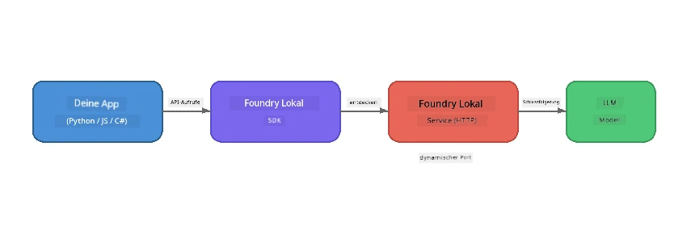

# Teil 1: Einstieg mit Foundry Local


## Was ist Foundry Local?

[Foundry Local](https://foundrylocal.ai) ermöglicht es Ihnen, Open-Source-KI-Sprachmodelle **direkt auf Ihrem Computer** auszuführen – kein Internet erforderlich, keine Cloud-Kosten und vollständiger Datenschutz. Es:

- **Lädt Modelle herunter und führt sie lokal aus** mit automatischer Hardwareoptimierung (GPU, CPU oder NPU)
- **Stellt eine OpenAI-kompatible API bereit**, sodass Sie vertraute SDKs und Tools verwenden können
- **Erfordert kein Azure-Abonnement** oder Anmeldung – einfach installieren und loslegen

Man kann es sich vorstellen wie eine private KI, die vollständig auf Ihrer Maschine läuft.

## Lernziele

Am Ende dieses Labs können Sie:

- Die Foundry Local CLI auf Ihrem Betriebssystem installieren
- Verstehen, was Modell-Aliase sind und wie sie funktionieren
- Ihr erstes lokales KI-Modell herunterladen und ausführen
- Eine Chat-Nachricht von der Kommandozeile an ein lokales Modell senden
- Den Unterschied zwischen lokalen und cloud-gehosteten KI-Modellen verstehen

---

## Voraussetzungen

### Systemanforderungen

| Anforderung | Minimum | Empfohlen |
|-------------|---------|------------|
| **RAM** | 8 GB | 16 GB |
| **Speicherplatz** | 5 GB (für Modelle) | 10 GB |
| **CPU** | 4 Kerne | 8+ Kerne |
| **GPU** | Optional | NVIDIA mit CUDA 11.8+ |
| **Betriebssystem** | Windows 10/11 (x64/ARM), Windows Server 2025, macOS 13+ | - |

> **Hinweis:** Foundry Local wählt automatisch die beste Modellvariante für Ihre Hardware aus. Wenn Sie eine NVIDIA GPU haben, nutzt es CUDA-Beschleunigung. Wenn Sie eine Qualcomm NPU besitzen, wird diese verwendet. Andernfalls greift es auf eine optimierte CPU-Variante zurück.

### Installation der Foundry Local CLI

**Windows** (PowerShell):  
```powershell
winget install Microsoft.FoundryLocal
```
  
**macOS** (Homebrew):  
```bash
brew tap microsoft/foundrylocal
brew install foundrylocal
```
  
> **Hinweis:** Foundry Local unterstützt derzeit nur Windows und macOS. Linux wird momentan nicht unterstützt.

Installation überprüfen:  
```bash
foundry --version
```
  
---

## Lab Übungen

### Übung 1: Verfügbare Modelle erkunden

Foundry Local enthält einen Katalog voroptimierter Open-Source-Modelle. Listen Sie diese auf:

```bash
foundry model list
```
  
Sie sehen Modelle wie:  
- `phi-3.5-mini` - Microsofts 3,8 Milliarden Parameter Modell (schnell, gute Qualität)  
- `phi-4-mini` - Neueres, leistungsfähigeres Phi-Modell  
- `phi-4-mini-reasoning` - Phi-Modell mit Chain-of-Thought-Reasoning (`<think>`-Tags)  
- `phi-4` - Microsofts größtes Phi-Modell (10,4 GB)  
- `qwen2.5-0.5b` - Sehr klein und schnell (gut für Geräte mit wenig Ressourcen)  
- `qwen2.5-7b` - Stabiles Allzweckmodell mit Tool-Aufruf-Unterstützung  
- `qwen2.5-coder-7b` - Für Code-Generierung optimiert  
- `deepseek-r1-7b` - Leistungsstarkes Reasoning-Modell  
- `gpt-oss-20b` - Großes Open-Source-Modell (MIT-Lizenz, 12,5 GB)  
- `whisper-base` - Sprach-zu-Text-Transkription (383 MB)  
- `whisper-large-v3-turbo` - Hochgenaue Transkription (9 GB)

> **Was ist ein Modell-Alias?** Aliase wie `phi-3.5-mini` sind Abkürzungen. Wenn Sie einen Alias verwenden, lädt Foundry Local automatisch die beste Variante für Ihre spezifische Hardware herunter (CUDA für NVIDIA GPUs, andernfalls CPU-optimiert). Sie müssen sich nie Sorgen machen, die richtige Variante auszuwählen.

### Übung 2: Führen Sie Ihr erstes Modell aus

Laden Sie ein Modell herunter und chatten Sie interaktiv damit:

```bash
foundry model run phi-3.5-mini
```
  
Beim ersten Start führt Foundry Local folgende Schritte aus:  
1. Erkennt Ihre Hardware  
2. Lädt die optimale Modellvariante herunter (das kann einige Minuten dauern)  
3. Lädt das Modell in den Speicher  
4. Startet eine interaktive Chat-Sitzung

Versuchen Sie, ihm einige Fragen zu stellen:  
```
You: What is the golden ratio?
You: Can you explain it as if I were 10 years old?
You: Write a haiku about mathematics
```
  
Geben Sie `exit` ein oder drücken Sie `Strg+C`, um zu beenden.

### Übung 3: Ein Modell vorab herunterladen

Wenn Sie ein Modell herunterladen möchten, ohne den Chat zu starten:

```bash
foundry model download phi-3.5-mini
```
  
Prüfen Sie, welche Modelle bereits auf Ihrem Gerät heruntergeladen sind:

```bash
foundry cache list
```
  
### Übung 4: Verstehen der Architektur

Foundry Local läuft als **lokaler HTTP-Dienst**, der eine OpenAI-kompatible REST-API bereitstellt. Das bedeutet:

1. Der Dienst startet auf einem **dynamischen Port** (bei jedem Start ein anderer Port)  
2. Sie verwenden das SDK, um die tatsächliche Endpunkt-URL zu ermitteln  
3. Sie können **jede** OpenAI-kompatible Clientbibliothek verwenden, um mit ihm zu kommunizieren



> **Wichtig:** Foundry Local weist bei jedem Start einen **dynamischen Port** zu. Vermeiden Sie es, statische Portnummern wie `localhost:5272` zu verwenden. Nutzen Sie immer das SDK, um die aktuelle URL zu ermitteln (z. B. `manager.endpoint` in Python oder `manager.urls[0]` in JavaScript).

---

## Wichtigste Erkenntnisse

| Konzept | Was Sie gelernt haben |
|---------|-----------------------|
| On-Device KI | Foundry Local führt Modelle vollständig auf Ihrem Gerät aus – ohne Cloud, ohne API-Schlüssel und ohne Kosten |
| Modell-Aliase | Aliase wie `phi-3.5-mini` wählen automatisch die beste Variante für Ihre Hardware aus |
| Dynamische Ports | Der Dienst läuft auf einem dynamischen Port; nutzen Sie immer das SDK, um den Endpunkt zu finden |
| CLI und SDK | Sie können Modelle über die CLI (`foundry model run`) oder programmatisch über das SDK steuern |

---

## Nächste Schritte

Fahren Sie fort mit [Teil 2: Foundry Local SDK Deep Dive](part2-foundry-local-sdk.md), um die SDK-API zum Verwalten von Modellen, Diensten und Caching programmatisch zu meistern.