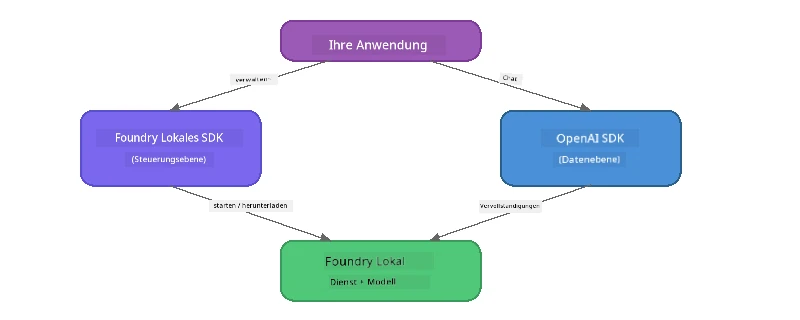

# Teil 3: Verwendung des Foundry Local SDK mit OpenAI

## Überblick

In Teil 1 haben Sie das Foundry Local CLI verwendet, um Modelle interaktiv auszuführen. In Teil 2 haben Sie die gesamte SDK API-Oberfläche erkundet. Jetzt lernen Sie, **Foundry Local in Ihre Anwendungen zu integrieren** mithilfe des SDK und der OpenAI-kompatiblen API.

Foundry Local stellt SDKs für drei Sprachen bereit. Wählen Sie die aus, mit der Sie sich am wohlsten fühlen – die Konzepte sind bei allen drei identisch.

## Lernziele

Am Ende dieses Kurses können Sie:

- Das Foundry Local SDK für Ihre Sprache (Python, JavaScript oder C#) installieren
- `FoundryLocalManager` initialisieren, um den Dienst zu starten, den Cache zu prüfen, ein Modell herunterzuladen und zu laden
- Mit dem lokalen Modell über das OpenAI SDK verbinden
- Chatvervollständigungen senden und Streaming-Antworten verarbeiten
- Die Architektur der dynamischen Ports verstehen

---

## Voraussetzungen

Schließen Sie zuerst [Teil 1: Einstieg mit Foundry Local](part1-getting-started.md) und [Teil 2: Foundry Local SDK Deep Dive](part2-foundry-local-sdk.md) ab.

Installieren Sie **einen** der folgenden Sprach-Runtime:
- **Python 3.9+** - [python.org/downloads](https://www.python.org/downloads/)
- **Node.js 18+** - [nodejs.org](https://nodejs.org/)
- **.NET 9.0+** - [dot.net/download](https://dotnet.microsoft.com/download)

---

## Konzept: Wie das SDK funktioniert

Das Foundry Local SDK verwaltet die **Steuerebene** (Dienst starten, Modelle herunterladen), während das OpenAI SDK die **Datenebene** (Prompts senden, Vervollständigungen empfangen) handhabt.



---

## Laborübungen

### Übung 1: Richten Sie Ihre Umgebung ein

<details>
<summary><b>🐍 Python</b></summary>

```bash
cd python
python -m venv venv

# Die virtuelle Umgebung aktivieren:
# Windows (PowerShell):
venv\Scripts\Activate.ps1
# Windows (Eingabeaufforderung):
venv\Scripts\activate.bat
# macOS:
source venv/bin/activate

pip install -r requirements.txt
```

Die `requirements.txt` installiert:
- `foundry-local-sdk` - Das Foundry Local SDK (importiert als `foundry_local`)
- `openai` - Das OpenAI Python SDK
- `agent-framework` - Microsoft Agent Framework (wird in späteren Teilen verwendet)

</details>

<details>
<summary><b>📘 JavaScript</b></summary>

```bash
cd javascript
npm install
```

Die `package.json` installiert:
- `foundry-local-sdk` - Das Foundry Local SDK
- `openai` - Das OpenAI Node.js SDK

</details>

<details>
<summary><b>💜 C#</b></summary>

```bash
cd csharp
dotnet restore
dotnet build
```

Das `csharp.csproj` verwendet:
- `Microsoft.AI.Foundry.Local` - Das Foundry Local SDK (NuGet)
- `OpenAI` - Das OpenAI C# SDK (NuGet)

> **Projektstruktur:** Das C#-Projekt verwendet einen Kommandozeilen-Router in `Program.cs`, der an separate Beispiel-Dateien weiterleitet. Führen Sie für diesen Teil `dotnet run chat` (oder einfach `dotnet run`) aus. Andere Teile verwenden `dotnet run rag`, `dotnet run agent` und `dotnet run multi`.

</details>

---

### Übung 2: Einfache Chatvervollständigung

Öffnen Sie das Grundbeispiel für Ihre Sprache und betrachten Sie den Code. Jedes Skript folgt dem gleichen dreistufigen Muster:

1. **Dienst starten** – `FoundryLocalManager` startet die Foundry Local Laufzeit
2. **Modell herunterladen und laden** – Cache prüfen, falls nötig herunterladen, dann in den Speicher laden
3. **OpenAI-Client erstellen** – mit dem lokalen Endpunkt verbinden und eine Chatvervollständigung mit Streaming senden

<details>
<summary><b>🐍 Python - <code>python/foundry-local.py</code></b></summary>

```python
import sys
import openai
from foundry_local import FoundryLocalManager

alias = "phi-3.5-mini"

# Schritt 1: Erstellen Sie einen FoundryLocalManager und starten Sie den Dienst
print("Starting Foundry Local service...")
manager = FoundryLocalManager()
manager.start_service()

# Schritt 2: Überprüfen Sie, ob das Modell bereits heruntergeladen wurde
cached = manager.list_cached_models()
catalog_info = manager.get_model_info(alias)
is_cached = any(m.id == catalog_info.id for m in cached) if catalog_info else False

if is_cached:
    print(f"Model already downloaded: {alias}")
else:
    print(f"Downloading model: {alias} (this may take several minutes)...")
    manager.download_model(alias)
    print(f"Download complete: {alias}")

# Schritt 3: Laden Sie das Modell in den Arbeitsspeicher
print(f"Loading model: {alias}...")
manager.load_model(alias)

# Erstellen Sie einen OpenAI-Client, der auf den lokalen Foundry-Dienst zeigt
client = openai.OpenAI(
    base_url=manager.endpoint,   # Dynamischer Port - niemals fest kodieren!
    api_key=manager.api_key
)

# Generieren Sie eine Streaming-Chat-Vervollständigung
stream = client.chat.completions.create(
    model=manager.get_model_info(alias).id,
    messages=[{"role": "user", "content": "What is the golden ratio?"}],
    stream=True,
)

for chunk in stream:
    if chunk.choices[0].delta.content is not None:
        print(chunk.choices[0].delta.content, end="", flush=True)
print()
```

**Ausführen:**
```bash
python foundry-local.py
```

</details>

<details>
<summary><b>📘 JavaScript - <code>javascript/foundry-local.mjs</code></b></summary>

```javascript
import { OpenAI } from "openai";
import { FoundryLocalManager } from "foundry-local-sdk";

const alias = "phi-3.5-mini";

// Schritt 1: Starten Sie den Foundry Local-Dienst
console.log("Starting Foundry Local service...");
FoundryLocalManager.create({ appName: "FoundryLocalWorkshop" });
const manager = FoundryLocalManager.instance;
await manager.startWebService();

// Schritt 2: Überprüfen Sie, ob das Modell bereits heruntergeladen wurde
const catalog = manager.catalog;
const model = await catalog.getModel(alias);

if (model.isCached) {
  console.log(`Model already downloaded: ${alias}`);
} else {
  console.log(`Downloading model: ${alias} (this may take several minutes)...`);
  await model.download();
  console.log(`Download complete: ${alias}`);
}

// Schritt 3: Laden Sie das Modell in den Arbeitsspeicher
console.log(`Loading model: ${alias}...`);
await model.load();
console.log(`Model loaded: ${model.id}`);

// Erstellen Sie einen OpenAI-Client, der auf den lokalen Foundry-Dienst verweist
const client = new OpenAI({
  baseURL: manager.urls[0] + "/v1",   // Dynamischer Port – niemals fest codieren!
  apiKey: "foundry-local",
});

// Erzeugen Sie eine Streaming-Chat-Vervollständigung
const stream = await client.chat.completions.create({
  model: model.id,
  messages: [{ role: "user", content: "What is the golden ratio?" }],
  stream: true,
});

for await (const chunk of stream) {
  if (chunk.choices[0]?.delta?.content) {
    process.stdout.write(chunk.choices[0].delta.content);
  }
}
console.log();
```

**Ausführen:**
```bash
node foundry-local.mjs
```

</details>

<details>
<summary><b>💜 C# - <code>csharp/BasicChat.cs</code></b></summary>

```csharp
using Microsoft.AI.Foundry.Local;
using Microsoft.Extensions.Logging.Abstractions;
using OpenAI;
using OpenAI.Chat;
using System.ClientModel;

var alias = "phi-3.5-mini";

// Step 1: Start the Foundry Local service
Console.WriteLine("Starting Foundry Local service...");
await FoundryLocalManager.CreateAsync(
    new Configuration
    {
        AppName = "FoundryLocalSamples",
        Web = new Configuration.WebService { Urls = "http://127.0.0.1:0" }
    }, NullLogger.Instance, default);
var manager = FoundryLocalManager.Instance;
await manager.StartWebServiceAsync(default);

// Step 2: Get the model from the catalog
var catalog = await manager.GetCatalogAsync(default);
var model = await catalog.GetModelAsync(alias, default);

// Step 3: Check if the model is already downloaded
var isCached = await model.IsCachedAsync(default);

if (isCached)
{
    Console.WriteLine($"Model already downloaded: {alias}");
}
else
{
    Console.WriteLine($"Downloading model: {alias} (this may take several minutes)...");
    await model.DownloadAsync(null, default);
    Console.WriteLine($"Download complete: {alias}");
}

// Step 4: Load the model into memory
Console.WriteLine($"Loading model: {alias}...");
await model.LoadAsync(default);
Console.WriteLine($"Loaded model: {model.Id}");
Console.WriteLine($"Endpoint: {manager.Urls[0]}");

// Create OpenAI client pointing to the LOCAL Foundry service
var key = new ApiKeyCredential("foundry-local");
var client = new OpenAIClient(key, new OpenAIClientOptions
{
    Endpoint = new Uri(manager.Urls[0] + "/v1")  // Dynamic port - never hardcode!
});

var chatClient = client.GetChatClient(model.Id);

// Stream a chat completion
var completionUpdates = chatClient.CompleteChatStreaming("What is the golden ratio?");

foreach (var update in completionUpdates)
{
    if (update.ContentUpdate.Count > 0)
    {
        Console.Write(update.ContentUpdate[0].Text);
    }
}
Console.WriteLine();
```

**Ausführen:**
```bash
dotnet run chat
```

</details>

---

### Übung 3: Experimentieren mit Prompts

Sobald Ihr Grundbeispiel läuft, versuchen Sie den Code zu ändern:

1. **Ändern Sie die Benutzer-Nachricht** – probieren Sie verschiedene Fragen aus
2. **Fügen Sie einen System-Prompt hinzu** – geben Sie dem Modell eine Persona
3. **Schalten Sie Streaming aus** – setzen Sie `stream=False` und geben Sie die komplette Antwort auf einmal aus
4. **Probieren Sie ein anderes Modell** – ändern Sie den Alias von `phi-3.5-mini` zu einem anderen Modell aus `foundry model list`

<details>
<summary><b>🐍 Python</b></summary>

```python
# Fügen Sie eine Systemaufforderung hinzu – geben Sie dem Modell eine Persona:
stream = client.chat.completions.create(
    model=manager.get_model_info(alias).id,
    messages=[
        {"role": "system", "content": "You are a pirate. Answer everything in pirate speak."},
        {"role": "user", "content": "What is the golden ratio?"}
    ],
    stream=True,
)

# Oder deaktivieren Sie das Streaming:
response = client.chat.completions.create(
    model=manager.get_model_info(alias).id,
    messages=[{"role": "user", "content": "What is the golden ratio?"}],
    stream=False,
)
print(response.choices[0].message.content)
```

</details>

<details>
<summary><b>📘 JavaScript</b></summary>

```javascript
// Fügen Sie eine Systemaufforderung hinzu - geben Sie dem Modell eine Persona:
const stream = await client.chat.completions.create({
  model: modelInfo.id,
  messages: [
    { role: "system", content: "You are a pirate. Answer everything in pirate speak." },
    { role: "user", content: "What is the golden ratio?" },
  ],
  stream: true,
});

// Oder schalten Sie das Streaming aus:
const response = await client.chat.completions.create({
  model: modelInfo.id,
  messages: [{ role: "user", content: "What is the golden ratio?" }],
  stream: false,
});
console.log(response.choices[0].message.content);
```

</details>

<details>
<summary><b>💜 C#</b></summary>

```csharp
// Add a system prompt - give the model a persona:
var completionUpdates = chatClient.CompleteChatStreaming(
    new ChatMessage[]
    {
        new SystemChatMessage("You are a pirate. Answer everything in pirate speak."),
        new UserChatMessage("What is the golden ratio?")
    }
);

// Or turn off streaming:
var response = chatClient.CompleteChat("What is the golden ratio?");
Console.WriteLine(response.Value.Content[0].Text);
```

</details>

---

### SDK Methodenreferenz

<details>
<summary><b>🐍 Python SDK Methoden</b></summary>

| Methode | Zweck |
|--------|---------|
| `FoundryLocalManager()` | Manager-Instanz erstellen |
| `manager.start_service()` | Foundry Local Dienst starten |
| `manager.list_cached_models()` | Auf dem Gerät heruntergeladene Modelle auflisten |
| `manager.get_model_info(alias)` | Modell-ID und Metadaten abrufen |
| `manager.download_model(alias, progress_callback=fn)` | Modell mit optionalem Fortschritts-Callback herunterladen |
| `manager.load_model(alias)` | Modell in den Speicher laden |
| `manager.endpoint` | Dynamische Endpunkt-URL abrufen |
| `manager.api_key` | API-Schlüssel abrufen (Platzhalter für lokal) |

</details>

<details>
<summary><b>📘 JavaScript SDK Methoden</b></summary>

| Methode | Zweck |
|--------|---------|
| `FoundryLocalManager.create({ appName })` | Manager-Instanz erstellen |
| `FoundryLocalManager.instance` | Zugriff auf die Singleton-Instanz |
| `await manager.startWebService()` | Foundry Local Dienst starten |
| `await manager.catalog.getModel(alias)` | Modell aus dem Katalog abrufen |
| `model.isCached` | Prüfen, ob das Modell bereits heruntergeladen ist |
| `await model.download()` | Modell herunterladen |
| `await model.load()` | Modell in den Speicher laden |
| `model.id` | Modell-ID für OpenAI API-Aufrufe |
| `manager.urls[0] + "/v1"` | Dynamische Endpunkt-URL |
| `"foundry-local"` | API-Schlüssel (Platzhalter für lokal) |

</details>

<details>
<summary><b>💜 C# SDK Methoden</b></summary>

| Methode | Zweck |
|--------|---------|
| `FoundryLocalManager.CreateAsync(config)` | Manager erstellen und initialisieren |
| `manager.StartWebServiceAsync()` | Foundry Local Webdienst starten |
| `manager.GetCatalogAsync()` | Modellkatalog abrufen |
| `catalog.ListModelsAsync()` | Alle verfügbaren Modelle auflisten |
| `catalog.GetModelAsync(alias)` | Ein bestimmtes Modell per Alias abrufen |
| `model.IsCachedAsync()` | Prüfen, ob ein Modell heruntergeladen wurde |
| `model.DownloadAsync()` | Modell herunterladen |
| `model.LoadAsync()` | Modell in den Speicher laden |
| `manager.Urls[0]` | Dynamische Endpunkt-URL |
| `new ApiKeyCredential("foundry-local")` | API-Schlüssel-Kredential für lokal |

</details>

---

### Übung 4: Verwendung des nativen ChatClient (Alternative zum OpenAI SDK)

In den Übungen 2 und 3 haben Sie das OpenAI SDK für Chatvervollständigungen verwendet. Die JavaScript- und C#-SDKs bieten auch einen **nativen ChatClient**, der das OpenAI SDK komplett überflüssig macht.

<details>
<summary><b>📘 JavaScript - <code>model.createChatClient()</code></b></summary>

```javascript
import { FoundryLocalManager } from "foundry-local-sdk";

const alias = "phi-3.5-mini";

FoundryLocalManager.create({ appName: "ChatClientDemo" });
const manager = FoundryLocalManager.instance;
await manager.startWebService();

const model = await manager.catalog.getModel(alias);
if (!model.isCached) await model.download();
await model.load();

// Kein OpenAI-Import nötig — erhalten Sie einen Client direkt vom Modell
const chatClient = model.createChatClient();

// Nicht-Streaming-Abschluss
const response = await chatClient.completeChat([
  { role: "system", content: "You are a pirate. Answer everything in pirate speak." },
  { role: "user", content: "What is the golden ratio?" }
]);
console.log(response.choices[0].message.content);

// Streaming-Abschluss (verwendet ein Callback-Muster)
await chatClient.completeStreamingChat(
  [{ role: "user", content: "What is the golden ratio?" }],
  (chunk) => {
    if (chunk.choices?.[0]?.delta?.content) {
      process.stdout.write(chunk.choices[0].delta.content);
    }
  }
);
console.log();
```

> **Hinweis:** Die `completeStreamingChat()`-Methode des ChatClient nutzt ein **Callback**-Muster, keinen asynchronen Iterator. Übergeben Sie eine Funktion als zweiten Parameter.

</details>

<details>
<summary><b>💜 C# - <code>model.GetChatClientAsync()</code></b></summary>

```csharp
var catalog = await manager.GetCatalogAsync(default);
var model = await catalog.GetModelAsync("phi-3.5-mini", default);
if (!await model.IsCachedAsync(default))
    await model.DownloadAsync(null, default);
await model.LoadAsync(default);

// No OpenAI NuGet needed — get a client directly from the model
var chatClient = await model.GetChatClientAsync(default);

// Use it like a standard OpenAI ChatClient
var response = chatClient.CompleteChat("What is the golden ratio?");
Console.WriteLine(response.Value.Content[0].Text);
```

</details>

> **Wann was verwenden:**
> | Ansatz | Am besten für |
> |----------|----------|
> | OpenAI SDK | Volle Parametersteuerung, Produktionsanwendungen, bestehender OpenAI-Code |
> | Nativer ChatClient | Schnelles Prototyping, weniger Abhängigkeiten, einfachere Einrichtung |

---

## Wichtige Erkenntnisse

| Konzept | Was Sie gelernt haben |
|---------|----------------------|
| Steuerungsebene | Das Foundry Local SDK steuert Start des Dienstes und das Laden von Modellen |
| Datenebene | Das OpenAI SDK steuert Chatvervollständigungen und Streaming |
| Dynamische Ports | Verwenden Sie stets das SDK zur Endpunkt-Ermittlung; URLs nie fest codieren |
| Mehrsprachigkeit | Dasselbe Code-Muster funktioniert in Python, JavaScript und C# |
| OpenAI-Kompatibilität | Volle OpenAI API-Kompatibilität bedeutet minimale Änderungen an bestehendem OpenAI-Code |
| Nativer ChatClient | `createChatClient()` (JS) / `GetChatClientAsync()` (C#) bietet eine Alternative zum OpenAI SDK |

---

## Nächste Schritte

Fahren Sie fort mit [Teil 4: Eine RAG-Anwendung entwickeln](part4-rag-fundamentals.md) und lernen Sie, wie Sie eine Retrieval-Augmented Generation Pipeline vollständig auf Ihrem Gerät ausführen.