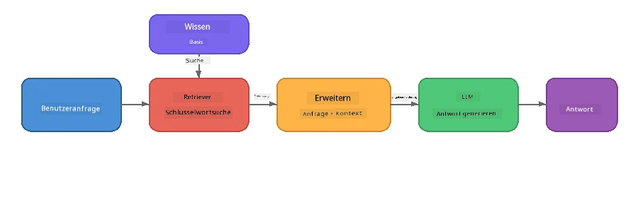

# Teil 4: Aufbau einer RAG-Anwendung mit Foundry Local

## Überblick

Große Sprachmodelle sind mächtig, aber sie kennen nur das, was in ihren Trainingsdaten enthalten war. **Retrieval-Augmented Generation (RAG)** löst dieses Problem, indem dem Modell zur Abfragezeit relevanter Kontext bereitgestellt wird – abgerufen aus Ihren eigenen Dokumenten, Datenbanken oder Wissensbasen.

In diesem Workshop bauen Sie eine komplette RAG-Pipeline, die **vollständig auf Ihrem Gerät** läuft, mit Foundry Local. Keine Cloud-Dienste, keine Vektordatenbanken, keine Embeddings-API – nur lokale Suche und ein lokales Modell.

## Lernziele

Am Ende dieses Workshops werden Sie in der Lage sein:

- Erklären, was RAG ist und warum es für KI-Anwendungen wichtig ist
- Eine lokale Wissensbasis aus Textdokumenten erstellen
- Eine einfache Suchfunktion implementieren, um relevanten Kontext zu finden
- Einen System-Prompt verfassen, der das Modell auf abgerufene Fakten stützt
- Die vollständige Retrieve → Augment → Generate-Pipeline auf dem Gerät ausführen
- Die Kompromisse zwischen einfacher Stichwortsuche und Vektorsuche verstehen

---

## Voraussetzungen

- Abschluss von [Teil 3: Verwendung des Foundry Local SDK mit OpenAI](part3-sdk-and-apis.md)
- Foundry Local CLI installiert und `phi-3.5-mini` Modell heruntergeladen

---

## Konzept: Was ist RAG?

Ohne RAG kann ein LLM nur aus seinen Trainingsdaten antworten – diese können veraltet, unvollständig oder Ihre privaten Informationen nicht enthalten sein:

```
User: "What is Zava's return policy?"
LLM:  "I do not have information about Zava's return policy."  ← No context!
```

Mit RAG **rufen Sie zuerst relevante Dokumente ab** und **erweitern** dann den Prompt mit diesem Kontext, bevor Sie eine Antwort **generieren**:



Die entscheidende Erkenntnis: **Das Modell muss die Antwort nicht „wissen“; es muss nur die richtigen Dokumente lesen.**

---

## Laborübungen

### Übung 1: Verstehen der Wissensbasis

Öffnen Sie das RAG-Beispiel für Ihre Sprache und untersuchen Sie die Wissensbasis:

<details>
<summary><b>🐍 Python: <code>python/foundry-local-rag.py</code></b></summary>

Die Wissensbasis ist eine einfache Liste von Dictionaries mit den Feldern `title` und `content`:

```python
KNOWLEDGE_BASE = [
    {
        "title": "Foundry Local Overview",
        "content": (
            "Foundry Local brings the power of Azure AI Foundry to your local "
            "device without requiring an Azure subscription..."
        ),
    },
    {
        "title": "Supported Hardware",
        "content": (
            "Foundry Local automatically selects the best model variant for "
            "your hardware. If you have an Nvidia CUDA GPU it downloads the "
            "CUDA-optimized model..."
        ),
    },
    # ... mehr Einträge
]
```

Jeder Eintrag repräsentiert ein „Wissensstück“ – ein fokussiertes Informationsstück zu einem Thema.

</details>

<details>
<summary><b>📘 JavaScript: <code>javascript/foundry-local-rag.mjs</code></b></summary>

Die Wissensbasis verwendet dieselbe Struktur als Array von Objekten:

```javascript
const KNOWLEDGE_BASE = [
  {
    title: "Foundry Local Overview",
    content:
      "Foundry Local brings the power of Azure AI Foundry to your local " +
      "device without requiring an Azure subscription...",
  },
  {
    title: "Supported Hardware",
    content:
      "Foundry Local automatically selects the best model variant for " +
      "your hardware...",
  },
  // ... mehr Einträge
];
```

</details>

<details>
<summary><b>💜 C#: <code>csharp/RagPipeline.cs</code></b></summary>

Die Wissensbasis verwendet eine Liste benannter Tupel:

```csharp
private static readonly List<(string Title, string Content)> KnowledgeBase =
[
    ("Foundry Local Overview",
     "Foundry Local brings the power of Azure AI Foundry to your local " +
     "device without requiring an Azure subscription..."),

    ("Supported Hardware",
     "Foundry Local automatically selects the best model variant for " +
     "your hardware..."),

    // ... more entries
];
```

</details>

> **In einer echten Anwendung** käme die Wissensbasis aus Dateien auf der Festplatte, einer Datenbank, einem Suchindex oder einer API. Für dieses Labor verwenden wir eine In-Memory-Liste, um es einfach zu halten.

---

### Übung 2: Verstehen der Suchfunktion

Der Retrieval-Schritt findet die relevantesten Wissensstücke für eine Benutzerfrage. Dieses Beispiel verwendet **Stichwortüberlappung** – es wird gezählt, wie viele Wörter der Anfrage auch in jedem Wissensstück auftauchen:

<details>
<summary><b>🐍 Python</b></summary>

```python
def retrieve(query: str, top_k: int = 2) -> list[dict]:
    """Return the top-k knowledge chunks most relevant to the query."""
    query_words = set(query.lower().split())
    scored = []
    for chunk in KNOWLEDGE_BASE:
        chunk_words = set(chunk["content"].lower().split())
        overlap = len(query_words & chunk_words)
        scored.append((overlap, chunk))
    scored.sort(key=lambda x: x[0], reverse=True)
    return [item[1] for item in scored[:top_k]]
```

</details>

<details>
<summary><b>📘 JavaScript</b></summary>

```javascript
function retrieve(query, topK = 2) {
  const queryWords = new Set(query.toLowerCase().split(/\s+/));
  const scored = KNOWLEDGE_BASE.map((chunk) => {
    const chunkWords = new Set(chunk.content.toLowerCase().split(/\s+/));
    let overlap = 0;
    for (const w of queryWords) {
      if (chunkWords.has(w)) overlap++;
    }
    return { overlap, chunk };
  });
  scored.sort((a, b) => b.overlap - a.overlap);
  return scored.slice(0, topK).map((s) => s.chunk);
}
```

</details>

<details>
<summary><b>💜 C#</b></summary>

```csharp
private static List<(string Title, string Content)> Retrieve(string query, int topK = 2)
{
    var queryWords = new HashSet<string>(
        query.ToLowerInvariant().Split(' ', StringSplitOptions.RemoveEmptyEntries));

    return KnowledgeBase
        .Select(chunk =>
        {
            var chunkWords = new HashSet<string>(
                chunk.Content.ToLowerInvariant().Split(' ', StringSplitOptions.RemoveEmptyEntries));
            var overlap = queryWords.Intersect(chunkWords).Count();
            return (Overlap: overlap, Chunk: chunk);
        })
        .OrderByDescending(x => x.Overlap)
        .Take(topK)
        .Select(x => x.Chunk)
        .ToList();
}
```

</details>

**Funktionsweise:**
1. Die Anfrage wird in einzelne Wörter aufgeteilt
2. Für jedes Wissensstück wird gezählt, wie viele Wörter aus der Anfrage darin vorkommen
3. Sortiert nach Überlappungswert (höchster zuerst)
4. Die top-k relevantesten Wissensstücke werden zurückgegeben

> **Komfort/Komplexität:** Stichwortüberlappung ist einfach, aber eingeschränkt; Synonyme oder Bedeutung werden nicht erkannt. Produktions-RAG-Systeme verwenden typischerweise **Embedding-Vektoren** und eine **Vektordatenbank** für semantische Suche. Stichwortüberlappung ist aber ein guter Startpunkt und erfordert keine zusätzlichen Abhängigkeiten.

---

### Übung 3: Verstehen des erweiterten Prompts

Der abgerufene Kontext wird vor dem Senden an das Modell in den **System-Prompt** eingefügt:

```python
system_prompt = (
    "You are a helpful assistant. Answer the user's question using ONLY "
    "the information provided in the context below. If the context does "
    "not contain enough information, say so.\n\n"
    f"Context:\n{context_text}"
)
```

Wichtige Designentscheidungen:
- **„AUSSCHLIEßLICH die bereitgestellten Informationen“** – verhindert, dass das Modell Fakten erfindet, die nicht im Kontext stehen
- **„Wenn der Kontext nicht genügend Informationen enthält, sage das“** – fördert ehrliche „Ich weiß nicht“-Antworten
- Der Kontext wird in die Systemnachricht gesetzt, sodass alle Antworten davon geprägt sind

---

### Übung 4: Ausführen der RAG-Pipeline

Führen Sie das komplette Beispiel aus:

**Python:**
```bash
cd python
python foundry-local-rag.py
```

**JavaScript:**
```bash
cd javascript
node foundry-local-rag.mjs
```

**C#:**
```bash
cd csharp
dotnet run rag
```

Es sollten drei Dinge ausgegeben werden:
1. **Die gestellte Frage**
2. **Der abgerufene Kontext** – die Wissensstücke, die aus der Wissensbasis ausgewählt wurden
3. **Die Antwort** – vom Modell ausschließlich basierend auf diesem Kontext generiert

Beispielausgabe:
```
Question: How do I install Foundry Local and what hardware does it support?

--- Retrieved Context ---
### Installation
On Windows install Foundry Local with: winget install Microsoft.FoundryLocal...

### Supported Hardware
Foundry Local automatically selects the best model variant for your hardware...
-------------------------

Answer: To install Foundry Local, you can use the following methods depending
on your operating system: On Windows, run `winget install Microsoft.FoundryLocal`.
On macOS, use `brew install microsoft/foundrylocal/foundrylocal`...
```

Beachten Sie, wie die Modellantwort **im abgerufenen Kontext verankert** ist – es werden nur Fakten aus den Wissensbasisdokumenten genannt.

---

### Übung 5: Experimentieren und Erweitern

Probieren Sie diese Änderungen, um Ihr Verständnis zu vertiefen:

1. **Ändern Sie die Frage** – stellen Sie eine Frage, die in der Wissensbasis IST, und eine, die NICHT drin ist:
   ```python
   question = "What programming languages does Foundry Local support?"  # ← Im Kontext
   question = "How much does Foundry Local cost?"                       # ← Nicht im Kontext
   ```
   Sagt das Modell korrekt „Ich weiß es nicht“, wenn die Antwort nicht im Kontext steht?

2. **Fügen Sie ein neues Wissensstück hinzu** – ergänzen Sie `KNOWLEDGE_BASE` um einen neuen Eintrag:
   ```python
   {
       "title": "Pricing",
       "content": "Foundry Local is completely free and open source under the MIT license.",
   }
   ```
   Stellen Sie die Preisfrage erneut.

3. **Ändern Sie `top_k`** – rufen Sie mehr oder weniger Wissensstücke ab:
   ```python
   context_chunks = retrieve(question, top_k=3)  # Mehr Kontext
   context_chunks = retrieve(question, top_k=1)  # Weniger Kontext
   ```
   Wie beeinflusst die Kontextmenge die Antwortqualität?

4. **Entfernen Sie die Grounding-Anweisung** – ändern Sie den System-Prompt zu „Du bist ein hilfreicher Assistent.“ und prüfen Sie, ob das Modell anfängt Fakten zu erfinden.

---

## Deep Dive: Optimierung von RAG für die Geräte-Performance

RAG auf dem Gerät auszuführen bringt Einschränkungen mit sich, die Sie in der Cloud nicht haben: begrenzter RAM, keine dedizierte GPU (CPU/NPU-Ausführung) und kleines Kontextfenster des Modells. Die folgenden Designentscheidungen adressieren diese Einschränkungen direkt und basieren auf Mustern von Produktions-RAG-Anwendungen lokal mit Foundry Local gebaut.

### Chunking-Strategie: Fixed-Size Sliding Window

Chunking – also wie Dokumente in Teile zerlegt werden – ist eine der einflussreichsten Entscheidungen in jedem RAG-System. Für Geräteszenarien ist ein **festes Fenster mit Überlappung** der empfohlene Ausgangspunkt:

| Parameter | Empfohlener Wert | Warum |
|-----------|------------------|-------|
| **Chunk-Größe** | ~200 Tokens | Hält den abgerufenen Kontext kompakt, lässt Platz im Phi-3.5 Mini-Kontextfenster für Systemprompt, Gesprächsverlauf und generierte Ausgabe |
| **Überlappung** | ~25 Tokens (12,5%) | Verhindert Informationsverlust an Chunk-Grenzen – wichtig bei Prozeduren und Schritt-für-Schritt-Anleitungen |
| **Tokenisierung** | Whitespace-Split | Keine Abhängigkeiten, keine Tokenizer-Bibliothek nötig. Das gesamte Rechenbudget bleibt beim LLM |

Die Überlappung funktioniert wie ein gleitendes Fenster: Jeder neue Chunk startet 25 Tokens vor dem Ende des vorherigen, sodass Sätze, die über Chunk-Grenzen gehen, in beiden Chunks erscheinen.

> **Warum nicht andere Strategien?**
> - **Satz-basiertes Splitten** erzeugt unvorhersehbare Chunk-Größen; manche Sicherheitsanweisungen sind einzelne, lange Sätze, die schlecht splitten
> - **Abschnittsorientiertes Splitten** (an `##` Überschriften) erzeugt sehr unterschiedliche Chunk-Größen – manche zu klein, andere zu groß für das Kontextfenster des Modells
> - **Semantisches Chunking** (embedding-basierte Themenerkennung) liefert die beste Suchqualität, benötigt aber ein zweites Modell im Speicher neben Phi-3.5 Mini – riskant auf Hardware mit 8-16 GB gemeinsamem Speicher

### Verbesserte Suche: TF-IDF Vektoren

Der Stichwortüberlappungsansatz aus diesem Labor funktioniert, aber wenn Sie bessere Suche wollen, ohne ein Embedding-Modell hinzuzufügen, ist **TF-IDF (Term Frequency-Inverse Document Frequency)** ein exzellenter Mittelweg:

```
Keyword Overlap  →  TF-IDF Vectors  →  Embedding Models
    (this lab)     (lightweight upgrade)   (production)
  Simple & fast    Better ranking,         Best quality,
  No dependencies  still no ML model       requires embedding model
  ~Basic matching  ~1ms retrieval          ~100-500ms per query
```

TF-IDF wandelt jeden Chunk in einen numerischen Vektor um, basierend darauf, wie wichtig jedes Wort innerhalb dieses Chunks *relativ zu allen Chunks* ist. Zur Abfragezeit wird die Frage auf dieselbe Weise vektorisiert und per Kosinusähnlichkeit verglichen. Sie können das mit SQLite und reinem JavaScript/Python implementieren – keine Vektor-Datenbank, keine Embeddings-API.

> **Performance:** TF-IDF Kosinusähnlichkeit über feste Chunk-Größen erreicht typischerweise **~1ms Retrieval**, verglichen mit ~100-500ms, wenn ein Embedding-Modell jede Anfrage kodiert. Über 20 Dokumente können in weniger als einer Sekunde gechunkt und indexiert werden.

### Edge/Compact-Modus für Geräte mit eingeschränkten Ressourcen

Beim Betrieb auf sehr eingeschränkter Hardware (ältere Laptops, Tablets, Feldgeräte) können Sie den Ressourcenverbrauch senken, indem Sie drei Regler verkleinern:

| Einstellung | Standardmodus | Edge/Compact-Modus |
|-------------|--------------|-------------------|
| **System-Prompt** | ~300 Tokens | ~80 Tokens |
| **Max. Ausgabe-Token** | 1024 | 512 |
| **Abgerufene Chunks (top-k)** | 5 | 3 |

Weniger abgerufene Chunks bedeuten weniger Kontext für das Modell, was Latenz und Speicherbelastung verringert. Ein kürzerer System-Prompt gibt mehr Raum im Kontextfenster für die eigentliche Antwort. Dieser Kompromiss lohnt sich auf Geräten, bei denen jeder Token im Kontextfenster zählt.

### Ein Modell im Speicher

Einer der wichtigsten Grundsätze für On-Device-RAG: **Nur ein Modell laden**. Wenn Sie ein Embedding-Modell für Retrieval *und* ein Sprachmodell für die Generierung verwenden, teilen Sie die begrenzten NPU/RAM-Ressourcen auf zwei Modelle auf. Leichte Retrieval-Methoden (Stichwortüberlappung, TF-IDF) vermeiden das komplett:

- Kein Embedding-Modell, das mit dem LLM um Speicher konkurriert
- Schnellerer Kaltstart – nur ein Modell zum Laden
- Berechenbarer Speicherverbrauch – das LLM bekommt alle Ressourcen
- Funktioniert auf Maschinen mit nur 8 GB RAM

### SQLite als lokale Vektor-Datenbank

Für kleine bis mittelgroße Dokumentensammlungen (Hunderte bis niedrige Tausende von Chunks) ist **SQLite schnell genug** für brute-force Kosinusähnlichkeitssuche und benötigt kein zusätzliches Setup:

- Einzelne `.db`-Datei auf der Festplatte – kein Serverprozess, keine Konfiguration
- Wird von allen wichtigen Laufzeitumgebungen mitgeliefert (Python `sqlite3`, Node.js `better-sqlite3`, .NET `Microsoft.Data.Sqlite`)
- Speichert Dokumenten-Chunks zusammen mit ihren TF-IDF-Vektoren in einer Tabelle
- Keine Notwendigkeit für Pinecone, Qdrant, Chroma oder FAISS bei diesem Umfang

### Leistungsübersicht

Diese Designentscheidungen ermöglichen eine reaktionsschnelle RAG auf Consumer-Hardware:

| Kennzahl | On-Device Performance |
|----------|-----------------------|
| **Retrieval-Latenz** | ~1ms (TF-IDF) bis ~5ms (Stichwortüberlappung) |
| **Ingestionsgeschwindigkeit** | 20 Dokumente in < 1 Sekunde gechunkt und indexiert |
| **Modelle im Speicher** | 1 (nur LLM - kein Embedding-Modell) |
| **Speicherplatzbedarf** | < 1 MB für Chunks + Vektoren in SQLite |
| **Kaltstart** | Einziges Modell laden, kein Embedding-Runtime-Start |
| **Hardware-Mindestanforderung** | 8 GB RAM, CPU-only (keine GPU benötigt) |

> **Wann aufrüsten:** Wenn Sie auf Hunderte langer Dokumente skalieren, gemischte Inhaltstypen (Tabellen, Code, Prosa) verwalten oder semantisches Verständnis von Abfragen benötigen, ziehen Sie ein Embedding-Modell und Vektor-Similarity-Suche in Betracht. Für die meisten On-Device-Anwendungsfälle mit fokussierten Dokumentensätzen liefert TF-IDF + SQLite exzellente Ergebnisse bei minimalem Ressourcenverbrauch.

---

## Schlüsselkonzepte

| Konzept | Beschreibung |
|---------|--------------|
| **Retrieval** | Finden relevanter Dokumente aus einer Wissensbasis basierend auf der Benutzeranfrage |
| **Augmentation** | Einfügen abgerufener Dokumente in den Prompt als Kontext |
| **Generation** | Das LLM erzeugt eine Antwort, die im bereitgestellten Kontext verankert ist |
| **Chunking** | Zerlegen großer Dokumente in kleinere, fokussierte Einheiten |
| **Grounding** | Das Modell wird darauf beschränkt, nur den bereitgestellten Kontext zu verwenden (reduziert Halluzinationen) |
| **Top-k** | Anzahl der relevantesten Chunks, die abgerufen werden |

---

## RAG in der Produktion vs. Dieses Labor

| Aspekt | Dieses Labor | Optimiert für On-Device | Cloud-Produktion |
|--------|--------------|------------------------|------------------|
| **Wissensbasis** | In-Memory-Liste | Dateien auf Festplatte, SQLite | Datenbank, Suchindex |
| **Retrieval** | Stichwortüberlappung | TF-IDF + Kosinusähnlichkeit | Vektor-Embeddings + Ähnlichkeitssuche |
| **Embeddings** | Keine nötig | Keine – TF-IDF Vektoren | Embedding-Modell (lokal oder Cloud) |
| **Vektor-Store** | Nicht benötigt | SQLite (einzelne `.db`-Datei) | FAISS, Chroma, Azure AI Search, etc. |
| **Chunking** | Manuell | Fixe Fenstergröße (~200 Tokens, 25 Tokens Überlappung) | Semantisch oder rekursiv chunking |
| **Modelle im Speicher** | 1 (LLM) | 1 (LLM) | 2+ (Embedding + LLM) |
| **Abruflatenz** | ~5ms | ~1ms | ~100-500ms |
| **Skalierung** | 5 Dokumente | Hunderte von Dokumenten | Millionen von Dokumenten |

Die hier erlernten Muster (abrufen, ergänzen, generieren) sind bei jeder Skalierung gleich. Die Abrufmethode verbessert sich, aber die Gesamtarchitektur bleibt identisch. Die mittlere Spalte zeigt, was mit leichten Techniken auf dem Gerät erreicht werden kann, oft der Sweet Spot für lokale Anwendungen, bei denen man Cloud-Skalierung gegen Datenschutz, Offline-Fähigkeit und null Latenz zu externen Diensten eintauscht.

---

## Wichtige Erkenntnisse

| Konzept | Was Sie gelernt haben |
|---------|----------------------|
| RAG-Muster | Abrufen + Ergänzen + Generieren: geben Sie dem Modell den richtigen Kontext, und es kann Fragen zu Ihren Daten beantworten |
| Auf dem Gerät | Alles läuft lokal ohne Cloud-APIs oder Vektor-Datenbank-Abonnements |
| Verankerungsanweisungen | System-Prompt-Beschränkungen sind entscheidend, um Halluzinationen zu vermeiden |
| Schlüsselwortüberlappung | Ein einfacher, aber effektiver Ausgangspunkt für den Abruf |
| TF-IDF + SQLite | Ein leichter Upgrade-Pfad, der den Abruf unter 1 ms hält, ohne ein Einbettungsmodell |
| Ein Modell im Speicher | Vermeiden Sie das Laden eines Einbettungsmodells zusätzlich zum LLM auf eingeschränkter Hardware |
| Chunk-Größe | Etwa 200 Tokens mit Überlappung balanciert Abrufgenauigkeit und Kontextfenstereffizienz |
| Edge-/Kompaktmodus | Verwenden Sie weniger Chunks und kürzere Prompts für sehr eingeschränkte Geräte |
| Universelles Muster | Die gleiche RAG-Architektur funktioniert für jede Datenquelle: Dokumente, Datenbanken, APIs oder Wikis |

> **Möchten Sie eine vollständige RAG-Anwendung auf dem Gerät sehen?** Schauen Sie sich [Gas Field Local RAG](https://github.com/leestott/local-rag) an, einen produktionsähnlichen Offline-RAG-Agenten, der mit Foundry Local und Phi-3.5 Mini gebaut wurde und diese Optimierungsmuster an einem realen Dokumentensatz demonstriert.

---

## Nächste Schritte

Fahren Sie mit [Teil 5: Aufbau von KI-Agenten](part5-single-agents.md) fort, um zu lernen, wie man intelligente Agenten mit Personas, Anweisungen und Mehrfachdialogen unter Verwendung des Microsoft Agent Frameworks erstellt.