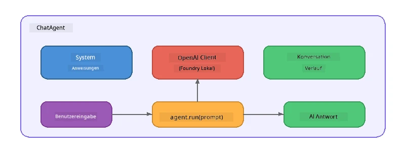

# Teil 5: Aufbau von KI-Agenten mit dem Agent Framework

> **Ziel:** Erstellen Sie Ihren ersten KI-Agenten mit persistierenden Anweisungen und einer definierten Persönlichkeit, betrieben von einem lokalen Modell über Foundry Local.

## Was ist ein KI-Agent?

Ein KI-Agent kapselt ein Sprachmodell mit **Systemanweisungen**, die dessen Verhalten, Persönlichkeit und Einschränkungen definieren. Im Unterschied zu einem einzelnen Chat-Komplettierungsaufruf bietet ein Agent:

- **Persona** – eine konsistente Identität („Sie sind ein hilfreicher Code-Reviewer“)
- **Speicher** – Gesprächsverlauf über mehrere Runden
- **Spezialisierung** – fokussiertes Verhalten, gesteuert durch sorgfältig formulierte Anweisungen



---

## Das Microsoft Agent Framework

Das **Microsoft Agent Framework** (AGF) bietet eine standardisierte Agentenabstraktion, die über verschiedene Modell-Backends funktioniert. In diesem Workshop kombinieren wir es mit Foundry Local, sodass alles auf deinem Rechner läuft – keine Cloud erforderlich.

| Konzept | Beschreibung |
|---------|-------------|
| `FoundryLocalClient` | Python: übernimmt Service-Start, Modell-Download/-Laden und erstellt Agenten |
| `client.as_agent()` | Python: erzeugt einen Agenten aus dem Foundry Local Client |
| `AsAIAgent()` | C#: Erweiterungsmethode für `ChatClient` – erstellt einen `AIAgent` |
| `instructions` | Systemprompt, der das Verhalten des Agenten formt |
| `name` | Menschenlesbares Label, nützlich in Multi-Agent-Szenarien |
| `agent.run(prompt)` / `RunAsync()` | Sendet eine Nutzernachricht und gibt die Antwort des Agenten zurück |

> **Hinweis:** Das Agent Framework hat ein Python- und ein .NET-SDK. Für JavaScript implementieren wir eine leichte `ChatAgent`-Klasse, die dasselbe Muster unter Verwendung des OpenAI SDK direkt widerspiegelt.

---

## Übungen

### Übung 1 – Verstehen des Agenten-Musters

Bevor Sie Code schreiben, studieren Sie die Hauptkomponenten eines Agenten:

1. **Modell-Client** – verbindet sich mit Foundry Locals OpenAI-kompatibler API
2. **Systemanweisungen** – der „Persönlichkeit“-Prompt
3. **Lauf-Schleife** – Eingabe vom Nutzer senden, Ausgabe empfangen

> **Denk darüber nach:** Worin unterscheiden sich Systemanweisungen von einer regulären Nutzernachricht? Was passiert, wenn Sie sie ändern?

---

### Übung 2 – Ausführen des Einzel-Agenten-Beispiels

<details>
<summary><strong>🐍 Python</strong></summary>

**Voraussetzungen:**
```bash
cd python
python -m venv venv

# Windows (PowerShell):
venv\Scripts\Activate.ps1
# macOS:
source venv/bin/activate

pip install -r requirements.txt
```

**Ausführen:**
```bash
python foundry-local-with-agf.py
```

**Code-Erklärung** (`python/foundry-local-with-agf.py`):

```python
import asyncio
from agent_framework_foundry_local import FoundryLocalClient

async def main():
    alias = "phi-4-mini"

    # FoundryLocalClient verwaltet Dienststart, Modelldownload und Laden
    client = FoundryLocalClient(model_id=alias)
    print(f"Client Model ID: {client.model_id}")

    # Erstellen Sie einen Agenten mit Systemanweisungen
    agent = client.as_agent(
        name="Joker",
        instructions="You are good at telling jokes.",
    )

    # Kein Streaming: erhalten Sie die vollständige Antwort auf einmal
    result = await agent.run("Tell me a joke about a pirate.")
    print(f"Agent: {result}")

    # Streaming: erhalten Sie die Ergebnisse, während sie generiert werden
    async for chunk in agent.run("Tell me another joke.", stream=True):
        if chunk.text:
            print(chunk.text, end="", flush=True)

asyncio.run(main())
```

**Wichtige Punkte:**
- `FoundryLocalClient(model_id=alias)` übernimmt Service-Start, Download und Modellladen in einem Schritt
- `client.as_agent()` erstellt einen Agenten mit Systemanweisungen und einem Namen
- `agent.run()` unterstützt sowohl nicht-streaming als auch Streaming-Modi
- Installation via `pip install agent-framework-foundry-local --pre`

</details>

<details>
<summary><strong>📦 JavaScript</strong></summary>

**Voraussetzungen:**
```bash
cd javascript
npm install
```

**Ausführen:**
```bash
node foundry-local-with-agent.mjs
```

**Code-Erklärung** (`javascript/foundry-local-with-agent.mjs`):

```javascript
import { OpenAI } from "openai";
import { FoundryLocalManager } from "foundry-local-sdk";

class ChatAgent {
  constructor({ client, modelId, instructions, name }) {
    this.client = client;
    this.modelId = modelId;
    this.instructions = instructions;
    this.name = name;
    this.history = [];
  }

  async run(userMessage) {
    const messages = [
      { role: "system", content: this.instructions },
      ...this.history,
      { role: "user", content: userMessage },
    ];
    const response = await this.client.chat.completions.create({
      model: this.modelId,
      messages,
    });
    const assistantMessage = response.choices[0].message.content;

    // Gesprächsverlauf für mehrstufige Interaktionen speichern
    this.history.push({ role: "user", content: userMessage });
    this.history.push({ role: "assistant", content: assistantMessage });
    return { text: assistantMessage };
  }
}

async function main() {
  FoundryLocalManager.create({ appName: "FoundryLocalWorkshop" });
  const manager = FoundryLocalManager.instance;
  await manager.startWebService();

  const catalog = manager.catalog;
  const model = await catalog.getModel("phi-3.5-mini");
  if (!model.isCached) {
    console.log("Downloading model: phi-3.5-mini...");
    await model.download();
  }
  await model.load();

  const client = new OpenAI({
    baseURL: manager.urls[0] + "/v1",
    apiKey: "foundry-local",
  });

  const agent = new ChatAgent({
    client,
    modelId: model.id,
    instructions: "You are good at telling jokes.",
    name: "Joker",
  });

  const result = await agent.run("Tell me a joke about a pirate.");
  console.log(result.text);
}

main();
```

**Wichtige Punkte:**
- JavaScript baut seine eigene `ChatAgent`-Klasse, die das Python-AGF-Muster nachbildet
- `this.history` speichert Gesprächsrunden zur Unterstützung mehrerer Runden
- Explizites `startWebService()` → Cache-Check → `model.download()` → `model.load()` für volle Transparenz

</details>

<details>
<summary><strong>💜 C#</strong></summary>

**Voraussetzungen:**
```bash
cd csharp
dotnet restore
```

**Ausführen:**
```bash
dotnet run agent
```

**Code-Erklärung** (`csharp/SingleAgent.cs`):

```csharp
using Microsoft.AI.Foundry.Local;
using Microsoft.Extensions.Logging.Abstractions;
using Microsoft.Agents.AI;
using OpenAI;
using System.ClientModel;

// 1. Start Foundry Local and load a model
var alias = "phi-3.5-mini";
await FoundryLocalManager.CreateAsync(
    new Configuration
    {
        AppName = "FoundryLocalSamples",
        Web = new Configuration.WebService { Urls = "http://127.0.0.1:0" }
    }, NullLogger.Instance, default);
var manager = FoundryLocalManager.Instance;
await manager.StartWebServiceAsync(default);

var catalog = await manager.GetCatalogAsync(default);
var model = await catalog.GetModelAsync(alias, default);

var isCached = await model.IsCachedAsync(default);
if (!isCached)
{
    Console.WriteLine($"Downloading model: {alias}...");
    await model.DownloadAsync(null, default);
}
await model.LoadAsync(default);

var key = new ApiKeyCredential("foundry-local");
var client = new OpenAIClient(key, new OpenAIClientOptions
{
    Endpoint = new Uri(manager.Urls[0] + "/v1")
});

// 2. Create an AIAgent using the Agent Framework extension method
AIAgent joker = client
    .GetChatClient(model.Id)
    .AsAIAgent(
        instructions: "You are good at telling jokes. Keep your jokes short and family-friendly.",
        name: "Joker"
    );

// 3. Run the agent (non-streaming)
var response = await joker.RunAsync("Tell me a joke about a pirate.");
Console.WriteLine($"Joker: {response}");

// 4. Run with streaming
await foreach (var update in joker.RunStreamingAsync("Tell me another joke."))
{
    Console.Write(update);
}
```

**Wichtige Punkte:**
- `AsAIAgent()` ist eine Erweiterungsmethode aus `Microsoft.Agents.AI.OpenAI` – keine eigene `ChatAgent`-Klasse nötig
- `RunAsync()` liefert die gesamte Antwort; `RunStreamingAsync()` liefert Token für Token im Stream
- Installation via `dotnet add package Microsoft.Agents.AI.OpenAI --version 1.0.0-rc3`

</details>

---

### Übung 3 – Ändern der Persona

Ändern Sie die `instructions` des Agenten, um eine andere Persönlichkeit zu erstellen. Probieren Sie jede aus und beobachten Sie, wie sich die Ausgabe verändert:

| Persona | Anweisungen |
|---------|-------------|
| Code Reviewer | `"Sie sind ein erfahrener Code-Reviewer. Geben Sie konstruktives Feedback mit Fokus auf Lesbarkeit, Leistung und Korrektheit."` |
| Reiseleiter | `"Sie sind ein freundlicher Reiseleiter. Geben Sie personalisierte Empfehlungen zu Reisezielen, Aktivitäten und lokaler Küche."` |
| Sokratischer Tutor | `"Sie sind ein sokratischer Tutor. Geben Sie niemals direkte Antworten – leiten Sie den Schüler stattdessen mit durchdachten Fragen."` |
| Technischer Redakteur | `"Sie sind ein technischer Redakteur. Erklären Sie Konzepte klar und prägnant. Verwenden Sie Beispiele. Vermeiden Sie Fachjargon."` |

**Probieren Sie es aus:**
1. Wählen Sie eine Persona aus der obigen Tabelle
2. Ersetzen Sie den `instructions`-String im Code
3. Passen Sie den Nutzereingabe-Prompt entsprechend an (z.B. den Code Reviewer bitten, eine Funktion zu prüfen)
4. Führen Sie das Beispiel erneut aus und vergleichen Sie die Ausgabe

> **Tipp:** Die Qualität eines Agenten hängt stark von den Anweisungen ab. Spezifische, gut strukturierte Anweisungen liefern bessere Resultate als vage.

---

### Übung 4 – Mehr-Runden-Gespräch hinzufügen

Erweitern Sie das Beispiel, damit es eine mehr-ründige Chat-Schleife unterstützt und Sie einen Dialog mit dem Agenten führen können.

<details>
<summary><strong>🐍 Python – Mehr-Runden-Schleife</strong></summary>

```python
import asyncio
from agent_framework_foundry_local import FoundryLocalClient

async def main():
    client = FoundryLocalClient(model_id="phi-4-mini")

    agent = client.as_agent(
        name="Assistant",
        instructions="You are a helpful assistant.",
    )

    print("Chat with the agent (type 'quit' to exit):\n")
    while True:
        user_input = input("You: ")
        if user_input.strip().lower() in ("quit", "exit"):
            break
        result = await agent.run(user_input)
        print(f"Agent: {result}\n")

asyncio.run(main())
```

</details>

<details>
<summary><strong>📦 JavaScript – Mehr-Runden-Schleife</strong></summary>

```javascript
import { OpenAI } from "openai";
import { FoundryLocalManager } from "foundry-local-sdk";
import * as readline from "node:readline/promises";

// (wiederverwenden der ChatAgent-Klasse aus Übung 2)

async function main() {
  FoundryLocalManager.create({ appName: "FoundryLocalWorkshop" });
  const manager = FoundryLocalManager.instance;
  await manager.startWebService();

  const catalog = manager.catalog;
  const model = await catalog.getModel("phi-3.5-mini");
  if (!model.isCached) {
    console.log("Downloading model: phi-3.5-mini...");
    await model.download();
  }
  await model.load();

  const client = new OpenAI({
    baseURL: manager.urls[0] + "/v1",
    apiKey: "foundry-local",
  });

  const agent = new ChatAgent({
    client,
    modelId: model.id,
    instructions: "You are a helpful assistant.",
    name: "Assistant",
  });

  const rl = readline.createInterface({
    input: process.stdin,
    output: process.stdout,
  });

  console.log("Chat with the agent (type 'quit' to exit):\n");
  while (true) {
    const userInput = await rl.question("You: ");
    if (["quit", "exit"].includes(userInput.trim().toLowerCase())) break;
    const result = await agent.run(userInput);
    console.log(`Agent: ${result.text}\n`);
  }
  rl.close();
}

main();
```

</details>

<details>
<summary><strong>💜 C# – Mehr-Runden-Schleife</strong></summary>

```csharp
using Microsoft.AI.Foundry.Local;
using Microsoft.Extensions.Logging.Abstractions;
using Microsoft.Agents.AI;
using OpenAI;
using System.ClientModel;

var alias = "phi-3.5-mini";
var config = new Configuration
{
    AppName = "FoundryLocalSamples",
    Web = new Configuration.WebService { Urls = "http://127.0.0.1:0" }
};
await FoundryLocalManager.CreateAsync(config, NullLogger.Instance, default);
var manager = FoundryLocalManager.Instance;
await manager.StartWebServiceAsync(default);

var catalog = await manager.GetCatalogAsync(default);
var model = await catalog.GetModelAsync(alias, default);

var isCached = await model.IsCachedAsync(default);
if (!isCached)
{
    Console.WriteLine($"Downloading model: {alias}...");
    await model.DownloadAsync(null, default);
}
await model.LoadAsync(default);

var key = new ApiKeyCredential("foundry-local");
var client = new OpenAIClient(key, new OpenAIClientOptions
{
    Endpoint = new Uri(manager.Urls[0] + "/v1")
});

AIAgent agent = client
    .GetChatClient(model.Id)
    .AsAIAgent(
        instructions: "You are a helpful assistant.",
        name: "Assistant"
    );

Console.WriteLine("Chat with the agent (type 'quit' to exit):\n");
while (true)
{
    Console.Write("You: ");
    var userInput = Console.ReadLine();
    if (string.IsNullOrWhiteSpace(userInput) ||
        userInput.Equals("quit", StringComparison.OrdinalIgnoreCase) ||
        userInput.Equals("exit", StringComparison.OrdinalIgnoreCase))
        break;

    var result = await agent.RunAsync(userInput);
    Console.WriteLine($"Agent: {result}\n");
}
```

</details>

Beachten Sie, wie sich der Agent an vorherige Runden erinnert – stellen Sie eine Anschlussfrage und sehen Sie, wie der Kontext übernommen wird.

---

### Übung 5 – Strukturierte Ausgabe

Weisen Sie den Agenten an, immer in einem bestimmten Format zu antworten (z.B. JSON) und parsen Sie das Ergebnis:

<details>
<summary><strong>🐍 Python – JSON-Ausgabe</strong></summary>

```python
import asyncio
import json
from agent_framework_foundry_local import FoundryLocalClient

async def main():
    client = FoundryLocalClient(model_id="phi-4-mini")

    agent = client.as_agent(
        name="SentimentAnalyzer",
        instructions=(
            "You are a sentiment analysis agent. "
            "For every user message, respond ONLY with valid JSON in this format: "
            '{"sentiment": "positive|negative|neutral", "confidence": 0.0-1.0, "summary": "brief reason"}'
        ),
    )

    result = await agent.run("I absolutely loved the new restaurant downtown!")
    print("Raw:", result)

    try:
        parsed = json.loads(str(result))
        print(f"Sentiment: {parsed['sentiment']} (confidence: {parsed['confidence']})")
    except json.JSONDecodeError:
        print("Agent did not return valid JSON - try refining the instructions.")

asyncio.run(main())
```

</details>

<details>
<summary><strong>💜 C# – JSON-Ausgabe</strong></summary>

```csharp
using System.Text.Json;

AIAgent analyzer = chatClient.AsAIAgent(
    name: "SentimentAnalyzer",
    instructions:
        "You are a sentiment analysis agent. " +
        "For every user message, respond ONLY with valid JSON in this format: " +
        "{\"sentiment\": \"positive|negative|neutral\", \"confidence\": 0.0-1.0, \"summary\": \"brief reason\"}"
);

var response = await analyzer.RunAsync("I absolutely loved the new restaurant downtown!");
Console.WriteLine($"Raw: {response}");

try
{
    var parsed = JsonSerializer.Deserialize<JsonElement>(response.ToString());
    Console.WriteLine($"Sentiment: {parsed.GetProperty("sentiment")} " +
                      $"(confidence: {parsed.GetProperty("confidence")})");
}
catch (JsonException)
{
    Console.WriteLine("Agent did not return valid JSON - try refining the instructions.");
}
```

</details>

> **Hinweis:** Kleine lokale Modelle erzeugen nicht immer perfekt gültiges JSON. Sie können die Zuverlässigkeit erhöhen, indem Sie ein Beispiel in die Anweisungen aufnehmen und das erwartete Format sehr explizit angeben.

---

## Wichtige Erkenntnisse

| Konzept | Was Sie gelernt haben |
|---------|-----------------------|
| Agent vs. direkter LLM-Aufruf | Ein Agent umschließt ein Modell mit Anweisungen und Speicher |
| Systemanweisungen | Der wichtigste Hebel zur Steuerung des Agentenverhaltens |
| Mehr-Runden-Gespräch | Agenten können Kontext über mehrere Nutzerinteraktionen hinweg behalten |
| Strukturierte Ausgabe | Anweisungen können das Ausgabeformat erzwingen (JSON, Markdown, etc.) |
| Lokale Ausführung | Alles läuft lokal über Foundry Local – keine Cloud erforderlich |

---

## Nächste Schritte

In **[Teil 6: Multi-Agent Workflows](part6-multi-agent-workflows.md)** kombinieren Sie mehrere Agenten zu einer koordinierten Pipeline, in der jeder Agent eine spezialisierte Rolle übernimmt.