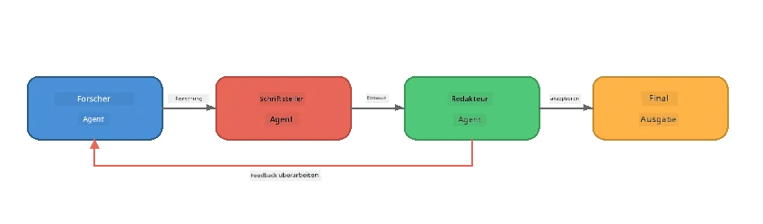
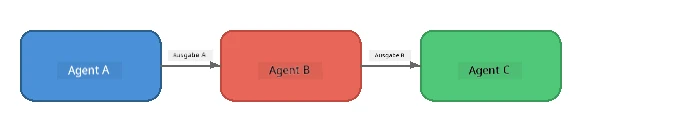
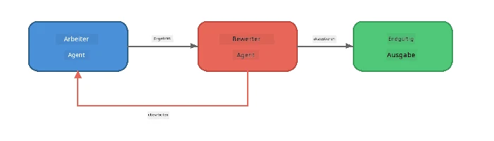
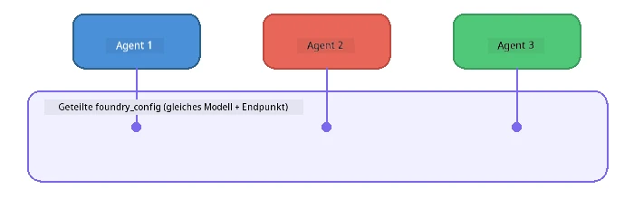

# Teil 6: Multi-Agent Workflows

> **Ziel:** Mehrere spezialisierte Agents in koordinierte Pipelines kombinieren, die komplexe Aufgaben unter zusammenarbeitenden Agents aufteilen – alles lokal mit Foundry Local ausgeführt.

## Warum Multi-Agent?

Ein einzelner Agent kann viele Aufgaben erledigen, aber komplexe Arbeitsabläufe profitieren von **Spezialisierung**. Anstatt dass ein Agent gleichzeitig recherchiert, schreibt und redigiert, teilt man die Arbeit in fokussierte Rollen auf:



| Muster | Beschreibung |
|---------|-------------|
| **Sequenziell** | Ausgabe von Agent A geht an Agent B → Agent C |
| **Feedback-Schleife** | Ein Evaluator-Agent kann Arbeit zur Überarbeitung zurücksenden |
| **Gemeinsamer Kontext** | Alle Agents verwenden dasselbe Modell/Endpoint, aber unterschiedliche Anweisungen |
| **Typisierte Ausgabe** | Agents erzeugen strukturierte Ergebnisse (JSON) für verlässliche Übergaben |

---

## Übungen

### Übung 1 - Führe die Multi-Agent Pipeline aus

Der Workshop enthält einen kompletten Researcher → Writer → Editor Workflow.

<details>
<summary><strong>🐍 Python</strong></summary>

**Setup:**
```bash
cd python
python -m venv venv

# Windows (PowerShell):
venv\Scripts\Activate.ps1
# macOS:
source venv/bin/activate

pip install -r requirements.txt
```

**Ausführen:**
```bash
python foundry-local-multi-agent.py
```

**Was passiert:**
1. **Researcher** erhält ein Thema und liefert Stichpunkt-Fakten
2. **Writer** nimmt die Recherche und erstellt einen Blog-Artikelentwurf (3-4 Absätze)
3. **Editor** prüft den Artikel auf Qualität und gibt ACCEPT oder REVISE zurück

</details>

<details>
<summary><strong>📦 JavaScript</strong></summary>

**Setup:**
```bash
cd javascript
npm install
```

**Ausführen:**
```bash
node foundry-local-multi-agent.mjs
```

**Gleiche dreistufige Pipeline** - Researcher → Writer → Editor.

</details>

<details>
<summary><strong>💜 C#</strong></summary>

**Setup:**
```bash
cd csharp
dotnet restore
```

**Ausführen:**
```bash
dotnet run multi
```

**Gleiche dreistufige Pipeline** - Researcher → Writer → Editor.

</details>

---

### Übung 2 - Aufbau der Pipeline

Untersuche, wie Agents definiert und verbunden sind:

**1. Gemeinsamer Modell-Client**

Alle Agents teilen dasselbe Foundry Local Modell:

```python
# Python - FoundryLocalClient kümmert sich um alles
from agent_framework_foundry_local import FoundryLocalClient

client = FoundryLocalClient(model_id="phi-3.5-mini")
```

```javascript
// JavaScript - OpenAI SDK zeigt auf Foundry Local
const client = new OpenAI({
  baseURL: manager.urls[0] + "/v1",
  apiKey: "foundry-local",
});
```

```csharp
// C# - OpenAIClient pointed at Foundry Local
var key = new ApiKeyCredential("foundry-local");
var client = new OpenAIClient(key, new OpenAIClientOptions
{
    Endpoint = new Uri(manager.Urls[0] + "/v1")
});
var chatClient = client.GetChatClient(model.Id);
```

**2. spezialisierte Anweisungen**

Jeder Agent hat eine eigene Persona:

| Agent | Anweisungen (kurz) |
|-------|--------------------|
| Researcher | "Gib wichtige Fakten, Statistiken und Hintergrundinformationen. Organisiere als Stichpunkte." |
| Writer | "Schreibe auf Basis der Notizen einen ansprechenden Blogbeitrag (3-4 Absätze). Erfinde keine Fakten." |
| Editor | "Prüfe auf Klarheit, Grammatik und sachliche Konsistenz. Urteil: ACCEPT oder REVISE." |

**3. Datenfluss zwischen Agents**

```python
# Schritt 1 - Ausgabe des Forschers wird Eingabe für den Autor
research_result = await researcher.run(f"Research: {topic}")

# Schritt 2 - Ausgabe des Autors wird Eingabe für den Redakteur
writer_result = await writer.run(f"Write using:\n{research_result}")

# Schritt 3 - Der Redakteur prüft sowohl die Forschung als auch den Artikel
editor_result = await editor.run(
    f"Research:\n{research_result}\n\nArticle:\n{writer_result}"
)
```

```csharp
// C# - same pattern, async calls with AIAgent
var researchNotes = await researcher.RunAsync(
    $"Research the following topic and provide key facts:\n{topic}");

var draft = await writer.RunAsync(
    $"Write a blog post based on these research notes:\n\n{researchNotes}");

var verdict = await editor.RunAsync(
    $"Review this article for quality and accuracy.\n\n" +
    $"Research notes:\n{researchNotes}\n\n" +
    $"Article:\n{draft}");
```

> **Wichtig:** Jeder Agent erhält den kumulierten Kontext der Vorgänger. Der Editor sieht sowohl die Originalrecherche als auch den Entwurf – so kann er die Fakten überprüfen.

---

### Übung 3 - Füge einen vierten Agent hinzu

Erweitere die Pipeline mit einem neuen Agent. Wähle einen:

| Agent | Zweck | Anweisungen |
|-------|-------|-------------|
| **Fact-Checker** | Überprüft Behauptungen im Artikel | `"Du überprüfst die Faktenbehauptungen. Für jede Behauptung gib an, ob sie durch die Recherchen gestützt wird. Gib JSON mit verifizierten/nicht verifizierten Punkten zurück."` |
| **Headline Writer** | Erzeugt eingängige Überschriften | `"Generiere 5 Überschriftenoptionen für den Artikel. Variiere den Stil: informativ, Clickbait, Frage, Listenartikel, emotional."` |
| **Social Media** | Erzeugt Promo-Posts | `"Erstelle 3 Social-Media-Beiträge zur Bewerbung des Artikels: einen für Twitter (280 Zeichen), einen für LinkedIn (professioneller Ton), einen für Instagram (locker mit Emoji-Vorschlägen)."` |

<details>
<summary><strong>🐍 Python – Hinzufügen eines Headline Writers</strong></summary>

```python
headline_agent = client.as_agent(
    name="HeadlineWriter",
    instructions=(
        "You are a headline specialist. Given an article, generate exactly "
        "5 headline options. Vary the style: informative, question-based, "
        "listicle, emotional, and provocative. Return them as a numbered list."
    ),
)

# Nachdem der Editor akzeptiert hat, Schlagzeilen generieren
headline_result = await headline_agent.run(
    f"Generate headlines for this article:\n\n{writer_result}"
)
print(f"\n--- Headlines ---\n{headline_result}")
```

</details>

<details>
<summary><strong>📦 JavaScript – Hinzufügen eines Headline Writers</strong></summary>

```javascript
const headlineAgent = new ChatAgent({
  client,
  modelId: modelInfo.id,
  instructions:
    "You are a headline specialist. Given an article, generate exactly " +
    "5 headline options. Vary the style: informative, question-based, " +
    "listicle, emotional, and provocative. Return them as a numbered list.",
  name: "HeadlineWriter",
});

const headlineResult = await headlineAgent.run(
  `Generate headlines for this article:\n\n${writerResult.text}`
);
console.log(`\n--- Headlines ---\n${headlineResult.text}`);
```

</details>

<details>
<summary><strong>💜 C# – Hinzufügen eines Headline Writers</strong></summary>

```csharp
AIAgent headlineAgent = chatClient.AsAIAgent(
    name: "HeadlineWriter",
    instructions:
        "You are a headline specialist. Given an article, generate exactly " +
        "5 headline options. Vary the style: informative, question-based, " +
        "listicle, emotional, and provocative. Return them as a numbered list."
);

// After the editor accepts, generate headlines
var headlines = await headlineAgent.RunAsync(
    $"Generate headlines for this article:\n\n{draft}");
Console.WriteLine($"\n--- Headlines ---\n{headlines}");
```

</details>

---

### Übung 4 – Gestalte deinen eigenen Workflow

Entwerfe eine Multi-Agent Pipeline für eine andere Domäne. Hier einige Ideen:

| Domäne | Agents | Ablauf |
|--------|--------|--------|
| **Code Review** | Analyser → Reviewer → Summariser | Code-Struktur analysieren → auf Probleme prüfen → Zusammenfassungsbericht erstellen |
| **Kundensupport** | Classifier → Responder → QA | Ticket klassifizieren → Antwort entwerfen → Qualität prüfen |
| **Bildung** | Quiz Maker → Student Simulator → Grader | Quiz erstellen → Antworten simulieren → bewerten und erklären |
| **Datenanalyse** | Interpreter → Analyst → Reporter | Datenanfrage interpretieren → Muster analysieren → Bericht schreiben |

**Schritte:**
1. Definiere 3+ Agents mit eigenen `instructions`
2. Lege den Datenfluss fest – was empfängt und erzeugt jeder Agent?
3. Implementiere die Pipeline mit den Mustern aus Übung 1–3
4. Füge eine Feedback-Schleife hinzu, falls ein Agent die Arbeit eines anderen bewerten soll

---

## Orchestrierungs-Muster

Hier einige Orchestrierungs-Muster, die für jedes Multi-Agent-System gelten (ausführlich behandelt in [Teil 7](part7-zava-creative-writer.md)):

### Sequenzielle Pipeline



Jeder Agent verarbeitet die Ausgabe des Vorgängers. Einfach und berechenbar.

### Feedback-Schleife



Ein Evaluator-Agent kann die erneute Ausführung früherer Schritte anstoßen. Der Zava Writer nutzt das: Der Editor kann Feedback an Researcher und Writer zurückarbeiten.

### Gemeinsamer Kontext



Alle Agents nutzen dieselbe `foundry_config`, also das gleiche Modell und den selben Endpoint.

---

## Wichtige Erkenntnisse

| Konzept | Was Sie gelernt haben |
|---------|----------------------|
| Agent-Spezialisierung | Jeder Agent macht eine Sache gut mit fokussierten Anweisungen |
| Datenübergaben | Die Ausgabe eines Agents wird zum Input des nächsten |
| Feedback-Schleifen | Ein Evaluator kann Wiederholungen für bessere Qualität auslösen |
| Strukturierte Ausgabe | JSON-formatierte Antworten ermöglichen zuverlässige Kommunikation zwischen Agents |
| Orchestrierung | Ein Koordinator steuert Reihenfolge der Pipeline und Fehlerbehandlung |
| Produktionsmuster | In [Teil 7: Zava Creative Writer](part7-zava-creative-writer.md) angewandt |

---

## Nächste Schritte

Gehe weiter zu [Teil 7: Zava Creative Writer – Abschlussanwendung](part7-zava-creative-writer.md), um eine produktionsreife Multi-Agent-App mit 4 spezialisierten Agents, Streaming-Ausgabe, Produktsuche und Feedback-Schleifen zu erkunden – verfügbar in Python, JavaScript und C#.