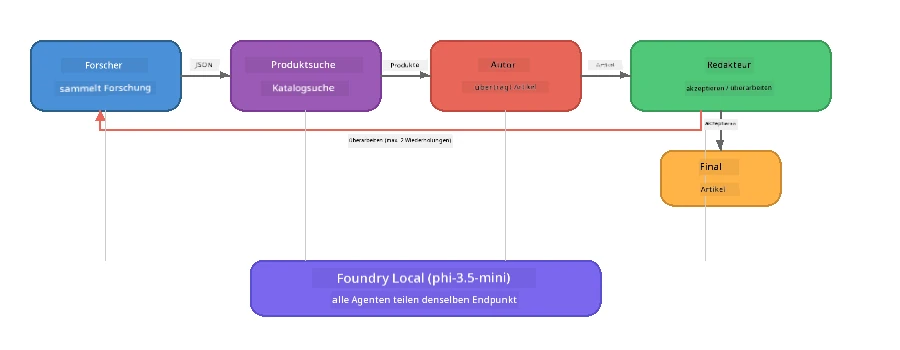

# Teil 7: Zava Creative Writer – Abschlussanwendung

> **Ziel:** Erkunde eine produktionsartige Multi-Agenten-Anwendung, in der vier spezialisierte Agenten zusammenarbeiten, um magazinwürdige Artikel für Zava Retail DIY zu erstellen – die vollständig auf deinem Gerät mit Foundry Local ausgeführt wird.

Dies ist das **Abschluss-Labor** des Workshops. Es bringt alles zusammen, was du gelernt hast – SDK-Integration (Teil 3), Abruf aus lokalen Daten (Teil 4), Agenten-Personas (Teil 5) und Multi-Agenten-Orchestrierung (Teil 6) – in eine vollständige Anwendung, verfügbar in **Python**, **JavaScript** und **C#**.

---

## Was du erkunden wirst

| Konzept | Wo im Zava Writer |
|---------|----------------------------|
| 4-stufiges Modellladen | Gemeinsames Konfigurationsmodul bootstrapped Foundry Local |
| RAG-basierter Abruf | Produkt-Agent durchsucht lokalen Katalog |
| Agentenspezialisierung | 4 Agenten mit unterschiedlichen Systemaufforderungen |
| Streaming-Ausgabe | Writer liefert Tokens in Echtzeit |
| Strukturierte Übergaben | Researcher → JSON, Editor → JSON-Entscheidung |
| Feedback-Schleifen | Editor kann Neu-Ausführung auslösen (max. 2 Versuche) |

---

## Architektur

Der Zava Creative Writer verwendet eine **sequentielle Pipeline mit evaluatorgetriebenem Feedback**. Alle drei Sprachimplementierungen folgen derselben Architektur:



### Die vier Agenten

| Agent | Eingabe | Ausgabe | Zweck |
|-------|---------|---------|-------|
| **Researcher** | Thema + optionales Feedback | `{"web": [{url, name, description}, ...]}` | Sammelt Hintergrundrecherche via LLM |
| **Product Search** | Produkt-Kontext-String | Liste passender Produkte | LLM-generierte Anfragen + Keyword-Suche im lokalen Katalog |
| **Writer** | Recherche + Produkte + Auftrag + Feedback | Gestreamter Artikeltext (geteilt bei `---`) | Entwirft einen magazinreifen Artikel in Echtzeit |
| **Editor** | Artikel + selbstgeneriertes Feedback des Writers | `{"decision": "accept/revise", "editorFeedback": "...", "researchFeedback": "..."}` | Bewertet Qualität, löst bei Bedarf Retry aus |

### Pipeline-Fluss

1. **Researcher** erhält das Thema und erzeugt strukturierte Recherchenotizen (JSON)
2. **Product Search** durchsucht den lokalen Produktkatalog mit LLM-generierten Suchbegriffen
3. **Writer** kombiniert Recherche + Produkte + Auftrag zu einem streamingfähigen Artikel und hängt nach `---` das eigene Feedback an
4. **Editor** bewertet den Artikel und gibt ein JSON-Urteil zurück:
   - `"accept"` → Pipeline ist abgeschlossen
   - `"revise"` → Feedback wird an Researcher und Writer zurückgesendet (max. 2 Versuche)

---

## Voraussetzungen

- Abschluss von [Teil 6: Multi-Agenten-Arbeitsabläufe](part6-multi-agent-workflows.md)
- Foundry Local CLI installiert und Modell `phi-3.5-mini` heruntergeladen

---

## Übungen

### Übung 1 – Führe den Zava Creative Writer aus

Wähle deine Programmiersprache und starte die Anwendung:

<details>
<summary><strong>🐍 Python – FastAPI Web-Service</strong></summary>

Die Python-Version läuft als **Web-Service** mit einer REST-API und zeigt, wie man ein Produktions-Backend baut.

**Setup:**
```bash
cd zava-creative-writer-local/src/api
python -m venv venv

# Windows (PowerShell):
venv\Scripts\Activate.ps1
# macOS:
source venv/bin/activate

pip install -r requirements.txt
```

**Start:**
```bash
uvicorn main:app --reload
```

**Teste es:**
```bash
curl -X POST http://localhost:8000/api/article \
  -H "Content-Type: application/json" \
  -d '{
    "research": "DIY home improvement trends",
    "products": "power tools and paints",
    "assignment": "Write an article about weekend renovation projects for DIY enthusiasts"
  }'
```

Die Antwort wird als newline-getrennte JSON-Nachrichten live gestreamt und zeigt den Fortschritt jedes Agenten.

</details>

<details>
<summary><strong>📦 JavaScript – Node.js CLI</strong></summary>

Die JavaScript-Version läuft als **CLI-Anwendung** und gibt sowohl den Agentenfortschritt als auch den Artikel direkt in der Konsole aus.

**Setup:**
```bash
cd zava-creative-writer-local/src/javascript
npm install
```

**Start:**
```bash
node main.mjs
```

Du siehst:
1. Foundry Local Modell-Ladevorgang (mit Fortschrittsanzeige beim Download)
2. Ausführung der einzelnen Agenten nacheinander mit Statusmeldungen
3. Den Artikel wird in Echtzeit in die Konsole gestreamt
4. Die Annahme-/Überarbeitung-Entscheidung des Editors

</details>

<details>
<summary><strong>💜 C# – .NET Konsolenanwendung</strong></summary>

Die C#-Version läuft als **.NET-Konsolenanwendung** mit derselben Pipeline und Streaming-Ausgabe.

**Setup:**
```bash
cd zava-creative-writer-local/src/csharp
dotnet restore
```

**Start:**
```bash
dotnet run
```

Dasselbe Ausgabeformat wie bei der JavaScript-Version – Agentenstatusmeldungen, gestreamter Artikel und das Urteil des Editors.

</details>

---

### Übung 2 – Untersuche die Code-Struktur

Jede Sprachimplementierung verwendet dieselben logischen Komponenten. Vergleiche die Strukturen:

**Python** (`src/api/`):
| Datei | Zweck |
|-------|-------|
| `foundry_config.py` | Gemeinsamer Foundry Local Manager, Modell und Client (4-stufige Initialisierung) |
| `orchestrator.py` | Pipeline-Koordination mit Feedback-Schleife |
| `main.py` | FastAPI-Endpunkte (`POST /api/article`) |
| `agents/researcher/researcher.py` | Recherche via LLM mit JSON-Ausgabe |
| `agents/product/product.py` | LLM-generierte Suchanfragen + Keyword-Suche |
| `agents/writer/writer.py` | Streaming-Artikelgenerierung |
| `agents/editor/editor.py` | JSON-basierte Annahme-/Überarbeitungsentscheidung |

**JavaScript** (`src/javascript/`):
| Datei | Zweck |
|-------|-------|
| `foundryConfig.mjs` | Gemeinsames Foundry Local Config (4-stufige Initialisierung mit Fortschrittsanzeige) |
| `main.mjs` | Orchestrator + CLI Einstiegspunkt |
| `researcher.mjs` | LLM-basierter Recherche-Agent |
| `product.mjs` | LLM-Anfrage-Generierung + Keyword-Suche |
| `writer.mjs` | Streaming-Artikelgenerierung (async Generator) |
| `editor.mjs` | JSON Annahme-/Überarbeitungsentscheidung |
| `products.mjs` | Produktkatalogdaten |

**C#** (`src/csharp/`):
| Datei | Zweck |
|-------|-------|
| `Program.cs` | Vollständige Pipeline: Modellladen, Agenten, Orchestrator, Feedback-Schleife |
| `ZavaCreativeWriter.csproj` | .NET 9 Projekt mit Foundry Local + OpenAI Paketen |

> **Design-Hinweis:** Python trennt jeden Agenten in eigene Datei/Verzeichnis (gut für größere Teams). JavaScript verwendet ein Modul pro Agent (gut für mittlere Projekte). C# hält alles in einer Datei mit lokalen Funktionen (gut für kompakte Beispiele). In Produktion wähle das Muster, das zum Team passt.

---

### Übung 3 – Verfolge die Gemeinsame Konfiguration

Jeder Agent der Pipeline teilt sich einen einzelnen Foundry Local Modell-Client. Untersuche, wie das in jeder Sprache eingerichtet ist:

<details>
<summary><strong>🐍 Python – foundry_config.py</strong></summary>

```python
from foundry_local import FoundryLocalManager

MODEL_ALIAS = "phi-3.5-mini"

# Schritt 1: Manager erstellen und den Foundry Local Dienst starten
manager = FoundryLocalManager()
manager.start_service()

# Schritt 2: Überprüfen, ob das Modell bereits heruntergeladen wurde
cached = manager.list_cached_models()
catalog_info = manager.get_model_info(MODEL_ALIAS)
is_cached = any(m.id == catalog_info.id for m in cached) if catalog_info else False

if not is_cached:
    manager.download_model(MODEL_ALIAS)

# Schritt 3: Das Modell in den Arbeitsspeicher laden
manager.load_model(MODEL_ALIAS)
model_id = manager.get_model_info(MODEL_ALIAS).id

# Gemeinsamer OpenAI-Client
client = openai.OpenAI(base_url=manager.endpoint, api_key=manager.api_key)
```

Alle Agenten importieren `from foundry_config import client, model_id`.

</details>

<details>
<summary><strong>📦 JavaScript – foundryConfig.mjs</strong></summary>

```javascript
import { FoundryLocalManager } from "foundry-local-sdk";
import { OpenAI } from "openai";

FoundryLocalManager.create({ appName: "ZavaCreativeWriter" });
const manager = FoundryLocalManager.instance;
await manager.startWebService();

// Cache prüfen → herunterladen → laden (neues SDK-Muster)
const catalog = manager.catalog;
const model = await catalog.getModel(MODEL_ALIAS);
if (!model.isCached) {
  console.log(`Downloading model: ${MODEL_ALIAS}...`);
  await model.download();
}
await model.load();

const client = new OpenAI({ baseURL: manager.urls[0] + "/v1", apiKey: "foundry-local" });
const modelId = model.id;
export { client, modelId };
```

Alle Agenten importieren `{ client, modelId } from "./foundryConfig.mjs"`.

</details>

<details>
<summary><strong>💜 C# – oben in Program.cs</strong></summary>

```csharp
await FoundryLocalManager.CreateAsync(
    new Configuration
    {
        AppName = "ZavaCreativeWriter",
        Web = new Configuration.WebService { Urls = "http://127.0.0.1:0" }
    }, NullLogger.Instance, default);
var manager = FoundryLocalManager.Instance;
await manager.StartWebServiceAsync(default);

var catalog = await manager.GetCatalogAsync(default);
var catalogModel = await catalog.GetModelAsync(alias, default);
var isCached = await catalogModel.IsCachedAsync(default);
if (!isCached)
    await catalogModel.DownloadAsync(null, default);

await catalogModel.LoadAsync(default);
var key = new ApiKeyCredential("foundry-local");
var chatClient = new OpenAIClient(key, new OpenAIClientOptions
{
    Endpoint = new Uri(manager.Urls[0] + "/v1")
}).GetChatClient(catalogModel.Id);
```

Der `chatClient` wird dann an alle Agentenfunktionen in derselben Datei übergeben.

</details>

> **Schlüsselpattern:** Das Modellladen-Muster (Service starten → Cache prüfen → herunterladen → laden) sorgt dafür, dass der Benutzer klaren Fortschritt sieht und das Modell nur einmal heruntergeladen wird. Das ist Best Practice für jede Foundry Local Anwendung.

---

### Übung 4 – Verstehe die Feedback-Schleife

Die Feedback-Schleife macht diese Pipeline „intelligent“ – der Editor kann Arbeit zurück zur Überarbeitung senden. Verfolge die Logik:

```
Orchestrator:
  1. researcher.research(topic, "No Feedback")    ← first pass
  2. product.findProducts(productContext)
  3. writer.write(research, products, assignment)  ← streams article
  4. Split article at "---" → article + writerFeedback
  5. editor.edit(article, writerFeedback)

  WHILE editor says "revise" AND retryCount < 2:
    6. researcher.research(topic, editor.researchFeedback)  ← refined
    7. writer.write(research, products, editor.editorFeedback)
    8. editor.edit(newArticle, newWriterFeedback)
    9. retryCount++
```

**Zu überlegende Fragen:**
- Warum ist das Retry-Limit auf 2 gesetzt? Was passiert, wenn du es erhöhst?
- Warum bekommt der Researcher `researchFeedback`, der Writer dagegen `editorFeedback`?
- Was würde passieren, wenn der Editor immer "revise" sagt?

---

### Übung 5 – Ändere einen Agenten

Versuche, das Verhalten eines Agenten zu ändern und beobachte, wie sich das auf die Pipeline auswirkt:

| Änderung | Was ändern |
|----------|------------|
| **Strengerer Editor** | Ändere die Systemaufforderung des Editors, sodass er immer mindestens eine Überarbeitung verlangt |
| **Längere Artikel** | Ändere die Writer-Aufforderung von „800-1000 Wörter“ auf „1500-2000 Wörter“ |
| **Andere Produkte** | Füge Produkte hinzu oder ändere Produkte im Produktkatalog |
| **Neues Forschungsthema** | Ändere den Standard-`researchContext` auf ein anderes Thema |
| **Nur JSON Researcher** | Lass den Researcher 10 statt 3-5 Elemente zurückgeben |

> **Tipp:** Da alle drei Sprachen dieselbe Architektur implementieren, kannst du dieselbe Änderung in der Sprache vornehmen, mit der du dich am wohlsten fühlst.

---

### Übung 6 – Füge einen fünften Agenten hinzu

Erweitere die Pipeline um einen neuen Agenten. Einige Ideen:

| Agent | Im Pipeline-Schritt | Zweck |
|-------|--------------------|-------|
| **Fact-Checker** | Nach Writer, vor Editor | Überprüft Behauptungen anhand der Forschungsdaten |
| **SEO Optimierer** | Nach Annahme durch den Editor | Fügt Meta-Beschreibung, Schlüsselwörter, Slug hinzu |
| **Illustrator** | Nach Annahme durch den Editor | Generiert Bildaufforderungen für den Artikel |
| **Übersetzer** | Nach Annahme durch den Editor | Übersetzt den Artikel in eine andere Sprache |

**Schritte:**
1. Schreib die Systemaufforderung für den Agenten
2. Erstelle die Agentenfunktion (angepasst an das existierende Muster deiner Sprache)
3. Füge ihn an der richtigen Stelle im Orchestrator ein
4. Aktualisiere Ausgabe/Logging, um den Beitrag des neuen Agenten anzuzeigen

---

## Wie Foundry Local und das Agent Framework zusammenarbeiten

Diese Anwendung zeigt das empfohlene Muster, um Multi-Agent-Systeme mit Foundry Local zu bauen:

| Ebene | Komponente | Aufgabe |
|-------|------------|---------|
| **Laufzeit** | Foundry Local | Lädt, verwaltet und bedient das Modell lokal |
| **Client** | OpenAI SDK | Sendet Chat Completion-Anfragen an den lokalen Endpunkt |
| **Agent** | Systemprompt + Chat-Aufruf | spezialisiert durch fokussierte Instruktionen |
| **Orchestrator** | Pipeline-Koordinator | Verwalten von Datenfluss, Reihenfolge und Feedback-Schleifen |
| **Framework** | Microsoft Agent Framework | Bietet die `ChatAgent`-Abstraktion und Muster |

Die Kernbotschaft: **Foundry Local ersetzt das Cloud-Backend, nicht die Anwendungsarchitektur.** Dieselben Agentenmuster, Orchestrierungsstrategien und strukturierten Übergaben, die mit cloudbasierten Modellen funktionieren, funktionieren identisch mit lokalen Modellen – du leitest den Client einfach an den lokalen Endpunkt anstelle eines Azure-Endpunkts.

---

## Wichtige Erkenntnisse

| Konzept | Was du gelernt hast |
|---------|--------------------|
| Produktionsarchitektur | Wie man eine Multi-Agenten-App mit gemeinsamer Konfig und getrennten Agenten strukturiert |
| 4-stufiges Modellladen | Best Practice für Foundry Local Initialisierung mit für Nutzer sichtbarem Fortschritt |
| Agentenspezialisierung | Jeder der 4 Agenten hat fokussierte Anweisungen und ein spezifisches Ausgabeformat |
| Streaming-Generierung | Writer liefert Tokens in Echtzeit für reaktive UIs |
| Feedback-Schleifen | Editor-gesteuerte Retrys verbessern die Ausgabequalität ohne menschliche Intervention |
| Sprachübergreifende Muster | Dieselbe Architektur funktioniert in Python, JavaScript und C# |
| Lokal = produktionsreif | Foundry Local bietet dieselbe OpenAI-kompatible API wie Cloud-Deployments |

---

## Nächster Schritt

Fahre fort mit [Teil 8: Evaluation-Led Development](part8-evaluation-led-development.md), um ein systematisches Evaluierungsframework für deine Agenten zu erstellen, mit Goldstandard-Datensätzen, regelbasierten Prüfungen und LLM-als-Judge Bewertung.