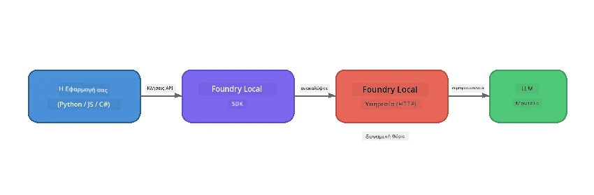

# Μέρος 1: Ξεκινώντας με το Foundry Local


## Τι είναι το Foundry Local;

Το [Foundry Local](https://foundrylocal.ai) σας επιτρέπει να τρέχετε ανοιχτού κώδικα μοντέλα γλώσσας AI **απευθείας στον υπολογιστή σας** - χωρίς ανάγκη σύνδεσης στο διαδίκτυο, χωρίς κόστος στο νέφος και με πλήρη προστασία δεδομένων. Περιλαμβάνει:

- **Κατέβασμα και εκτέλεση μοντέλων τοπικά** με αυτόματη βελτιστοποίηση για το υλικό (GPU, CPU ή NPU)
- **Παροχή OpenAI-συμβατού API** ώστε να χρησιμοποιείτε οικεία SDKs και εργαλεία
- **Δεν απαιτεί συνδρομή Azure** ή εγγραφή - απλά εγκαταστήστε και ξεκινήστε την ανάπτυξη

Σκεφτείτε το σαν να έχετε τον δικό σας ιδιωτικό AI που τρέχει εξ ολοκλήρου στον υπολογιστή σας.

## Στόχοι Εκμάθησης

Μέχρι το τέλος αυτού του εργαστηρίου θα μπορείτε να:

- Εγκαταστήσετε το Foundry Local CLI στο λειτουργικό σας σύστημα
- Κατανοήσετε τι είναι τα ψευδώνυμα μοντέλων και πώς λειτουργούν
- Κατεβάσετε και τρέξετε το πρώτο local AI μοντέλο σας
- Στείλετε ένα μήνυμα συνομιλίας σε τοπικό μοντέλο από τη γραμμή εντολών
- Κατανοήσετε τη διαφορά μεταξύ τοπικών και cloud-hosted μοντέλων AI

---

## Προαπαιτούμενα

### Απαιτήσεις Συστήματος

| Απαίτηση | Ελάχιστο | Συνιστώμενο |
|-------------|---------|-------------|
| **RAM** | 8 GB | 16 GB |
| **Χώρος Δίσκου** | 5 GB (για μοντέλα) | 10 GB |
| **CPU** | 4 πυρήνες | 8+ πυρήνες |
| **GPU** | Προαιρετικό | NVIDIA με CUDA 11.8+ |
| **ΛΣ** | Windows 10/11 (x64/ARM), Windows Server 2025, macOS 13+ | - |

> **Σημείωση:** Το Foundry Local επιλέγει αυτόματα την καλύτερη παραλλαγή μοντέλου για το υλικό σας. Αν έχετε NVIDIA GPU, χρησιμοποιεί επιτάχυνση CUDA. Αν έχετε Qualcomm NPU, το χρησιμοποιεί αυτό. Διαφορετικά, πέφτει σε βελτιστοποιημένη παραλλαγή CPU.

### Εγκατάσταση Foundry Local CLI

**Windows** (PowerShell):
```powershell
winget install Microsoft.FoundryLocal
```

**macOS** (Homebrew):
```bash
brew tap microsoft/foundrylocal
brew install foundrylocal
```

> **Σημείωση:** Το Foundry Local υποστηρίζει προς το παρόν μόνο Windows και macOS. To Linux δεν υποστηρίζεται ακόμα.

Επαληθεύστε την εγκατάσταση:
```bash
foundry --version
```

---

## Ασκήσεις Εργαστηρίου

### Άσκηση 1: Εξερευνήστε Διαθέσιμα Μοντέλα

Το Foundry Local περιλαμβάνει έναν κατάλογο προ-βελτιστοποιημένων ανοιχτού κώδικα μοντέλων. Λίστα τους:

```bash
foundry model list
```

Θα δείτε μοντέλα όπως:
- `phi-3.5-mini` - Το μοντέλο 3.8 δισεκατομμυρίων παραμέτρων της Microsoft (γρήγορο, καλή ποιότητα)
- `phi-4-mini` - Νεότερο, πιο ικανό μοντέλο Phi
- `phi-4-mini-reasoning` - Μοντέλο Phi με αλυσίδα σκέψης (`<think>` tags)
- `phi-4` - Το μεγαλύτερο μοντέλο Phi της Microsoft (10.4 GB)
- `qwen2.5-0.5b` - Πολύ μικρό και γρήγορο (καλό για συσκευές χαμηλών πόρων)
- `qwen2.5-7b` - Ισχυρό γενικού σκοπού μοντέλο με υποστήριξη κλήσης εργαλείων
- `qwen2.5-coder-7b` - Βελτιστοποιημένο για παραγωγή κώδικα
- `deepseek-r1-7b` - Ισχυρό μοντέλο συλλογισμού
- `gpt-oss-20b` - Μεγάλο ανοιχτού κώδικα μοντέλο (άδεια MIT, 12.5 GB)
- `whisper-base` - Μετατροπή ομιλίας σε κείμενο (383 MB)
- `whisper-large-v3-turbo` - Υψηλής ακρίβειας μεταγραφή (9 GB)

> **Τι είναι το ψευδώνυμο μοντέλου;** Τα ψευδώνυμα όπως το `phi-3.5-mini` είναι συντομεύσεις. Όταν χρησιμοποιείτε ένα ψευδώνυμο, το Foundry Local κατεβάζει αυτόματα την καλύτερη παραλλαγή για το συγκεκριμένο υλικό σας (CUDA για NVIDIA GPUs, βελτιστοποιημένη CPU αλλιώς). Δεν χρειάζεται ποτέ να ανησυχείτε για την επιλογή της σωστής παραλλαγής.

### Άσκηση 2: Τρέξτε το Πρώτο σας Μοντέλο

Κατεβάστε και ξεκινήστε να συνομιλείτε με ένα μοντέλο διαδραστικά:

```bash
foundry model run phi-3.5-mini
```

Την πρώτη φορά που θα το τρέξετε, το Foundry Local θα:
1. Εντοπίσει το υλικό σας
2. Κατεβάσει την βέλτιστη παραλλαγή μοντέλου (μπορεί να πάρει λίγα λεπτά)
3. Φορτώσει το μοντέλο στη μνήμη
4. Ξεκινήσει μια συνεδρία συνομιλίας

Δοκιμάστε να του κάνετε κάποιες ερωτήσεις:
```
You: What is the golden ratio?
You: Can you explain it as if I were 10 years old?
You: Write a haiku about mathematics
```

Πληκτρολογήστε `exit` ή πατήστε `Ctrl+C` για έξοδο.

### Άσκηση 3: Προκαταβόλικο Κατέβασμα Μοντέλου

Αν θέλετε να κατεβάσετε ένα μοντέλο χωρίς να ξεκινήσετε συνομιλία:

```bash
foundry model download phi-3.5-mini
```

Ελέγξτε ποια μοντέλα είναι ήδη κατεβασμένα στον υπολογιστή σας:

```bash
foundry cache list
```

### Άσκηση 4: Κατανόηση της Αρχιτεκτονικής

Το Foundry Local τρέχει ως **τοπική υπηρεσία HTTP** που εκθέτει ένα OpenAI-συμβατό REST API. Αυτό σημαίνει:

1. Η υπηρεσία ξεκινά σε **δυναμική θύρα** (διαφορετική θύρα κάθε φορά)
2. Χρησιμοποιείτε το SDK για να βρείτε το πραγματικό URL του endpoint
3. Μπορείτε να χρησιμοποιήσετε **οποιαδήποτε** OpenAI-συμβατή βιβλιοθήκη για να επικοινωνήσετε



> **Σημαντικό:** Το Foundry Local αναθέτει μια **δυναμική θύρα** κάθε φορά που ξεκινά. Μην σκληροκωδικοποιείτε αριθμό θύρας όπως `localhost:5272`. Πάντα να χρησιμοποιείτε το SDK για να βρείτε το τρέχον URL (π.χ. `manager.endpoint` σε Python ή `manager.urls[0]` σε JavaScript).

---

## Κύρια Συμπεράσματα

| Έννοια | Τι Μάθατε |
|---------|------------------|
| AI στη συσκευή | Το Foundry Local τρέχει μοντέλα εξ ολοκλήρου στη συσκευή σας, χωρίς cloud, χωρίς API keys, και χωρίς κόστος |
| Ψευδώνυμα μοντέλων | Τα ψευδώνυμα όπως το `phi-3.5-mini` επιλέγουν αυτόματα την καλύτερη παραλλαγή για το υλικό σας |
| Δυναμικές θύρες | Η υπηρεσία τρέχει σε δυναμική θύρα· πάντα χρησιμοποιείτε το SDK για την εύρεση του endpoint |
| CLI και SDK | Μπορείτε να αλληλεπιδράσετε με μοντέλα μέσω CLI (`foundry model run`) ή προγραμματιστικά μέσω SDK |

---

## Επόμενα Βήματα

Συνεχίστε στο [Μέρος 2: Βαθιά Εμβάθυνση στο Foundry Local SDK](part2-foundry-local-sdk.md) για να μάθετε την API του SDK για τη διαχείριση μοντέλων, υπηρεσιών και cache προγραμματιστικά.