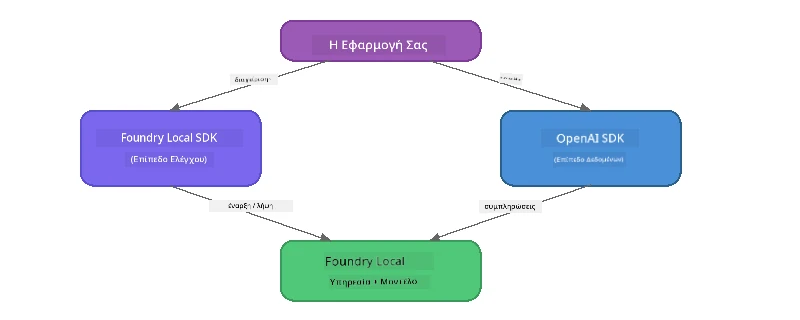

# Μέρος 3: Χρήση του Foundry Local SDK με το OpenAI

## Επισκόπηση

Στο Μέρος 1 χρησιμοποίησες το Foundry Local CLI για να τρέξεις μοντέλα διαδραστικά. Στο Μέρος 2 εξερεύνησες όλη την επιφάνεια της API του SDK. Τώρα θα μάθεις πώς να **ενσωματώσεις το Foundry Local στις εφαρμογές σου** χρησιμοποιώντας το SDK και το OpenAI-συμβατό API.

Το Foundry Local παρέχει SDK για τρεις γλώσσες. Διάλεξε αυτή που σου είναι πιο οικεία - οι έννοιες είναι ταυτόσημες σε όλες.

## Στόχοι Μάθησης

Στο τέλος αυτού του εργαστηρίου θα μπορείς να:

- Εγκαταστήσεις το Foundry Local SDK για τη γλώσσα σου (Python, JavaScript ή C#)
- Αρχικοποιήσεις το `FoundryLocalManager` για να ξεκινήσεις την υπηρεσία, να ελέγξεις την προσωρινή μνήμη, να κατεβάσεις και να φορτώσεις ένα μοντέλο
- Συνδεθείς με το τοπικό μοντέλο χρησιμοποιώντας το OpenAI SDK
- Στείλεις ολοκληρώσεις συνομιλιών και να χειριστείς ροές απαντήσεων
- Κατανοήσεις την αρχιτεκτονική δυναμικών θυρών

---

## Προαπαιτούμενα

Ολοκλήρωσε πρώτα τα [Μέρος 1: Ξεκινώντας με το Foundry Local](part1-getting-started.md) και [Μέρος 2: Βαθιά Εξέταση του Foundry Local SDK](part2-foundry-local-sdk.md).

Εγκατέστησε **ένα** από τα παρακάτω περιβάλλοντα εκτέλεσης γλώσσας:
- **Python 3.9+** - [python.org/downloads](https://www.python.org/downloads/)
- **Node.js 18+** - [nodejs.org](https://nodejs.org/)
- **.NET 9.0+** - [dot.net/download](https://dotnet.microsoft.com/download)

---

## Έννοια: Πώς Λειτουργεί το SDK

Το Foundry Local SDK διαχειρίζεται το **control plane** (εκκίνηση υπηρεσίας, λήψη μοντέλων), ενώ το OpenAI SDK χειρίζεται το **data plane** (αποστολή ερεθισμάτων, λήψη ολοκληρώσεων).



---

## Ασκήσεις Εργαστηρίου

### Άσκηση 1: Ρύθμισε το Περιβάλλον σου

<details>
<summary><b>🐍 Python</b></summary>

```bash
cd python
python -m venv venv

# Ενεργοποιήστε το εικονικό περιβάλλον:
# Windows (PowerShell):
venv\Scripts\Activate.ps1
# Windows (Γραμμή Εντολών):
venv\Scripts\activate.bat
# macOS:
source venv/bin/activate

pip install -r requirements.txt
```

Το `requirements.txt` εγκαθιστά:
- `foundry-local-sdk` - Το Foundry Local SDK (εισαγόμενο ως `foundry_local`)
- `openai` - Το OpenAI Python SDK
- `agent-framework` - Microsoft Agent Framework (χρησιμοποιείται σε μεταγενέστερα μέρη)

</details>

<details>
<summary><b>📘 JavaScript</b></summary>

```bash
cd javascript
npm install
```

Το `package.json` εγκαθιστά:
- `foundry-local-sdk` - Το Foundry Local SDK
- `openai` - Το OpenAI Node.js SDK

</details>

<details>
<summary><b>💜 C#</b></summary>

```bash
cd csharp
dotnet restore
dotnet build
```

Το `csharp.csproj` χρησιμοποιεί:
- `Microsoft.AI.Foundry.Local` - Το Foundry Local SDK (NuGet)
- `OpenAI` - Το OpenAI C# SDK (NuGet)

> **Δομή έργου:** Το έργο C# χρησιμοποιεί ένα δρομολογητή γραμμής εντολών στο `Program.cs` που κατανέμει σε ξεχωριστά αρχεία παραδειγμάτων. Τρέξε `dotnet run chat` (ή απλά `dotnet run`) για αυτό το μέρος. Άλλα μέρη χρησιμοποιούν `dotnet run rag`, `dotnet run agent` και `dotnet run multi`.

</details>

---

### Άσκηση 2: Βασική Ολοκλήρωση Συνομιλίας

Άνοιξε το βασικό παράδειγμα συνομιλίας για τη γλώσσα σου και μελέτησε τον κώδικα. Κάθε σενάριο ακολουθεί το ίδιο τριβάθμιο μοτίβο:

1. **Εκκίνηση της υπηρεσίας** - Το `FoundryLocalManager` ξεκινά το περιβάλλον εκτέλεσης Foundry Local
2. **Λήψη και φόρτωση μοντέλου** - έλεγχος προσωρινής μνήμης, λήψη αν χρειάζεται, και φόρτωση στη μνήμη
3. **Δημιουργία πελάτη OpenAI** - σύνδεση στο τοπικό endpoint και αποστολή ολοκλήρωσης συνομιλίας με ροή

<details>
<summary><b>🐍 Python - <code>python/foundry-local.py</code></b></summary>

```python
import sys
import openai
from foundry_local import FoundryLocalManager

alias = "phi-3.5-mini"

# Βήμα 1: Δημιουργήστε έναν FoundryLocalManager και ξεκινήστε την υπηρεσία
print("Starting Foundry Local service...")
manager = FoundryLocalManager()
manager.start_service()

# Βήμα 2: Ελέγξτε αν το μοντέλο έχει ήδη κατέβει
cached = manager.list_cached_models()
catalog_info = manager.get_model_info(alias)
is_cached = any(m.id == catalog_info.id for m in cached) if catalog_info else False

if is_cached:
    print(f"Model already downloaded: {alias}")
else:
    print(f"Downloading model: {alias} (this may take several minutes)...")
    manager.download_model(alias)
    print(f"Download complete: {alias}")

# Βήμα 3: Φορτώστε το μοντέλο στη μνήμη
print(f"Loading model: {alias}...")
manager.load_model(alias)

# Δημιουργήστε έναν πελάτη OpenAI που δείχνει στην τοπική υπηρεσία Foundry
client = openai.OpenAI(
    base_url=manager.endpoint,   # Δυναμική θύρα - ποτέ μη σκληροκωδικοποιείτε!
    api_key=manager.api_key
)

# Δημιουργήστε μια ροή συνομιλίας συμπλήρωσης
stream = client.chat.completions.create(
    model=manager.get_model_info(alias).id,
    messages=[{"role": "user", "content": "What is the golden ratio?"}],
    stream=True,
)

for chunk in stream:
    if chunk.choices[0].delta.content is not None:
        print(chunk.choices[0].delta.content, end="", flush=True)
print()
```

**Τρέξε το:**
```bash
python foundry-local.py
```

</details>

<details>
<summary><b>📘 JavaScript - <code>javascript/foundry-local.mjs</code></b></summary>

```javascript
import { OpenAI } from "openai";
import { FoundryLocalManager } from "foundry-local-sdk";

const alias = "phi-3.5-mini";

// Βήμα 1: Εκκίνηση της τοπικής υπηρεσίας Foundry
console.log("Starting Foundry Local service...");
FoundryLocalManager.create({ appName: "FoundryLocalWorkshop" });
const manager = FoundryLocalManager.instance;
await manager.startWebService();

// Βήμα 2: Έλεγχος αν το μοντέλο έχει ήδη κατέβει
const catalog = manager.catalog;
const model = await catalog.getModel(alias);

if (model.isCached) {
  console.log(`Model already downloaded: ${alias}`);
} else {
  console.log(`Downloading model: ${alias} (this may take several minutes)...`);
  await model.download();
  console.log(`Download complete: ${alias}`);
}

// Βήμα 3: Φόρτωση του μοντέλου στη μνήμη
console.log(`Loading model: ${alias}...`);
await model.load();
console.log(`Model loaded: ${model.id}`);

// Δημιουργία ενός πελάτη OpenAI που δείχνει στην τοπική υπηρεσία Foundry
const client = new OpenAI({
  baseURL: manager.urls[0] + "/v1",   // Δυναμική θύρα - ποτέ μη σκληροκωδικοποιείτε!
  apiKey: "foundry-local",
});

// Δημιουργία μίας ροής συνομιλίας ολοκλήρωσης
const stream = await client.chat.completions.create({
  model: model.id,
  messages: [{ role: "user", content: "What is the golden ratio?" }],
  stream: true,
});

for await (const chunk of stream) {
  if (chunk.choices[0]?.delta?.content) {
    process.stdout.write(chunk.choices[0].delta.content);
  }
}
console.log();
```

**Τρέξε το:**
```bash
node foundry-local.mjs
```

</details>

<details>
<summary><b>💜 C# - <code>csharp/BasicChat.cs</code></b></summary>

```csharp
using Microsoft.AI.Foundry.Local;
using Microsoft.Extensions.Logging.Abstractions;
using OpenAI;
using OpenAI.Chat;
using System.ClientModel;

var alias = "phi-3.5-mini";

// Step 1: Start the Foundry Local service
Console.WriteLine("Starting Foundry Local service...");
await FoundryLocalManager.CreateAsync(
    new Configuration
    {
        AppName = "FoundryLocalSamples",
        Web = new Configuration.WebService { Urls = "http://127.0.0.1:0" }
    }, NullLogger.Instance, default);
var manager = FoundryLocalManager.Instance;
await manager.StartWebServiceAsync(default);

// Step 2: Get the model from the catalog
var catalog = await manager.GetCatalogAsync(default);
var model = await catalog.GetModelAsync(alias, default);

// Step 3: Check if the model is already downloaded
var isCached = await model.IsCachedAsync(default);

if (isCached)
{
    Console.WriteLine($"Model already downloaded: {alias}");
}
else
{
    Console.WriteLine($"Downloading model: {alias} (this may take several minutes)...");
    await model.DownloadAsync(null, default);
    Console.WriteLine($"Download complete: {alias}");
}

// Step 4: Load the model into memory
Console.WriteLine($"Loading model: {alias}...");
await model.LoadAsync(default);
Console.WriteLine($"Loaded model: {model.Id}");
Console.WriteLine($"Endpoint: {manager.Urls[0]}");

// Create OpenAI client pointing to the LOCAL Foundry service
var key = new ApiKeyCredential("foundry-local");
var client = new OpenAIClient(key, new OpenAIClientOptions
{
    Endpoint = new Uri(manager.Urls[0] + "/v1")  // Dynamic port - never hardcode!
});

var chatClient = client.GetChatClient(model.Id);

// Stream a chat completion
var completionUpdates = chatClient.CompleteChatStreaming("What is the golden ratio?");

foreach (var update in completionUpdates)
{
    if (update.ContentUpdate.Count > 0)
    {
        Console.Write(update.ContentUpdate[0].Text);
    }
}
Console.WriteLine();
```

**Τρέξε το:**
```bash
dotnet run chat
```

</details>

---

### Άσκηση 3: Πειραματίσου με Ερεθίσματα

Όταν τρέξει το βασικό παράδειγμα, δοκίμασε να τροποποιήσεις τον κώδικα:

1. **Άλλαξε το μήνυμα χρήστη** - δοκίμασε διαφορετικές ερωτήσεις
2. **Πρόσθεσε ένα σύστημα προτροπής** - δώσε στο μοντέλο μια προσωπικότητα
3. **Απενεργοποίησε τη ροή** - όρισε `stream=False` και εκτύπωσε ολόκληρη την απάντηση σε ένα βήμα
4. **Δοκίμασε διαφορετικό μοντέλο** - άλλαξε το ψευδώνυμο από `phi-3.5-mini` σε κάποιο άλλο από το `foundry model list`

<details>
<summary><b>🐍 Python</b></summary>

```python
# Προσθέστε μια προτροπή συστήματος - δώστε στο μοντέλο μια προσωπικότητα:
stream = client.chat.completions.create(
    model=manager.get_model_info(alias).id,
    messages=[
        {"role": "system", "content": "You are a pirate. Answer everything in pirate speak."},
        {"role": "user", "content": "What is the golden ratio?"}
    ],
    stream=True,
)

# Ή απενεργοποιήστε τη ροή:
response = client.chat.completions.create(
    model=manager.get_model_info(alias).id,
    messages=[{"role": "user", "content": "What is the golden ratio?"}],
    stream=False,
)
print(response.choices[0].message.content)
```

</details>

<details>
<summary><b>📘 JavaScript</b></summary>

```javascript
// Προσθέστε μια προτροπή συστήματος - δώστε στο μοντέλο μια προσωπικότητα:
const stream = await client.chat.completions.create({
  model: modelInfo.id,
  messages: [
    { role: "system", content: "You are a pirate. Answer everything in pirate speak." },
    { role: "user", content: "What is the golden ratio?" },
  ],
  stream: true,
});

// Ή απενεργοποιήστε τη ροή δεδομένων:
const response = await client.chat.completions.create({
  model: modelInfo.id,
  messages: [{ role: "user", content: "What is the golden ratio?" }],
  stream: false,
});
console.log(response.choices[0].message.content);
```

</details>

<details>
<summary><b>💜 C#</b></summary>

```csharp
// Add a system prompt - give the model a persona:
var completionUpdates = chatClient.CompleteChatStreaming(
    new ChatMessage[]
    {
        new SystemChatMessage("You are a pirate. Answer everything in pirate speak."),
        new UserChatMessage("What is the golden ratio?")
    }
);

// Or turn off streaming:
var response = chatClient.CompleteChat("What is the golden ratio?");
Console.WriteLine(response.Value.Content[0].Text);
```

</details>

---

### Αναφορά Μεθόδων SDK

<details>
<summary><b>🐍 Μέθοδοι Python SDK</b></summary>

| Μέθοδος | Σκοπός |
|--------|---------|
| `FoundryLocalManager()` | Δημιουργία στιγμιότυπου διαχειριστή |
| `manager.start_service()` | Εκκίνηση της υπηρεσίας Foundry Local |
| `manager.list_cached_models()` | Λίστα μοντέλων που έχουν κατέβει στη συσκευή σου |
| `manager.get_model_info(alias)` | Λήψη αναγνωριστικού και μεταδεδομένων μοντέλου |
| `manager.download_model(alias, progress_callback=fn)` | Λήψη μοντέλου με προαιρετική συνάρτηση προόδου |
| `manager.load_model(alias)` | Φόρτωση μοντέλου στη μνήμη |
| `manager.endpoint` | Λήψη της δυναμικής διεύθυνσης endpoint |
| `manager.api_key` | Λήψη του κλειδιού API (τόπος κράτησης για τοπικό) |

</details>

<details>
<summary><b>📘 Μέθοδοι JavaScript SDK</b></summary>

| Μέθοδος | Σκοπός |
|--------|---------|
| `FoundryLocalManager.create({ appName })` | Δημιουργία στιγμιότυπου διαχειριστή |
| `FoundryLocalManager.instance` | Πρόσβαση στο singleton διαχειριστή |
| `await manager.startWebService()` | Εκκίνηση της υπηρεσίας Foundry Local |
| `await manager.catalog.getModel(alias)` | Λήψη μοντέλου από τον κατάλογο |
| `model.isCached` | Έλεγχος αν το μοντέλο έχει ήδη κατέβει |
| `await model.download()` | Λήψη μοντέλου |
| `await model.load()` | Φόρτωση μοντέλου στη μνήμη |
| `model.id` | Αναγνωριστικό μοντέλου για κλήσεις OpenAI API |
| `manager.urls[0] + "/v1"` | Λήψη της δυναμικής διεύθυνσης endpoint |
| `"foundry-local"` | Κλειδί API (τόπος κράτησης για τοπικό) |

</details>

<details>
<summary><b>💜 Μέθοδοι C# SDK</b></summary>

| Μέθοδος | Σκοπός |
|--------|---------|
| `FoundryLocalManager.CreateAsync(config)` | Δημιουργία και αρχικοποίηση διαχειριστή |
| `manager.StartWebServiceAsync()` | Εκκίνηση της υπηρεσίας Foundry Local |
| `manager.GetCatalogAsync()` | Λήψη καταλόγου μοντέλων |
| `catalog.ListModelsAsync()` | Λίστα όλων διαθέσιμων μοντέλων |
| `catalog.GetModelAsync(alias)` | Λήψη συγκεκριμένου μοντέλου από ψευδώνυμο |
| `model.IsCachedAsync()` | Έλεγχος εάν μοντέλο έχει κατέβει |
| `model.DownloadAsync()` | Λήψη μοντέλου |
| `model.LoadAsync()` | Φόρτωση μοντέλου στη μνήμη |
| `manager.Urls[0]` | Λήψη της δυναμικής διεύθυνσης endpoint |
| `new ApiKeyCredential("foundry-local")` | Διαπιστευτήρια κλειδιού API για τοπικό |

</details>

---

### Άσκηση 4: Χρήση του Native ChatClient (Εναλλακτικά αντί του OpenAI SDK)

Στις Ασκήσεις 2 και 3 χρησιμοποίησες το OpenAI SDK για ολοκληρώσεις συνομιλιών. Τα SDK JavaScript και C# παρέχουν επίσης έναν **native ChatClient** που εξαλείφει την ανάγκη για το OpenAI SDK εντελώς.

<details>
<summary><b>📘 JavaScript - <code>model.createChatClient()</code></b></summary>

```javascript
import { FoundryLocalManager } from "foundry-local-sdk";

const alias = "phi-3.5-mini";

FoundryLocalManager.create({ appName: "ChatClientDemo" });
const manager = FoundryLocalManager.instance;
await manager.startWebService();

const model = await manager.catalog.getModel(alias);
if (!model.isCached) await model.download();
await model.load();

// Δεν απαιτείται εισαγωγή του OpenAI — πάρε έναν πελάτη απευθείας από το μοντέλο
const chatClient = model.createChatClient();

// Ολοκλήρωση χωρίς ροή
const response = await chatClient.completeChat([
  { role: "system", content: "You are a pirate. Answer everything in pirate speak." },
  { role: "user", content: "What is the golden ratio?" }
]);
console.log(response.choices[0].message.content);

// Ολοκλήρωση με ροή (χρησιμοποιεί μοτίβο callback)
await chatClient.completeStreamingChat(
  [{ role: "user", content: "What is the golden ratio?" }],
  (chunk) => {
    if (chunk.choices?.[0]?.delta?.content) {
      process.stdout.write(chunk.choices[0].delta.content);
    }
  }
);
console.log();
```

> **Σημείωση:** Η μέθοδος `completeStreamingChat()` του ChatClient χρησιμοποιεί μοτίβο **callback**, όχι ασύγχρονο iterator. Πέρασε μια συνάρτηση ως δεύτερο όρισμα.

</details>

<details>
<summary><b>💜 C# - <code>model.GetChatClientAsync()</code></b></summary>

```csharp
var catalog = await manager.GetCatalogAsync(default);
var model = await catalog.GetModelAsync("phi-3.5-mini", default);
if (!await model.IsCachedAsync(default))
    await model.DownloadAsync(null, default);
await model.LoadAsync(default);

// No OpenAI NuGet needed — get a client directly from the model
var chatClient = await model.GetChatClientAsync(default);

// Use it like a standard OpenAI ChatClient
var response = chatClient.CompleteChat("What is the golden ratio?");
Console.WriteLine(response.Value.Content[0].Text);
```

</details>

> **Πότε να χρησιμοποιείς ποιο:**
> | Προσέγγιση | Κατάλληλη για |
> |----------|----------|
> | OpenAI SDK | Πλήρης έλεγχος παραμέτρων, εφαρμογές παραγωγής, υπάρχων κώδικας OpenAI |
> | Native ChatClient | Γρήγορο πρωτότυπο, λιγότερες εξαρτήσεις, απλούστερη ρύθμιση |

---

## Βασικά Συμπεράσματα

| Έννοια | Τι Μάθες |
|---------|------------------|
| Control plane | Το Foundry Local SDK χειρίζεται την εκκίνηση υπηρεσίας και φόρτωση μοντέλων |
| Data plane | Το OpenAI SDK χειρίζεται ολοκληρώσεις συνομιλιών και ροές |
| Δυναμικές θύρες | Χρησιμοποίησε πάντα το SDK για να ανακαλύψεις το endpoint· ποτέ μην σκληροκωδικοποιείς URLs |
| Διαγλωσσικότητα | Το ίδιο μοτίβο κώδικα λειτουργεί σε Python, JavaScript και C# |
| Συμβατότητα OpenAI | Πλήρης συμβατότητα με το API OpenAI σημαίνει ότι ο υπάρχων κώδικας OpenAI λειτουργεί με ελάχιστες αλλαγές |
| Native ChatClient | Η μέθοδος `createChatClient()` (JS) / `GetChatClientAsync()` (C#) παρέχει εναλλακτική στο OpenAI SDK |

---

## Επόμενα Βήματα

Συνέχισε στο [Μέρος 4: Δημιουργία Εφαρμογής RAG](part4-rag-fundamentals.md) για να μάθεις πώς να δημιουργήσεις μία ροή Retrieval-Augmented Generation που τρέχει εξ ολοκλήρου στη συσκευή σου.