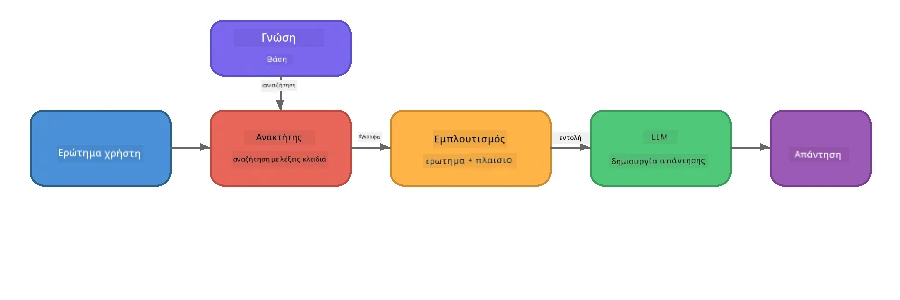

# Μέρος 4: Δημιουργία Εφαρμογής RAG με το Foundry Local

## Επισκόπηση

Τα Μεγάλα Μοντέλα Γλώσσας είναι ισχυρά, αλλά γνωρίζουν μόνο όσα περιλαμβάνονται στα δεδομένα εκπαίδευσής τους. Το **Retrieval-Augmented Generation (RAG)** λύνει αυτό το πρόβλημα δίνοντας στο μοντέλο σχετικό πλαίσιο την ώρα του ερωτήματος - το οποίο αντλείται από δικά σας έγγραφα, βάσεις δεδομένων ή βάσεις γνώσης.

Σε αυτό το εργαστήριο θα δημιουργήσετε μια ολοκληρωμένη ροή RAG που εκτελείται **αποκλειστικά στη συσκευή σας** χρησιμοποιώντας το Foundry Local. Χωρίς υπηρεσίες νέφους, χωρίς βάσεις δεδομένων διανυσμάτων, χωρίς API ενσωμάτωσης - μόνο τοπική ανάκτηση και τοπικό μοντέλο.

## Στόχοι Μάθησης

Στο τέλος αυτού του εργαστηρίου θα μπορείτε να:

- Εξηγήσετε τι είναι το RAG και γιατί έχει σημασία για εφαρμογές AI
- Δημιουργήσετε μια τοπική βάση γνώσης από έγγραφα κειμένου
- Υλοποιήσετε μια απλή λειτουργία ανάκτησης για να βρείτε σχετικό πλαίσιο
- Συνθέσετε ένα σύστημα προτροπής που βασίζει το μοντέλο στα ανακτηθέντα στοιχεία
- Εκτελέσετε την πλήρη ροή Ανάκτησης → Εμπλουτισμού → Γεννήτριας στη συσκευή
- Κατανοήσετε τα πλεονεκτήματα και μειονεκτήματα ανάμεσα σε απλή ανάκτηση λέξεων-κλειδιών και αναζήτηση διανυσμάτων

---

## Προαπαιτούμενα

- Ολοκληρώστε το [Μέρος 3: Χρήση του Foundry Local SDK με OpenAI](part3-sdk-and-apis.md)
- Εγκαταστήστε το Foundry Local CLI και κατεβάστε το μοντέλο `phi-3.5-mini`

---

## Έννοια: Τι είναι το RAG;

Χωρίς το RAG, ένα LLM μπορεί να απαντήσει μόνο με βάση τα δεδομένα εκπαίδευσής του - τα οποία μπορεί να είναι παρωχημένα, ελλιπή ή να μην περιέχουν τις ιδιωτικές σας πληροφορίες:

```
User: "What is Zava's return policy?"
LLM:  "I do not have information about Zava's return policy."  ← No context!
```

Με το RAG, **ανακτάτε** πρώτα σχετικά έγγραφα και μετά **εμπλουτίζετε** την προτροπή με αυτό το πλαίσιο προτού **παράγετε** την απάντηση:



Η βασική διαπίστωση: **το μοντέλο δεν χρειάζεται να "γνωρίζει" την απάντηση· απλώς πρέπει να διαβάζει τα σωστά έγγραφα.**

---

## Ασκήσεις Εργαστηρίου

### Άσκηση 1: Κατανόηση της Βάσης Γνώσης

Ανοίξτε το παράδειγμα RAG για τη γλώσσα σας και εξετάστε τη βάση γνώσης:

<details>
<summary><b>🐍 Python: <code>python/foundry-local-rag.py</code></b></summary>

Η βάση γνώσης είναι μια απλή λίστα λεξικών με πεδία `title` και `content`:

```python
KNOWLEDGE_BASE = [
    {
        "title": "Foundry Local Overview",
        "content": (
            "Foundry Local brings the power of Azure AI Foundry to your local "
            "device without requiring an Azure subscription..."
        ),
    },
    {
        "title": "Supported Hardware",
        "content": (
            "Foundry Local automatically selects the best model variant for "
            "your hardware. If you have an Nvidia CUDA GPU it downloads the "
            "CUDA-optimized model..."
        ),
    },
    # ... περισσότερες καταχωρήσεις
]
```

Κάθε εγγραφή αντιπροσωπεύει ένα "κομμάτι" γνώσης - ένα εστιασμένο κομμάτι πληροφορίας σε ένα θέμα.

</details>

<details>
<summary><b>📘 JavaScript: <code>javascript/foundry-local-rag.mjs</code></b></summary>

Η βάση γνώσης χρησιμοποιεί την ίδια δομή ως πίνακα αντικειμένων:

```javascript
const KNOWLEDGE_BASE = [
  {
    title: "Foundry Local Overview",
    content:
      "Foundry Local brings the power of Azure AI Foundry to your local " +
      "device without requiring an Azure subscription...",
  },
  {
    title: "Supported Hardware",
    content:
      "Foundry Local automatically selects the best model variant for " +
      "your hardware...",
  },
  // ... περισσότερες εγγραφές
];
```

</details>

<details>
<summary><b>💜 C#: <code>csharp/RagPipeline.cs</code></b></summary>

Η βάση γνώσης χρησιμοποιεί λίστα με ονομασμένα πλειάδες:

```csharp
private static readonly List<(string Title, string Content)> KnowledgeBase =
[
    ("Foundry Local Overview",
     "Foundry Local brings the power of Azure AI Foundry to your local " +
     "device without requiring an Azure subscription..."),

    ("Supported Hardware",
     "Foundry Local automatically selects the best model variant for " +
     "your hardware..."),

    // ... more entries
];
```

</details>

> **Σε μια πραγματική εφαρμογή**, η βάση γνώσης προέρχεται από αρχεία στο δίσκο, μια βάση δεδομένων, ευρετήριο αναζήτησης ή API. Για αυτό το εργαστήριο, χρησιμοποιούμε μια λίστα στη μνήμη για απλότητα.

---

### Άσκηση 2: Κατανόηση της Λειτουργίας Ανάκτησης

Το βήμα ανάκτησης βρίσκει τα πιο σχετικά κομμάτια για την ερώτηση του χρήστη. Το παράδειγμα χρησιμοποιεί **επικάλυψη λέξεων-κλειδιών** - μετρώντας πόσες λέξεις της ερώτησης εμφανίζονται σε κάθε κομμάτι:

<details>
<summary><b>🐍 Python</b></summary>

```python
def retrieve(query: str, top_k: int = 2) -> list[dict]:
    """Return the top-k knowledge chunks most relevant to the query."""
    query_words = set(query.lower().split())
    scored = []
    for chunk in KNOWLEDGE_BASE:
        chunk_words = set(chunk["content"].lower().split())
        overlap = len(query_words & chunk_words)
        scored.append((overlap, chunk))
    scored.sort(key=lambda x: x[0], reverse=True)
    return [item[1] for item in scored[:top_k]]
```

</details>

<details>
<summary><b>📘 JavaScript</b></summary>

```javascript
function retrieve(query, topK = 2) {
  const queryWords = new Set(query.toLowerCase().split(/\s+/));
  const scored = KNOWLEDGE_BASE.map((chunk) => {
    const chunkWords = new Set(chunk.content.toLowerCase().split(/\s+/));
    let overlap = 0;
    for (const w of queryWords) {
      if (chunkWords.has(w)) overlap++;
    }
    return { overlap, chunk };
  });
  scored.sort((a, b) => b.overlap - a.overlap);
  return scored.slice(0, topK).map((s) => s.chunk);
}
```

</details>

<details>
<summary><b>💜 C#</b></summary>

```csharp
private static List<(string Title, string Content)> Retrieve(string query, int topK = 2)
{
    var queryWords = new HashSet<string>(
        query.ToLowerInvariant().Split(' ', StringSplitOptions.RemoveEmptyEntries));

    return KnowledgeBase
        .Select(chunk =>
        {
            var chunkWords = new HashSet<string>(
                chunk.Content.ToLowerInvariant().Split(' ', StringSplitOptions.RemoveEmptyEntries));
            var overlap = queryWords.Intersect(chunkWords).Count();
            return (Overlap: overlap, Chunk: chunk);
        })
        .OrderByDescending(x => x.Overlap)
        .Take(topK)
        .Select(x => x.Chunk)
        .ToList();
}
```

</details>

**Πώς λειτουργεί:**
1. Διαχωρίστε την ερώτηση σε μεμονωμένες λέξεις
2. Για κάθε κομμάτι γνώσης, μετρήστε πόσες λέξεις της ερώτησης εμφανίζονται σε αυτό
3. Ταξινομήστε κατά βαθμολογία επικάλυψης (ψηλότερο πρώτο)
4. Επιστρέψτε τα κορυφαία-k πιο σχετικά κομμάτια

> **Ανταλλαγή:** Η επικάλυψη λέξεων-κλειδιών είναι απλή αλλά περιορισμένη· δεν κατανοεί συνώνυμα ή νόημα. Τα συστήματα παραγωγής RAG συνήθως χρησιμοποιούν **διανύσματα ενσωμάτωσης** και **βάση δεδομένων διανυσμάτων** για σημασιολογική αναζήτηση. Ωστόσο, η επικάλυψη λέξεων-κλειδιών είναι ένα εξαιρετικό σημείο εκκίνησης και δεν απαιτεί επιπλέον εξαρτήσεις.

---

### Άσκηση 3: Κατανόηση της Προτροπής με Εμπλουτισμό

Το ανακτηθέν πλαίσιο ενσωματώνεται στην **προτροπή συστήματος** πριν αποσταλεί στο μοντέλο:

```python
system_prompt = (
    "You are a helpful assistant. Answer the user's question using ONLY "
    "the information provided in the context below. If the context does "
    "not contain enough information, say so.\n\n"
    f"Context:\n{context_text}"
)
```

Κύριες αποφάσεις σχεδίασης:
- **"ΜΟΝΟ οι παρεχόμενες πληροφορίες"** - αποτρέπει το μοντέλο από το να παραγάγει στοιχεία που δεν υπάρχουν στο πλαίσιο
- **"Αν το πλαίσιο δεν περιέχει επαρκείς πληροφορίες, πες το αυτό"** - προωθεί τίμιες απαντήσεις τύπου "Δεν ξέρω"
- Το πλαίσιο τοποθετείται στο μήνυμα συστήματος ώστε να διαμορφώνει όλες τις απαντήσεις

---

### Άσκηση 4: Εκτέλεση της Ροής RAG

Τρέξτε το πλήρες παράδειγμα:

**Python:**
```bash
cd python
python foundry-local-rag.py
```

**JavaScript:**
```bash
cd javascript
node foundry-local-rag.mjs
```

**C#:**
```bash
cd csharp
dotnet run rag
```

Θα δείτε τρία πράγματα τυπωμένα:
1. **Την ερώτηση** που υποβάλλεται
2. **Το ανακτηθέν πλαίσιο** - τα επιλεγμένα κομμάτια από τη βάση γνώσης
3. **Την απάντηση** - παραγόμενη από το μοντέλο χρησιμοποιώντας μόνο εκείνο το πλαίσιο

Παράδειγμα εξόδου:
```
Question: How do I install Foundry Local and what hardware does it support?

--- Retrieved Context ---
### Installation
On Windows install Foundry Local with: winget install Microsoft.FoundryLocal...

### Supported Hardware
Foundry Local automatically selects the best model variant for your hardware...
-------------------------

Answer: To install Foundry Local, you can use the following methods depending
on your operating system: On Windows, run `winget install Microsoft.FoundryLocal`.
On macOS, use `brew install microsoft/foundrylocal/foundrylocal`...
```

Παρατηρείστε πως η απάντηση του μοντέλου είναι **βασισμένη** στο ανακτηθέν πλαίσιο - αναφέρει μόνο στοιχεία από τα έγγραφα της βάσης γνώσης.

---

### Άσκηση 5: Πειραματιστείτε και Επεκτείνετε

Δοκιμάστε αυτές τις τροποποιήσεις για να εμβαθύνετε την κατανόησή σας:

1. **Αλλάξτε την ερώτηση** - ρωτήστε κάτι που ΥΠΑΡΧΕΙ στη βάση γνώσης ενάντια σε κάτι που ΔΕΝ ΥΠΑΡΧΕΙ:
   ```python
   question = "What programming languages does Foundry Local support?"  # ← Σε πλαίσιο
   question = "How much does Foundry Local cost?"                       # ← Όχι σε πλαίσιο
   ```
   Λέει σωστά το μοντέλο "Δεν ξέρω" όταν η απάντηση δεν βρίσκεται στο πλαίσιο;

2. **Προσθέστε ένα νέο κομμάτι γνώσης** - προσθέστε μια νέα εγγραφή στο `KNOWLEDGE_BASE`:
   ```python
   {
       "title": "Pricing",
       "content": "Foundry Local is completely free and open source under the MIT license.",
   }
   ```
   Ρωτήστε ξανά την ερώτηση για τις τιμές.

3. **Αλλάξτε το `top_k`** - ανακτήστε περισσότερα ή λιγότερα κομμάτια:
   ```python
   context_chunks = retrieve(question, top_k=3)  # Περισσότερο πλαίσιο
   context_chunks = retrieve(question, top_k=1)  # Λιγότερο πλαίσιο
   ```
   Πώς επηρεάζει η ποσότητα του πλαισίου την ποιότητα της απάντησης;

4. **Αφαιρέστε την οδηγία προσκώλησης** - αλλάξτε την προτροπή συστήματος σε απλώς "Είσαι ένας βοηθητικός βοηθός." και δείτε αν το μοντέλο αρχίζει να παράγει ψευδείς πληροφορίες.

---

## Εκτενής Ανάλυση: Βελτιστοποίηση RAG για Απόδοση στη Συσκευή

Η εκτέλεση του RAG στη συσκευή φέρνει περιορισμούς που δεν υπάρχουν στο νέφος: περιορισμένη RAM, μη αφιερωμένη GPU (εκτέλεση σε CPU/NPU) και μικρό παράθυρο πλαισίου μοντέλου. Οι παρακάτω αποφάσεις σχεδιασμού αντιμετωπίζουν άμεσα αυτούς τους περιορισμούς, βασισμένες σε πρότυπα παραγωγικού τύπου τοπικών εφαρμογών RAG με Foundry Local.

### Στρατηγική Διαχωρισμού Κομματιών (Chunking): Σταθερού Μεγέθους Ολισθαίνουσα Παράθυρο

Ο διαχωρισμός - ο τρόπος που χωρίζετε τα έγγραφα σε κομμάτια - είναι μια από τις πιο σημαντικές αποφάσεις σε οποιοδήποτε σύστημα RAG. Για σενάρια στη συσκευή, προτείνεται ως βασική προσέγγιση ένα **σταθερού μεγέθους ολισθαίνων παράθυρο με επικάλυψη**:

| Παράμετρος | Συνιστώμενη Τιμή | Γιατί |
|------------|------------------|-------|
| **Μέγεθος κομματιού** | ~200 tokens | Κρατά το πλαίσιο συμπαγές, αφήνοντας χώρο στο παράθυρο πλαισίου του Phi-3.5 Mini για προτροπή συστήματος, ιστορικό συζήτησης και παραγόμενο αποτέλεσμα |
| **Επικάλυψη** | ~25 tokens (12.5%) | Αποτρέπει απώλεια πληροφορίας στα όρια κομματιών - σημαντικό για διαδικασίες και βήμα-βήμα οδηγίες |
| **Τοκοποίηση** | Διαχωρισμός με κενά | Μηδενικές εξαρτήσεις, χωρίς βιβλιοθήκη τοκοποίησης. Όλος ο προϋπολογισμός υπολογισμού μένει στο LLM |

Η επικάλυψη λειτουργεί ως ολισθαίνων παράθυρο: κάθε νέο κομμάτι ξεκινά 25 tokens πριν το τέλος του προηγούμενου, ώστε προτάσεις που απλώνονται σε όρια κομματιών να εμφανίζονται και στα δύο.

> **Γιατί όχι άλλες στρατηγικές;**
> - Ο διαχωρισμός βάσει προτάσεων παράγει απρόβλεπτα μεγέθη κομματιών· μερικές διαδικασίες είναι μεγάλα μονοκύτταρα που δεν διαχωρίζονται καλά
> - Ο διαχωρισμός κατά ενότητες (`##` επικεφαλίδες) δημιουργεί κομμάτια πολύ διαφορετικού μεγέθους - κάποια πολύ μικρά, άλλα πολύ μεγάλα για το παράθυρο πλαισίου
> - Ο σημασιολογικός διαχωρισμός (ανίχνευση θεμάτων βασισμένη σε ενσωμάτωση) δίνει την καλύτερη ποιότητα ανάκτησης, αλλά απαιτεί δεύτερο μοντέλο στη μνήμη παράλληλα με το Phi-3.5 Mini - ρίσκο σε συσκευές με μνήμη 8-16 GB κοινή

### Ανάκτηση Βελτιωμένη: Διανύσματα TF-IDF

Η προσέγγιση επικάλυψης λέξεων-κλειδιών σε αυτό το εργαστήριο λειτουργεί, αλλά αν θέλετε καλύτερη ανάκτηση χωρίς προσθήκη μοντέλου ενσωμάτωσης, το **TF-IDF (Term Frequency-Inverse Document Frequency)** είναι ένα εξαιρετικό μέσο όρο:

```
Keyword Overlap  →  TF-IDF Vectors  →  Embedding Models
    (this lab)     (lightweight upgrade)   (production)
  Simple & fast    Better ranking,         Best quality,
  No dependencies  still no ML model       requires embedding model
  ~Basic matching  ~1ms retrieval          ~100-500ms per query
```

Το TF-IDF μετατρέπει κάθε κομμάτι σε αριθμητικό διάνυσμα με βάση το πόσο σημαντική είναι κάθε λέξη μέσα στο κομμάτι *σε σχέση με όλα τα κομμάτια*. Την ώρα του ερωτήματος, η ερώτηση διανυσματοποιείται με τον ίδιο τρόπο και συγκρίνεται με βάση την ομοιότητα συνημιτόνου. Μπορείτε να το υλοποιήσετε με SQLite και καθαρό JavaScript/Python - χωρίς βάση διανυσμάτων, χωρίς API ενσωμάτωσης.

> **Απόδοση:** Η ομοιότητα συνημιτόνου TF-IDF πάνω σε κομμάτια σταθερού μεγέθους συνήθως επιτυγχάνει **~1ms ανάκτηση**, σε σύγκριση με ~100-500ms όταν μοντέλο ενσωμάτωσης κωδικοποιεί κάθε ερώτημα. Όλα τα 20+ έγγραφα μπορούν να διαχωριστούν και να ευρετηριαστούν σε κάτω του ενός δευτερολέπτου.

### Λειτουργία Edge/Compact για Περιορισμένες Συσκευές

Σε πολύ περιορισμένο υλικό (παλαιότερα laptop, tablet, συσκευές πεδίου), μπορείτε να μειώσετε τη χρήση πόρων συρρικνώνοντας τρεις ρυθμίσεις:

| Ρύθμιση | Τυπική Λειτουργία | Λειτουργία Edge/Compact |
|---------|------------------|------------------------|
| **Προτροπή συστήματος** | ~300 tokens | ~80 tokens |
| **Μέγιστοι tokens εξόδου** | 1024 | 512 |
| **Ανακτηθέντα κομμάτια (top-k)** | 5 | 3 |

Λιγότερα ανακτηθέντα κομμάτια σημαίνει λιγότερο πλαίσιο για το μοντέλο, μειώνοντας την καθυστέρηση και την πίεση στη μνήμη. Μια πιο σύντομη προτροπή συστήματος απελευθερώνει περισσότερο χώρο παραθύρου για την απάντηση. Αυτή η ισορροπία αξίζει σε συσκευές όπου κάθε token πλαισίου μετράει.

### Ένα Μοντέλο στη Μνήμη

Ένα από τα πιο σημαντικά θεμέλια για RAG στη συσκευή: **φορτώστε μόνο ένα μοντέλο**. Αν χρησιμοποιείτε μοντέλο ενσωμάτωσης για ανάκτηση *και* μοντέλο γλώσσας για παραγωγή, διαμοιράζετε τους περιορισμένους πόρους NPU/RAM μεταξύ δύο μοντέλων. Η ελαφριά ανάκτηση (επικάλυψη λέξεων-κλειδιών, TF-IDF) το αποφεύγει εντελώς:

- Χωρίς ανταγωνιστικό μοντέλο ενσωμάτωσης για μνήμη
- Ταχύτερη εκκίνηση - μόνο ένα μοντέλο για φόρτωση
- Προβλέψιμη χρήση μνήμης - το LLM λαμβάνει όλους τους διαθέσιμους πόρους
- Λειτουργεί σε μηχανές με μόλις 8 GB RAM

### SQLite ως Τοπική Αποθήκη Διανυσμάτων

Για μικρές έως μεσαίες συλλογές εγγράφων (εκατοντάδες έως λίγες χιλιάδες κομμάτια), **το SQLite είναι αρκετά γρήγορο** για άμεση αναζήτηση ομοιότητας συνημιτόνου και δεν προσθέτει καμία υποδομή:

- Μονό αρχείο `.db` στο δίσκο - χωρίς server, χωρίς ρύθμιση
- Περιλαμβάνεται σε κάθε κύριο περιβάλλον γλώσσας (Python `sqlite3`, Node.js `better-sqlite3`, .NET `Microsoft.Data.Sqlite`)
- Αποθηκεύει κομμάτια εγγράφων μαζί με διανύσματα TF-IDF σε έναν πίνακα
- Δεν χρειάζονται Pinecone, Qdrant, Chroma ή FAISS σε αυτό το μέγεθος

### Σύνοψη Απόδοσης

Αυτές οι σχεδιαστικές επιλογές συνδυάζονται για να προσφέρουν άμεση ανταπόκριση RAG σε καταναλωτικό υλικό:

| Μέτρηση | Απόδοση στη Συσκευή |
|---------|---------------------|
| **Καθυστέρηση ανάκτησης** | ~1ms (TF-IDF) έως ~5ms (επικάλυψη λέξεων-κλειδιών) |
| **Ταχύτητα εισαγωγής** | 20 έγγραφα διαχωρισμένα και ευρετηριασμένα σε < 1 δευτερόλεπτο |
| **Μοντέλα στη μνήμη** | 1 (μόνο LLM - χωρίς μοντέλο ενσωμάτωσης) |
| **Πρόσθετος αποθηκευτικός χώρος** | < 1 MB για κομμάτια + διανύσματα στο SQLite |
| **Κρύα εκκίνηση** | Φόρτωση μόνο ενός μοντέλου, χωρίς εκκίνηση μοντέλου ενσωμάτωσης |
| **Ελάχιστο υλικό** | 8 GB RAM, μόνο CPU (χωρίς GPU αναγκαία) |

> **Πότε να αναβαθμίσετε:** Αν κλιμακώσετε σε εκατοντάδες μεγάλα έγγραφα, μικτά περιεχόμενα (πίνακες, κώδικας, πεζό), ή χρειάζεστε σημασιολογική κατανόηση ερωτημάτων, σκεφτείτε να προσθέσετε μοντέλο ενσωμάτωσης και να μεταβείτε σε αναζήτηση ομοιότητας διανυσμάτων. Για τις περισσότερες περιπτώσεις χρήσης στη συσκευή με εστιασμένα σύνολα εγγράφων, το TF-IDF + SQLite δίνει εξαιρετικά αποτελέσματα με ελάχιστη χρήση πόρων.

---

## Βασικές Έννοιες

| Έννοια | Περιγραφή |
|--------|------------|
| **Ανάκτηση** | Εύρεση σχετικών εγγράφων από βάση γνώσης βάσει του ερωτήματος χρήστη |
| **Εμπλουτισμός** | Εισαγωγή των ανακτηθέντων εγγράφων στην προτροπή ως πλαίσιο |
| **Γεννήτρια** | Το LLM παράγει απάντηση βασισμένη στο παρεχόμενο πλαίσιο |
| **Διαχωρισμός κομματιών** | Διάσπαση μεγάλων εγγράφων σε μικρότερα, εστιασμένα κομμάτια |
| **Προσκόλληση** | Περιορισμός του μοντέλου να χρησιμοποιεί μόνο το διαθέσιμο πλαίσιο (μειώνει την παραίσθηση) |
| **Top-k** | Ο αριθμός των πιο σχετικών κομματιών που ανακτώνται |

---

## RAG στην Παραγωγή έναντι αυτού του Εργαστηρίου

| Πτυχή | Αυτό το Εργαστήριο | Βελτιστοποίηση για Συσκευή | Παραγωγή στο Nέφος |
|--------|-------------------|---------------------------|--------------------|
| **Βάση γνώσης** | Λίστα στη μνήμη | Αρχεία στο δίσκο, SQLite | Βάση δεδομένων, ευρετήριο αναζήτησης |
| **Ανάκτηση** | Επικάλυψη λέξεων-κλειδιών | TF-IDF + ομοιότητα συνημιτόνου | Ενσωματώσεις διανυσμάτων + αναζήτηση ομοιότητας |
| **Ενσωματώσεις** | Καμία ανάγκη | Καμία - TF-IDF διανύσματα | Μοντέλο ενσωμάτωσης (τοπικό ή νέφους) |
| **Αποθήκη διανυσμάτων** | Καμία ανάγκη | SQLite (μοναδικό αρχείο `.db`) | FAISS, Chroma, Azure AI Search, κλπ |
| **Διαχωρισμός κομματιών** | Χειροκίνητος | Σταθερού μεγέθους ολισθαίνων παράθυρο (~200 tokens, 25 tokens επικάλυψη) | Σημασιολογικός ή αναδρομικός διαχωρισμός |
| **Μοντέλα στη μνήμη** | 1 (LLM) | 1 (LLM) | 2+ (ενσωμάτωση + LLM) |
| **Καθυστέρηση ανάκτησης** | ~5ms | ~1ms | ~100-500ms |
| **Κλίμακα** | 5 έγγραφα | Εκατοντάδες έγγραφα | Εκατομμύρια έγγραφα |

Τα πρότυπα που μαθαίνετε εδώ (ανάκτηση, ενίσχυση, δημιουργία) είναι τα ίδια σε οποιαδήποτε κλίμακα. Η μέθοδος ανάκτησης βελτιώνεται, αλλά η συνολική αρχιτεκτονική παραμένει ταυτόσημη. Η μεσαία στήλη δείχνει τι είναι εφικτό στη συσκευή με ελαφριές τεχνικές, συχνά το ιδανικό σημείο για τοπικές εφαρμογές όπου ανταλλάσσετε κλίμακα cloud με ιδιωτικότητα, δυνατότητα offline και μηδενική καθυστέρηση σε εξωτερικές υπηρεσίες.

---

## Βασικά Συμπεράσματα

| Έννοια | Τι Μάθατε |
|---------|------------------|
| Πρότυπο RAG | Ανάκτηση + Ενίσχυση + Δημιουργία: δώστε στο μοντέλο το σωστό πλαίσιο και μπορεί να απαντήσει σε ερωτήσεις σχετικά με τα δεδομένα σας |
| Στη συσκευή | Όλα τρέχουν τοπικά χωρίς cloud APIs ή συνδρομές βάσεων δεδομένων διανυσμάτων |
| Οδηγίες θεμελίωσης | Οι περιορισμοί του συστήματος prompt είναι κρίσιμοι για να αποτραπεί η παραισθησιογένεση |
| Επικάλυψη λέξεων-κλειδιών | Ένα απλό αλλά αποτελεσματικό σημείο εκκίνησης για ανάκτηση |
| TF-IDF + SQLite | Μια ελαφριά αναβάθμιση που διατηρεί την ανάκτηση κάτω από 1ms χωρίς μοντέλο ενσωμάτωσης |
| Ένα μοντέλο στη μνήμη | Αποφύγετε τη φόρτωση μοντέλου ενσωμάτωσης παράλληλα με το LLM σε περιορισμένο υλικό |
| Μέγεθος τμήματος | Περίπου 200 tokens με επικάλυψη ισορροπούν την ακρίβεια ανάκτησης και την αποδοτικότητα παραθύρου πλαισίου |
| Λειτουργία Edge/Compact | Χρησιμοποιήστε λιγότερα τμήματα και συντομότερα prompts για πολύ περιορισμένες συσκευές |
| Καθολικό πρότυπο | Η ίδια αρχιτεκτονική RAG λειτουργεί για οποιαδήποτε πηγή δεδομένων: έγγραφα, βάσεις δεδομένων, APIs ή wikis |

> **Θέλετε να δείτε μια πλήρη on-device εφαρμογή RAG;** Δείτε το [Gas Field Local RAG](https://github.com/leestott/local-rag), έναν offline agent τύπου παραγωγής χτισμένο με Foundry Local και Phi-3.5 Mini που παρουσιάζει αυτά τα πρότυπα βελτιστοποίησης με ένα πραγματικό σύνολο εγγράφων.

---

## Επόμενα Βήματα

Συνεχίστε στο [Μέρος 5: Δημιουργία Πρακτόρων AI](part5-single-agents.md) για να μάθετε πώς να δημιουργείτε έξυπνους πράκτορες με προσωπεία, οδηγίες και συνομιλίες πολλαπλών γύρων χρησιμοποιώντας το Microsoft Agent Framework.