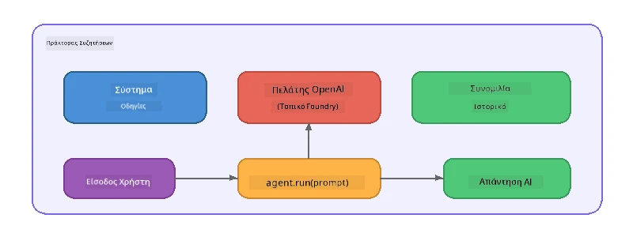

# Μέρος 5: Δημιουργία Πράκτορων Τεχνητής Νοημοσύνης με το Πλαίσιο Πράκτορα

> **Στόχος:** Δημιουργήστε τον πρώτο σας πράκτορα ΤΝ με μόνιμες οδηγίες και ορισμένη προσωπικότητα, εκτελούμενο με ένα τοπικό μοντέλο μέσω του Foundry Local.

## Τι είναι ο Πράκτορας Τεχνητής Νοημοσύνης;

Ένας πράκτορας ΤΝ περιτυλίγει ένα γλωσσικό μοντέλο με **συστημικές οδηγίες** που ορίζουν τη συμπεριφορά, την προσωπικότητα και τους περιορισμούς του. Σε αντίθεση με μια απλή κλήση συνομιλίας, ένας πράκτορας παρέχει:

- **Προσωπικότητα** - μια συνεπής ταυτότητα ("Είσαι ένας βοηθητικός κριτικός κώδικα")
- **Μνήμη** - ιστορικό συνομιλίας σε πολλές ανταλλαγές
- **Εξειδίκευση** - εστιασμένη συμπεριφορά καθοδηγούμενη από καλοσχεδιασμένες οδηγίες



---

## Το Πλαίσιο Πράκτορα της Microsoft

Το **Πλαίσιο Πράκτορα της Microsoft** (AGF) παρέχει μια τυπική αφαίρεση πράκτορα που λειτουργεί με διαφορετικά υποκείμενα μοντέλα. Σε αυτό το εργαστήριο το συνδυάζουμε με το Foundry Local ώστε όλα να εκτελούνται στη μηχανή σας - χωρίς ανάγκη σύννεφου.

| Έννοια | Περιγραφή |
|---------|-------------|
| `FoundryLocalClient` | Python: διαχειρίζεται την εκκίνηση υπηρεσίας, λήψη/φορτωμα μοντέλου και δημιουργεί πράκτορες |
| `client.as_agent()` | Python: δημιουργεί έναν πράκτορα από τον πελάτη Foundry Local |
| `AsAIAgent()` | C#: μέθοδος επέκτασης στο `ChatClient` - δημιουργεί έναν `AIAgent` |
| `instructions` | Συστημικό prompt που διαμορφώνει τη συμπεριφορά του πράκτορα |
| `name` | Ετικέτα αναγνώσιμη από άνθρωπο, χρήσιμη σε σενάρια με πολλούς πράκτορες |
| `agent.run(prompt)` / `RunAsync()` | Στέλνει μήνυμα χρήστη και επιστρέφει την απάντηση του πράκτορα |

> **Σημείωση:** Το Πλαίσιο Πράκτορα έχει SDK για Python και .NET. Για JavaScript υλοποιούμε μια ελαφριά κλάση `ChatAgent` που ακολουθεί το ίδιο μοτίβο χρησιμοποιώντας απευθείας το SDK της OpenAI.

---

## Ασκήσεις

### Άσκηση 1 - Κατανόηση του Μοτίβου Πράκτορα

Πριν γράψετε κώδικα, μελετήστε τα βασικά στοιχεία ενός πράκτορα:

1. **Πελάτης μοντέλου** - συνδέεται με το OpenAI-συμβατό API του Foundry Local
2. **Συστημικές οδηγίες** - το prompt «προσωπικότητας»
3. **Βρόχος εκτέλεσης** - στείλτε είσοδο χρήστη, λάβετε έξοδο

> **Σκεφτείτε το:** Πώς διαφέρουν οι συστημικές οδηγίες από ένα κανονικό μήνυμα χρήστη; Τι συμβαίνει αν τις αλλάξετε;

---

### Άσκηση 2 - Εκτέλεση Παραδείγματος Μονού Πράκτορα

<details>
<summary><strong>🐍 Python</strong></summary>

**Προαπαιτούμενα:**
```bash
cd python
python -m venv venv

# Windows (PowerShell):
venv\Scripts\Activate.ps1
# macOS:
source venv/bin/activate

pip install -r requirements.txt
```

**Εκτέλεση:**
```bash
python foundry-local-with-agf.py
```

**Ανάλυση κώδικα** (`python/foundry-local-with-agf.py`):

```python
import asyncio
from agent_framework_foundry_local import FoundryLocalClient

async def main():
    alias = "phi-4-mini"

    # Το FoundryLocalClient χειρίζεται την εκκίνηση της υπηρεσίας, τη λήψη μοντέλου και τη φόρτωση
    client = FoundryLocalClient(model_id=alias)
    print(f"Client Model ID: {client.model_id}")

    # Δημιουργήστε έναν πράκτορα με οδηγίες συστήματος
    agent = client.as_agent(
        name="Joker",
        instructions="You are good at telling jokes.",
    )

    # Μη ροή: λάβετε την πλήρη απάντηση ταυτόχρονα
    result = await agent.run("Tell me a joke about a pirate.")
    print(f"Agent: {result}")

    # Ροή: λάβετε τα αποτελέσματα καθώς παράγονται
    async for chunk in agent.run("Tell me another joke.", stream=True):
        if chunk.text:
            print(chunk.text, end="", flush=True)

asyncio.run(main())
```

**Σημεία κλειδιά:**
- `FoundryLocalClient(model_id=alias)` διαχειρίζεται εκκίνηση υπηρεσίας, λήψη και φόρτωση μοντέλου σε ένα βήμα
- `client.as_agent()` δημιουργεί πράκτορα με συστημικές οδηγίες και όνομα
- `agent.run()` υποστηρίζει λειτουργίες μη ροής και ροής (streaming)
- Εγκατάσταση μέσω `pip install agent-framework-foundry-local --pre`

</details>

<details>
<summary><strong>📦 JavaScript</strong></summary>

**Προαπαιτούμενα:**
```bash
cd javascript
npm install
```

**Εκτέλεση:**
```bash
node foundry-local-with-agent.mjs
```

**Ανάλυση κώδικα** (`javascript/foundry-local-with-agent.mjs`):

```javascript
import { OpenAI } from "openai";
import { FoundryLocalManager } from "foundry-local-sdk";

class ChatAgent {
  constructor({ client, modelId, instructions, name }) {
    this.client = client;
    this.modelId = modelId;
    this.instructions = instructions;
    this.name = name;
    this.history = [];
  }

  async run(userMessage) {
    const messages = [
      { role: "system", content: this.instructions },
      ...this.history,
      { role: "user", content: userMessage },
    ];
    const response = await this.client.chat.completions.create({
      model: this.modelId,
      messages,
    });
    const assistantMessage = response.choices[0].message.content;

    // Κράτησε το ιστορικό συνομιλίας για αλληλεπιδράσεις πολλαπλών γύρων
    this.history.push({ role: "user", content: userMessage });
    this.history.push({ role: "assistant", content: assistantMessage });
    return { text: assistantMessage };
  }
}

async function main() {
  FoundryLocalManager.create({ appName: "FoundryLocalWorkshop" });
  const manager = FoundryLocalManager.instance;
  await manager.startWebService();

  const catalog = manager.catalog;
  const model = await catalog.getModel("phi-3.5-mini");
  if (!model.isCached) {
    console.log("Downloading model: phi-3.5-mini...");
    await model.download();
  }
  await model.load();

  const client = new OpenAI({
    baseURL: manager.urls[0] + "/v1",
    apiKey: "foundry-local",
  });

  const agent = new ChatAgent({
    client,
    modelId: model.id,
    instructions: "You are good at telling jokes.",
    name: "Joker",
  });

  const result = await agent.run("Tell me a joke about a pirate.");
  console.log(result.text);
}

main();
```

**Σημεία κλειδιά:**
- Η JavaScript υλοποιεί τη δική της κλάση `ChatAgent` που μιμείται το μοτίβο AGF της Python
- `this.history` αποθηκεύει τις ανταλλαγές συνομιλίας για υποστήριξη πολλαπλών γύρων
- Η ρητή κλήση `startWebService()` → έλεγχος cache → `model.download()` → `model.load()` παρέχει πλήρη ορατότητα

</details>

<details>
<summary><strong>💜 C#</strong></summary>

**Προαπαιτούμενα:**
```bash
cd csharp
dotnet restore
```

**Εκτέλεση:**
```bash
dotnet run agent
```

**Ανάλυση κώδικα** (`csharp/SingleAgent.cs`):

```csharp
using Microsoft.AI.Foundry.Local;
using Microsoft.Extensions.Logging.Abstractions;
using Microsoft.Agents.AI;
using OpenAI;
using System.ClientModel;

// 1. Start Foundry Local and load a model
var alias = "phi-3.5-mini";
await FoundryLocalManager.CreateAsync(
    new Configuration
    {
        AppName = "FoundryLocalSamples",
        Web = new Configuration.WebService { Urls = "http://127.0.0.1:0" }
    }, NullLogger.Instance, default);
var manager = FoundryLocalManager.Instance;
await manager.StartWebServiceAsync(default);

var catalog = await manager.GetCatalogAsync(default);
var model = await catalog.GetModelAsync(alias, default);

var isCached = await model.IsCachedAsync(default);
if (!isCached)
{
    Console.WriteLine($"Downloading model: {alias}...");
    await model.DownloadAsync(null, default);
}
await model.LoadAsync(default);

var key = new ApiKeyCredential("foundry-local");
var client = new OpenAIClient(key, new OpenAIClientOptions
{
    Endpoint = new Uri(manager.Urls[0] + "/v1")
});

// 2. Create an AIAgent using the Agent Framework extension method
AIAgent joker = client
    .GetChatClient(model.Id)
    .AsAIAgent(
        instructions: "You are good at telling jokes. Keep your jokes short and family-friendly.",
        name: "Joker"
    );

// 3. Run the agent (non-streaming)
var response = await joker.RunAsync("Tell me a joke about a pirate.");
Console.WriteLine($"Joker: {response}");

// 4. Run with streaming
await foreach (var update in joker.RunStreamingAsync("Tell me another joke."))
{
    Console.Write(update);
}
```

**Σημεία κλειδιά:**
- Το `AsAIAgent()` είναι μέθοδος επέκτασης από το `Microsoft.Agents.AI.OpenAI` - δεν απαιτείται προσαρμοσμένη κλάση `ChatAgent`
- `RunAsync()` επιστρέφει ολόκληρη την απάντηση· `RunStreamingAsync()` ροή (stream) token ανά token
- Εγκατάσταση μέσω `dotnet add package Microsoft.Agents.AI.OpenAI --version 1.0.0-rc3`

</details>

---

### Άσκηση 3 - Αλλαγή Προσωπικότητας

Τροποποιήστε τις `instructions` του πράκτορα ώστε να δημιουργήσετε διαφορετική προσωπικότητα. Δοκιμάστε κάθε μία και παρατηρήστε πώς αλλάζει η έξοδος:

| Προσωπικότητα | Οδηγίες |
|---------|-------------|
| Κριτικός Κώδικα | `"Είσαι ένας έμπειρος κριτικός κώδικα. Παρέχε εποικοδομητικά σχόλια εστιασμένα στην αναγνωσιμότητα, απόδοση και ορθότητα."` |
| Τουριστικός Οδηγός | `"Είσαι ένας φιλικός τουριστικός οδηγός. Δώσε εξατομικευμένες προτάσεις για προορισμούς, δραστηριότητες και τοπική κουζίνα."` |
| Σωκρατικός Δάσκαλος | `"Είσαι σωκρατικός δάσκαλος. Μη δίνεις ποτέ άμεσες απαντήσεις - καθοδήγησε τον μαθητή με στοχαστικές ερωτήσεις."` |
| Τεχνικός Συγγραφέας | `"Είσαι τεχνικός συγγραφέας. Εξήγησε έννοιες καθαρά και συνοπτικά. Χρησιμοποίησε παραδείγματα. Απόφυγε τον τεχνικό ιδιωματισμό."` |

**Δοκιμάστε το:**
1. Επιλέξτε μια προσωπικότητα από τον παραπάνω πίνακα
2. Αντικαταστήστε το string `instructions` στον κώδικα
3. Προσαρμόστε το prompt χρήστη ανάλογα (π.χ. ζητήστε από τον κριτικό κώδικα να αξιολογήσει μια συνάρτηση)
4. Εκτελέστε ξανά το παράδειγμα και συγκρίνετε την έξοδο

> **Συμβουλή:** Η ποιότητα ενός πράκτορα εξαρτάται πολύ από τις οδηγίες. Συγκεκριμένες, καλά δομημένες οδηγίες παράγουν καλύτερα αποτελέσματα από ασαφείς.

---

### Άσκηση 4 - Προσθήκη Πολλαπλών Γύρων Συνομιλίας

Επεκτείνετε το παράδειγμα ώστε να υποστηρίζει έναν βρόχο συνομιλίας με πολλούς γύρους για να έχετε αλληλεπιδραστική συζήτηση με τον πράκτορα.

<details>
<summary><strong>🐍 Python - βρόχος πολλαπλών γύρων</strong></summary>

```python
import asyncio
from agent_framework_foundry_local import FoundryLocalClient

async def main():
    client = FoundryLocalClient(model_id="phi-4-mini")

    agent = client.as_agent(
        name="Assistant",
        instructions="You are a helpful assistant.",
    )

    print("Chat with the agent (type 'quit' to exit):\n")
    while True:
        user_input = input("You: ")
        if user_input.strip().lower() in ("quit", "exit"):
            break
        result = await agent.run(user_input)
        print(f"Agent: {result}\n")

asyncio.run(main())
```

</details>

<details>
<summary><strong>📦 JavaScript - βρόχος πολλαπλών γύρων</strong></summary>

```javascript
import { OpenAI } from "openai";
import { FoundryLocalManager } from "foundry-local-sdk";
import * as readline from "node:readline/promises";

// (επανάχρηση της κλάσης ChatAgent από την Άσκηση 2)

async function main() {
  FoundryLocalManager.create({ appName: "FoundryLocalWorkshop" });
  const manager = FoundryLocalManager.instance;
  await manager.startWebService();

  const catalog = manager.catalog;
  const model = await catalog.getModel("phi-3.5-mini");
  if (!model.isCached) {
    console.log("Downloading model: phi-3.5-mini...");
    await model.download();
  }
  await model.load();

  const client = new OpenAI({
    baseURL: manager.urls[0] + "/v1",
    apiKey: "foundry-local",
  });

  const agent = new ChatAgent({
    client,
    modelId: model.id,
    instructions: "You are a helpful assistant.",
    name: "Assistant",
  });

  const rl = readline.createInterface({
    input: process.stdin,
    output: process.stdout,
  });

  console.log("Chat with the agent (type 'quit' to exit):\n");
  while (true) {
    const userInput = await rl.question("You: ");
    if (["quit", "exit"].includes(userInput.trim().toLowerCase())) break;
    const result = await agent.run(userInput);
    console.log(`Agent: ${result.text}\n`);
  }
  rl.close();
}

main();
```

</details>

<details>
<summary><strong>💜 C# - βρόχος πολλαπλών γύρων</strong></summary>

```csharp
using Microsoft.AI.Foundry.Local;
using Microsoft.Extensions.Logging.Abstractions;
using Microsoft.Agents.AI;
using OpenAI;
using System.ClientModel;

var alias = "phi-3.5-mini";
var config = new Configuration
{
    AppName = "FoundryLocalSamples",
    Web = new Configuration.WebService { Urls = "http://127.0.0.1:0" }
};
await FoundryLocalManager.CreateAsync(config, NullLogger.Instance, default);
var manager = FoundryLocalManager.Instance;
await manager.StartWebServiceAsync(default);

var catalog = await manager.GetCatalogAsync(default);
var model = await catalog.GetModelAsync(alias, default);

var isCached = await model.IsCachedAsync(default);
if (!isCached)
{
    Console.WriteLine($"Downloading model: {alias}...");
    await model.DownloadAsync(null, default);
}
await model.LoadAsync(default);

var key = new ApiKeyCredential("foundry-local");
var client = new OpenAIClient(key, new OpenAIClientOptions
{
    Endpoint = new Uri(manager.Urls[0] + "/v1")
});

AIAgent agent = client
    .GetChatClient(model.Id)
    .AsAIAgent(
        instructions: "You are a helpful assistant.",
        name: "Assistant"
    );

Console.WriteLine("Chat with the agent (type 'quit' to exit):\n");
while (true)
{
    Console.Write("You: ");
    var userInput = Console.ReadLine();
    if (string.IsNullOrWhiteSpace(userInput) ||
        userInput.Equals("quit", StringComparison.OrdinalIgnoreCase) ||
        userInput.Equals("exit", StringComparison.OrdinalIgnoreCase))
        break;

    var result = await agent.RunAsync(userInput);
    Console.WriteLine($"Agent: {result}\n");
}
```

</details>

Παρατηρήστε πώς ο πράκτορας θυμάται τους προηγούμενους γύρους - κάντε μια ερώτηση παρακολούθησης και δείτε να διατηρείται το πλαίσιο.

---

### Άσκηση 5 - Δομημένη Έξοδος

Δώστε εντολή στον πράκτορα να απαντά πάντα με συγκεκριμένη μορφή (π.χ. JSON) και κάντε ανάλυση του αποτελέσματος:

<details>
<summary><strong>🐍 Python - έξοδος JSON</strong></summary>

```python
import asyncio
import json
from agent_framework_foundry_local import FoundryLocalClient

async def main():
    client = FoundryLocalClient(model_id="phi-4-mini")

    agent = client.as_agent(
        name="SentimentAnalyzer",
        instructions=(
            "You are a sentiment analysis agent. "
            "For every user message, respond ONLY with valid JSON in this format: "
            '{"sentiment": "positive|negative|neutral", "confidence": 0.0-1.0, "summary": "brief reason"}'
        ),
    )

    result = await agent.run("I absolutely loved the new restaurant downtown!")
    print("Raw:", result)

    try:
        parsed = json.loads(str(result))
        print(f"Sentiment: {parsed['sentiment']} (confidence: {parsed['confidence']})")
    except json.JSONDecodeError:
        print("Agent did not return valid JSON - try refining the instructions.")

asyncio.run(main())
```

</details>

<details>
<summary><strong>💜 C# - έξοδος JSON</strong></summary>

```csharp
using System.Text.Json;

AIAgent analyzer = chatClient.AsAIAgent(
    name: "SentimentAnalyzer",
    instructions:
        "You are a sentiment analysis agent. " +
        "For every user message, respond ONLY with valid JSON in this format: " +
        "{\"sentiment\": \"positive|negative|neutral\", \"confidence\": 0.0-1.0, \"summary\": \"brief reason\"}"
);

var response = await analyzer.RunAsync("I absolutely loved the new restaurant downtown!");
Console.WriteLine($"Raw: {response}");

try
{
    var parsed = JsonSerializer.Deserialize<JsonElement>(response.ToString());
    Console.WriteLine($"Sentiment: {parsed.GetProperty("sentiment")} " +
                      $"(confidence: {parsed.GetProperty("confidence")})");
}
catch (JsonException)
{
    Console.WriteLine("Agent did not return valid JSON - try refining the instructions.");
}
```

</details>

> **Σημείωση:** Τα μικρά τοπικά μοντέλα ενδέχεται να μην παράγουν πάντα τέλεια έγκυρο JSON. Μπορείτε να βελτιώσετε την αξιοπιστία περιλαμβάνοντας ένα παράδειγμα στις οδηγίες και να είστε πολύ σαφείς σχετικά με τη μορφή.

---

## Βασικά Συμπεράσματα

| Έννοια | Τι Μάθατε |
|---------|-----------------|
| Πράκτορας έναντι απλής κλήσης LLM | Ένας πράκτορας περιτυλίγει ένα μοντέλο με οδηγίες και μνήμη |
| Συστημικές οδηγίες | Ο πιο σημαντικός μοχλός για τον έλεγχο της συμπεριφοράς πράκτορα |
| Συνομιλία πολλαπλών γύρων | Οι πράκτορες μπορούν να διατηρούν το πλαίσιο σε πολλαπλές αλληλεπιδράσεις |
| Δομημένη έξοδος | Οι οδηγίες μπορούν να επιβάλλουν τη μορφή εξόδου (JSON, markdown κτλ.) |
| Τοπική εκτέλεση | Όλα εκτελούνται τοπικά μέσω του Foundry Local - χωρίς σύννεφο |

---

## Επόμενα Βήματα

Στο **[Μέρος 6: Ροές Εργασίας με Πολλούς Πράκτορες](part6-multi-agent-workflows.md)**, θα συνδυάσετε πολλούς πράκτορες σε ένα συντονισμένο pipeline όπου κάθε πράκτορας έχει εξειδικευμένο ρόλο.