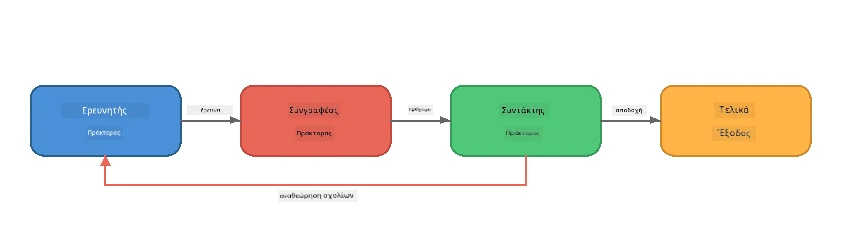
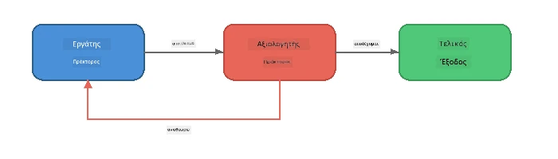
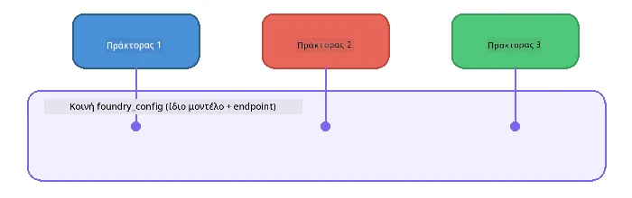

# Μέρος 6: Ροές Εργασίας Πολλαπλών Πρακτόρων

> **Στόχος:** Συνδυάστε πολλούς εξειδικευμένους πράκτορες σε συντονισμένες αλυσίδες που διαμοιράζουν σύνθετα καθήκοντα μεταξύ συνεργαζόμενων πρακτόρων - όλα τοπικά με το Foundry Local.

## Γιατί Πολλαπλοί Πράκτορες;

Ένας μόνος πράκτορας μπορεί να διαχειριστεί πολλά καθήκοντα, αλλά οι σύνθετες ροές εργασίας ωφελούνται από την **Εξειδίκευση**. Αντί να προσπαθεί ένας πράκτορας να ερευνήσει, γράψει και επεξεργαστεί ταυτόχρονα, χωρίζετε τη δουλειά σε εστιασμένους ρόλους:



| Πρότυπο | Περιγραφή |
|---------|-------------|
| **Αλληλουχία** | Η έξοδος του Πράκτορα A τροφοδοτεί τον Πράκτορα B → τον Πράκτορα C |
| **Βρόχος Ανατροφοδότησης** | Ένας αξιολογητής πράκτορας μπορεί να στείλει εργασία για αναθεώρηση |
| **Κοινό πλαίσιο** | Όλοι οι πράκτορες χρησιμοποιούν το ίδιο μοντέλο/άκρο, αλλά διαφορετικές οδηγίες |
| **Τυποποιημένη έξοδος** | Οι πράκτορες παράγουν δομημένα αποτελέσματα (JSON) για αξιόπιστη παράδοση |

---

## Ασκήσεις

### Άσκηση 1 - Εκτέλεση της Αλυσίδας Πολλαπλών Πρακτόρων

Το εργαστήριο περιλαμβάνει μια ολοκληρωμένη ροή εργασίας Ερευνητής → Συγγραφέας → Επεξεργαστής.

<details>
<summary><strong>🐍 Python</strong></summary>

**Ρύθμιση:**
```bash
cd python
python -m venv venv

# Windows (PowerShell):
venv\Scripts\Activate.ps1
# macOS:
source venv/bin/activate

pip install -r requirements.txt
```

**Εκτέλεση:**
```bash
python foundry-local-multi-agent.py
```

**Τι συμβαίνει:**
1. Ο **Ερευνητής** λαμβάνει ένα θέμα και επιστρέφει βασικά στοιχεία με κουκκίδες
2. Ο **Συγγραφέας** παίρνει την έρευνα και γράφει ένα προσχέδιο άρθρου (3-4 παραγράφους)
3. Ο **Επεξεργαστής** ελέγχει το άρθρο για ποιότητα και επιστρέφει ΑΠΟΔΟΧΗ ή ΑΝΑΘΕΩΡΗΣΗ

</details>

<details>
<summary><strong>📦 JavaScript</strong></summary>

**Ρύθμιση:**
```bash
cd javascript
npm install
```

**Εκτέλεση:**
```bash
node foundry-local-multi-agent.mjs
```

**Η ίδια τριεπίπεδη αλυσίδα** - Ερευνητής → Συγγραφέας → Επεξεργαστής.

</details>

<details>
<summary><strong>💜 C#</strong></summary>

**Ρύθμιση:**
```bash
cd csharp
dotnet restore
```

**Εκτέλεση:**
```bash
dotnet run multi
```

**Η ίδια τριεπίπεδη αλυσίδα** - Ερευνητής → Συγγραφέας → Επεξεργαστής.

</details>

---

### Άσκηση 2 - Ανατομία της Αλυσίδας

Μελετήστε πώς ορίζονται και συνδέονται οι πράκτορες:

**1. Κοινός πελάτης μοντέλου**

Όλοι οι πράκτορες μοιράζονται το ίδιο μοντέλο Foundry Local:

```python
# Python - Το FoundryLocalClient χειρίζεται τα πάντα
from agent_framework_foundry_local import FoundryLocalClient

client = FoundryLocalClient(model_id="phi-3.5-mini")
```

```javascript
// JavaScript - OpenAI SDK που δείχνει στο Foundry Local
const client = new OpenAI({
  baseURL: manager.urls[0] + "/v1",
  apiKey: "foundry-local",
});
```

```csharp
// C# - OpenAIClient pointed at Foundry Local
var key = new ApiKeyCredential("foundry-local");
var client = new OpenAIClient(key, new OpenAIClientOptions
{
    Endpoint = new Uri(manager.Urls[0] + "/v1")
});
var chatClient = client.GetChatClient(model.Id);
```

**2. Εξειδικευμένες οδηγίες**

Κάθε πράκτορας έχει μια ξεχωριστή περσόνα:

| Πράκτορας | Οδηγίες (σύνοψη) |
|-------|----------------------|
| Ερευνητής | "Παρέχετε βασικά στοιχεία, στατιστικά και υπόβαθρο. Οργανώστε ως κουκκίδες." |
| Συγγραφέας | "Γράψτε ένα ελκυστικό άρθρο blog (3-4 παραγράφους) από τις σημειώσεις της έρευνας. Μην επινοείτε στοιχεία." |
| Επεξεργαστής | "Εξετάστε την καθαρότητα, τη γραμματική και τη συνοχή των στοιχείων. Απόφαση: ΑΠΟΔΟΧΗ ή ΑΝΑΘΕΩΡΗΣΗ." |

**3. Ροές δεδομένων μεταξύ πρακτόρων**

```python
# Βήμα 1 - η έξοδος από τον ερευνητή γίνεται είσοδος για τον συγγραφέα
research_result = await researcher.run(f"Research: {topic}")

# Βήμα 2 - η έξοδος από τον συγγραφέα γίνεται είσοδος για τον συντάκτη
writer_result = await writer.run(f"Write using:\n{research_result}")

# Βήμα 3 - ο συντάκτης εξετάζει τόσο την έρευνα όσο και το άρθρο
editor_result = await editor.run(
    f"Research:\n{research_result}\n\nArticle:\n{writer_result}"
)
```

```csharp
// C# - same pattern, async calls with AIAgent
var researchNotes = await researcher.RunAsync(
    $"Research the following topic and provide key facts:\n{topic}");

var draft = await writer.RunAsync(
    $"Write a blog post based on these research notes:\n\n{researchNotes}");

var verdict = await editor.RunAsync(
    $"Review this article for quality and accuracy.\n\n" +
    $"Research notes:\n{researchNotes}\n\n" +
    $"Article:\n{draft}");
```

> **Σημαντική παρατήρηση:** Κάθε πράκτορας λαμβάνει το συσσωρευμένο πλαίσιο από τους προηγούμενους πράκτορες. Ο επεξεργαστής βλέπει και την αρχική έρευνα και το προσχέδιο - αυτό του επιτρέπει να ελέγξει τη συνέπεια των στοιχείων.

---

### Άσκηση 3 - Προσθήκη Τέταρτου Πράκτορα

Επεκτείνετε την αλυσίδα προσθέτοντας έναν νέο πράκτορα. Επιλέξτε ένα:

| Πράκτορας | Σκοπός | Οδηγίες |
|-------|---------|-------------|
| **Ελεγκτής Στοιχείων** | Επιβεβαίωση ισχυρισμών στο άρθρο | `"Ελέγχετε τους πραγματικούς ισχυρισμούς. Για κάθε ισχυρισμό, δηλώστε αν υποστηρίζεται από τις σημειώσεις της έρευνας. Επιστρέψτε JSON με επαληθευμένα/μη επαληθευμένα στοιχεία."` |
| **Συγγραφέας Τίτλων** | Δημιουργία ελκυστικών τίτλων | `"Παράγετε 5 επιλογές τίτλων για το άρθρο. Μεταβάλλετε το στυλ: πληροφοριακό, clickbait, ερώτηση, λίστα, συναισθηματικό."` |
| **Κοινωνικά Δίκτυα** | Δημιουργία προωθητικών δημοσιεύσεων | `"Φτιάξτε 3 δημοσιεύσεις στα κοινωνικά δίκτυα προωθώντας το άρθρο: μία για Twitter (280 χαρακτήρες), μία για LinkedIn (επαγγελματικός τόνος), μία για Instagram (φιλική με προτάσεις emoji)."` |

<details>
<summary><strong>🐍 Python - προσθήκη Συγγραφέα Τίτλων</strong></summary>

```python
headline_agent = client.as_agent(
    name="HeadlineWriter",
    instructions=(
        "You are a headline specialist. Given an article, generate exactly "
        "5 headline options. Vary the style: informative, question-based, "
        "listicle, emotional, and provocative. Return them as a numbered list."
    ),
)

# Μετά την αποδοχή από τον επεξεργαστή, δημιουργήστε τίτλους
headline_result = await headline_agent.run(
    f"Generate headlines for this article:\n\n{writer_result}"
)
print(f"\n--- Headlines ---\n{headline_result}")
```

</details>

<details>
<summary><strong>📦 JavaScript - προσθήκη Συγγραφέα Τίτλων</strong></summary>

```javascript
const headlineAgent = new ChatAgent({
  client,
  modelId: modelInfo.id,
  instructions:
    "You are a headline specialist. Given an article, generate exactly " +
    "5 headline options. Vary the style: informative, question-based, " +
    "listicle, emotional, and provocative. Return them as a numbered list.",
  name: "HeadlineWriter",
});

const headlineResult = await headlineAgent.run(
  `Generate headlines for this article:\n\n${writerResult.text}`
);
console.log(`\n--- Headlines ---\n${headlineResult.text}`);
```

</details>

<details>
<summary><strong>💜 C# - προσθήκη Συγγραφέα Τίτλων</strong></summary>

```csharp
AIAgent headlineAgent = chatClient.AsAIAgent(
    name: "HeadlineWriter",
    instructions:
        "You are a headline specialist. Given an article, generate exactly " +
        "5 headline options. Vary the style: informative, question-based, " +
        "listicle, emotional, and provocative. Return them as a numbered list."
);

// After the editor accepts, generate headlines
var headlines = await headlineAgent.RunAsync(
    $"Generate headlines for this article:\n\n{draft}");
Console.WriteLine($"\n--- Headlines ---\n{headlines}");
```

</details>

---

### Άσκηση 4 - Σχεδιάστε τη Δική Σας Ροή

Σχεδιάστε μια ροή πολλαπλών πρακτόρων σε έναν διαφορετικό τομέα. Ιδέες:

| Τομέας | Πράκτορες | Ροή |
|--------|--------|------|
| **Ανασκόπηση Κώδικα** | Αναλυτής → Αξιολογητής → Συνοψιστής | Ανάλυση δομής κώδικα → αξιολόγηση προβλημάτων → σύνταξη αναφοράς |
| **Υποστήριξη Πελατών** | Ταξινομητής → Απαντητής → Ποιοτικός Έλεγχος | Ταξινόμηση αιτήματος → σύνταξη απάντησης → έλεγχος ποιότητας |
| **Εκπαίδευση** | Δημιουργός Τεστ → Προσομοιωτής Μαθητή → Βαθμολογητής | Δημιουργία τεστ → προσομοίωση απαντήσεων → βαθμολόγηση και εξήγηση |
| **Ανάλυση Δεδομένων** | Ερμηνευτής → Αναλυτής → Αναφέρων | Ερμηνεία αιτήματος δεδομένων → ανάλυση μοτίβων → σύνταξη αναφοράς |

**Βήματα:**
1. Ορίστε 3+ πράκτορες με ξεχωριστές `οδηγίες`
2. Αποφασίστε τη ροή δεδομένων - τι λαμβάνει και τι παράγει κάθε πράκτορας;
3. Υλοποιήστε την αλυσίδα χρησιμοποιώντας πρότυπα από τις Ασκήσεις 1-3
4. Προσθέστε βρόχο ανατροφοδότησης αν κάποιος πράκτορας πρέπει να αξιολογεί την εργασία άλλου

---

## Πρότυπα Ορχήστρωσης

Εδώ είναι πρότυπα ορχήστρωσης που ισχύουν σε κάθε σύστημα πολλαπλών πρακτόρων (εξετάζονται σε βάθος στο [Μέρος 7](part7-zava-creative-writer.md)):

### Αλληλουχία Αλυσίδας


Κάθε πράκτορας επεξεργάζεται την έξοδο του προηγούμενου. Απλό και προβλέψιμο.

### Βρόχος Ανατροφοδότησης



Ένας αξιολογητής πράκτορας μπορεί να προκαλέσει επανεκτέλεση προηγούμενων σταδίων. Το Zava Writer το χρησιμοποιεί: ο επεξεργαστής μπορεί να στείλει ανατροφοδότηση πίσω στον ερευνητή και τον συγγραφέα.

### Κοινό Πλαίσιο



Όλοι οι πράκτορες μοιράζονται το ίδιο `foundry_config` ώστε να χρησιμοποιούν το ίδιο μοντέλο και άκρο.

---

## Βασικά Σημεία

| Έννοια | Τι Μάθατε |
|---------|-----------------|
| Εξειδίκευση Πράκτορα | Κάθε πράκτορας κάνει καλά ένα πράγμα με εστιασμένες οδηγίες |
| Παράδοση δεδομένων | Η έξοδος από έναν πράκτορα γίνεται είσοδος στον επόμενο |
| Βρόχοι ανατροφοδότησης | Ένας αξιολογητής μπορεί να ενεργοποιεί επαναλήψεις για υψηλότερη ποιότητα |
| Δομημένη έξοδος | Απαντήσεις σε μορφή JSON επιτρέπουν αξιόπιστη επικοινωνία μεταξύ πρακτόρων |
| Ορχήστρωση | Ένας συντονιστής διαχειρίζεται τη σειρά και την αντιμετώπιση σφαλμάτων |
| Πρότυπα παραγωγής | Εφαρμόζονται στο [Μέρος 7: Zava Creative Writer](part7-zava-creative-writer.md) |

---

## Επόμενα Βήματα

Συνεχίστε στο [Μέρος 7: Zava Creative Writer - Εφαρμογή Capstone](part7-zava-creative-writer.md) για να εξερευνήσετε μια εφαρμογή παραγωγικού τύπου πολλαπλών πρακτόρων με 4 εξειδικευμένους πράκτορες, ροή εξόδου, αναζήτηση προϊόντος και βρόχους ανατροφοδότησης - διαθέσιμη σε Python, JavaScript και C#.