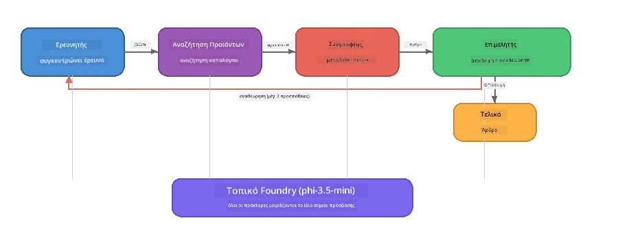

# Μέρος 7: Zava Creative Writer - Εφαρμογή Capstone

> **Στόχος:** Διερεύνηση μιας εφαρμογής πολλών πρακτόρων σε στυλ παραγωγής όπου τέσσερις εξειδικευμένοι πράκτορες συνεργάζονται για την παραγωγή άρθρων ποιότητας περιοδικού για το Zava Retail DIY - που εκτελείται εξ ολοκλήρου στη συσκευή σας με το Foundry Local.

Αυτό είναι το **εργαστήριο capstone** του σεμιναρίου. Συνδυάζει όλα όσα έχετε μάθει - ενσωμάτωση SDK (Μέρος 3), ανάκτηση από τοπικά δεδομένα (Μέρος 4), προσωπικότητες πρακτόρων (Μέρος 5), και ορχήστρωση πολλών πρακτόρων (Μέρος 6) - σε μια ολοκληρωμένη εφαρμογή διαθέσιμη σε **Python**, **JavaScript**, και **C#**.

---

## Τι Θα Εξερευνήσετε

| Έννοια | Πού στο Zava Writer |
|---------|----------------------------|
| Φόρτωση μοντέλου 4 βημάτων | Κοινό module ρυθμίσεων εκκινεί το Foundry Local |
| Ανάκτηση στυλ RAG | Πράκτορας προϊόντος αναζητά σε τοπικό κατάλογο |
| Εξειδίκευση Πράκτορα | 4 πράκτορες με διακριτά συστήματα προτροπών |
| Ροή εξόδου | Ο συγγραφέας παράγει tokens σε πραγματικό χρόνο |
| Δομημένες παραδόσεις | Ερευνητής → JSON, Συντάκτης → απόφαση JSON |
| Βρόχοι ανατροφοδότησης | Ο συντάκτης μπορεί να ενεργοποιήσει επανεκτέλεση (μέγ. 2 επαναλήψεις) |

---

## Αρχιτεκτονική

Ο Zava Creative Writer χρησιμοποιεί έναν **αλληλουχιακό σωλήνα με ανατροφοδότηση καθοδηγούμενη από αξιολογητή**. Όλες οι τρεις υλοποιήσεις γλώσσας ακολουθούν την ίδια αρχιτεκτονική:



### Οι Τέσσερις Πράκτορες

| Πράκτορας | Είσοδος | Έξοδος | Σκοπός |
|-------|-------|--------|---------|
| **Ερευνητής** | Θέμα + προαιρετική ανατροφοδότηση | `{"web": [{url, name, description}, ...]}` | Συλλογή βασικής έρευνας μέσω LLM |
| **Αναζήτηση Προϊόντος** | Συμβολοσειρά πλαισίου προϊόντος | Λίστα ταιριαστών προϊόντων | Ερωτήματα παραγόμενα από LLM + αναζήτηση λέξεων-κλειδιών στον τοπικό κατάλογο |
| **Συγγραφέας** | Έρευνα + προϊόντα + ανάθεση + ανατροφοδότηση | Κείμενο άρθρου σε ροή (διαχωρισμένο στο `---`) | Σύνταξη άρθρου ποιότητας περιοδικού σε πραγματικό χρόνο |
| **Συντάκτης** | Άρθρο + αυτο-ανατροφοδότηση συγγραφέα | `{"decision": "accept/revise", "editorFeedback": "...", "researchFeedback": "..."}` | Επισκόπηση ποιότητας, ενεργοποίηση επανάληψης αν χρειαστεί |

### Ροή Σωλήνα

1. Ο **Ερευνητής** λαμβάνει το θέμα και παράγει δομημένες σημειώσεις έρευνας (JSON)
2. Η **Αναζήτηση Προϊόντος** αναζητά στον τοπικό κατάλογο προϊόντων χρησιμοποιώντας ερωτήματα παραγόμενα από LLM
3. Ο **Συγγραφέας** συνδυάζει έρευνα + προϊόντα + ανάθεση σε ένα άρθρο ροής, προσθέτοντας αυτο-ανατροφοδότηση μετά τον διαχωριστή `---`
4. Ο **Συντάκτης** αξιολογεί το άρθρο και επιστρέφει μια απόφαση JSON:
   - `"accept"` → ολοκληρώνεται ο σωλήνας
   - `"revise"` → η ανατροφοδότηση αποστέλλεται πίσω στον Ερευνητή και τον Συγγραφέα (μέγ. 2 επαναλήψεις)

---

## Προαπαιτούμενα

- Ολοκληρώστε το [Μέρος 6: Ροές εργασίας πολλαπλών πρακτόρων](part6-multi-agent-workflows.md)
- Εγκατεστημένο Foundry Local CLI και μοντέλο `phi-3.5-mini` κατεβασμένο

---

## Ασκήσεις

### Άσκηση 1 - Εκτελέστε τον Zava Creative Writer

Επιλέξτε τη γλώσσα σας και τρέξτε την εφαρμογή:

<details>
<summary><strong>🐍 Python - Υπηρεσία Web FastAPI</strong></summary>

Η έκδοση Python τρέχει ως **υπηρεσία web** με REST API, επιδεικνύοντας πώς να δημιουργήσετε backend παραγωγής.

**Ρύθμιση:**
```bash
cd zava-creative-writer-local/src/api
python -m venv venv

# Windows (PowerShell):
venv\Scripts\Activate.ps1
# macOS:
source venv/bin/activate

pip install -r requirements.txt
```

**Εκτέλεση:**
```bash
uvicorn main:app --reload
```

**Δοκιμή:**
```bash
curl -X POST http://localhost:8000/api/article \
  -H "Content-Type: application/json" \
  -d '{
    "research": "DIY home improvement trends",
    "products": "power tools and paints",
    "assignment": "Write an article about weekend renovation projects for DIY enthusiasts"
  }'
```

Η απάντηση επιστρέφει ροή μηνυμάτων JSON χωρισμένων με νέα γραμμή που δείχνει την πρόοδο κάθε πράκτορα.

</details>

<details>
<summary><strong>📦 JavaScript - CLI Node.js</strong></summary>

Η έκδοση JavaScript τρέχει ως **εφαρμογή CLI**, εκτυπώνοντας την πρόοδο των πρακτόρων και το άρθρο απευθείας στην κονσόλα.

**Ρύθμιση:**
```bash
cd zava-creative-writer-local/src/javascript
npm install
```

**Εκτέλεση:**
```bash
node main.mjs
```

Θα δείτε:
1. Φόρτωση μοντέλου Foundry Local (με μπάρα προόδου αν γίνεται λήψη)
2. Κάθε πράκτορας εκτελείται διαδοχικά με μηνύματα κατάστασης
3. Το άρθρο ρέει στην κονσόλα σε πραγματικό χρόνο
4. Απόφαση αποδοχής/αναθεώρησης του συντάκτη

</details>

<details>
<summary><strong>💜 C# - Εφαρμογή Κονσόλας .NET</strong></summary>

Η έκδοση C# τρέχει ως **εφαρμογή κονσόλας .NET** με τον ίδιο σωλήνα και ροή εξόδου.

**Ρύθμιση:**
```bash
cd zava-creative-writer-local/src/csharp
dotnet restore
```

**Εκτέλεση:**
```bash
dotnet run
```

Ίδιο μοτίβο εξόδου με την έκδοση JavaScript – μηνύματα κατάστασης πρακτόρων, άρθρο ροής, και ετυμηγορία συντάκτη.

</details>

---

### Άσκηση 2 - Μελετήστε τη Δομή του Κώδικα

Κάθε υλοποίηση γλώσσας έχει τα ίδια λογικά συστατικά. Συγκρίνετε τις δομές:

**Python** (`src/api/`):
| Αρχείο | Σκοπός |
|------|---------|
| `foundry_config.py` | Κοινός διαχειριστής Foundry Local, μοντέλο και πελάτης (φόρτωση 4 βημάτων) |
| `orchestrator.py` | Συντονισμός σωλήνα με βρόχο ανατροφοδότησης |
| `main.py` | Σημεία πρόσβασης FastAPI (`POST /api/article`) |
| `agents/researcher/researcher.py` | Έρευνα με LLM και έξοδο JSON |
| `agents/product/product.py` | Ερωτήματα LLM + αναζήτηση λέξεων-κλειδιών |
| `agents/writer/writer.py` | Γεννήτρια άρθρου σε ροή |
| `agents/editor/editor.py` | Απόφαση αποδοχής/αναθεώρησης με JSON |

**JavaScript** (`src/javascript/`):
| Αρχείο | Σκοπός |
|------|---------|
| `foundryConfig.mjs` | Κοινές ρυθμίσεις Foundry Local (φόρτωση 4 βημάτων με μπάρα προόδου) |
| `main.mjs` | Ορχηστρωτής + σημείο εισόδου CLI |
| `researcher.mjs` | Πράκτορας έρευνας με LLM |
| `product.mjs` | Δημιουργία ερωτημάτων LLM + αναζήτηση λέξεων-κλειδιών |
| `writer.mjs` | Παραγωγή άρθρου σε ροή (ασύγχρονος γεννήτορας) |
| `editor.mjs` | Απόφαση αποδοχής/αναθεώρησης JSON |
| `products.mjs` | Δεδομένα καταλόγου προϊόντων |

**C#** (`src/csharp/`):
| Αρχείο | Σκοπός |
|------|---------|
| `Program.cs` | Ολοκληρωμένος σωλήνας: φόρτωση μοντέλου, πράκτορες, ορχηστρωτής, βρόχος ανατροφοδότησης |
| `ZavaCreativeWriter.csproj` | Πρόγραμμα .NET 9 με πακέτα Foundry Local + OpenAI |

> **Σημείωση σχεδιασμού:** Η Python διαχωρίζει κάθε πράκτορα σε ξεχωριστό αρχείο/φάκελο (καλό για μεγάλες ομάδες). Η JavaScript χρησιμοποιεί ένα module ανά πράκτορα (καλό για μεσαία έργα). Η C# κρατά τα πάντα σε ένα αρχείο με τοπικές συναρτήσεις (καλό για ανεξάρτητα παραδείγματα). Στην παραγωγή, επιλέξτε το μοτίβο που ταιριάζει στις συμβάσεις της ομάδας σας.

---

### Άσκηση 3 - Εντοπίστε τη Μοιρασμένη Διαμόρφωση

Κάθε πράκτορας στον σωλήνα μοιράζεται έναν μόνο πελάτη μοντέλου Foundry Local. Μελετήστε πώς ρυθμίζεται αυτό σε κάθε γλώσσα:

<details>
<summary><strong>🐍 Python - foundry_config.py</strong></summary>

```python
from foundry_local import FoundryLocalManager

MODEL_ALIAS = "phi-3.5-mini"

# Βήμα 1: Δημιουργήστε τον διαχειριστή και ξεκινήστε την υπηρεσία Foundry Local
manager = FoundryLocalManager()
manager.start_service()

# Βήμα 2: Ελέγξτε αν το μοντέλο έχει ήδη κατέβει
cached = manager.list_cached_models()
catalog_info = manager.get_model_info(MODEL_ALIAS)
is_cached = any(m.id == catalog_info.id for m in cached) if catalog_info else False

if not is_cached:
    manager.download_model(MODEL_ALIAS)

# Βήμα 3: Φορτώστε το μοντέλο στη μνήμη
manager.load_model(MODEL_ALIAS)
model_id = manager.get_model_info(MODEL_ALIAS).id

# Κοινόχρηστος πελάτης OpenAI
client = openai.OpenAI(base_url=manager.endpoint, api_key=manager.api_key)
```

Όλοι οι πράκτορες κάνουν εισαγωγή `from foundry_config import client, model_id`.

</details>

<details>
<summary><strong>📦 JavaScript - foundryConfig.mjs</strong></summary>

```javascript
import { FoundryLocalManager } from "foundry-local-sdk";
import { OpenAI } from "openai";

FoundryLocalManager.create({ appName: "ZavaCreativeWriter" });
const manager = FoundryLocalManager.instance;
await manager.startWebService();

// Έλεγχος cache → λήψη → φόρτωση (νέο πρότυπο SDK)
const catalog = manager.catalog;
const model = await catalog.getModel(MODEL_ALIAS);
if (!model.isCached) {
  console.log(`Downloading model: ${MODEL_ALIAS}...`);
  await model.download();
}
await model.load();

const client = new OpenAI({ baseURL: manager.urls[0] + "/v1", apiKey: "foundry-local" });
const modelId = model.id;
export { client, modelId };
```

Όλοι οι πράκτορες κάνουν εισαγωγή `{ client, modelId } from "./foundryConfig.mjs"`.

</details>

<details>
<summary><strong>💜 C# - επάνω μέρος Program.cs</strong></summary>

```csharp
await FoundryLocalManager.CreateAsync(
    new Configuration
    {
        AppName = "ZavaCreativeWriter",
        Web = new Configuration.WebService { Urls = "http://127.0.0.1:0" }
    }, NullLogger.Instance, default);
var manager = FoundryLocalManager.Instance;
await manager.StartWebServiceAsync(default);

var catalog = await manager.GetCatalogAsync(default);
var catalogModel = await catalog.GetModelAsync(alias, default);
var isCached = await catalogModel.IsCachedAsync(default);
if (!isCached)
    await catalogModel.DownloadAsync(null, default);

await catalogModel.LoadAsync(default);
var key = new ApiKeyCredential("foundry-local");
var chatClient = new OpenAIClient(key, new OpenAIClientOptions
{
    Endpoint = new Uri(manager.Urls[0] + "/v1")
}).GetChatClient(catalogModel.Id);
```

Ο `chatClient` περνά σε όλες τις συναρτήσεις πρακτόρων στο ίδιο αρχείο.

</details>

> **Κεντρικό μοτίβο:** Το μοτίβο φόρτωσης μοντέλου (εκκίνηση υπηρεσίας → έλεγχος cache → λήψη → φόρτωση) εξασφαλίζει στον χρήστη σαφή πρόοδο και το μοντέλο κατεβαίνει μόνο μία φορά. Αυτή είναι η καλύτερη πρακτική για κάθε εφαρμογή Foundry Local.

---

### Άσκηση 4 - Κατανοήστε το Βρόχο Ανατροφοδότησης

Ο βρόχος ανατροφοδότησης κάνει τον σωλήνα "έξυπνο" - ο Συντάκτης μπορεί να στείλει εργασία πίσω για αναθεώρηση. Παρακολουθήστε τη λογική:

```
Orchestrator:
  1. researcher.research(topic, "No Feedback")    ← first pass
  2. product.findProducts(productContext)
  3. writer.write(research, products, assignment)  ← streams article
  4. Split article at "---" → article + writerFeedback
  5. editor.edit(article, writerFeedback)

  WHILE editor says "revise" AND retryCount < 2:
    6. researcher.research(topic, editor.researchFeedback)  ← refined
    7. writer.write(research, products, editor.editorFeedback)
    8. editor.edit(newArticle, newWriterFeedback)
    9. retryCount++
```

**Ερωτήσεις για σκέψη:**
- Γιατί το όριο επαναληψιών είναι 2; Τι συμβαίνει αν το αυξήσετε;
- Γιατί ο ερευνητής παίρνει `researchFeedback` αλλά ο συγγραφέας `editorFeedback`;
- Τι θα συνέβαινε αν ο συντάκτης πάντα έλεγε "revise";

---

### Άσκηση 5 - Τροποποιήστε έναν Πράκτορα

Δοκιμάστε να αλλάξετε τη συμπεριφορά ενός πράκτορα και παρατηρήστε πώς επηρεάζει τον σωλήνα:

| Τροποποίηση | Τι να αλλάξετε |
|-------------|----------------|
| **Αυστηρότερος συντάκτης** | Αλλάξτε την συστημική προτροπή του συντάκτη να ζητά πάντα τουλάχιστον μία αναθεώρηση |
| **Μεγαλύτερα άρθρα** | Αλλάξτε την προτροπή του συγγραφέα από "800-1000 λέξεις" σε "1500-2000 λέξεις" |
| **Διαφορετικά προϊόντα** | Προσθέστε ή τροποποιήστε προϊόντα στον κατάλογο προϊόντων |
| **Νέο θέμα έρευνας** | Αλλάξτε το προεπιλεγμένο `researchContext` σε διαφορετικό θέμα |
| **Μόνο JSON ερευνητής** | Κάντε τον ερευνητή να επιστρέφει 10 στοιχεία αντί για 3-5 |

> **Συμβουλή:** Επειδή και οι τρεις γλώσσες υλοποιούν την ίδια αρχιτεκτονική, μπορείτε να κάνετε την ίδια τροποποίηση στη γλώσσα που είστε πιο άνετοι.

---

### Άσκηση 6 - Προσθέστε Πέμπτο Πράκτορα

Επεκτείνετε τον σωλήνα με έναν νέο πράκτορα. Κάποιες ιδέες:

| Πράκτορας | Πού στον σωλήνα | Σκοπός |
|-------|-------------------|---------|
| **Ελεγκτής Γεγονότων** | Μετά τον Συγγραφέα, πριν τον Συντάκτη | Επαλήθευση ισχυρισμών βάσει των δεδομένων έρευνας |
| **Βελτιστοποιητής SEO** | Μετά την αποδοχή του Συντάκτη | Προσθήκη μετα-περιγραφής, λέξεων-κλειδιών, slug |
| **Εικονογράφος** | Μετά την αποδοχή του Συντάκτη | Δημιουργία προτροπών εικόνας για το άρθρο |
| **Μεταφραστής** | Μετά την αποδοχή του Συντάκτη | Μετάφραση του άρθρου σε άλλη γλώσσα |

**Βήματα:**
1. Γράψτε τη συστημική προτροπή του πράκτορα
2. Δημιουργήστε τη συνάρτηση πράκτορα (σύμφωνα με το υπάρχον μοτίβο στη γλώσσα σας)
3. Εισάγετέ την στον ορχηστρωτή στο σωστό σημείο
4. Ενημερώστε την έξοδο/καταγραφή για να εμφανίζει τη συνεισφορά του νέου πράκτορα

---

## Πώς Λειτουργούν Μαζί το Foundry Local και το Πλαίσιο Πρακτόρων

Αυτή η εφαρμογή δείχνει το προτεινόμενο μοτίβο για την κατασκευή συστημάτων πολλαπλών πρακτόρων με το Foundry Local:

| Επίπεδο | Συνιστώσα | Ρόλος |
|-------|-----------|------|
| **Χρόνος Εκτέλεσης** | Foundry Local | Κατεβάζει, διαχειρίζεται και εξυπηρετεί το μοντέλο τοπικά |
| **Πελάτης** | OpenAI SDK | Στέλνει συμπληρώσεις συνομιλίας στο τοπικό endpoint |
| **Πράκτορας** | Προτροπή συστήματος + κλήση συνομιλίας | Εξειδικευμένη συμπεριφορά μέσω στοχευμένων οδηγιών |
| **Ορχηστρωτής** | Συντονιστής σωλήνα | Διαχειρίζεται ροή δεδομένων, αλληλουχίες, και βρόχους ανατροφοδότησης |
| **Πλαίσιο** | Microsoft Agent Framework | Παρέχει την αφαίρεση `ChatAgent` και πρότυπα |

Η βασική ιδέα: **Το Foundry Local αντικαθιστά το backend στο cloud, όχι την αρχιτεκτονική της εφαρμογής.** Τα ίδια πρότυπα πρακτόρων, στρατηγικές ορχήστρωσης και δομημένες παραδόσεις που λειτουργούν με μοντέλα που φιλοξενούνται στο cloud λειτουργούν ακριβώς το ίδιο με τοπικά μοντέλα — απλώς δείχνετε τον πελάτη στο τοπικό endpoint αντί για endpoint Azure.

---

## Κύρια Συμπεράσματα

| Έννοια | Τι Μάθατε |
|---------|-----------|
| Αρχιτεκτονική παραγωγής | Πώς να δομήσετε μία εφαρμογή πολλών πρακτόρων με κοινή ρύθμιση και ξεχωριστούς πράκτορες |
| Φόρτωση μοντέλου 4 βημάτων | Καλύτερη πρακτική για την αρχικοποίηση Foundry Local με πρόοδο ορατή στον χρήστη |
| Εξειδίκευση πράκτορα | Κάθε ένας από τους 4 πράκτορες έχει στοχευμένες οδηγίες και συγκεκριμένη μορφή εξόδου |
| Παραγωγή σε ροή | Ο συγγραφέας παράγει tokens σε πραγματικό χρόνο, επιτρέποντας ευέλικτες διεπαφές χρήστη |
| Βρόχοι ανατροφοδότησης | Η επανάληψη που καθοδηγείται από τον συντάκτη βελτιώνει την ποιότητα εξόδου χωρίς ανθρώπινη παρέμβαση |
| Διαγλωσσικά μοτίβα | Ίδια αρχιτεκτονική δουλεύει σε Python, JavaScript και C# |
| Τοπικό = έτοιμο για παραγωγή | Το Foundry Local προσφέρει το ίδιο OpenAI-συμβατό API που χρησιμοποιείται σε cloud εγκαταστάσεις |

---

## Επόμενο Βήμα

Συνεχίστε στο [Μέρος 8: Ανάπτυξη Καθοδηγούμενη από Αξιολόγηση](part8-evaluation-led-development.md) για να δημιουργήσετε ένα συστηματικό πλαίσιο αξιολόγησης για τους πράκτορές σας, χρησιμοποιώντας χρυσά σύνολα δεδομένων, ελέγχους βάσει κανόνων και βαθμολόγηση LLM-ως-κριτής.