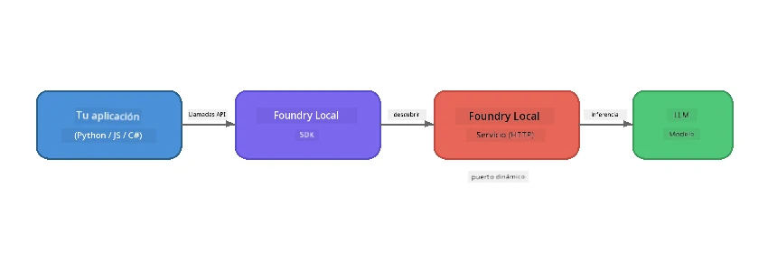

# Parte 1: Comenzando con Foundry Local


## ¿Qué es Foundry Local?

[Foundry Local](https://foundrylocal.ai) te permite ejecutar modelos de lenguaje de IA de código abierto **directamente en tu computadora** - sin necesidad de internet, sin costos en la nube y con completa privacidad de tus datos. Esto:

- **Descarga y ejecuta modelos localmente** con optimización automática para hardware (GPU, CPU o NPU)
- **Proporciona una API compatible con OpenAI** para que puedas usar SDKs y herramientas familiares
- **No requiere suscripción a Azure** ni registrarse - solo instala y comienza a construir

Piensa en ello como si tuvieras una IA privada que se ejecuta completamente en tu máquina.

## Objetivos de aprendizaje

Al final de este laboratorio podrás:

- Instalar la CLI de Foundry Local en tu sistema operativo
- Entender qué son los alias de modelos y cómo funcionan
- Descargar y ejecutar tu primer modelo de IA local
- Enviar un mensaje de chat a un modelo local desde la línea de comandos
- Comprender la diferencia entre modelos de IA locales y alojados en la nube

---

## Requisitos previos

### Requisitos del sistema

| Requisito | Mínimo | Recomendado |
|-----------|--------|-------------|
| **RAM** | 8 GB | 16 GB |
| **Espacio en disco** | 5 GB (para modelos) | 10 GB |
| **CPU** | 4 núcleos | 8+ núcleos |
| **GPU** | Opcional | NVIDIA con CUDA 11.8+ |
| **SO** | Windows 10/11 (x64/ARM), Windows Server 2025, macOS 13+ | - |

> **Nota:** Foundry Local selecciona automáticamente la mejor variante de modelo para tu hardware. Si tienes una GPU NVIDIA, usa aceleración CUDA. Si tienes una NPU Qualcomm, la utiliza. De lo contrario, utiliza una variante optimizada para CPU.

### Instalar la CLI de Foundry Local

**Windows** (PowerShell):
```powershell
winget install Microsoft.FoundryLocal
```

**macOS** (Homebrew):
```bash
brew tap microsoft/foundrylocal
brew install foundrylocal
```

> **Nota:** Foundry Local soporta actualmente solo Windows y macOS. Linux no está soportado en este momento.

Verifica la instalación:
```bash
foundry --version
```

---

## Ejercicios del laboratorio

### Ejercicio 1: Explorar modelos disponibles

Foundry Local incluye un catálogo de modelos de código abierto pre-optimizado. Lista los modelos:

```bash
foundry model list
```

Verás modelos como:
- `phi-3.5-mini` - Modelo de 3.8B parámetros de Microsoft (rápido, buena calidad)
- `phi-4-mini` - Modelo Phi más nuevo y capaz
- `phi-4-mini-reasoning` - Modelo Phi con razonamiento en cadena de pensamiento (`<think>` tags)
- `phi-4` - Modelo Phi más grande de Microsoft (10.4 GB)
- `qwen2.5-0.5b` - Muy pequeño y rápido (bueno para dispositivos con pocos recursos)
- `qwen2.5-7b` - Modelo general fuerte con soporte para llamada de herramientas
- `qwen2.5-coder-7b` - Optimizado para generación de código
- `deepseek-r1-7b` - Modelo fuerte para razonamiento
- `gpt-oss-20b` - Modelo grande de código abierto (licencia MIT, 12.5 GB)
- `whisper-base` - Transcripción de voz a texto (383 MB)
- `whisper-large-v3-turbo` - Transcripción de alta precisión (9 GB)

> **¿Qué es un alias de modelo?** Los alias como `phi-3.5-mini` son atajos. Cuando usas un alias, Foundry Local descarga automáticamente la mejor variante para tu hardware específico (CUDA para GPUs NVIDIA, optimizado para CPU en otro caso). Nunca necesitas preocuparte por elegir la variante correcta.

### Ejercicio 2: Ejecutar tu primer modelo

Descarga y comienza a chatear con un modelo de forma interactiva:

```bash
foundry model run phi-3.5-mini
```

La primera vez que ejecutes esto, Foundry Local:
1. Detectará tu hardware
2. Descargará la variante óptima del modelo (esto puede tardar algunos minutos)
3. Cargará el modelo en memoria
4. Iniciará una sesión de chat interactiva

Prueba a hacerle algunas preguntas:
```
You: What is the golden ratio?
You: Can you explain it as if I were 10 years old?
You: Write a haiku about mathematics
```

Escribe `exit` o presiona `Ctrl+C` para salir.

### Ejercicio 3: Pre-descargar un modelo

Si quieres descargar un modelo sin iniciar un chat:

```bash
foundry model download phi-3.5-mini
```

Verifica qué modelos ya están descargados en tu máquina:

```bash
foundry cache list
```

### Ejercicio 4: Entender la arquitectura

Foundry Local funciona como un **servicio HTTP local** que expone una API REST compatible con OpenAI. Esto significa:

1. El servicio inicia en un **puerto dinámico** (un puerto diferente cada vez)
2. Usas el SDK para descubrir la URL real del endpoint
3. Puedes usar **cualquier** biblioteca cliente compatible con OpenAI para comunicarte con él



> **Importante:** Foundry Local asigna un **puerto dinámico** cada vez que se inicia. Nunca codifiques de forma fija un número de puerto como `localhost:5272`. Siempre usa el SDK para descubrir la URL actual (por ejemplo `manager.endpoint` en Python o `manager.urls[0]` en JavaScript).

---

## Puntos clave

| Concepto | Lo que aprendiste |
|----------|-------------------|
| IA en el dispositivo | Foundry Local ejecuta modelos completamente en tu dispositivo sin nube, sin claves API y sin costos |
| Alias de modelos | Alias como `phi-3.5-mini` seleccionan automáticamente la mejor variante para tu hardware |
| Puertos dinámicos | El servicio se ejecuta en un puerto dinámico; siempre usa el SDK para descubrir el endpoint |
| CLI y SDK | Puedes interactuar con modelos vía CLI (`foundry model run`) o programáticamente vía SDK |

---

## Próximos pasos

Continúa con [Parte 2: Profundización en el SDK de Foundry Local](part2-foundry-local-sdk.md) para dominar la API del SDK para gestionar modelos, servicios y caché de forma programática.