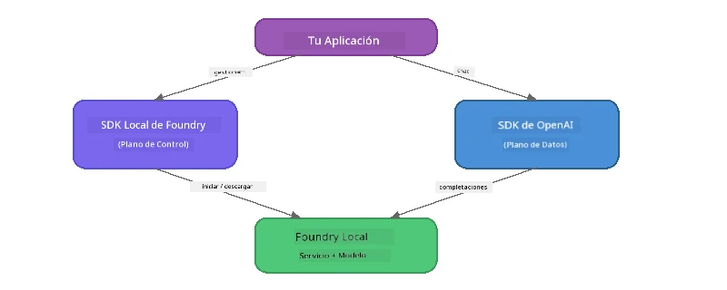

# Parte 3: Uso del Foundry Local SDK con OpenAI

## Resumen

En la Parte 1 usaste el Foundry Local CLI para ejecutar modelos de forma interactiva. En la Parte 2 exploraste toda la API del SDK. Ahora aprenderás a **integrar Foundry Local en tus aplicaciones** usando el SDK y la API compatible con OpenAI.

Foundry Local provee SDKs para tres lenguajes. Elige el que te sea más cómodo: los conceptos son idénticos en los tres.

## Objetivos de aprendizaje

Al final de este laboratorio podrás:

- Instalar el Foundry Local SDK para tu lenguaje (Python, JavaScript o C#)
- Inicializar `FoundryLocalManager` para iniciar el servicio, verificar la caché, descargar y cargar un modelo
- Conectarte al modelo local usando el SDK de OpenAI
- Enviar completions de chat y manejar respuestas en streaming
- Entender la arquitectura de puertos dinámicos

---

## Requisitos previos

Completa primero [Parte 1: Primeros Pasos con Foundry Local](part1-getting-started.md) y [Parte 2: Profundización en Foundry Local SDK](part2-foundry-local-sdk.md).

Instala **uno** de los siguientes runtimes de lenguaje:
- **Python 3.9+** - [python.org/downloads](https://www.python.org/downloads/)
- **Node.js 18+** - [nodejs.org](https://nodejs.org/)
- **.NET 9.0+** - [dot.net/download](https://dotnet.microsoft.com/download)

---

## Concepto: Cómo Funciona el SDK

El Foundry Local SDK maneja el **plano de control** (iniciar el servicio, descargar modelos), mientras que el SDK de OpenAI maneja el **plano de datos** (enviar prompts, recibir completions).



---

## Ejercicios de laboratorio

### Ejercicio 1: Configura tu Entorno

<details>
<summary><b>🐍 Python</b></summary>

```bash
cd python
python -m venv venv

# Activar el entorno virtual:
# Windows (PowerShell):
venv\Scripts\Activate.ps1
# Windows (Símbolo del sistema):
venv\Scripts\activate.bat
# macOS:
source venv/bin/activate

pip install -r requirements.txt
```

El archivo `requirements.txt` instala:
- `foundry-local-sdk` - El Foundry Local SDK (importado como `foundry_local`)
- `openai` - El SDK de OpenAI para Python
- `agent-framework` - Microsoft Agent Framework (usado en partes posteriores)

</details>

<details>
<summary><b>📘 JavaScript</b></summary>

```bash
cd javascript
npm install
```

El `package.json` instala:
- `foundry-local-sdk` - El Foundry Local SDK
- `openai` - El SDK de OpenAI para Node.js

</details>

<details>
<summary><b>💜 C#</b></summary>

```bash
cd csharp
dotnet restore
dotnet build
```

El archivo `csharp.csproj` usa:
- `Microsoft.AI.Foundry.Local` - El Foundry Local SDK (NuGet)
- `OpenAI` - El SDK de OpenAI para C# (NuGet)

> **Estructura del proyecto:** El proyecto C# usa un enrutador de línea de comandos en `Program.cs` que despacha a archivos de ejemplo separados. Ejecuta `dotnet run chat` (o solo `dotnet run`) para esta parte. Otras partes usan `dotnet run rag`, `dotnet run agent` y `dotnet run multi`.

</details>

---

### Ejercicio 2: Completación básica de chat

Abre el ejemplo básico de chat para tu lenguaje y examina el código. Cada script sigue el mismo patrón de tres pasos:

1. **Iniciar el servicio** - `FoundryLocalManager` inicia el runtime de Foundry Local
2. **Descargar y cargar el modelo** - verificar caché, descargar si es necesario, luego cargar en memoria
3. **Crear un cliente OpenAI** - conectar con el endpoint local y enviar una completación de chat por streaming

<details>
<summary><b>🐍 Python - <code>python/foundry-local.py</code></b></summary>

```python
import sys
import openai
from foundry_local import FoundryLocalManager

alias = "phi-3.5-mini"

# Paso 1: Crear un FoundryLocalManager e iniciar el servicio
print("Starting Foundry Local service...")
manager = FoundryLocalManager()
manager.start_service()

# Paso 2: Verificar si el modelo ya está descargado
cached = manager.list_cached_models()
catalog_info = manager.get_model_info(alias)
is_cached = any(m.id == catalog_info.id for m in cached) if catalog_info else False

if is_cached:
    print(f"Model already downloaded: {alias}")
else:
    print(f"Downloading model: {alias} (this may take several minutes)...")
    manager.download_model(alias)
    print(f"Download complete: {alias}")

# Paso 3: Cargar el modelo en la memoria
print(f"Loading model: {alias}...")
manager.load_model(alias)

# Crear un cliente OpenAI apuntando al servicio LOCAL de Foundry
client = openai.OpenAI(
    base_url=manager.endpoint,   # Puerto dinámico - ¡nunca codificar en duro!
    api_key=manager.api_key
)

# Generar una finalización de chat en streaming
stream = client.chat.completions.create(
    model=manager.get_model_info(alias).id,
    messages=[{"role": "user", "content": "What is the golden ratio?"}],
    stream=True,
)

for chunk in stream:
    if chunk.choices[0].delta.content is not None:
        print(chunk.choices[0].delta.content, end="", flush=True)
print()
```

**Ejecuta:**
```bash
python foundry-local.py
```

</details>

<details>
<summary><b>📘 JavaScript - <code>javascript/foundry-local.mjs</code></b></summary>

```javascript
import { OpenAI } from "openai";
import { FoundryLocalManager } from "foundry-local-sdk";

const alias = "phi-3.5-mini";

// Paso 1: Iniciar el servicio Foundry Local
console.log("Starting Foundry Local service...");
FoundryLocalManager.create({ appName: "FoundryLocalWorkshop" });
const manager = FoundryLocalManager.instance;
await manager.startWebService();

// Paso 2: Verificar si el modelo ya está descargado
const catalog = manager.catalog;
const model = await catalog.getModel(alias);

if (model.isCached) {
  console.log(`Model already downloaded: ${alias}`);
} else {
  console.log(`Downloading model: ${alias} (this may take several minutes)...`);
  await model.download();
  console.log(`Download complete: ${alias}`);
}

// Paso 3: Cargar el modelo en la memoria
console.log(`Loading model: ${alias}...`);
await model.load();
console.log(`Model loaded: ${model.id}`);

// Crear un cliente OpenAI apuntando al servicio LOCAL de Foundry
const client = new OpenAI({
  baseURL: manager.urls[0] + "/v1",   // Puerto dinámico - ¡nunca codificarlo estáticamente!
  apiKey: "foundry-local",
});

// Generar una finalización de chat en streaming
const stream = await client.chat.completions.create({
  model: model.id,
  messages: [{ role: "user", content: "What is the golden ratio?" }],
  stream: true,
});

for await (const chunk of stream) {
  if (chunk.choices[0]?.delta?.content) {
    process.stdout.write(chunk.choices[0].delta.content);
  }
}
console.log();
```

**Ejecuta:**
```bash
node foundry-local.mjs
```

</details>

<details>
<summary><b>💜 C# - <code>csharp/BasicChat.cs</code></b></summary>

```csharp
using Microsoft.AI.Foundry.Local;
using Microsoft.Extensions.Logging.Abstractions;
using OpenAI;
using OpenAI.Chat;
using System.ClientModel;

var alias = "phi-3.5-mini";

// Step 1: Start the Foundry Local service
Console.WriteLine("Starting Foundry Local service...");
await FoundryLocalManager.CreateAsync(
    new Configuration
    {
        AppName = "FoundryLocalSamples",
        Web = new Configuration.WebService { Urls = "http://127.0.0.1:0" }
    }, NullLogger.Instance, default);
var manager = FoundryLocalManager.Instance;
await manager.StartWebServiceAsync(default);

// Step 2: Get the model from the catalog
var catalog = await manager.GetCatalogAsync(default);
var model = await catalog.GetModelAsync(alias, default);

// Step 3: Check if the model is already downloaded
var isCached = await model.IsCachedAsync(default);

if (isCached)
{
    Console.WriteLine($"Model already downloaded: {alias}");
}
else
{
    Console.WriteLine($"Downloading model: {alias} (this may take several minutes)...");
    await model.DownloadAsync(null, default);
    Console.WriteLine($"Download complete: {alias}");
}

// Step 4: Load the model into memory
Console.WriteLine($"Loading model: {alias}...");
await model.LoadAsync(default);
Console.WriteLine($"Loaded model: {model.Id}");
Console.WriteLine($"Endpoint: {manager.Urls[0]}");

// Create OpenAI client pointing to the LOCAL Foundry service
var key = new ApiKeyCredential("foundry-local");
var client = new OpenAIClient(key, new OpenAIClientOptions
{
    Endpoint = new Uri(manager.Urls[0] + "/v1")  // Dynamic port - never hardcode!
});

var chatClient = client.GetChatClient(model.Id);

// Stream a chat completion
var completionUpdates = chatClient.CompleteChatStreaming("What is the golden ratio?");

foreach (var update in completionUpdates)
{
    if (update.ContentUpdate.Count > 0)
    {
        Console.Write(update.ContentUpdate[0].Text);
    }
}
Console.WriteLine();
```

**Ejecuta:**
```bash
dotnet run chat
```

</details>

---

### Ejercicio 3: Experimenta con los prompts

Una vez que tu ejemplo básico funcione, prueba modificar el código:

1. **Cambia el mensaje del usuario** - prueba diferentes preguntas
2. **Agrega un prompt del sistema** - da una personalidad al modelo
3. **Desactiva el streaming** - pon `stream=False` y muestra la respuesta completa de una vez
4. **Prueba otro modelo** - cambia el alias de `phi-3.5-mini` a otro modelo listado en `foundry model list`

<details>
<summary><b>🐍 Python</b></summary>

```python
# Añadir un mensaje del sistema - darle al modelo una personalidad:
stream = client.chat.completions.create(
    model=manager.get_model_info(alias).id,
    messages=[
        {"role": "system", "content": "You are a pirate. Answer everything in pirate speak."},
        {"role": "user", "content": "What is the golden ratio?"}
    ],
    stream=True,
)

# O desactivar la transmisión:
response = client.chat.completions.create(
    model=manager.get_model_info(alias).id,
    messages=[{"role": "user", "content": "What is the golden ratio?"}],
    stream=False,
)
print(response.choices[0].message.content)
```

</details>

<details>
<summary><b>📘 JavaScript</b></summary>

```javascript
// Agrega un mensaje del sistema: asigna una personalidad al modelo:
const stream = await client.chat.completions.create({
  model: modelInfo.id,
  messages: [
    { role: "system", content: "You are a pirate. Answer everything in pirate speak." },
    { role: "user", content: "What is the golden ratio?" },
  ],
  stream: true,
});

// O desactiva la transmisión:
const response = await client.chat.completions.create({
  model: modelInfo.id,
  messages: [{ role: "user", content: "What is the golden ratio?" }],
  stream: false,
});
console.log(response.choices[0].message.content);
```

</details>

<details>
<summary><b>💜 C#</b></summary>

```csharp
// Add a system prompt - give the model a persona:
var completionUpdates = chatClient.CompleteChatStreaming(
    new ChatMessage[]
    {
        new SystemChatMessage("You are a pirate. Answer everything in pirate speak."),
        new UserChatMessage("What is the golden ratio?")
    }
);

// Or turn off streaming:
var response = chatClient.CompleteChat("What is the golden ratio?");
Console.WriteLine(response.Value.Content[0].Text);
```

</details>

---

### Referencia de métodos del SDK

<details>
<summary><b>🐍 Métodos del SDK para Python</b></summary>

| Método | Propósito |
|--------|-----------|
| `FoundryLocalManager()` | Crear instancia del manager |
| `manager.start_service()` | Iniciar el servicio Foundry Local |
| `manager.list_cached_models()` | Listar modelos descargados en tu dispositivo |
| `manager.get_model_info(alias)` | Obtener ID y metadatos del modelo |
| `manager.download_model(alias, progress_callback=fn)` | Descargar un modelo con callback opcional |
| `manager.load_model(alias)` | Cargar un modelo en memoria |
| `manager.endpoint` | Obtener la URL del endpoint dinámico |
| `manager.api_key` | Obtener la clave API (placeholder para local) |

</details>

<details>
<summary><b>📘 Métodos del SDK para JavaScript</b></summary>

| Método | Propósito |
|--------|-----------|
| `FoundryLocalManager.create({ appName })` | Crear instancia del manager |
| `FoundryLocalManager.instance` | Acceder al manager singleton |
| `await manager.startWebService()` | Iniciar el servicio Foundry Local |
| `await manager.catalog.getModel(alias)` | Obtener un modelo del catálogo |
| `model.isCached` | Verificar si el modelo ya está descargado |
| `await model.download()` | Descargar un modelo |
| `await model.load()` | Cargar un modelo en memoria |
| `model.id` | Obtener el ID del modelo para llamadas API OpenAI |
| `manager.urls[0] + "/v1"` | Obtener la URL del endpoint dinámico |
| `"foundry-local"` | Clave API (placeholder para local) |

</details>

<details>
<summary><b>💜 Métodos del SDK para C#</b></summary>

| Método | Propósito |
|--------|-----------|
| `FoundryLocalManager.CreateAsync(config)` | Crear e inicializar el manager |
| `manager.StartWebServiceAsync()` | Iniciar el servicio web Foundry Local |
| `manager.GetCatalogAsync()` | Obtener el catálogo de modelos |
| `catalog.ListModelsAsync()` | Listar todos los modelos disponibles |
| `catalog.GetModelAsync(alias)` | Obtener un modelo específico por alias |
| `model.IsCachedAsync()` | Verificar si un modelo está descargado |
| `model.DownloadAsync()` | Descargar un modelo |
| `model.LoadAsync()` | Cargar un modelo en memoria |
| `manager.Urls[0]` | Obtener la URL del endpoint dinámico |
| `new ApiKeyCredential("foundry-local")` | Credencial de clave API para local |

</details>

---

### Ejercicio 4: Uso del ChatClient nativo (alternativa al SDK de OpenAI)

En los Ejercicios 2 y 3 usaste el SDK de OpenAI para compleciones de chat. Los SDKs de JavaScript y C# también proveen un **ChatClient nativo** que elimina la necesidad del SDK de OpenAI por completo.

<details>
<summary><b>📘 JavaScript - <code>model.createChatClient()</code></b></summary>

```javascript
import { FoundryLocalManager } from "foundry-local-sdk";

const alias = "phi-3.5-mini";

FoundryLocalManager.create({ appName: "ChatClientDemo" });
const manager = FoundryLocalManager.instance;
await manager.startWebService();

const model = await manager.catalog.getModel(alias);
if (!model.isCached) await model.download();
await model.load();

// No se necesita importar OpenAI: obtén un cliente directamente del modelo
const chatClient = model.createChatClient();

// Finalización sin transmisión
const response = await chatClient.completeChat([
  { role: "system", content: "You are a pirate. Answer everything in pirate speak." },
  { role: "user", content: "What is the golden ratio?" }
]);
console.log(response.choices[0].message.content);

// Finalización con transmisión (utiliza un patrón de callback)
await chatClient.completeStreamingChat(
  [{ role: "user", content: "What is the golden ratio?" }],
  (chunk) => {
    if (chunk.choices?.[0]?.delta?.content) {
      process.stdout.write(chunk.choices[0].delta.content);
    }
  }
);
console.log();
```

> **Nota:** El método `completeStreamingChat()` de ChatClient usa un patrón de **callback**, no un iterador async. Pasa una función como segundo argumento.

</details>

<details>
<summary><b>💜 C# - <code>model.GetChatClientAsync()</code></b></summary>

```csharp
var catalog = await manager.GetCatalogAsync(default);
var model = await catalog.GetModelAsync("phi-3.5-mini", default);
if (!await model.IsCachedAsync(default))
    await model.DownloadAsync(null, default);
await model.LoadAsync(default);

// No OpenAI NuGet needed — get a client directly from the model
var chatClient = await model.GetChatClientAsync(default);

// Use it like a standard OpenAI ChatClient
var response = chatClient.CompleteChat("What is the golden ratio?");
Console.WriteLine(response.Value.Content[0].Text);
```

</details>

> **Cuándo usar cada uno:**
> | Enfoque | Mejor para |
> |---------|------------|
> | SDK OpenAI | Control completo de parámetros, aplicaciones en producción, código OpenAI existente |
> | ChatClient nativo | Prototipos rápidos, menos dependencias, configuración más sencilla |

---

## Puntos clave para recordar

| Concepto | Lo que aprendiste |
|----------|-------------------|
| Plano de control | El Foundry Local SDK gestiona iniciar el servicio y cargar modelos |
| Plano de datos | El SDK de OpenAI maneja las completions de chat y el streaming |
| Puertos dinámicos | Siempre usa el SDK para descubrir el endpoint; nunca uses URLs hardcodeadas |
| Multilenguaje | El mismo patrón de código funciona en Python, JavaScript y C# |
| Compatibilidad OpenAI | La compatibilidad total con la API OpenAI permite usar código OpenAI existente con cambios mínimos |
| ChatClient nativo | `createChatClient()` (JS) / `GetChatClientAsync()` (C#) ofrece una alternativa al SDK OpenAI |

---

## Próximos pasos

Continúa con [Parte 4: Construyendo una aplicación RAG](part4-rag-fundamentals.md) para aprender cómo construir una canalización de Generación Aumentada por Recuperación que funcione completamente en tu dispositivo.