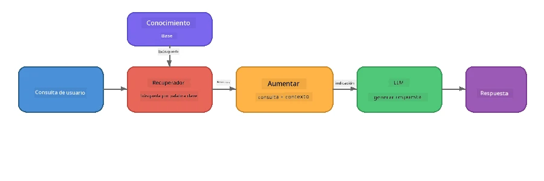

# Parte 4: Creación de una aplicación RAG con Foundry Local

## Visión general

Los modelos de lenguaje grande son poderosos, pero solo conocen lo que estaba en sus datos de entrenamiento. **Generación aumentada por recuperación (RAG)** resuelve esto al proporcionar al modelo un contexto relevante en el momento de la consulta, extraído de tus propios documentos, bases de datos o bases de conocimiento.

En este laboratorio construirás una tubería RAG completa que se ejecuta **totalmente en tu dispositivo** usando Foundry Local. Sin servicios en la nube, sin bases de datos vectoriales, sin API de embeddings: solo recuperación local y un modelo local.

## Objetivos de aprendizaje

Al finalizar este laboratorio podrás:

- Explicar qué es RAG y por qué es importante para aplicaciones de IA
- Construir una base de conocimiento local a partir de documentos de texto
- Implementar una función simple de recuperación para encontrar contexto relevante
- Componer un prompt de sistema que ancle el modelo en hechos recuperados
- Ejecutar la tubería completa Recuperar → Aumentar → Generar en el dispositivo
- Entender las compensaciones entre la recuperación simple por palabras clave y la búsqueda vectorial

---

## Requisitos previos

- Completar [Parte 3: Uso del SDK de Foundry Local con OpenAI](part3-sdk-and-apis.md)
- Tener instalado Foundry Local CLI y descargar el modelo `phi-3.5-mini`

---

## Concepto: ¿Qué es RAG?

Sin RAG, un LLM solo puede responder según sus datos de entrenamiento, que pueden estar desactualizados, incompletos o carecer de tu información privada:

```
User: "What is Zava's return policy?"
LLM:  "I do not have information about Zava's return policy."  ← No context!
```

Con RAG, primero **recuperas** documentos relevantes y luego **aumentas** el prompt con ese contexto antes de **generar** una respuesta:



La clave: **el modelo no necesita "saber" la respuesta; solo debe leer los documentos correctos.**

---

## Ejercicios del laboratorio

### Ejercicio 1: Comprender la base de conocimiento

Abre el ejemplo RAG para tu lenguaje y examina la base de conocimiento:

<details>
<summary><b>🐍 Python: <code>python/foundry-local-rag.py</code></b></summary>

La base de conocimiento es una lista simple de diccionarios con campos `title` y `content`:

```python
KNOWLEDGE_BASE = [
    {
        "title": "Foundry Local Overview",
        "content": (
            "Foundry Local brings the power of Azure AI Foundry to your local "
            "device without requiring an Azure subscription..."
        ),
    },
    {
        "title": "Supported Hardware",
        "content": (
            "Foundry Local automatically selects the best model variant for "
            "your hardware. If you have an Nvidia CUDA GPU it downloads the "
            "CUDA-optimized model..."
        ),
    },
    # ... más entradas
]
```

Cada entrada representa un "fragmento" de conocimiento, una pieza enfocada de información sobre un tema.

</details>

<details>
<summary><b>📘 JavaScript: <code>javascript/foundry-local-rag.mjs</code></b></summary>

La base de conocimiento usa la misma estructura como arreglo de objetos:

```javascript
const KNOWLEDGE_BASE = [
  {
    title: "Foundry Local Overview",
    content:
      "Foundry Local brings the power of Azure AI Foundry to your local " +
      "device without requiring an Azure subscription...",
  },
  {
    title: "Supported Hardware",
    content:
      "Foundry Local automatically selects the best model variant for " +
      "your hardware...",
  },
  // ... más entradas
];
```

</details>

<details>
<summary><b>💜 C#: <code>csharp/RagPipeline.cs</code></b></summary>

La base de conocimiento usa una lista de tuplas con nombre:

```csharp
private static readonly List<(string Title, string Content)> KnowledgeBase =
[
    ("Foundry Local Overview",
     "Foundry Local brings the power of Azure AI Foundry to your local " +
     "device without requiring an Azure subscription..."),

    ("Supported Hardware",
     "Foundry Local automatically selects the best model variant for " +
     "your hardware..."),

    // ... more entries
];
```

</details>

> **En una aplicación real**, la base de conocimiento provendría de archivos en disco, una base de datos, un índice de búsqueda o una API. Para este laboratorio usamos una lista en memoria para mantenerlo simple.

---

### Ejercicio 2: Comprender la función de recuperación

El paso de recuperación encuentra los fragmentos más relevantes para la pregunta del usuario. Este ejemplo usa **solapamiento por palabras clave**, contando cuántas palabras de la consulta aparecen en cada fragmento:

<details>
<summary><b>🐍 Python</b></summary>

```python
def retrieve(query: str, top_k: int = 2) -> list[dict]:
    """Return the top-k knowledge chunks most relevant to the query."""
    query_words = set(query.lower().split())
    scored = []
    for chunk in KNOWLEDGE_BASE:
        chunk_words = set(chunk["content"].lower().split())
        overlap = len(query_words & chunk_words)
        scored.append((overlap, chunk))
    scored.sort(key=lambda x: x[0], reverse=True)
    return [item[1] for item in scored[:top_k]]
```

</details>

<details>
<summary><b>📘 JavaScript</b></summary>

```javascript
function retrieve(query, topK = 2) {
  const queryWords = new Set(query.toLowerCase().split(/\s+/));
  const scored = KNOWLEDGE_BASE.map((chunk) => {
    const chunkWords = new Set(chunk.content.toLowerCase().split(/\s+/));
    let overlap = 0;
    for (const w of queryWords) {
      if (chunkWords.has(w)) overlap++;
    }
    return { overlap, chunk };
  });
  scored.sort((a, b) => b.overlap - a.overlap);
  return scored.slice(0, topK).map((s) => s.chunk);
}
```

</details>

<details>
<summary><b>💜 C#</b></summary>

```csharp
private static List<(string Title, string Content)> Retrieve(string query, int topK = 2)
{
    var queryWords = new HashSet<string>(
        query.ToLowerInvariant().Split(' ', StringSplitOptions.RemoveEmptyEntries));

    return KnowledgeBase
        .Select(chunk =>
        {
            var chunkWords = new HashSet<string>(
                chunk.Content.ToLowerInvariant().Split(' ', StringSplitOptions.RemoveEmptyEntries));
            var overlap = queryWords.Intersect(chunkWords).Count();
            return (Overlap: overlap, Chunk: chunk);
        })
        .OrderByDescending(x => x.Overlap)
        .Take(topK)
        .Select(x => x.Chunk)
        .ToList();
}
```

</details>

**Cómo funciona:**
1. Divide la consulta en palabras individuales
2. Para cada fragmento de conocimiento, cuenta cuántas palabras de la consulta aparecen en ese fragmento
3. Ordena por puntuación de solapamiento (de mayor a menor)
4. Devuelve los k fragmentos más relevantes

> **Compensación:** El solapamiento por palabras clave es simple pero limitado; no entiende sinónimos ni significado. Los sistemas RAG en producción suelen usar **vectores de embeddings** y una **base de datos vectorial** para búsqueda semántica. Sin embargo, este método es un buen punto de partida y no requiere dependencias adicionales.

---

### Ejercicio 3: Comprender el prompt aumentado

El contexto recuperado se inyecta en el **prompt del sistema** antes de enviarlo al modelo:

```python
system_prompt = (
    "You are a helpful assistant. Answer the user's question using ONLY "
    "the information provided in the context below. If the context does "
    "not contain enough information, say so.\n\n"
    f"Context:\n{context_text}"
)
```

Decisiones clave de diseño:
- **"SÓLO la información proporcionada"** - evita que el modelo alucine hechos que no están en el contexto
- **"Si el contexto no contiene suficiente información, dilo"** - fomenta respuestas honestas de "No sé"
- El contexto se coloca en el mensaje del sistema para que influya en todas las respuestas

---

### Ejercicio 4: Ejecutar la tubería RAG

Ejecuta el ejemplo completo:

**Python:**
```bash
cd python
python foundry-local-rag.py
```

**JavaScript:**
```bash
cd javascript
node foundry-local-rag.mjs
```

**C#:**
```bash
cd csharp
dotnet run rag
```

Deberías ver tres cosas impresas:
1. **La pregunta** realizada
2. **El contexto recuperado** - los fragmentos seleccionados de la base de conocimiento
3. **La respuesta** - generada por el modelo usando solo ese contexto

Ejemplo de salida:
```
Question: How do I install Foundry Local and what hardware does it support?

--- Retrieved Context ---
### Installation
On Windows install Foundry Local with: winget install Microsoft.FoundryLocal...

### Supported Hardware
Foundry Local automatically selects the best model variant for your hardware...
-------------------------

Answer: To install Foundry Local, you can use the following methods depending
on your operating system: On Windows, run `winget install Microsoft.FoundryLocal`.
On macOS, use `brew install microsoft/foundrylocal/foundrylocal`...
```

Fíjate cómo la respuesta del modelo está **anclada** en el contexto recuperado, solo menciona hechos de los documentos de la base de conocimiento.

---

### Ejercicio 5: Experimentar y extender

Prueba estas modificaciones para profundizar tu comprensión:

1. **Cambia la pregunta** - pregunta algo que ESTÉ en la base de conocimiento frente a algo que NO ESTÉ:
   ```python
   question = "What programming languages does Foundry Local support?"  # ← En contexto
   question = "How much does Foundry Local cost?"                       # ← No en contexto
   ```
   ¿Dice el modelo correctamente "No sé" cuando la respuesta no está en el contexto?

2. **Agrega un nuevo fragmento de conocimiento** - añade una nueva entrada a `KNOWLEDGE_BASE`:
   ```python
   {
       "title": "Pricing",
       "content": "Foundry Local is completely free and open source under the MIT license.",
   }
   ```
   Ahora vuelve a preguntar sobre precios.

3. **Cambia el valor `top_k`** - recupera más o menos fragmentos:
   ```python
   context_chunks = retrieve(question, top_k=3)  # Más contexto
   context_chunks = retrieve(question, top_k=1)  # Menos contexto
   ```
   ¿Cómo afecta la cantidad de contexto a la calidad de la respuesta?

4. **Elimina la instrucción de anclaje** - cambia el prompt del sistema a solo "Eres un asistente útil." y observa si el modelo empieza a alucinar hechos.

---

## Profundización: Optimización de RAG para rendimiento en dispositivo

Ejecutar RAG en dispositivo introduce limitaciones que no existen en la nube: RAM limitada, sin GPU dedicada (ejecución CPU/NPU), y ventana de contexto de modelo pequeña. Las decisiones de diseño a continuación abordan estas limitaciones y están basadas en patrones de aplicaciones RAG locales tipo producción construidas con Foundry Local.

### Estrategia de fragmentación: ventana deslizante de tamaño fijo

Fragmentar — dividir documentos en partes — es una de las decisiones más importantes en cualquier sistema RAG. Para escenarios on-device, se recomienda una **ventana deslizante de tamaño fijo con solapamiento**:

| Parámetro | Valor recomendado | Por qué |
|-----------|-------------------|---------|
| **Tamaño del fragmento** | ~200 tokens | Mantiene el contexto recuperado compacto, dejando espacio en la ventana de contexto de Phi-3.5 Mini para el prompt del sistema, historial de conversación y salida generada |
| **Solapamiento** | ~25 tokens (12.5%) | Evita pérdida de información en los límites del fragmento, importante para procedimientos e instrucciones paso a paso |
| **Tokenización** | División por espacios | Sin dependencias, no se necesita biblioteca tokenizadora. Todo el presupuesto computacional va para el LLM |

El solapamiento funciona como una ventana deslizante: cada nuevo fragmento comienza 25 tokens antes de que terminara el anterior, así las oraciones que cruzan límites aparecen en ambos fragmentos.

> **¿Por qué no otras estrategias?**
> - **División por oraciones** produce tamaños de fragmento impredecibles; algunos procedimientos de seguridad son oraciones largas que no dividirían bien
> - **División por secciones** (por encabezados `##`) crea fragmentos de tamaño muy variable, algunos demasiado pequeños u otros demasiado grandes para la ventana de contexto
> - **Fragmentación semántica** (detección de temas basada en embeddings) ofrece mejor calidad de recuperación, pero requiere un segundo modelo en memoria además de Phi-3.5 Mini, lo cual es arriesgado en hardware con 8-16 GB de memoria compartida

### Mejora de la recuperación: vectores TF-IDF

El método de solapamiento por palabras clave en este laboratorio funciona, pero si quieres mejor recuperación sin añadir un modelo de embeddings, **TF-IDF (frecuencia inversa de término por documento)** es un excelente punto medio:

```
Keyword Overlap  →  TF-IDF Vectors  →  Embedding Models
    (this lab)     (lightweight upgrade)   (production)
  Simple & fast    Better ranking,         Best quality,
  No dependencies  still no ML model       requires embedding model
  ~Basic matching  ~1ms retrieval          ~100-500ms per query
```

TF-IDF convierte cada fragmento en un vector numérico basado en la importancia de cada palabra dentro del fragmento *en relación con todos los fragmentos*. En tiempo de consulta, se vectoriza la pregunta igual y se compara usando similitud coseno. Se puede implementar con SQLite y JavaScript/Python puro — sin base vectorial ni API de embeddings.

> **Rendimiento:** La similitud coseno con TF-IDF sobre fragmentos de tamaño fijo típicamente logra **~1ms de recuperación**, comparado con ~100-500ms cuando un modelo de embedding codifica cada consulta. Los más de 20 documentos pueden fragmentarse e indexarse en menos de un segundo.

### Modo Edge/Compacto para dispositivos limitados

Al ejecutar en hardware muy limitado (laptops antiguos, tablets, dispositivos de campo), puedes reducir el uso de recursos bajando tres parámetros:

| Ajuste | Modo Estándar | Modo Edge/Compacto |
|---------|--------------|-------------------|
| **Prompt del sistema** | ~300 tokens | ~80 tokens |
| **Máximo de tokens de salida** | 1024 | 512 |
| **Fragmentos recuperados (top-k)** | 5 | 3 |

Recuperar menos fragmentos significa menos contexto para el modelo, lo que reduce la latencia y presión de memoria. Un prompt de sistema más corto libera más ventana de contexto para la respuesta. Este intercambio vale en dispositivos donde cada token en la ventana de contexto cuenta.

### Un único modelo en memoria

Uno de los principios más importantes para RAG on-device: **mantener solo un modelo cargado**. Si usas un modelo de embeddings para recuperación y un modelo de lenguaje para generación, divides los recursos limitados de NPU/RAM entre dos modelos. La recuperación ligera (solapamiento por palabras clave, TF-IDF) evita esto completamente:

- Sin modelo de embeddings compitiendo con el LLM por memoria
- Inicio en frío más rápido - solo un modelo que cargar
- Uso de memoria predecible - el LLM tiene todos los recursos disponibles
- Funciona en máquinas con apenas 8 GB de RAM

### SQLite como almacenamiento vectorial local

Para colecciones de documentos pequeñas a medianas (cientos a pocos miles de fragmentos), **SQLite es lo suficientemente rápido** para búsqueda de similitud coseno por fuerza bruta y no requiere infraestructura adicional:

- Archivo `.db` único en disco — sin proceso servidor ni configuración
- Incluido en todos los entornos principales (Python `sqlite3`, Node.js `better-sqlite3`, .NET `Microsoft.Data.Sqlite`)
- Almacena fragmentos junto con sus vectores TF-IDF en una tabla
- No requiere Pinecone, Qdrant, Chroma ni FAISS a esta escala

### Resumen de rendimiento

Estas decisiones de diseño se combinan para ofrecer un RAG ágil en hardware de consumo:

| Métrica | Rendimiento on-device |
|---------|----------------------|
| **Latencia de recuperación** | ~1ms (TF-IDF) a ~5ms (solapamiento por palabras clave) |
| **Velocidad de ingestión** | 20 documentos fragmentados e indexados en menos de 1 segundo |
| **Modelos en memoria** | 1 (solo LLM, sin modelo de embeddings) |
| **Sobrecarga de almacenamiento** | < 1 MB para fragmentos + vectores en SQLite |
| **Inicio en frío** | Carga de modelo única, sin arranque de entorno de embeddings |
| **Requisitos mínimos hardware** | 8 GB RAM, solo CPU (sin GPU necesaria) |

> **Cuándo actualizar:** Si escalas a cientos de documentos largos, tipos mixtos de contenido (tablas, código, prosa) o necesitas comprensión semántica avanzada, considera añadir un modelo de embeddings y cambiar a búsqueda por similitud vectorial. Para la mayoría de casos on-device con conjuntos documentales enfocados, TF-IDF + SQLite entrega resultados excelentes con uso mínimo de recursos.

---

## Conceptos clave

| Concepto | Descripción |
|---------|-------------|
| **Recuperación** | Encontrar documentos relevantes en una base de conocimiento según la consulta del usuario |
| **Aumento** | Insertar los documentos recuperados en el prompt como contexto |
| **Generación** | El LLM produce una respuesta basada en el contexto proporcionado |
| **Fragmentación** | Dividir documentos grandes en piezas más pequeñas y enfocadas |
| **Anclaje** | Restringir al modelo para que solo use el contexto proporcionado (reduce alucinaciones) |
| **Top-k** | Número de fragmentos más relevantes a recuperar |

---

## RAG en producción vs. este laboratorio

| Aspecto | Este laboratorio | Optimizado para on-device | Producción en la nube |
|---------|------------------|--------------------------|----------------------|
| **Base de conocimiento** | Lista en memoria | Archivos en disco, SQLite | Base de datos, índice de búsqueda |
| **Recuperación** | Solapamiento por palabras clave | TF-IDF + similitud coseno | Embeddings vectoriales + búsqueda por similitud |
| **Embeddings** | No requeridos | No - vectores TF-IDF | Modelo embedding (local o nube) |
| **Almacenamiento vectorial** | No requerido | SQLite (archivo `.db` único) | FAISS, Chroma, Azure AI Search, etc. |
| **Fragmentación** | Manual | Ventana deslizante tamaño fijo (~200 tokens, solapamiento 25 tokens) | Fragmentación semántica o recursiva |
| **Modelos en memoria** | 1 (LLM) | 1 (LLM) | 2+ (embedding + LLM) |
| **Latencia de recuperación** | ~5ms | ~1ms | ~100-500ms |
| **Escala** | 5 documentos | Cientos de documentos | Millones de documentos |

Los patrones que aprendes aquí (recuperar, aumentar, generar) son los mismos a cualquier escala. El método de recuperación mejora, pero la arquitectura general permanece idéntica. La columna del medio muestra lo que es posible en el dispositivo con técnicas ligeras, a menudo el punto óptimo para aplicaciones locales donde se intercambia la escala en la nube por privacidad, capacidad sin conexión y latencia cero hacia servicios externos.

---

## Puntos clave

| Concepto | Lo que aprendiste |
|---------|------------------|
| Patrón RAG | Recuperar + Aumentar + Generar: da al modelo el contexto correcto y puede responder preguntas sobre tus datos |
| En el dispositivo | Todo se ejecuta localmente sin APIs en la nube ni suscripciones a bases de datos vectoriales |
| Instrucciones de anclaje | Las restricciones del prompt del sistema son críticas para evitar alucinaciones |
| Superposición de palabras clave | Un punto de partida simple pero efectivo para la recuperación |
| TF-IDF + SQLite | Una ruta de actualización ligera que mantiene la recuperación por debajo de 1ms sin modelo de incrustación |
| Un modelo en memoria | Evita cargar un modelo de incrustación junto con el LLM en hardware limitado |
| Tamaño del fragmento | Aproximadamente 200 tokens con superposición balancean la precisión de la recuperación y la eficiencia de la ventana de contexto |
| Modo edge/compacto | Usa menos fragmentos y prompts más cortos para dispositivos muy limitados |
| Patrón universal | La misma arquitectura RAG funciona para cualquier fuente de datos: documentos, bases de datos, APIs o wikis |

> **¿Quieres ver una aplicación RAG completa en el dispositivo?** Echa un vistazo a [Gas Field Local RAG](https://github.com/leestott/local-rag), un agente RAG sin conexión tipo producción construido con Foundry Local y Phi-3.5 Mini que demuestra estos patrones de optimización con un conjunto de documentos del mundo real.

---

## Próximos pasos

Continúa en [Parte 5: Construyendo Agentes de IA](part5-single-agents.md) para aprender cómo construir agentes inteligentes con personalidades, instrucciones y conversaciones multi-turno usando el Microsoft Agent Framework.