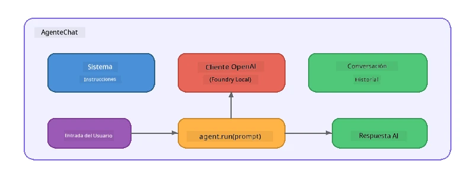

# Parte 5: Construyendo Agentes de IA con el Marco de Agentes

> **Objetivo:** Construir tu primer agente de IA con instrucciones persistentes y una persona definida, impulsado por un modelo local a través de Foundry Local.

## ¿Qué es un Agente de IA?

Un agente de IA envuelve un modelo de lenguaje con **instrucciones del sistema** que definen su comportamiento, personalidad y restricciones. A diferencia de una llamada única de chat de completado, un agente proporciona:

- **Persona** - una identidad consistente ("Eres un revisor de código útil")
- **Memoria** - historial de conversación a lo largo de turnos
- **Especialización** - comportamiento enfocado impulsado por instrucciones bien elaboradas



---

## El Marco de Agentes de Microsoft

El **Marco de Agentes de Microsoft** (AGF) proporciona una abstracción estándar de agente que funciona a través de diferentes backends de modelos. En este taller lo combinamos con Foundry Local para que todo funcione en tu máquina - sin necesidad de la nube.

| Concepto | Descripción |
|---------|-------------|
| `FoundryLocalClient` | Python: maneja el inicio del servicio, descarga/carga del modelo y crea agentes |
| `client.as_agent()` | Python: crea un agente desde el cliente Foundry Local |
| `AsAIAgent()` | C#: método de extensión en `ChatClient` - crea un `AIAgent` |
| `instructions` | Prompt del sistema que da forma al comportamiento del agente |
| `name` | Etiqueta legible para humanos, útil en escenarios de múltiples agentes |
| `agent.run(prompt)` / `RunAsync()` | Envía un mensaje de usuario y devuelve la respuesta del agente |

> **Nota:** El Marco de Agentes tiene un SDK para Python y .NET. Para JavaScript, implementamos una clase ligera `ChatAgent` que refleja el mismo patrón usando directamente el SDK de OpenAI.

---

## Ejercicios

### Ejercicio 1 - Entender el Patrón de Agente

Antes de escribir código, estudia los componentes clave de un agente:

1. **Cliente del modelo** - conecta con la API compatible con OpenAI de Foundry Local
2. **Instrucciones del sistema** - el prompt de "personalidad"
3. **Bucle de ejecución** - enviar entrada del usuario, recibir salida

> **Reflexiona:** ¿En qué se diferencian las instrucciones del sistema de un mensaje de usuario regular? ¿Qué sucede si las cambias?

---

### Ejercicio 2 - Ejecutar el Ejemplo de Agente Único

<details>
<summary><strong>🐍 Python</strong></summary>

**Requisitos previos:**
```bash
cd python
python -m venv venv

# Windows (PowerShell):
venv\Scripts\Activate.ps1
# macOS:
source venv/bin/activate

pip install -r requirements.txt
```

**Ejecutar:**
```bash
python foundry-local-with-agf.py
```

**Explicación del código** (`python/foundry-local-with-agf.py`):

```python
import asyncio
from agent_framework_foundry_local import FoundryLocalClient

async def main():
    alias = "phi-4-mini"

    # FoundryLocalClient maneja el inicio del servicio, la descarga del modelo y la carga
    client = FoundryLocalClient(model_id=alias)
    print(f"Client Model ID: {client.model_id}")

    # Crear un agente con instrucciones del sistema
    agent = client.as_agent(
        name="Joker",
        instructions="You are good at telling jokes.",
    )

    # No streaming: obtener la respuesta completa de una vez
    result = await agent.run("Tell me a joke about a pirate.")
    print(f"Agent: {result}")

    # Streaming: obtener resultados a medida que se generan
    async for chunk in agent.run("Tell me another joke.", stream=True):
        if chunk.text:
            print(chunk.text, end="", flush=True)

asyncio.run(main())
```

**Puntos clave:**
- `FoundryLocalClient(model_id=alias)` maneja el inicio del servicio, descarga y carga del modelo en un solo paso
- `client.as_agent()` crea un agente con instrucciones del sistema y un nombre
- `agent.run()` soporta modos sin streaming y con streaming
- Instalar con `pip install agent-framework-foundry-local --pre`

</details>

<details>
<summary><strong>📦 JavaScript</strong></summary>

**Requisitos previos:**
```bash
cd javascript
npm install
```

**Ejecutar:**
```bash
node foundry-local-with-agent.mjs
```

**Explicación del código** (`javascript/foundry-local-with-agent.mjs`):

```javascript
import { OpenAI } from "openai";
import { FoundryLocalManager } from "foundry-local-sdk";

class ChatAgent {
  constructor({ client, modelId, instructions, name }) {
    this.client = client;
    this.modelId = modelId;
    this.instructions = instructions;
    this.name = name;
    this.history = [];
  }

  async run(userMessage) {
    const messages = [
      { role: "system", content: this.instructions },
      ...this.history,
      { role: "user", content: userMessage },
    ];
    const response = await this.client.chat.completions.create({
      model: this.modelId,
      messages,
    });
    const assistantMessage = response.choices[0].message.content;

    // Mantener el historial de conversación para interacciones de múltiples turnos
    this.history.push({ role: "user", content: userMessage });
    this.history.push({ role: "assistant", content: assistantMessage });
    return { text: assistantMessage };
  }
}

async function main() {
  FoundryLocalManager.create({ appName: "FoundryLocalWorkshop" });
  const manager = FoundryLocalManager.instance;
  await manager.startWebService();

  const catalog = manager.catalog;
  const model = await catalog.getModel("phi-3.5-mini");
  if (!model.isCached) {
    console.log("Downloading model: phi-3.5-mini...");
    await model.download();
  }
  await model.load();

  const client = new OpenAI({
    baseURL: manager.urls[0] + "/v1",
    apiKey: "foundry-local",
  });

  const agent = new ChatAgent({
    client,
    modelId: model.id,
    instructions: "You are good at telling jokes.",
    name: "Joker",
  });

  const result = await agent.run("Tell me a joke about a pirate.");
  console.log(result.text);
}

main();
```

**Puntos clave:**
- JavaScript construye su propia clase `ChatAgent` reflejando el patrón AGF de Python
- `this.history` almacena los turnos de conversación para soporte multi-turno
- `startWebService()` explícito → chequeo de caché → `model.download()` → `model.load()` ofrece visibilidad completa

</details>

<details>
<summary><strong>💜 C#</strong></summary>

**Requisitos previos:**
```bash
cd csharp
dotnet restore
```

**Ejecutar:**
```bash
dotnet run agent
```

**Explicación del código** (`csharp/SingleAgent.cs`):

```csharp
using Microsoft.AI.Foundry.Local;
using Microsoft.Extensions.Logging.Abstractions;
using Microsoft.Agents.AI;
using OpenAI;
using System.ClientModel;

// 1. Start Foundry Local and load a model
var alias = "phi-3.5-mini";
await FoundryLocalManager.CreateAsync(
    new Configuration
    {
        AppName = "FoundryLocalSamples",
        Web = new Configuration.WebService { Urls = "http://127.0.0.1:0" }
    }, NullLogger.Instance, default);
var manager = FoundryLocalManager.Instance;
await manager.StartWebServiceAsync(default);

var catalog = await manager.GetCatalogAsync(default);
var model = await catalog.GetModelAsync(alias, default);

var isCached = await model.IsCachedAsync(default);
if (!isCached)
{
    Console.WriteLine($"Downloading model: {alias}...");
    await model.DownloadAsync(null, default);
}
await model.LoadAsync(default);

var key = new ApiKeyCredential("foundry-local");
var client = new OpenAIClient(key, new OpenAIClientOptions
{
    Endpoint = new Uri(manager.Urls[0] + "/v1")
});

// 2. Create an AIAgent using the Agent Framework extension method
AIAgent joker = client
    .GetChatClient(model.Id)
    .AsAIAgent(
        instructions: "You are good at telling jokes. Keep your jokes short and family-friendly.",
        name: "Joker"
    );

// 3. Run the agent (non-streaming)
var response = await joker.RunAsync("Tell me a joke about a pirate.");
Console.WriteLine($"Joker: {response}");

// 4. Run with streaming
await foreach (var update in joker.RunStreamingAsync("Tell me another joke."))
{
    Console.Write(update);
}
```

**Puntos clave:**
- `AsAIAgent()` es un método de extensión de `Microsoft.Agents.AI.OpenAI` - no se necesita clase personalizada `ChatAgent`
- `RunAsync()` devuelve la respuesta completa; `RunStreamingAsync()` hace streaming token por token
- Instalar con `dotnet add package Microsoft.Agents.AI.OpenAI --version 1.0.0-rc3`

</details>

---

### Ejercicio 3 - Cambiar la Persona

Modifica las `instructions` del agente para crear una persona diferente. Prueba cada una y observa cómo cambia la salida:

| Persona | Instrucciones |
|---------|-------------|
| Revisor de Código | `"Eres un experto revisor de código. Proporciona retroalimentación constructiva enfocada en legibilidad, rendimiento y corrección."` |
| Guía de Viajes | `"Eres un guía de viajes amigable. Da recomendaciones personalizadas para destinos, actividades y gastronomía local."` |
| Tutor Socrático | `"Eres un tutor socrático. Nunca das respuestas directas - en cambio, guías al estudiante con preguntas reflexivas."` |
| Escritor Técnico | `"Eres un escritor técnico. Explica conceptos clara y concisamente. Usa ejemplos. Evita la jerga."` |

**Pruébalo:**
1. Elige una persona de la tabla anterior
2. Reemplaza la cadena `instructions` en el código
3. Ajusta el prompt de usuario para que coincida (por ejemplo, pide al revisor que revise una función)
4. Ejecuta el ejemplo de nuevo y compara la salida

> **Consejo:** La calidad de un agente depende mucho de las instrucciones. Instrucciones específicas y bien estructuradas producen mejores resultados que las vagas.

---

### Ejercicio 4 - Añadir Conversación Multi-Turno

Extiende el ejemplo para soportar un bucle de chat multi-turno para que puedas tener una conversación de ida y vuelta con el agente.

<details>
<summary><strong>🐍 Python - bucle multi-turno</strong></summary>

```python
import asyncio
from agent_framework_foundry_local import FoundryLocalClient

async def main():
    client = FoundryLocalClient(model_id="phi-4-mini")

    agent = client.as_agent(
        name="Assistant",
        instructions="You are a helpful assistant.",
    )

    print("Chat with the agent (type 'quit' to exit):\n")
    while True:
        user_input = input("You: ")
        if user_input.strip().lower() in ("quit", "exit"):
            break
        result = await agent.run(user_input)
        print(f"Agent: {result}\n")

asyncio.run(main())
```

</details>

<details>
<summary><strong>📦 JavaScript - bucle multi-turno</strong></summary>

```javascript
import { OpenAI } from "openai";
import { FoundryLocalManager } from "foundry-local-sdk";
import * as readline from "node:readline/promises";

// (reutilizar la clase ChatAgent del Ejercicio 2)

async function main() {
  FoundryLocalManager.create({ appName: "FoundryLocalWorkshop" });
  const manager = FoundryLocalManager.instance;
  await manager.startWebService();

  const catalog = manager.catalog;
  const model = await catalog.getModel("phi-3.5-mini");
  if (!model.isCached) {
    console.log("Downloading model: phi-3.5-mini...");
    await model.download();
  }
  await model.load();

  const client = new OpenAI({
    baseURL: manager.urls[0] + "/v1",
    apiKey: "foundry-local",
  });

  const agent = new ChatAgent({
    client,
    modelId: model.id,
    instructions: "You are a helpful assistant.",
    name: "Assistant",
  });

  const rl = readline.createInterface({
    input: process.stdin,
    output: process.stdout,
  });

  console.log("Chat with the agent (type 'quit' to exit):\n");
  while (true) {
    const userInput = await rl.question("You: ");
    if (["quit", "exit"].includes(userInput.trim().toLowerCase())) break;
    const result = await agent.run(userInput);
    console.log(`Agent: ${result.text}\n`);
  }
  rl.close();
}

main();
```

</details>

<details>
<summary><strong>💜 C# - bucle multi-turno</strong></summary>

```csharp
using Microsoft.AI.Foundry.Local;
using Microsoft.Extensions.Logging.Abstractions;
using Microsoft.Agents.AI;
using OpenAI;
using System.ClientModel;

var alias = "phi-3.5-mini";
var config = new Configuration
{
    AppName = "FoundryLocalSamples",
    Web = new Configuration.WebService { Urls = "http://127.0.0.1:0" }
};
await FoundryLocalManager.CreateAsync(config, NullLogger.Instance, default);
var manager = FoundryLocalManager.Instance;
await manager.StartWebServiceAsync(default);

var catalog = await manager.GetCatalogAsync(default);
var model = await catalog.GetModelAsync(alias, default);

var isCached = await model.IsCachedAsync(default);
if (!isCached)
{
    Console.WriteLine($"Downloading model: {alias}...");
    await model.DownloadAsync(null, default);
}
await model.LoadAsync(default);

var key = new ApiKeyCredential("foundry-local");
var client = new OpenAIClient(key, new OpenAIClientOptions
{
    Endpoint = new Uri(manager.Urls[0] + "/v1")
});

AIAgent agent = client
    .GetChatClient(model.Id)
    .AsAIAgent(
        instructions: "You are a helpful assistant.",
        name: "Assistant"
    );

Console.WriteLine("Chat with the agent (type 'quit' to exit):\n");
while (true)
{
    Console.Write("You: ");
    var userInput = Console.ReadLine();
    if (string.IsNullOrWhiteSpace(userInput) ||
        userInput.Equals("quit", StringComparison.OrdinalIgnoreCase) ||
        userInput.Equals("exit", StringComparison.OrdinalIgnoreCase))
        break;

    var result = await agent.RunAsync(userInput);
    Console.WriteLine($"Agent: {result}\n");
}
```

</details>

Observa cómo el agente recuerda los turnos previos - haz una pregunta de seguimiento y verás cómo se mantiene el contexto.

---

### Ejercicio 5 - Salida Estructurada

Instruye al agente para que siempre responda en un formato específico (por ejemplo, JSON) y analiza el resultado:

<details>
<summary><strong>🐍 Python - salida JSON</strong></summary>

```python
import asyncio
import json
from agent_framework_foundry_local import FoundryLocalClient

async def main():
    client = FoundryLocalClient(model_id="phi-4-mini")

    agent = client.as_agent(
        name="SentimentAnalyzer",
        instructions=(
            "You are a sentiment analysis agent. "
            "For every user message, respond ONLY with valid JSON in this format: "
            '{"sentiment": "positive|negative|neutral", "confidence": 0.0-1.0, "summary": "brief reason"}'
        ),
    )

    result = await agent.run("I absolutely loved the new restaurant downtown!")
    print("Raw:", result)

    try:
        parsed = json.loads(str(result))
        print(f"Sentiment: {parsed['sentiment']} (confidence: {parsed['confidence']})")
    except json.JSONDecodeError:
        print("Agent did not return valid JSON - try refining the instructions.")

asyncio.run(main())
```

</details>

<details>
<summary><strong>💜 C# - salida JSON</strong></summary>

```csharp
using System.Text.Json;

AIAgent analyzer = chatClient.AsAIAgent(
    name: "SentimentAnalyzer",
    instructions:
        "You are a sentiment analysis agent. " +
        "For every user message, respond ONLY with valid JSON in this format: " +
        "{\"sentiment\": \"positive|negative|neutral\", \"confidence\": 0.0-1.0, \"summary\": \"brief reason\"}"
);

var response = await analyzer.RunAsync("I absolutely loved the new restaurant downtown!");
Console.WriteLine($"Raw: {response}");

try
{
    var parsed = JsonSerializer.Deserialize<JsonElement>(response.ToString());
    Console.WriteLine($"Sentiment: {parsed.GetProperty("sentiment")} " +
                      $"(confidence: {parsed.GetProperty("confidence")})");
}
catch (JsonException)
{
    Console.WriteLine("Agent did not return valid JSON - try refining the instructions.");
}
```

</details>

> **Nota:** Los modelos locales pequeños pueden no producir siempre JSON perfectamente válido. Puedes mejorar la fiabilidad incluyendo un ejemplo en las instrucciones y siendo muy explícito sobre el formato esperado.

---

## Puntos Clave

| Concepto | Lo que Aprendiste |
|---------|-----------------|
| Agente vs llamada LLM pura | Un agente envuelve un modelo con instrucciones y memoria |
| Instrucciones del sistema | La palanca más importante para controlar el comportamiento del agente |
| Conversación multi-turno | Los agentes pueden mantener contexto a través de múltiples interacciones |
| Salida estructurada | Las instrucciones pueden imponer formato de salida (JSON, markdown, etc.) |
| Ejecución local | Todo funciona en el dispositivo vía Foundry Local - sin nube necesaria |

---

## Próximos Pasos

En **[Parte 6: Flujos de Trabajo Multi-Agente](part6-multi-agent-workflows.md)**, combinarás múltiples agentes en una pipeline coordinada donde cada agente tendrá un rol especializado.