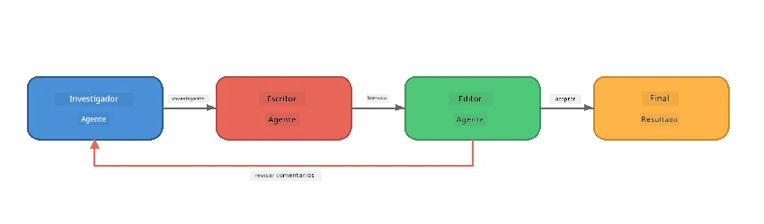
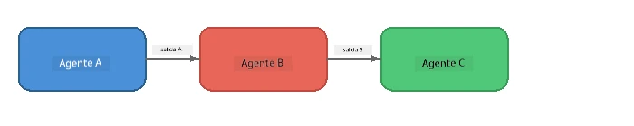
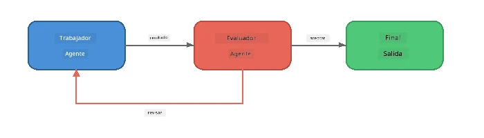
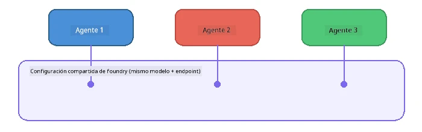

# Parte 6: Flujos de trabajo multiagente

> **Objetivo:** Combinar múltiples agentes especializados en tuberías coordinadas que dividen tareas complejas entre agentes colaboradores, todo ejecutándose localmente con Foundry Local.

## ¿Por qué Multiagente?

Un solo agente puede manejar muchas tareas, pero los flujos de trabajo complejos se benefician de la **especialización**. En lugar de que un solo agente intente investigar, escribir y editar simultáneamente, se divide el trabajo en roles enfocados:



| Patrón | Descripción |
|---------|-------------|
| **Secuencial** | La salida del Agente A alimenta al Agente B → Agente C |
| **Bucle de retroalimentación** | Un agente evaluador puede enviar el trabajo para revisión |
| **Contexto compartido** | Todos los agentes usan el mismo modelo/punto final, pero con diferentes instrucciones |
| **Salida tipada** | Los agentes producen resultados estructurados (JSON) para entregas confiables |

---

## Ejercicios

### Ejercicio 1 - Ejecutar la tubería multiagente

El taller incluye un flujo completo Investigador → Escritor → Editor.

<details>
<summary><strong>🐍 Python</strong></summary>

**Configuración:**
```bash
cd python
python -m venv venv

# Windows (PowerShell):
venv\Scripts\Activate.ps1
# macOS:
source venv/bin/activate

pip install -r requirements.txt
```

**Ejecutar:**
```bash
python foundry-local-multi-agent.py
```

**Qué sucede:**
1. **Investigador** recibe un tema y devuelve hechos en viñetas
2. **Escritor** toma la investigación y redacta una entrada de blog (3-4 párrafos)
3. **Editor** revisa el artículo para calidad y devuelve ACEPTAR o REVISAR

</details>

<details>
<summary><strong>📦 JavaScript</strong></summary>

**Configuración:**
```bash
cd javascript
npm install
```

**Ejecutar:**
```bash
node foundry-local-multi-agent.mjs
```

**La misma tubería de tres etapas** - Investigador → Escritor → Editor.

</details>

<details>
<summary><strong>💜 C#</strong></summary>

**Configuración:**
```bash
cd csharp
dotnet restore
```

**Ejecutar:**
```bash
dotnet run multi
```

**La misma tubería de tres etapas** - Investigador → Escritor → Editor.

</details>

---

### Ejercicio 2 - Anatomía de la tubería

Estudia cómo se definen y conectan los agentes:

**1. Cliente de modelo compartido**

Todos los agentes comparten el mismo modelo Foundry Local:

```python
# Python - FoundryLocalClient maneja todo
from agent_framework_foundry_local import FoundryLocalClient

client = FoundryLocalClient(model_id="phi-3.5-mini")
```

```javascript
// JavaScript - SDK de OpenAI apuntando a Foundry Local
const client = new OpenAI({
  baseURL: manager.urls[0] + "/v1",
  apiKey: "foundry-local",
});
```

```csharp
// C# - OpenAIClient pointed at Foundry Local
var key = new ApiKeyCredential("foundry-local");
var client = new OpenAIClient(key, new OpenAIClientOptions
{
    Endpoint = new Uri(manager.Urls[0] + "/v1")
});
var chatClient = client.GetChatClient(model.Id);
```

**2. instrucciones especializadas**

Cada agente tiene una persona distinta:

| Agente | Instrucciones (resumen) |
|-------|----------------------|
| Investigador | "Proporciona hechos clave, estadísticas y antecedentes. Organiza como viñetas." |
| Escritor | "Escribe una entrada de blog atractiva (3-4 párrafos) basada en las notas de investigación. No inventes hechos." |
| Editor | "Revisa claridad, gramática y consistencia factual. Veredicto: ACEPTAR o REVISAR." |

**3. Flujos de datos entre agentes**

```python
# Paso 1 - la salida del investigador se convierte en entrada para el escritor
research_result = await researcher.run(f"Research: {topic}")

# Paso 2 - la salida del escritor se convierte en entrada para el editor
writer_result = await writer.run(f"Write using:\n{research_result}")

# Paso 3 - el editor revisa tanto la investigación como el artículo
editor_result = await editor.run(
    f"Research:\n{research_result}\n\nArticle:\n{writer_result}"
)
```

```csharp
// C# - same pattern, async calls with AIAgent
var researchNotes = await researcher.RunAsync(
    $"Research the following topic and provide key facts:\n{topic}");

var draft = await writer.RunAsync(
    $"Write a blog post based on these research notes:\n\n{researchNotes}");

var verdict = await editor.RunAsync(
    $"Review this article for quality and accuracy.\n\n" +
    $"Research notes:\n{researchNotes}\n\n" +
    $"Article:\n{draft}");
```

> **Idea clave:** Cada agente recibe el contexto acumulado de los agentes previos. El editor ve tanto la investigación original como el borrador, lo que le permite verificar la consistencia factual.

---

### Ejercicio 3 - Añadir un cuarto agente

Extiende la tubería añadiendo un nuevo agente. Elige uno:

| Agente | Propósito | Instrucciones |
|-------|---------|-------------|
| **Verificador de hechos** | Verificar afirmaciones en el artículo | `"Verificas las afirmaciones factuales. Para cada afirmación, indica si está soportada por las notas de investigación. Devuelve JSON con elementos verificados/no verificados."` |
| **Creador de titulares** | Crear títulos llamativos | `"Genera 5 opciones de titulares para el artículo. Varía el estilo: informativo, clickbait, pregunta, lista, emocional."` |
| **Redes sociales** | Crear publicaciones promocionales | `"Crea 3 publicaciones para redes sociales promocionando este artículo: una para Twitter (280 caracteres), una para LinkedIn (tono profesional), una para Instagram (casual con sugerencias de emojis)."` |

<details>
<summary><strong>🐍 Python - añadiendo un Creador de titulares</strong></summary>

```python
headline_agent = client.as_agent(
    name="HeadlineWriter",
    instructions=(
        "You are a headline specialist. Given an article, generate exactly "
        "5 headline options. Vary the style: informative, question-based, "
        "listicle, emotional, and provocative. Return them as a numbered list."
    ),
)

# Después de que el editor acepte, generar titulares
headline_result = await headline_agent.run(
    f"Generate headlines for this article:\n\n{writer_result}"
)
print(f"\n--- Headlines ---\n{headline_result}")
```

</details>

<details>
<summary><strong>📦 JavaScript - añadiendo un Creador de titulares</strong></summary>

```javascript
const headlineAgent = new ChatAgent({
  client,
  modelId: modelInfo.id,
  instructions:
    "You are a headline specialist. Given an article, generate exactly " +
    "5 headline options. Vary the style: informative, question-based, " +
    "listicle, emotional, and provocative. Return them as a numbered list.",
  name: "HeadlineWriter",
});

const headlineResult = await headlineAgent.run(
  `Generate headlines for this article:\n\n${writerResult.text}`
);
console.log(`\n--- Headlines ---\n${headlineResult.text}`);
```

</details>

<details>
<summary><strong>💜 C# - añadiendo un Creador de titulares</strong></summary>

```csharp
AIAgent headlineAgent = chatClient.AsAIAgent(
    name: "HeadlineWriter",
    instructions:
        "You are a headline specialist. Given an article, generate exactly " +
        "5 headline options. Vary the style: informative, question-based, " +
        "listicle, emotional, and provocative. Return them as a numbered list."
);

// After the editor accepts, generate headlines
var headlines = await headlineAgent.RunAsync(
    $"Generate headlines for this article:\n\n{draft}");
Console.WriteLine($"\n--- Headlines ---\n{headlines}");
```

</details>

---

### Ejercicio 4 - Diseña tu propio flujo de trabajo

Diseña una tubería multiagente para un dominio diferente. Aquí algunas ideas:

| Dominio | Agentes | Flujo |
|--------|--------|------|
| **Revisión de código** | Analizador → Revisor → Resumen | Analizar la estructura del código → revisar errores → producir informe resumen |
| **Atención al cliente** | Clasificador → Respondedor → Control de calidad | Clasificar ticket → redactar respuesta → verificar calidad |
| **Educación** | Creador de cuestionarios → Simulador de estudiante → Calificador | Generar cuestionario → simular respuestas → calificar y explicar |
| **Análisis de datos** | Intérprete → Analista → Reportero | Interpretar solicitud de datos → analizar patrones → redactar informe |

**Pasos:**
1. Define 3+ agentes con `instrucciones` distintas
2. Decide el flujo de datos: ¿qué recibe y produce cada agente?
3. Implementa la tubería usando los patrones de los Ejercicios 1-3
4. Añade un bucle de retroalimentación si un agente debe evaluar el trabajo de otro

---

## Patrones de orquestación

Aquí los patrones de orquestación que se aplican a cualquier sistema multiagente (explorados en profundidad en [Parte 7](part7-zava-creative-writer.md)):

### Tubería secuencial



Cada agente procesa la salida del anterior. Simple y predecible.

### Bucle de retroalimentación



Un agente evaluador puede desencadenar la reejecución de etapas anteriores. El escritor Zava usa esto: el editor puede enviar retroalimentación al investigador y al escritor.

### Contexto compartido



Todos los agentes comparten un único `foundry_config` para usar el mismo modelo y punto final.

---

## Puntos clave

| Concepto | Lo que aprendiste |
|---------|-----------------|
| Especialización de agentes | Cada agente hace bien una tarea con instrucciones enfocadas |
| Entrega de datos | La salida de un agente es la entrada del siguiente |
| Bucles de retroalimentación | Un evaluador puede solicitar reintentos para mejorar calidad |
| Salida estructurada | Respuestas en JSON permiten comunicación confiable entre agentes |
| Orquestación | Un coordinador maneja la secuencia y manejo de errores |
| Patrones de producción | Aplicados en [Parte 7: Zava Creative Writer](part7-zava-creative-writer.md) |

---

## Próximos pasos

Continúa a [Parte 7: Zava Creative Writer - Aplicación final](part7-zava-creative-writer.md) para explorar una aplicación multiagente de estilo producción con 4 agentes especializados, salida en streaming, búsqueda de productos y bucles de retroalimentación, disponible en Python, JavaScript y C#.