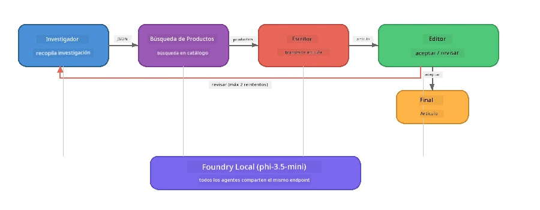

# Parte 7: Zava Creative Writer - Aplicación final

> **Objetivo:** Explorar una aplicación multiagente al estilo de producción donde cuatro agentes especializados colaboran para producir artículos de calidad para revistas para Zava Retail DIY, ejecutándose completamente en tu dispositivo con Foundry Local.

Este es el **laboratorio final** del taller. Reúne todo lo que has aprendido: integración del SDK (Parte 3), recuperación de datos locales (Parte 4), personajes de agentes (Parte 5) y orquestación multiagente (Parte 6), en una aplicación completa disponible en **Python**, **JavaScript** y **C#**.

---

## Qué explorarás

| Concepto | Dónde en Zava Writer |
|---------|----------------------|
| Carga del modelo en 4 pasos | El módulo de configuración compartida inicia Foundry Local |
| Recuperación estilo RAG | Agente de producto busca en un catálogo local |
| Especialización de agentes | 4 agentes con instrucciones de sistema distintas |
| Salida en streaming | El escritor genera tokens en tiempo real |
| Transferencias estructuradas | Investigador → JSON, Editor → decisión JSON |
| Bucles de retroalimentación | El editor puede activar reejecución (máx. 2 intentos) |

---

## Arquitectura

Zava Creative Writer utiliza una **cadena secuencial con retroalimentación impulsada por evaluador**. Las tres implementaciones de lenguaje siguen la misma arquitectura:



### Los Cuatro Agentes

| Agente | Entrada | Salida | Propósito |
|--------|---------|--------|-----------|
| **Investigador** | Tema + retroalimentación opcional | `{"web": [{url, name, description}, ...]}` | Recopila investigación de fondo vía LLM |
| **Búsqueda de Producto** | Cadena de contexto del producto | Lista de productos coincidentes | Consultas generadas por LLM + búsqueda por palabras clave en catálogo local |
| **Escritor** | Investigación + productos + tarea + retroalimentación | Texto de artículo transmitido (separado por `---`) | Redacta un artículo de calidad para revista en tiempo real |
| **Editor** | Artículo + autoevaluación del escritor | `{"decision": "accept/revise", "editorFeedback": "...", "researchFeedback": "..."}` | Revisa calidad, puede solicitar reintentos |

### Flujo de la cadena

1. **Investigador** recibe el tema y produce notas de investigación estructuradas (JSON)
2. **Búsqueda de Producto** consulta el catálogo local usando términos generados por LLM
3. **Escritor** combina investigación + productos + tarea en un artículo en streaming, agregando autoevaluación tras un separador `---`
4. **Editor** revisa el artículo y devuelve un veredicto JSON:
   - `"accept"` → la cadena termina
   - `"revise"` → la retroalimentación se envía de vuelta al Investigador y Escritor (máx. 2 reintentos)

---

## Requisitos previos

- Completar [Parte 6: Flujos de trabajo multiagente](part6-multi-agent-workflows.md)
- Tener instalado Foundry Local CLI y el modelo `phi-3.5-mini` descargado

---

## Ejercicios

### Ejercicio 1 - Ejecutar Zava Creative Writer

Elige tu lenguaje y ejecuta la aplicación:

<details>
<summary><strong>🐍 Python - Servicio web FastAPI</strong></summary>

La versión Python corre como un **servicio web** con API REST, demostrando cómo construir un backend de producción.

**Configuración:**
```bash
cd zava-creative-writer-local/src/api
python -m venv venv

# Windows (PowerShell):
venv\Scripts\Activate.ps1
# macOS:
source venv/bin/activate

pip install -r requirements.txt
```

**Ejecutar:**
```bash
uvicorn main:app --reload
```

**Probar:**
```bash
curl -X POST http://localhost:8000/api/article \
  -H "Content-Type: application/json" \
  -d '{
    "research": "DIY home improvement trends",
    "products": "power tools and paints",
    "assignment": "Write an article about weekend renovation projects for DIY enthusiasts"
  }'
```

La respuesta se transmite como mensajes JSON delimitados por nueva línea mostrando el progreso de cada agente.

</details>

<details>
<summary><strong>📦 JavaScript - CLI de Node.js</strong></summary>

La versión JavaScript corre como una **aplicación CLI**, imprimiendo el progreso de los agentes y el artículo directamente en la consola.

**Configuración:**
```bash
cd zava-creative-writer-local/src/javascript
npm install
```

**Ejecutar:**
```bash
node main.mjs
```

Verás:
1. Carga del modelo Foundry Local (barra de progreso si descarga)
2. Cada agente ejecutándose en secuencia con mensajes de estado
3. Artículo transmitido a la consola en tiempo real
4. Decisión de aceptación/revisión del editor

</details>

<details>
<summary><strong>💜 C# - Aplicación consola .NET</strong></summary>

La versión C# corre como una **aplicación consola .NET** con el mismo pipeline y salida en streaming.

**Configuración:**
```bash
cd zava-creative-writer-local/src/csharp
dotnet restore
```

**Ejecutar:**
```bash
dotnet run
```

Mismo patrón de salida que en JavaScript: mensajes de estado, artículo en streaming y veredicto del editor.

</details>

---

### Ejercicio 2 - Estudiar la estructura del código

Cada implementación del lenguaje tiene los mismos componentes lógicos. Compara las estructuras:

**Python** (`src/api/`):
| Archivo | Propósito |
|---------|-----------|
| `foundry_config.py` | Gestor compartido Foundry Local, modelo y cliente (inicialización en 4 pasos) |
| `orchestrator.py` | Coordinación del pipeline con bucle de retroalimentación |
| `main.py` | Endpoints FastAPI (`POST /api/article`) |
| `agents/researcher/researcher.py` | Investigación basada en LLM con salida JSON |
| `agents/product/product.py` | Consultas generadas por LLM + búsqueda por palabras clave |
| `agents/writer/writer.py` | Generación de artículo en streaming |
| `agents/editor/editor.py` | Decisión de aceptación/revisión en JSON |

**JavaScript** (`src/javascript/`):
| Archivo | Propósito |
|---------|-----------|
| `foundryConfig.mjs` | Configuración compartida Foundry Local (inicialización en 4 pasos con barra de progreso) |
| `main.mjs` | Orquestador + punto de entrada CLI |
| `researcher.mjs` | Agente investigador basado en LLM |
| `product.mjs` | Generación de consultas LLM + búsqueda por palabras clave |
| `writer.mjs` | Generación de artículo en streaming (generador asíncrono) |
| `editor.mjs` | Decisión de aceptación/revisión JSON |
| `products.mjs` | Datos del catálogo de productos |

**C#** (`src/csharp/`):
| Archivo | Propósito |
|---------|-----------|
| `Program.cs` | Pipeline completo: carga de modelo, agentes, orquestador, bucle de retroalimentación |
| `ZavaCreativeWriter.csproj` | Proyecto .NET 9 con Foundry Local + paquetes OpenAI |

> **Nota de diseño:** Python separa cada agente en su propio archivo/directorio (bueno para equipos grandes). JavaScript usa un módulo por agente (bueno para proyectos medianos). C# mantiene todo en un archivo con funciones locales (bueno para ejemplos autocontenidos). En producción, elige el patrón que se ajuste a las convenciones de tu equipo.

---

### Ejercicio 3 - Rastrear la configuración compartida

Cada agente en la cadena comparte un solo cliente de modelo Foundry Local. Estudia cómo se configura en cada lenguaje:

<details>
<summary><strong>🐍 Python - foundry_config.py</strong></summary>

```python
from foundry_local import FoundryLocalManager

MODEL_ALIAS = "phi-3.5-mini"

# Paso 1: Crear el administrador e iniciar el servicio Foundry Local
manager = FoundryLocalManager()
manager.start_service()

# Paso 2: Verificar si el modelo ya está descargado
cached = manager.list_cached_models()
catalog_info = manager.get_model_info(MODEL_ALIAS)
is_cached = any(m.id == catalog_info.id for m in cached) if catalog_info else False

if not is_cached:
    manager.download_model(MODEL_ALIAS)

# Paso 3: Cargar el modelo en la memoria
manager.load_model(MODEL_ALIAS)
model_id = manager.get_model_info(MODEL_ALIAS).id

# Cliente OpenAI compartido
client = openai.OpenAI(base_url=manager.endpoint, api_key=manager.api_key)
```

Todos los agentes importan `from foundry_config import client, model_id`.

</details>

<details>
<summary><strong>📦 JavaScript - foundryConfig.mjs</strong></summary>

```javascript
import { FoundryLocalManager } from "foundry-local-sdk";
import { OpenAI } from "openai";

FoundryLocalManager.create({ appName: "ZavaCreativeWriter" });
const manager = FoundryLocalManager.instance;
await manager.startWebService();

// Comprobar caché → descargar → cargar (nuevo patrón SDK)
const catalog = manager.catalog;
const model = await catalog.getModel(MODEL_ALIAS);
if (!model.isCached) {
  console.log(`Downloading model: ${MODEL_ALIAS}...`);
  await model.download();
}
await model.load();

const client = new OpenAI({ baseURL: manager.urls[0] + "/v1", apiKey: "foundry-local" });
const modelId = model.id;
export { client, modelId };
```

Todos los agentes importan `{ client, modelId } from "./foundryConfig.mjs"`.

</details>

<details>
<summary><strong>💜 C# - parte superior de Program.cs</strong></summary>

```csharp
await FoundryLocalManager.CreateAsync(
    new Configuration
    {
        AppName = "ZavaCreativeWriter",
        Web = new Configuration.WebService { Urls = "http://127.0.0.1:0" }
    }, NullLogger.Instance, default);
var manager = FoundryLocalManager.Instance;
await manager.StartWebServiceAsync(default);

var catalog = await manager.GetCatalogAsync(default);
var catalogModel = await catalog.GetModelAsync(alias, default);
var isCached = await catalogModel.IsCachedAsync(default);
if (!isCached)
    await catalogModel.DownloadAsync(null, default);

await catalogModel.LoadAsync(default);
var key = new ApiKeyCredential("foundry-local");
var chatClient = new OpenAIClient(key, new OpenAIClientOptions
{
    Endpoint = new Uri(manager.Urls[0] + "/v1")
}).GetChatClient(catalogModel.Id);
```

El `chatClient` luego se pasa a todas las funciones de agente en el mismo archivo.

</details>

> **Patrón clave:** El patrón de carga del modelo (iniciar servicio → comprobar caché → descargar → cargar) asegura que el usuario vea un progreso claro y que el modelo solo se descargue una vez. Es una buena práctica para cualquier aplicación Foundry Local.

---

### Ejercicio 4 - Entender el bucle de retroalimentación

El bucle de retroalimentación es lo que hace que esta cadena sea "inteligente": el Editor puede enviar el trabajo para revisión. Rastrea la lógica:

```
Orchestrator:
  1. researcher.research(topic, "No Feedback")    ← first pass
  2. product.findProducts(productContext)
  3. writer.write(research, products, assignment)  ← streams article
  4. Split article at "---" → article + writerFeedback
  5. editor.edit(article, writerFeedback)

  WHILE editor says "revise" AND retryCount < 2:
    6. researcher.research(topic, editor.researchFeedback)  ← refined
    7. writer.write(research, products, editor.editorFeedback)
    8. editor.edit(newArticle, newWriterFeedback)
    9. retryCount++
```

**Preguntas a considerar:**
- ¿Por qué el límite de reintentos está en 2? ¿Qué sucede si lo aumentas?
- ¿Por qué el investigador recibe `researchFeedback` pero el escritor recibe `editorFeedback`?
- ¿Qué pasaría si el editor siempre dice "revisar"?

---

### Ejercicio 5 - Modificar un agente

Prueba cambiando el comportamiento de un agente y observa cómo afecta la cadena:

| Modificación | Qué cambiar |
|--------------|-------------|
| **Editor más estricto** | Cambiar la instrucción de sistema del editor para que siempre solicite al menos una revisión |
| **Artículos más largos** | Cambiar la instrucción del escritor de "800-1000 palabras" a "1500-2000 palabras" |
| **Productos diferentes** | Agregar o modificar productos en el catálogo |
| **Nuevo tema de investigación** | Cambiar el `researchContext` predeterminado a otro tema |
| **Investigador solo JSON** | Hacer que el investigador devuelva 10 ítems en lugar de 3-5 |

> **Consejo:** Como las tres implementaciones usan la misma arquitectura, puedes hacer la misma modificación en el lenguaje que te sea más cómodo.

---

### Ejercicio 6 - Añadir un quinto agente

Extiende la cadena con un nuevo agente. Algunas ideas:

| Agente | Lugar en la cadena | Propósito |
|--------|--------------------|-----------|
| **Verificador de hechos** | Después del escritor, antes del editor | Verificar afirmaciones con los datos de investigación |
| **Optimizador SEO** | Después de la aceptación del editor | Añadir descripción meta, palabras clave, slug |
| **Ilustrador** | Después de la aceptación del editor | Generar descripciones para imágenes del artículo |
| **Traductor** | Después de la aceptación del editor | Traducir el artículo a otro idioma |

**Pasos:**
1. Escribir la instrucción del agente
2. Crear la función del agente (siguiendo el patrón existente en tu lenguaje)
3. Insertarlo en el orquestador en el punto apropiado
4. Actualizar la salida/log para mostrar la contribución del nuevo agente

---

## Cómo trabajan juntos Foundry Local y el Framework de Agentes

Esta aplicación demuestra el patrón recomendado para construir sistemas multiagente con Foundry Local:

| Capa | Componente | Rol |
|-------|------------|-----|
| **Tiempo de ejecución** | Foundry Local | Descarga, administra y sirve el modelo localmente |
| **Cliente** | SDK de OpenAI | Envía completados de chat al endpoint local |
| **Agente** | Instrucción de sistema + llamada de chat | comportamiento especializado mediante instrucciones enfocadas |
| **Orquestador** | Coordinador del pipeline | Gestiona el flujo de datos, secuencias y bucles de retroalimentación |
| **Framework** | Microsoft Agent Framework | Provee la abstracción y patrones `ChatAgent` |

La clave: **Foundry Local reemplaza el backend en la nube, no la arquitectura de la aplicación.** Los mismos patrones de agente, estrategias de orquestación y transferencias estructuradas que funcionan con modelos alojados en la nube funcionan idénticamente con modelos locales: solo apuntas el cliente al endpoint local en vez de un endpoint Azure.

---

## Conclusiones clave

| Concepto | Lo que aprendiste |
|----------|-------------------|
| Arquitectura productiva | Cómo estructurar una app multiagente con configuración compartida y agentes separados |
| Carga del modelo en 4 pasos | Buenas prácticas para iniciar Foundry Local con progreso visible para el usuario |
| Especialización de agentes | Cada uno de los 4 agentes tiene instrucciones enfocadas y formato de salida específico |
| Generación en streaming | El escritor genera tokens en tiempo real, permitiendo interfaces reactivas |
| Bucles de retroalimentación | Reintentos guiados por el editor mejoran la calidad sin intervención humana |
| Patrones multilenguaje | La misma arquitectura funciona en Python, JavaScript y C# |
| Local = listo para producción | Foundry Local sirve la misma API compatible con OpenAI usada en despliegues en la nube |

---

## Próximo paso

Continúa a [Parte 8: Desarrollo guiado por evaluación](part8-evaluation-led-development.md) para crear un marco de evaluación sistemático para tus agentes, usando datasets dorados, verificaciones basadas en reglas y evaluación con LLM como juez.