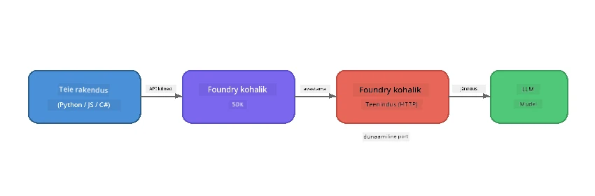

# Osa 1: Tutvumine Foundry Localiga


## Mis on Foundry Local?

[Foundry Local](https://foundrylocal.ai) võimaldab sul käitada avatud lähtekoodiga tehisintellekti keelemudeleid **otse oma arvutis** – internetiühendust ei ole vaja, pilvekulud puuduvad ning andmete privaatsus on täielik. See:

- **Laeb alla ja käitab mudeleid lokaalselt** automaatse riistvara optimeerimisega (GPU, CPU või NPU)
- **Pakkuv OpenAI-ga ühilduvat API-d**, nii et saad kasutada tuttavaid SDKsid ja tööriistu
- **Ei vaja Azure tellimust** ega registreerumist – lihtsalt paigalda ja hakka ehitama

Mõtle sellele nagu oma isiklikule tehisintellektile, mis töötab täielikult sinu masinas.

## Õpieesmärgid

Selle labori lõpuks:

- Paigaldad Foundry Local CLI oma operatsioonisüsteemi
- Mõistad, mis on mudeli aliasid ja kuidas need toimivad
- Laed alla ja käivitad oma esimese kohalikus arvutis oleva tehisintellekti mudeli
- Saadad käsurealt sõnumi kohaliku mudeliga vestlemiseks
- Mõistad erinevust kohaliku ja pilves majutatava tehisintellekti mudelite vahel

---

## Eeldused

### Süsteeminõuded

| Nõue | Miinimum | Soovituslik |
|-------------|---------|-------------|
| **RAM** | 8 GB | 16 GB |
| **Kettaruum** | 5 GB (mudelite jaoks) | 10 GB |
| **CPU** | 4 tuuma | 8+ tuuma |
| **GPU** | Valikuline | NVIDIA CUDA 11.8+ toega |
| **OS** | Windows 10/11 (x64/ARM), Windows Server 2025, macOS 13+ | - |

> **Märkus:** Foundry Local valib automaatselt parima mudelivariandi sinu riistvara põhjal. Kui sul on NVIDIA GPU, kasutatakse CUDA kiirendust. Kui sul on Qualcomm NPU, kasutatakse seda. Vastasel juhul valitakse optimeeritud CPU variant.

### Paigalda Foundry Local CLI

**Windows** (PowerShell):  
```powershell
winget install Microsoft.FoundryLocal
```
  
**macOS** (Homebrew):  
```bash
brew tap microsoft/foundrylocal
brew install foundrylocal
```
  
> **Märkus:** Praegu toetab Foundry Local ainult Windowsi ja macOSi. Linuxit hetkel ei toetata.

Kontrolli paigaldust:  
```bash
foundry --version
```
  
---

## Labori ülesanded

### Ülesanne 1: Uuri saadaolevaid mudeleid

Foundry Local sisaldab kataloogi eeloptimeeritud avatud lähtekoodiga mudelitest. Pane need nimekirja:  

```bash
foundry model list
```
  
Näed mudeleid nagu:  
- `phi-3.5-mini` - Microsofti 3,8 miljardi parameetriga mudel (kiire, hea kvaliteediga)  
- `phi-4-mini` - Uuem, võimekam Phi mudel  
- `phi-4-mini-reasoning` - Phi mudel mõttekäigu järeldustega (`<think>` märgendid)  
- `phi-4` - Microsofti suurim Phi mudel (10,4 GB)  
- `qwen2.5-0.5b` - Väga väike ja kiire (sobib väheste ressurssidega seadmetele)  
- `qwen2.5-7b` - Tugev üldotstarbeline mudel tööriistade kutsumise toega  
- `qwen2.5-coder-7b` - Optimeeritud koodi genereerimiseks  
- `deepseek-r1-7b` - Tugev järeldusmudel  
- `gpt-oss-20b` - Suur avatud lähtekoodiga mudel (MIT litsents, 12,5 GB)  
- `whisper-base` - Kõnest tekstiks transkriptsioon (383 MB)  
- `whisper-large-v3-turbo` - Kõrge täpsusega transkriptsioon (9 GB)

> **Mis on mudeli alias?** Aliasid nagu `phi-3.5-mini` on otseteed. Kui kasutad aliasi, laeb Foundry Local automaatselt alla parima variandi sinu riistvarale (CUDA NVIDIA GPU-de jaoks, muidu CPU-optimeeritud). Sa ei pea kunagi muretsema õige variandi valimise pärast.

### Ülesanne 2: Käivita oma esimene mudel

Lae mudel alla ja alusta vestlust interaktiivselt:  

```bash
foundry model run phi-3.5-mini
```
  
Esimene kord, kui seda jooksutad, teeb Foundry Local järgmist:  
1. Tuvastab sinu riistvara  
2. Laeb alla optimaalse mudelivariandi (see võib võtta paar minutit)  
3. Laeb mudeli mällu  
4. Käivitab interaktiivse vestlus sessiooni  

Proovi talle mõnda küsimust esitada:  
```
You: What is the golden ratio?
You: Can you explain it as if I were 10 years old?
You: Write a haiku about mathematics
```
  
Kirjuta `exit` või vajuta `Ctrl+C`, et lõpetada.

### Ülesanne 3: Eellaadi mudel

Kui soovid mudelit alla laadida ilma vestlust alustamata:

```bash
foundry model download phi-3.5-mini
```
  
Vaata, millised mudelid on juba sinu masinas allalaaditud:  

```bash
foundry cache list
```
  
### Ülesanne 4: Mõista arhitektuuri

Foundry Local töötab kui **kohalik HTTP teenus**, mis pakub OpenAI-ga ühilduvat REST API-d. See tähendab:  

1. Teenus käivitub **dünaamilisel pordil** (iga kord erineval pordil)  
2. Kasutad SDK-d, et leida tegelik lõpp-punkti URL  
3. Võid kasutada **iga** OpenAI-ga ühilduvat klienditeeki suhtlemiseks  

  

> **Tähelepanu:** Foundry Local määrab iga käivitusega **dünaamilise pordi**. Ära kunagi kasuta kõvakodeeritud pordinumbriga aadressi nagu `localhost:5272`. Kasuta alati SDK-d, et leida praegune URL (nt Pythonis `manager.endpoint` või JavaScriptis `manager.urls[0]`).

---

## Peamised õppetunnid

| Mõiste | Mida õppisid |
|---------|--------------|
| Seadmes töötav AI | Foundry Local käitab mudeleid täielikult sinu seadmes ilma pilve, API võtiteta ja kuludeta |
| Mudeli aliasid | Aliasid nagu `phi-3.5-mini` valivad automaatselt sinu riistvarale parima variandi |
| Dünaamilised pordid | Teenus jookseb dünaamilisel pordil; kasuta alati SDK-d lõpp-punkti leidmiseks |
| CLI ja SDK | Mudelitega saad suhelda CLI kaudu (`foundry model run`) või programmiliselt SDK abil |

---

## Järgmised sammud

Jätka [Osa 2: Foundry Local SDK detailne ülevaade](part2-foundry-local-sdk.md), et omandada SDK API kasutamine mudelite, teenuste ja vahemälu programmipõhiseks haldamiseks.