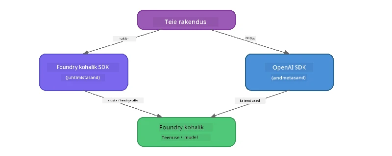

# Osa 3: Foundry Local SDK kasutamine koos OpenAI-ga

## Ülevaade

Esimeses osas kasutasite Foundry Local CLI-d mudelite interaktiivseks käivitamiseks. Teises osas uurisite põhjalikult SDK API pindu. Nüüd õpite, kuidas **integreerida Foundry Local oma rakendustesse** kasutades SDK-d ja OpenAI-ga ühilduvat API-d.

Foundry Local pakub SDK-sid kolmele keelele. Valige endale sobivaim - kontseptsioonid on kõigis kolmes keeles identsed.

## Õppe eesmärgid

Selle töötoa lõpuks oskate:

- Paigaldada Foundry Local SDK oma keele jaoks (Python, JavaScript või C#)
- Algatada `FoundryLocalManager`, et käivitada teenus, kontrollida vahemälu, alla laadida ja laadida mudel
- Ühenduda kohalikust mudelist OpenAI SDK abil
- Saata vestluse täiendusi ja töödelda voo vastuseid
- Mõista dünaamilist pordi arhitektuuri

---

## Eeltingimused

Lõpetage esmalt [Osa 1: Tutvumine Foundry Localiga](part1-getting-started.md) ja [Osa 2: Foundry Local SDK põhjalik juhend](part2-foundry-local-sdk.md).

Paigaldage **üks** järgmistest keele keskkondadest:
- **Python 3.9+** - [python.org/downloads](https://www.python.org/downloads/)
- **Node.js 18+** - [nodejs.org](https://nodejs.org/)
- **.NET 9.0+** - [dot.net/download](https://dotnet.microsoft.com/download)

---

## Kontseptsioon: Kuidas SDK töötab

Foundry Local SDK haldab **juhtimistasandit** (teenuse käivitamine, mudelite allalaadimine), samal ajal kui OpenAI SDK tegeleb **andmetasandiga** (käsu saatmine, vastuse saamine).



---

## Töötoa harjutused

### Harjutus 1: Seadista oma keskkond

<details>
<summary><b>🐍 Python</b></summary>

```bash
cd python
python -m venv venv

# Aktiveeri virtuaalne keskkond:
# Windows (PowerShell):
venv\Scripts\Activate.ps1
# Windows (Käsurida):
venv\Scripts\activate.bat
# macOS:
source venv/bin/activate

pip install -r requirements.txt
```

Fail `requirements.txt` paigaldab:
- `foundry-local-sdk` - Foundry Local SDK (imporditakse kui `foundry_local`)
- `openai` - OpenAI Python SDK
- `agent-framework` - Microsoft Agent Framework (kasutatakse hilisemates osades)

</details>

<details>
<summary><b>📘 JavaScript</b></summary>

```bash
cd javascript
npm install
```

Fail `package.json` paigaldab:
- `foundry-local-sdk` - Foundry Local SDK
- `openai` - OpenAI Node.js SDK

</details>

<details>
<summary><b>💜 C#</b></summary>

```bash
cd csharp
dotnet restore
dotnet build
```

Fail `csharp.csproj` kasutab:
- `Microsoft.AI.Foundry.Local` - Foundry Local SDK (NuGet)
- `OpenAI` - OpenAI C# SDK (NuGet)

> **Projekti ülesehitus:** C# projektis on `Program.cs` käsurea marsruuter, mis suunab eraldi näidiste failidesse. Käivitage selle osa jaoks `dotnet run chat` (või ainult `dotnet run`). Teistes osades kasutage `dotnet run rag`, `dotnet run agent` ja `dotnet run multi`.

</details>

---

### Harjutus 2: Lihtne vestluse lõpuleviimine

Avage oma keele põhivestluse näide ja uurige koodi. Iga skript järgib sama kolmetapilist mustrit:

1. **Teenuse alustamine** - `FoundryLocalManager` käivitab Foundry Local runtime'i
2. **Mudelil allalaadimine ja laadimine** - kontrollige vahemälu, laadige vajadusel alla, seejärel laadige mällu
3. **Loo OpenAI klient** - ühenduge kohaliku lõpp-punktiga ja saatke voogesitusega vestluse täiendusi

<details>
<summary><b>🐍 Python - <code>python/foundry-local.py</code></b></summary>

```python
import sys
import openai
from foundry_local import FoundryLocalManager

alias = "phi-3.5-mini"

# Samm 1: Loo FoundryLocalManager ja alusta teenust
print("Starting Foundry Local service...")
manager = FoundryLocalManager()
manager.start_service()

# Samm 2: Kontrolli, kas mudel on juba alla laetud
cached = manager.list_cached_models()
catalog_info = manager.get_model_info(alias)
is_cached = any(m.id == catalog_info.id for m in cached) if catalog_info else False

if is_cached:
    print(f"Model already downloaded: {alias}")
else:
    print(f"Downloading model: {alias} (this may take several minutes)...")
    manager.download_model(alias)
    print(f"Download complete: {alias}")

# Samm 3: Laadi mudel mällu
print(f"Loading model: {alias}...")
manager.load_model(alias)

# Loo OpenAI klient, mis suunab kohalikule Foundry teenusele
client = openai.OpenAI(
    base_url=manager.endpoint,   # Dünaamiline port - ära iial jäta fikseeritud väärtust!
    api_key=manager.api_key
)

# Genereeri voogedastus vestluse lõpetamiseks
stream = client.chat.completions.create(
    model=manager.get_model_info(alias).id,
    messages=[{"role": "user", "content": "What is the golden ratio?"}],
    stream=True,
)

for chunk in stream:
    if chunk.choices[0].delta.content is not None:
        print(chunk.choices[0].delta.content, end="", flush=True)
print()
```

**Käivita:**
```bash
python foundry-local.py
```

</details>

<details>
<summary><b>📘 JavaScript - <code>javascript/foundry-local.mjs</code></b></summary>

```javascript
import { OpenAI } from "openai";
import { FoundryLocalManager } from "foundry-local-sdk";

const alias = "phi-3.5-mini";

// Samm 1: Käivita Foundry kohalik teenus
console.log("Starting Foundry Local service...");
FoundryLocalManager.create({ appName: "FoundryLocalWorkshop" });
const manager = FoundryLocalManager.instance;
await manager.startWebService();

// Samm 2: Kontrolli, kas mudel on juba alla laaditud
const catalog = manager.catalog;
const model = await catalog.getModel(alias);

if (model.isCached) {
  console.log(`Model already downloaded: ${alias}`);
} else {
  console.log(`Downloading model: ${alias} (this may take several minutes)...`);
  await model.download();
  console.log(`Download complete: ${alias}`);
}

// Samm 3: Laadi mudel mällu
console.log(`Loading model: ${alias}...`);
await model.load();
console.log(`Model loaded: ${model.id}`);

// Loo OpenAI klient, mis on suunatud kohalikule Foundry teenusele
const client = new OpenAI({
  baseURL: manager.urls[0] + "/v1",   // Dünaamiline port - ärge kunagi koodis kindlaks määrake!
  apiKey: "foundry-local",
});

// Genereeri voogedastusega vestluse täiendamist
const stream = await client.chat.completions.create({
  model: model.id,
  messages: [{ role: "user", content: "What is the golden ratio?" }],
  stream: true,
});

for await (const chunk of stream) {
  if (chunk.choices[0]?.delta?.content) {
    process.stdout.write(chunk.choices[0].delta.content);
  }
}
console.log();
```

**Käivita:**
```bash
node foundry-local.mjs
```

</details>

<details>
<summary><b>💜 C# - <code>csharp/BasicChat.cs</code></b></summary>

```csharp
using Microsoft.AI.Foundry.Local;
using Microsoft.Extensions.Logging.Abstractions;
using OpenAI;
using OpenAI.Chat;
using System.ClientModel;

var alias = "phi-3.5-mini";

// Step 1: Start the Foundry Local service
Console.WriteLine("Starting Foundry Local service...");
await FoundryLocalManager.CreateAsync(
    new Configuration
    {
        AppName = "FoundryLocalSamples",
        Web = new Configuration.WebService { Urls = "http://127.0.0.1:0" }
    }, NullLogger.Instance, default);
var manager = FoundryLocalManager.Instance;
await manager.StartWebServiceAsync(default);

// Step 2: Get the model from the catalog
var catalog = await manager.GetCatalogAsync(default);
var model = await catalog.GetModelAsync(alias, default);

// Step 3: Check if the model is already downloaded
var isCached = await model.IsCachedAsync(default);

if (isCached)
{
    Console.WriteLine($"Model already downloaded: {alias}");
}
else
{
    Console.WriteLine($"Downloading model: {alias} (this may take several minutes)...");
    await model.DownloadAsync(null, default);
    Console.WriteLine($"Download complete: {alias}");
}

// Step 4: Load the model into memory
Console.WriteLine($"Loading model: {alias}...");
await model.LoadAsync(default);
Console.WriteLine($"Loaded model: {model.Id}");
Console.WriteLine($"Endpoint: {manager.Urls[0]}");

// Create OpenAI client pointing to the LOCAL Foundry service
var key = new ApiKeyCredential("foundry-local");
var client = new OpenAIClient(key, new OpenAIClientOptions
{
    Endpoint = new Uri(manager.Urls[0] + "/v1")  // Dynamic port - never hardcode!
});

var chatClient = client.GetChatClient(model.Id);

// Stream a chat completion
var completionUpdates = chatClient.CompleteChatStreaming("What is the golden ratio?");

foreach (var update in completionUpdates)
{
    if (update.ContentUpdate.Count > 0)
    {
        Console.Write(update.ContentUpdate[0].Text);
    }
}
Console.WriteLine();
```

**Käivita:**
```bash
dotnet run chat
```

</details>

---

### Harjutus 3: Eksperimenteerimine promptidega

Kui teie põhinäide töötab, proovige koodi muuta:

1. **Muuda kasutaja sõnumit** - proovi erinevaid küsimusi
2. **Lisa süsteemiprompt** - anna mudelile isikupära
3. **Lülita voogesitus välja** - sea `stream=False` ja prindi kogu vastus korraga
4. **Proovi teist mudelit** - muuda alias `phi-3.5-mini` mõneks teiseks mudeliks, mis saadaval `foundry model list` käsuga

<details>
<summary><b>🐍 Python</b></summary>

```python
# Lisa süsteemi prompt - anna mudelile isikupära:
stream = client.chat.completions.create(
    model=manager.get_model_info(alias).id,
    messages=[
        {"role": "system", "content": "You are a pirate. Answer everything in pirate speak."},
        {"role": "user", "content": "What is the golden ratio?"}
    ],
    stream=True,
)

# Või lülita voogesitus välja:
response = client.chat.completions.create(
    model=manager.get_model_info(alias).id,
    messages=[{"role": "user", "content": "What is the golden ratio?"}],
    stream=False,
)
print(response.choices[0].message.content)
```

</details>

<details>
<summary><b>📘 JavaScript</b></summary>

```javascript
// Lisa süsteemi viip - määra mudelile isik:
const stream = await client.chat.completions.create({
  model: modelInfo.id,
  messages: [
    { role: "system", content: "You are a pirate. Answer everything in pirate speak." },
    { role: "user", content: "What is the golden ratio?" },
  ],
  stream: true,
});

// Või lülita voogedastus välja:
const response = await client.chat.completions.create({
  model: modelInfo.id,
  messages: [{ role: "user", content: "What is the golden ratio?" }],
  stream: false,
});
console.log(response.choices[0].message.content);
```

</details>

<details>
<summary><b>💜 C#</b></summary>

```csharp
// Add a system prompt - give the model a persona:
var completionUpdates = chatClient.CompleteChatStreaming(
    new ChatMessage[]
    {
        new SystemChatMessage("You are a pirate. Answer everything in pirate speak."),
        new UserChatMessage("What is the golden ratio?")
    }
);

// Or turn off streaming:
var response = chatClient.CompleteChat("What is the golden ratio?");
Console.WriteLine(response.Value.Content[0].Text);
```

</details>

---

### SDK meetodite viide

<details>
<summary><b>🐍 Python SDK meetodid</b></summary>

| Meetod | Eesmärk |
|--------|---------|
| `FoundryLocalManager()` | Loo manageri eksemplar |
| `manager.start_service()` | Käivita Foundry Local teenus |
| `manager.list_cached_models()` | Näita seadmesse juba alla laaditud mudeleid |
| `manager.get_model_info(alias)` | Hangi mudeli ID ja metaandmed |
| `manager.download_model(alias, progress_callback=fn)` | Laadi mudel alla koos valikulise edenemisfunktsiooniga |
| `manager.load_model(alias)` | Laadi mudel mällu |
| `manager.endpoint` | Hangi dünaamiline lõpp-punkti URL |
| `manager.api_key` | Hangi API võti (kohalikus kasutuses kohatäitja) |

</details>

<details>
<summary><b>📘 JavaScript SDK meetodid</b></summary>

| Meetod | Eesmärk |
|--------|---------|
| `FoundryLocalManager.create({ appName })` | Loo manageri eksemplar |
| `FoundryLocalManager.instance` | Juurdepääs singleton managerile |
| `await manager.startWebService()` | Käivita Foundry Local teenus |
| `await manager.catalog.getModel(alias)` | Hangi mudel kataloogist |
| `model.isCached` | Kontrolli, kas mudel on juba alla laaditud |
| `await model.download()` | Laadi mudel alla |
| `await model.load()` | Laadi mudel mällu |
| `model.id` | Hangi mudeli ID OpenAI API kõnede jaoks |
| `manager.urls[0] + "/v1"` | Hangi dünaamiline lõpp-punkti URL |
| `"foundry-local"` | API võti (kohatäitja kohalikuks kasutuseks) |

</details>

<details>
<summary><b>💜 C# SDK meetodid</b></summary>

| Meetod | Eesmärk |
|--------|---------|
| `FoundryLocalManager.CreateAsync(config)` | Loo ja initsialiseeri manager |
| `manager.StartWebServiceAsync()` | Käivita Foundry Local veebiteenus |
| `manager.GetCatalogAsync()` | Hangi mudelikataloog |
| `catalog.ListModelsAsync()` | Näita kõiki saadaval olevaid mudeleid |
| `catalog.GetModelAsync(alias)` | Hangi mudel alias järgi |
| `model.IsCachedAsync()` | Kontrolli, kas mudel on allalaaditud |
| `model.DownloadAsync()` | Laadi mudel alla |
| `model.LoadAsync()` | Laadi mudel mällu |
| `manager.Urls[0]` | Hangi dünaamiline lõpp-punkti URL |
| `new ApiKeyCredential("foundry-local")` | API võtme mandaat kohalikuks kasutuseks |

</details>

---

### Harjutus 4: Native ChatClient kasutamine (alternatiiv OpenAI SDK-le)

Harjutustes 2 ja 3 kasutasite vestluse lõpuleviimiseks OpenAI SDK-d. JavaScripti ja C# SDK-d pakuvad ka **natiivset ChatClienti**, mis võimaldab OpenAI SDK täielikult välja jätta.

<details>
<summary><b>📘 JavaScript - <code>model.createChatClient()</code></b></summary>

```javascript
import { FoundryLocalManager } from "foundry-local-sdk";

const alias = "phi-3.5-mini";

FoundryLocalManager.create({ appName: "ChatClientDemo" });
const manager = FoundryLocalManager.instance;
await manager.startWebService();

const model = await manager.catalog.getModel(alias);
if (!model.isCached) await model.download();
await model.load();

// OpenAI impordit pole vaja — saa klient otse mudelist
const chatClient = model.createChatClient();

// Mittevoogesituse lõpetamine
const response = await chatClient.completeChat([
  { role: "system", content: "You are a pirate. Answer everything in pirate speak." },
  { role: "user", content: "What is the golden ratio?" }
]);
console.log(response.choices[0].message.content);

// Voogesituse lõpetamine (kasutab tagasikutsumise mustrit)
await chatClient.completeStreamingChat(
  [{ role: "user", content: "What is the golden ratio?" }],
  (chunk) => {
    if (chunk.choices?.[0]?.delta?.content) {
      process.stdout.write(chunk.choices[0].delta.content);
    }
  }
);
console.log();
```

> **Märkus:** ChatClient'i `completeStreamingChat()` kasutab **tagasikutsumise (callback)** mustrit, mitte asünkroonset iteratorit. Sisestage teine argument funktsioonina.

</details>

<details>
<summary><b>💜 C# - <code>model.GetChatClientAsync()</code></b></summary>

```csharp
var catalog = await manager.GetCatalogAsync(default);
var model = await catalog.GetModelAsync("phi-3.5-mini", default);
if (!await model.IsCachedAsync(default))
    await model.DownloadAsync(null, default);
await model.LoadAsync(default);

// No OpenAI NuGet needed — get a client directly from the model
var chatClient = await model.GetChatClientAsync(default);

// Use it like a standard OpenAI ChatClient
var response = chatClient.CompleteChat("What is the golden ratio?");
Console.WriteLine(response.Value.Content[0].Text);
```

</details>

> **Millal mida kasutada:**
> | Lähenemine | Sobib kõige paremini |
> |-----------|---------------------|
> | OpenAI SDK | Täielik parameetrite kontroll, tootmisrakendused, olemasolev OpenAI kood |
> | Native ChatClient | Kiire prototüüpimine, vähem sõltuvusi, lihtsam seadistus |

---

## Põhisõnumid

| Kontseptsioon | Mida õppisite |
|--------------|---------------|
| Juhtimistasand | Foundry Local SDK haldab teenuse käivitamist ja mudelite laadimist |
| Andmetasand | OpenAI SDK tegeleb vestluste lõpuleviimise ja voo vastustega |
| Dünaamilised pordid | Kasutage alati SDK-d lõpp-punkti leidmiseks; ärge kunagi fikseerige URL-e |
| Mitme keele tugi | Sama koodimuster töötab Pythonis, JavaScriptis ja C#-s |
| OpenAI ühilduvus | Täielik OpenAI API ühilduvus tähendab, et olemasolev OpenAI kood töötab minimaalsete muudatustega |
| Natiivne ChatClient | `createChatClient()` (JS) / `GetChatClientAsync()` (C#) pakub alternatiivi OpenAI SDK-le |

---

## Järgmised sammud

Jätkake [Osa 4: RAG-rakenduse ehitamine](part4-rag-fundamentals.md), et õppida, kuidas luua päringupõhise genereerimise pipeline, mis töötab täielikult teie seadmes.